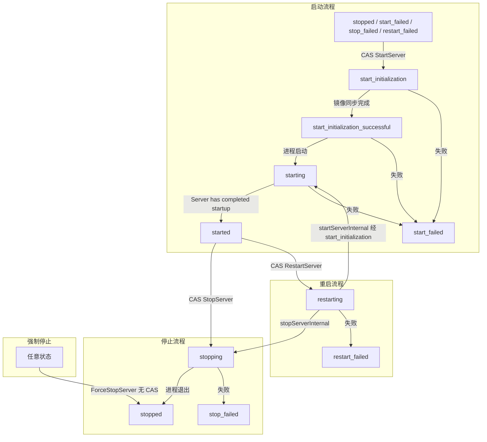

# 实例状态控制与互斥关系

## 状态枚举

| 状态值 | 中文名 | 说明 |
|--------|--------|------|
| `start_initialization` | 初始化中 | CAS 抢占后，正在同步镜像目录 |
| `start_initialization_successful` | 初始化完成 | 镜像已建立 + 进程已启动，等待进程就绪 |
| `starting` | 启动中 | 进程已启动，等待 "Server has completed startup" |
| `started` | 运行中 | 服务器正常运行 |
| `stopping` | 停止中 | 正在优雅关闭（RCON saveworld → DoExit） |
| `stopped` | 已停止 | 服务器已停止 |
| `start_failed` | 启动失败 | 启动过程中发生错误 |
| `stop_failed` | 停止失败 | 停止过程中发生错误 |
| `restart_failed` | 重启失败 | 重启过程中发生错误 |
| `restarting` | 重启中 | 正在执行重启（stop → start） |
| `restarted` | 已重启 | 重启完成 |

---

## 状态流转图



---

## 操作权限矩阵

### 单实例操作

| 当前状态 | Start | Stop | Restart | ForceStop |
|----------|:-----:|:----:|:-------:|:---------:|
| `stopped` | ✅ | ❌ | ❌ | ❌ |
| `start_failed` | ✅ | ❌ | ❌ | ✅ |
| `stop_failed` | ✅ | ❌ | ❌ | ✅ |
| `restart_failed` | ✅ | ❌ | ❌ | ✅ |
| `start_initialization` | ❌ | ❌ | ❌ | ✅ |
| `start_initialization_successful` | ❌ | ❌ | ❌ | ✅ |
| `starting` | ❌ | ❌ | ❌ | ✅ |
| `started` | ❌ | ✅ | ✅ | ✅ |
| `stopping` | ❌ | ❌ | ❌ | ✅ |
| `restarting` | ❌ | ❌ | ❌ | ✅ |

**规则**：
- **Start**：仅允许在干净停止态（`stopped` + 失败态）
- **Stop / Restart**：仅允许在 `started`（服务器真正运行时才可优雅操作）
- **ForceStop**：任何非 `stopped` 状态均可使用（绕过 CAS，直接杀进程）

### 批量操作（Start All / Stop All / Restart All）

| 条件 | 行为 |
|------|------|
| 目标实例在 `start_initialization` | **跳过**该实例（与其他中间态相同） |
| 目标实例在中间态（`starting`/`stopping`/`restarting`） | **跳过**该实例 |
| 目标实例在失败态 | Stop/Restart 跳过，Start 允许 |

---

## 并行启动能力

镜像方式启动后，每个实例拥有独立的镜像目录（NTFS Junction），不再占用共享资源。
因此**全局互斥规则已移除**：多个实例可以并行启动，互不阻塞。

`isOperationAllowed()` 仅检查**目标实例自身**的当前状态，不再检查其他实例的状态。
`IsAnyInstanceInitializing()` 和 `WaitForNoInitializing()` 已删除。

**例外**：`ForceStopServer` 绕过 CAS 检查，直接杀进程 + 清理镜像。

---

## CAS 原子状态转换

所有优雅操作通过 `compareAndSwapState` 原子执行：

```
1. 加 sm.mu.Lock()
2. 读取目标实例最新状态
3. 检查是否在 allowedStates 中
4. 如果允许 → 写入新状态 + Broadcast
5. 释放锁
```

| 操作 | CAS 源状态 | CAS 目标状态 |
|------|-----------|-------------|
| StartServer | `stopped`, `start_failed`, `stop_failed`, `restart_failed`, `""` | `start_initialization` |
| StopServer | `started` | `stopping` |
| RestartServer | `started` | `restarting` |

---

## ForceStop 与优雅 Stop 的区别

| | 优雅 Stop | ForceStop |
|---|----------|-----------|
| **CAS 检查** | ✅ 需要 `started` | ❌ 无 CAS |
| **等待初始化** | N/A | 镜像方式无需等待 |
| **关闭方式** | RCON `saveworld` → `DoExit` → 等待进程退出（5 分钟超时） | `taskkill /F` 直接杀进程 |
| **状态写入** | `stopping` → `stopped` / `stop_failed` | 直接写 `stopped` |
| **v2 镜像清理** | 不涉及 | ✅ CleanupInstanceMirror |
| **适用场景** | 服务器正常运行时 | 异常状态、卡死、需要立即终止 |

---

## 卡住状态自动恢复

**场景**：进程崩溃 / OOM / 断电导致状态停留在中间态。

**机制**：`StateManager` 内置后台 watcher，每 30 秒扫描一次。

**恢复条件**：
- 状态在 `start_initialization` / `starting` / `start_initialization_successful` / `stopping`
- `OperationTime` 距今超过 **10 分钟**
- 进程不存在（端口未监听 + PID 已退出）

**恢复动作**：写入 `stopped` 状态 + `Broadcast` 唤醒所有等待者。

**生命周期**：`NewStateManager` 自动启动 watcher，`Close` 自动通过 `context.Cancel` 关闭。

---

## 状态分类速查

| 分类 | 状态 | 含义 |
|------|------|------|
| **干净停止态** | `stopped`, `start_failed`, `stop_failed`, `restart_failed`, `""` | 可以 Start / Delete |
| **运行态** | `started` | 可以 Stop / Restart / RCON |
| **中间态** | `start_initialization`, `start_initialization_successful`, `starting`, `stopping`, `restarting` | 仅 ForceStop 可用（镜像方式下多实例可并行启动） |
| **失败态** | `start_failed`, `stop_failed`, `restart_failed` | 可以 Start（重试），不可 Stop/Restart |
