# ARK: Survival Ascended - 生物 ID 完整列表

> **来源**: [ARK Wiki - Creature IDs](https://ark.wiki.gg/wiki/Creature_IDs) | **日期**: 2026-06-19
> **共 16 个分类, 529 个生物** | 用于前端可视化配置基础资料

---

## 使用说明

### 生成生物命令

```
# 使用 Entity ID
admincheat Summon <entity_id>

# 使用 GMSummon (跟随玩家, 指定等级)
admincheat GMSummon <entity_id> <level>

# 使用 SpawnDino (指定坐标和等级)
admincheat SpawnDino "Blueprint'<blueprint_path>'" <x> <y> <z> <level>
```

### 示例

```
# 召唤150级霸王龙 (跟随)
admincheat GMSummon Rex_Character_BP_C 150

# 在坐标0,0,0生成150级霸王龙
admincheat SpawnDino "Blueprint'/Game/PrimalEarth/Dinos/Rex/Rex_Character_BP.Rex_Character_BP'" 0 0 0 150
```

### 图标 URL

```
../icon/creatures_256px/<name>_<category>_<nameTag>_<entityID>_256px.png
```

---

## 目录

- [Creature IDs (Creature IDs) — 161项]
- [Creatures of The Center (中心岛) — 1项]
- [Creatures of Scorched Earth (焦土) — 31项]
- [Creatures of Ragnarok (仙境) — 4项]
- [Creatures of Aberration (畸变) — 79项]
- [Creatures of Extinction (灭绝) — 40项]
- [Creatures of Valguero (瓦尔盖罗) — 4项]
- [Creatures of Genesis: Part 1 (创世纪1) — 80项]
- [Creatures of Crystal Isles (水晶岛) — 9项]
- [Creatures of Genesis: Part 2 (创世纪2) — 38项]
- [Creatures of Lost Island (失落岛) — 6项]
- [Creatures of Fjordur (菲约杜尔) — 4项]
- [Fantastic Tames (奇幻驯养) — 7项]
- [Creatures of Astraeos (Astraeos) — 2项]
- [Creatures of Aquatica (深海) — 55项]
- [Creatures of Lost Colony (失落殖民地) — 8项]

---

## Creature IDs (Creature IDs)

> 共 161 个生物

| # | 图标 | 名称 | 分类 | Name Tag | Entity ID | Icon URL | Blueprint Path |
|---|------|------|------|----------|-----------|----------|----------------|
| 1 |  | Achatina | 无脊椎 | Achatina | `Achatina_Character_BP_C` | ../icon/creatures_256px/Achatina_Invertebrates_Achatina_Achatina_Character_BP_C_256px.png | "Blueprint'/Game/PrimalEarth/Dinos/Achatina/Achatina_Character_BP.Achatina_Character_BP'" |
| 2 | 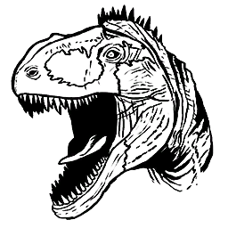 | Acrocanthosaurus | 恐龙 | Acrocanthosaurus | `Acrocanthosaurus_Character_BP_C` | ../icon/creatures_256px/Acrocanthosaurus_Dinosaurs_Acrocanthosaurus_Acrocanthosaurus_Character_BP_C_256px.png | "Blueprint'/Game/ASA/Dinos/Acrocanthosaurus/Acrocanthosaurus_Character_BP.Acrocanthosaurus_Character |
| 3 |  | Allosaurus | 恐龙 | Allo | `Allo_Character_BP_C` | ../icon/creatures_256px/Allosaurus_Dinosaurs_Allo_Allo_Character_BP_C_256px.png | "Blueprint'/Game/PrimalEarth/Dinos/Allosaurus/Allo_Character_BP.Allo_Character_BP'" |
| 4 | 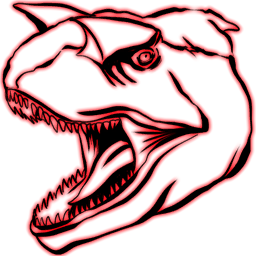 | Alpha Carno | Alpha Creatures | Elite Carno | `MegaCarno_Character_BP_C` | ../icon/creatures_256px/Alpha_Carno_Alpha_Creatures_Elite_Carno_MegaCarno_Character_BP_C_256px.png | "Blueprint'/Game/PrimalEarth/Dinos/Carno/MegaCarno_Character_BP.MegaCarno_Character_BP'" |
| 5 |  | Alpha Leedsichthys | Alpha Creatures | Leedsichthys | `Alpha_Leedsichthys_Character_BP_C` | ../icon/creatures_256px/Alpha_Leedsichthys_Alpha_Creatures_Leedsichthys_Alpha_Leedsichthys_Character_BP_C_256px.png | "Blueprint'/Game/PrimalEarth/Dinos/Leedsichthys/Alpha_Leedsichthys_Character_BP.Alpha_Leedsichthys_C |
| 6 |  | Alpha Megalodon | Alpha Creatures | Elite Mega | `MegaMegalodon_Character_BP_C` | ../icon/creatures_256px/Alpha_Megalodon_Alpha_Creatures_Elite_Mega_MegaMegalodon_Character_BP_C_256px.png | "Blueprint'/Game/PrimalEarth/Dinos/Megalodon/MEgaMegalodon_Character_BP.MegaMegalodon_Character_BP'" |
| 7 |  | Alpha Mosasaur | Alpha Creatures | Mosasaur | `Mosa_Character_BP_Mega_C` | ../icon/creatures_256px/Alpha_Mosasaur_Alpha_Creatures_Mosasaur_Mosa_Character_BP_Mega_C_256px.png | "Blueprint'/Game/PrimalEarth/Dinos/Mosasaurus/Mosa_Character_BP_Mega.Mosa_Character_BP_Mega'" |
| 8 |  | Alpha Raptor | Alpha Creatures | Elite Raptor | `MegaRaptor_Character_BP_C` | ../icon/creatures_256px/Alpha_Raptor_Alpha_Creatures_Elite_Raptor_MegaRaptor_Character_BP_C_256px.png | "Blueprint'/Game/PrimalEarth/Dinos/Raptor/MegaRaptor_Character_BP.MegaRaptor_Character_BP'" |
| 9 |  | Alpha T-Rex | Alpha Creatures | Elite Rex | `MegaRex_Character_BP_C` | ../icon/creatures_256px/Alpha_T-Rex_Alpha_Creatures_Elite_Rex_MegaRex_Character_BP_C_256px.png | "Blueprint'/Game/PrimalEarth/Dinos/Rex/MegaRex_Character_BP.MegaRex_Character_BP'" |
| 10 |  | Alpha Tusoteuthis | Alpha Creatures | Tusoteuthis | `Mega_Tusoteuthis_Character_BP_C` | ../icon/creatures_256px/Alpha_Tusoteuthis_Alpha_Creatures_Tusoteuthis_Mega_Tusoteuthis_Character_BP_C_256px.png | "Blueprint'/Game/PrimalEarth/Dinos/Tusoteuthis/Mega_Tusoteuthis_Character_BP.Mega_Tusoteuthis_Charac |
| 11 |  | Ammonite | 无脊椎 | Ammonite | `Ammonite_Character_C` | ../icon/creatures_256px/Ammonite_Invertebrates_Ammonite_Ammonite_Character_C_256px.png | "Blueprint'/Game/PrimalEarth/Dinos/Ammonite/Ammonite_Character.Ammonite_Character'" |
| 12 |  | Anglerfish | 鱼类 | Angler | `Angler_Character_BP_C` | ../icon/creatures_256px/Anglerfish_Fish_Angler_Angler_Character_BP_C_256px.png | "Blueprint'/Game/PrimalEarth/Dinos/Anglerfish/Angler_Character_BP.Angler_Character_BP'" |
| 13 |  | Ankylosaurus | 恐龙 | Anky | `Ankylo_Character_BP_C` | ../icon/creatures_256px/Ankylosaurus_Dinosaurs_Anky_Ankylo_Character_BP_C_256px.png | "Blueprint'/Game/PrimalEarth/Dinos/Ankylo/Ankylo_Character_BP.Ankylo_Character_BP'" |
| 14 |  | Araneo | 无脊椎 | Spider | `SpiderS_Character_BP_C` | ../icon/creatures_256px/Araneo_Invertebrates_Spider_SpiderS_Character_BP_C_256px.png | "Blueprint'/Game/PrimalEarth/Dinos/Spider-Small/SpiderS_Character_BP.SpiderS_Character_BP'" |
| 15 |  | Archaeopteryx | 鸟类 | Archa | `Archa_Character_BP_C` | ../icon/creatures_256px/Archaeopteryx_Birds_Archa_Archa_Character_BP_C_256px.png | "Blueprint'/Game/PrimalEarth/Dinos/Archaeopteryx/Archa_Character_BP.Archa_Character_BP'" |
| 16 | 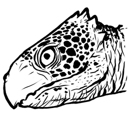 | Archelon | 爬行 | Archelon | `Archelon_Character_BP_ASA_C` | ../icon/creatures_256px/Archelon_Reptiles_Archelon_Archelon_Character_BP_ASA_C_256px.png | "Blueprint'/Game/ASA/Dinos/Archelon/Dinos/Archelon_Character_BP_ASA.Archelon_Character_BP_ASA'" |
| 17 |  | Argentavis | 鸟类 | Argent | `Argent_Character_BP_C` | ../icon/creatures_256px/Argentavis_Birds_Argent_Argent_Character_BP_C_256px.png | "Blueprint'/Game/PrimalEarth/Dinos/Argentavis/Argent_Character_BP.Argent_Character_BP'" |
| 18 |  | Arthropluera | 无脊椎 | Arthro | `Arthro_Character_BP_C` | ../icon/creatures_256px/Arthropluera_Invertebrates_Arthro_Arthro_Character_BP_C_256px.png | "Blueprint'/Game/PrimalEarth/Dinos/Arthropluera/Arthro_Character_BP.Arthro_Character_BP'" |
| 19 |  | Baryonyx | 恐龙 | Baryonyx | `Baryonyx_Character_BP_C` | ../icon/creatures_256px/Baryonyx_Dinosaurs_Baryonyx_Baryonyx_Character_BP_C_256px.png | "Blueprint'/Game/PrimalEarth/Dinos/Baryonyx/Baryonyx_Character_BP.Baryonyx_Character_BP'" |
| 20 |  | Basilosaurus | 哺乳 | Basilosaurus | `Basilosaurus_Character_BP_C` | ../icon/creatures_256px/Basilosaurus_Mammals_Basilosaurus_Basilosaurus_Character_BP_C_256px.png | "Blueprint'/Game/PrimalEarth/Dinos/Basilosaurus/Basilosaurus_Character_BP.Basilosaurus_Character_BP' |
| 21 |  | Beelzebufo | 爬行 | Toad | `Toad_Character_BP_C` | ../icon/creatures_256px/Beelzebufo_Reptiles_Toad_Toad_Character_BP_C_256px.png | "Blueprint'/Game/PrimalEarth/Dinos/Toad/Toad_Character_BP.Toad_Character_BP'" |
| 22 | Bunny Dodo | Bunny Dodo | Event Creatures | Dodo | `` | N/A | "Blueprint'/Game/PrimalEarth/Dinos/Dodo/Dodo_Character_BP_Bunny.Dodo_Character_BP_Bunny'" |
| 23 | Bunny Oviraptor | Bunny Oviraptor | Event Creatures | Ovi | `` | N/A | "Blueprint'/Game/PrimalEarth/Dinos/Oviraptor/BunnyOviraptor_Character_BP.BunnyOviraptor_Character_BP |
| 24 |  | Brontosaurus | 恐龙 | Bronto | `Sauropod_Character_BP_C` | ../icon/creatures_256px/Brontosaurus_Dinosaurs_Bronto_Sauropod_Character_BP_C_256px.png | "Blueprint'/Game/PrimalEarth/Dinos/Sauropod/Sauropod_Character_BP.Sauropod_Character_BP'" |
| 25 |  | Broodmother Lysrix | Boss |  | `SpiderL_Character_BP_C` | ../icon/creatures_256px/Broodmother_Lysrix_Bosses_unknown_SpiderL_Character_BP_C_256px.png | "Blueprint'/Game/PrimalEarth/Dinos/Spider-Large/SpiderL_Character_BP.SpiderL_Character_BP'" |
| 26 |  | Broodmother Lysrix (Alpha) | Boss |  | `SpiderL_Character_BP_Hard_C` | ../icon/creatures_256px/Broodmother_Lysrix_(Alpha)_Bosses_unknown_SpiderL_Character_BP_Hard_C_256px.png | "Blueprint'/Game/PrimalEarth/Dinos/Spider-Large/SpiderL_Character_BP_Hard.SpiderL_Character_BP_Hard' |
| 27 |  | Broodmother Lysrix (Beta) | Boss |  | `SpiderL_Character_BP_Medium_C` | ../icon/creatures_256px/Broodmother_Lysrix_(Beta)_Bosses_unknown_SpiderL_Character_BP_Medium_C_256px.png | "Blueprint'/Game/PrimalEarth/Dinos/Spider-Large/SpiderL_Character_BP_Medium.SpiderL_Character_BP_Med |
| 28 |  | Broodmother Lysrix (Gamma) | Boss |  | `SpiderL_Character_BP_Easy_C` | ../icon/creatures_256px/Broodmother_Lysrix_(Gamma)_Bosses_unknown_SpiderL_Character_BP_Easy_C_256px.png | "Blueprint'/Game/PrimalEarth/Dinos/Spider-Large/SpiderL_Character_BP_Easy.SpiderL_Character_BP_Easy' |
| 29 |  | Carcharodontosaurus | 恐龙 | Carcha | `Carcha_Character_BP_C` | ../icon/creatures_256px/Carcharodontosaurus_Dinosaurs_Carcha_Carcha_Character_BP_C_256px.png | "Blueprint'/Game/PrimalEarth/Dinos/Carcharodontosaurus/Carcha_Character_BP.Carcha_Character_BP'" |
| 30 |  | Carbonemys | 爬行 | Turtle | `Turtle_Character_BP_C` | ../icon/creatures_256px/Carbonemys_Reptiles_Turtle_Turtle_Character_BP_C_256px.png | "Blueprint'/Game/PrimalEarth/Dinos/Turtle/Turtle_Character_BP.Turtle_Character_BP'" |
| 31 |  | Carnotaurus | 恐龙 | Carno | `Carno_Character_BP_C` | ../icon/creatures_256px/Alpha_Carno_Alpha_Creatures_Elite_Carno_MegaCarno_Character_BP_C_256px.png | "Blueprint'/Game/PrimalEarth/Dinos/Carno/Carno_Character_BP.Carno_Character_BP'" |
| 32 |  | Castoroides | 哺乳 | Beaver | `Beaver_Character_BP_C` | ../icon/creatures_256px/Castoroides_Mammals_Beaver_Beaver_Character_BP_C_256px.png | "Blueprint'/Game/PrimalEarth/Dinos/Beaver/Beaver_Character_BP.Beaver_Character_BP'" |
| 33 |  | Cat | 哺乳 | Cat | `Cat_Character_BP_C` | ../icon/creatures_256px/Cat_Mammals_Cat_Cat_Character_BP_C_256px.png | "Blueprint'/Game/ASA/Dinos/Cat/Cat_Character_BP.Cat_Character_BP'" |
| 34 |  | Ceratosaurus | 恐龙 | CeratosaurusAA | `Ceratosaurus_Character_BP_ASA_C` | ../icon/creatures_256px/Ceratosaurus_Dinosaurs_CeratosaurusAA_Ceratosaurus_Character_BP_ASA_C_256px.png | "Blueprint'/Game/ASA/Dinos/Ceratosaurus/Dinos/Ceratosaurus_Character_BP_ASA.Ceratosaurus_Character_B |
| 35 |  | Chalicotherium | 哺乳 | Chalicotherium | `Chalico_Character_BP_C` | ../icon/creatures_256px/Chalicotherium_Mammals_Chalicotherium_Chalico_Character_BP_C_256px.png | "Blueprint'/Game/PrimalEarth/Dinos/Chalicotherium/Chalico_Character_BP.Chalico_Character_BP'" |
| 36 |  | Cnidaria | 无脊椎 | Cnidaria | `Cnidaria_Character_BP_C` | ../icon/creatures_256px/Cnidaria_Invertebrates_Cnidaria_Cnidaria_Character_BP_C_256px.png | "Blueprint'/Game/PrimalEarth/Dinos/Cnidaria/Cnidaria_Character_BP.Cnidaria_Character_BP'" |
| 37 |  | Coelacanth | 鱼类 | Coel | `Coel_Character_BP_C` | ../icon/creatures_256px/Coelacanth_Fish_Coel_Coel_Character_BP_C_256px.png | "Blueprint'/Game/PrimalEarth/Dinos/Coelacanth/Coel_Character_BP.Coel_Character_BP'" |
| 38 |  | Compy | 恐龙 | Compy | `Compy_Character_BP_C` | ../icon/creatures_256px/Compy_Dinosaurs_Compy_Compy_Character_BP_C_256px.png | "Blueprint'/Game/PrimalEarth/Dinos/Compy/Compy_Character_BP.Compy_Character_BP'" |
| 39 |  | Daeodon | 哺乳 | Daeodon | `Daeodon_Character_BP_C` | ../icon/creatures_256px/Daeodon_Mammals_Daeodon_Daeodon_Character_BP_C_256px.png | "Blueprint'/Game/PrimalEarth/Dinos/Daeodon/Daeodon_Character_BP.Daeodon_Character_BP'" |
| 40 |  | Deinosuchus | 爬行 | DeinosuchusAA | `Deinosuchusasa_Character_BP_C` | ../icon/creatures_256px/Deinosuchus_Reptiles_DeinosuchusAA_Deinosuchusasa_Character_BP_C_256px.png | "Blueprint'/Game/ASA/Dinos/Deinosuchus/Deinosuchusasa_Character_BP.Deinosuchusasa_Character_BP'" |
| 41 | 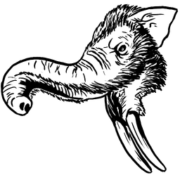 | Deinotherium | 哺乳 | DeinotheriumASA | `DeinotheriumASA_Character_BP_C` | ../icon/creatures_256px/Deinotherium_Mammals_DeinotheriumASA_DeinotheriumASA_Character_BP_C_256px.png | "Blueprint'/Game/ASA/Dinos/Deinotherium/Dinos/DeinotheriumASA_Character_BP.DeinotheriumASA_Character |
| 42 |  | Dilophosaur | 恐龙 | Dilo | `Dilo_Character_BP_C` | ../icon/creatures_256px/Corrupted_Dilophosaur_Dinosaurs_Dilo_Corrupt_Dilo_Character_BP_Corrupt_C_256px.png | "Blueprint'/Game/PrimalEarth/Dinos/Dilo/Dilo_Character_BP.Dilo_Character_BP'" |
| 43 |  | Dimetrodon | 恐龙 | Dimetro | `Dimetro_Character_BP_C` | ../icon/creatures_256px/Dimetrodon_Dinosaurs_Dimetro_Dimetro_Character_BP_C_256px.png | "Blueprint'/Game/PrimalEarth/Dinos/Dimetrodon/Dimetro_Character_BP.Dimetro_Character_BP'" |
| 44 |  | Dimorphodon | 恐龙 | Dimorph | `Dimorph_Character_BP_C` | ../icon/creatures_256px/Corrupted_Dimorphodon_Dinosaurs_Dimorph_Corrupt_Dimorph_Character_BP_Corrupt_C_256px.png | "Blueprint'/Game/PrimalEarth/Dinos/Dimorphodon/Dimorph_Character_BP.Dimorph_Character_BP'" |
| 45 |  | Diplocaulus | 两栖 | Diplocaulus | `Diplocaulus_Character_BP_C` | ../icon/creatures_256px/Diplocaulus_Amphibians_Diplocaulus_Diplocaulus_Character_BP_C_256px.png | "Blueprint'/Game/PrimalEarth/Dinos/Diplocaulus/Diplocaulus_Character_BP.Diplocaulus_Character_BP'" |
| 46 |  | Diplodocus | 恐龙 | Diplo | `Diplodocus_Character_BP_C` | ../icon/creatures_256px/Diplodocus_Dinosaurs_Diplo_Diplodocus_Character_BP_C_256px.png | "Blueprint'/Game/PrimalEarth/Dinos/Diplodocus/Diplodocus_Character_BP.Diplodocus_Character_BP'" |
| 47 |  | Dire Bear | 哺乳 | Direbear | `Direbear_Character_BP_C` | ../icon/creatures_256px/Dire_Bear_Mammals_Direbear_Direbear_Character_BP_C_256px.png | "Blueprint'/Game/PrimalEarth/Dinos/Direbear/Direbear_Character_BP.Direbear_Character_BP'" |
| 48 | 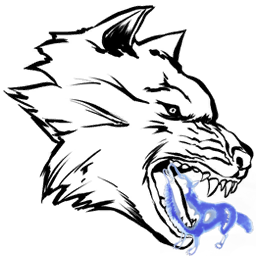 | Direwolf | 哺乳 | Direwolf | `Direwolf_Character_BP_C` | ../icon/creatures_256px/Direwolf_Ghost_Event_Creatures_Direwolf_Ghost_Direwolf_Character_BP_C_256px.png | "Blueprint'/Game/PrimalEarth/Dinos/Direwolf/Direwolf_Character_BP.Direwolf_Character_BP'" |
| 49 |  | Direwolf Ghost | Event Creatures | Direwolf | `Ghost_Direwolf_Character_BP_C` | ../icon/creatures_256px/Direwolf_Ghost_Event_Creatures_Direwolf_Ghost_Direwolf_Character_BP_C_256px.png | "Blueprint'/Game/PrimalEarth/Dinos/Direwolf/Ghost_Direwolf_Character_BP.Ghost_Direwolf_Character_BP' |
| 50 |  | Dodo | 鸟类 | Dodo | `Dodo_Character_BP_C` | ../icon/creatures_256px/Dodo_Birds_Dodo_Dodo_Character_BP_C_256px.png | "Blueprint'/Game/PrimalEarth/Dinos/Dodo/Dodo_Character_BP.Dodo_Character_BP'" |
| 51 |  | DodoRex | Event Creatures | DodoRex | `DodoRex_Character_BP_C` | ../icon/creatures_256px/DodoRex_Event_Creatures_DodoRex_DodoRex_Character_BP_C_256px.png | "Blueprint'/Game/PrimalEarth/Dinos/DodoRex/DodoRex_Character_BP.DodoRex_Character_BP'" |
| 52 |  | Doedicurus | 哺乳 | Doed | `Doed_Character_BP_C` | ../icon/creatures_256px/Doedicurus_Mammals_Doed_Doed_Character_BP_C_256px.png | "Blueprint'/Game/PrimalEarth/Dinos/Doedicurus/Doed_Character_BP.Doed_Character_BP'" |
| 53 |  | Dragon (Gamma) | Boss |  | `Dragon_Character_BP_Boss_Easy_C` | ../icon/creatures_256px/Dragon_(Gamma)_Bosses_unknown_Dragon_Character_BP_Boss_Easy_C_256px.png | "Blueprint'/Game/PrimalEarth/Dinos/Dragon/Dragon_Character_BP_Boss_Easy.Dragon_Character_BP_Boss_Eas |
| 54 |  | Dragon (Beta) | Boss |  | `Dragon_Character_BP_Boss_Medium_C` | ../icon/creatures_256px/Dragon_(Beta)_Bosses_unknown_Dragon_Character_BP_Boss_Medium_C_256px.png | "Blueprint'/Game/PrimalEarth/Dinos/Dragon/Dragon_Character_BP_Boss_Medium.Dragon_Character_BP_Boss_M |
| 55 |  | Dragon (Alpha) | Boss |  | `Dragon_Character_BP_Boss_Hard_C` | ../icon/creatures_256px/Dragon_(Alpha)_Bosses_unknown_Dragon_Character_BP_Boss_Hard_C_256px.png | "Blueprint'/Game/PrimalEarth/Dinos/Dragon/Dragon_Character_BP_Boss_Hard.Dragon_Character_BP_Boss_Har |
| 56 |  | Dung Beetle | 无脊椎 | Beetle | `DungBeetle_Character_BP_C` | ../icon/creatures_256px/Dung_Beetle_Invertebrates_Beetle_DungBeetle_Character_BP_C_256px.png | "Blueprint'/Game/PrimalEarth/Dinos/DungBeetle/DungBeetle_Character_BP.DungBeetle_Character_BP'" |
| 57 |  | Dunkleosteus | 鱼类 | Dunkle | `Dunkle_Character_BP_C` | ../icon/creatures_256px/Dunkleosteus_Fish_Dunkle_Dunkle_Character_BP_C_256px.png | "Blueprint'/Game/PrimalEarth/Dinos/Dunkleosteus/Dunkle_Character_BP.Dunkle_Character_BP'" |
| 58 |  | Electrophorus | 鱼类 | Eel | `Eel_Character_BP_C` | ../icon/creatures_256px/Electrophorus_Fish_Eel_Eel_Character_BP_C_256px.png | "Blueprint'/Game/PrimalEarth/Dinos/Eel/Eel_Character_BP.Eel_Character_BP'" |
| 59 |  | Equus | 哺乳 | Equus | `Equus_Character_BP_C` | ../icon/creatures_256px/Equus_Mammals_Equus_Equus_Character_BP_C_256px.png | "Blueprint'/Game/PrimalEarth/Dinos/Equus/Equus_Character_BP.Equus_Character_BP'" |
| 60 | 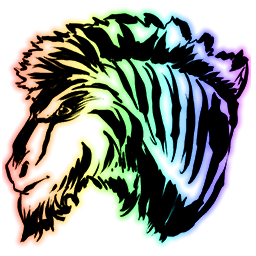 | Unicorn | 哺乳 | Equus | `Equus_Character_BP_Unicorn_C` | ../icon/creatures_256px/Unicorn_Mammals_Equus_Equus_Character_BP_Unicorn_C_256px.png | "Blueprint'/Game/PrimalEarth/Dinos/Equus/Equus_Character_BP_Unicorn.Equus_Character_BP_Unicorn'" |
| 61 |  | Eurypterid | 无脊椎 | Euryp | `Euryp_Character_C` | ../icon/creatures_256px/Eurypterid_Invertebrates_Euryp_Euryp_Character_C_256px.png | "Blueprint'/Game/PrimalEarth/Dinos/Eurypterid/Euryp_Character.Euryp_Character'" |
| 62 |  | Gallimimus | 恐龙 | Galli | `Galli_Character_BP_C` | ../icon/creatures_256px/Gallimimus_Dinosaurs_Galli_Galli_Character_BP_C_256px.png | "Blueprint'/Game/PrimalEarth/Dinos/Gallimimus/Galli_Character_BP.Galli_Character_BP'" |
| 63 |  | Giant Bee | 无脊椎 | Bee | `Bee_Character_BP_C` | ../icon/creatures_256px/Giant_Bee_Invertebrates_Bee_Bee_Character_BP_C_256px.png | "Blueprint'/Game/PrimalEarth/Dinos/Bee/Bee_Character_BP.Bee_Character_BP'" |
| 64 |  | Giganotosaurus | 恐龙 | Gigant | `Gigant_Character_BP_C` | ../icon/creatures_256px/Corrupted_Giganotosaurus_Dinosaurs_Gigant_Corrupt_Gigant_Character_BP_Corrupt_C_256px.png | "Blueprint'/Game/PrimalEarth/Dinos/Giganotosaurus/Gigant_Character_BP.Gigant_Character_BP'" |
| 65 |  | Gigantopithecus | 哺乳 | Bigfoot | `Bigfoot_Character_BP_C` | ../icon/creatures_256px/Gigantopithecus_Mammals_Bigfoot_Bigfoot_Character_BP_C_256px.png | "Blueprint'/Game/PrimalEarth/Dinos/Bigfoot/Bigfoot_Character_BP.Bigfoot_Character_BP'" |
| 66 |  | Gigantoraptor | 恐龙 | Gigantoraptor | `Gigantoraptor_Character_BP_C` | ../icon/creatures_256px/Gigantoraptor_Dinosaurs_Gigantoraptor_Gigantoraptor_Character_BP_C_256px.png | "Blueprint'/Game/ASA/Dinos/Gigantoraptor/Gigantoraptor_Character_BP.Gigantoraptor_Character_BP'" |
| 67 | 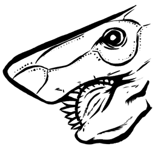 | Helicoprion | 鱼类 | Helicoprion | `Helicoprion_Character_BP_C` | ../icon/creatures_256px/Helicoprion_Fish_Helicoprion_Helicoprion_Character_BP_C_256px.png | "Blueprint'/Game/ASA/Dinos/Helicoprion/Helicoprion_Character_BP.Helicoprion_Character_BP'" |
| 68 |  | Hesperornis | 鸟类 | Hesperornis | `Hesperornis_Character_BP_C` | ../icon/creatures_256px/Hesperornis_Birds_Hesperornis_Hesperornis_Character_BP_C_256px.png | "Blueprint'/Game/PrimalEarth/Dinos/Hesperornis/Hesperornis_Character_BP.Hesperornis_Character_BP'" |
| 69 | Human (Male) | Human (Male) | 哺乳 |  | `` | N/A | "Blueprint'/Game/PrimalEarth/CoreBlueprints/PlayerPawnTest_Male.PlayerPawnTest_Male'" |
| 70 | Human (Female) | Human (Female) | 哺乳 |  | `` | N/A | "Blueprint'/Game/PrimalEarth/CoreBlueprints/PlayerPawnTest_Female.PlayerPawnTest_Female'" |
| 71 |  | Hyaenodon | 哺乳 | Hyaenodon | `Hyaenodon_Character_BP_C` | ../icon/creatures_256px/Hyaenodon_Mammals_Hyaenodon_Hyaenodon_Character_BP_C_256px.png | "Blueprint'/Game/PrimalEarth/Dinos/Hyaenodon/Hyaenodon_Character_BP.Hyaenodon_Character_BP'" |
| 72 |  | Ichthyornis | 鸟类 | Ichthyornis | `Ichthyornis_Character_BP_C` | ../icon/creatures_256px/Ichthyornis_Birds_Ichthyornis_Ichthyornis_Character_BP_C_256px.png | "Blueprint'/Game/PrimalEarth/Dinos/Ichthyornis/Ichthyornis_Character_BP.Ichthyornis_Character_BP'" |
| 73 |  | Ichthyosaurus | 爬行 | Dolphin | `Dolphin_Character_BP_C` | ../icon/creatures_256px/Astrodelphis_Fantasy_Creatures_Astrodelphis_SpaceDolphin_Character_BP_C_256px.png | "Blueprint'/Game/PrimalEarth/Dinos/Dolphin/Dolphin_Character_BP.Dolphin_Character_BP'" |
| 74 |  | Iguanodon | 恐龙 | Iguanodon | `Iguanodon_Character_BP_C` | ../icon/creatures_256px/Iguanodon_Dinosaurs_Iguanodon_Iguanodon_Character_BP_C_256px.png | "Blueprint'/Game/PrimalEarth/Dinos/Iguanodon/Iguanodon_Character_BP.Iguanodon_Character_BP'" |
| 75 |  | Kairuku | 鸟类 | Kairu | `Kairuku_Character_BP_C` | ../icon/creatures_256px/Kairuku_Birds_Kairu_Kairuku_Character_BP_C_256px.png | "Blueprint'/Game/PrimalEarth/Dinos/Kairuku/Kairuku_Character_BP.Kairuku_Character_BP'" |
| 76 |  | Kaprosuchus | 爬行 | Kaprosuchus | `Kaprosuchus_Character_BP_C` | ../icon/creatures_256px/Kaprosuchus_Reptiles_Kaprosuchus_Kaprosuchus_Character_BP_C_256px.png | "Blueprint'/Game/PrimalEarth/Dinos/Kaprosuchus/Kaprosuchus_Character_BP.Kaprosuchus_Character_BP'" |
| 77 |  | Kentrosaurus | 恐龙 | Kentro | `Kentro_Character_BP_C` | ../icon/creatures_256px/Kentrosaurus_Dinosaurs_Kentro_Kentro_Character_BP_C_256px.png | "Blueprint'/Game/PrimalEarth/Dinos/Kentrosaurus/Kentro_Character_BP.Kentro_Character_BP'" |
| 78 |  | Leech | 无脊椎 | Leech | `Leech_Character_C` | ../icon/creatures_256px/Leech_Invertebrates_Leech_Leech_Character_C_256px.png | "Blueprint'/Game/PrimalEarth/Dinos/Leech/Leech_Character.Leech_Character'" |
| 79 |  | Diseased Leech | 无脊椎 | Leech | `Leech_Character_Diseased_C` | ../icon/creatures_256px/Diseased_Leech_Invertebrates_Leech_Leech_Character_Diseased_C_256px.png | "Blueprint'/Game/PrimalEarth/Dinos/Leech/Leech_Character_Diseased.Leech_Character_Diseased'" |
| 80 |  | Leedsichthys | 鱼类 | Leedsichthys | `Leedsichthys_Character_BP_C` | ../icon/creatures_256px/Alpha_Leedsichthys_Alpha_Creatures_Leedsichthys_Alpha_Leedsichthys_Character_BP_C_256px.png | "Blueprint'/Game/PrimalEarth/Dinos/Leedsichthys/Leedsichthys_Character_BP.Leedsichthys_Character_BP' |
| 81 |  | Liopleurodon | 爬行 | Liopleurodon | `Liopleurodon_Character_BP_C` | ../icon/creatures_256px/Liopleurodon_Reptiles_Liopleurodon_Liopleurodon_Character_BP_C_256px.png | "Blueprint'/Game/PrimalEarth/Dinos/Liopleurodon/Liopleurodon_Character_BP.Liopleurodon_Character_BP' |
| 82 |  | Lystrosaurus | 恐龙 | Lystro | `Lystro_Character_BP_C` | ../icon/creatures_256px/Lystrosaurus_Dinosaurs_Lystro_Lystro_Character_BP_C_256px.png | "Blueprint'/Game/PrimalEarth/Dinos/Lystrosaurus/Lystro_Character_BP.Lystro_Character_BP'" |
| 83 |  | Mammoth | 哺乳 | Mammoth | `Mammoth_Character_BP_C` | ../icon/creatures_256px/Mammoth_Mammals_Mammoth_Mammoth_Character_BP_C_256px.png | "Blueprint'/Game/PrimalEarth/Dinos/Mammoth/Mammoth_Character_BP.Mammoth_Character_BP'" |
| 84 |  | Manta | 鱼类 | Manta | `Manta_Character_BP_C` | ../icon/creatures_256px/Manta_Fish_Manta_Manta_Character_BP_C_256px.png | "Blueprint'/Game/PrimalEarth/Dinos/Manta/Manta_Character_BP.Manta_Character_BP'" |
| 85 |  | Megalania | 爬行 | Megalania | `Megalania_Character_BP_C` | ../icon/creatures_256px/Megalania_Reptiles_Megalania_Megalania_Character_BP_C_256px.png | "Blueprint'/Game/PrimalEarth/Dinos/Megalania/Megalania_Character_BP.Megalania_Character_BP'" |
| 86 |  | Megaloceros | 哺乳 | Stag | `Stag_Character_BP_C` | ../icon/creatures_256px/Megaloceros_Mammals_Stag_Stag_Character_BP_C_256px.png | "Blueprint'/Game/PrimalEarth/Dinos/Stag/Stag_Character_BP.Stag_Character_BP'" |
| 87 |  | Megalodon | 鱼类 | Mega | `Megalodon_Character_BP_C` | ../icon/creatures_256px/Alpha_Megalodon_Alpha_Creatures_Elite_Mega_MegaMegalodon_Character_BP_C_256px.png | "Blueprint'/Game/PrimalEarth/Dinos/Megalodon/Megalodon_Character_BP.Megalodon_Character_BP'" |
| 88 |  | Megalosaurus | 恐龙 | Megalosaurus | `Megalosaurus_Character_BP_C` | ../icon/creatures_256px/Megalosaurus_Dinosaurs_Megalosaurus_Megalosaurus_Character_BP_C_256px.png | "Blueprint'/Game/PrimalEarth/Dinos/Megalosaurus/Megalosaurus_Character_BP.Megalosaurus_Character_BP' |
| 89 |  | Meganeura | 无脊椎 | Dragonfly | `Dragonfly_Character_BP_C` | ../icon/creatures_256px/Meganeura_Invertebrates_Dragonfly_Dragonfly_Character_BP_C_256px.png | "Blueprint'/Game/PrimalEarth/Dinos/Dragonfly/Dragonfly_Character_BP.Dragonfly_Character_BP'" |
| 90 |  | Megapithecus | Boss |  | `Gorilla_Character_BP_C` | ../icon/creatures_256px/Megapithecus_Bosses_unknown_Gorilla_Character_BP_C_256px.png | "Blueprint'/Game/PrimalEarth/Dinos/Gorilla/Gorilla_Character_BP.Gorilla_Character_BP'" |
| 91 |  | Megapithecus (Alpha) | Boss |  | `Gorilla_Character_BP_Hard_C` | ../icon/creatures_256px/Megapithecus_(Alpha)_Bosses_unknown_Gorilla_Character_BP_Hard_C_256px.png | "Blueprint'/Game/PrimalEarth/Dinos/Gorilla/Gorilla_Character_BP_Hard.Gorilla_Character_BP_Hard'" |
| 92 |  | Megapithecus (Beta) | Boss |  | `Gorilla_Character_BP_Medium_C` | ../icon/creatures_256px/Megapithecus_(Beta)_Bosses_unknown_Gorilla_Character_BP_Medium_C_256px.png | "Blueprint'/Game/PrimalEarth/Dinos/Gorilla/Gorilla_Character_BP_Medium.Gorilla_Character_BP_Medium'" |
| 93 |  | Megapithecus (Gamma) | Boss |  | `Gorilla_Character_BP_Easy_C` | ../icon/creatures_256px/Megapithecus_(Gamma)_Bosses_unknown_Gorilla_Character_BP_Easy_C_256px.png | "Blueprint'/Game/PrimalEarth/Dinos/Gorilla/Gorilla_Character_BP_Easy.Gorilla_Character_BP_Easy'" |
| 94 |  | Megatherium | 哺乳 | Megatherium | `Megatherium_Character_BP_C` | ../icon/creatures_256px/Megatherium_Mammals_Megatherium_Megatherium_Character_BP_C_256px.png | "Blueprint'/Game/PrimalEarth/Dinos/Megatherium/Megatherium_Character_BP.Megatherium_Character_BP'" |
| 95 |  | Mesopithecus | 哺乳 | Monkey | `Monkey_Character_BP_C` | ../icon/creatures_256px/Mesopithecus_Mammals_Monkey_Monkey_Character_BP_C_256px.png | "Blueprint'/Game/PrimalEarth/Dinos/Monkey/Monkey_Character_BP.Monkey_Character_BP'" |
| 96 |  | Microraptor | 恐龙 | Microraptor | `Microraptor_Character_BP_C` | ../icon/creatures_256px/Microraptor_Dinosaurs_Microraptor_Microraptor_Character_BP_C_256px.png | "Blueprint'/Game/PrimalEarth/Dinos/Microraptor/Microraptor_Character_BP.Microraptor_Character_BP'" |
| 97 |  | Mosasaurus | 爬行 | Mosasaur | `Mosa_Character_BP_C` | ../icon/creatures_256px/Mosasaurus_Reptiles_Mosasaur_Mosa_Character_BP_C_256px.png | "Blueprint'/Game/PrimalEarth/Dinos/Mosasaurus/Mosa_Character_BP.Mosa_Character_BP'" |
| 98 |  | Moschops | 恐龙 | Moschops | `Moschops_Character_BP_C` | ../icon/creatures_256px/Moschops_Dinosaurs_Moschops_Moschops_Character_BP_C_256px.png | "Blueprint'/Game/PrimalEarth/Dinos/Moschops/Moschops_Character_BP.Moschops_Character_BP'" |
| 99 |  | Onyc | 哺乳 | Bat | `Bat_Character_BP_C` | ../icon/creatures_256px/Gigadesmodus_Mammals_BossBat_BossBat_Character_BP_C_256px.png | "Blueprint'/Game/PrimalEarth/Dinos/Bat/Bat_Character_BP.Bat_Character_BP'" |
| 100 |  | Otter | 哺乳 | Otter | `Otter_Character_BP_C` | ../icon/creatures_256px/Otter_Mammals_Otter_Otter_Character_BP_C_256px.png | "Blueprint'/Game/PrimalEarth/Dinos/Otter/Otter_Character_BP.Otter_Character_BP'" |
| 101 |  | Oviraptor | 恐龙 | Ovi | `Oviraptor_Character_BP_C` | ../icon/creatures_256px/Oviraptor_Dinosaurs_Ovi_Oviraptor_Character_BP_C_256px.png | "Blueprint'/Game/PrimalEarth/Dinos/Oviraptor/Oviraptor_Character_BP.Oviraptor_Character_BP'" |
| 102 |  | Overseer | Boss |  | `EndBoss_Character_C` | ../icon/creatures_256px/Overseer_Bosses_unknown_EndBoss_Character_C_256px.png | "Blueprint'/Game/EndGame/Dinos/Endboss/EndBoss_Character.EndBoss_Character'" |
| 103 |  | Overseer (Alpha) | Boss |  | `EndBoss_Character_Hard_C` | ../icon/creatures_256px/Overseer_(Alpha)_Bosses_unknown_EndBoss_Character_Hard_C_256px.png | "Blueprint'/Game/EndGame/Dinos/Endboss/EndBoss_Character_Hard.EndBoss_Character_Hard'" |
| 104 |  | Overseer (Beta) | Boss |  | `EndBoss_Character_Medium_C` | ../icon/creatures_256px/Overseer_(Beta)_Bosses_unknown_EndBoss_Character_Medium_C_256px.png | "Blueprint'/Game/EndGame/Dinos/Endboss/EndBoss_Character_Medium.EndBoss_Character_Medium'" |
| 105 |  | Overseer (Gamma) | Boss |  | `EndBoss_Character_Easy_C` | ../icon/creatures_256px/Overseer_(Gamma)_Bosses_unknown_EndBoss_Character_Easy_C_256px.png | "Blueprint'/Game/EndGame/Dinos/Endboss/EndBoss_Character_Easy.EndBoss_Character_Easy'" |
| 106 |  | Ovis | 哺乳 | Sheep | `Sheep_Character_BP_C` | ../icon/creatures_256px/Ovis_Mammals_Sheep_Sheep_Character_BP_C_256px.png | "Blueprint'/Game/PrimalEarth/Dinos/Sheep/Sheep_Character_BP.Sheep_Character_BP'" |
| 107 |  | Pachy | 恐龙 | Pachy | `Pachy_Character_BP_C` | ../icon/creatures_256px/Pachy_Dinosaurs_Pachy_Pachy_Character_BP_C_256px.png | "Blueprint'/Game/PrimalEarth/Dinos/Pachy/Pachy_Character_BP.Pachy_Character_BP'" |
| 108 |  | Pachyrhinosaurus | 恐龙 | Pachyrhinosaurus | `Pachyrhino_Character_BP_C` | ../icon/creatures_256px/Pachyrhinosaurus_Dinosaurs_Pachyrhinosaurus_Pachyrhino_Character_BP_C_256px.png | "Blueprint'/Game/PrimalEarth/Dinos/Pachyrhinosaurus/Pachyrhino_Character_BP.Pachyrhino_Character_BP' |
| 109 |  | Paraceratherium | 哺乳 | Paracer | `Paracer_Character_BP_C` | ../icon/creatures_256px/Corrupted_Paraceratherium_Mammals_Paracer_Paracer_Character_BP_Corrupt_C_256px.png | "Blueprint'/Game/PrimalEarth/Dinos/Paraceratherium/Paracer_Character_BP.Paracer_Character_BP'" |
| 110 |  | Parasaur | 恐龙 | Para | `Para_Character_BP_C` | ../icon/creatures_256px/Parasaur_Dinosaurs_Para_Para_Character_BP_C_256px.png | "Blueprint'/Game/PrimalEarth/Dinos/Para/Para_Character_BP.Para_Character_BP'" |
| 111 |  | Pegomastax | 恐龙 | Pegomastax | `Pegomastax_Character_BP_C` | ../icon/creatures_256px/Pegomastax_Dinosaurs_Pegomastax_Pegomastax_Character_BP_C_256px.png | "Blueprint'/Game/PrimalEarth/Dinos/Pegomastax/Pegomastax_Character_BP.Pegomastax_Character_BP'" |
| 112 |  | Pelagornis | 鸟类 | Pela | `Pela_Character_BP_C` | ../icon/creatures_256px/Pelagornis_Birds_Pela_Pela_Character_BP_C_256px.png | "Blueprint'/Game/PrimalEarth/Dinos/Pelagornis/Pela_Character_BP.Pela_Character_BP'" |
| 113 |  | Phiomia | 哺乳 | Phiomia | `Phiomia_Character_BP_C` | ../icon/creatures_256px/Phiomia_Mammals_Phiomia_Phiomia_Character_BP_C_256px.png | "Blueprint'/Game/PrimalEarth/Dinos/Phiomia/Phiomia_Character_BP.Phiomia_Character_BP'" |
| 114 |  | Piranha | 鱼类 | Piranha | `Piranha_Character_BP_C` | ../icon/creatures_256px/Piranha_Fish_Piranha_Piranha_Character_BP_C_256px.png | "Blueprint'/Game/PrimalEarth/Dinos/Piranha/Piranha_Character_BP.Piranha_Character_BP'" |
| 115 |  | Plesiosaur | 爬行 | Plesiosaur | `Plesiosaur_Character_BP_C` | ../icon/creatures_256px/Plesiosaur_Reptiles_Plesiosaur_Plesiosaur_Character_BP_C_256px.png | "Blueprint'/Game/PrimalEarth/Dinos/Plesiosaur/Plesiosaur_Character_BP.Plesiosaur_Character_BP'" |
| 116 |  | Procoptodon | 哺乳 | Kangaroo | `Procoptodon_Character_BP_C` | ../icon/creatures_256px/Procoptodon_Mammals_Kangaroo_Procoptodon_Character_BP_C_256px.png | "Blueprint'/Game/PrimalEarth/Dinos/Procoptodon/Procoptodon_Character_BP.Procoptodon_Character_BP'" |
| 117 |  | Pteranodon | 恐龙 | Ptera | `Ptero_Character_BP_C` | ../icon/creatures_256px/Corrupted_Pteranodon_Dinosaurs_Ptera_Corrupt_Ptero_Character_BP_Corrupt_C_256px.png | "Blueprint'/Game/PrimalEarth/Dinos/Ptero/Ptero_Character_BP.Ptero_Character_BP'" |
| 118 |  | Pulmonoscorpius | 无脊椎 | Scorpion | `Scorpion_Character_BP_C` | ../icon/creatures_256px/Pulmonoscorpius_Invertebrates_Scorpion_Scorpion_Character_BP_C_256px.png | "Blueprint'/Game/PrimalEarth/Dinos/Scorpion/Scorpion_Character_BP.Scorpion_Character_BP'" |
| 119 |  | Purlovia | 合弓纲 | Purlovia | `Purlovia_Character_BP_C` | ../icon/creatures_256px/Purlovia_Synapsids_Purlovia_Purlovia_Character_BP_C_256px.png | "Blueprint'/Game/PrimalEarth/Dinos/Purlovia/Purlovia_Character_BP.Purlovia_Character_BP'" |
| 120 |  | Quetzal | 爬行 | Quetz | `Quetz_Character_BP_C` | ../icon/creatures_256px/Quetzal_Reptiles_Quetz_Quetz_Character_BP_C_256px.png | "Blueprint'/Game/PrimalEarth/Dinos/Quetzalcoatlus/Quetz_Character_BP.Quetz_Character_BP'" |
| 121 |  | Raptor | 恐龙 | Raptor | `Raptor_Character_BP_C` | ../icon/creatures_256px/Alpha_Raptor_Alpha_Creatures_Elite_Raptor_MegaRaptor_Character_BP_C_256px.png | "Blueprint'/Game/PrimalEarth/Dinos/Raptor/Raptor_Character_BP.Raptor_Character_BP'" |
| 122 |  | Rex | 恐龙 | Rex | `Rex_Character_BP_C` | ../icon/creatures_256px/Alpha_T-Rex_Alpha_Creatures_Elite_Rex_MegaRex_Character_BP_C_256px.png | "Blueprint'/Game/PrimalEarth/Dinos/Rex/Rex_Character_BP.Rex_Character_BP'" |
| 123 | 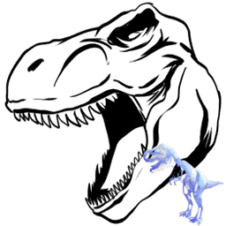 | Rex Ghost | Event Creatures | Rex | `Ghost_Rex_Character_BP_C` | ../icon/creatures_256px/Rex_Ghost_Event_Creatures_Rex_Ghost_Rex_Character_BP_C_256px.png | "Blueprint'/Game/PrimalEarth/Dinos/Rex/Ghost_Rex_Character_BP.Ghost_Rex_Character_BP'" |
| 124 |  | Rhyniognatha | 无脊椎 | Rhynio | `Rhynio_Character_BP_C` | ../icon/creatures_256px/Rhyniognatha_Invertebrates_Rhynio_Rhynio_Character_BP_C_256px.png | "Blueprint'/Game/PrimalEarth/Dinos/Rhyniognatha/Rhynio_Character_BP.Rhynio_Character_BP'" |
| 125 |  | Sabertooth | 哺乳 | Sabertooth | `Saber_Character_BP_C` | ../icon/creatures_256px/Sabertooth_Mammals_Sabertooth_Saber_Character_BP_C_256px.png | "Blueprint'/Game/PrimalEarth/Dinos/Saber/Saber_Character_BP.Saber_Character_BP'" |
| 126 |  | Sabertooth Salmon | 鱼类 | Salmon | `Salmon_Character_BP_C` | ../icon/creatures_256px/Rare_X-Sabertooth_Salmon_X-Creatures_RareSalmon_Rare_Lunar_Salmon_Character_BP_C_256px.png | "Blueprint'/Game/PrimalEarth/Dinos/Salmon/Salmon_Character_BP.Salmon_Character_BP'" |
| 127 |  | Sarco | 爬行 | Sarco | `Sarco_Character_BP_C` | ../icon/creatures_256px/Sarco_Reptiles_Sarco_Sarco_Character_BP_C_256px.png | "Blueprint'/Game/PrimalEarth/Dinos/Sarco/Sarco_Character_BP.Sarco_Character_BP'" |
| 128 | 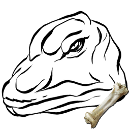 | Skeletal Bronto | Event Creatures | Bronto | `Bone_Sauropod_Character_BP_C` | ../icon/creatures_256px/Skeletal_Bronto_Event_Creatures_Bronto_Bone_Sauropod_Character_BP_C_256px.png | "Blueprint'/Game/PrimalEarth/Dinos/Sauropod/Bone_Sauropod_Character_BP.Bone_Sauropod_Character_BP'" |
| 129 | 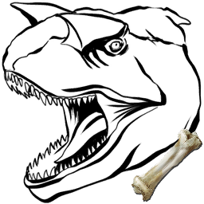 | Skeletal Carnotaurus | Event Creatures | Elite Carno | `Bone_MegaCarno_Character_BP_C` | ../icon/creatures_256px/Skeletal_Carnotaurus_Event_Creatures_Elite_Carno_Bone_MegaCarno_Character_BP_C_256px.png | "Blueprint'/Game/PrimalEarth/Dinos/Carno/Bone_MegaCarno_Character_BP.Bone_MegaCarno_Character_BP'" |
| 130 | 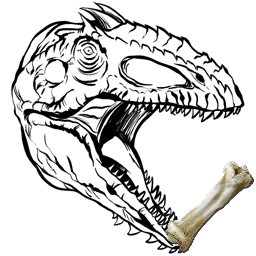 | Skeletal Giganotosaurus | Event Creatures | Gigant | `Bone_Gigant_Character_BP_C` | ../icon/creatures_256px/Skeletal_Giganotosaurus_Event_Creatures_Gigant_Bone_Gigant_Character_BP_C_256px.png | "Blueprint'/Game/PrimalEarth/Dinos/Giganotosaurus/Bone_Gigant_Character_BP.Bone_Gigant_Character_BP' |
| 131 | 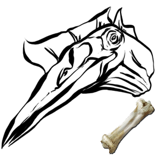 | Skeletal Quetzal | Event Creatures | Quetz | `Bone_Quetz_Character_BP_C` | ../icon/creatures_256px/Skeletal_Quetzal_Event_Creatures_Quetz_Bone_Quetz_Character_BP_C_256px.png | "Blueprint'/Game/PrimalEarth/Dinos/Quetzalcoatlus/Bone_Quetz_Character_BP.Bone_Quetz_Character_BP'" |
| 132 | 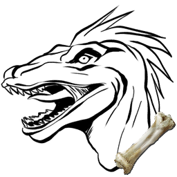 | Skeletal Raptor | Event Creatures | Bone Raptor | `Bone_MegaRaptor_Character_BP_C` | ../icon/creatures_256px/Skeletal_Raptor_Event_Creatures_Bone_Raptor_Bone_MegaRaptor_Character_BP_C_256px.png | "Blueprint'/Game/PrimalEarth/Dinos/Raptor/Bone_MegaRaptor_Character_BP.Bone_MegaRaptor_Character_BP' |
| 133 | 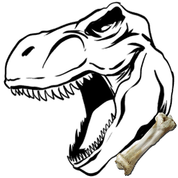 | Skeletal Rex | Event Creatures | Bone Rex | `Bone_MegaRex_Character_BP_C` | ../icon/creatures_256px/Skeletal_Rex_Event_Creatures_Bone_Rex_Bone_MegaRex_Character_BP_C_256px.png | "Blueprint'/Game/PrimalEarth/Dinos/Rex/Bone_MegaRex_Character_BP.Bone_MegaRex_Character_BP'" |
| 134 | 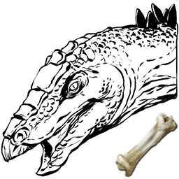 | Skeletal Stego | Event Creatures | Stego | `Bone_Stego_Character_BP_C` | ../icon/creatures_256px/Skeletal_Stego_Event_Creatures_Stego_Bone_Stego_Character_BP_C_256px.png | "Blueprint'/Game/PrimalEarth/Dinos/Stego/Bone_Stego_Character_BP.Bone_Stego_Character_BP'" |
| 135 | 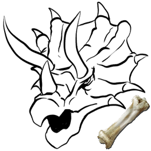 | Skeletal Trike | Event Creatures | Trike | `Bone_Trike_Character_BP_C` | ../icon/creatures_256px/Skeletal_Trike_Event_Creatures_Trike_Bone_Trike_Character_BP_C_256px.png | "Blueprint'/Game/PrimalEarth/Dinos/Trike/Bone_Trike_Character_BP.Bone_Trike_Character_BP'" |
| 136 |  | Spino | 恐龙 | Spino | `Spino_Character_BP_C` | ../icon/creatures_256px/Corrupted_Spino_Dinosaurs_Spino_Corrupt_Spino_Character_BP_Corrupt_C_256px.png | "Blueprint'/Game/PrimalEarth/Dinos/Spino/Spino_Character_BP.Spino_Character_BP'" |
| 137 |  | Stegosaurus | 恐龙 | Stego | `Stego_Character_BP_C` | ../icon/creatures_256px/Corrupted_Stegosaurus_Dinosaurs_Stego_Corrupt_Stego_Character_BP_Corrupt_C_256px.png | "Blueprint'/Game/PrimalEarth/Dinos/Stego/Stego_Character_BP.Stego_Character_BP'" |
| 138 |  | Tapejara | 爬行 | Tapejara | `Tapejara_Character_BP_C` | ../icon/creatures_256px/Tapejara_Reptiles_Tapejara_Tapejara_Character_BP_C_256px.png | "Blueprint'/Game/PrimalEarth/Dinos/Tapejara/Tapejara_Character_BP.Tapejara_Character_BP'" |
| 139 |  | Tek Parasaur | Tek Creatures | Para | `BionicPara_Character_BP_C` | ../icon/creatures_256px/Tek_Parasaur_Tek_Creatures_Para_BionicPara_Character_BP_C_256px.png | "Blueprint'/Game/PrimalEarth/Dinos/Para/BionicPara_Character_BP.BionicPara_Character_BP'" |
| 140 |  | Tek Quetzal | Tek Creatures | Quetz | `BionicQuetz_Character_BP_C` | ../icon/creatures_256px/Tek_Quetzal_Tek_Creatures_Quetz_BionicQuetz_Character_BP_C_256px.png | "Blueprint'/Game/PrimalEarth/Dinos/Quetzalcoatlus/BionicQuetz_Character_BP.BionicQuetz_Character_BP' |
| 141 |  | Tek Raptor | Tek Creatures | Raptor | `BionicRaptor_Character_BP_C` | ../icon/creatures_256px/Tek_Raptor_Tek_Creatures_Raptor_BionicRaptor_Character_BP_C_256px.png | "Blueprint'/Game/PrimalEarth/Dinos/Raptor/BionicRaptor_Character_BP.BionicRaptor_Character_BP'" |
| 142 |  | Tek Rex | Tek Creatures | Rex | `BionicRex_Character_BP_C` | ../icon/creatures_256px/Tek_Rex_Tek_Creatures_Rex_BionicRex_Character_BP_C_256px.png | "Blueprint'/Game/PrimalEarth/Dinos/Rex/BionicRex_Character_BP.BionicRex_Character_BP'" |
| 143 |  | Tek Stegosaurus | Tek Creatures | Stego | `BionicStego_Character_BP_C` | ../icon/creatures_256px/Tek_Stegosaurus_Tek_Creatures_Stego_BionicStego_Character_BP_C_256px.png | "Blueprint'/Game/PrimalEarth/Dinos/Stego/BionicStego_Character_BP.BionicStego_Character_BP'" |
| 144 |  | Terror Bird | 鸟类 | TerrorBird | `TerrorBird_Character_BP_C` | ../icon/creatures_256px/Terror_Bird_Birds_TerrorBird_TerrorBird_Character_BP_C_256px.png | "Blueprint'/Game/PrimalEarth/Dinos/TerrorBird/TerrorBird_Character_BP.TerrorBird_Character_BP'" |
| 145 |  | Therizinosaur | 恐龙 | Therizinosaurus | `Therizino_Character_BP_C` | ../icon/creatures_256px/Therizinosaur_Dinosaurs_Therizinosaurus_Therizino_Character_BP_C_256px.png | "Blueprint'/Game/PrimalEarth/Dinos/Therizinosaurus/Therizino_Character_BP.Therizino_Character_BP'" |
| 146 |  | Thylacoleo | 哺乳 | Thylacoleo | `Thylacoleo_Character_BP_C` | ../icon/creatures_256px/Thylacoleo_Mammals_Thylacoleo_Thylacoleo_Character_BP_C_256px.png | "Blueprint'/Game/PrimalEarth/Dinos/Thylacoleo/Thylacoleo_Character_BP.Thylacoleo_Character_BP'" |
| 147 |  | Titanoboa | 爬行 | TitanBoa | `BoaFrill_Character_BP_C` | ../icon/creatures_256px/Titanoboa_Reptiles_TitanBoa_BoaFrill_Character_BP_C_256px.png | "Blueprint'/Game/PrimalEarth/Dinos/BoaFrill/BoaFrill_Character_BP.BoaFrill_Character_BP'" |
| 148 |  | Titanomyrma | 无脊椎 | Ant | `Ant_Character_BP_C` | ../icon/creatures_256px/Titanomyrma_Invertebrates_Ant_Ant_Character_BP_C_256px.png | "Blueprint'/Game/PrimalEarth/Dinos/Ant/Ant_Character_BP.Ant_Character_BP'" |
| 149 |  | Titanomyrma | 无脊椎 | Ant | `FlyingAnt_Character_BP_C` | ../icon/creatures_256px/Titanomyrma_Invertebrates_Ant_FlyingAnt_Character_BP_C_256px.png | "Blueprint'/Game/PrimalEarth/Dinos/Ant/FlyingAnt_Character_BP.FlyingAnt_Character_BP'" |
| 150 |  | Titanosaur | 恐龙 | Titan | `Titanosaur_Character_BP_C` | ../icon/creatures_256px/Titanosaur_Dinosaurs_Titan_Titanosaur_Character_BP_C_256px.png | "Blueprint'/Game/PrimalEarth/Dinos/titanosaur/Titanosaur_Character_BP.Titanosaur_Character_BP'" |
| 151 |  | Triceratops | 恐龙 | Trike | `Trike_Character_BP_C` | ../icon/creatures_256px/Corrupted_Triceratops_Dinosaurs_Trike_Trike_Character_BP_Corrupt_C_256px.png | "Blueprint'/Game/PrimalEarth/Dinos/Trike/Trike_Character_BP.Trike_Character_BP'" |
| 152 |  | Trilobite | 无脊椎 | Trilobite | `Trilobite_Character_C` | ../icon/creatures_256px/Trilobite_Invertebrates_Trilobite_Trilobite_Character_C_256px.png | "Blueprint'/Game/PrimalEarth/Dinos/Trilobite/Trilobite_Character.Trilobite_Character'" |
| 153 |  | Troodon | 恐龙 | Troodon | `Troodon_Character_BP_C` | ../icon/creatures_256px/Troodon_Dinosaurs_Troodon_Troodon_Character_BP_C_256px.png | "Blueprint'/Game/PrimalEarth/Dinos/Troodon/Troodon_Character_BP.Troodon_Character_BP'" |
| 154 |  | Turkey | Event Creatures |  | `TurkeyBase_Character_BP_C` | ../icon/creatures_256px/Turkey_Event_Creatures_unknown_TurkeyBase_Character_BP_C_256px.png | "Blueprint'/Game/PrimalEarth/Dinos/Dodo/TurkeyBase_Character_BP.TurkeyBase_Character_BP'" |
| 155 |  | Super Turkey | Event Creatures |  | `Turkey_Character_BP_C` | ../icon/creatures_256px/Super_Turkey_Event_Creatures_unknown_Turkey_Character_BP_C_256px.png | "Blueprint'/Game/PrimalEarth/Dinos/Dodo/Turkey_Character_BP.Turkey_Character_BP'" |
| 156 |  | Tusoteuthis | 无脊椎 | Tusoteuthis | `Tusoteuthis_Character_BP_C` | ../icon/creatures_256px/Alpha_Tusoteuthis_Alpha_Creatures_Tusoteuthis_Mega_Tusoteuthis_Character_BP_C_256px.png | "Blueprint'/Game/PrimalEarth/Dinos/Tusoteuthis/Tusoteuthis_Character_BP.Tusoteuthis_Character_BP'" |
| 157 |  | Woolly Rhino | 哺乳 | Rhino | `Rhino_Character_BP_C` | ../icon/creatures_256px/Woolly_Rhino_Mammals_Rhino_Rhino_Character_BP_C_256px.png | "Blueprint'/Game/PrimalEarth/Dinos/WoollyRhino/Rhino_Character_BP.Rhino_Character_BP'" |
| 158 | 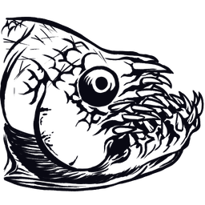 | Xiphactinus | 鱼类 | XiphactinusAA | `Xiphactinus_Character_BP_ASA_C` | ../icon/creatures_256px/Xiphactinus_Fish_XiphactinusAA_Xiphactinus_Character_BP_ASA_C_256px.png | "Blueprint'/Game/ASA/Dinos/Xiphactinus/Dinos/Xiphactinus_Character_BP_ASA.Xiphactinus_Character_BP_A |
| 159 |  | Yeti | 哺乳 | Bigfoot | `Yeti_Character_BP_C` | ../icon/creatures_256px/Yeti_Mammals_Bigfoot_Yeti_Character_BP_C_256px.png | "Blueprint'/Game/PrimalEarth/Dinos/Bigfoot/Yeti_Character_BP.Yeti_Character_BP'" |
| 160 |  | Yutyrannus | 恐龙 | Yutyrannus | `Yutyrannus_Character_BP_C` | ../icon/creatures_256px/X-Yutyrannus_X-Creatures_Yutyrannus_Snow_Yutyrannus_Character_BP_C_256px.png | "Blueprint'/Game/PrimalEarth/Dinos/Yutyrannus/Yutyrannus_Character_BP.Yutyrannus_Character_BP'" |
| 161 |  | Zomdodo | Event Creatures | Dodo | `ZombieDodo_Character_BP_C` | ../icon/creatures_256px/Zomdodo_Event_Creatures_Dodo_ZombieDodo_Character_BP_C_256px.png | "Blueprint'/Game/PrimalEarth/Dinos/Dodo/ZombieDodo_Character_BP.ZombieDodo_Character_BP'" |

---

## Creatures of The Center (中心岛)

> 共 1 个生物

| # | 图标 | 名称 | 分类 | Name Tag | Entity ID | Icon URL | Blueprint Path |
|---|------|------|------|----------|-----------|----------|----------------|
| 1 |  | Shastasaurus | 爬行 | Shasta | `Shastasaurus_Character_BP_C` | ../icon/creatures_256px/Shastasaurus_Reptiles_Shasta_Shastasaurus_Character_BP_C_256px.png | "Blueprint'/Game/ASA/Dinos/Shastasaurus/Shastasaurus_Character_BP.Shastasaurus_Character_BP'" |

---

## Creatures of Scorched Earth (焦土)

> 共 31 个生物

| # | 图标 | 名称 | 分类 | Name Tag | Entity ID | Icon URL | Blueprint Path |
|---|------|------|------|----------|-----------|----------|----------------|
| 1 |  | Alpha Fire Wyvern | Fantasy Creatures | Wyvern | `MegaWyvern_Character_BP_Fire_C` | ../icon/creatures_256px/Alpha_Fire_Wyvern_Fantasy_Creatures_Wyvern_MegaWyvern_Character_BP_Fire_C_256px.png | "Blueprint'/Game/ScorchedEarth/Dinos/Wyvern/MegaWyvern_Character_BP_Fire.MegaWyvern_Character_BP_Fir |
| 2 |  | Alpha Deathworm | 无脊椎 | Deathworm | `MegaDeathworm_Character_BP_C` | ../icon/creatures_256px/Alpha_Deathworm_Invertebrates_Deathworm_MegaDeathworm_Character_BP_C_256px.png | "Blueprint'/Game/ScorchedEarth/Dinos/Deathworm/MegaDeathworm_Character_BP.MegaDeathworm_Character_BP |
| 3 |  | Deathworm | 无脊椎 | Deathworm | `Deathworm_Character_BP_C` | ../icon/creatures_256px/Alpha_Deathworm_Invertebrates_Deathworm_MegaDeathworm_Character_BP_C_256px.png | "Blueprint'/Game/ScorchedEarth/Dinos/DeathWorm/DeathWorm_Character_BP.DeathWorm_Character_BP'" |
| 4 | 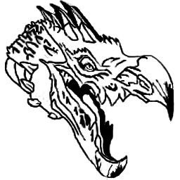 | Dodo Wyvern | Event Creatures | Wyvern | `DodoWyvern_Character_BP_C` | ../icon/creatures_256px/Dodo_Wyvern_Event_Creatures_Wyvern_DodoWyvern_Character_BP_C_256px.png | "Blueprint'/Game/ScorchedEarth/Dinos/DodoWyvern/DodoWyvern_Character_BP.DodoWyvern_Character_BP'" |
| 5 |  | Fasolasuchus | 爬行 | Fasola | `Fasola_Character_BP_C` | ../icon/creatures_256px/Fasolasuchus_Reptiles_Fasola_Fasola_Character_BP_C_256px.png | "Blueprint'/Game/ASA/Dinos/Fasolasuchus/Fasola_Character_BP.Fasola_Character_BP'" |
| 6 |  | Jerboa | 哺乳 | Jerboa | `Jerboa_Character_BP_C` | ../icon/creatures_256px/Jerboa_Mammals_Jerboa_Jerboa_Character_BP_C_256px.png | "Blueprint'/Game/ScorchedEarth/Dinos/Jerboa/Jerboa_Character_BP.Jerboa_Character_BP'" |
| 7 | 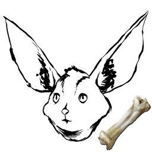 | Skeletal Jerboa | Event Creatures | Jerboa | `Bone_Jerboa_Character_BP_C` | ../icon/creatures_256px/Skeletal_Jerboa_Event_Creatures_Jerboa_Bone_Jerboa_Character_BP_C_256px.png | "Blueprint'/Game/ScorchedEarth/Dinos/Jerboa/Bone_Jerboa_Character_BP.Bone_Jerboa_Character_BP'" |
| 8 |  | Jug Bug | 无脊椎 | Jugbug | `Jugbug_Character_BaseBP_C` | ../icon/creatures_256px/Jug_Bug_Invertebrates_Jugbug_Jugbug_Character_BaseBP_C_256px.png | "Blueprint'/Game/ScorchedEarth/Dinos/Jugbug/JugBug_Character_BaseBP.JugBug_Character_BaseBP'" |
| 9 |  | Oil Jug Bug | 无脊椎 | Jugbug | `Jugbug_Oil_Character_BP_C` | ../icon/creatures_256px/Oil_Jug_Bug_Invertebrates_Jugbug_Jugbug_Oil_Character_BP_C_256px.png | "Blueprint'/Game/ScorchedEarth/Dinos/Jugbug/Jugbug_Oil_Character_BP.Jugbug_Oil_Character_BP'" |
| 10 |  | Water Jug Bug | 无脊椎 | Jugbug | `Jugbug_Water_Character_BP_C` | ../icon/creatures_256px/Water_Jug_Bug_Invertebrates_Jugbug_Jugbug_Water_Character_BP_C_256px.png | "Blueprint'/Game/ScorchedEarth/Dinos/Jugbug/Jugbug_Water_Character_BP.Jugbug_Water_Character_BP'" |
| 11 |  | Lymantria | 无脊椎 | Moth | `Moth_Character_BP_C` | ../icon/creatures_256px/Lymantria_Invertebrates_Moth_Moth_Character_BP_C_256px.png | "Blueprint'/Game/ScorchedEarth/Dinos/Moth/Moth_Character_BP.Moth_Character_BP'" |
| 12 |  | Manticore (Gamma) | Boss | Manticore | `Manticore_Character_BP_Easy_C` | ../icon/creatures_256px/Manticore_(Gamma)_Bosses_Manticore_Manticore_Character_BP_Easy_C_256px.png | "Blueprint'/Game/ScorchedEarth/Dinos/Manticore/Manticore_Character_BP_Easy.Manticore_Character_BP_Ea |
| 13 |  | Manticore (Beta) | Boss | Manticore | `Manticore_Character_BP_Medium_C` | ../icon/creatures_256px/Manticore_(Beta)_Bosses_Manticore_Manticore_Character_BP_Medium_C_256px.png | "Blueprint'/Game/ScorchedEarth/Dinos/Manticore/Manticore_Character_BP_Medium.Manticore_Character_BP_ |
| 14 |  | Manticore (Alpha) | Boss | Manticore | `Manticore_Character_BP_Hard_C` | ../icon/creatures_256px/Manticore_(Alpha)_Bosses_Manticore_Manticore_Character_BP_Hard_C_256px.png | "Blueprint'/Game/ScorchedEarth/Dinos/Manticore/Manticore_Character_BP_Hard.Manticore_Character_BP_Ha |
| 15 | 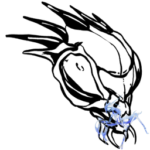 | Mantis | 无脊椎 | Mantis | `Mantis_Character_BP_C` | ../icon/creatures_256px/Mantis_Ghost_Event_Creatures_Mantis_Ghost_Mantis_Character_BP_C_256px.png | "Blueprint'/Game/ScorchedEarth/Dinos/Mantis/Mantis_Character_BP.Mantis_Character_BP'" |
| 16 |  | Mantis Ghost | Event Creatures | Mantis | `Ghost_Mantis_Character_BP_C` | ../icon/creatures_256px/Mantis_Ghost_Event_Creatures_Mantis_Ghost_Mantis_Character_BP_C_256px.png | "Blueprint'/Game/ScorchedEarth/Dinos/Mantis/Ghost_Mantis_Character_BP.Ghost_Mantis_Character_BP'" |
| 17 |  | Morellatops | 恐龙 | Camelsaurus | `camelsaurus_Character_BP_C` | ../icon/creatures_256px/Morellatops_Dinosaurs_Camelsaurus_camelsaurus_Character_BP_C_256px.png | "Blueprint'/Game/ScorchedEarth/Dinos/Camelsaurus/camelsaurus_Character_BP.camelsaurus_Character_BP'" |
| 18 |  | Oasisaur | Fantasy Creatures | Oasisaur | `Oasisaur_Character_BP_C` | ../icon/creatures_256px/Oasisaur_Fantasy_Creatures_Oasisaur_Oasisaur_Character_BP_C_256px.png | "Blueprint'/Game/Packs/Frontier/Dinos/Oasisaur/Oasisaur_Character_BP.Oasisaur_Character_BP'" |
| 19 |  | Phoenix | Fantasy Creatures | Phoenix | `Phoenix_Character_BP_C` | ../icon/creatures_256px/Phoenix_Fantasy_Creatures_Phoenix_Phoenix_Character_BP_C_256px.png | "Blueprint'/Game/ScorchedEarth/Dinos/Phoenix/Phoenix_Character_BP.Phoenix_Character_BP'" |
| 20 |  | Rock Elemental | Fantasy Creatures | RockElemental | `RockGolem_Character_BP_C` | ../icon/creatures_256px/Rock_Elemental_Fantasy_Creatures_RockElemental_RockGolem_Character_BP_C_256px.png | "Blueprint'/Game/ScorchedEarth/Dinos/RockGolem/RockGolem_Character_BP.RockGolem_Character_BP'" |
| 21 | 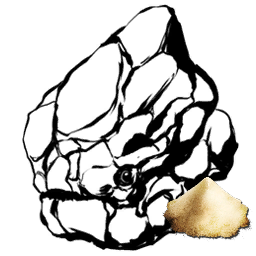 | Rubble Golem | Fantasy Creatures | RockElemental | `RubbleGolem_Character_BP_C` | ../icon/creatures_256px/Rubble_Golem_Fantasy_Creatures_RockElemental_RubbleGolem_Character_BP_C_256px.png | "Blueprint'/Game/ScorchedEarth/Dinos/RockGolem/RubbleGolem_Character_BP.RubbleGolem_Character_BP'" |
| 22 |  | Thorny Dragon | 爬行 | SpineyLizard | `SpineyLizard_Character_BP_C` | ../icon/creatures_256px/Thorny_Dragon_Reptiles_SpineyLizard_SpineyLizard_Character_BP_C_256px.png | "Blueprint'/Game/ScorchedEarth/Dinos/SpineyLizard/SpineyLizard_Character_BP.SpineyLizard_Character_B |
| 23 |  | Vulture | 鸟类 | Vulture | `Vulture_Character_BP_C` | ../icon/creatures_256px/Vulture_Birds_Vulture_Vulture_Character_BP_C_256px.png | "Blueprint'/Game/ScorchedEarth/Dinos/Vulture/Vulture_Character_BP.Vulture_Character_BP'" |
| 24 |  | Wyvern | Fantasy Creatures | Wyvern | `Wyvern_Character_BP_Base_C` | ../icon/creatures_256px/Wyvern_Fantasy_Creatures_Wyvern_Wyvern_Character_BP_Base_C_256px.png | "Blueprint'/Game/ScorchedEarth/Dinos/Wyvern/Wyvern_Character_BP_Base.Wyvern_Character_BP_Base'" |
| 25 |  | Fire Wyvern | Fantasy Creatures | Wyvern | `Wyvern_Character_BP_Fire_C` | ../icon/creatures_256px/Alpha_Fire_Wyvern_Fantasy_Creatures_Wyvern_MegaWyvern_Character_BP_Fire_C_256px.png | "Blueprint'/Game/ScorchedEarth/Dinos/Wyvern/Wyvern_Character_BP_Fire.Wyvern_Character_BP_Fire'" |
| 26 |  | Lightning Wyvern | Fantasy Creatures | Wyvern | `Wyvern_Character_BP_Lightning_C` | ../icon/creatures_256px/Lightning_Wyvern_Fantasy_Creatures_Wyvern_Wyvern_Character_BP_Lightning_C_256px.png | "Blueprint'/Game/ScorchedEarth/Dinos/Wyvern/Wyvern_Character_BP_Lightning.Wyvern_Character_BP_Lightn |
| 27 |  | Poison Wyvern | Fantasy Creatures | Wyvern | `Wyvern_Character_BP_Poison_C` | ../icon/creatures_256px/Poison_Wyvern_Fantasy_Creatures_Wyvern_Wyvern_Character_BP_Poison_C_256px.png | "Blueprint'/Game/ScorchedEarth/Dinos/Wyvern/Wyvern_Character_BP_Poison.Wyvern_Character_BP_Poison'" |
| 28 | 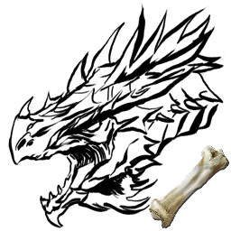 | Bone Fire Wyvern | Event Creatures | Wyvern | `Bone_MegaWyvern_Character_BP_Fire_C` | ../icon/creatures_256px/Bone_Fire_Wyvern_Event_Creatures_Wyvern_Bone_MegaWyvern_Character_BP_Fire_C_256px.png | "Blueprint'/Game/ScorchedEarth/Dinos/Wyvern/Bone_MegaWyvern_Character_BP_Fire.Bone_MegaWyvern_Charac |
| 29 | 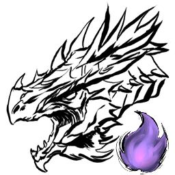 | Zombie Fire Wyvern | Event Creatures | Wyvern | `Wyvern_Character_BP_ZombieFire_C` | ../icon/creatures_256px/Zombie_Fire_Wyvern_Event_Creatures_Wyvern_Wyvern_Character_BP_ZombieFire_C_256px.png | "Blueprint'/Game/ScorchedEarth/Dinos/Wyvern/Wyvern_Character_BP_ZombieFire.Wyvern_Character_BP_Zombi |
| 30 | 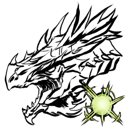 | Zombie Lightning Wyvern | Event Creatures | Wyvern | `Wyvern_Character_BP_ZombieLightning_C` | ../icon/creatures_256px/Zombie_Lightning_Wyvern_Event_Creatures_Wyvern_Wyvern_Character_BP_ZombieLightning_C_256px.png | "Blueprint'/Game/ScorchedEarth/Dinos/Wyvern/Wyvern_Character_BP_ZombieLightning.Wyvern_Character_BP_ |
| 31 | 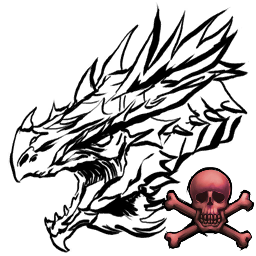 | Zombie Poison Wyvern | Event Creatures | Wyvern | `Wyvern_Character_BP_ZombiePoison_C` | ../icon/creatures_256px/Zombie_Poison_Wyvern_Event_Creatures_Wyvern_Wyvern_Character_BP_ZombiePoison_C_256px.png | "Blueprint'/Game/ScorchedEarth/Dinos/Wyvern/Wyvern_Character_BP_ZombiePoison.Wyvern_Character_BP_Zom |

---

## Creatures of Ragnarok (仙境)

> 共 4 个生物

| # | 图标 | 名称 | 分类 | Name Tag | Entity ID | Icon URL | Blueprint Path |
|---|------|------|------|----------|-----------|----------|----------------|
| 1 |  | Bison | 哺乳 | Bison | `Bison_Character_BP_C` | ../icon/creatures_256px/Bison_Mammals_Bison_Bison_Character_BP_C_256px.png | "Blueprint'/Game/ASA/Dinos/Bison/Bison_Character_BP.Bison_Character_BP'" |
| 2 | 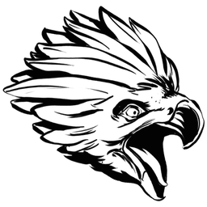 | Griffin | Fantasy Creatures | Griffin | `Griffin_Character_BP_C` | ../icon/creatures_256px/Griffin_Fantasy_Creatures_Griffin_Griffin_Character_BP_C_256px.png | "Blueprint'/Game/PrimalEarth/Dinos/Griffin/Griffin_Character_BP.Griffin_Character_BP'" |
| 3 | Ice Wyvern | Ice Wyvern | Fantasy Creatures | Wyvern | `Ragnarok_Wyvern_Override_Ice_C` | N/A | "Blueprint'/Game/Mods/Ragnarok/Custom_Assets/Dinos/Wyvern/Ice_Wyvern/Ragnarok_Wyvern_Override_Ice.Ra |
| 4 |  | Ice Wyvern | Fantasy Creatures | Wyvern | `Wyvern_Character_BP_Ice_C` | ../icon/creatures_256px/Ice_Wyvern_Fantasy_Creatures_Wyvern_Wyvern_Character_BP_Ice_C_256px.png | "Blueprint'/Game/ASA/Dinos/IceWyvern/Wyvern_Character_BP_Ice.Wyvern_Character_BP_Ice'" |

---

## Creatures of Aberration (畸变)

> 共 79 个生物

| # | 图标 | 名称 | 分类 | Name Tag | Entity ID | Icon URL | Blueprint Path |
|---|------|------|------|----------|-----------|----------|----------------|
| 1 |  | Aberrant Achatina | 无脊椎 | Achatina | `Achatina_Character_BP_Aberrant_C` | ../icon/creatures_256px/Aberrant_Achatina_Invertebrates_Achatina_Achatina_Character_BP_Aberrant_C_256px.png | "Blueprint'/Game/PrimalEarth/Dinos/Achatina/Achatina_Character_BP_Aberrant.Achatina_Character_BP_Abe |
| 2 |  | Aberrant Anglerfish | 鱼类 | Angler | `Angler_Character_BP_Aberrant_C` | ../icon/creatures_256px/Aberrant_Anglerfish_Fish_Angler_Angler_Character_BP_Aberrant_C_256px.png | "Blueprint'/Game/PrimalEarth/Dinos/Anglerfish/Angler_Character_BP_Aberrant.Angler_Character_BP_Aberr |
| 3 |  | Aberrant Ankylosaurus | 恐龙 | Anky | `Ankylo_Character_BP_Aberrant_C` | ../icon/creatures_256px/Aberrant_Ankylosaurus_Dinosaurs_Anky_Ankylo_Character_BP_Aberrant_C_256px.png | "Blueprint'/Game/PrimalEarth/Dinos/Ankylo/Ankylo_Character_BP_Aberrant.Ankylo_Character_BP_Aberrant' |
| 4 |  | Aberrant Araneo | 无脊椎 | Spider | `SpiderS_Character_BP_Aberrant_C` | ../icon/creatures_256px/Aberrant_Araneo_Invertebrates_Spider_SpiderS_Character_BP_Aberrant_C_256px.png | "Blueprint'/Game/PrimalEarth/Dinos/Spider-Small/SpiderS_Character_BP_Aberrant.SpiderS_Character_BP_A |
| 5 |  | Aberrant Arthropluera | 无脊椎 | Arthro | `Arthro_Character_BP_Aberrant_C` | ../icon/creatures_256px/Aberrant_Arthropluera_Invertebrates_Arthro_Arthro_Character_BP_Aberrant_C_256px.png | "Blueprint'/Game/PrimalEarth/Dinos/Arthropluera/Arthro_Character_BP_Aberrant.Arthro_Character_BP_Abe |
| 6 |  | Aberrant Baryonyx | 恐龙 | Baryonyx | `Baryonyx_Character_BP_Aberrant_C` | ../icon/creatures_256px/Aberrant_Baryonyx_Dinosaurs_Baryonyx_Baryonyx_Character_BP_Aberrant_C_256px.png | "Blueprint'/Game/PrimalEarth/Dinos/Baryonyx/Baryonyx_Character_BP_Aberrant.Baryonyx_Character_BP_Abe |
| 7 |  | Aberrant Beelzebufo | 爬行 | Toad | `Toad_Character_BP_Aberrant_C` | ../icon/creatures_256px/Aberrant_Beelzebufo_Reptiles_Toad_Toad_Character_BP_Aberrant_C_256px.png | "Blueprint'/Game/PrimalEarth/Dinos/Toad/Toad_Character_BP_Aberrant.Toad_Character_BP_Aberrant'" |
| 8 |  | Aberrant Carbonemys | 爬行 | Turtle | `Turtle_Character_BP_Aberrant_C` | ../icon/creatures_256px/Aberrant_Carbonemys_Reptiles_Turtle_Turtle_Character_BP_Aberrant_C_256px.png | "Blueprint'/Game/PrimalEarth/Dinos/Turtle/Turtle_Character_BP_Aberrant.Turtle_Character_BP_Aberrant' |
| 9 |  | Aberrant Carnotaurus | 恐龙 | Carno | `Carno_Character_BP_Aberrant_C` | ../icon/creatures_256px/Aberrant_Carnotaurus_Dinosaurs_Carno_Carno_Character_BP_Aberrant_C_256px.png | "Blueprint'/Game/PrimalEarth/Dinos/Carno/Carno_Character_BP_Aberrant.Carno_Character_BP_Aberrant'" |
| 10 |  | Aberrant Cnidaria | 无脊椎 | Cnidaria | `Cnidaria_Character_BP_Aberrant_C` | ../icon/creatures_256px/Aberrant_Cnidaria_Invertebrates_Cnidaria_Cnidaria_Character_BP_Aberrant_C_256px.png | "Blueprint'/Game/PrimalEarth/Dinos/Cnidaria/Cnidaria_Character_BP_Aberrant.Cnidaria_Character_BP_Abe |
| 11 |  | Aberrant Coelacanth | 鱼类 | Coel | `Coel_Character_BP_Aberrant_C` | ../icon/creatures_256px/Aberrant_Coelacanth_Fish_Coel_Coel_Character_BP_Aberrant_C_256px.png | "Blueprint'/Game/PrimalEarth/Dinos/Coelacanth/Coel_Character_BP_Aberrant.Coel_Character_BP_Aberrant' |
| 12 |  | Aberrant Dimetrodon | 恐龙 | Dimetro | `Dimetro_Character_BP_Aberrant_C` | ../icon/creatures_256px/Aberrant_Dimetrodon_Dinosaurs_Dimetro_Dimetro_Character_BP_Aberrant_C_256px.png | "Blueprint'/Game/PrimalEarth/Dinos/Dimetrodon/Dimetro_Character_BP_Aberrant.Dimetro_Character_BP_Abe |
| 13 |  | Aberrant Dimorphodon | 恐龙 | Dimorph | `Dimorph_Character_BP_Aberrant_C` | ../icon/creatures_256px/Aberrant_Dimorphodon_Dinosaurs_Dimorph_Dimorph_Character_BP_Aberrant_C_256px.png | "Blueprint'/Game/PrimalEarth/Dinos/Dimorphodon/Dimorph_Character_BP_Aberrant.Dimorph_Character_BP_Ab |
| 14 |  | Aberrant Diplocaulus | 两栖 | Diplocaulus | `Diplocaulus_Character_BP_Aberrant_C` | ../icon/creatures_256px/Aberrant_Diplocaulus_Amphibians_Diplocaulus_Diplocaulus_Character_BP_Aberrant_C_256px.png | "Blueprint'/Game/PrimalEarth/Dinos/Diplocaulus/Diplocaulus_Character_BP_Aberrant.Diplocaulus_Charact |
| 15 |  | Aberrant Diplodocus | 恐龙 | Diplo | `Diplodocus_Character_BP_Aberrant_C` | ../icon/creatures_256px/Aberrant_Diplodocus_Dinosaurs_Diplo_Diplodocus_Character_BP_Aberrant_C_256px.png | "Blueprint'/Game/PrimalEarth/Dinos/Diplodocus/Diplodocus_Character_BP_Aberrant.Diplodocus_Character_ |
| 16 |  | Aberrant Dire Bear | 哺乳 | Direbear | `Direbear_Character_BP_Aberrant_C` | ../icon/creatures_256px/Aberrant_Dire_Bear_Mammals_Direbear_Direbear_Character_BP_Aberrant_C_256px.png | "Blueprint'/Game/PrimalEarth/Dinos/Direbear/Direbear_Character_BP_Aberrant.Direbear_Character_BP_Abe |
| 17 |  | Aberrant Dodo | 鸟类 | Dodo | `Dodo_Character_BP_Aberrant_C` | ../icon/creatures_256px/Aberrant_Dodo_Birds_Dodo_Dodo_Character_BP_Aberrant_C_256px.png | "Blueprint'/Game/PrimalEarth/Dinos/Dodo/Dodo_Character_BP_Aberrant.Dodo_Character_BP_Aberrant'" |
| 18 |  | Aberrant Doedicurus | 恐龙 | Doed | `Doed_Character_BP_Aberrant_C` | ../icon/creatures_256px/Aberrant_Doedicurus_Dinosaurs_Doed_Doed_Character_BP_Aberrant_C_256px.png | "Blueprint'/Game/PrimalEarth/Dinos/Doedicurus/Doed_Character_BP_Aberrant.Doed_Character_BP_Aberrant' |
| 19 |  | Aberrant Dung Beetle | 无脊椎 | Beetle | `DungBeetle_Character_BP_Aberrant_C` | ../icon/creatures_256px/Aberrant_Dung_Beetle_Invertebrates_Beetle_DungBeetle_Character_BP_Aberrant_C_256px.png | "Blueprint'/Game/PrimalEarth/Dinos/DungBeetle/DungBeetle_Character_BP_Aberrant.DungBeetle_Character_ |
| 20 |  | Aberrant Electrophorus | 鱼类 | Eel | `Eel_Character_BP_Aberrant_C` | ../icon/creatures_256px/Aberrant_Electrophorus_Fish_Eel_Eel_Character_BP_Aberrant_C_256px.png | "Blueprint'/Game/PrimalEarth/Dinos/Eel/Eel_Character_BP_Aberrant.Eel_Character_BP_Aberrant'" |
| 21 |  | Aberrant Equus | 哺乳 | Equus | `Equus_Character_BP_Aberrant_C` | ../icon/creatures_256px/Aberrant_Equus_Mammals_Equus_Equus_Character_BP_Aberrant_C_256px.png | "Blueprint'/Game/PrimalEarth/Dinos/Equus/Equus_Character_BP_Aberrant.Equus_Character_BP_Aberrant'" |
| 22 |  | Aberrant Fasolasuchus | 爬行 | Fasola | `Fasola_Character_BP_Aberrant_C` | ../icon/creatures_256px/Aberrant_Fasolasuchus_Reptiles_Fasola_Fasola_Character_BP_Aberrant_C_256px.png | "Blueprint'/Game/ASA/Dinos/Fasolasuchus/Fasola_Character_BP_Aberrant.Fasola_Character_BP_Aberrant'" |
| 23 |  | Aberrant Gigantopithecus | 哺乳 | Bigfoot | `Bigfoot_Character_BP_Aberrant_C` | ../icon/creatures_256px/Aberrant_Gigantopithecus_Mammals_Bigfoot_Bigfoot_Character_BP_Aberrant_C_256px.png | "Blueprint'/Game/PrimalEarth/Dinos/Bigfoot/Bigfoot_Character_BP_Aberrant.Bigfoot_Character_BP_Aberra |
| 24 |  | Aberrant Gigantoraptor | 恐龙 | Gigantoraptor | `Gigantoraptor_Character_BP_Aberrant_C` | ../icon/creatures_256px/Aberrant_Gigantoraptor_Dinosaurs_Gigantoraptor_Gigantoraptor_Character_BP_Aberrant_C_256px.png | "Blueprint'/Game/ASA/Dinos/Gigantoraptor/Gigantoraptor_Character_BP_Aberrant.Gigantoraptor_Character |
| 25 |  | Aberrant Iguanodon | 恐龙 | Iguanodon | `Iguanodon_Character_BP_Aberrant_C` | ../icon/creatures_256px/Aberrant_Iguanodon_Dinosaurs_Iguanodon_Iguanodon_Character_BP_Aberrant_C_256px.png | "Blueprint'/Game/PrimalEarth/Dinos/Iguanodon/Iguanodon_Character_BP_Aberrant.Iguanodon_Character_BP_ |
| 26 |  | Aberrant Lystrosaurus | 恐龙 | Lystro | `Lystro_Character_BP_Aberrant_C` | ../icon/creatures_256px/Aberrant_Lystrosaurus_Dinosaurs_Lystro_Lystro_Character_BP_Aberrant_C_256px.png | "Blueprint'/Game/PrimalEarth/Dinos/Lystrosaurus/Lystro_Character_BP_Aberrant.Lystro_Character_BP_Abe |
| 27 |  | Aberrant Manta | 鱼类 | Manta | `Manta_Character_BP_Aberrant_C` | ../icon/creatures_256px/Aberrant_Manta_Fish_Manta_Manta_Character_BP_Aberrant_C_256px.png | "Blueprint'/Game/PrimalEarth/Dinos/Manta/Manta_Character_BP_Aberrant.Manta_Character_BP_Aberrant'" |
| 28 |  | Aberrant Megalania | 爬行 | Megalania | `Megalania_Character_BP_Aberrant_C` | ../icon/creatures_256px/Aberrant_Megalania_Reptiles_Megalania_Megalania_Character_BP_Aberrant_C_256px.png | "Blueprint'/Game/PrimalEarth/Dinos/Megalania/Megalania_Character_BP_Aberrant.Megalania_Character_BP_ |
| 29 |  | Aberrant Megalosaurus | 恐龙 | Megalosaurus | `Megalosaurus_Character_BP_Aberrant_C` | ../icon/creatures_256px/Aberrant_Megalosaurus_Dinosaurs_Megalosaurus_Megalosaurus_Character_BP_Aberrant_C_256px.png | "Blueprint'/Game/PrimalEarth/Dinos/Megalosaurus/Megalosaurus_Character_BP_Aberrant.Megalosaurus_Char |
| 30 |  | Aberrant Meganeura | 无脊椎 | Dragonfly | `Dragonfly_Character_BP_Aberrant_C` | ../icon/creatures_256px/Aberrant_Meganeura_Invertebrates_Dragonfly_Dragonfly_Character_BP_Aberrant_C_256px.png | "Blueprint'/Game/PrimalEarth/Dinos/Dragonfly/Dragonfly_Character_BP_Aberrant.Dragonfly_Character_BP_ |
| 31 |  | Aberrant Moschops | 合弓纲 | Moschops | `Moschops_Character_BP_Aberrant_C` | ../icon/creatures_256px/Aberrant_Moschops_Synapsids_Moschops_Moschops_Character_BP_Aberrant_C_256px.png | "Blueprint'/Game/PrimalEarth/Dinos/Moschops/Moschops_Character_BP_Aberrant.Moschops_Character_BP_Abe |
| 32 |  | Aberrant Otter | 哺乳 | Otter | `Otter_Character_BP_Aberrant_C` | ../icon/creatures_256px/Aberrant_Otter_Mammals_Otter_Otter_Character_BP_Aberrant_C_256px.png | "Blueprint'/Game/PrimalEarth/Dinos/Otter/Otter_Character_BP_Aberrant.Otter_Character_BP_Aberrant'" |
| 33 |  | Aberrant Oviraptor | 恐龙 | Oviraptor | `Oviraptor_Character_BP_Aberrant_C` | ../icon/creatures_256px/Aberrant_Oviraptor_Dinosaurs_Oviraptor_Oviraptor_Character_BP_Aberrant_C_256px.png | "Blueprint'/Game/PrimalEarth/Dinos/Oviraptor/Oviraptor_Character_BP_Aberrant.Oviraptor_Character_BP_ |
| 34 |  | Aberrant Ovis | 哺乳 | Sheep | `Sheep_Character_BP_Aberrant_C` | ../icon/creatures_256px/Aberrant_Ovis_Mammals_Sheep_Sheep_Character_BP_Aberrant_C_256px.png | "Blueprint'/Game/PrimalEarth/Dinos/Sheep/Sheep_Character_BP_Aberrant.Sheep_Character_BP_Aberrant'" |
| 35 |  | Aberrant Paraceratherium | 哺乳 | Paracer | `Paracer_Character_BP_Aberrant_C` | ../icon/creatures_256px/Aberrant_Paraceratherium_Mammals_Paracer_Paracer_Character_BP_Aberrant_C_256px.png | "Blueprint'/Game/PrimalEarth/Dinos/Paraceratherium/Paracer_Character_BP_Aberrant.Paracer_Character_B |
| 36 |  | Aberrant Parasaur | 恐龙 | Para | `Para_Character_BP_Aberrant_C` | ../icon/creatures_256px/Aberrant_Parasaur_Dinosaurs_Para_Para_Character_BP_Aberrant_C_256px.png | "Blueprint'/Game/PrimalEarth/Dinos/Para/Para_Character_BP_Aberrant.Para_Character_BP_Aberrant'" |
| 37 |  | Aberrant Piranha | 鱼类 | Piranha | `Piranha_Character_BP_Aberrant_C` | ../icon/creatures_256px/Aberrant_Piranha_Fish_Piranha_Piranha_Character_BP_Aberrant_C_256px.png | "Blueprint'/Game/PrimalEarth/Dinos/Piranha/Piranha_Character_BP_Aberrant.Piranha_Character_BP_Aberra |
| 38 |  | Aberrant Pulmonoscorpius | 无脊椎 | Scorpion | `Scorpion_Character_BP_Aberrant_C` | ../icon/creatures_256px/Aberrant_Pulmonoscorpius_Invertebrates_Scorpion_Scorpion_Character_BP_Aberrant_C_256px.png | "Blueprint'/Game/PrimalEarth/Dinos/Scorpion/Scorpion_Character_BP_Aberrant.Scorpion_Character_BP_Abe |
| 39 |  | Aberrant Purlovia | 合弓纲 | Purlovia | `Purlovia_Character_BP_Aberrant_C` | ../icon/creatures_256px/Aberrant_Purlovia_Synapsids_Purlovia_Purlovia_Character_BP_Aberrant_C_256px.png | "Blueprint'/Game/PrimalEarth/Dinos/Purlovia/Purlovia_Character_BP_Aberrant.Purlovia_Character_BP_Abe |
| 40 |  | Aberrant Raptor | 恐龙 | Raptor | `Raptor_Character_BP_Aberrant_C` | ../icon/creatures_256px/Aberrant_Raptor_Dinosaurs_Raptor_Raptor_Character_BP_Aberrant_C_256px.png | "Blueprint'/Game/PrimalEarth/Dinos/Raptor/Raptor_Character_BP_Aberrant.Raptor_Character_BP_Aberrant' |
| 41 | 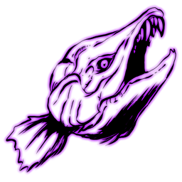 | Aberrant Sabertooth Salmon | 鱼类 | Salmon | `Salmon_Character_Aberrant_C` | ../icon/creatures_256px/Aberrant_Sabertooth_Salmon_Fish_Salmon_Salmon_Character_Aberrant_C_256px.png | "Blueprint'/Game/PrimalEarth/Dinos/Salmon/Salmon_Character_Aberrant.Salmon_Character_Aberrant'" |
| 42 |  | Aberrant Sarco | 爬行 | Sarco | `Sarco_Character_BP_Aberrant_C` | ../icon/creatures_256px/Aberrant_Sarco_Reptiles_Sarco_Sarco_Character_BP_Aberrant_C_256px.png | "Blueprint'/Game/PrimalEarth/Dinos/Sarco/Sarco_Character_BP_Aberrant.Sarco_Character_BP_Aberrant'" |
| 43 |  | Aberrant Spino | 恐龙 | Spino | `Spino_Character_BP_Aberrant_C` | ../icon/creatures_256px/Aberrant_Spino_Dinosaurs_Spino_Spino_Character_BP_Aberrant_C_256px.png | "Blueprint'/Game/PrimalEarth/Dinos/Spino/Spino_Character_BP_Aberrant.Spino_Character_BP_Aberrant'" |
| 44 |  | Aberrant Stegosaurus | 恐龙 | Stego | `Stego_Character_BP_Aberrant_C` | ../icon/creatures_256px/Aberrant_Stegosaurus_Dinosaurs_Stego_Stego_Character_BP_Aberrant_C_256px.png | "Blueprint'/Game/PrimalEarth/Dinos/Stego/Stego_Character_BP_Aberrant.Stego_Character_BP_Aberrant'" |
| 45 |  | Aberrant Titanoboa | 爬行 | Titanboa | `BoaFrill_Character_BP_Aberrant_C` | ../icon/creatures_256px/Aberrant_Titanoboa_Reptiles_Titanboa_BoaFrill_Character_BP_Aberrant_C_256px.png | "Blueprint'/Game/PrimalEarth/Dinos/BoaFrill/BoaFrill_Character_BP_Aberrant.BoaFrill_Character_BP_Abe |
| 46 |  | Aberrant Triceratops | 恐龙 | Trike | `Trike_Character_BP_Aberrant_C` | ../icon/creatures_256px/Aberrant_Triceratops_Dinosaurs_Trike_Trike_Character_BP_Aberrant_C_256px.png | "Blueprint'/Game/PrimalEarth/Dinos/Trike/Trike_Character_BP_Aberrant.Trike_Character_BP_Aberrant'" |
| 47 |  | Aberrant Trilobite | 无脊椎 | Trilobite | `Trilobite_Character_Aberrant_C` | ../icon/creatures_256px/Aberrant_Trilobite_Invertebrates_Trilobite_Trilobite_Character_Aberrant_C_256px.png | "Blueprint'/Game/PrimalEarth/Dinos/Trilobite/Trilobite_Character_Aberrant.Trilobite_Character_Aberra |
| 48 |  | Alpha Basilisk | Alpha Creatures | Elite Basilisk | `MegaBasilisk_Character_BP_C` | ../icon/creatures_256px/Alpha_Basilisk_Alpha_Creatures_Elite_Basilisk_MegaBasilisk_Character_BP_C_256px.png | "Blueprint'/Game/Aberration/Dinos/Basilisk/MegaBasilisk_Character_BP.MegaBasilisk_Character_BP'" |
| 49 |  | Alpha Karkinos | Alpha Creatures | Elite CaveCrab | `MegaCrab_Character_BP_C` | ../icon/creatures_256px/Alpha_Karkinos_Alpha_Creatures_Elite_CaveCrab_MegaCrab_Character_BP_C_256px.png | "Blueprint'/Game/Aberration/Dinos/Crab/MegaCrab_Character_BP.MegaCrab_Character_BP'" |
| 50 |  | Alpha Surface Reaper King | Alpha Creatures | Elite Xenomorph | `MegaXenomorph_Character_BP_Male_Surface_C` | ../icon/creatures_256px/Alpha_Surface_Reaper_King_Alpha_Creatures_Elite_Xenomorph_MegaXenomorph_Character_BP_Male_Surface_C_256px.png | "Blueprint'/Game/Aberration/Dinos/Nameless/MegaXenomorph_Character_BP_Male_Surface.MegaXenomorph_Cha |
| 51 |  | Basilisk | Fantasy Creatures | Basilisk | `Basilisk_Character_BP_C` | ../icon/creatures_256px/Alpha_Basilisk_Alpha_Creatures_Elite_Basilisk_MegaBasilisk_Character_BP_C_256px.png | "Blueprint'/Game/Aberration/Dinos/Basilisk/Basilisk_Character_BP.Basilisk_Character_BP'" |
| 52 | 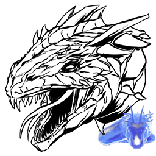 | Basilisk Ghost | Event Creatures | Basilisk | `Ghost_Basilisk_Character_BP_C` | ../icon/creatures_256px/Basilisk_Ghost_Event_Creatures_Basilisk_Ghost_Basilisk_Character_BP_C_256px.png | "Blueprint'/Game/Aberration/Dinos/Basilisk/Ghost_Basilisk_Character_BP.Ghost_Basilisk_Character_BP'" |
| 53 |  | Bulbdog | Fantasy Creatures | Pug | `LanternPug_Character_BP_C` | ../icon/creatures_256px/Bulbdog_Fantasy_Creatures_Pug_LanternPug_Character_BP_C_256px.png | "Blueprint'/Game/Aberration/Dinos/LanternPug/LanternPug_Character_BP.LanternPug_Character_BP'" |
| 54 | 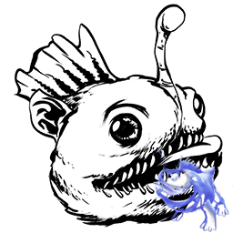 | Bulbdog Ghost | Event Creatures | Pug | `Ghost_LanternPug_Character_BP_C` | ../icon/creatures_256px/Bulbdog_Ghost_Event_Creatures_Pug_Ghost_LanternPug_Character_BP_C_256px.png | "Blueprint'/Game/Aberration/Dinos/LanternPug/Ghost_LanternPug_Character_BP.Ghost_LanternPug_Characte |
| 55 |  | Cosmo | 无脊椎 | JumpingSpider | `JumpingSpider_Character_BP_C` | ../icon/creatures_256px/Cosmo_Invertebrates_JumpingSpider_JumpingSpider_Character_BP_C_256px.png | "Blueprint'/Game/Packs/Steampunk/Dinos/JumpingSpider/JumpingSpider_Character_BP.JumpingSpider_Charac |
| 56 |  | Featherlight | Fantasy Creatures | Lantern Bird | `LanternBird_Character_BP_C` | ../icon/creatures_256px/Featherlight_Fantasy_Creatures_Lantern_Bird_LanternBird_Character_BP_C_256px.png | "Blueprint'/Game/Aberration/Dinos/LanternBird/LanternBird_Character_BP.LanternBird_Character_BP'" |
| 57 |  | Glowbug | Fantasy Creatures | Lightbug | `Lightbug_Character_BaseBP_C` | ../icon/creatures_256px/Glowbug_Fantasy_Creatures_Lightbug_Lightbug_Character_BaseBP_C_256px.png | "Blueprint'/Game/Aberration/Dinos/Lightbug/Lightbug_Character_BaseBP.Lightbug_Character_BaseBP'" |
| 58 |  | Glowtail | Fantasy Creatures | Lantern Lizard | `LanternLizard_Character_BP_C` | ../icon/creatures_256px/Glowtail_Fantasy_Creatures_Lantern_Lizard_LanternLizard_Character_BP_C_256px.png | "Blueprint'/Game/Aberration/Dinos/LanternLizard/LanternLizard_Character_BP.LanternLizard_Character_B |
| 59 |  | Karkinos | Fantasy Creatures | CaveCrab | `Crab_Character_BP_C` | ../icon/creatures_256px/Alpha_Karkinos_Alpha_Creatures_Elite_CaveCrab_MegaCrab_Character_BP_C_256px.png | "Blueprint'/Game/Aberration/Dinos/Crab/Crab_Character_BP.Crab_Character_BP'" |
| 60 |  | Lamprey | 鱼类 | Lamprey | `Lamprey_Character_C` | ../icon/creatures_256px/Lamprey_Fish_Lamprey_Lamprey_Character_C_256px.png | "Blueprint'/Game/Aberration/Dinos/Lamprey/Lamprey_Character.Lamprey_Character'" |
| 61 |  | Nameless | Fantasy Creatures | Chupacabra | `ChupaCabra_Character_BP_C` | ../icon/creatures_256px/Nameless_Fantasy_Creatures_Chupacabra_ChupaCabra_Character_BP_C_256px.png | "Blueprint'/Game/Aberration/Dinos/ChupaCabra/ChupaCabra_Character_BP.ChupaCabra_Character_BP'" |
| 62 |  | Ravager | Fantasy Creatures | CaveWolf | `CaveWolf_Character_BP_C` | ../icon/creatures_256px/Ravager_Fantasy_Creatures_CaveWolf_CaveWolf_Character_BP_C_256px.png | "Blueprint'/Game/Aberration/Dinos/CaveWolf/CaveWolf_Character_BP.CaveWolf_Character_BP'" |
| 63 |  | Reaper King | Fantasy Creatures | Xenomorph | `Xenomorph_Character_BP_Male_C` | ../icon/creatures_256px/Reaper_King_Fantasy_Creatures_Xenomorph_Xenomorph_Character_BP_Male_C_256px.png | "Blueprint'/Game/Aberration/Dinos/Nameless/Xenomorph_Character_BP_Male.Xenomorph_Character_BP_Male'" |
| 64 | 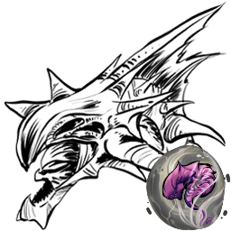 | Reaper King (Tamed) | Fantasy Creatures | Xenomorph | `Xenomorph_Character_BP_Male_Tamed_C` | ../icon/creatures_256px/Corrupted_Reaper_King_Fantasy_Creatures_Xenomorph_Corrupt_Xenomorph_Character_BP_Male_Tamed_Corrupt_C_256px.png | "Blueprint'/Game/Aberration/Dinos/Nameless/Xenomorph_Character_BP_Male_Tamed.Xenomorph_Character_BP_ |
| 65 |  | Reaper Queen | Fantasy Creatures | Xenomorph | `Xenomorph_Character_BP_Female_C` | ../icon/creatures_256px/Reaper_Queen_Fantasy_Creatures_Xenomorph_Xenomorph_Character_BP_Female_C_256px.png | "Blueprint'/Game/Aberration/Dinos/Nameless/Xenomorph_Character_BP_Female.Xenomorph_Character_BP_Fema |
| 66 |  | Rock Drake | Fantasy Creatures | RockDrake | `RockDrake_Character_BP_C` | ../icon/creatures_256px/Corrupted_Rock_Drake_Fantasy_Creatures_RockDrake_Corrupt_RockDrake_Character_BP_Corrupt_C_256px.png | "Blueprint'/Game/Aberration/Dinos/RockDrake/RockDrake_Character_BP.RockDrake_Character_BP'" |
| 67 |  | Rockwell | Fantasy Creatures | Rockwell | `Rockwell_Character_BP_C` | ../icon/creatures_256px/Rockwell_Fantasy_Creatures_Rockwell_Rockwell_Character_BP_C_256px.png | "Blueprint'/Game/Aberration/Boss/Rockwell/Rockwell_Character_BP.Rockwell_Character_BP'" |
| 68 |  | Rockwell (Alpha) | Fantasy Creatures | Rockwell | `Rockwell_Character_BP_Hard_C` | ../icon/creatures_256px/Rockwell_(Alpha)_Fantasy_Creatures_Rockwell_Rockwell_Character_BP_Hard_C_256px.png | "Blueprint'/Game/Aberration/Boss/Rockwell/Rockwell_Character_BP_Hard.Rockwell_Character_BP_Hard'" |
| 69 |  | Rockwell (Beta) | Fantasy Creatures | Rockwell | `Rockwell_Character_BP_Medium_C` | ../icon/creatures_256px/Rockwell_(Beta)_Fantasy_Creatures_Rockwell_Rockwell_Character_BP_Medium_C_256px.png | "Blueprint'/Game/Aberration/Boss/Rockwell/Rockwell_Character_BP_Medium.Rockwell_Character_BP_Medium' |
| 70 |  | Rockwell (Gamma) | Fantasy Creatures | Rockwell | `Rockwell_Character_BP_Easy_C` | ../icon/creatures_256px/Rockwell_(Gamma)_Fantasy_Creatures_Rockwell_Rockwell_Character_BP_Easy_C_256px.png | "Blueprint'/Game/Aberration/Boss/Rockwell/Rockwell_Character_BP_Easy.Rockwell_Character_BP_Easy'" |
| 71 |  | Rockwell Tentacle | Fantasy Creatures | RockwellTentacle | `RockwellTentacle_Character_BP_C` | ../icon/creatures_256px/Rockwell_Tentacle_Fantasy_Creatures_RockwellTentacle_RockwellTentacle_Character_BP_C_256px.png | "Blueprint'/Game/Aberration/Boss/RockwellTentacle/RockwellTentacle_Character_BP.RockwellTentacle_Cha |
| 72 |  | Rockwell Tentacle (Alpha) | Fantasy Creatures | RockwellTentacle | `RockwellTentacle_Character_BP_Alpha_C` | ../icon/creatures_256px/Rockwell_Tentacle_(Alpha)_Fantasy_Creatures_RockwellTentacle_RockwellTentacle_Character_BP_Alpha_C_256px.png | "Blueprint'/Game/Aberration/Boss/RockwellTentacle/RockwellTentacle_Character_BP_Alpha.RockwellTentac |
| 73 |  | Rockwell Tentacle (Beta) | Fantasy Creatures | RockwellTentacle | `RockwellTentacle_Character_BP_Beta_C` | ../icon/creatures_256px/Rockwell_Tentacle_(Beta)_Fantasy_Creatures_RockwellTentacle_RockwellTentacle_Character_BP_Beta_C_256px.png | "Blueprint'/Game/Aberration/Boss/RockwellTentacle/RockwellTentacle_Character_BP_Beta.RockwellTentacl |
| 74 |  | Rockwell Tentacle (Gamma) | Fantasy Creatures | RockwellTentacle | `RockwellTentacle_Character_BP_Gamma_C` | ../icon/creatures_256px/Rockwell_Tentacle_(Gamma)_Fantasy_Creatures_RockwellTentacle_RockwellTentacle_Character_BP_Gamma_C_256px.png | "Blueprint'/Game/Aberration/Boss/RockwellTentacle/RockwellTentacle_Character_BP_Gamma.RockwellTentac |
| 75 |  | Roll Rat | Fantasy Creatures | MoleRat | `MoleRat_Character_BP_C` | ../icon/creatures_256px/Roll_Rat_Fantasy_Creatures_MoleRat_MoleRat_Character_BP_C_256px.png | "Blueprint'/Game/Aberration/Dinos/MoleRat/MoleRat_Character_BP.MoleRat_Character_BP'" |
| 76 |  | Seeker | Fantasy Creatures | Seeker | `Pteroteuthis_Char_BP_C` | ../icon/creatures_256px/Seeker_Fantasy_Creatures_Seeker_Pteroteuthis_Char_BP_C_256px.png | "Blueprint'/Game/Aberration/Dinos/Pteroteuthis/Pteroteuthis_Char_BP.Pteroteuthis_Char_BP'" |
| 77 |  | Shinehorn | Fantasy Creatures | Lantern Goat | `LanternGoat_Character_BP_C` | ../icon/creatures_256px/Shinehorn_Fantasy_Creatures_Lantern_Goat_LanternGoat_Character_BP_C_256px.png | "Blueprint'/Game/Aberration/Dinos/LanternGoat/LanternGoat_Character_BP.LanternGoat_Character_BP'" |
| 78 |  | Surface Reaper King Ghost | Event Creatures | Xenomorph | `Ghost_Xenomorph_Character_BP_Male_Surface_C` | ../icon/creatures_256px/Surface_Reaper_King_Ghost_Event_Creatures_Xenomorph_Ghost_Xenomorph_Character_BP_Male_Surface_C_256px.png | "Blueprint'/Game/Aberration/Dinos/Nameless/Ghost_Xenomorph_Character_BP_Male_Surface.Ghost_Xenomorph |
| 79 |  | Yi Ling | 恐龙 | YiLing | `YiLing_Character_BP_C` | ../icon/creatures_256px/Yi_Ling_Dinosaurs_YiLing_YiLing_Character_BP_C_256px.png | "Blueprint'/Game/ASA/Dinos/YiLing/YiLing_Character_BP.YiLing_Character_BP'" |

---

## Creatures of Extinction (灭绝)

> 共 40 个生物

| # | 图标 | 名称 | 分类 | Name Tag | Entity ID | Icon URL | Blueprint Path |
|---|------|------|------|----------|-----------|----------|----------------|
| 1 |  | Alpha King Titan | Fantasy Creatures | KingTitanAlpha | `KingKaiju_Character_BP_Alpha_C` | ../icon/creatures_256px/Alpha_King_Titan_Fantasy_Creatures_KingTitanAlpha_KingKaiju_Character_BP_Alpha_C_256px.png | "Blueprint'/Game/Extinction/Dinos/KingKaiju/KingKaiju_Character_BP_Alpha.KingKaiju_Character_BP_Alph |
| 2 |  | Armadoggo | Fantasy Creatures | Doggo | `Doggo_Character_BP_C` | ../icon/creatures_256px/Armadoggo_Fantasy_Creatures_Doggo_Doggo_Character_BP_C_256px.png | "Blueprint'/Game/Packs/Wasteland/Dinos/Doggo/Doggo_Character_BP.Doggo_Character_BP'" |
| 3 |  | Beta King Titan | Fantasy Creatures | King Titan | `KingKaiju_Character_BP_Beta_C` | ../icon/creatures_256px/Beta_King_Titan_Fantasy_Creatures_King_Titan_KingKaiju_Character_BP_Beta_C_256px.png | "Blueprint'/Game/Extinction/Dinos/KingKaiju/KingKaiju_Character_BP_Beta.KingKaiju_Character_BP_Beta' |
| 4 |  | Corrupted Arthropluera | 无脊椎 | Arthro Corrupt | `Arthro_Character_BP_Corrupt_C` | ../icon/creatures_256px/Corrupted_Arthropluera_Invertebrates_Arthro_Corrupt_Arthro_Character_BP_Corrupt_C_256px.png | "Blueprint'/Game/Extinction/Dinos/Corrupt/Arthropluera/Arthro_Character_BP_Corrupt.Arthro_Character_ |
| 5 |  | Corrupted Carnotaurus | 恐龙 | Carno Corrupt | `Carno_Character_BP_Corrupt_C` | ../icon/creatures_256px/Corrupted_Carnotaurus_Dinosaurs_Carno_Corrupt_Carno_Character_BP_Corrupt_C_256px.png | "Blueprint'/Game/Extinction/Dinos/Corrupt/Carno/Carno_Character_BP_Corrupt.Carno_Character_BP_Corrup |
| 6 |  | Corrupted Chalicotherium | 哺乳 | Chalico | `Chalico_Character_BP_Corrupt_C` | ../icon/creatures_256px/Corrupted_Chalicotherium_Mammals_Chalico_Chalico_Character_BP_Corrupt_C_256px.png | "Blueprint'/Game/Extinction/Dinos/Corrupt/Chalicotherium/Chalico_Character_BP_Corrupt.Chalico_Charac |
| 7 |  | Corrupted Dilophosaur | 恐龙 | Dilo Corrupt | `Dilo_Character_BP_Corrupt_C` | ../icon/creatures_256px/Corrupted_Dilophosaur_Dinosaurs_Dilo_Corrupt_Dilo_Character_BP_Corrupt_C_256px.png | "Blueprint'/Game/Extinction/Dinos/Corrupt/Dilo/Dilo_Character_BP_Corrupt.Dilo_Character_BP_Corrupt'" |
| 8 |  | Corrupted Dimorphodon | 恐龙 | Dimorph Corrupt | `Dimorph_Character_BP_Corrupt_C` | ../icon/creatures_256px/Corrupted_Dimorphodon_Dinosaurs_Dimorph_Corrupt_Dimorph_Character_BP_Corrupt_C_256px.png | "Blueprint'/Game/Extinction/Dinos/Corrupt/Dimorphodon/Dimorph_Character_BP_Corrupt.Dimorph_Character |
| 9 |  | Corrupted Giganotosaurus | 恐龙 | Gigant Corrupt | `Gigant_Character_BP_Corrupt_C` | ../icon/creatures_256px/Corrupted_Giganotosaurus_Dinosaurs_Gigant_Corrupt_Gigant_Character_BP_Corrupt_C_256px.png | "Blueprint'/Game/Extinction/Dinos/Corrupt/Giganotosaurus/Gigant_Character_BP_Corrupt.Gigant_Characte |
| 10 |  | Corrupted Paraceratherium | 哺乳 | Paracer | `Paracer_Character_BP_Corrupt_C` | ../icon/creatures_256px/Corrupted_Paraceratherium_Mammals_Paracer_Paracer_Character_BP_Corrupt_C_256px.png | "Blueprint'/Game/Extinction/Dinos/Corrupt/Paraceratherium/Paracer_Character_BP_Corrupt.Paracer_Chara |
| 11 |  | Corrupted Pteranodon | 恐龙 | Ptera Corrupt | `Ptero_Character_BP_Corrupt_C` | ../icon/creatures_256px/Corrupted_Pteranodon_Dinosaurs_Ptera_Corrupt_Ptero_Character_BP_Corrupt_C_256px.png | "Blueprint'/Game/Extinction/Dinos/Corrupt/Ptero/Ptero_Character_BP_Corrupt.Ptero_Character_BP_Corrup |
| 12 |  | Corrupted Raptor | 恐龙 | Raptor Corrupt | `Raptor_Character_BP_Corrupt_C` | ../icon/creatures_256px/Corrupted_Raptor_Dinosaurs_Raptor_Corrupt_Raptor_Character_BP_Corrupt_C_256px.png | "Blueprint'/Game/Extinction/Dinos/Corrupt/Raptor/Raptor_Character_BP_Corrupt.Raptor_Character_BP_Cor |
| 13 |  | Corrupted Reaper King | Fantasy Creatures | Xenomorph Corrupt | `Xenomorph_Character_BP_Male_Tamed_Corrupt_C` | ../icon/creatures_256px/Corrupted_Reaper_King_Fantasy_Creatures_Xenomorph_Corrupt_Xenomorph_Character_BP_Male_Tamed_Corrupt_C_256px.png | "Blueprint'/Game/Extinction/Dinos/Corrupt/Nameless/Xenomorph_Character_BP_Male_Tamed_Corrupt.Xenomor |
| 14 |  | Corrupted Rex | 恐龙 | Rex Corrupt | `Rex_Character_BP_Corrupt_C` | ../icon/creatures_256px/Corrupted_Rex_Dinosaurs_Rex_Corrupt_Rex_Character_BP_Corrupt_C_256px.png | "Blueprint'/Game/Extinction/Dinos/Corrupt/Rex/Rex_Character_BP_Corrupt.Rex_Character_BP_Corrupt'" |
| 15 |  | Corrupted Rock Drake | Fantasy Creatures | RockDrake Corrupt | `RockDrake_Character_BP_Corrupt_C` | ../icon/creatures_256px/Corrupted_Rock_Drake_Fantasy_Creatures_RockDrake_Corrupt_RockDrake_Character_BP_Corrupt_C_256px.png | "Blueprint'/Game/Extinction/Dinos/Corrupt/RockDrake/RockDrake_Character_BP_Corrupt.RockDrake_Charact |
| 16 |  | Corrupted Spino | 恐龙 | Spino Corrupt | `Spino_Character_BP_Corrupt_C` | ../icon/creatures_256px/Corrupted_Spino_Dinosaurs_Spino_Corrupt_Spino_Character_BP_Corrupt_C_256px.png | "Blueprint'/Game/Extinction/Dinos/Corrupt/Spino/Spino_Character_BP_Corrupt.Spino_Character_BP_Corrup |
| 17 |  | Corrupted Stegosaurus | 恐龙 | Stego Corrupt | `Stego_Character_BP_Corrupt_C` | ../icon/creatures_256px/Corrupted_Stegosaurus_Dinosaurs_Stego_Corrupt_Stego_Character_BP_Corrupt_C_256px.png | "Blueprint'/Game/Extinction/Dinos/Corrupt/Stego/Stego_Character_BP_Corrupt.Stego_Character_BP_Corrup |
| 18 |  | Corrupted Triceratops | 恐龙 | Trike | `Trike_Character_BP_Corrupt_C` | ../icon/creatures_256px/Corrupted_Triceratops_Dinosaurs_Trike_Trike_Character_BP_Corrupt_C_256px.png | "Blueprint'/Game/Extinction/Dinos/Corrupt/Trike/Trike_Character_BP_Corrupt.Trike_Character_BP_Corrup |
| 19 |  | Corrupted Wyvern | Fantasy Creatures | Wyvern | `Wyvern_Character_BP_Fire_Corrupt_C` | ../icon/creatures_256px/Corrupted_Wyvern_Fantasy_Creatures_Wyvern_Wyvern_Character_BP_Fire_Corrupt_C_256px.png | "Blueprint'/Game/Extinction/Dinos/Corrupt/Wyvern/Wyvern_Character_BP_Fire_Corrupt.Wyvern_Character_B |
| 20 |  | Defense Unit | Fantasy Creatures | EndTank | `Defender_Character_BP_C` | ../icon/creatures_256px/Defense_Unit_Fantasy_Creatures_EndTank_Defender_Character_BP_C_256px.png | "Blueprint'/Game/Extinction/Dinos/Tank/Defender_Character_BP.Defender_Character_BP'" |
| 21 |  | Desert Titan | Fantasy Creatures | DesertTitan | `DesertKaiju_Character_BP_C` | ../icon/creatures_256px/Desert_Titan_Fantasy_Creatures_DesertTitan_DesertKaiju_Character_BP_C_256px.png | "Blueprint'/Game/Extinction/Dinos/DesertKaiju/DesertKaiju_Character_BP.DesertKaiju_Character_BP'" |
| 22 |  | Desert Titan Flock | Fantasy Creatures | Flock | `DesertKaiju_FirstFlockChar_BP_C` | ../icon/creatures_256px/Desert_Titan_Flock_Fantasy_Creatures_Flock_DesertKaiju_FirstFlockChar_BP_C_256px.png | "Blueprint'/Game/Extinction/Dinos/DesertKaiju/DesertKaiju_FirstFlockChar_BP.DesertKaiju_FirstFlockCh |
| 23 |  | Dreadnoughtus | 恐龙 | Dreadnoughtus | `Dreadnoughtus_Character_BP_C` | ../icon/creatures_256px/Dreadnoughtus_Dinosaurs_Dreadnoughtus_Dreadnoughtus_Character_BP_C_256px.png | "Blueprint'/Game/ASA/Dinos/Dreadnoughtus/Dreadnoughtus_Character_BP.Dreadnoughtus_Character_BP'" |
| 24 |  | Enforcer | Fantasy Creatures | Enforcer | `Enforcer_Character_BP_C` | ../icon/creatures_256px/Enforcer_Fantasy_Creatures_Enforcer_Enforcer_Character_BP_C_256px.png | "Blueprint'/Game/Extinction/Dinos/Enforcer/Enforcer_Character_BP.Enforcer_Character_BP'" |
| 25 |  | Enraged Corrupted Rex | 恐龙 | Elite Rex Corrupt | `MegaRex_Character_BP_Corrupt_C` | ../icon/creatures_256px/Enraged_Corrupted_Rex_Dinosaurs_Elite_Rex_Corrupt_MegaRex_Character_BP_Corrupt_C_256px.png | "Blueprint'/Game/Extinction/Dinos/Corrupt/Rex/MegaRex_Character_BP_Corrupt.MegaRex_Character_BP_Corr |
| 26 |  | Enraged Triceratops | 恐龙 | Trike | `MegaTrike_Character_BP_Corrupt_C` | ../icon/creatures_256px/Enraged_Triceratops_Dinosaurs_Trike_MegaTrike_Character_BP_Corrupt_C_256px.png | "Blueprint'/Game/Extinction/Dinos/Corrupt/Trike/MegaTrike_Character_BP_Corrupt.MegaTrike_Character_B |
| 27 |  | Forest Titan | Fantasy Creatures | ForestTitan | `ForestKaiju_Character_BP_C` | ../icon/creatures_256px/Forest_Titan_Fantasy_Creatures_ForestTitan_ForestKaiju_Character_BP_C_256px.png | "Blueprint'/Game/Extinction/Dinos/ForestKaiju/ForestKaiju_Character_BP.ForestKaiju_Character_BP'" |
| 28 |  | Forest Wyvern | Fantasy Creatures | Wyvern | `Wyvern_Character_BP_Fire_Minion_C` | ../icon/creatures_256px/Forest_Wyvern_Fantasy_Creatures_Wyvern_Wyvern_Character_BP_Fire_Minion_C_256px.png | "Blueprint'/Game/Extinction/Dinos/ForestKaiju/Minion/Wyvern_Character_BP_Fire_Minion.Wyvern_Characte |
| 29 |  | Gacha | Fantasy Creatures | Gacha | `Gacha_Character_BP_C` | ../icon/creatures_256px/Gacha_Fantasy_Creatures_Gacha_Gacha_Character_BP_C_256px.png | "Blueprint'/Game/Extinction/Dinos/Gacha/Gacha_Character_BP.Gacha_Character_BP'" |
| 30 |  | GachaClaus | Fantasy Creatures | Gacha | `Gacha_Claus_Character_BP_C` | ../icon/creatures_256px/GachaClaus_Fantasy_Creatures_Gacha_Gacha_Claus_Character_BP_C_256px.png | "Blueprint'/Game/Extinction/Dinos/Gacha/Gacha_Claus_Character_BP.Gacha_Claus_Character_BP'" |
| 31 |  | Gamma King Titan | Fantasy Creatures | King Titan | `KingKaiju_Character_BP_C` | ../icon/creatures_256px/Gamma_King_Titan_Fantasy_Creatures_King_Titan_KingKaiju_Character_BP_C_256px.png | "Blueprint'/Game/Extinction/Dinos/KingKaiju/KingKaiju_Character_BP.KingKaiju_Character_BP'" |
| 32 |  | Gasbags | Fantasy Creatures | GasBags | `GasBags_Character_BP_C` | ../icon/creatures_256px/Gasbags_Fantasy_Creatures_GasBags_GasBags_Character_BP_C_256px.png | "Blueprint'/Game/Extinction/Dinos/GasBag/GasBags_Character_BP.GasBags_Character_BP'" |
| 33 |  | Ice Titan | Fantasy Creatures | IceTitan | `IceKaiju_Character_BP_C` | ../icon/creatures_256px/Ice_Titan_Fantasy_Creatures_IceTitan_IceKaiju_Character_BP_C_256px.png | "Blueprint'/Game/Extinction/Dinos/IceKaiju/IceKaiju_Character_BP.IceKaiju_Character_BP'" |
| 34 |  | Managarmr | Fantasy Creatures | Managarmr | `IceJumper_Character_BP_C` | ../icon/creatures_256px/Managarmr_Fantasy_Creatures_Managarmr_IceJumper_Character_BP_C_256px.png | "Blueprint'/Game/Extinction/Dinos/IceJumper/IceJumper_Character_BP.IceJumper_Character_BP'" |
| 35 |  | Mega Mek | Fantasy Creatures | MegaMek | `MegaMek_Character_BP_C` | ../icon/creatures_256px/Mega_Mek_Fantasy_Creatures_MegaMek_MegaMek_Character_BP_C_256px.png | "Blueprint'/Game/Extinction/Dinos/Mek/MegaMek_Character_BP.MegaMek_Character_BP'" |
| 36 |  | Mek | Fantasy Creatures | Mek | `Mek_Character_BP_C` | ../icon/creatures_256px/Mega_Mek_Fantasy_Creatures_MegaMek_MegaMek_Character_BP_C_256px.png | "Blueprint'/Game/Extinction/Dinos/Mek/Mek_Character_BP.Mek_Character_BP'" |
| 37 |  | Scout | Fantasy Creatures | Scout | `Scout_Character_BP_C` | ../icon/creatures_256px/Scout_Fantasy_Creatures_Scout_Scout_Character_BP_C_256px.png | "Blueprint'/Game/Extinction/Dinos/Scout/Scout_Character_BP.Scout_Character_BP'" |
| 38 |  | Snow Owl | 鸟类 | Owl | `Owl_Character_BP_C` | ../icon/creatures_256px/Snow_Owl_Birds_Owl_Owl_Character_BP_C_256px.png | "Blueprint'/Game/Extinction/Dinos/Owl/Owl_Character_BP.Owl_Character_BP'" |
| 39 | 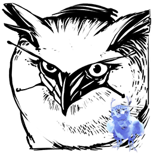 | Snow Owl Ghost | Event Creatures | Owl | `Ghost_Owl_Character_BP_C` | ../icon/creatures_256px/Snow_Owl_Ghost_Event_Creatures_Owl_Ghost_Owl_Character_BP_C_256px.png | "Blueprint'/Game/Extinction/Dinos/Owl/Ghost_Owl_Character_BP.Ghost_Owl_Character_BP'" |
| 40 |  | Velonasaur | Fantasy Creatures | Velonasaur | `Spindles_Character_BP_C` | ../icon/creatures_256px/Velonasaur_Fantasy_Creatures_Velonasaur_Spindles_Character_BP_C_256px.png | "Blueprint'/Game/Extinction/Dinos/Spindles/Spindles_Character_BP.Spindles_Character_BP'" |

---

## Creatures of Valguero (瓦尔盖罗)

> 共 4 个生物

| # | 图标 | 名称 | 分类 | Name Tag | Entity ID | Icon URL | Blueprint Path |
|---|------|------|------|----------|-----------|----------|----------------|
| 1 | 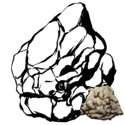 | Chalk Golem | Fantasy Creatures | RockElemental | `ChalkGolem_Character_BP_C` | ../icon/creatures_256px/Chalk_Golem_Fantasy_Creatures_RockElemental_ChalkGolem_Character_BP_C_256px.png | "Blueprint'/Game/Mods/Valguero/Assets/Dinos/RockGolem/ChalkGolem/ChalkGolem_Character_BP.ChalkGolem_ |
| 2 |  | Deinonychus | 恐龙 | Deinonychus | `Deinonychus_Character_BP_C` | ../icon/creatures_256px/Deinonychus_Dinosaurs_Deinonychus_Deinonychus_Character_BP_C_256px.png | "Blueprint'/Game/PrimalEarth/Dinos/Raptor/Uberraptor/Deinonychus_Character_BP.Deinonychus_Character_ |
| 3 | 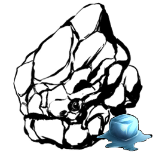 | Ice Golem | Fantasy Creatures | RockElemental | `IceGolem_Character_BP_C` | ../icon/creatures_256px/Ice_Golem_Fantasy_Creatures_RockElemental_IceGolem_Character_BP_C_256px.png | "Blueprint'/Game/PrimalEarth/Dinos/IceGolem/IceGolem_Character_BP.IceGolem_Character_BP'" |
| 4 |  | Megaraptor | 恐龙 | Megaraptor | `ValMegaraptor_Character_BP_C` | ../icon/creatures_256px/Megaraptor_Dinosaurs_Megaraptor_ValMegaraptor_Character_BP_C_256px.png | "Blueprint'/Game/ASA/Dinos/Megaraptor/ValMegaraptor_Character_BP.ValMegaraptor_Character_BP'" |

---

## Creatures of Genesis: Part 1 (创世纪1)

> 共 80 个生物

| # | 图标 | 名称 | 分类 | Name Tag | Entity ID | Icon URL | Blueprint Path |
|---|------|------|------|----------|-----------|----------|----------------|
| 1 |  | Alpha Corrupted Master Controller | Boss |  | `VRMainBoss_Character_Hard_C` | ../icon/creatures_256px/Alpha_Corrupted_Master_Controller_Bosses_unknown_VRMainBoss_Character_Hard_C_256px.png | "Blueprint'/Game/Genesis/Dinos/VRMainBoss/VRMainBoss_Character_Hard.VRMainBoss_Character_Hard'" |
| 2 |  | Alpha Moeder, Master of the Ocean | Boss | EelBoss | `EelBoss_Character_BP_Hard_C` | ../icon/creatures_256px/Alpha_Moeder,_Master_of_the_Ocean_Bosses_EelBoss_EelBoss_Character_BP_Hard_C_256px.png | "Blueprint'/Game/Genesis/Dinos/EelBoss/EelBoss_Character_BP_Hard.EelBoss_Character_BP_Hard'" |
| 3 |  | Alpha X-Triceratops | Alpha Creatures | Trike | `Volcano_Trike_Character_BP_Retrieve_Alpha_C` | ../icon/creatures_256px/Alpha_X-Triceratops_Alpha_Creatures_Trike_Volcano_Trike_Character_BP_Retrieve_Alpha_C_256px.png | "Blueprint'/Game/Genesis/Dinos/MissionVariants/Retrieve/Volcanic/Volcano_Trike_Character_BP_Retrieve |
| 4 |  | Astrocetus | Fantasy Creatures | Space Whale | `SpaceWhale_Character_BP_C` | ../icon/creatures_256px/Astrocetus_Fantasy_Creatures_Space_Whale_SpaceWhale_Character_BP_C_256px.png | "Blueprint'/Game/Genesis/Dinos/SpaceWhale/SpaceWhale_Character_BP.SpaceWhale_Character_BP'" |
| 5 |  | Beta Corrupted Master Controller | Boss |  | `VRMainBoss_Character_Medium_C` | ../icon/creatures_256px/Beta_Corrupted_Master_Controller_Bosses_unknown_VRMainBoss_Character_Medium_C_256px.png | "Blueprint'/Game/Genesis/Dinos/VRMainBoss/VRMainBoss_Character_Medium.VRMainBoss_Character_Medium'" |
| 6 |  | Beta Moeder, Master of the Ocean | Boss | EelBoss | `EelBoss_Character_BP_Medium_C` | ../icon/creatures_256px/Beta_Moeder,_Master_of_the_Ocean_Bosses_EelBoss_EelBoss_Character_BP_Medium_C_256px.png | "Blueprint'/Game/Genesis/Dinos/EelBoss/EelBoss_Character_BP_Medium.EelBoss_Character_BP_Medium'" |
| 7 |  | Bloodstalker | Fantasy Creatures | Bloodstalker | `BogSpider_Character_BP_C` | ../icon/creatures_256px/Bloodstalker_Fantasy_Creatures_Bloodstalker_BogSpider_Character_BP_C_256px.png | "Blueprint'/Game/Genesis/Dinos/BogSpider/BogSpider_Character_BP.BogSpider_Character_BP'" |
| 8 |  | Brute Araneo | Brute Creatures | Spider | `SpiderS_Character_BP_Hunt_C` | ../icon/creatures_256px/Brute_Araneo_Brute_Creatures_Spider_SpiderS_Character_BP_Hunt_C_256px.png | "Blueprint'/Game/Genesis/Dinos/MissionVariants/Hunt/Bog/SpiderS_Character_BP_Hunt.SpiderS_Character_ |
| 9 |  | Brute Astrocetus | Brute Creatures | Space Whale | `SpaceWhale_Character_BP_Brute_C` | ../icon/creatures_256px/Brute_Astrocetus_Brute_Creatures_Space_Whale_SpaceWhale_Character_BP_Brute_C_256px.png | "Blueprint'/Game/Genesis/Dinos/MissionVariants/Hunt/Lunar/SpaceWhale_Character_BP_Brute.SpaceWhale_C |
| 10 |  | Brute Basilosaurus | Brute Creatures | Basilosaurus | `Basilosaurus_Character_BP_Hunt_C` | ../icon/creatures_256px/Brute_Basilosaurus_Brute_Creatures_Basilosaurus_Basilosaurus_Character_BP_Hunt_C_256px.png | "Blueprint'/Game/Genesis/Dinos/MissionVariants/Hunt/Ocean/Basilosaurus_Character_BP_Hunt.Basilosauru |
| 11 |  | Brute Bloodstalker | Brute Creatures | Bloodstalker | `BogSpider_Character_BP_Hunt_C` | ../icon/creatures_256px/Brute_Bloodstalker_Brute_Creatures_Bloodstalker_BogSpider_Character_BP_Hunt_C_256px.png | "Blueprint'/Game/Genesis/Dinos/MissionVariants/Hunt/Bog/BogSpider_Character_BP_Hunt.BogSpider_Charac |
| 12 |  | Brute Ferox | Brute Creatures | Bigly | `Shapeshifter_Large_Character_BP_Hunt_C` | ../icon/creatures_256px/Brute_Ferox_Brute_Creatures_Bigly_Shapeshifter_Large_Character_BP_Hunt_C_256px.png | "Blueprint'/Game/Genesis/Dinos/MissionVariants/Hunt/Arctic/Shapeshifter_Large_Character_BP_Hunt.Shap |
| 13 |  | Brute Fire Wyvern | Brute Creatures | Wyvern | `Wyvern_Character_BP_Fire_GauntletBoss_C` | ../icon/creatures_256px/Brute_Fire_Wyvern_Brute_Creatures_Wyvern_Wyvern_Character_BP_Fire_GauntletBoss_C_256px.png | "Blueprint'/Game/Genesis/Dinos/MissionVariants/Gauntlet/Volcanic/Wyvern_Character_BP_Fire_GauntletBo |
| 14 |  | Brute Leedsichthys | Brute Creatures | Leedsichthys | `Leedsichthys_Character_BP_Hunt_C` | ../icon/creatures_256px/Brute_Leedsichthys_Brute_Creatures_Leedsichthys_Leedsichthys_Character_BP_Hunt_C_256px.png | "Blueprint'/Game/Genesis/Dinos/MissionVariants/Hunt/Ocean/Leedsichthys_Character_BP_Hunt.Leedsichthy |
| 15 |  | Brute Magmasaur | Brute Creatures | LavaLizard | `Cherufe_Character_BP_Hunt_C` | ../icon/creatures_256px/Brute_Magmasaur_Brute_Creatures_LavaLizard_Cherufe_Character_BP_Hunt_C_256px.png | "Blueprint'/Game/Genesis/Dinos/MissionVariants/Hunt/Volcanic/Cherufe_Character_BP_Hunt.Cherufe_Chara |
| 16 |  | Brute Malfunctioned Tek Giganotosaurus | Brute Creatures | Gigant | `BionicGigant_Character_BP_Malfunctioned_Hunt_C` | ../icon/creatures_256px/Brute_Malfunctioned_Tek_Giganotosaurus_Brute_Creatures_Gigant_BionicGigant_Character_BP_Malfunctioned_Hunt_C_256px.png | "Blueprint'/Game/Genesis/Dinos/MissionVariants/Hunt/Lunar/BionicGigant_Character_BP_Malfunctioned_Hu |
| 17 |  | Brute Malfunctioned Tek Rex | Brute Creatures | Rex | `BionicRex_Character_BP_Malfunctioned_Hunt_C` | ../icon/creatures_256px/Brute_Malfunctioned_Tek_Rex_Brute_Creatures_Rex_BionicRex_Character_BP_Malfunctioned_Hunt_C_256px.png | "Blueprint'/Game/Genesis/Dinos/MissionVariants/Hunt/Lunar/BionicRex_Character_BP_Malfunctioned_Hunt. |
| 18 |  | Brute Mammoth | Brute Creatures | Mammoth | `Mammoth_Character_BP_Hunt_C` | ../icon/creatures_256px/Brute_Mammoth_Brute_Creatures_Mammoth_Mammoth_Character_BP_Hunt_C_256px.png | "Blueprint'/Game/Genesis/Dinos/MissionVariants/Hunt/Arctic/Mammoth_Character_BP_Hunt.Mammoth_Charact |
| 19 |  | Brute Megaloceros | Brute Creatures | Stag | `Stag_Character_BP_Hunt_C` | ../icon/creatures_256px/Brute_Megaloceros_Brute_Creatures_Stag_Stag_Character_BP_Hunt_C_256px.png | "Blueprint'/Game/Genesis/Dinos/MissionVariants/Hunt/Arctic/Stag_Character_BP_Hunt.Stag_Character_BP_ |
| 20 |  | Brute Plesiosaur | Brute Creatures | Plesiosaur | `Plesiosaur_Character_BP_Hunt_C` | ../icon/creatures_256px/Brute_Plesiosaur_Brute_Creatures_Plesiosaur_Plesiosaur_Character_BP_Hunt_C_256px.png | "Blueprint'/Game/Genesis/Dinos/MissionVariants/Hunt/Ocean/Plesiosaur_Character_BP_Hunt.Plesiosaur_Ch |
| 21 |  | Brute Reaper King | Brute Creatures | Xenomorph | `Xenomorph_Character_BP_Male_InitialBuryOnly_Hunt_C` | ../icon/creatures_256px/Brute_Reaper_King_Brute_Creatures_Xenomorph_Xenomorph_Character_BP_Male_InitialBuryOnly_Hunt_C_256px.png | "Blueprint'/Game/Genesis/Dinos/MissionVariants/Hunt/Lunar/Xenomorph_Character_BP_Male_InitialBuryOnl |
| 22 |  | Brute Sarco | Brute Creatures | Sarco | `Sarco_Character_BP_Hunt_C` | ../icon/creatures_256px/Brute_Sarco_Brute_Creatures_Sarco_Sarco_Character_BP_Hunt_C_256px.png | "Blueprint'/Game/Genesis/Dinos/MissionVariants/Hunt/Bog/Sarco_Character_BP_Hunt.Sarco_Character_BP_H |
| 23 |  | Brute Seeker | Brute Creatures | Seeker | `Pteroteuthis_Char_BP_HuntFollower_C` | ../icon/creatures_256px/Brute_Seeker_Brute_Creatures_Seeker_Pteroteuthis_Char_BP_HuntFollower_C_256px.png | "Blueprint'/Game/Genesis/Dinos/MissionVariants/Hunt/Lunar/Pteroteuthis_Char_BP_HuntFollower.Pteroteu |
| 24 |  | Brute Tusoteuthis | Brute Creatures | Tusoteuthis | `Tusoteuthis_Character_BP_Hunt_C` | ../icon/creatures_256px/Brute_Tusoteuthis_Brute_Creatures_Tusoteuthis_Tusoteuthis_Character_BP_Hunt_C_256px.png | "Blueprint'/Game/Genesis/Dinos/MissionVariants/Hunt/Ocean/Tusoteuthis_Character_BP_Hunt.Tusoteuthis_ |
| 25 |  | Brute X-Allosaurus | Brute Creatures | Allo | `Volcano_Allo_Character_BP_Hunt_C` | ../icon/creatures_256px/Brute_X-Allosaurus_Brute_Creatures_Allo_Volcano_Allo_Character_BP_Hunt_C_256px.png | "Blueprint'/Game/Genesis/Dinos/MissionVariants/Hunt/Volcanic/Volcano_Allo_Character_BP_Hunt.Volcano_ |
| 26 |  | Brute X-Megalodon | Brute Creatures | Mega | `Ocean_Megalodon_Character_BP_Hunt_C` | ../icon/creatures_256px/Brute_X-Megalodon_Brute_Creatures_Mega_Ocean_Megalodon_Character_BP_Hunt_C_256px.png | "Blueprint'/Game/Genesis/Dinos/MissionVariants/Hunt/Ocean/Ocean_Megalodon_Character_BP_Hunt.Ocean_Me |
| 27 |  | Brute X-Mosasaurus | Brute Creatures | Mosasaur | `Ocean_Mosa_Character_BP_Hunt_C` | ../icon/creatures_256px/Brute_X-Mosasaurus_Brute_Creatures_Mosasaur_Ocean_Mosa_Character_BP_Hunt_C_256px.png | "Blueprint'/Game/Genesis/Dinos/MissionVariants/Hunt/Ocean/Ocean_Mosa_Character_BP_Hunt.Ocean_Mosa_Ch |
| 28 |  | Brute X-Raptor | Brute Creatures | Raptor | `Bog_Raptor_Character_BP_Hunt_C` | ../icon/creatures_256px/Brute_X-Raptor_Brute_Creatures_Raptor_Bog_Raptor_Character_BP_Hunt_C_256px.png | "Blueprint'/Game/Genesis/Dinos/MissionVariants/Hunt/Bog/Bog_Raptor_Character_BP_Hunt.Bog_Raptor_Char |
| 29 |  | Brute X-Rex | Brute Creatures | Rex | `Volcano_Rex_Character_BP_Hunt_C` | ../icon/creatures_256px/Brute_X-Rex_Brute_Creatures_Rex_Volcano_Rex_Character_BP_Hunt_C_256px.png | "Blueprint'/Game/Genesis/Dinos/MissionVariants/Hunt/Volcanic/Volcano_Rex_Character_BP_Hunt.Volcano_R |
| 30 |  | Brute X-Rock Elemental | Brute Creatures | RockElemental | `Volcano_Golem_Character_BP_Hunt_C` | ../icon/creatures_256px/Brute_X-Rock_Elemental_Brute_Creatures_RockElemental_Volcano_Golem_Character_BP_Hunt_C_256px.png | "Blueprint'/Game/Genesis/Dinos/MissionVariants/Hunt/Volcanic/Volcano_Golem_Character_BP_Hunt.Volcano |
| 31 |  | Brute X-Spino | Brute Creatures | Spino | `Bog_Spino_Character_BP_Hunt_C` | ../icon/creatures_256px/Brute_X-Spino_Brute_Creatures_Spino_Bog_Spino_Character_BP_Hunt_C_256px.png | "Blueprint'/Game/Genesis/Dinos/MissionVariants/Hunt/Bog/Bog_Spino_Character_BP_Hunt.Bog_Spino_Charac |
| 32 |  | Brute X-Yutyrannus | Brute Creatures | Yutyrannus | `Snow_Yutyrannus_Character_BP_Hunt_C` | ../icon/creatures_256px/Brute_X-Yutyrannus_Brute_Creatures_Yutyrannus_Snow_Yutyrannus_Character_BP_Hunt_C_256px.png | "Blueprint'/Game/Genesis/Dinos/MissionVariants/Hunt/Arctic/Snow_Yutyrannus_Character_BP_Hunt.Snow_Yu |
| 33 |  | Corrupted Avatar | 哺乳 | ? | `Bot_Character_BP_C` | ../icon/creatures_256px/Corrupted_Avatar_Mammals___Bot_Character_BP_C_256px.png | "Blueprint'/Game/Genesis/Dinos/Bots/Bot_Character_BP.Bot_Character_BP'" |
| 34 |  | Eel Minion | Fantasy Creatures |  | `EelMinion_Character_BP_Easy_C` | ../icon/creatures_256px/Eel_Minion_Fantasy_Creatures_unknown_EelMinion_Character_BP_Easy_C_256px.png | "Blueprint'/Game/Genesis/Dinos/EelBoss/EelMinion_Character_BP_Easy.EelMinion_Character_BP_Easy'" |
| 35 |  | Gamma Corrupted Master Controller | Boss |  | `VRMainBoss_Character_Easy_C` | ../icon/creatures_256px/Gamma_Corrupted_Master_Controller_Bosses_unknown_VRMainBoss_Character_Easy_C_256px.png | "Blueprint'/Game/Genesis/Dinos/VRMainBoss/VRMainBoss_Character_Easy.VRMainBoss_Character_Easy'" |
| 36 | Gamma Moeder, Master of the Ocean | Gamma Moeder, Master of the Ocean | Boss | EelBoss | `EelBoss_Character_BP_Easy_C` | N/A | "Blueprint'/Game/Genesis/Dinos/EelBoss/EelBoss_Character_BP_Easy.EelBoss_Character_BP_Easy'" |
| 37 |  | Golden Striped Brute Megalodon | Brute Creatures | Mega | `Ocean_Megalodon_Character_BP_Retrieve_Brute_C` | ../icon/creatures_256px/Golden_Striped_Brute_Megalodon_Brute_Creatures_Mega_Ocean_Megalodon_Character_BP_Retrieve_Brute_C_256px.png | "Blueprint'/Game/Genesis/Dinos/MissionVariants/Retrieve/Ocean/Ocean_Megalodon_Character_BP_Retrieve_ |
| 38 |  | Golden Striped Megalodon | X-Creatures | Mega | `Ocean_Megalodon_Character_BP_Retrieve_C` | ../icon/creatures_256px/Golden_Striped_Megalodon_X-Creatures_Mega_Ocean_Megalodon_Character_BP_Retrieve_C_256px.png | "Blueprint'/Game/Genesis/Dinos/MissionVariants/Retrieve/Ocean/Ocean_Megalodon_Character_BP_Retrieve. |
| 39 |  | Golden Striped Megalodon | X-Creatures | Mega | `Ocean_Megalodon_Character_BP_Retrieve_C` | ../icon/creatures_256px/Golden_Striped_Megalodon_X-Creatures_Mega_Ocean_Megalodon_Character_BP_Retrieve_C_256px.png | "Blueprint'/Game/Genesis/Dinos/MissionVariants/Retrieve/Ocean/Ocean_Megalodon_Character_BP_Retrieve. |
| 40 |  | Hover Skiff | Vehicles | Hover Skiff | `TekHoverSkiff_Character_BP_C` | ../icon/creatures_256px/Hover_Skiff_Vehicles_Hover_Skiff_TekHoverSkiff_Character_BP_C_256px.png | "Blueprint'/Game/Genesis/Dinos/TekHoverSkiff/TekHoverSkiff_Character_BP.TekHoverSkiff_Character_BP'" |
| 41 |  | Ferox (Large) | Fantasy Creatures | Bigly | `Shapeshifter_Large_Character_BP_C` | ../icon/creatures_256px/Ferox_(Large)_Fantasy_Creatures_Bigly_Shapeshifter_Large_Character_BP_C_256px.png | "Blueprint'/Game/Genesis/Dinos/Shapeshifter/Shapeshifter_Large/Shapeshifter_Large_Character_BP.Shape |
| 42 |  | Ferox | Fantasy Creatures | Gremlin | `Shapeshifter_Small_Character_BP_C` | ../icon/creatures_256px/Ferox_Fantasy_Creatures_Gremlin_Shapeshifter_Small_Character_BP_C_256px.png | "Blueprint'/Game/Genesis/Dinos/Shapeshifter/Shapeshifter_Small/Shapeshifter_Small_Character_BP.Shape |
| 43 |  | Injured Brute Reaper King | Brute Creatures | Xenomorph | `Xenomorph_Character_BP_Male_InitialBuryOnly_Brute_Retrieve_C` | ../icon/creatures_256px/Injured_Brute_Reaper_King_Brute_Creatures_Xenomorph_Xenomorph_Character_BP_Male_InitialBuryOnly_Brute_Retrieve_C_256px.png | "Blueprint'/Game/Genesis/Dinos/MissionVariants/Retrieve/Lunar/Xenomorph_Character_BP_Male_InitialBur |
| 44 |  | Insect Swarm | Fantasy Creatures | InsectSwarm | `InsectSwarmChar_BP_C` | ../icon/creatures_256px/Insect_Swarm_Fantasy_Creatures_InsectSwarm_InsectSwarmChar_BP_C_256px.png | "Blueprint'/Game/Genesis/Dinos/Swarms/InsectSwarmChar_BP.InsectSwarmChar_BP'" |
| 45 |  | Magmasaur | Fantasy Creatures | LavaLizard | `Cherufe_Character_BP_C` | ../icon/creatures_256px/Magmasaur_Fantasy_Creatures_LavaLizard_Cherufe_Character_BP_C_256px.png | "Blueprint'/Game/Genesis/Dinos/Cherufe/Cherufe_Character_BP.Cherufe_Character_BP'" |
| 46 |  | Malfunctioned Tek Giganotosaurus | Malfunctioned Tek Creatures | Gigant | `BionicGigant_Character_BP_Malfunctioned_Gauntlet_C` | ../icon/creatures_256px/Malfunctioned_Tek_Giganotosaurus_Malfunctioned_Tek_Creatures_Gigant_BionicGigant_Character_BP_Malfunctioned_Gauntlet_C_256px.png | "Blueprint'/Game/Genesis/Dinos/MissionVariants/Gauntlet/Lunar/BionicGigant_Character_BP_Malfunctione |
| 47 |  | Malfunctioned Tek Giganotosaurus | Malfunctioned Tek Creatures | Gigant | `BionicGigant_Character_BP_Malfunctioned_C` | ../icon/creatures_256px/Malfunctioned_Tek_Giganotosaurus_Malfunctioned_Tek_Creatures_Gigant_BionicGigant_Character_BP_Malfunctioned_C_256px.png | "Blueprint'/Game/PrimalEarth/Dinos/Giganotosaurus/BionicGigant_Character_BP_Malfunctioned.BionicGiga |
| 48 |  | Malfunctioned Tek Parasaur | Malfunctioned Tek Creatures | Para | `BionicPara_Character_BP_Malfunctioned_C` | ../icon/creatures_256px/Malfunctioned_Tek_Parasaur_Malfunctioned_Tek_Creatures_Para_BionicPara_Character_BP_Malfunctioned_C_256px.png | "Blueprint'/Game/PrimalEarth/Dinos/Para/BionicPara_Character_BP_Malfunctioned.BionicPara_Character_B |
| 49 |  | Malfunctioned Tek Quetzal | Malfunctioned Tek Creatures | Quetz | `BionicQuetz_Character_BP_Malfunctioned_C` | ../icon/creatures_256px/Malfunctioned_Tek_Quetzal_Malfunctioned_Tek_Creatures_Quetz_BionicQuetz_Character_BP_Malfunctioned_C_256px.png | "Blueprint'/Game/PrimalEarth/Dinos/Quetzalcoatlus/BionicQuetz_Character_BP_Malfunctioned.BionicQuetz |
| 50 |  | Malfunctioned Tek Raptor | Malfunctioned Tek Creatures | Raptor | `BionicRaptor_Character_BP_Malfunctioned_C` | ../icon/creatures_256px/Malfunctioned_Tek_Raptor_Malfunctioned_Tek_Creatures_Raptor_BionicRaptor_Character_BP_Malfunctioned_C_256px.png | "Blueprint'/Game/PrimalEarth/Dinos/Raptor/BionicRaptor_Character_BP_Malfunctioned.BionicRaptor_Chara |
| 51 |  | Malfunctioned Tek Rex | Malfunctioned Tek Creatures | Rex | `BionicRex_Character_BP_Malfunctioned_C` | ../icon/creatures_256px/Malfunctioned_Tek_Rex_Malfunctioned_Tek_Creatures_Rex_BionicRex_Character_BP_Malfunctioned_C_256px.png | "Blueprint'/Game/PrimalEarth/Dinos/Rex/BionicRex_Character_BP_Malfunctioned.BionicRex_Character_BP_M |
| 52 |  | Malfunctioned Tek Stegosaurus | Malfunctioned Tek Creatures | Stego | `BionicStego_Character_BP_Malfunctioned_C` | ../icon/creatures_256px/Malfunctioned_Tek_Stegosaurus_Malfunctioned_Tek_Creatures_Stego_BionicStego_Character_BP_Malfunctioned_C_256px.png | "Blueprint'/Game/PrimalEarth/Dinos/Stego/BionicStego_Character_BP_Malfunctioned.BionicStego_Characte |
| 53 |  | Malfunctioned Tek Triceratops | Malfunctioned Tek Creatures | Trike | `BionicTrike_Character_BP_Malfunctioned_C` | ../icon/creatures_256px/Malfunctioned_Tek_Triceratops_Malfunctioned_Tek_Creatures_Trike_BionicTrike_Character_BP_Malfunctioned_C_256px.png | "Blueprint'/Game/PrimalEarth/Dinos/Trike/BionicTrike_Character_BP_Malfunctioned.BionicTrike_Characte |
| 54 |  | Megachelon | Fantasy Creatures | GiantTurtle | `GiantTurtle_Character_BP_C` | ../icon/creatures_256px/Megachelon_Fantasy_Creatures_GiantTurtle_GiantTurtle_Character_BP_C_256px.png | "Blueprint'/Game/Genesis/Dinos/GiantTurtle/GiantTurtle_Character_BP.GiantTurtle_Character_BP'" |
| 55 |  | Parakeet Fish School | Fantasy Creatures | Swarm | `MicrobeSwarmChar_BP_C` | ../icon/creatures_256px/Parakeet_Fish_School_Fantasy_Creatures_Swarm_MicrobeSwarmChar_BP_C_256px.png | "Blueprint'/Game/Genesis/Dinos/Swarms/MicrobeSwarmChar_BP.MicrobeSwarmChar_BP'" |
| 56 | 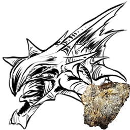 | Reaper Prince | Fantasy Creatures | Xenomorph | `Xenomorph_Character_BP_Male_InitialBuryOnly_Adolescent_C` | ../icon/creatures_256px/Reaper_Prince_Fantasy_Creatures_Xenomorph_Xenomorph_Character_BP_Male_InitialBuryOnly_Adolescent_C_256px.png | "Blueprint'/Game/Aberration/Dinos/Nameless/Xenomorph_Character_BP_Male_InitialBuryOnly_Adolescent.Xe |
| 57 | 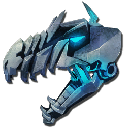 | Tek Giganotosaurus | Tek Creatures | Gigant | `BionicGigant_Character_BP_C` | ../icon/creatures_256px/Tek_Giganotosaurus_Tek_Creatures_Gigant_BionicGigant_Character_BP_C_256px.png | "Blueprint'/Game/PrimalEarth/Dinos/Giganotosaurus/BionicGigant_Character_BP.BionicGigant_Character_B |
| 58 |  | Tek Triceratops | Tek Creatures | Trike | `BionicTrike_Character_BP_C` | ../icon/creatures_256px/Tek_Triceratops_Tek_Creatures_Trike_BionicTrike_Character_BP_C_256px.png | "Blueprint'/Game/PrimalEarth/Dinos/Trike/BionicTrike_Character_BP.BionicTrike_Character_BP'" |
| 59 |  | X-Allosaurus | X-Creatures | Allo | `Volcano_Allo_Character_BP_C` | ../icon/creatures_256px/X-Allosaurus_X-Creatures_Allo_Volcano_Allo_Character_BP_C_256px.png | "Blueprint'/Game/Genesis/Dinos/BiomeVariants/Volcano_Allosaurus/Volcano_Allo_Character_BP.Volcano_Al |
| 60 |  | X-Ankylosaurus | X-Creatures | Anky | `Volcano_Ankylo_Character_BP_C` | ../icon/creatures_256px/X-Ankylosaurus_X-Creatures_Anky_Volcano_Ankylo_Character_BP_C_256px.png | "Blueprint'/Game/Genesis/Dinos/BiomeVariants/Volcano_Ankylosaurus/Volcano_Ankylo_Character_BP.Volcan |
| 61 |  | X-Argentavis | X-Creatures | Argent | `Snow_Argent_Character_BP_C` | ../icon/creatures_256px/X-Argentavis_X-Creatures_Argent_Snow_Argent_Character_BP_C_256px.png | "Blueprint'/Game/Genesis/Dinos/BiomeVariants/Snow_Argentavis/Snow_Argent_Character_BP.Snow_Argent_Ch |
| 62 |  | X-Basilosaurus | X-Creatures | Basilosaurus | `Ocean_Basilosaurus_Character_BP_C` | ../icon/creatures_256px/X-Basilosaurus_X-Creatures_Basilosaurus_Ocean_Basilosaurus_Character_BP_C_256px.png | "Blueprint'/Game/Genesis/Dinos/BiomeVariants/Ocean_Basilosaurus/Ocean_Basilosaurus_Character_BP.Ocea |
| 63 |  | X-Dunkleosteus | X-Creatures | Dunkle | `Ocean_Dunkle_Character_BP_C` | ../icon/creatures_256px/X-Dunkleosteus_X-Creatures_Dunkle_Ocean_Dunkle_Character_BP_C_256px.png | "Blueprint'/Game/Genesis/Dinos/BiomeVariants/Ocean_Dunkleosteus/Ocean_Dunkle_Character_BP.Ocean_Dunk |
| 64 |  | X-Ichthyosaurus | X-Creatures | Dolphin | `Ocean_Dolphin_Character_BP_C` | ../icon/creatures_256px/X-Ichthyosaurus_X-Creatures_Dolphin_Ocean_Dolphin_Character_BP_C_256px.png | "Blueprint'/Game/Genesis/Dinos/BiomeVariants/Ocean_Dolphin/Ocean_Dolphin_Character_BP.Ocean_Dolphin_ |
| 65 |  | X-Megalodon | X-Creatures | Mega | `Ocean_Megalodon_Character_BP_C` | ../icon/creatures_256px/X-Megalodon_X-Creatures_Mega_Ocean_Megalodon_Character_BP_C_256px.png | "Blueprint'/Game/Genesis/Dinos/BiomeVariants/Ocean_Megalodon/Ocean_Megalodon_Character_BP.Ocean_Mega |
| 66 |  | X-Mosasaurus | X-Creatures | Mosasaur | `Ocean_Mosa_Character_BP_C` | ../icon/creatures_256px/X-Mosasaurus_X-Creatures_Mosasaur_Ocean_Mosa_Character_BP_C_256px.png | "Blueprint'/Game/Genesis/Dinos/BiomeVariants/Ocean_Mosasaurus/Ocean_Mosa_Character_BP.Ocean_Mosa_Cha |
| 67 |  | X-Otter | X-Creatures | Otter | `Snow_Otter_Character_BP_C` | ../icon/creatures_256px/X-Otter_X-Creatures_Otter_Snow_Otter_Character_BP_C_256px.png | "Blueprint'/Game/Genesis/Dinos/BiomeVariants/Snow_Otter/Snow_Otter_Character_BP.Snow_Otter_Character |
| 68 |  | X-Paraceratherium | X-Creatures | Paracer | `Bog_Paracer_Character_BP_C` | ../icon/creatures_256px/X-Paraceratherium_X-Creatures_Paracer_Bog_Paracer_Character_BP_C_256px.png | "Blueprint'/Game/Genesis/Dinos/BiomeVariants/BogParaceratherium/Bog_Paracer_Character_BP.Bog_Paracer |
| 69 |  | X-Parasaur | X-Creatures | Para | `Bog_Para_Character_BP_C` | ../icon/creatures_256px/X-Parasaur_X-Creatures_Para_Bog_Para_Character_BP_C_256px.png | "Blueprint'/Game/Genesis/Dinos/BiomeVariants/BogPara/Bog_Para_Character_BP.Bog_Para_Character_BP'" |
| 70 |  | X-Raptor | X-Creatures | Raptor | `Bog_Raptor_Character_BP_C` | ../icon/creatures_256px/X-Raptor_X-Creatures_Raptor_Bog_Raptor_Character_BP_C_256px.png | "Blueprint'/Game/Genesis/Dinos/BiomeVariants/Bog_Raptor/Bog_Raptor_Character_BP.Bog_Raptor_Character |
| 71 |  | X-Rex | X-Creatures | Rex | `Volcano_Rex_Character_BP_C` | ../icon/creatures_256px/X-Rex_X-Creatures_Rex_Volcano_Rex_Character_BP_C_256px.png | "Blueprint'/Game/Genesis/Dinos/BiomeVariants/Volcano_Rex/Volcano_Rex_Character_BP.Volcano_Rex_Charac |
| 72 |  | X-Rock Elemental | X-Creatures | RockElemental | `Volcano_Golem_Character_BP_C` | ../icon/creatures_256px/X-Rock_Elemental_X-Creatures_RockElemental_Volcano_Golem_Character_BP_C_256px.png | "Blueprint'/Game/Genesis/Dinos/BiomeVariants/Lava_Golem/Volcano_Golem_Character_BP.Volcano_Golem_Cha |
| 73 |  | X-Sabertooth | X-Creatures | Sabertooth | `Snow_Saber_Character_BP_C` | ../icon/creatures_256px/X-Sabertooth_X-Creatures_Sabertooth_Snow_Saber_Character_BP_C_256px.png | "Blueprint'/Game/Genesis/Dinos/BiomeVariants/Snow_Saber/Snow_Saber_Character_BP.Snow_Saber_Character |
| 74 |  | Rare X-Sabertooth Salmon | X-Creatures | RareSalmon | `Rare_Lunar_Salmon_Character_BP_C` | ../icon/creatures_256px/Rare_X-Sabertooth_Salmon_X-Creatures_RareSalmon_Rare_Lunar_Salmon_Character_BP_C_256px.png | "Blueprint'/Game/Genesis/Dinos/BiomeVariants/Lunar_Salmon/Rare_Lunar_Salmon_Character_BP.Rare_Lunar_ |
| 75 |  | X-Sabertooth Salmon | X-Creatures | Salmon | `Lunar_Salmon_Character_BP_C` | ../icon/creatures_256px/Rare_X-Sabertooth_Salmon_X-Creatures_RareSalmon_Rare_Lunar_Salmon_Character_BP_C_256px.png | "Blueprint'/Game/Genesis/Dinos/BiomeVariants/Lunar_Salmon/Lunar_Salmon_Character_BP.Lunar_Salmon_Cha |
| 76 |  | X-Spino | X-Creatures | Spino | `Bog_Spino_Character_BP_C` | ../icon/creatures_256px/X-Spino_X-Creatures_Spino_Bog_Spino_Character_BP_C_256px.png | "Blueprint'/Game/Genesis/Dinos/BiomeVariants/Bog_Spino/Bog_Spino_Character_BP.Bog_Spino_Character_BP |
| 77 |  | X-Tapejara | X-Creatures | Tapejara | `Bog_Tapejara_Character_BP_C` | ../icon/creatures_256px/X-Tapejara_X-Creatures_Tapejara_Bog_Tapejara_Character_BP_C_256px.png | "Blueprint'/Game/Genesis/Dinos/BiomeVariants/Bog_Tapejara/Bog_Tapejara_Character_BP.Bog_Tapejara_Cha |
| 78 |  | X-Triceratops | X-Creatures | Trike | `Volcano_Trike_Character_BP_C` | ../icon/creatures_256px/X-Triceratops_X-Creatures_Trike_Volcano_Trike_Character_BP_C_256px.png | "Blueprint'/Game/Genesis/Dinos/BiomeVariants/Volcano_Trike/Volcano_Trike_Character_BP.Volcano_Trike_ |
| 79 |  | X-Woolly Rhino | X-Creatures | Rhino | `Snow_Rhino_Character_BP_C` | ../icon/creatures_256px/X-Woolly_Rhino_X-Creatures_Rhino_Snow_Rhino_Character_BP_C_256px.png | "Blueprint'/Game/Genesis/Dinos/BiomeVariants/Snow_WoollyRhino/Snow_Rhino_Character_BP.Snow_Rhino_Cha |
| 80 |  | X-Yutyrannus | X-Creatures | Yutyrannus | `Snow_Yutyrannus_Character_BP_C` | ../icon/creatures_256px/X-Yutyrannus_X-Creatures_Yutyrannus_Snow_Yutyrannus_Character_BP_C_256px.png | "Blueprint'/Game/Genesis/Dinos/BiomeVariants/Snow_Yutyrannus/Snow_Yutyrannus_Character_BP.Snow_Yutyr |

---

## Creatures of Crystal Isles (水晶岛)

> 共 9 个生物

| # | 图标 | 名称 | 分类 | Name Tag | Entity ID | Icon URL | Blueprint Path |
|---|------|------|------|----------|-----------|----------|----------------|
| 1 | 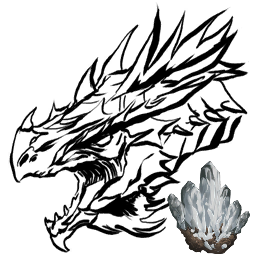 | Alpha Blood Crystal Wyvern | Alpha Creatures | Wyvern | `CrystalWyvern_Character_BP_Mega_C` | ../icon/creatures_256px/Alpha_Blood_Crystal_Wyvern_Alpha_Creatures_Wyvern_CrystalWyvern_Character_BP_Mega_C_256px.png | "Blueprint'/Game/PrimalEarth/Dinos/CrystalWyvern/CrystalWyvern_Character_BP_Mega.CrystalWyvern_Chara |
| 2 |  | Blood Crystal Wyvern | Fantasy Creatures | Wyvern | `CrystalWyvern_Character_BP_Blood_C` | ../icon/creatures_256px/Blood_Crystal_Wyvern_Fantasy_Creatures_Wyvern_CrystalWyvern_Character_BP_Blood_C_256px.png | "Blueprint'/Game/PrimalEarth/Dinos/CrystalWyvern/CrystalWyvern_Character_BP_Blood.CrystalWyvern_Char |
| 3 |  | Crystal Wyvern Queen (Gamma) | Boss | Wyvern | `CrystalWyvern_Character_BP_Boss_Easy_C` | ../icon/creatures_256px/Crystal_Wyvern_Queen_(Gamma)_Bosses_Wyvern_CrystalWyvern_Character_BP_Boss_Easy_C_256px.png | "Blueprint'/Game/Mods/CrystalIsles/Assets/Dinos/CIBoss/CrystalWyvern_Character_BP_Boss_Easy.CrystalW |
| 4 | 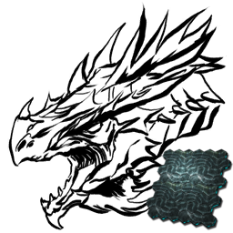 | Crystal Wyvern Queen (Beta) | Boss | Wyvern | `CrystalWyvern_Character_BP_Boss_Medium_C` | ../icon/creatures_256px/Crystal_Wyvern_Queen_(Beta)_Bosses_Wyvern_CrystalWyvern_Character_BP_Boss_Medium_C_256px.png | "Blueprint'/Game/Mods/CrystalIsles/Assets/Dinos/CIBoss/CrystalWyvern_Character_BP_Boss_Medium.Crysta |
| 5 |  | Crystal Wyvern Queen (Alpha) | Boss | Wyvern | `CrystalWyvern_Character_BP_Boss_Hard_C` | ../icon/creatures_256px/Crystal_Wyvern_Queen_(Alpha)_Bosses_Wyvern_CrystalWyvern_Character_BP_Boss_Hard_C_256px.png | "Blueprint'/Game/Mods/CrystalIsles/Assets/Dinos/CIBoss/CrystalWyvern_Character_BP_Boss_Hard.CrystalW |
| 6 |  | Ember Crystal Wyvern | Fantasy Creatures | Wyvern | `CrystalWyvern_Character_BP_Ember_C` | ../icon/creatures_256px/Ember_Crystal_Wyvern_Fantasy_Creatures_Wyvern_CrystalWyvern_Character_BP_Ember_C_256px.png | "Blueprint'/Game/PrimalEarth/Dinos/CrystalWyvern/CrystalWyvern_Character_BP_Ember.CrystalWyvern_Char |
| 7 | 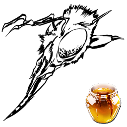 | Giant Worker Bee | 无脊椎 | Bee | `HoneyBee_Character_BP_C` | ../icon/creatures_256px/Giant_Worker_Bee_Invertebrates_Bee_HoneyBee_Character_BP_C_256px.png | "Blueprint'/Game/Mods/CrystalIsles/Assets/Dinos/HoneyBee/HoneyBee_Character_BP.HoneyBee_Character_BP |
| 8 |  | Tropeognathus | 爬行 | Tropeognathus | `Tropeognathus_Character_BP_C` | ../icon/creatures_256px/Tropeognathus_Reptiles_Tropeognathus_Tropeognathus_Character_BP_C_256px.png | "Blueprint'/Game/PrimalEarth/Dinos/Tropeognathus/Tropeognathus_Character_BP.Tropeognathus_Character_ |
| 9 |  | Tropical Crystal Wyvern | Fantasy Creatures | Wyvern | `CrystalWyvern_Character_BP_WS_C` | ../icon/creatures_256px/Tropical_Crystal_Wyvern_Fantasy_Creatures_Wyvern_CrystalWyvern_Character_BP_WS_C_256px.png | "Blueprint'/Game/PrimalEarth/Dinos/CrystalWyvern/CrystalWyvern_Character_BP_WS.CrystalWyvern_Charact |

---

## Creatures of Genesis: Part 2 (创世纪2)

> 共 38 个生物

| # | 图标 | 名称 | 分类 | Name Tag | Entity ID | Icon URL | Blueprint Path |
|---|------|------|------|----------|-----------|----------|----------------|
| 1 |  | Astrodelphis | Fantasy Creatures | Astrodelphis | `SpaceDolphin_Character_BP_C` | ../icon/creatures_256px/Astrodelphis_Fantasy_Creatures_Astrodelphis_SpaceDolphin_Character_BP_C_256px.png | "Blueprint'/Game/Genesis2/Dinos/SpaceDolphin/SpaceDolphin_Character_BP.SpaceDolphin_Character_BP'" |
| 2 |  | Maewing | Fantasy Creatures | Maewing | `MilkGlider_Character_BP_C` | ../icon/creatures_256px/Maewing_Fantasy_Creatures_Maewing_MilkGlider_Character_BP_C_256px.png | "Blueprint'/Game/Genesis2/Dinos/MilkGlider/MilkGlider_Character_BP.MilkGlider_Character_BP'" |
| 3 |  | Noglin | Fantasy Creatures | BrainSlug | `BrainSlug_Character_BP_C` | ../icon/creatures_256px/Noglin_Fantasy_Creatures_BrainSlug_BrainSlug_Character_BP_C_256px.png | "Blueprint'/Game/Genesis2/Dinos/BrainSlug/BrainSlug_Character_BP.BrainSlug_Character_BP'" |
| 4 |  | Shadowmane | Fantasy Creatures | Lionfish Lion | `LionfishLion_Character_BP_C` | ../icon/creatures_256px/Shadowmane_Fantasy_Creatures_Lionfish_Lion_LionfishLion_Character_BP_C_256px.png | "Blueprint'/Game/Genesis2/Dinos/LionfishLion/LionfishLion_Character_BP.LionfishLion_Character_BP'" |
| 5 |  | Tek Stryder | Mechanical Creatures | TekStrider | `TekStrider_Character_BP_C` | ../icon/creatures_256px/Tek_Stryder_Mechanical_Creatures_TekStrider_TekStrider_Character_BP_C_256px.png | "Blueprint'/Game/Genesis2/Dinos/TekStrider/TekStrider_Character_BP.TekStrider_Character_BP'" |
| 6 | 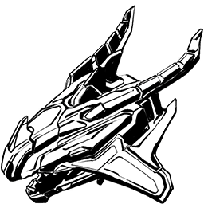 | Voidwyrm | Mechanical Creatures | TekWyvern | `TekWyvern_Character_BP_C` | ../icon/creatures_256px/Voidwyrm_Mechanical_Creatures_TekWyvern_TekWyvern_Character_BP_C_256px.png | "Blueprint'/Game/Genesis2/Dinos/TekWyvern/TekWyvern_Character_BP.TekWyvern_Character_BP'" |
| 7 |  | R-Allosaurus | R-Creatures | Allo | `Allo_Character_BP_Rockwell_C` | ../icon/creatures_256px/R-Allosaurus_R-Creatures_Allo_Allo_Character_BP_Rockwell_C_256px.png | "Blueprint'/Game/Genesis2/Dinos/BiomeVariants/Allo_Character_BP_Rockwell.Allo_Character_BP_Rockwell' |
| 8 |  | R-Carnotaurus | R-Creatures | Carno | `Carno_Character_BP_Rockwell_C` | ../icon/creatures_256px/R-Carnotaurus_R-Creatures_Carno_Carno_Character_BP_Rockwell_C_256px.png | "Blueprint'/Game/Genesis2/Dinos/BiomeVariants/Carno_Character_BP_Rockwell.Carno_Character_BP_Rockwel |
| 9 |  | R-Daeodon | R-Creatures | Daeodon | `Daeodon_Character_BP_Eden_C` | ../icon/creatures_256px/R-Daeodon_R-Creatures_Daeodon_Daeodon_Character_BP_Eden_C_256px.png | "Blueprint'/Game/Genesis2/Dinos/BiomeVariants/Daeodon_Character_BP_Eden.Daeodon_Character_BP_Eden'" |
| 10 |  | R-Dilophosaur | R-Creatures | Dilo | `Dilo_Character_BP_Rockwell_C` | ../icon/creatures_256px/R-Dilophosaur_R-Creatures_Dilo_Dilo_Character_BP_Rockwell_C_256px.png | "Blueprint'/Game/Genesis2/Dinos/BiomeVariants/Dilo_Character_BP_Rockwell.Dilo_Character_BP_Rockwell' |
| 11 |  | R-Dire Bear | R-Creatures | Direbear | `Direbear_Character_BP_Rockwell_C` | ../icon/creatures_256px/R-Dire_Bear_R-Creatures_Direbear_Direbear_Character_BP_Rockwell_C_256px.png | "Blueprint'/Game/Genesis2/Dinos/BiomeVariants/Direbear_Character_BP_Rockwell.Direbear_Character_BP_R |
| 12 |  | R-Direwolf | R-Creatures | Direwolf | `Direwolf_Character_BP_Eden_C` | ../icon/creatures_256px/R-Direwolf_R-Creatures_Direwolf_Direwolf_Character_BP_Eden_C_256px.png | "Blueprint'/Game/Genesis2/Dinos/BiomeVariants/Direwolf_Character_BP_Eden.Direwolf_Character_BP_Eden' |
| 13 |  | R-Equus | R-Creatures | Equus | `Equus_Character_BP_Eden_C` | ../icon/creatures_256px/R-Equus_R-Creatures_Equus_Equus_Character_BP_Eden_C_256px.png | "Blueprint'/Game/Genesis2/Dinos/BiomeVariants/Equus_Character_BP_Eden.Equus_Character_BP_Eden'" |
| 14 |  | R-Gasbags | R-Creatures | GasBags | `GasBags_Character_BP_Eden_C` | ../icon/creatures_256px/R-Gasbags_R-Creatures_GasBags_GasBags_Character_BP_Eden_C_256px.png | "Blueprint'/Game/Genesis2/Dinos/BiomeVariants/GasBags_Character_BP_Eden.GasBags_Character_BP_Eden'" |
| 15 |  | R-Giganotosaurus | R-Creatures | Gigant | `Gigant_Character_BP_Rockwell_C` | ../icon/creatures_256px/R-Giganotosaurus_R-Creatures_Gigant_Gigant_Character_BP_Rockwell_C_256px.png | "Blueprint'/Game/Genesis2/Dinos/BiomeVariants/Gigant_Character_BP_Rockwell.Gigant_Character_BP_Rockw |
| 16 |  | R-Megatherium | R-Creatures | Megatherium | `Megatherium_Character_BP_Eden_C` | ../icon/creatures_256px/R-Megatherium_R-Creatures_Megatherium_Megatherium_Character_BP_Eden_C_256px.png | "Blueprint'/Game/Genesis2/Dinos/BiomeVariants/Megatherium_Character_BP_Eden.Megatherium_Character_BP |
| 17 |  | R-Snow Owl | R-Creatures | Owl | `Owl_Character_BP_Eden_C` | ../icon/creatures_256px/R-Snow_Owl_R-Creatures_Owl_Owl_Character_BP_Eden_C_256px.png | "Blueprint'/Game/Genesis2/Dinos/BiomeVariants/Owl_Character_BP_Eden.Owl_Character_BP_Eden'" |
| 18 |  | R-Parasaur | R-Creatures | Para | `Para_Character_BP_Eden_C` | ../icon/creatures_256px/R-Parasaur_R-Creatures_Para_Para_Character_BP_Eden_C_256px.png | "Blueprint'/Game/Genesis2/Dinos/BiomeVariants/Para_Character_BP_Eden.Para_Character_BP_Eden'" |
| 19 |  | R-Procoptodon | R-Creatures | Kangaroo | `Procoptodon_Character_BP_Eden_C` | ../icon/creatures_256px/R-Procoptodon_R-Creatures_Kangaroo_Procoptodon_Character_BP_Eden_C_256px.png | "Blueprint'/Game/Genesis2/Dinos/BiomeVariants/Procoptodon_Character_BP_Eden.Procoptodon_Character_BP |
| 20 |  | R-Quetzal | R-Creatures | Quetz | `Quetz_Character_BP_Rockwell_C` | ../icon/creatures_256px/R-Quetzal_R-Creatures_Quetz_Quetz_Character_BP_Rockwell_C_256px.png | "Blueprint'/Game/Genesis2/Dinos/BiomeVariants/Quetz_Character_BP_Rockwell.Quetz_Character_BP_Rockwel |
| 21 |  | R-Brontosaurus | R-Creatures | Bronto | `Sauropod_Character_BP_Rockwell_C` | ../icon/creatures_256px/R-Brontosaurus_R-Creatures_Bronto_Sauropod_Character_BP_Rockwell_C_256px.png | "Blueprint'/Game/Genesis2/Dinos/BiomeVariants/Sauropod_Character_BP_Rockwell.Sauropod_Character_BP_R |
| 22 |  | R-Velonasaur | R-Creatures | Velonasaur | `Spindles_Character_BP_Rockwell_C` | ../icon/creatures_256px/R-Velonasaur_R-Creatures_Velonasaur_Spindles_Character_BP_Rockwell_C_256px.png | "Blueprint'/Game/Genesis2/Dinos/BiomeVariants/Spindles_Character_BP_Rockwell.Spindles_Character_BP_R |
| 23 |  | R-Thylacoleo | R-Creatures | Thylacoleo | `Thylacoleo_Character_BP_Eden_C` | ../icon/creatures_256px/R-Thylacoleo_R-Creatures_Thylacoleo_Thylacoleo_Character_BP_Eden_C_256px.png | "Blueprint'/Game/Genesis2/Dinos/BiomeVariants/Thylacoleo_Character_BP_Eden.Thylacoleo_Character_BP_E |
| 24 |  | R-Carbonemys | R-Creatures | Turtle | `Turtle_Character_BP_Rockwell_C` | ../icon/creatures_256px/R-Carbonemys_R-Creatures_Turtle_Turtle_Character_BP_Rockwell_C_256px.png | "Blueprint'/Game/Genesis2/Dinos/BiomeVariants/Turtle_Character_BP_Rockwell.Turtle_Character_BP_Rockw |
| 25 | 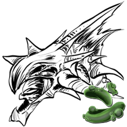 | R-Reaper Queen | R-Creatures | Xenomorph | `Xenomorph_Character_BP_Female_Gen2_C` | ../icon/creatures_256px/R-Reaper_Queen_R-Creatures_Xenomorph_Xenomorph_Character_BP_Female_Gen2_C_256px.png | "Blueprint'/Game/Genesis2/Dinos/BiomeVariants/Xenomorph_Character_BP_Female_Gen2.Xenomorph_Character |
| 26 |  | R-Reaper King | R-Creatures | Xenomorph | `Xenomorph_Character_BP_Male_Gen2_C` | ../icon/creatures_256px/R-Reaper_King_R-Creatures_Xenomorph_Xenomorph_Character_BP_Male_Gen2_C_256px.png | "Blueprint'/Game/Genesis2/Dinos/BiomeVariants/Xenomorph_Character_BP_Male_Gen2.Xenomorph_Character_B |
| 27 | 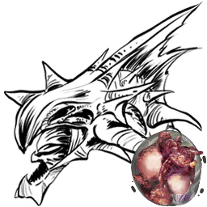 | R-Reaper King (Tamed) | R-Creatures | Xenomorph | `Xenomorph_Character_BP_Male_Tamed_Gen2_C` | ../icon/creatures_256px/R-Reaper_King_(Tamed | "Blueprint'/Game/Genesis2/Dinos/BiomeVariants/Xenomorph_Character_BP_Male_Tamed_Gen2.Xenomorph_Chara |
| 28 |  | Summoner | Fantasy Creatures | Summoner | `Summoner_Character_BP_C` | ../icon/creatures_256px/Summoner_Fantasy_Creatures_Summoner_Summoner_Character_BP_C_256px.png | "Blueprint'/Game/Genesis2/Dinos/Summoner/Summoner_Character_BP.Summoner_Character_BP'" |
| 29 |  | Macrophage | Fantasy Creatures | Macrophage | `Macrophage_Swarm_Character_C` | ../icon/creatures_256px/Macrophage_Fantasy_Creatures_Macrophage_Macrophage_Swarm_Character_C_256px.png | "Blueprint'/Game/Genesis2/Dinos/Macrophage/Macrophage_Swarm_Character.Macrophage_Swarm_Character'" |
| 30 |  | Exo-Mek | Vehicles | Exosuit | `Exosuit_Character_BP_C` | ../icon/creatures_256px/Exo-Mek_Vehicles_Exosuit_Exosuit_Character_BP_C_256px.png | "Blueprint'/Game/Genesis2/Dinos/Exosuit/Exosuit_Character_BP.Exosuit_Character_BP'" |
| 31 |  | Rockwell Prime | Boss | RockwellPrime | `RockwellNode_Character_BP_Boss_C` | ../icon/creatures_256px/Rockwell_Prime_Bosses_RockwellPrime_RockwellNode_Character_BP_Boss_C_256px.png | "Blueprint'/Game/Genesis2/Missions/ModularMission/FinalBattleAlt/Dinos/RockwellNode_Character_BP_Bos |
| 32 |  | Rockwell Prime (Alpha) | Boss | RockwellPrime | `RockwellNode_Character_BP_Boss_Alpha_C` | ../icon/creatures_256px/Rockwell_Prime_(Alpha)_Bosses_RockwellPrime_RockwellNode_Character_BP_Boss_Alpha_C_256px.png | "Blueprint'/Game/Genesis2/Missions/ModularMission/FinalBattleAlt/Difficulties/Alpha/RockwellNode_Cha |
| 33 |  | Rockwell Prime (Beta) | Boss | RockwellPrime | `RockwellNode_Character_BP_Boss_Beta_C` | ../icon/creatures_256px/Rockwell_Prime_(Beta)_Bosses_RockwellPrime_RockwellNode_Character_BP_Boss_Beta_C_256px.png | "Blueprint'/Game/Genesis2/Missions/ModularMission/FinalBattleAlt/Difficulties/Beta/RockwellNode_Char |
| 34 |  | Rockwell Prime (Gamma) | Boss | RockwellPrime | `RockwellNode_Character_BP_Boss_Gamma_C` | ../icon/creatures_256px/Rockwell_Prime_(Gamma)_Bosses_RockwellPrime_RockwellNode_Character_BP_Boss_Gamma_C_256px.png | "Blueprint'/Game/Genesis2/Missions/ModularMission/FinalBattleAlt/Difficulties/Gamma/RockwellNode_Cha |
| 35 |  | Rockwell Node | Boss | RockwellPrime | `RockwellNode_Character_BP_FinalFight_C` | ../icon/creatures_256px/Rockwell_Node_Bosses_RockwellPrime_RockwellNode_Character_BP_FinalFight_C_256px.png | "Blueprint'/Game/Genesis2/Missions/ModularMission/FinalBattleAlt/Dinos/RockwellNode_Character_BP_Fin |
| 36 |  | Rockwell Node (Alpha) | Boss | RockwellPrime | `RockwellNode_Character_BP_FinalFight_Alpha_C` | ../icon/creatures_256px/Rockwell_Node_(Alpha)_Bosses_RockwellPrime_RockwellNode_Character_BP_FinalFight_Alpha_C_256px.png | "Blueprint'/Game/Genesis2/Missions/ModularMission/FinalBattleAlt/Difficulties/Alpha/RockwellNode_Cha |
| 37 | 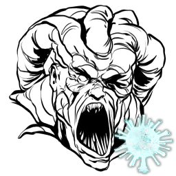 | Rockwell Node (Beta) | Boss | RockwellPrime | `RockwellNode_Character_BP_FinalFight_Beta_C` | ../icon/creatures_256px/Rockwell_Node_(Beta)_Bosses_RockwellPrime_RockwellNode_Character_BP_FinalFight_Beta_C_256px.png | "Blueprint'/Game/Genesis2/Missions/ModularMission/FinalBattleAlt/Difficulties/Beta/RockwellNode_Char |
| 38 |  | Rockwell Node (Gamma) | Boss | RockwellPrime | `RockwellNode_Character_BP_FinalFight_Gamma_C` | ../icon/creatures_256px/Rockwell_Node_(Gamma)_Bosses_RockwellPrime_RockwellNode_Character_BP_FinalFight_Gamma_C_256px.png | "Blueprint'/Game/Genesis2/Missions/ModularMission/FinalBattleAlt/Difficulties/Gamma/RockwellNode_Cha |

---

## Creatures of Lost Island (失落岛)

> 共 6 个生物

| # | 图标 | 名称 | 分类 | Name Tag | Entity ID | Icon URL | Blueprint Path |
|---|------|------|------|----------|-----------|----------|----------------|
| 1 |  | Amargasaurus | 恐龙 | Amarga | `Amargasaurus_Character_BP_C` | ../icon/creatures_256px/Amargasaurus_Dinosaurs_Amarga_Amargasaurus_Character_BP_C_256px.png | "Blueprint'/Game/LostIsland/Dinos/Amargasaurus/Amargasaurus_Character_BP.Amargasaurus_Character_BP'" |
| 2 |  | Dinopithecus | 哺乳 | Dinopithecus | `Dinopithecus_Character_BP_C` | ../icon/creatures_256px/Dinopithecus_Mammals_Dinopithecus_Dinopithecus_Character_BP_C_256px.png | "Blueprint'/Game/LostIsland/Dinos/Dinopithecus/Dinopithecus_Character_BP.Dinopithecus_Character_BP'" |
| 3 | Dinopithecus King (Gamma) | Dinopithecus King (Gamma) | Boss | Dinopithecus | `BossDinopithecus_Character_BP_Easy_C` | N/A | "Blueprint'/Game/LostIsland/Boss/BossDinopithecus_Character_BP_Easy.BossDinopithecus_Character_BP_Ea |
| 4 | Dinopithecus King (Beta) | Dinopithecus King (Beta) | Boss | Dinopithecus | `BossDinopithecus_Character_BP_Medium_C` | N/A | "Blueprint'/Game/LostIsland/Boss/BossDinopithecus_Character_BP_Medium.BossDinopithecus_Character_BP_ |
| 5 | Dinopithecus King (Alpha) | Dinopithecus King (Alpha) | Boss | Dinopithecus | `BossDinopithecus_Character_BP_Hard_C` | N/A | "Blueprint'/Game/LostIsland/Boss/BossDinopithecus_Character_BP_Hard.BossDinopithecus_Character_BP_Ha |
| 6 |  | Sinomacrops | 爬行 | Sino | `Sinomacrops_Character_BP_C` | ../icon/creatures_256px/Sinomacrops_Reptiles_Sino_Sinomacrops_Character_BP_C_256px.png | "Blueprint'/Game/LostIsland/Dinos/Sinomacrops/Sinomacrops_Character_BP.Sinomacrops_Character_BP'" |

---

## Creatures of Fjordur (菲约杜尔)

> 共 4 个生物

| # | 图标 | 名称 | 分类 | Name Tag | Entity ID | Icon URL | Blueprint Path |
|---|------|------|------|----------|-----------|----------|----------------|
| 1 | 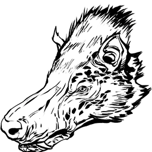 | Andrewsarchus | 哺乳 | Andrewsarchus | `Andrewsarchus_Character_BP_C` | ../icon/creatures_256px/Andrewsarchus_Mammals_Andrewsarchus_Andrewsarchus_Character_BP_C_256px.png | "Blueprint'/Game/Fjordur/Dinos/Andrewsarchus/Andrewsarchus_Character_BP.Andrewsarchus_Character_BP'" |
| 2 |  | Desmodus | 哺乳 | Desmodus | `Desmodus_Character_BP_C` | ../icon/creatures_256px/Desmodus_Mammals_Desmodus_Desmodus_Character_BP_C_256px.png | "Blueprint'/Game/Fjordur/Dinos/Desmodus/Desmodus_Character_BP.Desmodus_Character_BP'" |
| 3 |  | Fenrir | Fantasy Creatures | Fenrir Wolf | `Fenrir_Character_BP_C` | ../icon/creatures_256px/Fenrir_Fantasy_Creatures_Fenrir_Wolf_Fenrir_Character_BP_C_256px.png | "Blueprint'/Game/Fjordur/Dinos/Fenrir/Fenrir_Character_BP.Fenrir_Character_BP'" |
| 4 | 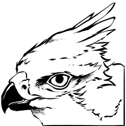 | Fjordhawk | 鸟类 | Fjordhawk | `Fjordhawk_Character_BP_C` | ../icon/creatures_256px/Fjordhawk_Birds_Fjordhawk_Fjordhawk_Character_BP_C_256px.png | "Blueprint'/Game/Fjordur/Dinos/Fjordhawk/Fjordhawk_Character_BP.Fjordhawk_Character_BP'" |

---

## Fantastic Tames (奇幻驯养)

> 共 7 个生物

| # | 图标 | 名称 | 分类 | Name Tag | Entity ID | Icon URL | Blueprint Path |
|---|------|------|------|----------|-----------|----------|----------------|
| 1 |  | Pyromane | Fantasy Creatures | FireLion | `FireLion_Character_BP_C` | ../icon/creatures_256px/Pyromane_Fantasy_Creatures_FireLion_FireLion_Character_BP_C_256px.png | "Blueprint'/Game/ASA/Dinos/FireLion/FireLion_Character_BP.FireLion_Character_BP'" |
| 2 |  | Dreadmare | Fantasy Creatures | DarkPegasus | `DarkPegasus_Character_BP_C` | ../icon/creatures_256px/Dreadmare_Fantasy_Creatures_DarkPegasus_DarkPegasus_Character_BP_C_256px.png | "Blueprint'/Game/ASA/Dinos/DarkPegasus/DarkPegasus_Character_BP.DarkPegasus_Character_BP'" |
| 3 | 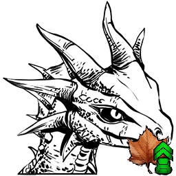 | Autumn Drakeling | Fantasy Creatures | ShoulderDragon | `ShoulderDragon_Character_BP_C` | ../icon/creatures_256px/Autumn_Drakeling_Fantasy_Creatures_ShoulderDragon_ShoulderDragon_Character_BP_C_256px.png | "Blueprint'/Game/ASA/Dinos/ShoulderDragon/ShoulderDragon_Character_BP_Autumn.ShoulderDragon_Characte |
| 4 |  | Spring Drakeling | Fantasy Creatures | ShoulderDragon | `ShoulderDragon_Character_BP_C` | ../icon/creatures_256px/Autumn_Drakeling_Fantasy_Creatures_ShoulderDragon_ShoulderDragon_Character_BP_C_256px.png | "Blueprint'/Game/ASA/Dinos/ShoulderDragon/ShoulderDragon_Character_BP_Spring.ShoulderDragon_Characte |
| 5 |  | Summer Drakeling | Fantasy Creatures | ShoulderDragon | `ShoulderDragon_Character_BP_C` | ../icon/creatures_256px/Autumn_Drakeling_Fantasy_Creatures_ShoulderDragon_ShoulderDragon_Character_BP_C_256px.png | "Blueprint'/Game/ASA/Dinos/ShoulderDragon/ShoulderDragon_Character_BP_Summer.ShoulderDragon_Characte |
| 6 |  | Winter Drakeling | Fantasy Creatures | ShoulderDragon | `ShoulderDragon_Character_BP_C` | ../icon/creatures_256px/Autumn_Drakeling_Fantasy_Creatures_ShoulderDragon_ShoulderDragon_Character_BP_C_256px.png | "Blueprint'/Game/ASA/Dinos/ShoulderDragon/ShoulderDragon_Character_BP_Winter.ShoulderDragon_Characte |
| 7 |  | Elderclaw | Fantasy Creatures | SpiritBear | `SpiritBear_Character_BP_C` | ../icon/creatures_256px/Elderclaw_Fantasy_Creatures_SpiritBear_SpiritBear_Character_BP_C_256px.png | "Blueprint'/Game/ASA/Dinos/SpiritBear/SpiritBear_Character_BP.SpiritBear_Character_BP'" |

---

## Creatures of Astraeos (Astraeos)

> 共 2 个生物

| # | 图标 | 名称 | 分类 | Name Tag | Entity ID | Icon URL | Blueprint Path |
|---|------|------|------|----------|-----------|----------|----------------|
| 1 |  | Grand Tortugar | 爬行 | GrandTortugar | `GrandTortugar_Character_BP_C` | ../icon/creatures_256px/Grand_Tortugar_Reptiles_GrandTortugar_GrandTortugar_Character_BP_C_256px.png | "Blueprint'/Game/ASA/Dinos/GrandTortugar/GrandTortugar_Character_BP.GrandTortugar_Character_BP'" |
| 2 |  | Maeguana | 爬行 | Maelizard | `Maelizard_Character_BP_C` | ../icon/creatures_256px/Maeguana_Reptiles_Maelizard_Maelizard_Character_BP_C_256px.png | "Blueprint'/Game/ASA/Dinos/Maelizard/Maelizard_Character_BP.Maelizard_Character_BP'" |

---

## Creatures of Aquatica (深海)

> 共 55 个生物

| # | 图标 | 名称 | 分类 | Name Tag | Entity ID | Icon URL | Blueprint Path |
|---|------|------|------|----------|-----------|----------|----------------|
| 1 | 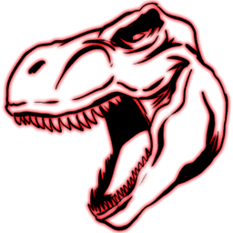 | Abyssal Alpha T-Rex | Alpha Creatures | ??? | `MegaRex_Character_BP_Abyssal_C` | ../icon/creatures_256px/Abyssal_Alpha_T-Rex_Alpha_Creatures___MegaRex_Character_BP_Abyssal_C_256px.png | "Blueprint'/Game/Abyss/Dinos/Abyssal/Rex/Alpha/MegaRex_Character_BP_Abyssal.MegaRex_Character_BP_Aby |
| 2 |  | Abyssal Ankylosaurus | 恐龙 | ??? | `Ankylo_Character_BP_Abyssal_C` | ../icon/creatures_256px/Abyssal_Ankylosaurus_Dinosaurs___Ankylo_Character_BP_Abyssal_C_256px.png | "Blueprint'/Game/Abyss/Dinos/Abyssal/Ankylosaurus/Ankylo_Character_BP_Abyssal.Ankylo_Character_BP_Ab |
| 3 |  | Abyssal Moschops | 合弓纲 | ??? | `Moschops_Character_BP_Abyssal_C` | ../icon/creatures_256px/Abyssal_Moschops_Synapsids___Moschops_Character_BP_Abyssal_C_256px.png | "Blueprint'/Game/Abyss/Dinos/Abyssal/Moschops/Moschops_Character_BP_Abyssal.Moschops_Character_BP_Ab |
| 4 |  | Abyssal Procoptodon | 哺乳 | ??? | `Procoptodon_Character_BP_Abyssal_C` | ../icon/creatures_256px/Abyssal_Procoptodon_Mammals___Procoptodon_Character_BP_Abyssal_C_256px.png | "Blueprint'/Game/Abyss/Dinos/Abyssal/Procoptodon/Procoptodon_Character_BP_Abyssal.Procoptodon_Charac |
| 5 |  | Abyssal Reaper King | Fantasy Creatures | ??? | `Reaper_Character_BP_Male_Abyssal_C` | ../icon/creatures_256px/Abyssal_Reaper_King_Fantasy_Creatures___Reaper_Character_BP_Male_Abyssal_C_256px.png | "Blueprint'/Game/Abyss/Dinos/Abyssal/Reaper/Reaper_Character_BP_Male_Abyssal.Reaper_Character_BP_Mal |
| 6 |  | Abyssal Reaper Offspring | Fantasy Creatures | ??? | `Reaper_Character_BP_Offspring_Abyssal_C` | ../icon/creatures_256px/Abyssal_Reaper_Offspring_Fantasy_Creatures___Reaper_Character_BP_Offspring_Abyssal_C_256px.png | "Blueprint'/Game/Abyss/Dinos/Abyssal/Reaper/Reaper_Character_BP_Offspring_Abyssal.Reaper_Character_B |
| 7 |  | Abyssal Reaper Queen | Fantasy Creatures | ??? | `Reaper_Character_BP_Female_Abyssal_C` | ../icon/creatures_256px/Abyssal_Reaper_Queen_Fantasy_Creatures___Reaper_Character_BP_Female_Abyssal_C_256px.png | "Blueprint'/Game/Abyss/Dinos/Abyssal/Reaper/Reaper_Character_BP_Female_Abyssal.Reaper_Character_BP_F |
| 8 |  | Abyssal Rex | 恐龙 | ??? | `Rex_Character_BP_Abyssal_C` | ../icon/creatures_256px/Abyssal_Alpha_T-Rex_Alpha_Creatures___MegaRex_Character_BP_Abyssal_C_256px.png | "Blueprint'/Game/Abyss/Dinos/Abyssal/Rex/Rex_Character_BP_Abyssal.Rex_Character_BP_Abyssal'" |
| 9 |  | Abyssal Stegosaurus | 恐龙 | ??? | `Stego_Character_BP_Abyssal_C` | ../icon/creatures_256px/Abyssal_Stegosaurus_Dinosaurs___Stego_Character_BP_Abyssal_C_256px.png | "Blueprint'/Game/Abyss/Dinos/Abyssal/Stego/Stego_Character_BP_Abyssal.Stego_Character_BP_Abyssal'" |
| 10 |  | Abyssal Therizinosaur | 恐龙 | ??? | `Therizino_Character_BP_Abyssal_C` | ../icon/creatures_256px/Abyssal_Therizinosaur_Dinosaurs___Therizino_Character_BP_Abyssal_C_256px.png | "Blueprint'/Game/Abyss/Dinos/Abyssal/Therizinosaurus/Therizino_Character_BP_Abyssal.Therizino_Charac |
| 11 |  | Abyssal Thylacoleo | 哺乳 | ??? | `Thylacoleo_Character_BP_Abyssal_C` | ../icon/creatures_256px/Abyssal_Thylacoleo_Mammals___Thylacoleo_Character_BP_Abyssal_C_256px.png | "Blueprint'/Game/Abyss/Dinos/Abyssal/Thylacoleo/Thylacoleo_Character_BP_Abyssal.Thylacoleo_Character |
| 12 |  | Abyssal Yutyrannus | 恐龙 | ??? | `Yutyrannus_Character_BP_Abyssal_C` | ../icon/creatures_256px/Abyssal_Yutyrannus_Dinosaurs___Yutyrannus_Character_BP_Abyssal_C_256px.png | "Blueprint'/Game/Abyss/Dinos/Abyssal/Yutyrannus/Yutyrannus_Character_BP_Abyssal.Yutyrannus_Character |
| 13 |  | Alpha Chrysaora | Alpha Creatures | ??? | `MegaChrysaora_Character_BP_C` | ../icon/creatures_256px/Alpha_Chrysaora_Alpha_Creatures___MegaChrysaora_Character_BP_C_256px.png | "Blueprint'/Game/Abyss/Dinos/Chrysaora/Alpha/MegaChrysaora_Character_BP.MegaChrysaora_Character_BP'" |
| 14 |  | Alpha Dakosaurus | Alpha Creatures | ??? | `Dakosaurus_Character_BP_Alpha_C` | ../icon/creatures_256px/Alpha_Dakosaurus_Alpha_Creatures___Dakosaurus_Character_BP_Alpha_C_256px.png | "Blueprint'/Game/Abyss/Dinos/Dakosaurus/Alpha/Dakosaurus_Character_BP_Alpha.Dakosaurus_Character_BP_ |
| 15 |  | Alpha Malleocephalus | Alpha Creatures | ??? | `MegaMalleocephalus_Character_BP_C` | ../icon/creatures_256px/Alpha_Malleocephalus_Alpha_Creatures___MegaMalleocephalus_Character_BP_C_256px.png | "Blueprint'/Game/Abyss/Dinos/Malleocephalus/Alpha/MegaMalleocephalus_Character_BP.MegaMalleocephalus |
| 16 |  | Alpha Tridacna | Alpha Creatures | ??? | `AlphaCorruptTridacna_Character_BP_C` | ../icon/creatures_256px/Alpha_Tridacna_Alpha_Creatures___AlphaCorruptTridacna_Character_BP_C_256px.png | "Blueprint'/Game/Abyss/Dinos/AlphaCorruptTridacna/AlphaCorruptTridacna_Character_BP.AlphaCorruptTrid |
| 17 |  | Alpha Water Wyvern | Alpha Creatures | ??? | `MegaWyvern_Character_BP_Water_C` | ../icon/creatures_256px/Alpha_Water_Wyvern_Alpha_Creatures___MegaWyvern_Character_BP_Water_C_256px.png | "Blueprint'/Game/Abyss/Dinos/WaterWyvern/Alpha/MegaWyvern_Character_BP_Water.MegaWyvern_Character_BP |
| 18 |  | Chrysaora | 无脊椎 | ??? | `Chrysaora_Character_BP_C` | ../icon/creatures_256px/Alpha_Chrysaora_Alpha_Creatures___MegaChrysaora_Character_BP_C_256px.png | "Blueprint'/Game/Abyss/Dinos/Chrysaora/Chrysaora_Character_BP.Chrysaora_Character_BP'" |
| 19 |  | Cymathoa | Boss | ??? | `Cymathoa_Character_BP_C` | ../icon/creatures_256px/Cymathoa_Bosses___Cymathoa_Character_BP_C_256px.png | "Blueprint'/Game/Abyss/Dinos/Cymathoa/Cymathoa_Character_BP.Cymathoa_Character_BP'" |
| 20 | 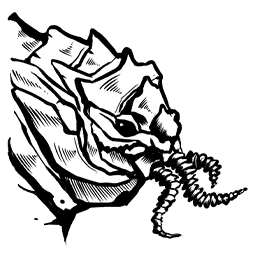 | Cymathoa (Alpha) | Boss | ??? | `Cymathoa_Character_BP_Hard_C` | ../icon/creatures_256px/Cymathoa_(Alpha)_Bosses___Cymathoa_Character_BP_Hard_C_256px.png | "Blueprint'/Game/Abyss/Dinos/Cymathoa/Cymathoa_Character_BP_Hard.Cymathoa_Character_BP_Hard'" |
| 21 |  | Cymathoa (Beta) | Boss | ??? | `Cymathoa_Character_BP_Medium_C` | ../icon/creatures_256px/Cymathoa_(Beta)_Bosses___Cymathoa_Character_BP_Medium_C_256px.png | "Blueprint'/Game/Abyss/Dinos/Cymathoa/Cymathoa_Character_BP_Medium.Cymathoa_Character_BP_Medium'" |
| 22 |  | Cymathoa (Gamma) | Boss | ??? | `Cymathoa_Character_BP_Easy_C` | ../icon/creatures_256px/Cymathoa_(Gamma)_Bosses___Cymathoa_Character_BP_Easy_C_256px.png | "Blueprint'/Game/Abyss/Dinos/Cymathoa/Cymathoa_Character_BP_Easy.Cymathoa_Character_BP_Easy'" |
| 23 |  | Dakosaurus | 爬行 | ??? | `Dakosaurus_Character_BP_C` | ../icon/creatures_256px/Dakosaurus_Reptiles___Dakosaurus_Character_BP_C_256px.png | "Blueprint'/Game/Abyss/Dinos/Dakosaurus/Dakosaurus_Character_BP.Dakosaurus_Character_BP'" |
| 24 |  | Fractalis | Boss | ??? | `Fractalis_Character_BP_C` | ../icon/creatures_256px/Fractalis_(Alpha)_Bosses___Fractalis_Character_BP_C_256px.png | "Blueprint'/Game/Abyss/Dinos/Fractalis/Fractalis_Character_BP.Fractalis_Character_BP'" |
| 25 |  | Fractalis (Alpha) | Boss | ??? | `Fractalis_Character_BP_C` | ../icon/creatures_256px/Fractalis_(Alpha)_Bosses___Fractalis_Character_BP_C_256px.png | "Blueprint'/Game/Abyss/Dinos/Fractalis/Fractalis_Character_BP_Hard.Fractalis_Character_BP_Hard'" |
| 26 |  | Fractalis (Beta) | Boss | ??? | `Fractalis_Character_BP_C` | ../icon/creatures_256px/Fractalis_(Alpha)_Bosses___Fractalis_Character_BP_C_256px.png | "Blueprint'/Game/Abyss/Dinos/Fractalis/Fractalis_Character_BP_Medium.Fractalis_Character_BP_Medium'" |
| 27 |  | Fractalis (Gamma) | Boss | ??? | `Fractalis_Character_BP_C` | ../icon/creatures_256px/Fractalis_(Alpha)_Bosses___Fractalis_Character_BP_C_256px.png | "Blueprint'/Game/Abyss/Dinos/Fractalis/Fractalis_Character_BP_Easy.Fractalis_Character_BP_Easy'" |
| 28 | 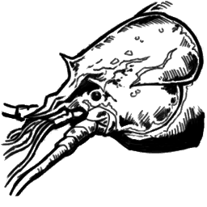 | Homarus | 无脊椎 | ??? | `Homarus_Character_BP_C` | ../icon/creatures_256px/Homarus_Invertebrates___Homarus_Character_BP_C_256px.png | "Blueprint'/Game/Abyss/Dinos/Homarus/Homarus_Character_BP.Homarus_Character_BP'" |
| 29 |  | Istiophorus | 鱼类 | ??? | `Istiophorus_Character_BP_C` | ../icon/creatures_256px/Istiophorus_Fish___Istiophorus_Character_BP_C_256px.png | "Blueprint'/Game/Abyss/Dinos/Istiophorus/Istiophorus_Character_BP.Istiophorus_Character_BP'" |
| 30 |  | Kathreptis | 无脊椎 | ??? | `Kathreptis_Character_BP_C` | ../icon/creatures_256px/Kathreptis_Invertebrates___Kathreptis_Character_BP_C_256px.png | "Blueprint'/Game/Abyss/Dinos/Kathreptis/Kathreptis_Character_BP.Kathreptis_Character_BP'" |
| 31 |  | Malleocephalus | 鱼类 | ??? | `Malleocephalus_Character_BP_C` | ../icon/creatures_256px/Alpha_Malleocephalus_Alpha_Creatures___MegaMalleocephalus_Character_BP_C_256px.png | "Blueprint'/Game/Abyss/Dinos/Malleocephalus/Malleocephalus_Character_BP.Malleocephalus_Character_BP' |
| 32 |  | Mantis Shrimp | 无脊椎 | ??? | `MantisShrimp_Character_BP_C` | ../icon/creatures_256px/Mantis_Shrimp_Invertebrates___MantisShrimp_Character_BP_C_256px.png | "Blueprint'/Game/Abyss/Dinos/MantisShrimp/MantisShrimp_Character_BP.MantisShrimp_Character_BP'" |
| 33 |  | Monodon | 哺乳 | ??? | `Monodon_Character_BP_C` | ../icon/creatures_256px/Monodon_Mammals___Monodon_Character_BP_C_256px.png | "Blueprint'/Game/Abyss/Dinos/Monodon/Monodon_Character_BP.Monodon_Character_BP'" |
| 34 |  | Mudpuppy | 两栖 | ??? | `Mudpuppy_Character_BP_C` | ../icon/creatures_256px/Mudpuppy_Amphibians___Mudpuppy_Character_BP_C_256px.png | "Blueprint'/Game/Abyss/Dinos/Mudpuppy/Mudpuppy_Character_BP.Mudpuppy_Character_BP'" |
| 35 |  | Ocepechelon | 爬行 | ??? | `Ocepechelon_Character_BP_C` | ../icon/creatures_256px/Ocepechelon_Reptiles___Ocepechelon_Character_BP_C_256px.png | "Blueprint'/Game/Abyss/Dinos/Ocepechelon/Ocepechelon_Character_BP.Ocepechelon_Character_BP'" |
| 36 |  | Onchopristis | 鱼类 | ??? | `Onchopristis_Character_BP_C` | ../icon/creatures_256px/Onchopristis_Fish___Onchopristis_Character_BP_C_256px.png | "Blueprint'/Game/Abyss/Dinos/Onchopristis/Onchopristis_Character_BP.Onchopristis_Character_BP'" |
| 37 |  | Pygocentrus | Boss | ??? | `Pygocentrus_Character_BP_C` | ../icon/creatures_256px/Pygocentrus_Bosses___Pygocentrus_Character_BP_C_256px.png | "Blueprint'/Game/Abyss/Dinos/Pygocentrus/Pygocentrus_Character_BP.Pygocentrus_Character_BP'" |
| 38 |  | Pygocentrus (Alpha) | Boss | ??? | `Pygocentrus_Character_BP_Hard_C` | ../icon/creatures_256px/Pygocentrus_(Alpha)_Bosses___Pygocentrus_Character_BP_Hard_C_256px.png | "Blueprint'/Game/Abyss/Dinos/Pygocentrus/Pygocentrus_Character_BP_Hard.Pygocentrus_Character_BP_Hard |
| 39 |  | Pygocentrus (Beta) | Boss | ??? | `Pygocentrus_Character_BP_Medium_C` | ../icon/creatures_256px/Pygocentrus_(Beta)_Bosses___Pygocentrus_Character_BP_Medium_C_256px.png | "Blueprint'/Game/Abyss/Dinos/Pygocentrus/Pygocentrus_Character_BP_Medium.Pygocentrus_Character_BP_Me |
| 40 | 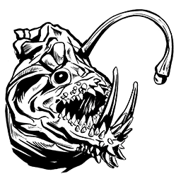 | Pygocentrus (Gamma) | Boss | ??? | `Pygocentrus_Character_BP_Easy_C` | ../icon/creatures_256px/Pygocentrus_(Gamma)_Bosses___Pygocentrus_Character_BP_Easy_C_256px.png | "Blueprint'/Game/Abyss/Dinos/Pygocentrus/Pygocentrus_Character_BP_Easy.Pygocentrus_Character_BP_Easy |
| 41 |  | Qarmoutus | 鱼类 | ??? | `Qarmoutus_Character_BP_C` | ../icon/creatures_256px/Qarmoutus_Fish___Qarmoutus_Character_BP_C_256px.png | "Blueprint'/Game/Abyss/Dinos/Qarmoutus/Qarmoutus_Character_BP.Qarmoutus_Character_BP'" |
| 42 |  | Riftcrawler | Fantasy Creatures | ??? | `RiftCrawler_Character_BP_C` | ../icon/creatures_256px/Riftcrawler_Fantasy_Creatures___RiftCrawler_Character_BP_C_256px.png | "Blueprint'/Game/Abyss/Dinos/Riftcrawler/RiftCrawler_Character_BP.RiftCrawler_Character_BP'" |
| 43 | 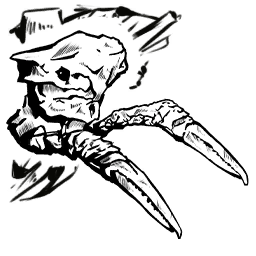 | Riftwalker | Fantasy Creatures | ??? | `Riftwalker_BP_C` | ../icon/creatures_256px/Riftwalker_Fantasy_Creatures___Riftwalker_BP_C_256px.png | "Blueprint'/Game//Abyss/Dinos/Riftwalker/Riftwalker_BP.Riftwalker_BP'" |
| 44 |  | Seahorse | Fantasy Creatures | ??? | `Seahorse_Character_BP_C` | ../icon/creatures_256px/Seahorse_Fantasy_Creatures___Seahorse_Character_BP_C_256px.png | "Blueprint'/Game/Abyss/Dinos/Seahorse/Seahorse_Character_BP.Seahorse_Character_BP'" |
| 45 |  | Stereolepis | 鱼类 | ??? | `Stereolepis_Character_BP_C` | ../icon/creatures_256px/Stereolepis_Fish___Stereolepis_Character_BP_C_256px.png | "Blueprint'/Game/Abyss/Dinos/Stereolepis/Stereolepis_Character_BP.Stereolepis_Character_BP'" |
| 46 |  | Takifugu | 鱼类 | ??? | `Takifugu_Character_BP_C` | ../icon/creatures_256px/Takifugu_Fish___Takifugu_Character_BP_C_256px.png | "Blueprint'/Game/Abyss/Dinos/Takifugu/Takifugu_Character_BP.Takifugu_Character_BP'" |
| 47 |  | Thunnus | 鱼类 | ??? | `Thunnus_Character_BP_C` | ../icon/creatures_256px/Thunnus_Fish___Thunnus_Character_BP_C_256px.png | "Blueprint'/Game/Abyss/Dinos/Thunnus/Thunnus_Character_BP.Thunnus_Character_BP'" |
| 48 |  | Tiktaalik | 鱼类 | ??? | `Tiktaalik_Character_BP_C` | ../icon/creatures_256px/Tiktaalik_Fish___Tiktaalik_Character_BP_C_256px.png | "Blueprint'/Game/Abyss/Dinos/Tiktaalik/Tiktaalik_Character_BP.Tiktaalik_Character_BP'" |
| 49 |  | Tridacna | 无脊椎 | ??? | `Tridacna_Character_BP_C` | ../icon/creatures_256px/Alpha_Tridacna_Alpha_Creatures___AlphaCorruptTridacna_Character_BP_C_256px.png | "Blueprint'/Game/Abyss/Dinos/Tridacna/Tridacna_Character_BP.Tridacna_Character_BP'" |
| 50 |  | Vulcanite | Fantasy Creatures | ??? | `Vulcanite_Character_BP_C` | ../icon/creatures_256px/Vulcanite_Fantasy_Creatures___Vulcanite_Character_BP_C_256px.png | "Blueprint'/Game/Abyss/Dinos/Vulcanite/Vulcanite_Character_BP.Vulcanite_Character_BP'" |
| 51 |  | Vulcanithys | Boss | ??? | `Vulcanithys_Character_BP_C` | ../icon/creatures_256px/Vulcanithys_Bosses___Vulcanithys_Character_BP_C_256px.png | "Blueprint'/Game/Abyss/Dinos/Vulcanithys/Vulcanithys_Character_BP.Vulcanithys_Character_BP'" |
| 52 |  | Vulcanithys (Alpha) | Boss | ??? | `Vulcanithys_Character_BP_Hard_C` | ../icon/creatures_256px/Vulcanithys_(Alpha)_Bosses___Vulcanithys_Character_BP_Hard_C_256px.png | "Blueprint'/Game/Abyss/Dinos/Vulcanithys/Vulcanithys_Character_BP_Hard.Vulcanithys_Character_BP_Hard |
| 53 |  | Vulcanithys (Beta) | Boss | ??? | `Vulcanithys_Character_BP_Medium_C` | ../icon/creatures_256px/Vulcanithys_(Beta)_Bosses___Vulcanithys_Character_BP_Medium_C_256px.png | "Blueprint'/Game/Abyss/Dinos/Vulcanithys/Vulcanithys_Character_BP_Medium.Vulcanithys_Character_BP_Me |
| 54 |  | Vulcanithys (Gamma) | Boss | ??? | `Vulcanithys_Character_BP_Easy_C` | ../icon/creatures_256px/Vulcanithys_(Gamma)_Bosses___Vulcanithys_Character_BP_Easy_C_256px.png | "Blueprint'/Game/Abyss/Dinos/Vulcanithys/Vulcanithys_Character_BP_Easy.Vulcanithys_Character_BP_Easy |
| 55 |  | Water Wyvern | Fantasy Creatures | ??? | `Wyvern_Character_BP_Water_C` | ../icon/creatures_256px/Alpha_Water_Wyvern_Alpha_Creatures___MegaWyvern_Character_BP_Water_C_256px.png | "Blueprint'/Game/Abyss/Dinos/WaterWyvern/Wyvern_Character_BP_Water.Wyvern_Character_BP_Water'" |

---

## Creatures of Lost Colony (失落殖民地)

> 共 8 个生物

| # | 图标 | 名称 | 分类 | Name Tag | Entity ID | Icon URL | Blueprint Path |
|---|------|------|------|----------|-----------|----------|----------------|
| 1 |  | Aureliax | 爬行 | SnowDragon | `SnowDragon_Character_BP_C` | ../icon/creatures_256px/Aureliax_Reptiles_SnowDragon_SnowDragon_Character_BP_C_256px.png | "Blueprint'/Game/LostColony/Dinos/SnowDragon/SnowDragon_Character_BP.SnowDragon_Character_BP'" |
| 2 |  | Cryolophosaurus | 恐龙 | Cryolophosaurus | `Cryolophosaurus_Character_BP_C` | ../icon/creatures_256px/Cryolophosaurus_Dinosaurs_Cryolophosaurus_Cryolophosaurus_Character_BP_C_256px.png | "Blueprint'/Game/ASA/Dinos/Cryolophosaurus/Cryolophosaurus_Character_BP.Cryolophosaurus_Character_BP |
| 3 |  | Gigadesmodus | 哺乳 | BossBat | `BossBat_Character_BP_C` | ../icon/creatures_256px/Gigadesmodus_Mammals_BossBat_BossBat_Character_BP_C_256px.png | "Blueprint'/Game/LostColony/Dinos/BossBat/BossBat_Character_BP.BossBat_Character_BP'" |
| 4 |  | Gloon | 两栖 | LostCharge | `LostCharge_LanternPet_Char_BP_C` | ../icon/creatures_256px/Gloon_Amphibians_LostCharge_LostCharge_LanternPet_Char_BP_C_256px.png | "Blueprint'/Game/LostColony/Dinos/LostChargePet/LostCharge_LanternPet_Char_BP.LostCharge_LanternPet_ |
| 5 |  | Malwyn | 哺乳 | DevilFox | `DevilFox_Character_BP_C` | ../icon/creatures_256px/Malwyn_Mammals_DevilFox_DevilFox_Character_BP_C_256px.png | "Blueprint'/Game/LostColony/Dinos/DevilFox/DevilFox_Character_BP.DevilFox_Character_BP'" |
| 6 |  | Ossidon | 哺乳 | SnowMonster | `SnowMonster_Character_BP_C` | ../icon/creatures_256px/Ossidon_Mammals_SnowMonster_SnowMonster_Character_BP_C_256px.png | "Blueprint'/Game/LostColony/Dinos/SnowMonster/SnowMonster_Character_BP.SnowMonster_Character_BP'" |
| 7 |  | Solwyn | 哺乳 | AngelFox | `AngelFox_Character_BP_C` | ../icon/creatures_256px/Solwyn_Mammals_AngelFox_AngelFox_Character_BP_C_256px.png | "Blueprint'/Game/LostColony/Dinos/AngelFox/AngelFox_Character_BP.AngelFox_Character_BP'" |
| 8 |  | Veilwyn | 哺乳 | YoungIceFox | `YoungIceFox_DinoCompanion_Character_BP_C` | ../icon/creatures_256px/Veilwyn_Mammals_YoungIceFox_YoungIceFox_DinoCompanion_Character_BP_C_256px.png | "Blueprint'/Game/LostColony/Dinos/YoungIceFox/YoungIceFox_DinoCompanion_Character_BP.YoungIceFox_Din |

---

> 📖 完整文档: https://ark.wiki.gg/wiki/Creature_IDs
