# ARK: Survival Ascended - Creature IDs

> 数据来源: https://ark.wiki.gg/wiki/Creature_IDs

## The Island

| 图标 | 名称 | 名称（中文） | 详情页 | 分类 | Name Tag | Entity ID | Blueprint Path |
| ------ | ------ | ------------ | -------- | ------ | ---------- | ----------- | ---------------- |
|  | [Achatina](https://ark.wiki.gg/wiki/Achatina) | 玛瑙螺 | https://ark.wiki.gg/wiki/Achatina | Invertebrates | Achatina | Achatina_Character_BP_C | `Blueprint'/Game/PrimalEarth/Dinos/Achatina/Achatina_Character_BP.Achatina_Character_BP'` |
| 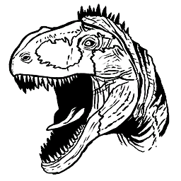 | [Acrocanthosaurus](https://ark.wiki.gg/wiki/Acrocanthosaurus) | 高棘龙 | https://ark.wiki.gg/wiki/Acrocanthosaurus | Dinosaurs | Acrocanthosaurus | Acrocanthosaurus_Character_BP_C | `Blueprint'/Game/ASA/Dinos/Acrocanthosaurus/Acrocanthosaurus_Character_BP.Acrocanthosaurus_Character_BP'` |
|  | [Allosaurus](https://ark.wiki.gg/wiki/Allosaurus) | 异特龙 | https://ark.wiki.gg/wiki/Allosaurus | Dinosaurs | Allo | Allo_Character_BP_C | `Blueprint'/Game/PrimalEarth/Dinos/Allosaurus/Allo_Character_BP.Allo_Character_BP'` |
| 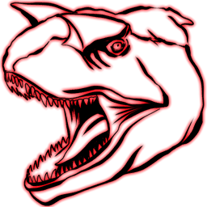 | [Alpha Carno](https://ark.wiki.gg/wiki/Alpha_Carno) |  | https://ark.wiki.gg/wiki/Alpha_Carno | Alpha Creatures | Elite Carno | MegaCarno_Character_BP_C | `Blueprint'/Game/PrimalEarth/Dinos/Carno/MegaCarno_Character_BP.MegaCarno_Character_BP'` |
|  | [Alpha Leedsichthys](https://ark.wiki.gg/wiki/Alpha_Leedsichthys) | 精英利兹鱼 | https://ark.wiki.gg/wiki/Alpha_Leedsichthys | Alpha Creatures | Leedsichthys | Alpha_Leedsichthys_Character_BP_C | `Blueprint'/Game/PrimalEarth/Dinos/Leedsichthys/Alpha_Leedsichthys_Character_BP.Alpha_Leedsichthys_Character_BP'` |
|  | [Alpha Megalodon](https://ark.wiki.gg/wiki/Alpha_Megalodon) | 精英巨齿鲨 | https://ark.wiki.gg/wiki/Alpha_Megalodon | Alpha Creatures | Elite Mega | MegaMegalodon_Character_BP_C | `Blueprint'/Game/PrimalEarth/Dinos/Megalodon/MEgaMegalodon_Character_BP.MegaMegalodon_Character_BP'` |
|  | [Alpha Mosasaur](https://ark.wiki.gg/wiki/Alpha_Mosasaur) | 精英沧龙 | https://ark.wiki.gg/wiki/Alpha_Mosasaur | Alpha Creatures | Mosasaur | Mosa_Character_BP_Mega_C | `Blueprint'/Game/PrimalEarth/Dinos/Mosasaurus/Mosa_Character_BP_Mega.Mosa_Character_BP_Mega'` |
|  | [Alpha Raptor](https://ark.wiki.gg/wiki/Alpha_Raptor) | 精英迅猛龙 | https://ark.wiki.gg/wiki/Alpha_Raptor | Alpha Creatures | Elite Raptor | MegaRaptor_Character_BP_C | `Blueprint'/Game/PrimalEarth/Dinos/Raptor/MegaRaptor_Character_BP.MegaRaptor_Character_BP'` |
|  | [Alpha T-Rex](https://ark.wiki.gg/wiki/Alpha_T-Rex) | 精英霸王龙 | https://ark.wiki.gg/wiki/Alpha_T-Rex | Alpha Creatures | Elite Rex | MegaRex_Character_BP_C | `Blueprint'/Game/PrimalEarth/Dinos/Rex/MegaRex_Character_BP.MegaRex_Character_BP'` |
|  | [Alpha Tusoteuthis](https://ark.wiki.gg/wiki/Alpha_Tusoteuthis) | 精英托斯特巨鱿 | https://ark.wiki.gg/wiki/Alpha_Tusoteuthis | Alpha Creatures | Tusoteuthis | Mega_Tusoteuthis_Character_BP_C | `Blueprint'/Game/PrimalEarth/Dinos/Tusoteuthis/Mega_Tusoteuthis_Character_BP.Mega_Tusoteuthis_Character_BP'` |
|  | [Ammonite](https://ark.wiki.gg/wiki/Ammonite) | 菊石 | https://ark.wiki.gg/wiki/Ammonite | Invertebrates | Ammonite | Ammonite_Character_C | `Blueprint'/Game/PrimalEarth/Dinos/Ammonite/Ammonite_Character.Ammonite_Character'` |
|  | [Anglerfish](https://ark.wiki.gg/wiki/Anglerfish) | 鮟鱇鱼 | https://ark.wiki.gg/wiki/Anglerfish | Fish | Angler | Angler_Character_BP_C | `Blueprint'/Game/PrimalEarth/Dinos/Anglerfish/Angler_Character_BP.Angler_Character_BP'` |
|  | [Ankylosaurus](https://ark.wiki.gg/wiki/Ankylosaurus) | 甲龙 | https://ark.wiki.gg/wiki/Ankylosaurus | Dinosaurs | Anky | Ankylo_Character_BP_C | `Blueprint'/Game/PrimalEarth/Dinos/Ankylo/Ankylo_Character_BP.Ankylo_Character_BP'` |
|  | [Araneo](https://ark.wiki.gg/wiki/Araneo) | 蜘蛛 | https://ark.wiki.gg/wiki/Araneo | Invertebrates | Spider | SpiderS_Character_BP_C | `Blueprint'/Game/PrimalEarth/Dinos/Spider-Small/SpiderS_Character_BP.SpiderS_Character_BP'` |
|  | [Archaeopteryx](https://ark.wiki.gg/wiki/Archaeopteryx) | 始祖鸟 | https://ark.wiki.gg/wiki/Archaeopteryx | Birds | Archa | Archa_Character_BP_C | `Blueprint'/Game/PrimalEarth/Dinos/Archaeopteryx/Archa_Character_BP.Archa_Character_BP'` |
| 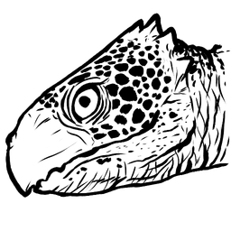 | [Archelon](https://ark.wiki.gg/wiki/Archelon) | 古巨龟 | https://ark.wiki.gg/wiki/Archelon | Reptiles | Archelon | Archelon_Character_BP_ASA_C | `Blueprint'/Game/ASA/Dinos/Archelon/Dinos/Archelon_Character_BP_ASA.Archelon_Character_BP_ASA'` |
|  | [Argentavis](https://ark.wiki.gg/wiki/Argentavis) | 阿根廷鹫 | https://ark.wiki.gg/wiki/Argentavis | Birds | Argent | Argent_Character_BP_C | `Blueprint'/Game/PrimalEarth/Dinos/Argentavis/Argent_Character_BP.Argent_Character_BP'` |
|  | [Arthropluera](https://ark.wiki.gg/wiki/Arthropluera) | 节胸虫 | https://ark.wiki.gg/wiki/Arthropluera | Invertebrates | Arthro | Arthro_Character_BP_C | `Blueprint'/Game/PrimalEarth/Dinos/Arthropluera/Arthro_Character_BP.Arthro_Character_BP'` |
|  | [Baryonyx](https://ark.wiki.gg/wiki/Baryonyx) | 重爪龙 | https://ark.wiki.gg/wiki/Baryonyx | Dinosaurs | Baryonyx | Baryonyx_Character_BP_C | `Blueprint'/Game/PrimalEarth/Dinos/Baryonyx/Baryonyx_Character_BP.Baryonyx_Character_BP'` |
|  | [Basilosaurus](https://ark.wiki.gg/wiki/Basilosaurus) | 龙王鲸 | https://ark.wiki.gg/wiki/Basilosaurus | Mammals | Basilosaurus | Basilosaurus_Character_BP_C | `Blueprint'/Game/PrimalEarth/Dinos/Basilosaurus/Basilosaurus_Character_BP.Basilosaurus_Character_BP'` |
|  | [Beelzebufo](https://ark.wiki.gg/wiki/Beelzebufo) | 魔鬼蛙 | https://ark.wiki.gg/wiki/Beelzebufo | Reptiles | Toad | Toad_Character_BP_C | `Blueprint'/Game/PrimalEarth/Dinos/Toad/Toad_Character_BP.Toad_Character_BP'` |
| 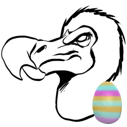 | [Bunny Dodo](https://ark.wiki.gg/wiki/Bunny_Dodo) | 兔耳渡渡鸟 | https://ark.wiki.gg/wiki/Bunny_Dodo | Event Creatures | Dodo |  | `Blueprint'/Game/PrimalEarth/Dinos/Dodo/Dodo_Character_BP_Bunny.Dodo_Character_BP_Bunny'` |
| 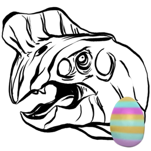 | [Bunny Oviraptor](https://ark.wiki.gg/wiki/Bunny_Oviraptor) | 兔耳窃蛋龙 | https://ark.wiki.gg/wiki/Bunny_Oviraptor | Event Creatures | Ovi |  | `Blueprint'/Game/PrimalEarth/Dinos/Oviraptor/BunnyOviraptor_Character_BP.BunnyOviraptor_Character_BP'` |
|  | [Brontosaurus](https://ark.wiki.gg/wiki/Brontosaurus) | 雷龙 | https://ark.wiki.gg/wiki/Brontosaurus | Dinosaurs | Bronto | Sauropod_Character_BP_C | `Blueprint'/Game/PrimalEarth/Dinos/Sauropod/Sauropod_Character_BP.Sauropod_Character_BP'` |
|  | [Broodmother Lysrix](https://ark.wiki.gg/wiki/Broodmother_Lysrix) | 育母蜘蛛 | https://ark.wiki.gg/wiki/Broodmother_Lysrix | Bosses |  | SpiderL_Character_BP_C | `Blueprint'/Game/PrimalEarth/Dinos/Spider-Large/SpiderL_Character_BP.SpiderL_Character_BP'` |
|  | [Broodmother Lysrix (Alpha)](https://ark.wiki.gg/wiki/Broodmother_Lysrix_(Alpha)) | 育母蜘蛛 (困难) | https://ark.wiki.gg/wiki/Broodmother_Lysrix_(Alpha) | Bosses |  | SpiderL_Character_BP_Hard_C | `Blueprint'/Game/PrimalEarth/Dinos/Spider-Large/SpiderL_Character_BP_Hard.SpiderL_Character_BP_Hard'` |
|  | [Broodmother Lysrix (Beta)](https://ark.wiki.gg/wiki/Broodmother_Lysrix_(Beta)) | 育母蜘蛛 (中等) | https://ark.wiki.gg/wiki/Broodmother_Lysrix_(Beta) | Bosses |  | SpiderL_Character_BP_Medium_C | `Blueprint'/Game/PrimalEarth/Dinos/Spider-Large/SpiderL_Character_BP_Medium.SpiderL_Character_BP_Medium'` |
|  | [Broodmother Lysrix (Gamma)](https://ark.wiki.gg/wiki/Broodmother_Lysrix_(Gamma)) | 育母蜘蛛 (简单) | https://ark.wiki.gg/wiki/Broodmother_Lysrix_(Gamma) | Bosses |  | SpiderL_Character_BP_Easy_C | `Blueprint'/Game/PrimalEarth/Dinos/Spider-Large/SpiderL_Character_BP_Easy.SpiderL_Character_BP_Easy'` |
|  | [Carcharodontosaurus](https://ark.wiki.gg/wiki/Carcharodontosaurus) | 鲨齿龙 | https://ark.wiki.gg/wiki/Carcharodontosaurus | Dinosaurs | Carcha | Carcha_Character_BP_C | `Blueprint'/Game/PrimalEarth/Dinos/Carcharodontosaurus/Carcha_Character_BP.Carcha_Character_BP'` |
|  | [Carbonemys](https://ark.wiki.gg/wiki/Carbonemys) | 碳龟 | https://ark.wiki.gg/wiki/Carbonemys | Reptiles | Turtle | Turtle_Character_BP_C | `Blueprint'/Game/PrimalEarth/Dinos/Turtle/Turtle_Character_BP.Turtle_Character_BP'` |
|  | [Carnotaurus](https://ark.wiki.gg/wiki/Carnotaurus) | 肉食牛龙 | https://ark.wiki.gg/wiki/Carnotaurus | Dinosaurs | Carno | Carno_Character_BP_C | `Blueprint'/Game/PrimalEarth/Dinos/Carno/Carno_Character_BP.Carno_Character_BP'` |
|  | [Castoroides](https://ark.wiki.gg/wiki/Castoroides) | 巨河狸 | https://ark.wiki.gg/wiki/Castoroides | Mammals | Beaver | Beaver_Character_BP_C | `Blueprint'/Game/PrimalEarth/Dinos/Beaver/Beaver_Character_BP.Beaver_Character_BP'` |
|  | [Cat](https://ark.wiki.gg/wiki/Cat) | 猫 | https://ark.wiki.gg/wiki/Cat | Mammals | Cat | Cat_Character_BP_C | `Blueprint'/Game/ASA/Dinos/Cat/Cat_Character_BP.Cat_Character_BP'` |
|  | [Ceratosaurus](https://ark.wiki.gg/wiki/Ceratosaurus) | 角鼻龙 | https://ark.wiki.gg/wiki/Ceratosaurus | Dinosaurs | CeratosaurusAA | Ceratosaurus_Character_BP_ASA_C | `Blueprint'/Game/ASA/Dinos/Ceratosaurus/Dinos/Ceratosaurus_Character_BP_ASA.Ceratosaurus_Character_BP_ASA'` |
|  | [Chalicotherium](https://ark.wiki.gg/wiki/Chalicotherium) | 爪兽 | https://ark.wiki.gg/wiki/Chalicotherium | Mammals | Chalicotherium | Chalico_Character_BP_C | `Blueprint'/Game/PrimalEarth/Dinos/Chalicotherium/Chalico_Character_BP.Chalico_Character_BP'` |
|  | [Cnidaria](https://ark.wiki.gg/wiki/Cnidaria) | 水母 | https://ark.wiki.gg/wiki/Cnidaria | Invertebrates | Cnidaria | Cnidaria_Character_BP_C | `Blueprint'/Game/PrimalEarth/Dinos/Cnidaria/Cnidaria_Character_BP.Cnidaria_Character_BP'` |
|  | [Coelacanth](https://ark.wiki.gg/wiki/Coelacanth) | 腔棘鱼 | https://ark.wiki.gg/wiki/Coelacanth | Fish | Coel | Coel_Character_BP_C | `Blueprint'/Game/PrimalEarth/Dinos/Coelacanth/Coel_Character_BP.Coel_Character_BP'` |
|  | [Compy](https://ark.wiki.gg/wiki/Compy) | 美颌龙 | https://ark.wiki.gg/wiki/Compy | Dinosaurs | Compy | Compy_Character_BP_C | `Blueprint'/Game/PrimalEarth/Dinos/Compy/Compy_Character_BP.Compy_Character_BP'` |
|  | [Daeodon](https://ark.wiki.gg/wiki/Daeodon) | 凶齿豨 | https://ark.wiki.gg/wiki/Daeodon | Mammals | Daeodon | Daeodon_Character_BP_C | `Blueprint'/Game/PrimalEarth/Dinos/Daeodon/Daeodon_Character_BP.Daeodon_Character_BP'` |
|  | [Deinosuchus](https://ark.wiki.gg/wiki/Deinosuchus) | 恐鳄 | https://ark.wiki.gg/wiki/Deinosuchus | Reptiles | DeinosuchusAA | Deinosuchusasa_Character_BP_C | `Blueprint'/Game/ASA/Dinos/Deinosuchus/Deinosuchusasa_Character_BP.Deinosuchusasa_Character_BP'` |
| 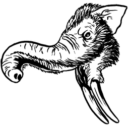 | [Deinotherium](https://ark.wiki.gg/wiki/Deinotherium) | 恐象 | https://ark.wiki.gg/wiki/Deinotherium | Mammals | DeinotheriumASA | DeinotheriumASA_Character_BP_C | `Blueprint'/Game/ASA/Dinos/Deinotherium/Dinos/DeinotheriumASA_Character_BP.DeinotheriumASA_Character_BP'` |
|  | [Dilophosaur](https://ark.wiki.gg/wiki/Dilophosaur) | 双嵴龙 | https://ark.wiki.gg/wiki/Dilophosaur | Dinosaurs | Dilo | Dilo_Character_BP_C | `Blueprint'/Game/PrimalEarth/Dinos/Dilo/Dilo_Character_BP.Dilo_Character_BP'` |
|  | [Dimetrodon](https://ark.wiki.gg/wiki/Dimetrodon) | 异齿龙 | https://ark.wiki.gg/wiki/Dimetrodon | Dinosaurs | Dimetro | Dimetro_Character_BP_C | `Blueprint'/Game/PrimalEarth/Dinos/Dimetrodon/Dimetro_Character_BP.Dimetro_Character_BP'` |
|  | [Dimorphodon](https://ark.wiki.gg/wiki/Dimorphodon) | 双型齿翼龙 | https://ark.wiki.gg/wiki/Dimorphodon | Dinosaurs | Dimorph | Dimorph_Character_BP_C | `Blueprint'/Game/PrimalEarth/Dinos/Dimorphodon/Dimorph_Character_BP.Dimorph_Character_BP'` |
|  | [Diplocaulus](https://ark.wiki.gg/wiki/Diplocaulus) | 盗首螈 | https://ark.wiki.gg/wiki/Diplocaulus | Amphibians | Diplocaulus | Diplocaulus_Character_BP_C | `Blueprint'/Game/PrimalEarth/Dinos/Diplocaulus/Diplocaulus_Character_BP.Diplocaulus_Character_BP'` |
|  | [Diplodocus](https://ark.wiki.gg/wiki/Diplodocus) | 梁龙 | https://ark.wiki.gg/wiki/Diplodocus | Dinosaurs | Diplo | Diplodocus_Character_BP_C | `Blueprint'/Game/PrimalEarth/Dinos/Diplodocus/Diplodocus_Character_BP.Diplodocus_Character_BP'` |
|  | [Dire Bear](https://ark.wiki.gg/wiki/Dire_Bear) | 恐熊 | https://ark.wiki.gg/wiki/Dire_Bear | Mammals | Direbear | Direbear_Character_BP_C | `Blueprint'/Game/PrimalEarth/Dinos/Direbear/Direbear_Character_BP.Direbear_Character_BP'` |
|  | [Direwolf](https://ark.wiki.gg/wiki/Direwolf) | 恐狼 | https://ark.wiki.gg/wiki/Direwolf | Mammals | Direwolf | Direwolf_Character_BP_C | `Blueprint'/Game/PrimalEarth/Dinos/Direwolf/Direwolf_Character_BP.Direwolf_Character_BP'` |
| 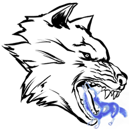 | [Direwolf Ghost](https://ark.wiki.gg/wiki/Direwolf_Ghost) | 幽灵恐狼 | https://ark.wiki.gg/wiki/Direwolf_Ghost | Event Creatures | Direwolf | Ghost_Direwolf_Character_BP_C | `Blueprint'/Game/PrimalEarth/Dinos/Direwolf/Ghost_Direwolf_Character_BP.Ghost_Direwolf_Character_BP'` |
|  | [Dodo](https://ark.wiki.gg/wiki/Dodo) | 渡渡鸟 | https://ark.wiki.gg/wiki/Dodo | Birds | Dodo | Dodo_Character_BP_C | `Blueprint'/Game/PrimalEarth/Dinos/Dodo/Dodo_Character_BP.Dodo_Character_BP'` |
|  | [DodoRex](https://ark.wiki.gg/wiki/DodoRex) | 渡渡霸王龙 | https://ark.wiki.gg/wiki/DodoRex | Event Creatures | DodoRex | DodoRex_Character_BP_C | `Blueprint'/Game/PrimalEarth/Dinos/DodoRex/DodoRex_Character_BP.DodoRex_Character_BP'` |
|  | [Doedicurus](https://ark.wiki.gg/wiki/Doedicurus) | 星尾兽 | https://ark.wiki.gg/wiki/Doedicurus | Mammals | Doed | Doed_Character_BP_C | `Blueprint'/Game/PrimalEarth/Dinos/Doedicurus/Doed_Character_BP.Doed_Character_BP'` |
|  | [Dragon (Gamma)](https://ark.wiki.gg/wiki/Dragon_(Gamma)) | 喷火龙 (简单) | https://ark.wiki.gg/wiki/Dragon_(Gamma) | Bosses |  | Dragon_Character_BP_Boss_Easy_C | `Blueprint'/Game/PrimalEarth/Dinos/Dragon/Dragon_Character_BP_Boss_Easy.Dragon_Character_BP_Boss_Easy'` |
|  | [Dragon (Beta)](https://ark.wiki.gg/wiki/Dragon_(Beta)) | 喷火龙 (中等) | https://ark.wiki.gg/wiki/Dragon_(Beta) | Bosses |  | Dragon_Character_BP_Boss_Medium_C | `Blueprint'/Game/PrimalEarth/Dinos/Dragon/Dragon_Character_BP_Boss_Medium.Dragon_Character_BP_Boss_Medium'` |
|  | [Dragon (Alpha)](https://ark.wiki.gg/wiki/Dragon_(Alpha)) | 喷火龙 (困难) | https://ark.wiki.gg/wiki/Dragon_(Alpha) | Bosses |  | Dragon_Character_BP_Boss_Hard_C | `Blueprint'/Game/PrimalEarth/Dinos/Dragon/Dragon_Character_BP_Boss_Hard.Dragon_Character_BP_Boss_Hard'` |
|  | [Dung Beetle](https://ark.wiki.gg/wiki/Dung_Beetle) | 蜣螂 | https://ark.wiki.gg/wiki/Dung_Beetle | Invertebrates | Beetle | DungBeetle_Character_BP_C | `Blueprint'/Game/PrimalEarth/Dinos/DungBeetle/DungBeetle_Character_BP.DungBeetle_Character_BP'` |
|  | [Dunkleosteus](https://ark.wiki.gg/wiki/Dunkleosteus) | 邓氏鱼 | https://ark.wiki.gg/wiki/Dunkleosteus | Fish | Dunkle | Dunkle_Character_BP_C | `Blueprint'/Game/PrimalEarth/Dinos/Dunkleosteus/Dunkle_Character_BP.Dunkle_Character_BP'` |
|  | [Electrophorus](https://ark.wiki.gg/wiki/Electrophorus) | 电鳗 | https://ark.wiki.gg/wiki/Electrophorus | Fish | Eel | Eel_Character_BP_C | `Blueprint'/Game/PrimalEarth/Dinos/Eel/Eel_Character_BP.Eel_Character_BP'` |
|  | [Equus](https://ark.wiki.gg/wiki/Equus) | 庞马 | https://ark.wiki.gg/wiki/Equus | Mammals | Equus | Equus_Character_BP_C | `Blueprint'/Game/PrimalEarth/Dinos/Equus/Equus_Character_BP.Equus_Character_BP'` |
| 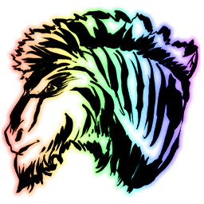 | [Unicorn](https://ark.wiki.gg/wiki/Unicorn) | 独角兽 | https://ark.wiki.gg/wiki/Unicorn | Mammals | Equus | Equus_Character_BP_Unicorn_C | `Blueprint'/Game/PrimalEarth/Dinos/Equus/Equus_Character_BP_Unicorn.Equus_Character_BP_Unicorn'` |
|  | [Eurypterid](https://ark.wiki.gg/wiki/Eurypterid) | 广翅鲎 | https://ark.wiki.gg/wiki/Eurypterid | Invertebrates | Euryp | Euryp_Character_C | `Blueprint'/Game/PrimalEarth/Dinos/Eurypterid/Euryp_Character.Euryp_Character'` |
|  | [Gallimimus](https://ark.wiki.gg/wiki/Gallimimus) | 似鸡龙 | https://ark.wiki.gg/wiki/Gallimimus | Dinosaurs | Galli | Galli_Character_BP_C | `Blueprint'/Game/PrimalEarth/Dinos/Gallimimus/Galli_Character_BP.Galli_Character_BP'` |
|  | [Giant Bee](https://ark.wiki.gg/wiki/Giant_Bee) | 巨型蜜蜂 | https://ark.wiki.gg/wiki/Giant_Bee | Invertebrates | Bee | Bee_Character_BP_C | `Blueprint'/Game/PrimalEarth/Dinos/Bee/Bee_Character_BP.Bee_Character_BP'` |
|  | [Giganotosaurus](https://ark.wiki.gg/wiki/Giganotosaurus) | 南方巨兽龙 | https://ark.wiki.gg/wiki/Giganotosaurus | Dinosaurs | Gigant | Gigant_Character_BP_C | `Blueprint'/Game/PrimalEarth/Dinos/Giganotosaurus/Gigant_Character_BP.Gigant_Character_BP'` |
|  | [Gigantopithecus](https://ark.wiki.gg/wiki/Gigantopithecus) | 巨猿 | https://ark.wiki.gg/wiki/Gigantopithecus | Mammals | Bigfoot | Bigfoot_Character_BP_C | `Blueprint'/Game/PrimalEarth/Dinos/Bigfoot/Bigfoot_Character_BP.Bigfoot_Character_BP'` |
|  | [Gigantoraptor](https://ark.wiki.gg/wiki/Gigantoraptor) | 巨盗龙 | https://ark.wiki.gg/wiki/Gigantoraptor | Dinosaurs | Gigantoraptor | Gigantoraptor_Character_BP_C | `Blueprint'/Game/ASA/Dinos/Gigantoraptor/Gigantoraptor_Character_BP.Gigantoraptor_Character_BP'` |
| 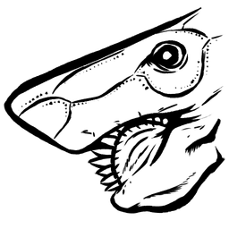 | [Helicoprion](https://ark.wiki.gg/wiki/Helicoprion) | 旋齿鲨 | https://ark.wiki.gg/wiki/Helicoprion | Fish | Helicoprion | Helicoprion_Character_BP_C | `Blueprint'/Game/ASA/Dinos/Helicoprion/Helicoprion_Character_BP.Helicoprion_Character_BP'` |
|  | [Hesperornis](https://ark.wiki.gg/wiki/Hesperornis) | 黄昏鸟 | https://ark.wiki.gg/wiki/Hesperornis | Birds | Hesperornis | Hesperornis_Character_BP_C | `Blueprint'/Game/PrimalEarth/Dinos/Hesperornis/Hesperornis_Character_BP.Hesperornis_Character_BP'` |
|  | [Human (Male)](https://ark.wiki.gg/wiki/Human_(Male)) |  | https://ark.wiki.gg/wiki/Human_(Male) | Mammals |  |  | `Blueprint'/Game/PrimalEarth/CoreBlueprints/PlayerPawnTest_Male.PlayerPawnTest_Male'` |
|  | [Human (Female)](https://ark.wiki.gg/wiki/Human_(Female)) |  | https://ark.wiki.gg/wiki/Human_(Female) | Mammals |  |  | `Blueprint'/Game/PrimalEarth/CoreBlueprints/PlayerPawnTest_Female.PlayerPawnTest_Female'` |
|  | [Hyaenodon](https://ark.wiki.gg/wiki/Hyaenodon) | 鬣齿兽 | https://ark.wiki.gg/wiki/Hyaenodon | Mammals | Hyaenodon | Hyaenodon_Character_BP_C | `Blueprint'/Game/PrimalEarth/Dinos/Hyaenodon/Hyaenodon_Character_BP.Hyaenodon_Character_BP'` |
|  | [Ichthyornis](https://ark.wiki.gg/wiki/Ichthyornis) | 鱼鸟 | https://ark.wiki.gg/wiki/Ichthyornis | Birds | Ichthyornis | Ichthyornis_Character_BP_C | `Blueprint'/Game/PrimalEarth/Dinos/Ichthyornis/Ichthyornis_Character_BP.Ichthyornis_Character_BP'` |
|  | [Ichthyosaurus](https://ark.wiki.gg/wiki/Ichthyosaurus) | 鱼龙 | https://ark.wiki.gg/wiki/Ichthyosaurus | Reptiles | Dolphin | Dolphin_Character_BP_C | `Blueprint'/Game/PrimalEarth/Dinos/Dolphin/Dolphin_Character_BP.Dolphin_Character_BP'` |
|  | [Iguanodon](https://ark.wiki.gg/wiki/Iguanodon) | 禽龙 | https://ark.wiki.gg/wiki/Iguanodon | Dinosaurs | Iguanodon | Iguanodon_Character_BP_C | `Blueprint'/Game/PrimalEarth/Dinos/Iguanodon/Iguanodon_Character_BP.Iguanodon_Character_BP'` |
|  | [Kairuku](https://ark.wiki.gg/wiki/Kairuku) | 潜觅企鹅 | https://ark.wiki.gg/wiki/Kairuku | Birds | Kairu | Kairuku_Character_BP_C | `Blueprint'/Game/PrimalEarth/Dinos/Kairuku/Kairuku_Character_BP.Kairuku_Character_BP'` |
|  | [Kaprosuchus](https://ark.wiki.gg/wiki/Kaprosuchus) | 猪鳄 | https://ark.wiki.gg/wiki/Kaprosuchus | Reptiles | Kaprosuchus | Kaprosuchus_Character_BP_C | `Blueprint'/Game/PrimalEarth/Dinos/Kaprosuchus/Kaprosuchus_Character_BP.Kaprosuchus_Character_BP'` |
|  | [Kentrosaurus](https://ark.wiki.gg/wiki/Kentrosaurus) | 钉状龙 | https://ark.wiki.gg/wiki/Kentrosaurus | Dinosaurs | Kentro | Kentro_Character_BP_C | `Blueprint'/Game/PrimalEarth/Dinos/Kentrosaurus/Kentro_Character_BP.Kentro_Character_BP'` |
|  | [Leech](https://ark.wiki.gg/wiki/Leech) | 水蛭 | https://ark.wiki.gg/wiki/Leech | Invertebrates | Leech | Leech_Character_C | `Blueprint'/Game/PrimalEarth/Dinos/Leech/Leech_Character.Leech_Character'` |
|  | [Diseased Leech](https://ark.wiki.gg/wiki/Diseased_Leech) | 病变水蛭 | https://ark.wiki.gg/wiki/Diseased_Leech | Invertebrates | Leech | Leech_Character_Diseased_C | `Blueprint'/Game/PrimalEarth/Dinos/Leech/Leech_Character_Diseased.Leech_Character_Diseased'` |
|  | [Leedsichthys](https://ark.wiki.gg/wiki/Leedsichthys) | 利兹鱼 | https://ark.wiki.gg/wiki/Leedsichthys | Fish | Leedsichthys | Leedsichthys_Character_BP_C | `Blueprint'/Game/PrimalEarth/Dinos/Leedsichthys/Leedsichthys_Character_BP.Leedsichthys_Character_BP'` |
|  | [Liopleurodon](https://ark.wiki.gg/wiki/Liopleurodon) | 滑齿龙 | https://ark.wiki.gg/wiki/Liopleurodon | Reptiles | Liopleurodon | Liopleurodon_Character_BP_C | `Blueprint'/Game/PrimalEarth/Dinos/Liopleurodon/Liopleurodon_Character_BP.Liopleurodon_Character_BP'` |
|  | [Lystrosaurus](https://ark.wiki.gg/wiki/Lystrosaurus) | 水龙兽 | https://ark.wiki.gg/wiki/Lystrosaurus | Dinosaurs | Lystro | Lystro_Character_BP_C | `Blueprint'/Game/PrimalEarth/Dinos/Lystrosaurus/Lystro_Character_BP.Lystro_Character_BP'` |
|  | [Mammoth](https://ark.wiki.gg/wiki/Mammoth) | 猛犸象 | https://ark.wiki.gg/wiki/Mammoth | Mammals | Mammoth | Mammoth_Character_BP_C | `Blueprint'/Game/PrimalEarth/Dinos/Mammoth/Mammoth_Character_BP.Mammoth_Character_BP'` |
|  | [Manta](https://ark.wiki.gg/wiki/Manta) | 蝠鲼 | https://ark.wiki.gg/wiki/Manta | Fish | Manta | Manta_Character_BP_C | `Blueprint'/Game/PrimalEarth/Dinos/Manta/Manta_Character_BP.Manta_Character_BP'` |
|  | [Megalania](https://ark.wiki.gg/wiki/Megalania) | 古巨蜥 | https://ark.wiki.gg/wiki/Megalania | Reptiles | Megalania | Megalania_Character_BP_C | `Blueprint'/Game/PrimalEarth/Dinos/Megalania/Megalania_Character_BP.Megalania_Character_BP'` |
|  | [Megaloceros](https://ark.wiki.gg/wiki/Megaloceros) | 大角鹿 | https://ark.wiki.gg/wiki/Megaloceros | Mammals | Stag | Stag_Character_BP_C | `Blueprint'/Game/PrimalEarth/Dinos/Stag/Stag_Character_BP.Stag_Character_BP'` |
|  | [Megalodon](https://ark.wiki.gg/wiki/Megalodon) | 巨齿鲨 | https://ark.wiki.gg/wiki/Megalodon | Fish | Mega | Megalodon_Character_BP_C | `Blueprint'/Game/PrimalEarth/Dinos/Megalodon/Megalodon_Character_BP.Megalodon_Character_BP'` |
|  | [Megalosaurus](https://ark.wiki.gg/wiki/Megalosaurus) | 巨齿龙 | https://ark.wiki.gg/wiki/Megalosaurus | Dinosaurs | Megalosaurus | Megalosaurus_Character_BP_C | `Blueprint'/Game/PrimalEarth/Dinos/Megalosaurus/Megalosaurus_Character_BP.Megalosaurus_Character_BP'` |
|  | [Meganeura](https://ark.wiki.gg/wiki/Meganeura) | 巨脉蜻蜓 | https://ark.wiki.gg/wiki/Meganeura | Invertebrates | Dragonfly | Dragonfly_Character_BP_C | `Blueprint'/Game/PrimalEarth/Dinos/Dragonfly/Dragonfly_Character_BP.Dragonfly_Character_BP'` |
|  | [Megapithecus](https://ark.wiki.gg/wiki/Megapithecus) | 银背金刚 | https://ark.wiki.gg/wiki/Megapithecus | Bosses |  | Gorilla_Character_BP_C | `Blueprint'/Game/PrimalEarth/Dinos/Gorilla/Gorilla_Character_BP.Gorilla_Character_BP'` |
|  | [Megapithecus (Alpha)](https://ark.wiki.gg/wiki/Megapithecus_(Alpha)) | 银背金刚 (困难) | https://ark.wiki.gg/wiki/Megapithecus_(Alpha) | Bosses |  | Gorilla_Character_BP_Hard_C | `Blueprint'/Game/PrimalEarth/Dinos/Gorilla/Gorilla_Character_BP_Hard.Gorilla_Character_BP_Hard'` |
|  | [Megapithecus (Beta)](https://ark.wiki.gg/wiki/Megapithecus_(Beta)) | 银背金刚 (中等) | https://ark.wiki.gg/wiki/Megapithecus_(Beta) | Bosses |  | Gorilla_Character_BP_Medium_C | `Blueprint'/Game/PrimalEarth/Dinos/Gorilla/Gorilla_Character_BP_Medium.Gorilla_Character_BP_Medium'` |
|  | [Megapithecus (Gamma)](https://ark.wiki.gg/wiki/Megapithecus_(Gamma)) | 银背金刚 (简单) | https://ark.wiki.gg/wiki/Megapithecus_(Gamma) | Bosses |  | Gorilla_Character_BP_Easy_C | `Blueprint'/Game/PrimalEarth/Dinos/Gorilla/Gorilla_Character_BP_Easy.Gorilla_Character_BP_Easy'` |
|  | [Megatherium](https://ark.wiki.gg/wiki/Megatherium) | 大地懒 | https://ark.wiki.gg/wiki/Megatherium | Mammals | Megatherium | Megatherium_Character_BP_C | `Blueprint'/Game/PrimalEarth/Dinos/Megatherium/Megatherium_Character_BP.Megatherium_Character_BP'` |
|  | [Mesopithecus](https://ark.wiki.gg/wiki/Mesopithecus) | 中猴 | https://ark.wiki.gg/wiki/Mesopithecus | Mammals | Monkey | Monkey_Character_BP_C | `Blueprint'/Game/PrimalEarth/Dinos/Monkey/Monkey_Character_BP.Monkey_Character_BP'` |
|  | [Microraptor](https://ark.wiki.gg/wiki/Microraptor) | 小盗龙 | https://ark.wiki.gg/wiki/Microraptor | Dinosaurs | Microraptor | Microraptor_Character_BP_C | `Blueprint'/Game/PrimalEarth/Dinos/Microraptor/Microraptor_Character_BP.Microraptor_Character_BP'` |
|  | [Mosasaurus](https://ark.wiki.gg/wiki/Mosasaurus) | 沧龙 | https://ark.wiki.gg/wiki/Mosasaurus | Reptiles | Mosasaur | Mosa_Character_BP_C | `Blueprint'/Game/PrimalEarth/Dinos/Mosasaurus/Mosa_Character_BP.Mosa_Character_BP'` |
|  | [Moschops](https://ark.wiki.gg/wiki/Moschops) | 麝足兽 | https://ark.wiki.gg/wiki/Moschops | Dinosaurs | Moschops | Moschops_Character_BP_C | `Blueprint'/Game/PrimalEarth/Dinos/Moschops/Moschops_Character_BP.Moschops_Character_BP'` |
|  | [Onyc](https://ark.wiki.gg/wiki/Onyc) | 爪蝠 | https://ark.wiki.gg/wiki/Onyc | Mammals | Bat | Bat_Character_BP_C | `Blueprint'/Game/PrimalEarth/Dinos/Bat/Bat_Character_BP.Bat_Character_BP'` |
|  | [Otter](https://ark.wiki.gg/wiki/Otter) | 水獭 | https://ark.wiki.gg/wiki/Otter | Mammals | Otter | Otter_Character_BP_C | `Blueprint'/Game/PrimalEarth/Dinos/Otter/Otter_Character_BP.Otter_Character_BP'` |
|  | [Oviraptor](https://ark.wiki.gg/wiki/Oviraptor) | 窃蛋龙 | https://ark.wiki.gg/wiki/Oviraptor | Dinosaurs | Ovi | Oviraptor_Character_BP_C | `Blueprint'/Game/PrimalEarth/Dinos/Oviraptor/Oviraptor_Character_BP.Oviraptor_Character_BP'` |
|  | [Overseer](https://ark.wiki.gg/wiki/Overseer) | 监察者 | https://ark.wiki.gg/wiki/Overseer | Bosses |  | EndBoss_Character_C | `Blueprint'/Game/EndGame/Dinos/Endboss/EndBoss_Character.EndBoss_Character'` |
|  | [Overseer (Alpha)](https://ark.wiki.gg/wiki/Overseer_(Alpha)) | 监察者(困难) | https://ark.wiki.gg/wiki/Overseer_(Alpha) | Bosses |  | EndBoss_Character_Hard_C | `Blueprint'/Game/EndGame/Dinos/Endboss/EndBoss_Character_Hard.EndBoss_Character_Hard'` |
|  | [Overseer (Beta)](https://ark.wiki.gg/wiki/Overseer_(Beta)) | 监察者(普通) | https://ark.wiki.gg/wiki/Overseer_(Beta) | Bosses |  | EndBoss_Character_Medium_C | `Blueprint'/Game/EndGame/Dinos/Endboss/EndBoss_Character_Medium.EndBoss_Character_Medium'` |
|  | [Overseer (Gamma)](https://ark.wiki.gg/wiki/Overseer_(Gamma)) | 监察者(简单) | https://ark.wiki.gg/wiki/Overseer_(Gamma) | Bosses |  | EndBoss_Character_Easy_C | `Blueprint'/Game/EndGame/Dinos/Endboss/EndBoss_Character_Easy.EndBoss_Character_Easy'` |
|  | [Ovis](https://ark.wiki.gg/wiki/Ovis) | 绵羊 | https://ark.wiki.gg/wiki/Ovis | Mammals | Sheep | Sheep_Character_BP_C | `Blueprint'/Game/PrimalEarth/Dinos/Sheep/Sheep_Character_BP.Sheep_Character_BP'` |
|  | [Pachy](https://ark.wiki.gg/wiki/Pachy) | 肿头龙 | https://ark.wiki.gg/wiki/Pachy | Dinosaurs | Pachy | Pachy_Character_BP_C | `Blueprint'/Game/PrimalEarth/Dinos/Pachy/Pachy_Character_BP.Pachy_Character_BP'` |
|  | [Pachyrhinosaurus](https://ark.wiki.gg/wiki/Pachyrhinosaurus) | 厚鼻龙 | https://ark.wiki.gg/wiki/Pachyrhinosaurus | Dinosaurs | Pachyrhinosaurus | Pachyrhino_Character_BP_C | `Blueprint'/Game/PrimalEarth/Dinos/Pachyrhinosaurus/Pachyrhino_Character_BP.Pachyrhino_Character_BP'` |
|  | [Paraceratherium](https://ark.wiki.gg/wiki/Paraceratherium) | 巨犀 | https://ark.wiki.gg/wiki/Paraceratherium | Mammals | Paracer | Paracer_Character_BP_C | `Blueprint'/Game/PrimalEarth/Dinos/Paraceratherium/Paracer_Character_BP.Paracer_Character_BP'` |
|  | [Parasaur](https://ark.wiki.gg/wiki/Parasaur) | 副栉龙 | https://ark.wiki.gg/wiki/Parasaur | Dinosaurs | Para | Para_Character_BP_C | `Blueprint'/Game/PrimalEarth/Dinos/Para/Para_Character_BP.Para_Character_BP'` |
|  | [Pegomastax](https://ark.wiki.gg/wiki/Pegomastax) | 双坚颌龙 | https://ark.wiki.gg/wiki/Pegomastax | Dinosaurs | Pegomastax | Pegomastax_Character_BP_C | `Blueprint'/Game/PrimalEarth/Dinos/Pegomastax/Pegomastax_Character_BP.Pegomastax_Character_BP'` |
|  | [Pelagornis](https://ark.wiki.gg/wiki/Pelagornis) | 伪齿鸟 | https://ark.wiki.gg/wiki/Pelagornis | Birds | Pela | Pela_Character_BP_C | `Blueprint'/Game/PrimalEarth/Dinos/Pelagornis/Pela_Character_BP.Pela_Character_BP'` |
|  | [Phiomia](https://ark.wiki.gg/wiki/Phiomia) | 法尤姆象 | https://ark.wiki.gg/wiki/Phiomia | Mammals | Phiomia | Phiomia_Character_BP_C | `Blueprint'/Game/PrimalEarth/Dinos/Phiomia/Phiomia_Character_BP.Phiomia_Character_BP'` |
|  | [Piranha](https://ark.wiki.gg/wiki/Piranha) | 食人鱼 | https://ark.wiki.gg/wiki/Piranha | Fish | Piranha | Piranha_Character_BP_C | `Blueprint'/Game/PrimalEarth/Dinos/Piranha/Piranha_Character_BP.Piranha_Character_BP'` |
|  | [Plesiosaur](https://ark.wiki.gg/wiki/Plesiosaur) | 蛇颈龙 | https://ark.wiki.gg/wiki/Plesiosaur | Reptiles | Plesiosaur | Plesiosaur_Character_BP_C | `Blueprint'/Game/PrimalEarth/Dinos/Plesiosaur/Plesiosaur_Character_BP.Plesiosaur_Character_BP'` |
|  | [Procoptodon](https://ark.wiki.gg/wiki/Procoptodon) | 短面袋鼠 | https://ark.wiki.gg/wiki/Procoptodon | Mammals | Kangaroo | Procoptodon_Character_BP_C | `Blueprint'/Game/PrimalEarth/Dinos/Procoptodon/Procoptodon_Character_BP.Procoptodon_Character_BP'` |
|  | [Pteranodon](https://ark.wiki.gg/wiki/Pteranodon) | 无齿翼龙 | https://ark.wiki.gg/wiki/Pteranodon | Dinosaurs | Ptera | Ptero_Character_BP_C | `Blueprint'/Game/PrimalEarth/Dinos/Ptero/Ptero_Character_BP.Ptero_Character_BP'` |
|  | [Pulmonoscorpius](https://ark.wiki.gg/wiki/Pulmonoscorpius) | 肺蝎 | https://ark.wiki.gg/wiki/Pulmonoscorpius | Invertebrates | Scorpion | Scorpion_Character_BP_C | `Blueprint'/Game/PrimalEarth/Dinos/Scorpion/Scorpion_Character_BP.Scorpion_Character_BP'` |
|  | [Purlovia](https://ark.wiki.gg/wiki/Purlovia) | 普雷兽 | https://ark.wiki.gg/wiki/Purlovia | Synapsids | Purlovia | Purlovia_Character_BP_C | `Blueprint'/Game/PrimalEarth/Dinos/Purlovia/Purlovia_Character_BP.Purlovia_Character_BP'` |
|  | [Quetzal](https://ark.wiki.gg/wiki/Quetzal) | 风神翼龙 | https://ark.wiki.gg/wiki/Quetzal | Reptiles | Quetz | Quetz_Character_BP_C | `Blueprint'/Game/PrimalEarth/Dinos/Quetzalcoatlus/Quetz_Character_BP.Quetz_Character_BP'` |
|  | [Raptor](https://ark.wiki.gg/wiki/Raptor) | 迅猛龙 | https://ark.wiki.gg/wiki/Raptor | Dinosaurs | Raptor | Raptor_Character_BP_C | `Blueprint'/Game/PrimalEarth/Dinos/Raptor/Raptor_Character_BP.Raptor_Character_BP'` |
|  | [Rex](https://ark.wiki.gg/wiki/Rex) | 霸王龙 | https://ark.wiki.gg/wiki/Rex | Dinosaurs | Rex | Rex_Character_BP_C | `Blueprint'/Game/PrimalEarth/Dinos/Rex/Rex_Character_BP.Rex_Character_BP'` |
| 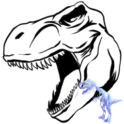 | [Rex Ghost](https://ark.wiki.gg/wiki/Rex_Ghost) | 幽灵霸王龙 | https://ark.wiki.gg/wiki/Rex_Ghost | Event Creatures | Rex | Ghost_Rex_Character_BP_C | `Blueprint'/Game/PrimalEarth/Dinos/Rex/Ghost_Rex_Character_BP.Ghost_Rex_Character_BP'` |
|  | [Rhyniognatha](https://ark.wiki.gg/wiki/Rhyniognatha) | 莱尼颚虫 | https://ark.wiki.gg/wiki/Rhyniognatha | Invertebrates | Rhynio | Rhynio_Character_BP_C | `Blueprint'/Game/PrimalEarth/Dinos/Rhyniognatha/Rhynio_Character_BP.Rhynio_Character_BP'` |
|  | [Sabertooth](https://ark.wiki.gg/wiki/Sabertooth) | 刃齿虎 | https://ark.wiki.gg/wiki/Sabertooth | Mammals | Sabertooth | Saber_Character_BP_C | `Blueprint'/Game/PrimalEarth/Dinos/Saber/Saber_Character_BP.Saber_Character_BP'` |
|  | [Sabertooth Salmon](https://ark.wiki.gg/wiki/Sabertooth_Salmon) | 剑齿鲑鱼 | https://ark.wiki.gg/wiki/Sabertooth_Salmon | Fish | Salmon | Salmon_Character_BP_C | `Blueprint'/Game/PrimalEarth/Dinos/Salmon/Salmon_Character_BP.Salmon_Character_BP'` |
|  | [Sarco](https://ark.wiki.gg/wiki/Sarco) | 帝鳄 | https://ark.wiki.gg/wiki/Sarco | Reptiles | Sarco | Sarco_Character_BP_C | `Blueprint'/Game/PrimalEarth/Dinos/Sarco/Sarco_Character_BP.Sarco_Character_BP'` |
| 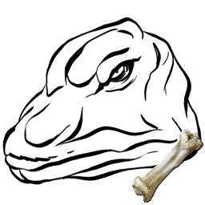 | [Skeletal Bronto](https://ark.wiki.gg/wiki/Skeletal_Bronto) | 骨架雷龙 | https://ark.wiki.gg/wiki/Skeletal_Bronto | Event Creatures | Bronto | Bone_Sauropod_Character_BP_C | `Blueprint'/Game/PrimalEarth/Dinos/Sauropod/Bone_Sauropod_Character_BP.Bone_Sauropod_Character_BP'` |
| 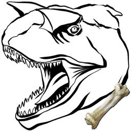 | [Skeletal Carnotaurus](https://ark.wiki.gg/wiki/Skeletal_Carnotaurus) | 骨架肉食牛龙 | https://ark.wiki.gg/wiki/Skeletal_Carnotaurus | Event Creatures | Elite Carno | Bone_MegaCarno_Character_BP_C | `Blueprint'/Game/PrimalEarth/Dinos/Carno/Bone_MegaCarno_Character_BP.Bone_MegaCarno_Character_BP'` |
| 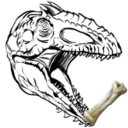 | [Skeletal Giganotosaurus](https://ark.wiki.gg/wiki/Skeletal_Giganotosaurus) | 骨架南方巨兽龙 | https://ark.wiki.gg/wiki/Skeletal_Giganotosaurus | Event Creatures | Gigant | Bone_Gigant_Character_BP_C | `Blueprint'/Game/PrimalEarth/Dinos/Giganotosaurus/Bone_Gigant_Character_BP.Bone_Gigant_Character_BP'` |
| 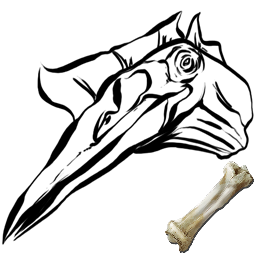 | [Skeletal Quetzal](https://ark.wiki.gg/wiki/Skeletal_Quetzal) | 骨架风神翼龙 | https://ark.wiki.gg/wiki/Skeletal_Quetzal | Event Creatures | Quetz | Bone_Quetz_Character_BP_C | `Blueprint'/Game/PrimalEarth/Dinos/Quetzalcoatlus/Bone_Quetz_Character_BP.Bone_Quetz_Character_BP'` |
| 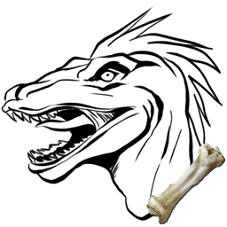 | [Skeletal Raptor](https://ark.wiki.gg/wiki/Skeletal_Raptor) | 骨架迅猛龙 | https://ark.wiki.gg/wiki/Skeletal_Raptor | Event Creatures | Bone Raptor | Bone_MegaRaptor_Character_BP_C | `Blueprint'/Game/PrimalEarth/Dinos/Raptor/Bone_MegaRaptor_Character_BP.Bone_MegaRaptor_Character_BP'` |
| 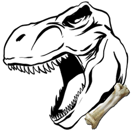 | [Skeletal Rex](https://ark.wiki.gg/wiki/Skeletal_Rex) | 骨架霸王龙 | https://ark.wiki.gg/wiki/Skeletal_Rex | Event Creatures | Bone Rex | Bone_MegaRex_Character_BP_C | `Blueprint'/Game/PrimalEarth/Dinos/Rex/Bone_MegaRex_Character_BP.Bone_MegaRex_Character_BP'` |
| 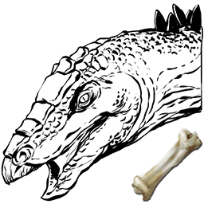 | [Skeletal Stego](https://ark.wiki.gg/wiki/Skeletal_Stego) | 骨架剑龙 | https://ark.wiki.gg/wiki/Skeletal_Stego | Event Creatures | Stego | Bone_Stego_Character_BP_C | `Blueprint'/Game/PrimalEarth/Dinos/Stego/Bone_Stego_Character_BP.Bone_Stego_Character_BP'` |
| 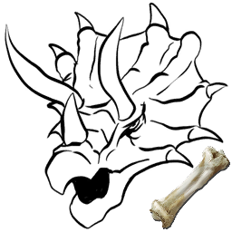 | [Skeletal Trike](https://ark.wiki.gg/wiki/Skeletal_Trike) | 骨架三角龙 | https://ark.wiki.gg/wiki/Skeletal_Trike | Event Creatures | Trike | Bone_Trike_Character_BP_C | `Blueprint'/Game/PrimalEarth/Dinos/Trike/Bone_Trike_Character_BP.Bone_Trike_Character_BP'` |
|  | [Spino](https://ark.wiki.gg/wiki/Spino) | 棘龙 | https://ark.wiki.gg/wiki/Spino | Dinosaurs | Spino | Spino_Character_BP_C | `Blueprint'/Game/PrimalEarth/Dinos/Spino/Spino_Character_BP.Spino_Character_BP'` |
|  | [Stegosaurus](https://ark.wiki.gg/wiki/Stegosaurus) | 剑龙 | https://ark.wiki.gg/wiki/Stegosaurus | Dinosaurs | Stego | Stego_Character_BP_C | `Blueprint'/Game/PrimalEarth/Dinos/Stego/Stego_Character_BP.Stego_Character_BP'` |
|  | [Tapejara](https://ark.wiki.gg/wiki/Tapejara) | 古神翼龙 | https://ark.wiki.gg/wiki/Tapejara | Reptiles | Tapejara | Tapejara_Character_BP_C | `Blueprint'/Game/PrimalEarth/Dinos/Tapejara/Tapejara_Character_BP.Tapejara_Character_BP'` |
|  | [Tek Parasaur](https://ark.wiki.gg/wiki/Tek_Parasaur) | 泰克副栉龙 | https://ark.wiki.gg/wiki/Tek_Parasaur | Tek Creatures | Para | BionicPara_Character_BP_C | `Blueprint'/Game/PrimalEarth/Dinos/Para/BionicPara_Character_BP.BionicPara_Character_BP'` |
|  | [Tek Quetzal](https://ark.wiki.gg/wiki/Tek_Quetzal) | 泰克风神翼龙 | https://ark.wiki.gg/wiki/Tek_Quetzal | Tek Creatures | Quetz | BionicQuetz_Character_BP_C | `Blueprint'/Game/PrimalEarth/Dinos/Quetzalcoatlus/BionicQuetz_Character_BP.BionicQuetz_Character_BP'` |
|  | [Tek Raptor](https://ark.wiki.gg/wiki/Tek_Raptor) | 泰克迅猛龙 | https://ark.wiki.gg/wiki/Tek_Raptor | Tek Creatures | Raptor | BionicRaptor_Character_BP_C | `Blueprint'/Game/PrimalEarth/Dinos/Raptor/BionicRaptor_Character_BP.BionicRaptor_Character_BP'` |
|  | [Tek Rex](https://ark.wiki.gg/wiki/Tek_Rex) | 泰克霸王龙 | https://ark.wiki.gg/wiki/Tek_Rex | Tek Creatures | Rex | BionicRex_Character_BP_C | `Blueprint'/Game/PrimalEarth/Dinos/Rex/BionicRex_Character_BP.BionicRex_Character_BP'` |
|  | [Tek Stegosaurus](https://ark.wiki.gg/wiki/Tek_Stegosaurus) | 泰克剑龙 | https://ark.wiki.gg/wiki/Tek_Stegosaurus | Tek Creatures | Stego | BionicStego_Character_BP_C | `Blueprint'/Game/PrimalEarth/Dinos/Stego/BionicStego_Character_BP.BionicStego_Character_BP'` |
|  | [Terror Bird](https://ark.wiki.gg/wiki/Terror_Bird) | 骇鸟 | https://ark.wiki.gg/wiki/Terror_Bird | Birds | TerrorBird | TerrorBird_Character_BP_C | `Blueprint'/Game/PrimalEarth/Dinos/TerrorBird/TerrorBird_Character_BP.TerrorBird_Character_BP'` |
|  | [Therizinosaur](https://ark.wiki.gg/wiki/Therizinosaur) | 镰刀龙 | https://ark.wiki.gg/wiki/Therizinosaur | Dinosaurs | Therizinosaurus | Therizino_Character_BP_C | `Blueprint'/Game/PrimalEarth/Dinos/Therizinosaurus/Therizino_Character_BP.Therizino_Character_BP'` |
|  | [Thylacoleo](https://ark.wiki.gg/wiki/Thylacoleo) | 袋狮 | https://ark.wiki.gg/wiki/Thylacoleo | Mammals | Thylacoleo | Thylacoleo_Character_BP_C | `Blueprint'/Game/PrimalEarth/Dinos/Thylacoleo/Thylacoleo_Character_BP.Thylacoleo_Character_BP'` |
|  | [Titanoboa](https://ark.wiki.gg/wiki/Titanoboa) | 泰坦蚺 | https://ark.wiki.gg/wiki/Titanoboa | Reptiles | TitanBoa | BoaFrill_Character_BP_C | `Blueprint'/Game/PrimalEarth/Dinos/BoaFrill/BoaFrill_Character_BP.BoaFrill_Character_BP'` |
|  | [Titanomyrma](https://ark.wiki.gg/wiki/Titanomyrma) | 泰坦蚁 | https://ark.wiki.gg/wiki/Titanomyrma | Invertebrates | Ant | Ant_Character_BP_C | `Blueprint'/Game/PrimalEarth/Dinos/Ant/Ant_Character_BP.Ant_Character_BP'` |
|  | [Titanomyrma](https://ark.wiki.gg/wiki/Titanomyrma) | 泰坦蚁 | https://ark.wiki.gg/wiki/Titanomyrma | Invertebrates | Ant | FlyingAnt_Character_BP_C | `Blueprint'/Game/PrimalEarth/Dinos/Ant/FlyingAnt_Character_BP.FlyingAnt_Character_BP'` |
|  | [Titanosaur](https://ark.wiki.gg/wiki/Titanosaur) | 泰坦龙 | https://ark.wiki.gg/wiki/Titanosaur | Dinosaurs | Titan | Titanosaur_Character_BP_C | `Blueprint'/Game/PrimalEarth/Dinos/titanosaur/Titanosaur_Character_BP.Titanosaur_Character_BP'` |
|  | [Triceratops](https://ark.wiki.gg/wiki/Triceratops) | 三角龙 | https://ark.wiki.gg/wiki/Triceratops | Dinosaurs | Trike | Trike_Character_BP_C | `Blueprint'/Game/PrimalEarth/Dinos/Trike/Trike_Character_BP.Trike_Character_BP'` |
|  | [Trilobite](https://ark.wiki.gg/wiki/Trilobite) | 三叶虫 | https://ark.wiki.gg/wiki/Trilobite | Invertebrates | Trilobite | Trilobite_Character_C | `Blueprint'/Game/PrimalEarth/Dinos/Trilobite/Trilobite_Character.Trilobite_Character'` |
|  | [Troodon](https://ark.wiki.gg/wiki/Troodon) | 伤齿龙 | https://ark.wiki.gg/wiki/Troodon | Dinosaurs | Troodon | Troodon_Character_BP_C | `Blueprint'/Game/PrimalEarth/Dinos/Troodon/Troodon_Character_BP.Troodon_Character_BP'` |
|  | [Turkey](https://ark.wiki.gg/wiki/Turkey) | 火鸡 | https://ark.wiki.gg/wiki/Turkey | Event Creatures |  | TurkeyBase_Character_BP_C | `Blueprint'/Game/PrimalEarth/Dinos/Dodo/TurkeyBase_Character_BP.TurkeyBase_Character_BP'` |
|  | [Super Turkey](https://ark.wiki.gg/wiki/Super_Turkey) | Super Turkey | https://ark.wiki.gg/wiki/Super_Turkey | Event Creatures |  | Turkey_Character_BP_C | `Blueprint'/Game/PrimalEarth/Dinos/Dodo/Turkey_Character_BP.Turkey_Character_BP'` |
|  | [Tusoteuthis](https://ark.wiki.gg/wiki/Tusoteuthis) | 托斯特巨鱿 | https://ark.wiki.gg/wiki/Tusoteuthis | Invertebrates | Tusoteuthis | Tusoteuthis_Character_BP_C | `Blueprint'/Game/PrimalEarth/Dinos/Tusoteuthis/Tusoteuthis_Character_BP.Tusoteuthis_Character_BP'` |
|  | [Woolly Rhino](https://ark.wiki.gg/wiki/Woolly_Rhino) | 披毛犀 | https://ark.wiki.gg/wiki/Woolly_Rhino | Mammals | Rhino | Rhino_Character_BP_C | `Blueprint'/Game/PrimalEarth/Dinos/WoollyRhino/Rhino_Character_BP.Rhino_Character_BP'` |
| 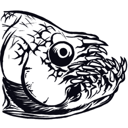 | [Xiphactinus](https://ark.wiki.gg/wiki/Xiphactinus) | 剑射鱼 | https://ark.wiki.gg/wiki/Xiphactinus | Fish | XiphactinusAA | Xiphactinus_Character_BP_ASA_C | `Blueprint'/Game/ASA/Dinos/Xiphactinus/Dinos/Xiphactinus_Character_BP_ASA.Xiphactinus_Character_BP_ASA'` |
|  | [Yeti](https://ark.wiki.gg/wiki/Yeti) | 雪人 | https://ark.wiki.gg/wiki/Yeti | Mammals | Bigfoot | Yeti_Character_BP_C | `Blueprint'/Game/PrimalEarth/Dinos/Bigfoot/Yeti_Character_BP.Yeti_Character_BP'` |
|  | [Yutyrannus](https://ark.wiki.gg/wiki/Yutyrannus) | 羽王龙 | https://ark.wiki.gg/wiki/Yutyrannus | Dinosaurs | Yutyrannus | Yutyrannus_Character_BP_C | `Blueprint'/Game/PrimalEarth/Dinos/Yutyrannus/Yutyrannus_Character_BP.Yutyrannus_Character_BP'` |
|  | [Zomdodo](https://ark.wiki.gg/wiki/Zomdodo) | 僵尸渡渡鸟 | https://ark.wiki.gg/wiki/Zomdodo | Event Creatures | Dodo | ZombieDodo_Character_BP_C | `Blueprint'/Game/PrimalEarth/Dinos/Dodo/ZombieDodo_Character_BP.ZombieDodo_Character_BP'` |

## Creatures of The Center

| 图标 | 名称 | 名称（中文） | 详情页 | 分类 | Name Tag | Entity ID | Blueprint Path |
| ------ | ------ | ------------ | -------- | ------ | ---------- | ----------- | ---------------- |
|  | [Shastasaurus](https://ark.wiki.gg/wiki/Shastasaurus) | 沙斯塔鱼龙 | https://ark.wiki.gg/wiki/Shastasaurus | Reptiles | Shasta | Shastasaurus_Character_BP_C | `Blueprint'/Game/ASA/Dinos/Shastasaurus/Shastasaurus_Character_BP.Shastasaurus_Character_BP'` |

## Creatures of Scorched Earth

| 图标 | 名称 | 名称（中文） | 详情页 | 分类 | Name Tag | Entity ID | Blueprint Path |
| ------ | ------ | ------------ | -------- | ------ | ---------- | ----------- | ---------------- |
|  | [Alpha Fire Wyvern](https://ark.wiki.gg/wiki/Alpha_Fire_Wyvern) | 精英火焰飞龙 | https://ark.wiki.gg/wiki/Alpha_Fire_Wyvern | Fantasy Creatures | Wyvern | MegaWyvern_Character_BP_Fire_C | `Blueprint'/Game/ScorchedEarth/Dinos/Wyvern/MegaWyvern_Character_BP_Fire.MegaWyvern_Character_BP_Fire'` |
|  | [Alpha Deathworm](https://ark.wiki.gg/wiki/Alpha_Deathworm) | 精英死亡蠕虫 | https://ark.wiki.gg/wiki/Alpha_Deathworm | Invertebrates | Deathworm | MegaDeathworm_Character_BP_C | `Blueprint'/Game/ScorchedEarth/Dinos/Deathworm/MegaDeathworm_Character_BP.MegaDeathworm_Character_BP'` |
|  | [Deathworm](https://ark.wiki.gg/wiki/Deathworm) | 死亡蠕虫 | https://ark.wiki.gg/wiki/Deathworm | Invertebrates | Deathworm | Deathworm_Character_BP_C | `Blueprint'/Game/ScorchedEarth/Dinos/DeathWorm/DeathWorm_Character_BP.DeathWorm_Character_BP'` |
|  | [Dodo Wyvern](https://ark.wiki.gg/wiki/Dodo_Wyvern) | 渡渡飞龙 | https://ark.wiki.gg/wiki/Dodo_Wyvern | Event Creatures | Wyvern | DodoWyvern_Character_BP_C | `Blueprint'/Game/ScorchedEarth/Dinos/DodoWyvern/DodoWyvern_Character_BP.DodoWyvern_Character_BP'` |
|  | [Fasolasuchus](https://ark.wiki.gg/wiki/Fasolasuchus) | 法索拉鳄 | https://ark.wiki.gg/wiki/Fasolasuchus | Reptiles | Fasola | Fasola_Character_BP_C | `Blueprint'/Game/ASA/Dinos/Fasolasuchus/Fasola_Character_BP.Fasola_Character_BP'` |
|  | [Jerboa](https://ark.wiki.gg/wiki/Jerboa) | 跳鼠 | https://ark.wiki.gg/wiki/Jerboa | Mammals | Jerboa | Jerboa_Character_BP_C | `Blueprint'/Game/ScorchedEarth/Dinos/Jerboa/Jerboa_Character_BP.Jerboa_Character_BP'` |
| 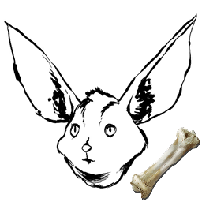 | [Skeletal Jerboa](https://ark.wiki.gg/wiki/Skeletal_Jerboa) | 骨架跳鼠 | https://ark.wiki.gg/wiki/Skeletal_Jerboa | Event Creatures | Jerboa | Bone_Jerboa_Character_BP_C | `Blueprint'/Game/ScorchedEarth/Dinos/Jerboa/Bone_Jerboa_Character_BP.Bone_Jerboa_Character_BP'` |
|  | [Jug Bug](https://ark.wiki.gg/wiki/Jug_Bug) | 壶虫 | https://ark.wiki.gg/wiki/Jug_Bug | Invertebrates | Jugbug | Jugbug_Character_BaseBP_C | `Blueprint'/Game/ScorchedEarth/Dinos/Jugbug/JugBug_Character_BaseBP.JugBug_Character_BaseBP'` |
|  | [Oil Jug Bug](https://ark.wiki.gg/wiki/Oil_Jug_Bug) | 油壶虫 | https://ark.wiki.gg/wiki/Oil_Jug_Bug | Invertebrates | Jugbug | Jugbug_Oil_Character_BP_C | `Blueprint'/Game/ScorchedEarth/Dinos/Jugbug/Jugbug_Oil_Character_BP.Jugbug_Oil_Character_BP'` |
|  | [Water Jug Bug](https://ark.wiki.gg/wiki/Water_Jug_Bug) | 水壶虫 | https://ark.wiki.gg/wiki/Water_Jug_Bug | Invertebrates | Jugbug | Jugbug_Water_Character_BP_C | `Blueprint'/Game/ScorchedEarth/Dinos/Jugbug/Jugbug_Water_Character_BP.Jugbug_Water_Character_BP'` |
|  | [Lymantria](https://ark.wiki.gg/wiki/Lymantria) | 沙蛾 | https://ark.wiki.gg/wiki/Lymantria | Invertebrates | Moth | Moth_Character_BP_C | `Blueprint'/Game/ScorchedEarth/Dinos/Moth/Moth_Character_BP.Moth_Character_BP'` |
|  | [Manticore (Gamma)](https://ark.wiki.gg/wiki/Manticore_(Gamma)) | 狮身蝎尾兽 (简单) | https://ark.wiki.gg/wiki/Manticore_(Gamma) | Bosses | Manticore | Manticore_Character_BP_Easy_C | `Blueprint'/Game/ScorchedEarth/Dinos/Manticore/Manticore_Character_BP_Easy.Manticore_Character_BP_Easy'` |
|  | [Manticore (Beta)](https://ark.wiki.gg/wiki/Manticore_(Beta)) | 狮身蝎尾兽 (中等) | https://ark.wiki.gg/wiki/Manticore_(Beta) | Bosses | Manticore | Manticore_Character_BP_Medium_C | `Blueprint'/Game/ScorchedEarth/Dinos/Manticore/Manticore_Character_BP_Medium.Manticore_Character_BP_Medium'` |
|  | [Manticore (Alpha)](https://ark.wiki.gg/wiki/Manticore_(Alpha)) | 狮身蝎尾兽 (困难) | https://ark.wiki.gg/wiki/Manticore_(Alpha) | Bosses | Manticore | Manticore_Character_BP_Hard_C | `Blueprint'/Game/ScorchedEarth/Dinos/Manticore/Manticore_Character_BP_Hard.Manticore_Character_BP_Hard'` |
|  | [Mantis](https://ark.wiki.gg/wiki/Mantis) | 螳螂 | https://ark.wiki.gg/wiki/Mantis | Invertebrates | Mantis | Mantis_Character_BP_C | `Blueprint'/Game/ScorchedEarth/Dinos/Mantis/Mantis_Character_BP.Mantis_Character_BP'` |
| 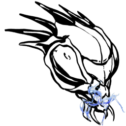 | [Mantis Ghost](https://ark.wiki.gg/wiki/Mantis_Ghost) | 幽灵螳螂 | https://ark.wiki.gg/wiki/Mantis_Ghost | Event Creatures | Mantis | Ghost_Mantis_Character_BP_C | `Blueprint'/Game/ScorchedEarth/Dinos/Mantis/Ghost_Mantis_Character_BP.Ghost_Mantis_Character_BP'` |
|  | [Morellatops](https://ark.wiki.gg/wiki/Morellatops) | 驼峰龙 | https://ark.wiki.gg/wiki/Morellatops | Dinosaurs | Camelsaurus | camelsaurus_Character_BP_C | `Blueprint'/Game/ScorchedEarth/Dinos/Camelsaurus/camelsaurus_Character_BP.camelsaurus_Character_BP'` |
|  | [Oasisaur](https://ark.wiki.gg/wiki/Oasisaur) | 绿洲龙 | https://ark.wiki.gg/wiki/Oasisaur | Fantasy Creatures | Oasisaur | Oasisaur_Character_BP_C | `Blueprint'/Game/Packs/Frontier/Dinos/Oasisaur/Oasisaur_Character_BP.Oasisaur_Character_BP'` |
|  | [Phoenix](https://ark.wiki.gg/wiki/Phoenix) | 凤凰 | https://ark.wiki.gg/wiki/Phoenix | Fantasy Creatures | Phoenix | Phoenix_Character_BP_C | `Blueprint'/Game/ScorchedEarth/Dinos/Phoenix/Phoenix_Character_BP.Phoenix_Character_BP'` |
|  | [Rock Elemental](https://ark.wiki.gg/wiki/Rock_Elemental) | 岩石巨人 | https://ark.wiki.gg/wiki/Rock_Elemental | Fantasy Creatures | RockElemental | RockGolem_Character_BP_C | `Blueprint'/Game/ScorchedEarth/Dinos/RockGolem/RockGolem_Character_BP.RockGolem_Character_BP'` |
| 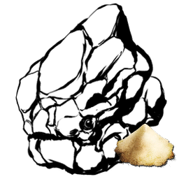 | [Rubble Golem](https://ark.wiki.gg/wiki/Rubble_Golem) | 遗迹魔像 | https://ark.wiki.gg/wiki/Rubble_Golem | Fantasy Creatures | RockElemental | RubbleGolem_Character_BP_C | `Blueprint'/Game/ScorchedEarth/Dinos/RockGolem/RubbleGolem_Character_BP.RubbleGolem_Character_BP'` |
|  | [Thorny Dragon](https://ark.wiki.gg/wiki/Thorny_Dragon) | 棘蜥 | https://ark.wiki.gg/wiki/Thorny_Dragon | Reptiles | SpineyLizard | SpineyLizard_Character_BP_C | `Blueprint'/Game/ScorchedEarth/Dinos/SpineyLizard/SpineyLizard_Character_BP.SpineyLizard_Character_BP'` |
|  | [Vulture](https://ark.wiki.gg/wiki/Vulture) | 秃鹫 | https://ark.wiki.gg/wiki/Vulture | Birds | Vulture | Vulture_Character_BP_C | `Blueprint'/Game/ScorchedEarth/Dinos/Vulture/Vulture_Character_BP.Vulture_Character_BP'` |
|  | [Wyvern](https://ark.wiki.gg/wiki/Wyvern) | 飞龙 | https://ark.wiki.gg/wiki/Wyvern | Fantasy Creatures | Wyvern | Wyvern_Character_BP_Base_C | `Blueprint'/Game/ScorchedEarth/Dinos/Wyvern/Wyvern_Character_BP_Base.Wyvern_Character_BP_Base'` |
|  | [Fire Wyvern](https://ark.wiki.gg/wiki/Fire_Wyvern) | 火焰飞龙 | https://ark.wiki.gg/wiki/Fire_Wyvern | Fantasy Creatures | Wyvern | Wyvern_Character_BP_Fire_C | `Blueprint'/Game/ScorchedEarth/Dinos/Wyvern/Wyvern_Character_BP_Fire.Wyvern_Character_BP_Fire'` |
|  | [Lightning Wyvern](https://ark.wiki.gg/wiki/Lightning_Wyvern) | 闪电飞龙 | https://ark.wiki.gg/wiki/Lightning_Wyvern | Fantasy Creatures | Wyvern | Wyvern_Character_BP_Lightning_C | `Blueprint'/Game/ScorchedEarth/Dinos/Wyvern/Wyvern_Character_BP_Lightning.Wyvern_Character_BP_Lightning'` |
|  | [Poison Wyvern](https://ark.wiki.gg/wiki/Poison_Wyvern) | 剧毒飞龙 | https://ark.wiki.gg/wiki/Poison_Wyvern | Fantasy Creatures | Wyvern | Wyvern_Character_BP_Poison_C | `Blueprint'/Game/ScorchedEarth/Dinos/Wyvern/Wyvern_Character_BP_Poison.Wyvern_Character_BP_Poison'` |
| 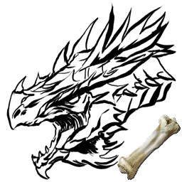 | [Bone Fire Wyvern](https://ark.wiki.gg/wiki/Bone_Fire_Wyvern) | 骨架火焰飞龙 | https://ark.wiki.gg/wiki/Bone_Fire_Wyvern | Event Creatures | Wyvern | Bone_MegaWyvern_Character_BP_Fire_C | `Blueprint'/Game/ScorchedEarth/Dinos/Wyvern/Bone_MegaWyvern_Character_BP_Fire.Bone_MegaWyvern_Character_BP_Fire'` |
| 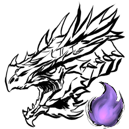 | [Zombie Fire Wyvern](https://ark.wiki.gg/wiki/Zombie_Fire_Wyvern) | 僵尸火焰飞龙 | https://ark.wiki.gg/wiki/Zombie_Fire_Wyvern | Event Creatures | Wyvern | Wyvern_Character_BP_ZombieFire_C | `Blueprint'/Game/ScorchedEarth/Dinos/Wyvern/Wyvern_Character_BP_ZombieFire.Wyvern_Character_BP_ZombieFire'` |
| 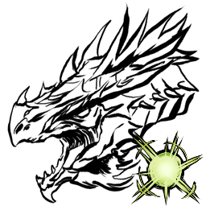 | [Zombie Lightning Wyvern](https://ark.wiki.gg/wiki/Zombie_Lightning_Wyvern) | 僵尸闪电飞龙 | https://ark.wiki.gg/wiki/Zombie_Lightning_Wyvern | Event Creatures | Wyvern | Wyvern_Character_BP_ZombieLightning_C | `Blueprint'/Game/ScorchedEarth/Dinos/Wyvern/Wyvern_Character_BP_ZombieLightning.Wyvern_Character_BP_ZombieLightning'` |
| 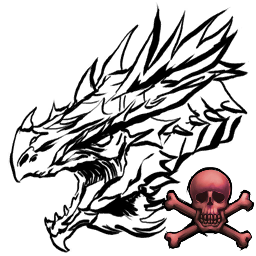 | [Zombie Poison Wyvern](https://ark.wiki.gg/wiki/Zombie_Poison_Wyvern) | 僵尸剧毒飞龙 | https://ark.wiki.gg/wiki/Zombie_Poison_Wyvern | Event Creatures | Wyvern | Wyvern_Character_BP_ZombiePoison_C | `Blueprint'/Game/ScorchedEarth/Dinos/Wyvern/Wyvern_Character_BP_ZombiePoison.Wyvern_Character_BP_ZombiePoison'` |

## Creatures of Ragnarok

| 图标 | 名称 | 名称（中文） | 详情页 | 分类 | Name Tag | Entity ID | Blueprint Path |
| ------ | ------ | ------------ | -------- | ------ | ---------- | ----------- | ---------------- |
|  | [Bison](https://ark.wiki.gg/wiki/Bison) | 野牛 | https://ark.wiki.gg/wiki/Bison | Mammals | Bison | Bison_Character_BP_C | `Blueprint'/Game/ASA/Dinos/Bison/Bison_Character_BP.Bison_Character_BP'` |
| 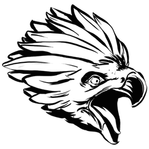 | [Griffin](https://ark.wiki.gg/wiki/Griffin) | 狮鹫 | https://ark.wiki.gg/wiki/Griffin | Fantasy Creatures | Griffin | Griffin_Character_BP_C | `Blueprint'/Game/PrimalEarth/Dinos/Griffin/Griffin_Character_BP.Griffin_Character_BP'` |
|  | [Ice Wyvern](https://ark.wiki.gg/wiki/Ice_Wyvern) | 寒冰飞龙 | https://ark.wiki.gg/wiki/Ice_Wyvern | Fantasy Creatures | Wyvern | Ragnarok_Wyvern_Override_Ice_C | `Blueprint'/Game/Mods/Ragnarok/Custom_Assets/Dinos/Wyvern/Ice_Wyvern/Ragnarok_Wyvern_Override_Ice.Ragnarok_Wyvern_Override_Ice'` |
|  | [Ice Wyvern](https://ark.wiki.gg/wiki/Ice_Wyvern) | 寒冰飞龙 | https://ark.wiki.gg/wiki/Ice_Wyvern | Fantasy Creatures | Wyvern | Wyvern_Character_BP_Ice_C | `Blueprint'/Game/ASA/Dinos/IceWyvern/Wyvern_Character_BP_Ice.Wyvern_Character_BP_Ice'` |

## Creatures of Aberration

| 图标 | 名称 | 名称（中文） | 详情页 | 分类 | Name Tag | Entity ID | Blueprint Path |
| ------ | ------ | ------------ | -------- | ------ | ---------- | ----------- | ---------------- |
|  | [Aberrant Achatina](https://ark.wiki.gg/wiki/Aberrant_Achatina) | 畸变玛瑙螺 | https://ark.wiki.gg/wiki/Aberrant_Achatina | Invertebrates | Achatina | Achatina_Character_BP_Aberrant_C | `Blueprint'/Game/PrimalEarth/Dinos/Achatina/Achatina_Character_BP_Aberrant.Achatina_Character_BP_Aberrant'` |
|  | [Aberrant Anglerfish](https://ark.wiki.gg/wiki/Aberrant_Anglerfish) | 畸变鮟鱇鱼 | https://ark.wiki.gg/wiki/Aberrant_Anglerfish | Fish | Angler | Angler_Character_BP_Aberrant_C | `Blueprint'/Game/PrimalEarth/Dinos/Anglerfish/Angler_Character_BP_Aberrant.Angler_Character_BP_Aberrant'` |
|  | [Aberrant Ankylosaurus](https://ark.wiki.gg/wiki/Aberrant_Ankylosaurus) | 畸变甲龙 | https://ark.wiki.gg/wiki/Aberrant_Ankylosaurus | Dinosaurs | Anky | Ankylo_Character_BP_Aberrant_C | `Blueprint'/Game/PrimalEarth/Dinos/Ankylo/Ankylo_Character_BP_Aberrant.Ankylo_Character_BP_Aberrant'` |
|  | [Aberrant Araneo](https://ark.wiki.gg/wiki/Aberrant_Araneo) | 畸变蜘蛛 | https://ark.wiki.gg/wiki/Aberrant_Araneo | Invertebrates | Spider | SpiderS_Character_BP_Aberrant_C | `Blueprint'/Game/PrimalEarth/Dinos/Spider-Small/SpiderS_Character_BP_Aberrant.SpiderS_Character_BP_Aberrant'` |
|  | [Aberrant Arthropluera](https://ark.wiki.gg/wiki/Aberrant_Arthropluera) | 畸变节胸虫 | https://ark.wiki.gg/wiki/Aberrant_Arthropluera | Invertebrates | Arthro | Arthro_Character_BP_Aberrant_C | `Blueprint'/Game/PrimalEarth/Dinos/Arthropluera/Arthro_Character_BP_Aberrant.Arthro_Character_BP_Aberrant'` |
|  | [Aberrant Baryonyx](https://ark.wiki.gg/wiki/Aberrant_Baryonyx) | 畸变重爪龙 | https://ark.wiki.gg/wiki/Aberrant_Baryonyx | Dinosaurs | Baryonyx | Baryonyx_Character_BP_Aberrant_C | `Blueprint'/Game/PrimalEarth/Dinos/Baryonyx/Baryonyx_Character_BP_Aberrant.Baryonyx_Character_BP_Aberrant'` |
|  | [Aberrant Beelzebufo](https://ark.wiki.gg/wiki/Aberrant_Beelzebufo) | 畸变魔鬼蛙 | https://ark.wiki.gg/wiki/Aberrant_Beelzebufo | Reptiles | Toad | Toad_Character_BP_Aberrant_C | `Blueprint'/Game/PrimalEarth/Dinos/Toad/Toad_Character_BP_Aberrant.Toad_Character_BP_Aberrant'` |
|  | [Aberrant Carbonemys](https://ark.wiki.gg/wiki/Aberrant_Carbonemys) | 畸变碳龟 | https://ark.wiki.gg/wiki/Aberrant_Carbonemys | Reptiles | Turtle | Turtle_Character_BP_Aberrant_C | `Blueprint'/Game/PrimalEarth/Dinos/Turtle/Turtle_Character_BP_Aberrant.Turtle_Character_BP_Aberrant'` |
|  | [Aberrant Carnotaurus](https://ark.wiki.gg/wiki/Aberrant_Carnotaurus) | 畸变肉食牛龙 | https://ark.wiki.gg/wiki/Aberrant_Carnotaurus | Dinosaurs | Carno | Carno_Character_BP_Aberrant_C | `Blueprint'/Game/PrimalEarth/Dinos/Carno/Carno_Character_BP_Aberrant.Carno_Character_BP_Aberrant'` |
|  | [Aberrant Cnidaria](https://ark.wiki.gg/wiki/Aberrant_Cnidaria) | 畸变水母 | https://ark.wiki.gg/wiki/Aberrant_Cnidaria | Invertebrates | Cnidaria | Cnidaria_Character_BP_Aberrant_C | `Blueprint'/Game/PrimalEarth/Dinos/Cnidaria/Cnidaria_Character_BP_Aberrant.Cnidaria_Character_BP_Aberrant'` |
|  | [Aberrant Coelacanth](https://ark.wiki.gg/wiki/Aberrant_Coelacanth) | 畸变腔棘鱼 | https://ark.wiki.gg/wiki/Aberrant_Coelacanth | Fish | Coel | Coel_Character_BP_Aberrant_C | `Blueprint'/Game/PrimalEarth/Dinos/Coelacanth/Coel_Character_BP_Aberrant.Coel_Character_BP_Aberrant'` |
|  | [Aberrant Dimetrodon](https://ark.wiki.gg/wiki/Aberrant_Dimetrodon) | 畸变异齿龙 | https://ark.wiki.gg/wiki/Aberrant_Dimetrodon | Dinosaurs | Dimetro | Dimetro_Character_BP_Aberrant_C | `Blueprint'/Game/PrimalEarth/Dinos/Dimetrodon/Dimetro_Character_BP_Aberrant.Dimetro_Character_BP_Aberrant'` |
|  | [Aberrant Dimorphodon](https://ark.wiki.gg/wiki/Aberrant_Dimorphodon) | 畸变双型齿翼龙 | https://ark.wiki.gg/wiki/Aberrant_Dimorphodon | Dinosaurs | Dimorph | Dimorph_Character_BP_Aberrant_C | `Blueprint'/Game/PrimalEarth/Dinos/Dimorphodon/Dimorph_Character_BP_Aberrant.Dimorph_Character_BP_Aberrant'` |
|  | [Aberrant Diplocaulus](https://ark.wiki.gg/wiki/Aberrant_Diplocaulus) | 畸变盗首螈 | https://ark.wiki.gg/wiki/Aberrant_Diplocaulus | Amphibians | Diplocaulus | Diplocaulus_Character_BP_Aberrant_C | `Blueprint'/Game/PrimalEarth/Dinos/Diplocaulus/Diplocaulus_Character_BP_Aberrant.Diplocaulus_Character_BP_Aberrant'` |
|  | [Aberrant Diplodocus](https://ark.wiki.gg/wiki/Aberrant_Diplodocus) | 畸变梁龙 | https://ark.wiki.gg/wiki/Aberrant_Diplodocus | Dinosaurs | Diplo | Diplodocus_Character_BP_Aberrant_C | `Blueprint'/Game/PrimalEarth/Dinos/Diplodocus/Diplodocus_Character_BP_Aberrant.Diplodocus_Character_BP_Aberrant'` |
|  | [Aberrant Dire Bear](https://ark.wiki.gg/wiki/Aberrant_Dire_Bear) | 畸变恐熊 | https://ark.wiki.gg/wiki/Aberrant_Dire_Bear | Mammals | Direbear | Direbear_Character_BP_Aberrant_C | `Blueprint'/Game/PrimalEarth/Dinos/Direbear/Direbear_Character_BP_Aberrant.Direbear_Character_BP_Aberrant'` |
|  | [Aberrant Dodo](https://ark.wiki.gg/wiki/Aberrant_Dodo) | 畸变渡渡鸟 | https://ark.wiki.gg/wiki/Aberrant_Dodo | Birds | Dodo | Dodo_Character_BP_Aberrant_C | `Blueprint'/Game/PrimalEarth/Dinos/Dodo/Dodo_Character_BP_Aberrant.Dodo_Character_BP_Aberrant'` |
|  | [Aberrant Doedicurus](https://ark.wiki.gg/wiki/Aberrant_Doedicurus) | 畸变星尾兽 | https://ark.wiki.gg/wiki/Aberrant_Doedicurus | Dinosaurs | Doed | Doed_Character_BP_Aberrant_C | `Blueprint'/Game/PrimalEarth/Dinos/Doedicurus/Doed_Character_BP_Aberrant.Doed_Character_BP_Aberrant'` |
|  | [Aberrant Dung Beetle](https://ark.wiki.gg/wiki/Aberrant_Dung_Beetle) | 畸变蜣螂 | https://ark.wiki.gg/wiki/Aberrant_Dung_Beetle | Invertebrates | Beetle | DungBeetle_Character_BP_Aberrant_C | `Blueprint'/Game/PrimalEarth/Dinos/DungBeetle/DungBeetle_Character_BP_Aberrant.DungBeetle_Character_BP_Aberrant'` |
|  | [Aberrant Electrophorus](https://ark.wiki.gg/wiki/Aberrant_Electrophorus) | 畸变电鳗 | https://ark.wiki.gg/wiki/Aberrant_Electrophorus | Fish | Eel | Eel_Character_BP_Aberrant_C | `Blueprint'/Game/PrimalEarth/Dinos/Eel/Eel_Character_BP_Aberrant.Eel_Character_BP_Aberrant'` |
|  | [Aberrant Equus](https://ark.wiki.gg/wiki/Aberrant_Equus) | 畸变庞马 | https://ark.wiki.gg/wiki/Aberrant_Equus | Mammals | Equus | Equus_Character_BP_Aberrant_C | `Blueprint'/Game/PrimalEarth/Dinos/Equus/Equus_Character_BP_Aberrant.Equus_Character_BP_Aberrant'` |
|  | [Aberrant Fasolasuchus](https://ark.wiki.gg/wiki/Aberrant_Fasolasuchus) | 畸变法索拉鳄 | https://ark.wiki.gg/wiki/Aberrant_Fasolasuchus | Reptiles | Fasola | Fasola_Character_BP_Aberrant_C | `Blueprint'/Game/ASA/Dinos/Fasolasuchus/Fasola_Character_BP_Aberrant.Fasola_Character_BP_Aberrant'` |
|  | [Aberrant Gigantopithecus](https://ark.wiki.gg/wiki/Aberrant_Gigantopithecus) | 畸变巨猿 | https://ark.wiki.gg/wiki/Aberrant_Gigantopithecus | Mammals | Bigfoot | Bigfoot_Character_BP_Aberrant_C | `Blueprint'/Game/PrimalEarth/Dinos/Bigfoot/Bigfoot_Character_BP_Aberrant.Bigfoot_Character_BP_Aberrant'` |
|  | [Aberrant Gigantoraptor](https://ark.wiki.gg/wiki/Aberrant_Gigantoraptor) | 畸变巨盗龙 | https://ark.wiki.gg/wiki/Aberrant_Gigantoraptor | Dinosaurs | Gigantoraptor | Gigantoraptor_Character_BP_Aberrant_C | `Blueprint'/Game/ASA/Dinos/Gigantoraptor/Gigantoraptor_Character_BP_Aberrant.Gigantoraptor_Character_BP_Aberrant'` |
|  | [Aberrant Iguanodon](https://ark.wiki.gg/wiki/Aberrant_Iguanodon) | 畸变禽龙 | https://ark.wiki.gg/wiki/Aberrant_Iguanodon | Dinosaurs | Iguanodon | Iguanodon_Character_BP_Aberrant_C | `Blueprint'/Game/PrimalEarth/Dinos/Iguanodon/Iguanodon_Character_BP_Aberrant.Iguanodon_Character_BP_Aberrant'` |
|  | [Aberrant Lystrosaurus](https://ark.wiki.gg/wiki/Aberrant_Lystrosaurus) | 畸变水龙兽 | https://ark.wiki.gg/wiki/Aberrant_Lystrosaurus | Dinosaurs | Lystro | Lystro_Character_BP_Aberrant_C | `Blueprint'/Game/PrimalEarth/Dinos/Lystrosaurus/Lystro_Character_BP_Aberrant.Lystro_Character_BP_Aberrant'` |
|  | [Aberrant Manta](https://ark.wiki.gg/wiki/Aberrant_Manta) | 畸变蝠鲼 | https://ark.wiki.gg/wiki/Aberrant_Manta | Fish | Manta | Manta_Character_BP_Aberrant_C | `Blueprint'/Game/PrimalEarth/Dinos/Manta/Manta_Character_BP_Aberrant.Manta_Character_BP_Aberrant'` |
|  | [Aberrant Megalania](https://ark.wiki.gg/wiki/Aberrant_Megalania) | 畸变古巨蜥 | https://ark.wiki.gg/wiki/Aberrant_Megalania | Reptiles | Megalania | Megalania_Character_BP_Aberrant_C | `Blueprint'/Game/PrimalEarth/Dinos/Megalania/Megalania_Character_BP_Aberrant.Megalania_Character_BP_Aberrant'` |
|  | [Aberrant Megalosaurus](https://ark.wiki.gg/wiki/Aberrant_Megalosaurus) | 畸变巨齿龙 | https://ark.wiki.gg/wiki/Aberrant_Megalosaurus | Dinosaurs | Megalosaurus | Megalosaurus_Character_BP_Aberrant_C | `Blueprint'/Game/PrimalEarth/Dinos/Megalosaurus/Megalosaurus_Character_BP_Aberrant.Megalosaurus_Character_BP_Aberrant'` |
|  | [Aberrant Meganeura](https://ark.wiki.gg/wiki/Aberrant_Meganeura) | 畸变巨脉蜻蜓 | https://ark.wiki.gg/wiki/Aberrant_Meganeura | Invertebrates | Dragonfly | Dragonfly_Character_BP_Aberrant_C | `Blueprint'/Game/PrimalEarth/Dinos/Dragonfly/Dragonfly_Character_BP_Aberrant.Dragonfly_Character_BP_Aberrant'` |
|  | [Aberrant Moschops](https://ark.wiki.gg/wiki/Aberrant_Moschops) | 畸变麝足兽 | https://ark.wiki.gg/wiki/Aberrant_Moschops | Synapsids | Moschops | Moschops_Character_BP_Aberrant_C | `Blueprint'/Game/PrimalEarth/Dinos/Moschops/Moschops_Character_BP_Aberrant.Moschops_Character_BP_Aberrant'` |
|  | [Aberrant Otter](https://ark.wiki.gg/wiki/Aberrant_Otter) | 畸变水獭 | https://ark.wiki.gg/wiki/Aberrant_Otter | Mammals | Otter | Otter_Character_BP_Aberrant_C | `Blueprint'/Game/PrimalEarth/Dinos/Otter/Otter_Character_BP_Aberrant.Otter_Character_BP_Aberrant'` |
|  | [Aberrant Oviraptor](https://ark.wiki.gg/wiki/Aberrant_Oviraptor) | 畸变窃蛋龙 | https://ark.wiki.gg/wiki/Aberrant_Oviraptor | Dinosaurs | Oviraptor | Oviraptor_Character_BP_Aberrant_C | `Blueprint'/Game/PrimalEarth/Dinos/Oviraptor/Oviraptor_Character_BP_Aberrant.Oviraptor_Character_BP_Aberrant'` |
|  | [Aberrant Ovis](https://ark.wiki.gg/wiki/Aberrant_Ovis) | 畸变绵羊 | https://ark.wiki.gg/wiki/Aberrant_Ovis | Mammals | Sheep | Sheep_Character_BP_Aberrant_C | `Blueprint'/Game/PrimalEarth/Dinos/Sheep/Sheep_Character_BP_Aberrant.Sheep_Character_BP_Aberrant'` |
|  | [Aberrant Paraceratherium](https://ark.wiki.gg/wiki/Aberrant_Paraceratherium) | 畸变巨犀 | https://ark.wiki.gg/wiki/Aberrant_Paraceratherium | Mammals | Paracer | Paracer_Character_BP_Aberrant_C | `Blueprint'/Game/PrimalEarth/Dinos/Paraceratherium/Paracer_Character_BP_Aberrant.Paracer_Character_BP_Aberrant'` |
|  | [Aberrant Parasaur](https://ark.wiki.gg/wiki/Aberrant_Parasaur) | 畸变副栉龙 | https://ark.wiki.gg/wiki/Aberrant_Parasaur | Dinosaurs | Para | Para_Character_BP_Aberrant_C | `Blueprint'/Game/PrimalEarth/Dinos/Para/Para_Character_BP_Aberrant.Para_Character_BP_Aberrant'` |
|  | [Aberrant Piranha](https://ark.wiki.gg/wiki/Aberrant_Piranha) | 畸变食人鱼 | https://ark.wiki.gg/wiki/Aberrant_Piranha | Fish | Piranha | Piranha_Character_BP_Aberrant_C | `Blueprint'/Game/PrimalEarth/Dinos/Piranha/Piranha_Character_BP_Aberrant.Piranha_Character_BP_Aberrant'` |
|  | [Aberrant Pulmonoscorpius](https://ark.wiki.gg/wiki/Aberrant_Pulmonoscorpius) | 畸变肺蝎 | https://ark.wiki.gg/wiki/Aberrant_Pulmonoscorpius | Invertebrates | Scorpion | Scorpion_Character_BP_Aberrant_C | `Blueprint'/Game/PrimalEarth/Dinos/Scorpion/Scorpion_Character_BP_Aberrant.Scorpion_Character_BP_Aberrant'` |
|  | [Aberrant Purlovia](https://ark.wiki.gg/wiki/Aberrant_Purlovia) | 畸变普雷兽 | https://ark.wiki.gg/wiki/Aberrant_Purlovia | Synapsids | Purlovia | Purlovia_Character_BP_Aberrant_C | `Blueprint'/Game/PrimalEarth/Dinos/Purlovia/Purlovia_Character_BP_Aberrant.Purlovia_Character_BP_Aberrant'` |
|  | [Aberrant Raptor](https://ark.wiki.gg/wiki/Aberrant_Raptor) | 畸变迅猛龙 | https://ark.wiki.gg/wiki/Aberrant_Raptor | Dinosaurs | Raptor | Raptor_Character_BP_Aberrant_C | `Blueprint'/Game/PrimalEarth/Dinos/Raptor/Raptor_Character_BP_Aberrant.Raptor_Character_BP_Aberrant'` |
| 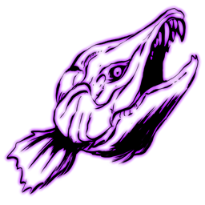 | [Aberrant Sabertooth Salmon](https://ark.wiki.gg/wiki/Aberrant_Sabertooth_Salmon) |  | https://ark.wiki.gg/wiki/Aberrant_Sabertooth_Salmon | Fish | Salmon | Salmon_Character_Aberrant_C | `Blueprint'/Game/PrimalEarth/Dinos/Salmon/Salmon_Character_Aberrant.Salmon_Character_Aberrant'` |
|  | [Aberrant Sarco](https://ark.wiki.gg/wiki/Aberrant_Sarco) | 畸变帝鳄 | https://ark.wiki.gg/wiki/Aberrant_Sarco | Reptiles | Sarco | Sarco_Character_BP_Aberrant_C | `Blueprint'/Game/PrimalEarth/Dinos/Sarco/Sarco_Character_BP_Aberrant.Sarco_Character_BP_Aberrant'` |
|  | [Aberrant Spino](https://ark.wiki.gg/wiki/Aberrant_Spino) | 畸变棘龙 | https://ark.wiki.gg/wiki/Aberrant_Spino | Dinosaurs | Spino | Spino_Character_BP_Aberrant_C | `Blueprint'/Game/PrimalEarth/Dinos/Spino/Spino_Character_BP_Aberrant.Spino_Character_BP_Aberrant'` |
|  | [Aberrant Stegosaurus](https://ark.wiki.gg/wiki/Aberrant_Stegosaurus) | 畸变剑龙 | https://ark.wiki.gg/wiki/Aberrant_Stegosaurus | Dinosaurs | Stego | Stego_Character_BP_Aberrant_C | `Blueprint'/Game/PrimalEarth/Dinos/Stego/Stego_Character_BP_Aberrant.Stego_Character_BP_Aberrant'` |
|  | [Aberrant Titanoboa](https://ark.wiki.gg/wiki/Aberrant_Titanoboa) | 畸变泰坦蚺 | https://ark.wiki.gg/wiki/Aberrant_Titanoboa | Reptiles | Titanboa | BoaFrill_Character_BP_Aberrant_C | `Blueprint'/Game/PrimalEarth/Dinos/BoaFrill/BoaFrill_Character_BP_Aberrant.BoaFrill_Character_BP_Aberrant'` |
|  | [Aberrant Triceratops](https://ark.wiki.gg/wiki/Aberrant_Triceratops) | 畸变三角龙 | https://ark.wiki.gg/wiki/Aberrant_Triceratops | Dinosaurs | Trike | Trike_Character_BP_Aberrant_C | `Blueprint'/Game/PrimalEarth/Dinos/Trike/Trike_Character_BP_Aberrant.Trike_Character_BP_Aberrant'` |
|  | [Aberrant Trilobite](https://ark.wiki.gg/wiki/Aberrant_Trilobite) | 畸变三叶虫 | https://ark.wiki.gg/wiki/Aberrant_Trilobite | Invertebrates | Trilobite | Trilobite_Character_Aberrant_C | `Blueprint'/Game/PrimalEarth/Dinos/Trilobite/Trilobite_Character_Aberrant.Trilobite_Character_Aberrant'` |
|  | [Alpha Basilisk](https://ark.wiki.gg/wiki/Alpha_Basilisk) | 精英帝蟒 | https://ark.wiki.gg/wiki/Alpha_Basilisk | Alpha Creatures | Elite Basilisk | MegaBasilisk_Character_BP_C | `Blueprint'/Game/Aberration/Dinos/Basilisk/MegaBasilisk_Character_BP.MegaBasilisk_Character_BP'` |
|  | [Alpha Karkinos](https://ark.wiki.gg/wiki/Alpha_Karkinos) | 精英巨蟹 | https://ark.wiki.gg/wiki/Alpha_Karkinos | Alpha Creatures | Elite CaveCrab | MegaCrab_Character_BP_C | `Blueprint'/Game/Aberration/Dinos/Crab/MegaCrab_Character_BP.MegaCrab_Character_BP'` |
| 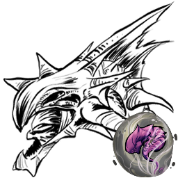 | [Alpha Surface Reaper King](https://ark.wiki.gg/wiki/Alpha_Surface_Reaper_King) | 精英地表死神国王 | https://ark.wiki.gg/wiki/Alpha_Surface_Reaper_King | Alpha Creatures | Elite Xenomorph | MegaXenomorph_Character_BP_Male_Surface_C | `Blueprint'/Game/Aberration/Dinos/Nameless/MegaXenomorph_Character_BP_Male_Surface.MegaXenomorph_Character_BP_Male_Surface'` |
|  | [Basilisk](https://ark.wiki.gg/wiki/Basilisk) | 帝蟒 | https://ark.wiki.gg/wiki/Basilisk | Fantasy Creatures | Basilisk | Basilisk_Character_BP_C | `Blueprint'/Game/Aberration/Dinos/Basilisk/Basilisk_Character_BP.Basilisk_Character_BP'` |
| 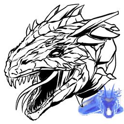 | [Basilisk Ghost](https://ark.wiki.gg/wiki/Basilisk_Ghost) | 幽灵帝蟒 | https://ark.wiki.gg/wiki/Basilisk_Ghost | Event Creatures | Basilisk | Ghost_Basilisk_Character_BP_C | `Blueprint'/Game/Aberration/Dinos/Basilisk/Ghost_Basilisk_Character_BP.Ghost_Basilisk_Character_BP'` |
|  | [Bulbdog](https://ark.wiki.gg/wiki/Bulbdog) | 灯泡犬 | https://ark.wiki.gg/wiki/Bulbdog | Fantasy Creatures | Pug | LanternPug_Character_BP_C | `Blueprint'/Game/Aberration/Dinos/LanternPug/LanternPug_Character_BP.LanternPug_Character_BP'` |
| 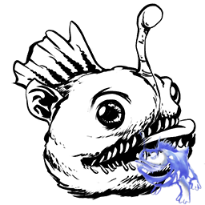 | [Bulbdog Ghost](https://ark.wiki.gg/wiki/Bulbdog_Ghost) | 幽灵灯泡犬 | https://ark.wiki.gg/wiki/Bulbdog_Ghost | Event Creatures | Pug | Ghost_LanternPug_Character_BP_C | `Blueprint'/Game/Aberration/Dinos/LanternPug/Ghost_LanternPug_Character_BP.Ghost_LanternPug_Character_BP'` |
|  | [Cosmo](https://ark.wiki.gg/wiki/Cosmo) | 宇跳蛛 | https://ark.wiki.gg/wiki/Cosmo | Invertebrates | JumpingSpider | JumpingSpider_Character_BP_C | `Blueprint'/Game/Packs/Steampunk/Dinos/JumpingSpider/JumpingSpider_Character_BP.JumpingSpider_Character_BP'` |
|  | [Featherlight](https://ark.wiki.gg/wiki/Featherlight) | 光羽鸟 | https://ark.wiki.gg/wiki/Featherlight | Fantasy Creatures | Lantern Bird | LanternBird_Character_BP_C | `Blueprint'/Game/Aberration/Dinos/LanternBird/LanternBird_Character_BP.LanternBird_Character_BP'` |
|  | [Glowbug](https://ark.wiki.gg/wiki/Glowbug) | 电光萤 | https://ark.wiki.gg/wiki/Glowbug | Fantasy Creatures | Lightbug | Lightbug_Character_BaseBP_C | `Blueprint'/Game/Aberration/Dinos/Lightbug/Lightbug_Character_BaseBP.Lightbug_Character_BaseBP'` |
|  | [Glowtail](https://ark.wiki.gg/wiki/Glowtail) | 耀尾蜥 | https://ark.wiki.gg/wiki/Glowtail | Fantasy Creatures | Lantern Lizard | LanternLizard_Character_BP_C | `Blueprint'/Game/Aberration/Dinos/LanternLizard/LanternLizard_Character_BP.LanternLizard_Character_BP'` |
|  | [Karkinos](https://ark.wiki.gg/wiki/Karkinos) | 巨蟹 | https://ark.wiki.gg/wiki/Karkinos | Fantasy Creatures | CaveCrab | Crab_Character_BP_C | `Blueprint'/Game/Aberration/Dinos/Crab/Crab_Character_BP.Crab_Character_BP'` |
|  | [Lamprey](https://ark.wiki.gg/wiki/Lamprey) | 七鳃鳗 | https://ark.wiki.gg/wiki/Lamprey | Fish | Lamprey | Lamprey_Character_C | `Blueprint'/Game/Aberration/Dinos/Lamprey/Lamprey_Character.Lamprey_Character'` |
|  | [Nameless](https://ark.wiki.gg/wiki/Nameless) | 无名怪 | https://ark.wiki.gg/wiki/Nameless | Fantasy Creatures | Chupacabra | ChupaCabra_Character_BP_C | `Blueprint'/Game/Aberration/Dinos/ChupaCabra/ChupaCabra_Character_BP.ChupaCabra_Character_BP'` |
|  | [Ravager](https://ark.wiki.gg/wiki/Ravager) | 劫掠者 | https://ark.wiki.gg/wiki/Ravager | Fantasy Creatures | CaveWolf | CaveWolf_Character_BP_C | `Blueprint'/Game/Aberration/Dinos/CaveWolf/CaveWolf_Character_BP.CaveWolf_Character_BP'` |
|  | [Reaper King](https://ark.wiki.gg/wiki/Reaper_King) | 死神国王 | https://ark.wiki.gg/wiki/Reaper_King | Fantasy Creatures | Xenomorph | Xenomorph_Character_BP_Male_C | `Blueprint'/Game/Aberration/Dinos/Nameless/Xenomorph_Character_BP_Male.Xenomorph_Character_BP_Male'` |
|  | [Reaper King (Tamed)](https://ark.wiki.gg/wiki/Reaper_King_(Tamed)) |  | https://ark.wiki.gg/wiki/Reaper_King_(Tamed) | Fantasy Creatures | Xenomorph | Xenomorph_Character_BP_Male_Tamed_C | `Blueprint'/Game/Aberration/Dinos/Nameless/Xenomorph_Character_BP_Male_Tamed.Xenomorph_Character_BP_Male_Tamed'` |
|  | [Reaper Queen](https://ark.wiki.gg/wiki/Reaper_Queen) | 死神王后 | https://ark.wiki.gg/wiki/Reaper_Queen | Fantasy Creatures | Xenomorph | Xenomorph_Character_BP_Female_C | `Blueprint'/Game/Aberration/Dinos/Nameless/Xenomorph_Character_BP_Female.Xenomorph_Character_BP_Female'` |
|  | [Rock Drake](https://ark.wiki.gg/wiki/Rock_Drake) | 岩龙 | https://ark.wiki.gg/wiki/Rock_Drake | Fantasy Creatures | RockDrake | RockDrake_Character_BP_C | `Blueprint'/Game/Aberration/Dinos/RockDrake/RockDrake_Character_BP.RockDrake_Character_BP'` |
|  | [Rockwell](https://ark.wiki.gg/wiki/Rockwell) | 罗克韦尔 | https://ark.wiki.gg/wiki/Rockwell | Fantasy Creatures | Rockwell | Rockwell_Character_BP_C | `Blueprint'/Game/Aberration/Boss/Rockwell/Rockwell_Character_BP.Rockwell_Character_BP'` |
|  | [Rockwell (Alpha)](https://ark.wiki.gg/wiki/Rockwell_(Alpha)) | 罗克韦尔 (困难) | https://ark.wiki.gg/wiki/Rockwell_(Alpha) | Fantasy Creatures | Rockwell | Rockwell_Character_BP_Hard_C | `Blueprint'/Game/Aberration/Boss/Rockwell/Rockwell_Character_BP_Hard.Rockwell_Character_BP_Hard'` |
|  | [Rockwell (Beta)](https://ark.wiki.gg/wiki/Rockwell_(Beta)) | 罗克韦尔 (中等) | https://ark.wiki.gg/wiki/Rockwell_(Beta) | Fantasy Creatures | Rockwell | Rockwell_Character_BP_Medium_C | `Blueprint'/Game/Aberration/Boss/Rockwell/Rockwell_Character_BP_Medium.Rockwell_Character_BP_Medium'` |
|  | [Rockwell (Gamma)](https://ark.wiki.gg/wiki/Rockwell_(Gamma)) | 罗克韦尔 (简单) | https://ark.wiki.gg/wiki/Rockwell_(Gamma) | Fantasy Creatures | Rockwell | Rockwell_Character_BP_Easy_C | `Blueprint'/Game/Aberration/Boss/Rockwell/Rockwell_Character_BP_Easy.Rockwell_Character_BP_Easy'` |
|  | [Rockwell Tentacle](https://ark.wiki.gg/wiki/Rockwell_Tentacle) | 罗克韦尔触手 | https://ark.wiki.gg/wiki/Rockwell_Tentacle | Fantasy Creatures | RockwellTentacle | RockwellTentacle_Character_BP_C | `Blueprint'/Game/Aberration/Boss/RockwellTentacle/RockwellTentacle_Character_BP.RockwellTentacle_Character_BP'` |
|  | [Rockwell Tentacle (Alpha)](https://ark.wiki.gg/wiki/Rockwell_Tentacle_(Alpha)) |  | https://ark.wiki.gg/wiki/Rockwell_Tentacle_(Alpha) | Fantasy Creatures | RockwellTentacle | RockwellTentacle_Character_BP_Alpha_C | `Blueprint'/Game/Aberration/Boss/RockwellTentacle/RockwellTentacle_Character_BP_Alpha.RockwellTentacle_Character_BP_Alpha'` |
|  | [Rockwell Tentacle (Beta)](https://ark.wiki.gg/wiki/Rockwell_Tentacle_(Beta)) |  | https://ark.wiki.gg/wiki/Rockwell_Tentacle_(Beta) | Fantasy Creatures | RockwellTentacle | RockwellTentacle_Character_BP_Beta_C | `Blueprint'/Game/Aberration/Boss/RockwellTentacle/RockwellTentacle_Character_BP_Beta.RockwellTentacle_Character_BP_Beta'` |
|  | [Rockwell Tentacle (Gamma)](https://ark.wiki.gg/wiki/Rockwell_Tentacle_(Gamma)) |  | https://ark.wiki.gg/wiki/Rockwell_Tentacle_(Gamma) | Fantasy Creatures | RockwellTentacle | RockwellTentacle_Character_BP_Gamma_C | `Blueprint'/Game/Aberration/Boss/RockwellTentacle/RockwellTentacle_Character_BP_Gamma.RockwellTentacle_Character_BP_Gamma'` |
|  | [Roll Rat](https://ark.wiki.gg/wiki/Roll_Rat) | 翻滚鼠 | https://ark.wiki.gg/wiki/Roll_Rat | Fantasy Creatures | MoleRat | MoleRat_Character_BP_C | `Blueprint'/Game/Aberration/Dinos/MoleRat/MoleRat_Character_BP.MoleRat_Character_BP'` |
|  | [Seeker](https://ark.wiki.gg/wiki/Seeker) | 追寻者 | https://ark.wiki.gg/wiki/Seeker | Fantasy Creatures | Seeker | Pteroteuthis_Char_BP_C | `Blueprint'/Game/Aberration/Dinos/Pteroteuthis/Pteroteuthis_Char_BP.Pteroteuthis_Char_BP'` |
|  | [Shinehorn](https://ark.wiki.gg/wiki/Shinehorn) | 闪角鹿 | https://ark.wiki.gg/wiki/Shinehorn | Fantasy Creatures | Lantern Goat | LanternGoat_Character_BP_C | `Blueprint'/Game/Aberration/Dinos/LanternGoat/LanternGoat_Character_BP.LanternGoat_Character_BP'` |
|  | [Surface Reaper King Ghost](https://ark.wiki.gg/wiki/Surface_Reaper_King_Ghost) | 幽灵地表死神国王 | https://ark.wiki.gg/wiki/Surface_Reaper_King_Ghost | Event Creatures | Xenomorph | Ghost_Xenomorph_Character_BP_Male_Surface_C | `Blueprint'/Game/Aberration/Dinos/Nameless/Ghost_Xenomorph_Character_BP_Male_Surface.Ghost_Xenomorph_Character_BP_Male_Surface'` |
|  | [Yi Ling](https://ark.wiki.gg/wiki/Yi_Ling) | 翎翼龙 | https://ark.wiki.gg/wiki/Yi_Ling | Dinosaurs | YiLing | YiLing_Character_BP_C | `Blueprint'/Game/ASA/Dinos/YiLing/YiLing_Character_BP.YiLing_Character_BP'` |

## Creatures of Extinction

| 图标 | 名称 | 名称（中文） | 详情页 | 分类 | Name Tag | Entity ID | Blueprint Path |
| ------ | ------ | ------------ | -------- | ------ | ---------- | ----------- | ---------------- |
|  | [Alpha King Titan](https://ark.wiki.gg/wiki/Alpha_King_Titan) | 君王泰坦 (困难) | https://ark.wiki.gg/wiki/Alpha_King_Titan | Fantasy Creatures | KingTitanAlpha | KingKaiju_Character_BP_Alpha_C | `Blueprint'/Game/Extinction/Dinos/KingKaiju/KingKaiju_Character_BP_Alpha.KingKaiju_Character_BP_Alpha'` |
|  | [Armadoggo](https://ark.wiki.gg/wiki/Armadoggo) | 铠护犬 | https://ark.wiki.gg/wiki/Armadoggo | Fantasy Creatures | Doggo | Doggo_Character_BP_C | `Blueprint'/Game/Packs/Wasteland/Dinos/Doggo/Doggo_Character_BP.Doggo_Character_BP'` |
|  | [Beta King Titan](https://ark.wiki.gg/wiki/Beta_King_Titan) | 君王泰坦 (中等) | https://ark.wiki.gg/wiki/Beta_King_Titan | Fantasy Creatures | King Titan | KingKaiju_Character_BP_Beta_C | `Blueprint'/Game/Extinction/Dinos/KingKaiju/KingKaiju_Character_BP_Beta.KingKaiju_Character_BP_Beta'` |
|  | [Corrupted Arthropluera](https://ark.wiki.gg/wiki/Corrupted_Arthropluera) | 腐化节胸虫 | https://ark.wiki.gg/wiki/Corrupted_Arthropluera | Invertebrates | Arthro Corrupt | Arthro_Character_BP_Corrupt_C | `Blueprint'/Game/Extinction/Dinos/Corrupt/Arthropluera/Arthro_Character_BP_Corrupt.Arthro_Character_BP_Corrupt'` |
|  | [Corrupted Carnotaurus](https://ark.wiki.gg/wiki/Corrupted_Carnotaurus) | 腐化肉食牛龙 | https://ark.wiki.gg/wiki/Corrupted_Carnotaurus | Dinosaurs | Carno Corrupt | Carno_Character_BP_Corrupt_C | `Blueprint'/Game/Extinction/Dinos/Corrupt/Carno/Carno_Character_BP_Corrupt.Carno_Character_BP_Corrupt'` |
|  | [Corrupted Chalicotherium](https://ark.wiki.gg/wiki/Corrupted_Chalicotherium) | 腐化爪兽 | https://ark.wiki.gg/wiki/Corrupted_Chalicotherium | Mammals | Chalico | Chalico_Character_BP_Corrupt_C | `Blueprint'/Game/Extinction/Dinos/Corrupt/Chalicotherium/Chalico_Character_BP_Corrupt.Chalico_Character_BP_Corrupt'` |
|  | [Corrupted Dilophosaur](https://ark.wiki.gg/wiki/Corrupted_Dilophosaur) | 腐化双嵴龙 | https://ark.wiki.gg/wiki/Corrupted_Dilophosaur | Dinosaurs | Dilo Corrupt | Dilo_Character_BP_Corrupt_C | `Blueprint'/Game/Extinction/Dinos/Corrupt/Dilo/Dilo_Character_BP_Corrupt.Dilo_Character_BP_Corrupt'` |
|  | [Corrupted Dimorphodon](https://ark.wiki.gg/wiki/Corrupted_Dimorphodon) | 腐化双型齿翼龙 | https://ark.wiki.gg/wiki/Corrupted_Dimorphodon | Dinosaurs | Dimorph Corrupt | Dimorph_Character_BP_Corrupt_C | `Blueprint'/Game/Extinction/Dinos/Corrupt/Dimorphodon/Dimorph_Character_BP_Corrupt.Dimorph_Character_BP_Corrupt'` |
|  | [Corrupted Giganotosaurus](https://ark.wiki.gg/wiki/Corrupted_Giganotosaurus) | 腐化南方巨兽龙 | https://ark.wiki.gg/wiki/Corrupted_Giganotosaurus | Dinosaurs | Gigant Corrupt | Gigant_Character_BP_Corrupt_C | `Blueprint'/Game/Extinction/Dinos/Corrupt/Giganotosaurus/Gigant_Character_BP_Corrupt.Gigant_Character_BP_Corrupt'` |
|  | [Corrupted Paraceratherium](https://ark.wiki.gg/wiki/Corrupted_Paraceratherium) | 腐化巨犀 | https://ark.wiki.gg/wiki/Corrupted_Paraceratherium | Mammals | Paracer | Paracer_Character_BP_Corrupt_C | `Blueprint'/Game/Extinction/Dinos/Corrupt/Paraceratherium/Paracer_Character_BP_Corrupt.Paracer_Character_BP_Corrupt'` |
|  | [Corrupted Pteranodon](https://ark.wiki.gg/wiki/Corrupted_Pteranodon) | 腐化无齿翼龙 | https://ark.wiki.gg/wiki/Corrupted_Pteranodon | Dinosaurs | Ptera Corrupt | Ptero_Character_BP_Corrupt_C | `Blueprint'/Game/Extinction/Dinos/Corrupt/Ptero/Ptero_Character_BP_Corrupt.Ptero_Character_BP_Corrupt'` |
|  | [Corrupted Raptor](https://ark.wiki.gg/wiki/Corrupted_Raptor) | 腐化迅猛龙 | https://ark.wiki.gg/wiki/Corrupted_Raptor | Dinosaurs | Raptor Corrupt | Raptor_Character_BP_Corrupt_C | `Blueprint'/Game/Extinction/Dinos/Corrupt/Raptor/Raptor_Character_BP_Corrupt.Raptor_Character_BP_Corrupt'` |
|  | [Corrupted Reaper King](https://ark.wiki.gg/wiki/Corrupted_Reaper_King) | 腐化死神国王 | https://ark.wiki.gg/wiki/Corrupted_Reaper_King | Fantasy Creatures | Xenomorph Corrupt | Xenomorph_Character_BP_Male_Tamed_Corrupt_C | `Blueprint'/Game/Extinction/Dinos/Corrupt/Nameless/Xenomorph_Character_BP_Male_Tamed_Corrupt.Xenomorph_Character_BP_Male_Tamed_Corrupt'` |
|  | [Corrupted Rex](https://ark.wiki.gg/wiki/Corrupted_Rex) | 腐化霸王龙 | https://ark.wiki.gg/wiki/Corrupted_Rex | Dinosaurs | Rex Corrupt | Rex_Character_BP_Corrupt_C | `Blueprint'/Game/Extinction/Dinos/Corrupt/Rex/Rex_Character_BP_Corrupt.Rex_Character_BP_Corrupt'` |
|  | [Corrupted Rock Drake](https://ark.wiki.gg/wiki/Corrupted_Rock_Drake) | 腐化岩龙 | https://ark.wiki.gg/wiki/Corrupted_Rock_Drake | Fantasy Creatures | RockDrake Corrupt | RockDrake_Character_BP_Corrupt_C | `Blueprint'/Game/Extinction/Dinos/Corrupt/RockDrake/RockDrake_Character_BP_Corrupt.RockDrake_Character_BP_Corrupt'` |
|  | [Corrupted Spino](https://ark.wiki.gg/wiki/Corrupted_Spino) | 腐化棘龙 | https://ark.wiki.gg/wiki/Corrupted_Spino | Dinosaurs | Spino Corrupt | Spino_Character_BP_Corrupt_C | `Blueprint'/Game/Extinction/Dinos/Corrupt/Spino/Spino_Character_BP_Corrupt.Spino_Character_BP_Corrupt'` |
|  | [Corrupted Stegosaurus](https://ark.wiki.gg/wiki/Corrupted_Stegosaurus) | 腐化剑龙 | https://ark.wiki.gg/wiki/Corrupted_Stegosaurus | Dinosaurs | Stego Corrupt | Stego_Character_BP_Corrupt_C | `Blueprint'/Game/Extinction/Dinos/Corrupt/Stego/Stego_Character_BP_Corrupt.Stego_Character_BP_Corrupt'` |
|  | [Corrupted Triceratops](https://ark.wiki.gg/wiki/Corrupted_Triceratops) | 腐化三角龙 | https://ark.wiki.gg/wiki/Corrupted_Triceratops | Dinosaurs | Trike | Trike_Character_BP_Corrupt_C | `Blueprint'/Game/Extinction/Dinos/Corrupt/Trike/Trike_Character_BP_Corrupt.Trike_Character_BP_Corrupt'` |
|  | [Corrupted Wyvern](https://ark.wiki.gg/wiki/Corrupted_Wyvern) | 腐化飞龙 | https://ark.wiki.gg/wiki/Corrupted_Wyvern | Fantasy Creatures | Wyvern | Wyvern_Character_BP_Fire_Corrupt_C | `Blueprint'/Game/Extinction/Dinos/Corrupt/Wyvern/Wyvern_Character_BP_Fire_Corrupt.Wyvern_Character_BP_Fire_Corrupt'` |
|  | [Defense Unit](https://ark.wiki.gg/wiki/Defense_Unit) | 防御单元 | https://ark.wiki.gg/wiki/Defense_Unit | Fantasy Creatures | EndTank | Defender_Character_BP_C | `Blueprint'/Game/Extinction/Dinos/Tank/Defender_Character_BP.Defender_Character_BP'` |
|  | [Desert Titan](https://ark.wiki.gg/wiki/Desert_Titan) | 沙漠泰坦 | https://ark.wiki.gg/wiki/Desert_Titan | Fantasy Creatures | DesertTitan | DesertKaiju_Character_BP_C | `Blueprint'/Game/Extinction/Dinos/DesertKaiju/DesertKaiju_Character_BP.DesertKaiju_Character_BP'` |
|  | [Desert Titan Flock](https://ark.wiki.gg/wiki/Desert_Titan_Flock) | 沙漠泰坦兽群 | https://ark.wiki.gg/wiki/Desert_Titan_Flock | Fantasy Creatures | Flock | DesertKaiju_FirstFlockChar_BP_C | `Blueprint'/Game/Extinction/Dinos/DesertKaiju/DesertKaiju_FirstFlockChar_BP.DesertKaiju_FirstFlockChar_BP'` |
|  | [Dreadnoughtus](https://ark.wiki.gg/wiki/Dreadnoughtus) | 无畏巨龙 | https://ark.wiki.gg/wiki/Dreadnoughtus | Dinosaurs | Dreadnoughtus | Dreadnoughtus_Character_BP_C | `Blueprint'/Game/ASA/Dinos/Dreadnoughtus/Dreadnoughtus_Character_BP.Dreadnoughtus_Character_BP'` |
|  | [Enforcer](https://ark.wiki.gg/wiki/Enforcer) | 执行者 | https://ark.wiki.gg/wiki/Enforcer | Fantasy Creatures | Enforcer | Enforcer_Character_BP_C | `Blueprint'/Game/Extinction/Dinos/Enforcer/Enforcer_Character_BP.Enforcer_Character_BP'` |
|  | [Enraged Corrupted Rex](https://ark.wiki.gg/wiki/Enraged_Corrupted_Rex) | 暴怒腐化霸王龙 | https://ark.wiki.gg/wiki/Enraged_Corrupted_Rex | Dinosaurs | Elite Rex Corrupt | MegaRex_Character_BP_Corrupt_C | `Blueprint'/Game/Extinction/Dinos/Corrupt/Rex/MegaRex_Character_BP_Corrupt.MegaRex_Character_BP_Corrupt'` |
|  | [Enraged Triceratops](https://ark.wiki.gg/wiki/Enraged_Triceratops) | 暴怒三角龙 | https://ark.wiki.gg/wiki/Enraged_Triceratops | Dinosaurs | Trike | MegaTrike_Character_BP_Corrupt_C | `Blueprint'/Game/Extinction/Dinos/Corrupt/Trike/MegaTrike_Character_BP_Corrupt.MegaTrike_Character_BP_Corrupt'` |
|  | [Forest Titan](https://ark.wiki.gg/wiki/Forest_Titan) | 森林泰坦 | https://ark.wiki.gg/wiki/Forest_Titan | Fantasy Creatures | ForestTitan | ForestKaiju_Character_BP_C | `Blueprint'/Game/Extinction/Dinos/ForestKaiju/ForestKaiju_Character_BP.ForestKaiju_Character_BP'` |
|  | [Forest Wyvern](https://ark.wiki.gg/wiki/Forest_Wyvern) | 森林飞龙 | https://ark.wiki.gg/wiki/Forest_Wyvern | Fantasy Creatures | Wyvern | Wyvern_Character_BP_Fire_Minion_C | `Blueprint'/Game/Extinction/Dinos/ForestKaiju/Minion/Wyvern_Character_BP_Fire_Minion.Wyvern_Character_BP_Fire_Minion'` |
|  | [Gacha](https://ark.wiki.gg/wiki/Gacha) | 嘎查 | https://ark.wiki.gg/wiki/Gacha | Fantasy Creatures | Gacha | Gacha_Character_BP_C | `Blueprint'/Game/Extinction/Dinos/Gacha/Gacha_Character_BP.Gacha_Character_BP'` |
|  | [GachaClaus](https://ark.wiki.gg/wiki/GachaClaus) | 圣诞嘎查 | https://ark.wiki.gg/wiki/GachaClaus | Fantasy Creatures | Gacha | Gacha_Claus_Character_BP_C | `Blueprint'/Game/Extinction/Dinos/Gacha/Gacha_Claus_Character_BP.Gacha_Claus_Character_BP'` |
|  | [Gamma King Titan](https://ark.wiki.gg/wiki/Gamma_King_Titan) | 君王泰坦 (简单) | https://ark.wiki.gg/wiki/Gamma_King_Titan | Fantasy Creatures | King Titan | KingKaiju_Character_BP_C | `Blueprint'/Game/Extinction/Dinos/KingKaiju/KingKaiju_Character_BP.KingKaiju_Character_BP'` |
|  | [Gasbags](https://ark.wiki.gg/wiki/Gasbags) | 气囊虫 | https://ark.wiki.gg/wiki/Gasbags | Fantasy Creatures | GasBags | GasBags_Character_BP_C | `Blueprint'/Game/Extinction/Dinos/GasBag/GasBags_Character_BP.GasBags_Character_BP'` |
|  | [Ice Titan](https://ark.wiki.gg/wiki/Ice_Titan) | 冰原泰坦 | https://ark.wiki.gg/wiki/Ice_Titan | Fantasy Creatures | IceTitan | IceKaiju_Character_BP_C | `Blueprint'/Game/Extinction/Dinos/IceKaiju/IceKaiju_Character_BP.IceKaiju_Character_BP'` |
|  | [Managarmr](https://ark.wiki.gg/wiki/Managarmr) | 玛纳加尔姆 | https://ark.wiki.gg/wiki/Managarmr | Fantasy Creatures | Managarmr | IceJumper_Character_BP_C | `Blueprint'/Game/Extinction/Dinos/IceJumper/IceJumper_Character_BP.IceJumper_Character_BP'` |
|  | [Mega Mek](https://ark.wiki.gg/wiki/Mega_Mek) | 力神机甲 | https://ark.wiki.gg/wiki/Mega_Mek | Fantasy Creatures | MegaMek | MegaMek_Character_BP_C | `Blueprint'/Game/Extinction/Dinos/Mek/MegaMek_Character_BP.MegaMek_Character_BP'` |
|  | [Mek](https://ark.wiki.gg/wiki/Mek) | 机甲 | https://ark.wiki.gg/wiki/Mek | Fantasy Creatures | Mek | Mek_Character_BP_C | `Blueprint'/Game/Extinction/Dinos/Mek/Mek_Character_BP.Mek_Character_BP'` |
|  | [Scout](https://ark.wiki.gg/wiki/Scout) | 侦察机 | https://ark.wiki.gg/wiki/Scout | Fantasy Creatures | Scout | Scout_Character_BP_C | `Blueprint'/Game/Extinction/Dinos/Scout/Scout_Character_BP.Scout_Character_BP'` |
|  | [Snow Owl](https://ark.wiki.gg/wiki/Snow_Owl) | 雪鸮 | https://ark.wiki.gg/wiki/Snow_Owl | Birds | Owl | Owl_Character_BP_C | `Blueprint'/Game/Extinction/Dinos/Owl/Owl_Character_BP.Owl_Character_BP'` |
| 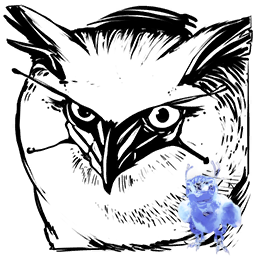 | [Snow Owl Ghost](https://ark.wiki.gg/wiki/Snow_Owl_Ghost) | 幽灵雪鸮 | https://ark.wiki.gg/wiki/Snow_Owl_Ghost | Event Creatures | Owl | Ghost_Owl_Character_BP_C | `Blueprint'/Game/Extinction/Dinos/Owl/Ghost_Owl_Character_BP.Ghost_Owl_Character_BP'` |
|  | [Velonasaur](https://ark.wiki.gg/wiki/Velonasaur) | 刺面龙 | https://ark.wiki.gg/wiki/Velonasaur | Fantasy Creatures | Velonasaur | Spindles_Character_BP_C | `Blueprint'/Game/Extinction/Dinos/Spindles/Spindles_Character_BP.Spindles_Character_BP'` |

## Creatures of Valguero

| 图标 | 名称 | 名称（中文） | 详情页 | 分类 | Name Tag | Entity ID | Blueprint Path |
| ------ | ------ | ------------ | -------- | ------ | ---------- | ----------- | ---------------- |
| 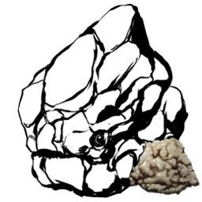 | [Chalk Golem](https://ark.wiki.gg/wiki/Chalk_Golem) | 黏土巨像 | https://ark.wiki.gg/wiki/Chalk_Golem | Fantasy Creatures | RockElemental | ChalkGolem_Character_BP_C | `Blueprint'/Game/Mods/Valguero/Assets/Dinos/RockGolem/ChalkGolem/ChalkGolem_Character_BP.ChalkGolem_Character_BP'` |
|  | [Deinonychus](https://ark.wiki.gg/wiki/Deinonychus) | 恐爪龙 | https://ark.wiki.gg/wiki/Deinonychus | Dinosaurs | Deinonychus | Deinonychus_Character_BP_C | `Blueprint'/Game/PrimalEarth/Dinos/Raptor/Uberraptor/Deinonychus_Character_BP.Deinonychus_Character_BP'` |
| 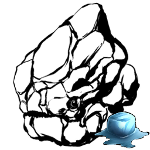 | [Ice Golem](https://ark.wiki.gg/wiki/Ice_Golem) | 寒冰巨像 | https://ark.wiki.gg/wiki/Ice_Golem | Fantasy Creatures | RockElemental | IceGolem_Character_BP_C | `Blueprint'/Game/PrimalEarth/Dinos/IceGolem/IceGolem_Character_BP.IceGolem_Character_BP'` |
|  | [Megaraptor](https://ark.wiki.gg/wiki/Megaraptor) | 大盗龙 | https://ark.wiki.gg/wiki/Megaraptor | Dinosaurs | Megaraptor | ValMegaraptor_Character_BP_C | `Blueprint'/Game/ASA/Dinos/Megaraptor/ValMegaraptor_Character_BP.ValMegaraptor_Character_BP'` |

## Creatures of Genesis: Part 1

| 图标 | 名称 | 名称（中文） | 详情页 | 分类 | Name Tag | Entity ID | Blueprint Path |
| ------ | ------ | ------------ | -------- | ------ | ---------- | ----------- | ---------------- |
|  | [Alpha Corrupted Master Controller](https://ark.wiki.gg/wiki/Alpha_Corrupted_Master_Controller) |  | https://ark.wiki.gg/wiki/Alpha_Corrupted_Master_Controller | Bosses |  | VRMainBoss_Character_Hard_C | `Blueprint'/Game/Genesis/Dinos/VRMainBoss/VRMainBoss_Character_Hard.VRMainBoss_Character_Hard'` |
|  | [Alpha Moeder, Master of the Ocean](https://ark.wiki.gg/wiki/Alpha_Moeder,_Master_of_the_Ocean) |  | https://ark.wiki.gg/wiki/Alpha_Moeder,_Master_of_the_Ocean | Bosses | EelBoss | EelBoss_Character_BP_Hard_C | `Blueprint'/Game/Genesis/Dinos/EelBoss/EelBoss_Character_BP_Hard.EelBoss_Character_BP_Hard'` |
|  | [Alpha X-Triceratops](https://ark.wiki.gg/wiki/Alpha_X-Triceratops) | 精英X-三角龙 | https://ark.wiki.gg/wiki/Alpha_X-Triceratops | Alpha Creatures | Trike | Volcano_Trike_Character_BP_Retrieve_Alpha_C | `Blueprint'/Game/Genesis/Dinos/MissionVariants/Retrieve/Volcanic/Volcano_Trike_Character_BP_Retrieve_Alpha.Volcano_Trike_Character_BP_Retrieve_Alpha'` |
|  | [Astrocetus](https://ark.wiki.gg/wiki/Astrocetus) | 星辰鲸 | https://ark.wiki.gg/wiki/Astrocetus | Fantasy Creatures | Space Whale | SpaceWhale_Character_BP_C | `Blueprint'/Game/Genesis/Dinos/SpaceWhale/SpaceWhale_Character_BP.SpaceWhale_Character_BP'` |
|  | [Beta Corrupted Master Controller](https://ark.wiki.gg/wiki/Beta_Corrupted_Master_Controller) |  | https://ark.wiki.gg/wiki/Beta_Corrupted_Master_Controller | Bosses |  | VRMainBoss_Character_Medium_C | `Blueprint'/Game/Genesis/Dinos/VRMainBoss/VRMainBoss_Character_Medium.VRMainBoss_Character_Medium'` |
|  | [Beta Moeder, Master of the Ocean](https://ark.wiki.gg/wiki/Beta_Moeder,_Master_of_the_Ocean) |  | https://ark.wiki.gg/wiki/Beta_Moeder,_Master_of_the_Ocean | Bosses | EelBoss | EelBoss_Character_BP_Medium_C | `Blueprint'/Game/Genesis/Dinos/EelBoss/EelBoss_Character_BP_Medium.EelBoss_Character_BP_Medium'` |
|  | [Bloodstalker](https://ark.wiki.gg/wiki/Bloodstalker) | 血蛛 | https://ark.wiki.gg/wiki/Bloodstalker | Fantasy Creatures | Bloodstalker | BogSpider_Character_BP_C | `Blueprint'/Game/Genesis/Dinos/BogSpider/BogSpider_Character_BP.BogSpider_Character_BP'` |
|  | [Brute Araneo](https://ark.wiki.gg/wiki/Brute_Araneo) | 凶恶蜘蛛 | https://ark.wiki.gg/wiki/Brute_Araneo | Brute Creatures | Spider | SpiderS_Character_BP_Hunt_C | `Blueprint'/Game/Genesis/Dinos/MissionVariants/Hunt/Bog/SpiderS_Character_BP_Hunt.SpiderS_Character_BP_Hunt'` |
|  | [Brute Astrocetus](https://ark.wiki.gg/wiki/Brute_Astrocetus) | 凶恶星辰鲸 | https://ark.wiki.gg/wiki/Brute_Astrocetus | Brute Creatures | Space Whale | SpaceWhale_Character_BP_Brute_C | `Blueprint'/Game/Genesis/Dinos/MissionVariants/Hunt/Lunar/SpaceWhale_Character_BP_Brute.SpaceWhale_Character_BP_Brute'` |
|  | [Brute Basilosaurus](https://ark.wiki.gg/wiki/Brute_Basilosaurus) | 凶恶龙王鲸 | https://ark.wiki.gg/wiki/Brute_Basilosaurus | Brute Creatures | Basilosaurus | Basilosaurus_Character_BP_Hunt_C | `Blueprint'/Game/Genesis/Dinos/MissionVariants/Hunt/Ocean/Basilosaurus_Character_BP_Hunt.Basilosaurus_Character_BP_Hunt'` |
|  | [Brute Bloodstalker](https://ark.wiki.gg/wiki/Brute_Bloodstalker) | 凶恶血蛛 | https://ark.wiki.gg/wiki/Brute_Bloodstalker | Brute Creatures | Bloodstalker | BogSpider_Character_BP_Hunt_C | `Blueprint'/Game/Genesis/Dinos/MissionVariants/Hunt/Bog/BogSpider_Character_BP_Hunt.BogSpider_Character_BP_Hunt'` |
|  | [Brute Ferox](https://ark.wiki.gg/wiki/Brute_Ferox) | 凶恶猿狐 | https://ark.wiki.gg/wiki/Brute_Ferox | Brute Creatures | Bigly | Shapeshifter_Large_Character_BP_Hunt_C | `Blueprint'/Game/Genesis/Dinos/MissionVariants/Hunt/Arctic/Shapeshifter_Large_Character_BP_Hunt.Shapeshifter_Large_Character_BP_Hunt'` |
|  | [Brute Fire Wyvern](https://ark.wiki.gg/wiki/Brute_Fire_Wyvern) | 凶恶火焰飞龙 | https://ark.wiki.gg/wiki/Brute_Fire_Wyvern | Brute Creatures | Wyvern | Wyvern_Character_BP_Fire_GauntletBoss_C | `Blueprint'/Game/Genesis/Dinos/MissionVariants/Gauntlet/Volcanic/Wyvern_Character_BP_Fire_GauntletBoss.Wyvern_Character_BP_Fire_GauntletBoss'` |
|  | [Brute Leedsichthys](https://ark.wiki.gg/wiki/Brute_Leedsichthys) | 凶恶利兹鱼 | https://ark.wiki.gg/wiki/Brute_Leedsichthys | Brute Creatures | Leedsichthys | Leedsichthys_Character_BP_Hunt_C | `Blueprint'/Game/Genesis/Dinos/MissionVariants/Hunt/Ocean/Leedsichthys_Character_BP_Hunt.Leedsichthys_Character_BP_Hunt'` |
|  | [Brute Magmasaur](https://ark.wiki.gg/wiki/Brute_Magmasaur) | 凶恶熔岩龙 | https://ark.wiki.gg/wiki/Brute_Magmasaur | Brute Creatures | LavaLizard | Cherufe_Character_BP_Hunt_C | `Blueprint'/Game/Genesis/Dinos/MissionVariants/Hunt/Volcanic/Cherufe_Character_BP_Hunt.Cherufe_Character_BP_Hunt'` |
|  | [Brute Malfunctioned Tek Giganotosaurus](https://ark.wiki.gg/wiki/Brute_Malfunctioned_Tek_Giganotosaurus) | 发生故障的凶恶泰克南方巨兽龙 | https://ark.wiki.gg/wiki/Brute_Malfunctioned_Tek_Giganotosaurus | Brute Creatures | Gigant | BionicGigant_Character_BP_Malfunctioned_Hunt_C | `Blueprint'/Game/Genesis/Dinos/MissionVariants/Hunt/Lunar/BionicGigant_Character_BP_Malfunctioned_Hunt.BionicGigant_Character_BP_Malfunctioned_Hunt'` |
|  | [Brute Malfunctioned Tek Rex](https://ark.wiki.gg/wiki/Brute_Malfunctioned_Tek_Rex) | 发生故障的凶恶泰克霸王龙 | https://ark.wiki.gg/wiki/Brute_Malfunctioned_Tek_Rex | Brute Creatures | Rex | BionicRex_Character_BP_Malfunctioned_Hunt_C | `Blueprint'/Game/Genesis/Dinos/MissionVariants/Hunt/Lunar/BionicRex_Character_BP_Malfunctioned_Hunt.BionicRex_Character_BP_Malfunctioned_Hunt'` |
|  | [Brute Mammoth](https://ark.wiki.gg/wiki/Brute_Mammoth) | 凶恶猛犸象 | https://ark.wiki.gg/wiki/Brute_Mammoth | Brute Creatures | Mammoth | Mammoth_Character_BP_Hunt_C | `Blueprint'/Game/Genesis/Dinos/MissionVariants/Hunt/Arctic/Mammoth_Character_BP_Hunt.Mammoth_Character_BP_Hunt'` |
|  | [Brute Megaloceros](https://ark.wiki.gg/wiki/Brute_Megaloceros) | 凶恶大角鹿 | https://ark.wiki.gg/wiki/Brute_Megaloceros | Brute Creatures | Stag | Stag_Character_BP_Hunt_C | `Blueprint'/Game/Genesis/Dinos/MissionVariants/Hunt/Arctic/Stag_Character_BP_Hunt.Stag_Character_BP_Hunt'` |
|  | [Brute Plesiosaur](https://ark.wiki.gg/wiki/Brute_Plesiosaur) | 凶恶蛇颈龙 | https://ark.wiki.gg/wiki/Brute_Plesiosaur | Brute Creatures | Plesiosaur | Plesiosaur_Character_BP_Hunt_C | `Blueprint'/Game/Genesis/Dinos/MissionVariants/Hunt/Ocean/Plesiosaur_Character_BP_Hunt.Plesiosaur_Character_BP_Hunt'` |
|  | [Brute Reaper King](https://ark.wiki.gg/wiki/Brute_Reaper_King) | 凶恶死神国王 | https://ark.wiki.gg/wiki/Brute_Reaper_King | Brute Creatures | Xenomorph | Xenomorph_Character_BP_Male_InitialBuryOnly_Hunt_C | `Blueprint'/Game/Genesis/Dinos/MissionVariants/Hunt/Lunar/Xenomorph_Character_BP_Male_InitialBuryOnly_Hunt.Xenomorph_Character_BP_Male_InitialBuryOnly_Hunt'` |
|  | [Brute Sarco](https://ark.wiki.gg/wiki/Brute_Sarco) | 凶恶帝鳄 | https://ark.wiki.gg/wiki/Brute_Sarco | Brute Creatures | Sarco | Sarco_Character_BP_Hunt_C | `Blueprint'/Game/Genesis/Dinos/MissionVariants/Hunt/Bog/Sarco_Character_BP_Hunt.Sarco_Character_BP_Hunt'` |
|  | [Brute Seeker](https://ark.wiki.gg/wiki/Brute_Seeker) | 凶恶追寻者 | https://ark.wiki.gg/wiki/Brute_Seeker | Brute Creatures | Seeker | Pteroteuthis_Char_BP_HuntFollower_C | `Blueprint'/Game/Genesis/Dinos/MissionVariants/Hunt/Lunar/Pteroteuthis_Char_BP_HuntFollower.Pteroteuthis_Char_BP_HuntFollower'` |
|  | [Brute Tusoteuthis](https://ark.wiki.gg/wiki/Brute_Tusoteuthis) | 凶恶托斯特巨鱿 | https://ark.wiki.gg/wiki/Brute_Tusoteuthis | Brute Creatures | Tusoteuthis | Tusoteuthis_Character_BP_Hunt_C | `Blueprint'/Game/Genesis/Dinos/MissionVariants/Hunt/Ocean/Tusoteuthis_Character_BP_Hunt.Tusoteuthis_Character_BP_Hunt'` |
|  | [Brute X-Allosaurus](https://ark.wiki.gg/wiki/Brute_X-Allosaurus) | 凶恶X-异特龙 | https://ark.wiki.gg/wiki/Brute_X-Allosaurus | Brute Creatures | Allo | Volcano_Allo_Character_BP_Hunt_C | `Blueprint'/Game/Genesis/Dinos/MissionVariants/Hunt/Volcanic/Volcano_Allo_Character_BP_Hunt.Volcano_Allo_Character_BP_Hunt'` |
|  | [Brute X-Megalodon](https://ark.wiki.gg/wiki/Brute_X-Megalodon) | 凶恶X-巨齿鲨 | https://ark.wiki.gg/wiki/Brute_X-Megalodon | Brute Creatures | Mega | Ocean_Megalodon_Character_BP_Hunt_C | `Blueprint'/Game/Genesis/Dinos/MissionVariants/Hunt/Ocean/Ocean_Megalodon_Character_BP_Hunt.Ocean_Megalodon_Character_BP_Hunt'` |
|  | [Brute X-Mosasaurus](https://ark.wiki.gg/wiki/Brute_X-Mosasaurus) | 凶恶X-沧龙 | https://ark.wiki.gg/wiki/Brute_X-Mosasaurus | Brute Creatures | Mosasaur | Ocean_Mosa_Character_BP_Hunt_C | `Blueprint'/Game/Genesis/Dinos/MissionVariants/Hunt/Ocean/Ocean_Mosa_Character_BP_Hunt.Ocean_Mosa_Character_BP_Hunt'` |
|  | [Brute X-Raptor](https://ark.wiki.gg/wiki/Brute_X-Raptor) | 凶恶X-迅猛龙 | https://ark.wiki.gg/wiki/Brute_X-Raptor | Brute Creatures | Raptor | Bog_Raptor_Character_BP_Hunt_C | `Blueprint'/Game/Genesis/Dinos/MissionVariants/Hunt/Bog/Bog_Raptor_Character_BP_Hunt.Bog_Raptor_Character_BP_Hunt'` |
|  | [Brute X-Rex](https://ark.wiki.gg/wiki/Brute_X-Rex) | 凶恶X-霸王龙 | https://ark.wiki.gg/wiki/Brute_X-Rex | Brute Creatures | Rex | Volcano_Rex_Character_BP_Hunt_C | `Blueprint'/Game/Genesis/Dinos/MissionVariants/Hunt/Volcanic/Volcano_Rex_Character_BP_Hunt.Volcano_Rex_Character_BP_Hunt'` |
|  | [Brute X-Rock Elemental](https://ark.wiki.gg/wiki/Brute_X-Rock_Elemental) | 凶恶X-岩石巨人 | https://ark.wiki.gg/wiki/Brute_X-Rock_Elemental | Brute Creatures | RockElemental | Volcano_Golem_Character_BP_Hunt_C | `Blueprint'/Game/Genesis/Dinos/MissionVariants/Hunt/Volcanic/Volcano_Golem_Character_BP_Hunt.Volcano_Golem_Character_BP_Hunt'` |
|  | [Brute X-Spino](https://ark.wiki.gg/wiki/Brute_X-Spino) | 凶恶X-棘龙 | https://ark.wiki.gg/wiki/Brute_X-Spino | Brute Creatures | Spino | Bog_Spino_Character_BP_Hunt_C | `Blueprint'/Game/Genesis/Dinos/MissionVariants/Hunt/Bog/Bog_Spino_Character_BP_Hunt.Bog_Spino_Character_BP_Hunt'` |
|  | [Brute X-Yutyrannus](https://ark.wiki.gg/wiki/Brute_X-Yutyrannus) | 凶恶X-羽王龙 | https://ark.wiki.gg/wiki/Brute_X-Yutyrannus | Brute Creatures | Yutyrannus | Snow_Yutyrannus_Character_BP_Hunt_C | `Blueprint'/Game/Genesis/Dinos/MissionVariants/Hunt/Arctic/Snow_Yutyrannus_Character_BP_Hunt.Snow_Yutyrannus_Character_BP_Hunt'` |
|  | [Corrupted Avatar](https://ark.wiki.gg/wiki/Corrupted_Avatar) | 腐化化身 | https://ark.wiki.gg/wiki/Corrupted_Avatar | Mammals | ? | Bot_Character_BP_C | `Blueprint'/Game/Genesis/Dinos/Bots/Bot_Character_BP.Bot_Character_BP'` |
|  | [Eel Minion](https://ark.wiki.gg/wiki/Eel_Minion) | 电鳗爪牙 | https://ark.wiki.gg/wiki/Eel_Minion | Fantasy Creatures |  | EelMinion_Character_BP_Easy_C | `Blueprint'/Game/Genesis/Dinos/EelBoss/EelMinion_Character_BP_Easy.EelMinion_Character_BP_Easy'` |
|  | [Gamma Corrupted Master Controller](https://ark.wiki.gg/wiki/Gamma_Corrupted_Master_Controller) |  | https://ark.wiki.gg/wiki/Gamma_Corrupted_Master_Controller | Bosses |  | VRMainBoss_Character_Easy_C | `Blueprint'/Game/Genesis/Dinos/VRMainBoss/VRMainBoss_Character_Easy.VRMainBoss_Character_Easy'` |
| 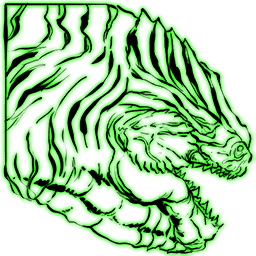 | [Gamma Moeder, Master of the Ocean](https://ark.wiki.gg/wiki/Gamma_Moeder,_Master_of_the_Ocean) |  | https://ark.wiki.gg/wiki/Gamma_Moeder,_Master_of_the_Ocean | Bosses | EelBoss | EelBoss_Character_BP_Easy_C | `Blueprint'/Game/Genesis/Dinos/EelBoss/EelBoss_Character_BP_Easy.EelBoss_Character_BP_Easy'` |
|  | [Golden Striped Brute Megalodon](https://ark.wiki.gg/wiki/Golden_Striped_Brute_Megalodon) | 金纹凶暴巨齿鲨 | https://ark.wiki.gg/wiki/Golden_Striped_Brute_Megalodon | Brute Creatures | Mega | Ocean_Megalodon_Character_BP_Retrieve_Brute_C | `Blueprint'/Game/Genesis/Dinos/MissionVariants/Retrieve/Ocean/Ocean_Megalodon_Character_BP_Retrieve_Brute.Ocean_Megalodon_Character_BP_Retrieve_Brute'` |
|  | [Golden Striped Megalodon](https://ark.wiki.gg/wiki/Golden_Striped_Megalodon) | 金纹巨齿鲨 | https://ark.wiki.gg/wiki/Golden_Striped_Megalodon | X-Creatures | Mega | Ocean_Megalodon_Character_BP_Retrieve_C | `Blueprint'/Game/Genesis/Dinos/MissionVariants/Retrieve/Ocean/Ocean_Megalodon_Character_BP_Retrieve.Ocean_Megalodon_Character_BP_Retrieve'` |
|  | [Golden Striped Megalodon](https://ark.wiki.gg/wiki/Golden_Striped_Megalodon) | 金纹巨齿鲨 | https://ark.wiki.gg/wiki/Golden_Striped_Megalodon | X-Creatures | Mega | Ocean_Megalodon_Character_BP_Retrieve_C | `Blueprint'/Game/Genesis/Dinos/MissionVariants/Retrieve/Ocean/Ocean_Megalodon_Character_BP_Retrieve.Ocean_Megalodon_Character_BP_Retrieve'` |
|  | [Hover Skiff](https://ark.wiki.gg/wiki/Hover_Skiff) | 悬浮艇 | https://ark.wiki.gg/wiki/Hover_Skiff | Vehicles | Hover Skiff | TekHoverSkiff_Character_BP_C | `Blueprint'/Game/Genesis/Dinos/TekHoverSkiff/TekHoverSkiff_Character_BP.TekHoverSkiff_Character_BP'` |
|  | [Ferox (Large)](https://ark.wiki.gg/wiki/Ferox_(Large)) |  | https://ark.wiki.gg/wiki/Ferox_(Large) | Fantasy Creatures | Bigly | Shapeshifter_Large_Character_BP_C | `Blueprint'/Game/Genesis/Dinos/Shapeshifter/Shapeshifter_Large/Shapeshifter_Large_Character_BP.Shapeshifter_Large_Character_BP'` |
|  | [Ferox](https://ark.wiki.gg/wiki/Ferox) | 猿狐 | https://ark.wiki.gg/wiki/Ferox | Fantasy Creatures | Gremlin | Shapeshifter_Small_Character_BP_C | `Blueprint'/Game/Genesis/Dinos/Shapeshifter/Shapeshifter_Small/Shapeshifter_Small_Character_BP.Shapeshifter_Small_Character_BP'` |
|  | [Injured Brute Reaper King](https://ark.wiki.gg/wiki/Injured_Brute_Reaper_King) | 受伤的凶恶死神国王 | https://ark.wiki.gg/wiki/Injured_Brute_Reaper_King | Brute Creatures | Xenomorph | Xenomorph_Character_BP_Male_InitialBuryOnly_Brute_Retrieve_C | `Blueprint'/Game/Genesis/Dinos/MissionVariants/Retrieve/Lunar/Xenomorph_Character_BP_Male_InitialBuryOnly_Brute_Retrieve.Xenomorph_Character_BP_Male_InitialBuryOnly_Brute_Retrieve'` |
|  | [Insect Swarm](https://ark.wiki.gg/wiki/Insect_Swarm) | 虫群 | https://ark.wiki.gg/wiki/Insect_Swarm | Fantasy Creatures | InsectSwarm | InsectSwarmChar_BP_C | `Blueprint'/Game/Genesis/Dinos/Swarms/InsectSwarmChar_BP.InsectSwarmChar_BP'` |
|  | [Magmasaur](https://ark.wiki.gg/wiki/Magmasaur) | 熔岩龙 | https://ark.wiki.gg/wiki/Magmasaur | Fantasy Creatures | LavaLizard | Cherufe_Character_BP_C | `Blueprint'/Game/Genesis/Dinos/Cherufe/Cherufe_Character_BP.Cherufe_Character_BP'` |
|  | [Malfunctioned Tek Giganotosaurus](https://ark.wiki.gg/wiki/Malfunctioned_Tek_Giganotosaurus) | 发生故障的泰克南方巨兽龙 | https://ark.wiki.gg/wiki/Malfunctioned_Tek_Giganotosaurus | Malfunctioned Tek Creatures | Gigant | BionicGigant_Character_BP_Malfunctioned_Gauntlet_C | `Blueprint'/Game/Genesis/Dinos/MissionVariants/Gauntlet/Lunar/BionicGigant_Character_BP_Malfunctioned_Gauntlet.BionicGigant_Character_BP_Malfunctioned_Gauntlet'` |
|  | [Malfunctioned Tek Giganotosaurus](https://ark.wiki.gg/wiki/Malfunctioned_Tek_Giganotosaurus) | 发生故障的泰克南方巨兽龙 | https://ark.wiki.gg/wiki/Malfunctioned_Tek_Giganotosaurus | Malfunctioned Tek Creatures | Gigant | BionicGigant_Character_BP_Malfunctioned_C | `Blueprint'/Game/PrimalEarth/Dinos/Giganotosaurus/BionicGigant_Character_BP_Malfunctioned.BionicGigant_Character_BP_Malfunctioned'` |
|  | [Malfunctioned Tek Parasaur](https://ark.wiki.gg/wiki/Malfunctioned_Tek_Parasaur) | 发生故障的泰克副栉龙 | https://ark.wiki.gg/wiki/Malfunctioned_Tek_Parasaur | Malfunctioned Tek Creatures | Para | BionicPara_Character_BP_Malfunctioned_C | `Blueprint'/Game/PrimalEarth/Dinos/Para/BionicPara_Character_BP_Malfunctioned.BionicPara_Character_BP_Malfunctioned'` |
|  | [Malfunctioned Tek Quetzal](https://ark.wiki.gg/wiki/Malfunctioned_Tek_Quetzal) | 发生故障的泰克风神翼龙 | https://ark.wiki.gg/wiki/Malfunctioned_Tek_Quetzal | Malfunctioned Tek Creatures | Quetz | BionicQuetz_Character_BP_Malfunctioned_C | `Blueprint'/Game/PrimalEarth/Dinos/Quetzalcoatlus/BionicQuetz_Character_BP_Malfunctioned.BionicQuetz_Character_BP_Malfunctioned'` |
|  | [Malfunctioned Tek Raptor](https://ark.wiki.gg/wiki/Malfunctioned_Tek_Raptor) | 发生故障的泰克迅猛龙 | https://ark.wiki.gg/wiki/Malfunctioned_Tek_Raptor | Malfunctioned Tek Creatures | Raptor | BionicRaptor_Character_BP_Malfunctioned_C | `Blueprint'/Game/PrimalEarth/Dinos/Raptor/BionicRaptor_Character_BP_Malfunctioned.BionicRaptor_Character_BP_Malfunctioned'` |
|  | [Malfunctioned Tek Rex](https://ark.wiki.gg/wiki/Malfunctioned_Tek_Rex) | 发生故障的泰克霸王龙 | https://ark.wiki.gg/wiki/Malfunctioned_Tek_Rex | Malfunctioned Tek Creatures | Rex | BionicRex_Character_BP_Malfunctioned_C | `Blueprint'/Game/PrimalEarth/Dinos/Rex/BionicRex_Character_BP_Malfunctioned.BionicRex_Character_BP_Malfunctioned'` |
|  | [Malfunctioned Tek Stegosaurus](https://ark.wiki.gg/wiki/Malfunctioned_Tek_Stegosaurus) | 发生故障的泰克剑龙 | https://ark.wiki.gg/wiki/Malfunctioned_Tek_Stegosaurus | Malfunctioned Tek Creatures | Stego | BionicStego_Character_BP_Malfunctioned_C | `Blueprint'/Game/PrimalEarth/Dinos/Stego/BionicStego_Character_BP_Malfunctioned.BionicStego_Character_BP_Malfunctioned'` |
|  | [Malfunctioned Tek Triceratops](https://ark.wiki.gg/wiki/Malfunctioned_Tek_Triceratops) | 发生故障的泰克三角龙 | https://ark.wiki.gg/wiki/Malfunctioned_Tek_Triceratops | Malfunctioned Tek Creatures | Trike | BionicTrike_Character_BP_Malfunctioned_C | `Blueprint'/Game/PrimalEarth/Dinos/Trike/BionicTrike_Character_BP_Malfunctioned.BionicTrike_Character_BP_Malfunctioned'` |
|  | [Megachelon](https://ark.wiki.gg/wiki/Megachelon) | 岛龟 | https://ark.wiki.gg/wiki/Megachelon | Fantasy Creatures | GiantTurtle | GiantTurtle_Character_BP_C | `Blueprint'/Game/Genesis/Dinos/GiantTurtle/GiantTurtle_Character_BP.GiantTurtle_Character_BP'` |
|  | [Parakeet Fish School](https://ark.wiki.gg/wiki/Parakeet_Fish_School) | 鹦鹉鱼群 | https://ark.wiki.gg/wiki/Parakeet_Fish_School | Fantasy Creatures | Swarm | MicrobeSwarmChar_BP_C | `Blueprint'/Game/Genesis/Dinos/Swarms/MicrobeSwarmChar_BP.MicrobeSwarmChar_BP'` |
| 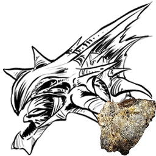 | [Reaper Prince](https://ark.wiki.gg/wiki/Reaper_Prince) | 死神王子 | https://ark.wiki.gg/wiki/Reaper_Prince | Fantasy Creatures | Xenomorph | Xenomorph_Character_BP_Male_InitialBuryOnly_Adolescent_C | `Blueprint'/Game/Aberration/Dinos/Nameless/Xenomorph_Character_BP_Male_InitialBuryOnly_Adolescent.Xenomorph_Character_BP_Male_InitialBuryOnly_Adolescent'` |
| 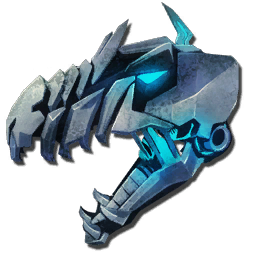 | [Tek Giganotosaurus](https://ark.wiki.gg/wiki/Tek_Giganotosaurus) | 泰克南方巨兽龙 | https://ark.wiki.gg/wiki/Tek_Giganotosaurus | Tek Creatures | Gigant | BionicGigant_Character_BP_C | `Blueprint'/Game/PrimalEarth/Dinos/Giganotosaurus/BionicGigant_Character_BP.BionicGigant_Character_BP'` |
|  | [Tek Triceratops](https://ark.wiki.gg/wiki/Tek_Triceratops) | 泰克三角龙 | https://ark.wiki.gg/wiki/Tek_Triceratops | Tek Creatures | Trike | BionicTrike_Character_BP_C | `Blueprint'/Game/PrimalEarth/Dinos/Trike/BionicTrike_Character_BP.BionicTrike_Character_BP'` |
|  | [X-Allosaurus](https://ark.wiki.gg/wiki/X-Allosaurus) | X-异特龙 | https://ark.wiki.gg/wiki/X-Allosaurus | X-Creatures | Allo | Volcano_Allo_Character_BP_C | `Blueprint'/Game/Genesis/Dinos/BiomeVariants/Volcano_Allosaurus/Volcano_Allo_Character_BP.Volcano_Allo_Character_BP'` |
|  | [X-Ankylosaurus](https://ark.wiki.gg/wiki/X-Ankylosaurus) | X-甲龙 | https://ark.wiki.gg/wiki/X-Ankylosaurus | X-Creatures | Anky | Volcano_Ankylo_Character_BP_C | `Blueprint'/Game/Genesis/Dinos/BiomeVariants/Volcano_Ankylosaurus/Volcano_Ankylo_Character_BP.Volcano_Ankylo_Character_BP'` |
|  | [X-Argentavis](https://ark.wiki.gg/wiki/X-Argentavis) | X-阿根廷鹫 | https://ark.wiki.gg/wiki/X-Argentavis | X-Creatures | Argent | Snow_Argent_Character_BP_C | `Blueprint'/Game/Genesis/Dinos/BiomeVariants/Snow_Argentavis/Snow_Argent_Character_BP.Snow_Argent_Character_BP'` |
|  | [X-Basilosaurus](https://ark.wiki.gg/wiki/X-Basilosaurus) | X-龙王鲸 | https://ark.wiki.gg/wiki/X-Basilosaurus | X-Creatures | Basilosaurus | Ocean_Basilosaurus_Character_BP_C | `Blueprint'/Game/Genesis/Dinos/BiomeVariants/Ocean_Basilosaurus/Ocean_Basilosaurus_Character_BP.Ocean_Basilosaurus_Character_BP'` |
|  | [X-Dunkleosteus](https://ark.wiki.gg/wiki/X-Dunkleosteus) | X-邓氏鱼 | https://ark.wiki.gg/wiki/X-Dunkleosteus | X-Creatures | Dunkle | Ocean_Dunkle_Character_BP_C | `Blueprint'/Game/Genesis/Dinos/BiomeVariants/Ocean_Dunkleosteus/Ocean_Dunkle_Character_BP.Ocean_Dunkle_Character_BP'` |
|  | [X-Ichthyosaurus](https://ark.wiki.gg/wiki/X-Ichthyosaurus) | X-鱼龙 | https://ark.wiki.gg/wiki/X-Ichthyosaurus | X-Creatures | Dolphin | Ocean_Dolphin_Character_BP_C | `Blueprint'/Game/Genesis/Dinos/BiomeVariants/Ocean_Dolphin/Ocean_Dolphin_Character_BP.Ocean_Dolphin_Character_BP'` |
|  | [X-Megalodon](https://ark.wiki.gg/wiki/X-Megalodon) | X-巨齿鲨 | https://ark.wiki.gg/wiki/X-Megalodon | X-Creatures | Mega | Ocean_Megalodon_Character_BP_C | `Blueprint'/Game/Genesis/Dinos/BiomeVariants/Ocean_Megalodon/Ocean_Megalodon_Character_BP.Ocean_Megalodon_Character_BP'` |
|  | [X-Mosasaurus](https://ark.wiki.gg/wiki/X-Mosasaurus) | X-沧龙 | https://ark.wiki.gg/wiki/X-Mosasaurus | X-Creatures | Mosasaur | Ocean_Mosa_Character_BP_C | `Blueprint'/Game/Genesis/Dinos/BiomeVariants/Ocean_Mosasaurus/Ocean_Mosa_Character_BP.Ocean_Mosa_Character_BP'` |
|  | [X-Otter](https://ark.wiki.gg/wiki/X-Otter) | X-水獭 | https://ark.wiki.gg/wiki/X-Otter | X-Creatures | Otter | Snow_Otter_Character_BP_C | `Blueprint'/Game/Genesis/Dinos/BiomeVariants/Snow_Otter/Snow_Otter_Character_BP.Snow_Otter_Character_BP'` |
|  | [X-Paraceratherium](https://ark.wiki.gg/wiki/X-Paraceratherium) | X-巨犀 | https://ark.wiki.gg/wiki/X-Paraceratherium | X-Creatures | Paracer | Bog_Paracer_Character_BP_C | `Blueprint'/Game/Genesis/Dinos/BiomeVariants/BogParaceratherium/Bog_Paracer_Character_BP.Bog_Paracer_Character_BP'` |
|  | [X-Parasaur](https://ark.wiki.gg/wiki/X-Parasaur) | X-副栉龙 | https://ark.wiki.gg/wiki/X-Parasaur | X-Creatures | Para | Bog_Para_Character_BP_C | `Blueprint'/Game/Genesis/Dinos/BiomeVariants/BogPara/Bog_Para_Character_BP.Bog_Para_Character_BP'` |
|  | [X-Raptor](https://ark.wiki.gg/wiki/X-Raptor) | X-迅猛龙 | https://ark.wiki.gg/wiki/X-Raptor | X-Creatures | Raptor | Bog_Raptor_Character_BP_C | `Blueprint'/Game/Genesis/Dinos/BiomeVariants/Bog_Raptor/Bog_Raptor_Character_BP.Bog_Raptor_Character_BP'` |
|  | [X-Rex](https://ark.wiki.gg/wiki/X-Rex) | X-霸王龙 | https://ark.wiki.gg/wiki/X-Rex | X-Creatures | Rex | Volcano_Rex_Character_BP_C | `Blueprint'/Game/Genesis/Dinos/BiomeVariants/Volcano_Rex/Volcano_Rex_Character_BP.Volcano_Rex_Character_BP'` |
|  | [X-Rock Elemental](https://ark.wiki.gg/wiki/X-Rock_Elemental) | X-岩石巨人 | https://ark.wiki.gg/wiki/X-Rock_Elemental | X-Creatures | RockElemental | Volcano_Golem_Character_BP_C | `Blueprint'/Game/Genesis/Dinos/BiomeVariants/Lava_Golem/Volcano_Golem_Character_BP.Volcano_Golem_Character_BP'` |
|  | [X-Sabertooth](https://ark.wiki.gg/wiki/X-Sabertooth) | X-刃齿虎 | https://ark.wiki.gg/wiki/X-Sabertooth | X-Creatures | Sabertooth | Snow_Saber_Character_BP_C | `Blueprint'/Game/Genesis/Dinos/BiomeVariants/Snow_Saber/Snow_Saber_Character_BP.Snow_Saber_Character_BP'` |
|  | [Rare X-Sabertooth Salmon](https://ark.wiki.gg/wiki/Rare_X-Sabertooth_Salmon) |  | https://ark.wiki.gg/wiki/Rare_X-Sabertooth_Salmon | X-Creatures | RareSalmon | Rare_Lunar_Salmon_Character_BP_C | `Blueprint'/Game/Genesis/Dinos/BiomeVariants/Lunar_Salmon/Rare_Lunar_Salmon_Character_BP.Rare_Lunar_Salmon_Character_BP'` |
|  | [X-Sabertooth Salmon](https://ark.wiki.gg/wiki/X-Sabertooth_Salmon) | X-剑齿鲑鱼 | https://ark.wiki.gg/wiki/X-Sabertooth_Salmon | X-Creatures | Salmon | Lunar_Salmon_Character_BP_C | `Blueprint'/Game/Genesis/Dinos/BiomeVariants/Lunar_Salmon/Lunar_Salmon_Character_BP.Lunar_Salmon_Character_BP'` |
|  | [X-Spino](https://ark.wiki.gg/wiki/X-Spino) | X-棘龙 | https://ark.wiki.gg/wiki/X-Spino | X-Creatures | Spino | Bog_Spino_Character_BP_C | `Blueprint'/Game/Genesis/Dinos/BiomeVariants/Bog_Spino/Bog_Spino_Character_BP.Bog_Spino_Character_BP'` |
|  | [X-Tapejara](https://ark.wiki.gg/wiki/X-Tapejara) | X-古神翼龙 | https://ark.wiki.gg/wiki/X-Tapejara | X-Creatures | Tapejara | Bog_Tapejara_Character_BP_C | `Blueprint'/Game/Genesis/Dinos/BiomeVariants/Bog_Tapejara/Bog_Tapejara_Character_BP.Bog_Tapejara_Character_BP'` |
|  | [X-Triceratops](https://ark.wiki.gg/wiki/X-Triceratops) | X-三角龙 | https://ark.wiki.gg/wiki/X-Triceratops | X-Creatures | Trike | Volcano_Trike_Character_BP_C | `Blueprint'/Game/Genesis/Dinos/BiomeVariants/Volcano_Trike/Volcano_Trike_Character_BP.Volcano_Trike_Character_BP'` |
|  | [X-Woolly Rhino](https://ark.wiki.gg/wiki/X-Woolly_Rhino) | X-披毛犀 | https://ark.wiki.gg/wiki/X-Woolly_Rhino | X-Creatures | Rhino | Snow_Rhino_Character_BP_C | `Blueprint'/Game/Genesis/Dinos/BiomeVariants/Snow_WoollyRhino/Snow_Rhino_Character_BP.Snow_Rhino_Character_BP'` |
|  | [X-Yutyrannus](https://ark.wiki.gg/wiki/X-Yutyrannus) | X-羽王龙 | https://ark.wiki.gg/wiki/X-Yutyrannus | X-Creatures | Yutyrannus | Snow_Yutyrannus_Character_BP_C | `Blueprint'/Game/Genesis/Dinos/BiomeVariants/Snow_Yutyrannus/Snow_Yutyrannus_Character_BP.Snow_Yutyrannus_Character_BP'` |

## Creatures of Crystal Isles

| 图标 | 名称 | 名称（中文） | 详情页 | 分类 | Name Tag | Entity ID | Blueprint Path |
| ------ | ------ | ------------ | -------- | ------ | ---------- | ----------- | ---------------- |
| 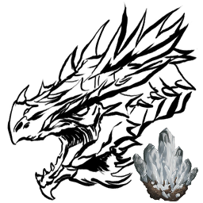 | [Alpha Blood Crystal Wyvern](https://ark.wiki.gg/wiki/Alpha_Blood_Crystal_Wyvern) | 精英血晶飞龙 | https://ark.wiki.gg/wiki/Alpha_Blood_Crystal_Wyvern | Alpha Creatures | Wyvern | CrystalWyvern_Character_BP_Mega_C | `Blueprint'/Game/PrimalEarth/Dinos/CrystalWyvern/CrystalWyvern_Character_BP_Mega.CrystalWyvern_Character_BP_Mega'` |
|  | [Blood Crystal Wyvern](https://ark.wiki.gg/wiki/Blood_Crystal_Wyvern) | 血晶飞龙 | https://ark.wiki.gg/wiki/Blood_Crystal_Wyvern | Fantasy Creatures | Wyvern | CrystalWyvern_Character_BP_Blood_C | `Blueprint'/Game/PrimalEarth/Dinos/CrystalWyvern/CrystalWyvern_Character_BP_Blood.CrystalWyvern_Character_BP_Blood'` |
| 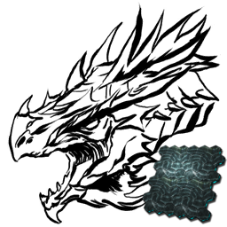 | [Crystal Wyvern Queen (Gamma)](https://ark.wiki.gg/wiki/Crystal_Wyvern_Queen_(Gamma)) | 水晶飞龙女皇 (简单) | https://ark.wiki.gg/wiki/Crystal_Wyvern_Queen_(Gamma) | Bosses | Wyvern | CrystalWyvern_Character_BP_Boss_Easy_C | `Blueprint'/Game/Mods/CrystalIsles/Assets/Dinos/CIBoss/CrystalWyvern_Character_BP_Boss_Easy.CrystalWyvern_Character_BP_Boss_Easy'` |
|  | [Crystal Wyvern Queen (Beta)](https://ark.wiki.gg/wiki/Crystal_Wyvern_Queen_(Beta)) | 水晶飞龙女皇 (中等) | https://ark.wiki.gg/wiki/Crystal_Wyvern_Queen_(Beta) | Bosses | Wyvern | CrystalWyvern_Character_BP_Boss_Medium_C | `Blueprint'/Game/Mods/CrystalIsles/Assets/Dinos/CIBoss/CrystalWyvern_Character_BP_Boss_Medium.CrystalWyvern_Character_BP_Boss_Medium'` |
|  | [Crystal Wyvern Queen (Alpha)](https://ark.wiki.gg/wiki/Crystal_Wyvern_Queen_(Alpha)) | 水晶飞龙女皇 (困难) | https://ark.wiki.gg/wiki/Crystal_Wyvern_Queen_(Alpha) | Bosses | Wyvern | CrystalWyvern_Character_BP_Boss_Hard_C | `Blueprint'/Game/Mods/CrystalIsles/Assets/Dinos/CIBoss/CrystalWyvern_Character_BP_Boss_Hard.CrystalWyvern_Character_BP_Boss_Hard'` |
|  | [Ember Crystal Wyvern](https://ark.wiki.gg/wiki/Ember_Crystal_Wyvern) | 灰烬水晶飞龙 | https://ark.wiki.gg/wiki/Ember_Crystal_Wyvern | Fantasy Creatures | Wyvern | CrystalWyvern_Character_BP_Ember_C | `Blueprint'/Game/PrimalEarth/Dinos/CrystalWyvern/CrystalWyvern_Character_BP_Ember.CrystalWyvern_Character_BP_Ember'` |
| 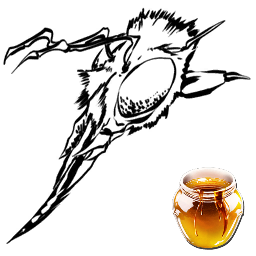 | [Giant Worker Bee](https://ark.wiki.gg/wiki/Giant_Worker_Bee) | 巨型工蜂 | https://ark.wiki.gg/wiki/Giant_Worker_Bee | Invertebrates | Bee | HoneyBee_Character_BP_C | `Blueprint'/Game/Mods/CrystalIsles/Assets/Dinos/HoneyBee/HoneyBee_Character_BP.HoneyBee_Character_BP'` |
|  | [Tropeognathus](https://ark.wiki.gg/wiki/Tropeognathus) | 脊颌翼龙 | https://ark.wiki.gg/wiki/Tropeognathus | Reptiles | Tropeognathus | Tropeognathus_Character_BP_C | `Blueprint'/Game/PrimalEarth/Dinos/Tropeognathus/Tropeognathus_Character_BP.Tropeognathus_Character_BP'` |
|  | [Tropical Crystal Wyvern](https://ark.wiki.gg/wiki/Tropical_Crystal_Wyvern) | 热带水晶飞龙 | https://ark.wiki.gg/wiki/Tropical_Crystal_Wyvern | Fantasy Creatures | Wyvern | CrystalWyvern_Character_BP_WS_C | `Blueprint'/Game/PrimalEarth/Dinos/CrystalWyvern/CrystalWyvern_Character_BP_WS.CrystalWyvern_Character_BP_WS'` |

## Creatures of Genesis: Part 2

| 图标 | 名称 | 名称（中文） | 详情页 | 分类 | Name Tag | Entity ID | Blueprint Path |
| ------ | ------ | ------------ | -------- | ------ | ---------- | ----------- | ---------------- |
|  | [Astrodelphis](https://ark.wiki.gg/wiki/Astrodelphis) | 星辰海豚 | https://ark.wiki.gg/wiki/Astrodelphis | Fantasy Creatures | Astrodelphis | SpaceDolphin_Character_BP_C | `Blueprint'/Game/Genesis2/Dinos/SpaceDolphin/SpaceDolphin_Character_BP.SpaceDolphin_Character_BP'` |
|  | [Maewing](https://ark.wiki.gg/wiki/Maewing) | 鸭嘴飞鼠 | https://ark.wiki.gg/wiki/Maewing | Fantasy Creatures | Maewing | MilkGlider_Character_BP_C | `Blueprint'/Game/Genesis2/Dinos/MilkGlider/MilkGlider_Character_BP.MilkGlider_Character_BP'` |
|  | [Noglin](https://ark.wiki.gg/wiki/Noglin) | 诺格林 | https://ark.wiki.gg/wiki/Noglin | Fantasy Creatures | BrainSlug | BrainSlug_Character_BP_C | `Blueprint'/Game/Genesis2/Dinos/BrainSlug/BrainSlug_Character_BP.BrainSlug_Character_BP'` |
|  | [Shadowmane](https://ark.wiki.gg/wiki/Shadowmane) | 影鬃 | https://ark.wiki.gg/wiki/Shadowmane | Fantasy Creatures | Lionfish Lion | LionfishLion_Character_BP_C | `Blueprint'/Game/Genesis2/Dinos/LionfishLion/LionfishLion_Character_BP.LionfishLion_Character_BP'` |
|  | [Tek Stryder](https://ark.wiki.gg/wiki/Tek_Stryder) | 泰克跨步者 | https://ark.wiki.gg/wiki/Tek_Stryder | Mechanical Creatures | TekStrider | TekStrider_Character_BP_C | `Blueprint'/Game/Genesis2/Dinos/TekStrider/TekStrider_Character_BP.TekStrider_Character_BP'` |
| 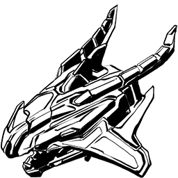 | [Voidwyrm](https://ark.wiki.gg/wiki/Voidwyrm) | 虚空飞龙 | https://ark.wiki.gg/wiki/Voidwyrm | Mechanical Creatures | TekWyvern | TekWyvern_Character_BP_C | `Blueprint'/Game/Genesis2/Dinos/TekWyvern/TekWyvern_Character_BP.TekWyvern_Character_BP'` |
|  | [R-Allosaurus](https://ark.wiki.gg/wiki/R-Allosaurus) | R-异特龙 | https://ark.wiki.gg/wiki/R-Allosaurus | R-Creatures | Allo | Allo_Character_BP_Rockwell_C | `Blueprint'/Game/Genesis2/Dinos/BiomeVariants/Allo_Character_BP_Rockwell.Allo_Character_BP_Rockwell'` |
|  | [R-Carnotaurus](https://ark.wiki.gg/wiki/R-Carnotaurus) | R-肉食牛龙 | https://ark.wiki.gg/wiki/R-Carnotaurus | R-Creatures | Carno | Carno_Character_BP_Rockwell_C | `Blueprint'/Game/Genesis2/Dinos/BiomeVariants/Carno_Character_BP_Rockwell.Carno_Character_BP_Rockwell'` |
|  | [R-Daeodon](https://ark.wiki.gg/wiki/R-Daeodon) | R-凶齿豨 | https://ark.wiki.gg/wiki/R-Daeodon | R-Creatures | Daeodon | Daeodon_Character_BP_Eden_C | `Blueprint'/Game/Genesis2/Dinos/BiomeVariants/Daeodon_Character_BP_Eden.Daeodon_Character_BP_Eden'` |
|  | [R-Dilophosaur](https://ark.wiki.gg/wiki/R-Dilophosaur) | R-双嵴龙 | https://ark.wiki.gg/wiki/R-Dilophosaur | R-Creatures | Dilo | Dilo_Character_BP_Rockwell_C | `Blueprint'/Game/Genesis2/Dinos/BiomeVariants/Dilo_Character_BP_Rockwell.Dilo_Character_BP_Rockwell'` |
|  | [R-Dire Bear](https://ark.wiki.gg/wiki/R-Dire_Bear) | R-恐熊 | https://ark.wiki.gg/wiki/R-Dire_Bear | R-Creatures | Direbear | Direbear_Character_BP_Rockwell_C | `Blueprint'/Game/Genesis2/Dinos/BiomeVariants/Direbear_Character_BP_Rockwell.Direbear_Character_BP_Rockwell'` |
|  | [R-Direwolf](https://ark.wiki.gg/wiki/R-Direwolf) | R-恐狼 | https://ark.wiki.gg/wiki/R-Direwolf | R-Creatures | Direwolf | Direwolf_Character_BP_Eden_C | `Blueprint'/Game/Genesis2/Dinos/BiomeVariants/Direwolf_Character_BP_Eden.Direwolf_Character_BP_Eden'` |
|  | [R-Equus](https://ark.wiki.gg/wiki/R-Equus) | R-庞马 | https://ark.wiki.gg/wiki/R-Equus | R-Creatures | Equus | Equus_Character_BP_Eden_C | `Blueprint'/Game/Genesis2/Dinos/BiomeVariants/Equus_Character_BP_Eden.Equus_Character_BP_Eden'` |
|  | [R-Gasbags](https://ark.wiki.gg/wiki/R-Gasbags) | R-气囊虫 | https://ark.wiki.gg/wiki/R-Gasbags | R-Creatures | GasBags | GasBags_Character_BP_Eden_C | `Blueprint'/Game/Genesis2/Dinos/BiomeVariants/GasBags_Character_BP_Eden.GasBags_Character_BP_Eden'` |
|  | [R-Giganotosaurus](https://ark.wiki.gg/wiki/R-Giganotosaurus) | R-南方巨兽龙 | https://ark.wiki.gg/wiki/R-Giganotosaurus | R-Creatures | Gigant | Gigant_Character_BP_Rockwell_C | `Blueprint'/Game/Genesis2/Dinos/BiomeVariants/Gigant_Character_BP_Rockwell.Gigant_Character_BP_Rockwell'` |
|  | [R-Megatherium](https://ark.wiki.gg/wiki/R-Megatherium) | R-大地懒 | https://ark.wiki.gg/wiki/R-Megatherium | R-Creatures | Megatherium | Megatherium_Character_BP_Eden_C | `Blueprint'/Game/Genesis2/Dinos/BiomeVariants/Megatherium_Character_BP_Eden.Megatherium_Character_BP_Eden'` |
|  | [R-Snow Owl](https://ark.wiki.gg/wiki/R-Snow_Owl) | R-雪鸮 | https://ark.wiki.gg/wiki/R-Snow_Owl | R-Creatures | Owl | Owl_Character_BP_Eden_C | `Blueprint'/Game/Genesis2/Dinos/BiomeVariants/Owl_Character_BP_Eden.Owl_Character_BP_Eden'` |
|  | [R-Parasaur](https://ark.wiki.gg/wiki/R-Parasaur) | R-副栉龙 | https://ark.wiki.gg/wiki/R-Parasaur | R-Creatures | Para | Para_Character_BP_Eden_C | `Blueprint'/Game/Genesis2/Dinos/BiomeVariants/Para_Character_BP_Eden.Para_Character_BP_Eden'` |
|  | [R-Procoptodon](https://ark.wiki.gg/wiki/R-Procoptodon) | R-短面袋鼠 | https://ark.wiki.gg/wiki/R-Procoptodon | R-Creatures | Kangaroo | Procoptodon_Character_BP_Eden_C | `Blueprint'/Game/Genesis2/Dinos/BiomeVariants/Procoptodon_Character_BP_Eden.Procoptodon_Character_BP_Eden'` |
|  | [R-Quetzal](https://ark.wiki.gg/wiki/R-Quetzal) | R-风神翼龙 | https://ark.wiki.gg/wiki/R-Quetzal | R-Creatures | Quetz | Quetz_Character_BP_Rockwell_C | `Blueprint'/Game/Genesis2/Dinos/BiomeVariants/Quetz_Character_BP_Rockwell.Quetz_Character_BP_Rockwell'` |
|  | [R-Brontosaurus](https://ark.wiki.gg/wiki/R-Brontosaurus) | R-雷龙 | https://ark.wiki.gg/wiki/R-Brontosaurus | R-Creatures | Bronto | Sauropod_Character_BP_Rockwell_C | `Blueprint'/Game/Genesis2/Dinos/BiomeVariants/Sauropod_Character_BP_Rockwell.Sauropod_Character_BP_Rockwell'` |
|  | [R-Velonasaur](https://ark.wiki.gg/wiki/R-Velonasaur) | R-刺面龙 | https://ark.wiki.gg/wiki/R-Velonasaur | R-Creatures | Velonasaur | Spindles_Character_BP_Rockwell_C | `Blueprint'/Game/Genesis2/Dinos/BiomeVariants/Spindles_Character_BP_Rockwell.Spindles_Character_BP_Rockwell'` |
|  | [R-Thylacoleo](https://ark.wiki.gg/wiki/R-Thylacoleo) | R-袋狮 | https://ark.wiki.gg/wiki/R-Thylacoleo | R-Creatures | Thylacoleo | Thylacoleo_Character_BP_Eden_C | `Blueprint'/Game/Genesis2/Dinos/BiomeVariants/Thylacoleo_Character_BP_Eden.Thylacoleo_Character_BP_Eden'` |
|  | [R-Carbonemys](https://ark.wiki.gg/wiki/R-Carbonemys) | R-碳龟 | https://ark.wiki.gg/wiki/R-Carbonemys | R-Creatures | Turtle | Turtle_Character_BP_Rockwell_C | `Blueprint'/Game/Genesis2/Dinos/BiomeVariants/Turtle_Character_BP_Rockwell.Turtle_Character_BP_Rockwell'` |
| 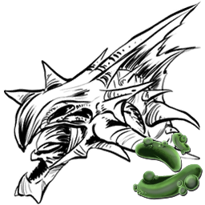 | [R-Reaper Queen](https://ark.wiki.gg/wiki/R-Reaper_Queen) | R-死神王后 | https://ark.wiki.gg/wiki/R-Reaper_Queen | R-Creatures | Xenomorph | Xenomorph_Character_BP_Female_Gen2_C | `Blueprint'/Game/Genesis2/Dinos/BiomeVariants/Xenomorph_Character_BP_Female_Gen2.Xenomorph_Character_BP_Female_Gen2'` |
|  | [R-Reaper King](https://ark.wiki.gg/wiki/R-Reaper_King) | R-死神国王 | https://ark.wiki.gg/wiki/R-Reaper_King | R-Creatures | Xenomorph | Xenomorph_Character_BP_Male_Gen2_C | `Blueprint'/Game/Genesis2/Dinos/BiomeVariants/Xenomorph_Character_BP_Male_Gen2.Xenomorph_Character_BP_Male_Gen2'` |
| 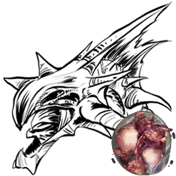 | [R-Reaper King (Tamed)](https://ark.wiki.gg/wiki/R-Reaper_King_(Tamed)) |  | https://ark.wiki.gg/wiki/R-Reaper_King_(Tamed) | R-Creatures | Xenomorph | Xenomorph_Character_BP_Male_Tamed_Gen2_C | `Blueprint'/Game/Genesis2/Dinos/BiomeVariants/Xenomorph_Character_BP_Male_Tamed_Gen2.Xenomorph_Character_BP_Male_Tamed_Gen2'` |
|  | [Summoner](https://ark.wiki.gg/wiki/Summoner) | 召唤师 | https://ark.wiki.gg/wiki/Summoner | Fantasy Creatures | Summoner | Summoner_Character_BP_C | `Blueprint'/Game/Genesis2/Dinos/Summoner/Summoner_Character_BP.Summoner_Character_BP'` |
|  | [Macrophage](https://ark.wiki.gg/wiki/Macrophage) | 巨噬细胞 | https://ark.wiki.gg/wiki/Macrophage | Fantasy Creatures | Macrophage | Macrophage_Swarm_Character_C | `Blueprint'/Game/Genesis2/Dinos/Macrophage/Macrophage_Swarm_Character.Macrophage_Swarm_Character'` |
|  | [Exo-Mek](https://ark.wiki.gg/wiki/Exo-Mek) | 外骨骼机甲 | https://ark.wiki.gg/wiki/Exo-Mek | Vehicles | Exosuit | Exosuit_Character_BP_C | `Blueprint'/Game/Genesis2/Dinos/Exosuit/Exosuit_Character_BP.Exosuit_Character_BP'` |
|  | [Rockwell Prime](https://ark.wiki.gg/wiki/Rockwell_Prime) | 终极罗克韦尔 | https://ark.wiki.gg/wiki/Rockwell_Prime | Bosses | RockwellPrime | RockwellNode_Character_BP_Boss_C | `Blueprint'/Game/Genesis2/Missions/ModularMission/FinalBattleAlt/Dinos/RockwellNode_Character_BP_Boss.RockwellNode_Character_BP_Boss'` |
|  | [Rockwell Prime (Alpha)](https://ark.wiki.gg/wiki/Rockwell_Prime_(Alpha)) |  | https://ark.wiki.gg/wiki/Rockwell_Prime_(Alpha) | Bosses | RockwellPrime | RockwellNode_Character_BP_Boss_Alpha_C | `Blueprint'/Game/Genesis2/Missions/ModularMission/FinalBattleAlt/Difficulties/Alpha/RockwellNode_Character_BP_Boss_Alpha.RockwellNode_Character_BP_Boss_Alpha'` |
|  | [Rockwell Prime (Beta)](https://ark.wiki.gg/wiki/Rockwell_Prime_(Beta)) |  | https://ark.wiki.gg/wiki/Rockwell_Prime_(Beta) | Bosses | RockwellPrime | RockwellNode_Character_BP_Boss_Beta_C | `Blueprint'/Game/Genesis2/Missions/ModularMission/FinalBattleAlt/Difficulties/Beta/RockwellNode_Character_BP_Boss_Beta.RockwellNode_Character_BP_Boss_Beta'` |
|  | [Rockwell Prime (Gamma)](https://ark.wiki.gg/wiki/Rockwell_Prime_(Gamma)) |  | https://ark.wiki.gg/wiki/Rockwell_Prime_(Gamma) | Bosses | RockwellPrime | RockwellNode_Character_BP_Boss_Gamma_C | `Blueprint'/Game/Genesis2/Missions/ModularMission/FinalBattleAlt/Difficulties/Gamma/RockwellNode_Character_BP_Boss_Gamma.RockwellNode_Character_BP_Boss_Gamma'` |
|  | [Rockwell Node](https://ark.wiki.gg/wiki/Rockwell_Node) | 罗克韦尔的分支 | https://ark.wiki.gg/wiki/Rockwell_Node | Bosses | RockwellPrime | RockwellNode_Character_BP_FinalFight_C | `Blueprint'/Game/Genesis2/Missions/ModularMission/FinalBattleAlt/Dinos/RockwellNode_Character_BP_FinalFight.RockwellNode_Character_BP_FinalFight'` |
| 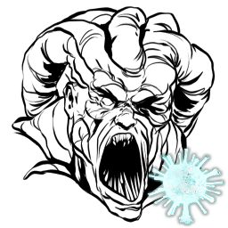 | [Rockwell Node (Alpha)](https://ark.wiki.gg/wiki/Rockwell_Node_(Alpha)) |  | https://ark.wiki.gg/wiki/Rockwell_Node_(Alpha) | Bosses | RockwellPrime | RockwellNode_Character_BP_FinalFight_Alpha_C | `Blueprint'/Game/Genesis2/Missions/ModularMission/FinalBattleAlt/Difficulties/Alpha/RockwellNode_Character_BP_FinalFight_Alpha.RockwellNode_Character_BP_FinalFight_Alpha'` |
|  | [Rockwell Node (Beta)](https://ark.wiki.gg/wiki/Rockwell_Node_(Beta)) |  | https://ark.wiki.gg/wiki/Rockwell_Node_(Beta) | Bosses | RockwellPrime | RockwellNode_Character_BP_FinalFight_Beta_C | `Blueprint'/Game/Genesis2/Missions/ModularMission/FinalBattleAlt/Difficulties/Beta/RockwellNode_Character_BP_FinalFight_Beta.RockwellNode_Character_BP_FinalFight_Beta'` |
|  | [Rockwell Node (Gamma)](https://ark.wiki.gg/wiki/Rockwell_Node_(Gamma)) |  | https://ark.wiki.gg/wiki/Rockwell_Node_(Gamma) | Bosses | RockwellPrime | RockwellNode_Character_BP_FinalFight_Gamma_C | `Blueprint'/Game/Genesis2/Missions/ModularMission/FinalBattleAlt/Difficulties/Gamma/RockwellNode_Character_BP_FinalFight_Gamma.RockwellNode_Character_BP_FinalFight_Gamma'` |

## Creatures of Lost Island

| 图标 | 名称 | 名称（中文） | 详情页 | 分类 | Name Tag | Entity ID | Blueprint Path |
| ------ | ------ | ------------ | -------- | ------ | ---------- | ----------- | ---------------- |
|  | [Amargasaurus](https://ark.wiki.gg/wiki/Amargasaurus) | 阿马加龙 | https://ark.wiki.gg/wiki/Amargasaurus | Dinosaurs | Amarga | Amargasaurus_Character_BP_C | `Blueprint'/Game/LostIsland/Dinos/Amargasaurus/Amargasaurus_Character_BP.Amargasaurus_Character_BP'` |
|  | [Dinopithecus](https://ark.wiki.gg/wiki/Dinopithecus) | 恐狒 | https://ark.wiki.gg/wiki/Dinopithecus | Mammals | Dinopithecus | Dinopithecus_Character_BP_C | `Blueprint'/Game/LostIsland/Dinos/Dinopithecus/Dinopithecus_Character_BP.Dinopithecus_Character_BP'` |
| 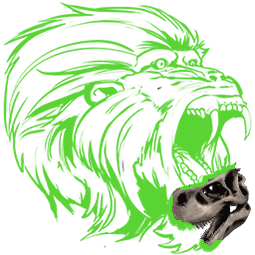 | [Dinopithecus King (Gamma)](https://ark.wiki.gg/wiki/Dinopithecus_King_(Gamma)) | 恐狒国王 (简单) | https://ark.wiki.gg/wiki/Dinopithecus_King_(Gamma) | Bosses | Dinopithecus | BossDinopithecus_Character_BP_Easy_C | `Blueprint'/Game/LostIsland/Boss/BossDinopithecus_Character_BP_Easy.BossDinopithecus_Character_BP_Easy'` |
| 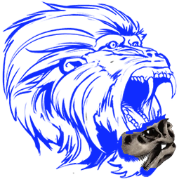 | [Dinopithecus King (Beta)](https://ark.wiki.gg/wiki/Dinopithecus_King_(Beta)) | 恐狒国王 (中等) | https://ark.wiki.gg/wiki/Dinopithecus_King_(Beta) | Bosses | Dinopithecus | BossDinopithecus_Character_BP_Medium_C | `Blueprint'/Game/LostIsland/Boss/BossDinopithecus_Character_BP_Medium.BossDinopithecus_Character_BP_Medium'` |
| 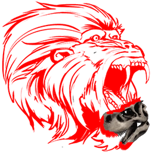 | [Dinopithecus King (Alpha)](https://ark.wiki.gg/wiki/Dinopithecus_King_(Alpha)) | 恐狒国王 (困难) | https://ark.wiki.gg/wiki/Dinopithecus_King_(Alpha) | Bosses | Dinopithecus | BossDinopithecus_Character_BP_Hard_C | `Blueprint'/Game/LostIsland/Boss/BossDinopithecus_Character_BP_Hard.BossDinopithecus_Character_BP_Hard'` |
|  | [Sinomacrops](https://ark.wiki.gg/wiki/Sinomacrops) | 中华大眼翼龙 | https://ark.wiki.gg/wiki/Sinomacrops | Reptiles | Sino | Sinomacrops_Character_BP_C | `Blueprint'/Game/LostIsland/Dinos/Sinomacrops/Sinomacrops_Character_BP.Sinomacrops_Character_BP'` |

## Creatures of Fjordur

| 图标 | 名称 | 名称（中文） | 详情页 | 分类 | Name Tag | Entity ID | Blueprint Path |
| ------ | ------ | ------------ | -------- | ------ | ---------- | ----------- | ---------------- |
|  | [Andrewsarchus](https://ark.wiki.gg/wiki/Andrewsarchus) | 安氏兽 | https://ark.wiki.gg/wiki/Andrewsarchus | Mammals | Andrewsarchus | Andrewsarchus_Character_BP_C | `Blueprint'/Game/Fjordur/Dinos/Andrewsarchus/Andrewsarchus_Character_BP.Andrewsarchus_Character_BP'` |
|  | [Desmodus](https://ark.wiki.gg/wiki/Desmodus) | 吸血蝠 | https://ark.wiki.gg/wiki/Desmodus | Mammals | Desmodus | Desmodus_Character_BP_C | `Blueprint'/Game/Fjordur/Dinos/Desmodus/Desmodus_Character_BP.Desmodus_Character_BP'` |
|  | [Fenrir](https://ark.wiki.gg/wiki/Fenrir) | 芬里尔 | https://ark.wiki.gg/wiki/Fenrir | Fantasy Creatures | Fenrir Wolf | Fenrir_Character_BP_C | `Blueprint'/Game/Fjordur/Dinos/Fenrir/Fenrir_Character_BP.Fenrir_Character_BP'` |
|  | [Fjordhawk](https://ark.wiki.gg/wiki/Fjordhawk) | 峡鹰 | https://ark.wiki.gg/wiki/Fjordhawk | Birds | Fjordhawk | Fjordhawk_Character_BP_C | `Blueprint'/Game/Fjordur/Dinos/Fjordhawk/Fjordhawk_Character_BP.Fjordhawk_Character_BP'` |

## Fantastic Tames

| 图标 | 名称 | 名称（中文） | 详情页 | 分类 | Name Tag | Entity ID | Blueprint Path |
| ------ | ------ | ------------ | -------- | ------ | ---------- | ----------- | ---------------- |
|  | [Pyromane](https://ark.wiki.gg/wiki/Pyromane) | 炽炎猫 | https://ark.wiki.gg/wiki/Pyromane | Fantasy Creatures | FireLion | FireLion_Character_BP_C | `Blueprint'/Game/ASA/Dinos/FireLion/FireLion_Character_BP.FireLion_Character_BP'` |
|  | [Dreadmare](https://ark.wiki.gg/wiki/Dreadmare) | 梦魇马 | https://ark.wiki.gg/wiki/Dreadmare | Fantasy Creatures | DarkPegasus | DarkPegasus_Character_BP_C | `Blueprint'/Game/ASA/Dinos/DarkPegasus/DarkPegasus_Character_BP.DarkPegasus_Character_BP'` |
| 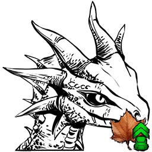 | [Autumn Drakeling](https://ark.wiki.gg/wiki/Autumn_Drakeling) | 秋之精灵龙 | https://ark.wiki.gg/wiki/Autumn_Drakeling | Fantasy Creatures | ShoulderDragon | ShoulderDragon_Character_BP_C | `Blueprint'/Game/ASA/Dinos/ShoulderDragon/ShoulderDragon_Character_BP_Autumn.ShoulderDragon_Character_BP_Autumn'` |
| 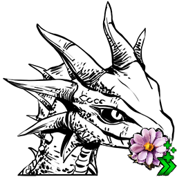 | [Spring Drakeling](https://ark.wiki.gg/wiki/Spring_Drakeling) | 春之精灵龙 | https://ark.wiki.gg/wiki/Spring_Drakeling | Fantasy Creatures | ShoulderDragon | ShoulderDragon_Character_BP_C | `Blueprint'/Game/ASA/Dinos/ShoulderDragon/ShoulderDragon_Character_BP_Spring.ShoulderDragon_Character_BP_Spring'` |
| 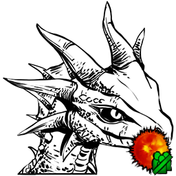 | [Summer Drakeling](https://ark.wiki.gg/wiki/Summer_Drakeling) | 夏之精灵龙 | https://ark.wiki.gg/wiki/Summer_Drakeling | Fantasy Creatures | ShoulderDragon | ShoulderDragon_Character_BP_C | `Blueprint'/Game/ASA/Dinos/ShoulderDragon/ShoulderDragon_Character_BP_Summer.ShoulderDragon_Character_BP_Summer'` |
|  | [Winter Drakeling](https://ark.wiki.gg/wiki/Winter_Drakeling) | 冬之精灵龙 | https://ark.wiki.gg/wiki/Winter_Drakeling | Fantasy Creatures | ShoulderDragon | ShoulderDragon_Character_BP_C | `Blueprint'/Game/ASA/Dinos/ShoulderDragon/ShoulderDragon_Character_BP_Winter.ShoulderDragon_Character_BP_Winter'` |
|  | [Elderclaw](https://ark.wiki.gg/wiki/Elderclaw) | 远古之爪 | https://ark.wiki.gg/wiki/Elderclaw | Fantasy Creatures | SpiritBear | SpiritBear_Character_BP_C | `Blueprint'/Game/ASA/Dinos/SpiritBear/SpiritBear_Character_BP.SpiritBear_Character_BP'` |

## Creatures of Astraeos

| 图标 | 名称 | 名称（中文） | 详情页 | 分类 | Name Tag | Entity ID | Blueprint Path |
| ------ | ------ | ------------ | -------- | ------ | ---------- | ----------- | ---------------- |
|  | [Grand Tortugar](https://ark.wiki.gg/wiki/Grand_Tortugar) | 巨甲龟 | https://ark.wiki.gg/wiki/Grand_Tortugar | Reptiles | GrandTortugar | GrandTortugar_Character_BP_C | `Blueprint'/Game/ASA/Dinos/GrandTortugar/GrandTortugar_Character_BP.GrandTortugar_Character_BP'` |
|  | [Maeguana](https://ark.wiki.gg/wiki/Maeguana) | 风行蜥 | https://ark.wiki.gg/wiki/Maeguana | Reptiles | Maelizard | Maelizard_Character_BP_C | `Blueprint'/Game/ASA/Dinos/Maelizard/Maelizard_Character_BP.Maelizard_Character_BP'` |

## Creatures of Aquatica

| 图标 | 名称 | 名称（中文） | 详情页 | 分类 | Name Tag | Entity ID | Blueprint Path |
| ------ | ------ | ------------ | -------- | ------ | ---------- | ----------- | ---------------- |
|  | [Abyssal Alpha T-Rex](https://ark.wiki.gg/wiki/Abyssal_Alpha_T-Rex) |  | https://ark.wiki.gg/wiki/Abyssal_Alpha_T-Rex | Alpha Creatures | ??? | MegaRex_Character_BP_Abyssal_C | `Blueprint'/Game/Abyss/Dinos/Abyssal/Rex/Alpha/MegaRex_Character_BP_Abyssal.MegaRex_Character_BP_Abyssal'` |
|  | [Abyssal Ankylosaurus](https://ark.wiki.gg/wiki/Abyssal_Ankylosaurus) |  | https://ark.wiki.gg/wiki/Abyssal_Ankylosaurus | Dinosaurs | ??? | Ankylo_Character_BP_Abyssal_C | `Blueprint'/Game/Abyss/Dinos/Abyssal/Ankylosaurus/Ankylo_Character_BP_Abyssal.Ankylo_Character_BP_Abyssal'` |
|  | [Abyssal Moschops](https://ark.wiki.gg/wiki/Abyssal_Moschops) |  | https://ark.wiki.gg/wiki/Abyssal_Moschops | Synapsids | ??? | Moschops_Character_BP_Abyssal_C | `Blueprint'/Game/Abyss/Dinos/Abyssal/Moschops/Moschops_Character_BP_Abyssal.Moschops_Character_BP_Abyssal'` |
|  | [Abyssal Procoptodon](https://ark.wiki.gg/wiki/Abyssal_Procoptodon) |  | https://ark.wiki.gg/wiki/Abyssal_Procoptodon | Mammals | ??? | Procoptodon_Character_BP_Abyssal_C | `Blueprint'/Game/Abyss/Dinos/Abyssal/Procoptodon/Procoptodon_Character_BP_Abyssal.Procoptodon_Character_BP_Abyssal'` |
|  | [Abyssal Reaper King](https://ark.wiki.gg/wiki/Abyssal_Reaper_King) |  | https://ark.wiki.gg/wiki/Abyssal_Reaper_King | Fantasy Creatures | ??? | Reaper_Character_BP_Male_Abyssal_C | `Blueprint'/Game/Abyss/Dinos/Abyssal/Reaper/Reaper_Character_BP_Male_Abyssal.Reaper_Character_BP_Male_Abyssal'` |
|  | [Abyssal Reaper Offspring](https://ark.wiki.gg/wiki/Abyssal_Reaper_Offspring) |  | https://ark.wiki.gg/wiki/Abyssal_Reaper_Offspring | Fantasy Creatures | ??? | Reaper_Character_BP_Offspring_Abyssal_C | `Blueprint'/Game/Abyss/Dinos/Abyssal/Reaper/Reaper_Character_BP_Offspring_Abyssal.Reaper_Character_BP_Offspring_Abyssal'` |
|  | [Abyssal Reaper Queen](https://ark.wiki.gg/wiki/Abyssal_Reaper_Queen) |  | https://ark.wiki.gg/wiki/Abyssal_Reaper_Queen | Fantasy Creatures | ??? | Reaper_Character_BP_Female_Abyssal_C | `Blueprint'/Game/Abyss/Dinos/Abyssal/Reaper/Reaper_Character_BP_Female_Abyssal.Reaper_Character_BP_Female_Abyssal'` |
|  | [Abyssal Rex](https://ark.wiki.gg/wiki/Abyssal_Rex) |  | https://ark.wiki.gg/wiki/Abyssal_Rex | Dinosaurs | ??? | Rex_Character_BP_Abyssal_C | `Blueprint'/Game/Abyss/Dinos/Abyssal/Rex/Rex_Character_BP_Abyssal.Rex_Character_BP_Abyssal'` |
|  | [Abyssal Stegosaurus](https://ark.wiki.gg/wiki/Abyssal_Stegosaurus) |  | https://ark.wiki.gg/wiki/Abyssal_Stegosaurus | Dinosaurs | ??? | Stego_Character_BP_Abyssal_C | `Blueprint'/Game/Abyss/Dinos/Abyssal/Stego/Stego_Character_BP_Abyssal.Stego_Character_BP_Abyssal'` |
|  | [Abyssal Therizinosaur](https://ark.wiki.gg/wiki/Abyssal_Therizinosaur) |  | https://ark.wiki.gg/wiki/Abyssal_Therizinosaur | Dinosaurs | ??? | Therizino_Character_BP_Abyssal_C | `Blueprint'/Game/Abyss/Dinos/Abyssal/Therizinosaurus/Therizino_Character_BP_Abyssal.Therizino_Character_BP_Abyssal'` |
|  | [Abyssal Thylacoleo](https://ark.wiki.gg/wiki/Abyssal_Thylacoleo) |  | https://ark.wiki.gg/wiki/Abyssal_Thylacoleo | Mammals | ??? | Thylacoleo_Character_BP_Abyssal_C | `Blueprint'/Game/Abyss/Dinos/Abyssal/Thylacoleo/Thylacoleo_Character_BP_Abyssal.Thylacoleo_Character_BP_Abyssal'` |
|  | [Abyssal Yutyrannus](https://ark.wiki.gg/wiki/Abyssal_Yutyrannus) |  | https://ark.wiki.gg/wiki/Abyssal_Yutyrannus | Dinosaurs | ??? | Yutyrannus_Character_BP_Abyssal_C | `Blueprint'/Game/Abyss/Dinos/Abyssal/Yutyrannus/Yutyrannus_Character_BP_Abyssal.Yutyrannus_Character_BP_Abyssal'` |
|  | [Alpha Chrysaora](https://ark.wiki.gg/wiki/Alpha_Chrysaora) |  | https://ark.wiki.gg/wiki/Alpha_Chrysaora | Alpha Creatures | ??? | MegaChrysaora_Character_BP_C | `Blueprint'/Game/Abyss/Dinos/Chrysaora/Alpha/MegaChrysaora_Character_BP.MegaChrysaora_Character_BP'` |
|  | [Alpha Dakosaurus](https://ark.wiki.gg/wiki/Alpha_Dakosaurus) |  | https://ark.wiki.gg/wiki/Alpha_Dakosaurus | Alpha Creatures | ??? | Dakosaurus_Character_BP_Alpha_C | `Blueprint'/Game/Abyss/Dinos/Dakosaurus/Alpha/Dakosaurus_Character_BP_Alpha.Dakosaurus_Character_BP_Alpha'` |
|  | [Alpha Malleocephalus](https://ark.wiki.gg/wiki/Alpha_Malleocephalus) |  | https://ark.wiki.gg/wiki/Alpha_Malleocephalus | Alpha Creatures | ??? | MegaMalleocephalus_Character_BP_C | `Blueprint'/Game/Abyss/Dinos/Malleocephalus/Alpha/MegaMalleocephalus_Character_BP.MegaMalleocephalus_Character_BP'` |
|  | [Alpha Tridacna](https://ark.wiki.gg/wiki/Alpha_Tridacna) |  | https://ark.wiki.gg/wiki/Alpha_Tridacna | Alpha Creatures | ??? | AlphaCorruptTridacna_Character_BP_C | `Blueprint'/Game/Abyss/Dinos/AlphaCorruptTridacna/AlphaCorruptTridacna_Character_BP.AlphaCorruptTridacna_Character_BP'` |
|  | [Alpha Water Wyvern](https://ark.wiki.gg/wiki/Alpha_Water_Wyvern) |  | https://ark.wiki.gg/wiki/Alpha_Water_Wyvern | Alpha Creatures | ??? | MegaWyvern_Character_BP_Water_C | `Blueprint'/Game/Abyss/Dinos/WaterWyvern/Alpha/MegaWyvern_Character_BP_Water.MegaWyvern_Character_BP_Water'` |
|  | [Chrysaora](https://ark.wiki.gg/wiki/Chrysaora) |  | https://ark.wiki.gg/wiki/Chrysaora | Invertebrates | ??? | Chrysaora_Character_BP_C | `Blueprint'/Game/Abyss/Dinos/Chrysaora/Chrysaora_Character_BP.Chrysaora_Character_BP'` |
|  | [Cymathoa](https://ark.wiki.gg/wiki/Cymathoa) |  | https://ark.wiki.gg/wiki/Cymathoa | Bosses | ??? | Cymathoa_Character_BP_C | `Blueprint'/Game/Abyss/Dinos/Cymathoa/Cymathoa_Character_BP.Cymathoa_Character_BP'` |
|  | [Cymathoa (Alpha)](https://ark.wiki.gg/wiki/Cymathoa_(Alpha)) |  | https://ark.wiki.gg/wiki/Cymathoa_(Alpha) | Bosses | ??? | Cymathoa_Character_BP_Hard_C | `Blueprint'/Game/Abyss/Dinos/Cymathoa/Cymathoa_Character_BP_Hard.Cymathoa_Character_BP_Hard'` |
|  | [Cymathoa (Beta)](https://ark.wiki.gg/wiki/Cymathoa_(Beta)) |  | https://ark.wiki.gg/wiki/Cymathoa_(Beta) | Bosses | ??? | Cymathoa_Character_BP_Medium_C | `Blueprint'/Game/Abyss/Dinos/Cymathoa/Cymathoa_Character_BP_Medium.Cymathoa_Character_BP_Medium'` |
|  | [Cymathoa (Gamma)](https://ark.wiki.gg/wiki/Cymathoa_(Gamma)) |  | https://ark.wiki.gg/wiki/Cymathoa_(Gamma) | Bosses | ??? | Cymathoa_Character_BP_Easy_C | `Blueprint'/Game/Abyss/Dinos/Cymathoa/Cymathoa_Character_BP_Easy.Cymathoa_Character_BP_Easy'` |
|  | [Dakosaurus](https://ark.wiki.gg/wiki/Dakosaurus) |  | https://ark.wiki.gg/wiki/Dakosaurus | Reptiles | ??? | Dakosaurus_Character_BP_C | `Blueprint'/Game/Abyss/Dinos/Dakosaurus/Dakosaurus_Character_BP.Dakosaurus_Character_BP'` |
|  | [Fractalis](https://ark.wiki.gg/wiki/Fractalis) |  | https://ark.wiki.gg/wiki/Fractalis | Bosses | ??? | Fractalis_Character_BP_C | `Blueprint'/Game/Abyss/Dinos/Fractalis/Fractalis_Character_BP.Fractalis_Character_BP'` |
|  | [Fractalis (Alpha)](https://ark.wiki.gg/wiki/Fractalis_(Alpha)) |  | https://ark.wiki.gg/wiki/Fractalis_(Alpha) | Bosses | ??? | Fractalis_Character_BP_C | `Blueprint'/Game/Abyss/Dinos/Fractalis/Fractalis_Character_BP_Hard.Fractalis_Character_BP_Hard'` |
|  | [Fractalis (Beta)](https://ark.wiki.gg/wiki/Fractalis_(Beta)) |  | https://ark.wiki.gg/wiki/Fractalis_(Beta) | Bosses | ??? | Fractalis_Character_BP_C | `Blueprint'/Game/Abyss/Dinos/Fractalis/Fractalis_Character_BP_Medium.Fractalis_Character_BP_Medium'` |
|  | [Fractalis (Gamma)](https://ark.wiki.gg/wiki/Fractalis_(Gamma)) |  | https://ark.wiki.gg/wiki/Fractalis_(Gamma) | Bosses | ??? | Fractalis_Character_BP_C | `Blueprint'/Game/Abyss/Dinos/Fractalis/Fractalis_Character_BP_Easy.Fractalis_Character_BP_Easy'` |
|  | [Homarus](https://ark.wiki.gg/wiki/Homarus) |  | https://ark.wiki.gg/wiki/Homarus | Invertebrates | ??? | Homarus_Character_BP_C | `Blueprint'/Game/Abyss/Dinos/Homarus/Homarus_Character_BP.Homarus_Character_BP'` |
|  | [Istiophorus](https://ark.wiki.gg/wiki/Istiophorus) |  | https://ark.wiki.gg/wiki/Istiophorus | Fish | ??? | Istiophorus_Character_BP_C | `Blueprint'/Game/Abyss/Dinos/Istiophorus/Istiophorus_Character_BP.Istiophorus_Character_BP'` |
|  | [Kathreptis](https://ark.wiki.gg/wiki/Kathreptis) |  | https://ark.wiki.gg/wiki/Kathreptis | Invertebrates | ??? | Kathreptis_Character_BP_C | `Blueprint'/Game/Abyss/Dinos/Kathreptis/Kathreptis_Character_BP.Kathreptis_Character_BP'` |
|  | [Malleocephalus](https://ark.wiki.gg/wiki/Malleocephalus) |  | https://ark.wiki.gg/wiki/Malleocephalus | Fish | ??? | Malleocephalus_Character_BP_C | `Blueprint'/Game/Abyss/Dinos/Malleocephalus/Malleocephalus_Character_BP.Malleocephalus_Character_BP'` |
|  | [Mantis Shrimp](https://ark.wiki.gg/wiki/Mantis_Shrimp) |  | https://ark.wiki.gg/wiki/Mantis_Shrimp | Invertebrates | ??? | MantisShrimp_Character_BP_C | `Blueprint'/Game/Abyss/Dinos/MantisShrimp/MantisShrimp_Character_BP.MantisShrimp_Character_BP'` |
|  | [Monodon](https://ark.wiki.gg/wiki/Monodon) |  | https://ark.wiki.gg/wiki/Monodon | Mammals | ??? | Monodon_Character_BP_C | `Blueprint'/Game/Abyss/Dinos/Monodon/Monodon_Character_BP.Monodon_Character_BP'` |
|  | [Mudpuppy](https://ark.wiki.gg/wiki/Mudpuppy) |  | https://ark.wiki.gg/wiki/Mudpuppy | Amphibians | ??? | Mudpuppy_Character_BP_C | `Blueprint'/Game/Abyss/Dinos/Mudpuppy/Mudpuppy_Character_BP.Mudpuppy_Character_BP'` |
|  | [Ocepechelon](https://ark.wiki.gg/wiki/Ocepechelon) |  | https://ark.wiki.gg/wiki/Ocepechelon | Reptiles | ??? | Ocepechelon_Character_BP_C | `Blueprint'/Game/Abyss/Dinos/Ocepechelon/Ocepechelon_Character_BP.Ocepechelon_Character_BP'` |
|  | [Onchopristis](https://ark.wiki.gg/wiki/Onchopristis) |  | https://ark.wiki.gg/wiki/Onchopristis | Fish | ??? | Onchopristis_Character_BP_C | `Blueprint'/Game/Abyss/Dinos/Onchopristis/Onchopristis_Character_BP.Onchopristis_Character_BP'` |
|  | [Pygocentrus](https://ark.wiki.gg/wiki/Pygocentrus) |  | https://ark.wiki.gg/wiki/Pygocentrus | Bosses | ??? | Pygocentrus_Character_BP_C | `Blueprint'/Game/Abyss/Dinos/Pygocentrus/Pygocentrus_Character_BP.Pygocentrus_Character_BP'` |
|  | [Pygocentrus (Alpha)](https://ark.wiki.gg/wiki/Pygocentrus_(Alpha)) |  | https://ark.wiki.gg/wiki/Pygocentrus_(Alpha) | Bosses | ??? | Pygocentrus_Character_BP_Hard_C | `Blueprint'/Game/Abyss/Dinos/Pygocentrus/Pygocentrus_Character_BP_Hard.Pygocentrus_Character_BP_Hard'` |
|  | [Pygocentrus (Beta)](https://ark.wiki.gg/wiki/Pygocentrus_(Beta)) |  | https://ark.wiki.gg/wiki/Pygocentrus_(Beta) | Bosses | ??? | Pygocentrus_Character_BP_Medium_C | `Blueprint'/Game/Abyss/Dinos/Pygocentrus/Pygocentrus_Character_BP_Medium.Pygocentrus_Character_BP_Medium'` |
|  | [Pygocentrus (Gamma)](https://ark.wiki.gg/wiki/Pygocentrus_(Gamma)) |  | https://ark.wiki.gg/wiki/Pygocentrus_(Gamma) | Bosses | ??? | Pygocentrus_Character_BP_Easy_C | `Blueprint'/Game/Abyss/Dinos/Pygocentrus/Pygocentrus_Character_BP_Easy.Pygocentrus_Character_BP_Easy'` |
|  | [Qarmoutus](https://ark.wiki.gg/wiki/Qarmoutus) |  | https://ark.wiki.gg/wiki/Qarmoutus | Fish | ??? | Qarmoutus_Character_BP_C | `Blueprint'/Game/Abyss/Dinos/Qarmoutus/Qarmoutus_Character_BP.Qarmoutus_Character_BP'` |
|  | [Riftcrawler](https://ark.wiki.gg/wiki/Riftcrawler) |  | https://ark.wiki.gg/wiki/Riftcrawler | Fantasy Creatures | ??? | RiftCrawler_Character_BP_C | `Blueprint'/Game/Abyss/Dinos/Riftcrawler/RiftCrawler_Character_BP.RiftCrawler_Character_BP'` |
|  | [Riftwalker](https://ark.wiki.gg/wiki/Riftwalker) |  | https://ark.wiki.gg/wiki/Riftwalker | Fantasy Creatures | ??? | Riftwalker_BP_C | `Blueprint'/Game//Abyss/Dinos/Riftwalker/Riftwalker_BP.Riftwalker_BP'` |
|  | [Seahorse](https://ark.wiki.gg/wiki/Seahorse) |  | https://ark.wiki.gg/wiki/Seahorse | Fantasy Creatures | ??? | Seahorse_Character_BP_C | `Blueprint'/Game/Abyss/Dinos/Seahorse/Seahorse_Character_BP.Seahorse_Character_BP'` |
|  | [Stereolepis](https://ark.wiki.gg/wiki/Stereolepis) |  | https://ark.wiki.gg/wiki/Stereolepis | Fish | ??? | Stereolepis_Character_BP_C | `Blueprint'/Game/Abyss/Dinos/Stereolepis/Stereolepis_Character_BP.Stereolepis_Character_BP'` |
|  | [Takifugu](https://ark.wiki.gg/wiki/Takifugu) |  | https://ark.wiki.gg/wiki/Takifugu | Fish | ??? | Takifugu_Character_BP_C | `Blueprint'/Game/Abyss/Dinos/Takifugu/Takifugu_Character_BP.Takifugu_Character_BP'` |
|  | [Thunnus](https://ark.wiki.gg/wiki/Thunnus) |  | https://ark.wiki.gg/wiki/Thunnus | Fish | ??? | Thunnus_Character_BP_C | `Blueprint'/Game/Abyss/Dinos/Thunnus/Thunnus_Character_BP.Thunnus_Character_BP'` |
|  | [Tiktaalik](https://ark.wiki.gg/wiki/Tiktaalik) |  | https://ark.wiki.gg/wiki/Tiktaalik | Fish | ??? | Tiktaalik_Character_BP_C | `Blueprint'/Game/Abyss/Dinos/Tiktaalik/Tiktaalik_Character_BP.Tiktaalik_Character_BP'` |
|  | [Tridacna](https://ark.wiki.gg/wiki/Tridacna) |  | https://ark.wiki.gg/wiki/Tridacna | Invertebrates | ??? | Tridacna_Character_BP_C | `Blueprint'/Game/Abyss/Dinos/Tridacna/Tridacna_Character_BP.Tridacna_Character_BP'` |
|  | [Vulcanite](https://ark.wiki.gg/wiki/Vulcanite) |  | https://ark.wiki.gg/wiki/Vulcanite | Fantasy Creatures | ??? | Vulcanite_Character_BP_C | `Blueprint'/Game/Abyss/Dinos/Vulcanite/Vulcanite_Character_BP.Vulcanite_Character_BP'` |
|  | [Vulcanithys](https://ark.wiki.gg/wiki/Vulcanithys) |  | https://ark.wiki.gg/wiki/Vulcanithys | Bosses | ??? | Vulcanithys_Character_BP_C | `Blueprint'/Game/Abyss/Dinos/Vulcanithys/Vulcanithys_Character_BP.Vulcanithys_Character_BP'` |
|  | [Vulcanithys (Alpha)](https://ark.wiki.gg/wiki/Vulcanithys_(Alpha)) |  | https://ark.wiki.gg/wiki/Vulcanithys_(Alpha) | Bosses | ??? | Vulcanithys_Character_BP_Hard_C | `Blueprint'/Game/Abyss/Dinos/Vulcanithys/Vulcanithys_Character_BP_Hard.Vulcanithys_Character_BP_Hard'` |
|  | [Vulcanithys (Beta)](https://ark.wiki.gg/wiki/Vulcanithys_(Beta)) |  | https://ark.wiki.gg/wiki/Vulcanithys_(Beta) | Bosses | ??? | Vulcanithys_Character_BP_Medium_C | `Blueprint'/Game/Abyss/Dinos/Vulcanithys/Vulcanithys_Character_BP_Medium.Vulcanithys_Character_BP_Medium'` |
|  | [Vulcanithys (Gamma)](https://ark.wiki.gg/wiki/Vulcanithys_(Gamma)) |  | https://ark.wiki.gg/wiki/Vulcanithys_(Gamma) | Bosses | ??? | Vulcanithys_Character_BP_Easy_C | `Blueprint'/Game/Abyss/Dinos/Vulcanithys/Vulcanithys_Character_BP_Easy.Vulcanithys_Character_BP_Easy'` |
|  | [Water Wyvern](https://ark.wiki.gg/wiki/Water_Wyvern) |  | https://ark.wiki.gg/wiki/Water_Wyvern | Fantasy Creatures | ??? | Wyvern_Character_BP_Water_C | `Blueprint'/Game/Abyss/Dinos/WaterWyvern/Wyvern_Character_BP_Water.Wyvern_Character_BP_Water'` |

## Creatures of Lost Colony

| 图标 | 名称 | 名称（中文） | 详情页 | 分类 | Name Tag | Entity ID | Blueprint Path |
| ------ | ------ | ------------ | -------- | ------ | ---------- | ----------- | ---------------- |
|  | [Aureliax](https://ark.wiki.gg/wiki/Aureliax) | 寒辉雪龙 | https://ark.wiki.gg/wiki/Aureliax | Reptiles | SnowDragon | SnowDragon_Character_BP_C | `Blueprint'/Game/LostColony/Dinos/SnowDragon/SnowDragon_Character_BP.SnowDragon_Character_BP'` |
|  | [Cryolophosaurus](https://ark.wiki.gg/wiki/Cryolophosaurus) | 冰嵴龙 | https://ark.wiki.gg/wiki/Cryolophosaurus | Dinosaurs | Cryolophosaurus | Cryolophosaurus_Character_BP_C | `Blueprint'/Game/ASA/Dinos/Cryolophosaurus/Cryolophosaurus_Character_BP.Cryolophosaurus_Character_BP'` |
|  | [Gigadesmodus](https://ark.wiki.gg/wiki/Gigadesmodus) | 巨翼魔蝠 | https://ark.wiki.gg/wiki/Gigadesmodus | Mammals | BossBat | BossBat_Character_BP_C | `Blueprint'/Game/LostColony/Dinos/BossBat/BossBat_Character_BP.BossBat_Character_BP'` |
|  | [Gloon](https://ark.wiki.gg/wiki/Gloon) | 咕隆 | https://ark.wiki.gg/wiki/Gloon | Amphibians | LostCharge | LostCharge_LanternPet_Char_BP_C | `Blueprint'/Game/LostColony/Dinos/LostChargePet/LostCharge_LanternPet_Char_BP.LostCharge_LanternPet_Char_BP'` |
|  | [Malwyn](https://ark.wiki.gg/wiki/Malwyn) | 诡狱狐 | https://ark.wiki.gg/wiki/Malwyn | Mammals | DevilFox | DevilFox_Character_BP_C | `Blueprint'/Game/LostColony/Dinos/DevilFox/DevilFox_Character_BP.DevilFox_Character_BP'` |
|  | [Ossidon](https://ark.wiki.gg/wiki/Ossidon) | 奥西顿 | https://ark.wiki.gg/wiki/Ossidon | Mammals | SnowMonster | SnowMonster_Character_BP_C | `Blueprint'/Game/LostColony/Dinos/SnowMonster/SnowMonster_Character_BP.SnowMonster_Character_BP'` |
|  | [Solwyn](https://ark.wiki.gg/wiki/Solwyn) | 霄光狐 | https://ark.wiki.gg/wiki/Solwyn | Mammals | AngelFox | AngelFox_Character_BP_C | `Blueprint'/Game/LostColony/Dinos/AngelFox/AngelFox_Character_BP.AngelFox_Character_BP'` |
|  | [Veilwyn](https://ark.wiki.gg/wiki/Veilwyn) | 霜灵狐 | https://ark.wiki.gg/wiki/Veilwyn | Mammals | YoungIceFox | YoungIceFox_DinoCompanion_Character_BP_C | `Blueprint'/Game/LostColony/Dinos/YoungIceFox/YoungIceFox_DinoCompanion_Character_BP.YoungIceFox_DinoCompanion_Character_BP'` |
