# ARK: Survival Ascended Item IDs

> Source: https://ark.wiki.gg/wiki/Item_IDs

## Resources

| Name | Stack Size | Item ID | Class Name | Blueprint Path | Icon |
|------|-----------|---------|-----------|----------------|------|
| Absorbent Substrate | 100 | - | PrimalItemResource_SubstrateAbsorbent_C | PrimalEarth/CoreBlueprints/Resources/PrimalItemResource_SubstrateAbsorbent.PrimalItemResource_SubstrateAbsorbent |  |
| Achatina Paste | 100 | - | PrimalItemResource_SnailPaste_C | PrimalEarth/Dinos/Achatina/PrimalItemResource_SnailPaste.PrimalItemResource_SnailPaste | 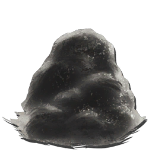 |
| Ambergris | 1 | - | PrimalItemResource_Ambergris_C | Genesis/Dinos/SpaceWhale/PrimalItemResource_Ambergris.PrimalItemResource_Ambergris | 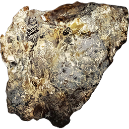 |
| Ammonite Bile | 50 | - | PrimalItemResource_AmmoniteBlood_C | PrimalEarth/CoreBlueprints/Resources/PrimalItemResource_AmmoniteBlood.PrimalItemResource_AmmoniteBlood |  |
| AnglerGel | 100 | - | PrimalItemResource_AnglerGel_C | PrimalEarth/CoreBlueprints/Resources/PrimalItemResource_AnglerGel.PrimalItemResource_AnglerGel |  |
| Black Pearl | 200 | - | PrimalItemResource_BlackPearl_C | PrimalEarth/CoreBlueprints/Resources/PrimalItemResource_BlackPearl.PrimalItemResource_BlackPearl | 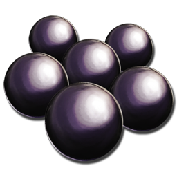 |
| Blue Crystalized Sap | 100 | - | PrimalItemResource_BlueSap_C | Extinction/CoreBlueprints/Resources/PrimalItemResource_BlueSap.PrimalItemResource_BlueSap |  |
| Blue Gem | 100 | - | PrimalItemResource_Gem_BioLum_C | Aberration/CoreBlueprints/Resources/PrimalItemResource_Gem_BioLum.PrimalItemResource_Gem_BioLum |  |
| Blood Pack | 100 | 45 | PrimalItemConsumable_BloodPack_C | PrimalEarth/CoreBlueprints/Items/Consumables/PrimalItemConsumable_BloodPack.PrimalItemConsumable_BloodPack | 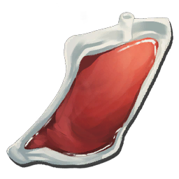 |
| Cementing Paste | 100 | 144 | PrimalItemResource_ChitinPaste_C | PrimalEarth/CoreBlueprints/Resources/PrimalItemResource_ChitinPaste.PrimalItemResource_ChitinPaste |  |
| Charcoal | 100 | 76 | PrimalItemResource_Charcoal_C | PrimalEarth/CoreBlueprints/Resources/PrimalItemResource_Charcoal.PrimalItemResource_Charcoal | 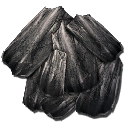 |
| Charge Battery | 1 | - | PrimalItem_ChargeBattery_C | Aberration/WeaponGlowStickCharge/PrimalItem_ChargeBattery.PrimalItem_ChargeBattery |  |
| Chitin or Keratin | 100 | 212 | PrimalItemResource_ChitinOrKeratin_C | PrimalEarth/CoreBlueprints/Resources/PrimalItemResource_ChitinOrKeratin.PrimalItemResource_ChitinOrKeratin | 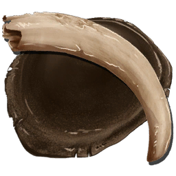 |
| Chitin | 100 | 11 | PrimalItemResource_Chitin_C | PrimalEarth/CoreBlueprints/Resources/PrimalItemResource_Chitin.PrimalItemResource_Chitin |  |
| Clay | 100 | - | PrimalItemResource_Clay_C | ScorchedEarth/CoreBlueprints/Resources/PrimalItemResource_Clay.PrimalItemResource_Clay |  |
| Condensed Gas | 100 | - | PrimalItemResource_CondensedGas_C | Extinction/CoreBlueprints/Resources/PrimalItemResource_CondensedGas.PrimalItemResource_CondensedGas | 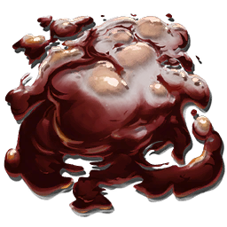 |
| Congealed Gas Ball | 100 | - | PrimalItemResource_Gas_C | Aberration/CoreBlueprints/Resources/PrimalItemResource_Gas.PrimalItemResource_Gas |  |
| Corrupted Nodule | 10 | - | PrimalItemResource_CorruptedPolymer_C | Extinction/CoreBlueprints/Resources/PrimalItemResource_CorruptedPolymer.PrimalItemResource_CorruptedPolymer | 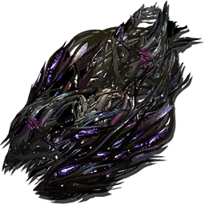 |
| Crafted Element Dust | 1000 | - | PrimalItemResource_ElementDustFromShards_C | Extinction/CoreBlueprints/Resources/PrimalItemResource_ElementDustFromShards.PrimalItemResource_ElementDustFromShards |  |
| Crystal | 100 | 77 | PrimalItemResource_Crystal_C | PrimalEarth/CoreBlueprints/Resources/PrimalItemResource_Crystal.PrimalItemResource_Crystal |  |
| Deathworm Horn | 20 | - | PrimalItemResource_KeratinSpike_C | ScorchedEarth/Dinos/Deathworm/PrimalItemResource_KeratinSpike.PrimalItemResource_KeratinSpike | 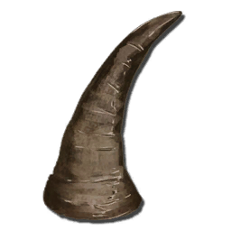 |
| Dermis | 1 | - | PrimalItem_TaxidermyDermis_C | Extinction/CoreBlueprints/Items/PrimalItem_TaxidermyDermis.PrimalItem_TaxidermyDermis | 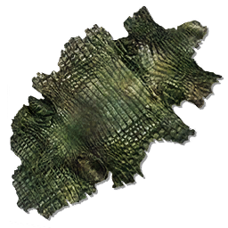 |
| Dinosaur Bone | 200 | - | PrimalItemResource_ARKBone_C | PrimalEarth/CoreBlueprints/Resources/PrimalItemResource_ARKBone.PrimalItemResource_ARKBone |  |
| Electronics | 100 | 162 | PrimalItemResource_Electronics_C | PrimalEarth/CoreBlueprints/Resources/PrimalItemResource_Electronics.PrimalItemResource_Electronics |  |
| Element | 100 | - | PrimalItemResource_Element_C | PrimalEarth/CoreBlueprints/Resources/PrimalItemResource_Element.PrimalItemResource_Element | 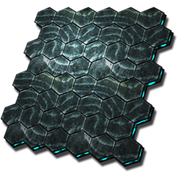 |
| Element Dust | 1000 | - | PrimalItemResource_ElementDust_C | Extinction/CoreBlueprints/Resources/PrimalItemResource_ElementDust.PrimalItemResource_ElementDust | 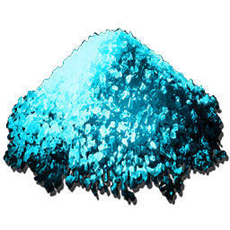 |
| Element Ore | 100 | - | PrimalItemResource_ElementOre_C | Aberration/CoreBlueprints/Resources/PrimalItemResource_ElementOre.PrimalItemResource_ElementOre |  |
| Element Shard | 1000 | - | PrimalItemResource_ElementShard_C | PrimalEarth/CoreBlueprints/Resources/PrimalItemResource_ElementShard.PrimalItemResource_ElementShard |  |
| Fertilizer | 1 | 50 | PrimalItemConsumable_Fertilizer_Compost_C | PrimalEarth/CoreBlueprints/Items/Consumables/PrimalItemConsumable_Fertilizer_Compost.PrimalItemConsumable_Fertilizer_Compost | 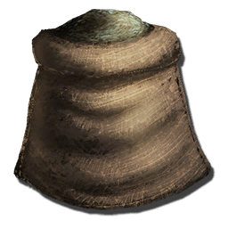 |
| Fiber | 300 | 75 | PrimalItemResource_Fibers_C | PrimalEarth/CoreBlueprints/Resources/PrimalItemResource_Fibers.PrimalItemResource_Fibers |  |
| Flint | 100 | 72 | PrimalItemResource_Flint_C | PrimalEarth/CoreBlueprints/Resources/PrimalItemResource_Flint.PrimalItemResource_Flint | 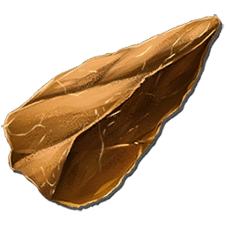 |
| Fragmented Green Gem | 100 | - | PrimalItemResource_FracturedGem_C | Extinction/CoreBlueprints/Resources/PrimalItemResource_FracturedGem.PrimalItemResource_FracturedGem |  |
| Fungal Wood | 100 | - | PrimalItemResource_FungalWood_C | Aberration/CoreBlueprints/Resources/PrimalItemResource_FungalWood.PrimalItemResource_FungalWood | 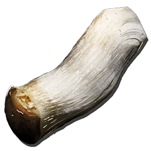 |
| Corrupted Wood | 100 | - | PrimalItemResource_CorruptedWood_C | Extinction/CoreBlueprints/Resources/PrimalItemResource_CorruptedWood.PrimalItemResource_CorruptedWood |  |
| Gasoline | 100 | 161 | PrimalItemResource_Gasoline_C | PrimalEarth/CoreBlueprints/Resources/PrimalItemResource_Gasoline.PrimalItemResource_Gasoline | 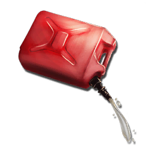 |
| Golden Nugget | 1 | - | PrimalItemResource_GoldenNugget_C | Genesis/Missions/Retrieve/RetrieveItems/GoldenNugget/PrimalItemResource_GoldenNugget.PrimalItemResource_GoldenNugget |  |
| Green Gem | 100 | - | PrimalItemResource_Gem_Fertile_C | Aberration/CoreBlueprints/Resources/PrimalItemResource_Gem_Fertile.PrimalItemResource_Gem_Fertile |  |
| Gunpowder | 100 | 108 | PrimalItemResource_Gunpowder_C | PrimalEarth/CoreBlueprints/Resources/PrimalItemResource_Gunpowder.PrimalItemResource_Gunpowder | 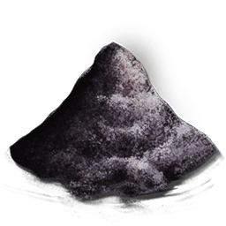 |
| Hide | 200 | 10 | PrimalItemResource_Hide_C | PrimalEarth/CoreBlueprints/Resources/PrimalItemResource_Hide.PrimalItemResource_Hide |  |
| High Quality Pollen | 1 | - | PrimalItemResource_HighQualityPollen_C | Genesis/Missions/Retrieve/RetrieveItems/HighQualityPollen/PrimalItemResource_HighQualityPollen.PrimalItemResource_HighQualityPollen | 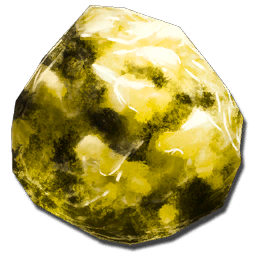 |
| Human Hair | 200 | - | PrimalItemResource_Hair_C | PrimalEarth/CoreBlueprints/Resources/PrimalItemResource_Hair.PrimalItemResource_Hair | 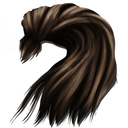 |
| Keratin | 100 | 213 | PrimalItemResource_Keratin_C | PrimalEarth/CoreBlueprints/Resources/PrimalItemResource_Keratin.PrimalItemResource_Keratin | 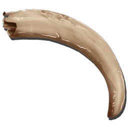 |
| Leech Blood | 50 | - | PrimalItemResource_LeechBlood_C | PrimalEarth/CoreBlueprints/Resources/PrimalItemResource_LeechBlood.PrimalItemResource_LeechBlood |  |
| Leech Blood or Horns | 100 | - | PrimalItemResourceGeneric_Curing_C | PrimalEarth/CoreBlueprints/Resources/PrimalItemResourceGeneric_Curing.PrimalItemResourceGeneric_Curing | 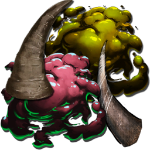 |
| Metal Ingot | 200 | 73 | PrimalItemResource_MetalIngot_C | PrimalEarth/CoreBlueprints/Resources/PrimalItemResource_MetalIngot.PrimalItemResource_MetalIngot |  |
| Metal | 200 | 9 | PrimalItemResource_Metal_C | PrimalEarth/CoreBlueprints/Resources/PrimalItemResource_Metal.PrimalItemResource_Metal |  |
| Mutagel | 100 | - | PrimalItemConsumable_Mutagel_C | Genesis2/CoreBlueprints/Environment/Mutagen/PrimalItemConsumable_Mutagel.PrimalItemConsumable_Mutagel | 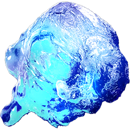 |
| Mutagen | 100 | - | PrimalItemConsumable_Mutagen_C | Genesis2/CoreBlueprints/Environment/Mutagen/PrimalItemConsumable_Mutagen.PrimalItemConsumable_Mutagen |  |
| Narcotic | 100 | 122 | PrimalItemConsumable_Narcotic_C | PrimalEarth/CoreBlueprints/Items/Consumables/PrimalItemConsumable_Narcotic.PrimalItemConsumable_Narcotic | 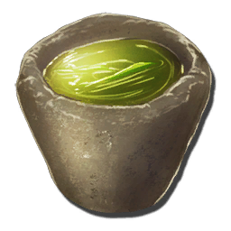 |
| Obsidian | 100 | 141 | PrimalItemResource_Obsidian_C | PrimalEarth/CoreBlueprints/Resources/PrimalItemResource_Obsidian.PrimalItemResource_Obsidian |  |
| Oil | 100 | 159 | PrimalItemResource_Oil_C | PrimalEarth/CoreBlueprints/Resources/PrimalItemResource_Oil.PrimalItemResource_Oil |  |
| Oil | 100 | - | PrimalItemResource_SquidOil_C | PrimalEarth/Dinos/Tusoteuthis/PrimalItemResource_SquidOil.PrimalItemResource_SquidOil |  |
| Organic Polymer | 20 | - | PrimalItemResource_Polymer_Organic_C | PrimalEarth/CoreBlueprints/Resources/PrimalItemResource_Polymer_Organic.PrimalItemResource_Polymer_Organic | 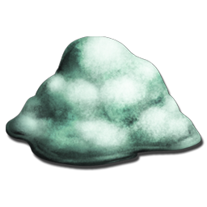 |
| Pelt | 200 | 419 | PrimalItemResource_Pelt_C | PrimalEarth/CoreBlueprints/Resources/PrimalItemResource_Pelt.PrimalItemResource_Pelt |  |
| Pelt, Hair, or Wool | 200 | - | PrimalItemResource_PeltOrHair_C | PrimalEarth/CoreBlueprints/Resources/PrimalItemResource_PeltOrHair.PrimalItemResource_PeltOrHair |  |
| Polymer | 100 | 163 | PrimalItemResource_Polymer_C | PrimalEarth/CoreBlueprints/Resources/PrimalItemResource_Polymer.PrimalItemResource_Polymer |  |
| Primal Crystal | 1 | - | PrimalItemResource_Crystal_IslesPrimal_C | PrimalEarth/Dinos/CrystalWyvern/CrystalResources/Primal/PrimalItemResource_Crystal_IslesPrimal.PrimalItemResource_Crystal_IslesPrimal |  |
| Preserving Salt | 6 | - | PrimalItemResource_PreservingSalt_C | ScorchedEarth/CoreBlueprints/Resources/PrimalItemResource_PreservingSalt.PrimalItemResource_PreservingSalt |  |
| Propellant | 100 | - | PrimalItemResource_Propellant_C | ScorchedEarth/CoreBlueprints/Resources/PrimalItemResource_Propellant.PrimalItemResource_Propellant | 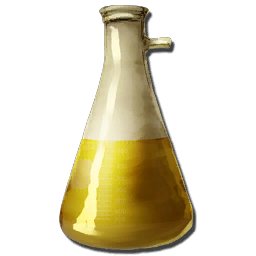 |
| Rare Flower | 100 | 246 | PrimalItemResource_RareFlower_C | PrimalEarth/CoreBlueprints/Resources/PrimalItemResource_RareFlower.PrimalItemResource_RareFlower |  |
| Rare Mushroom | 100 | 247 | PrimalItemResource_RareMushroom_C | PrimalEarth/CoreBlueprints/Resources/PrimalItemResource_RareMushroom.PrimalItemResource_RareMushroom | 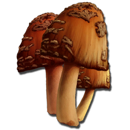 |
| Raw Salt | 100 | - | PrimalItemResource_RawSalt_C | ScorchedEarth/CoreBlueprints/Resources/PrimalItemResource_RawSalt.PrimalItemResource_RawSalt |  |
| Re-Fertilizer | 100 | 382 | PrimalItemConsumableMiracleGro_C | PrimalEarth/CoreBlueprints/Items/Consumables/BaseBPs/PrimalItemConsumableMiracleGro.PrimalItemConsumableMiracleGro |  |
| Red Crystalized Sap | 100 | - | PrimalItemResource_RedSap_C | Extinction/CoreBlueprints/Resources/PrimalItemResource_RedSap.PrimalItemResource_RedSap | 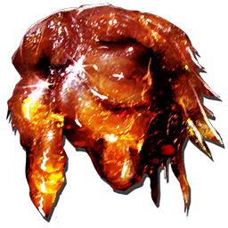 |
| Red Gem | 100 | - | PrimalItemResource_Gem_Element_C | Aberration/CoreBlueprints/Resources/PrimalItemResource_Gem_Element.PrimalItemResource_Gem_Element |  |
| Sand | 100 | - | PrimalItemResource_Sand_C | ScorchedEarth/CoreBlueprints/Resources/PrimalItemResource_Sand.PrimalItemResource_Sand |  |
| Sap | 30 | - | PrimalItemResource_Sap_C | PrimalEarth/CoreBlueprints/Resources/PrimalItemResource_Sap.PrimalItemResource_Sap |  |
| Scrap Metal | 200 | - | PrimalItemResource_ScrapMetal_C | Extinction/CoreBlueprints/Resources/PrimalItemResource_ScrapMetal.PrimalItemResource_ScrapMetal |  |
| Scrap Metal Ingot | 200 | - | PrimalItemResource_ScrapMetalIngot_C | Extinction/CoreBlueprints/Resources/PrimalItemResource_ScrapMetalIngot.PrimalItemResource_ScrapMetalIngot |  |
| Shell Fragment | 100 | - | PrimalItemResource_TurtleShell_C | Genesis/CoreBlueprints/Resources/PrimalItemResource_TurtleShell.PrimalItemResource_TurtleShell |  |
| Silica Pearls | 100 | 160 | PrimalItemResource_Silicon_C | PrimalEarth/CoreBlueprints/Resources/PrimalItemResource_Silicon.PrimalItemResource_Silicon | 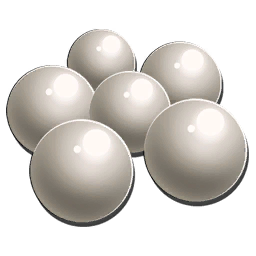 |
| Silicate | 100 | - | PrimalItemResource_Silicate_C | Extinction/CoreBlueprints/Resources/PrimalItemResource_Silicate.PrimalItemResource_Silicate |  |
| Silk | 200 | - | PrimalItemResource_Silk_C | ScorchedEarth/CoreBlueprints/Resources/PrimalItemResource_Silk.PrimalItemResource_Silk | 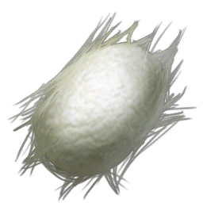 |
| Sparkpowder | 100 | 107 | PrimalItemResource_Sparkpowder_C | PrimalEarth/CoreBlueprints/Resources/PrimalItemResource_Sparkpowder.PrimalItemResource_Sparkpowder |  |
| Stimulant | 100 | 123 | PrimalItemConsumable_Stimulant_C | PrimalEarth/CoreBlueprints/Items/Consumables/PrimalItemConsumable_Stimulant.PrimalItemConsumable_Stimulant | 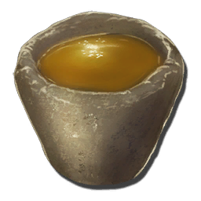 |
| Stone | 100 | 8 | PrimalItemResource_Stone_C | PrimalEarth/CoreBlueprints/Resources/PrimalItemResource_Stone.PrimalItemResource_Stone | 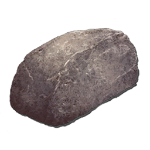 |
| Sulfur | 100 | - | PrimalItemResource_Sulfur_C | ScorchedEarth/CoreBlueprints/Resources/PrimalItemResource_Sulfur.PrimalItemResource_Sulfur | 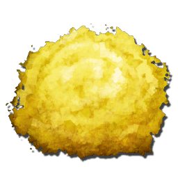 |
| Thatch | 200 | 74 | PrimalItemResource_Thatch_C | PrimalEarth/CoreBlueprints/Resources/PrimalItemResource_Thatch.PrimalItemResource_Thatch |  |
| Unstable Element | 1 | - | PrimalItemResource_ElementRefined_C | Extinction/CoreBlueprints/Resources/PrimalItemResource_ElementRefined.PrimalItemResource_ElementRefined |  |
| Unstable Element Shard | 1 | - | PrimalItemResource_ShardRefined_C | Extinction/CoreBlueprints/Resources/PrimalItemResource_ShardRefined.PrimalItemResource_ShardRefined |  |
| Wood | 100 | 7 | PrimalItemResource_Wood_C | PrimalEarth/CoreBlueprints/Resources/PrimalItemResource_Wood.PrimalItemResource_Wood | 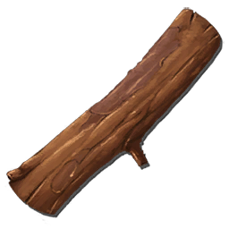 |
| Wool | 200 | - | PrimalItemResource_Wool_C | PrimalEarth/CoreBlueprints/Resources/PrimalItemResource_Wool.PrimalItemResource_Wool | 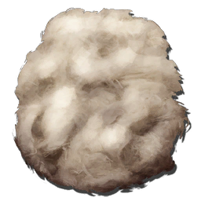 |
| Woolly Rhino Horn | 20 | - | PrimalItemResource_Horn_C | PrimalEarth/CoreBlueprints/Resources/PrimalItemResource_Horn.PrimalItemResource_Horn |  |

## Tools

| Name | Stack Size | Item ID | Class Name | Blueprint Path | Icon |
|------|-----------|---------|-----------|----------------|------|
| Blood Extraction Syringe | 1 | 44 | PrimalItem_BloodExtractor_C | PrimalEarth/Test/PrimalItem_BloodExtractor.PrimalItem_BloodExtractor | 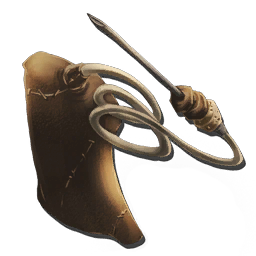 |
| Camera | 1 | - | PrimalItem_Camera_C | PrimalEarth/Test/PrimalItem_Camera.PrimalItem_Camera |  |
| Chainsaw | 1 | - | PrimalItem_ChainSaw_C | ScorchedEarth/WeaponChainsaw/PrimalItem_ChainSaw.PrimalItem_ChainSaw | 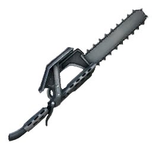 |
| Compass | 1 | 136 | PrimalItem_WeaponCompass_C | PrimalEarth/Test/PrimalItem_WeaponCompass.PrimalItem_WeaponCompass | 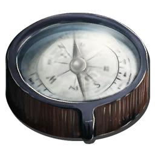 |
| Electronic Binoculars | 1 | - | PrimalItem_WeaponElectronicBinoculars_C | ScorchedEarth/WeaponElectronicBinoculars/PrimalItem_WeaponElectronicBinoculars.PrimalItem_WeaponElectronicBinoculars | 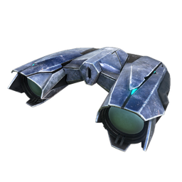 |
| Empty Cryopod | 1 | - | PrimalItem_WeaponEmptyCryopod_C | Extinction/CoreBlueprints/Weapons/PrimalItem_WeaponEmptyCryopod.PrimalItem_WeaponEmptyCryopod |  |
| Fish Net | 1 | - | PrimalItem_WeaponFishingNet_C | Genesis/Weapons/FishingNet/PrimalItem_WeaponFishingNet.PrimalItem_WeaponFishingNet |  |
| Fishing Rod | 1 | - | PrimalItem_WeaponFishingRod_C | PrimalEarth/CoreBlueprints/Weapons/PrimalItem_WeaponFishingRod.PrimalItem_WeaponFishingRod | 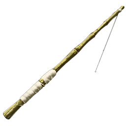 |
| GPS | 1 | 71 | PrimalItem_WeaponGPS_C | PrimalEarth/Test/PrimalItem_WeaponGPS.PrimalItem_WeaponGPS |  |
| Magnifying Glass | 1 | - | PrimalItem_WeaponMagnifyingGlass_C | PrimalEarth/Test/PrimalItem_WeaponMagnifyingGlass.PrimalItem_WeaponMagnifyingGlass |  |
| Metal Hatchet | 1 | 36 | PrimalItem_WeaponMetalHatchet_C | PrimalEarth/CoreBlueprints/Weapons/PrimalItem_WeaponMetalHatchet.PrimalItem_WeaponMetalHatchet | 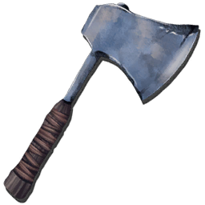 |
| Metal Pick | 1 | 35 | PrimalItem_WeaponMetalPick_C | PrimalEarth/CoreBlueprints/Weapons/PrimalItem_WeaponMetalPick.PrimalItem_WeaponMetalPick |  |
| Metal Sickle | 1 | 376 | PrimalItem_WeaponSickle_C | PrimalEarth/CoreBlueprints/Weapons/PrimalItem_WeaponSickle.PrimalItem_WeaponSickle | 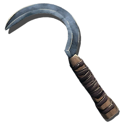 |
| Mining Drill | 1 | - | PrimalItem_WeaponMiningDrill_C | Genesis/Weapons/MiningDrill/PrimalItem_WeaponMiningDrill.PrimalItem_WeaponMiningDrill | 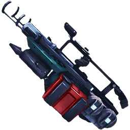 |
| Paintbrush | 1 | 38 | PrimalItem_WeaponPaintbrush_C | PrimalEarth/CoreBlueprints/Weapons/PrimalItem_WeaponPaintbrush.PrimalItem_WeaponPaintbrush |  |
| Pliers | 1 | - | PrimalItem_Pliers_C | PrimalEarth/CoreBlueprints/Items/PrimalItem_Pliers.PrimalItem_Pliers |  |
| Radio | 1 | 140 | PrimalItemRadio_C | PrimalEarth/CoreBlueprints/Weapons/PrimalItemRadio.PrimalItemRadio | 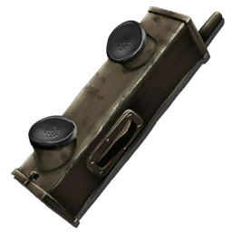 |
| Scissors | 1 | - | PrimalItem_WeaponScissors_C | PrimalEarth/CoreBlueprints/Weapons/PrimalItem_WeaponScissors.PrimalItem_WeaponScissors |  |
| Spyglass | 1 | 279 | PrimalItem_WeaponSpyglass_C | PrimalEarth/Test/PrimalItem_WeaponSpyglass.PrimalItem_WeaponSpyglass | 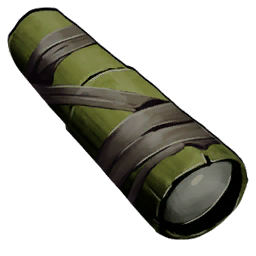 |
| Stone Hatchet | 1 | 34 | PrimalItem_WeaponStoneHatchet_C | PrimalEarth/CoreBlueprints/Weapons/PrimalItem_WeaponStoneHatchet.PrimalItem_WeaponStoneHatchet | 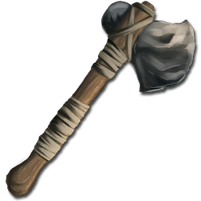 |
| Stone Pick | 1 | 33 | PrimalItem_WeaponStonePick_C | PrimalEarth/CoreBlueprints/Weapons/PrimalItem_WeaponStonePick.PrimalItem_WeaponStonePick | 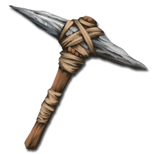 |
| Taxidermy Tool | 1 | - | PrimalItem_WeaponTaxidermyTool_C | Extinction/CoreBlueprints/Weapons/PrimalItem_WeaponTaxidermyTool.PrimalItem_WeaponTaxidermyTool | 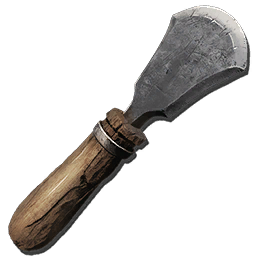 |
| Tier 1 Lootcrate | 1 | - | PrimalItemConsumable_Lootcrate_lvl1_C | Genesis/CoreBlueprints/Items/PrimalItemConsumable_Lootcrate_lvl1.PrimalItemConsumable_Lootcrate_lvl1 |  |
| Tier 2 Lootcrate | 1 | - | PrimalItemConsumable_Lootcrate_lvl2_C | Genesis/CoreBlueprints/Items/PrimalItemConsumable_Lootcrate_lvl2.PrimalItemConsumable_Lootcrate_lvl2 | 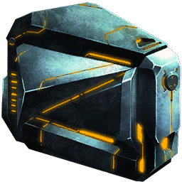 |
| Tier 3 Lootcrate | 1 | - | PrimalItemConsumable_Lootcrate_lvl3_C | Genesis/CoreBlueprints/Items/PrimalItemConsumable_Lootcrate_lvl3.PrimalItemConsumable_Lootcrate_lvl3 |  |
| Torch | 1 | 37 | PrimalItem_WeaponTorch_C | PrimalEarth/CoreBlueprints/Weapons/PrimalItem_WeaponTorch.PrimalItem_WeaponTorch | 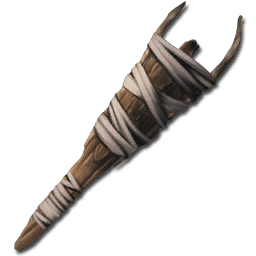 |
| Whip | 1 | - | PrimalItem_WeaponWhip_C | ScorchedEarth/WeaponWhip/PrimalItem_WeaponWhip.PrimalItem_WeaponWhip |  |

## Armor

| Name | Stack Size | Item ID | Class Name | Blueprint Path | Icon |
|------|-----------|---------|-----------|----------------|------|
| Chitin Leggings | 1 | 27 | PrimalItemArmor_ChitinPants_C | PrimalEarth/CoreBlueprints/Items/Armor/Chitin/PrimalItemArmor_ChitinPants.PrimalItemArmor_ChitinPants | 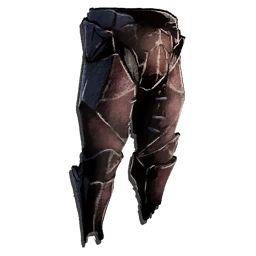 |
| Chitin Chestpiece | 1 | 28 | PrimalItemArmor_ChitinShirt_C | PrimalEarth/CoreBlueprints/Items/Armor/Chitin/PrimalItemArmor_ChitinShirt.PrimalItemArmor_ChitinShirt |  |
| Chitin Helmet | 1 | 29 | PrimalItemArmor_ChitinHelmet_C | PrimalEarth/CoreBlueprints/Items/Armor/Chitin/PrimalItemArmor_ChitinHelmet.PrimalItemArmor_ChitinHelmet |  |
| Chitin Boots | 1 | 30 | PrimalItemArmor_ChitinBoots_C | PrimalEarth/CoreBlueprints/Items/Armor/Chitin/PrimalItemArmor_ChitinBoots.PrimalItemArmor_ChitinBoots |  |
| Chitin Gauntlets | 1 | 31 | PrimalItemArmor_ChitinGloves_C | PrimalEarth/CoreBlueprints/Items/Armor/Chitin/PrimalItemArmor_ChitinGloves.PrimalItemArmor_ChitinGloves |  |
| Cloth Pants | 1 | 17 | PrimalItemArmor_ClothPants_C | PrimalEarth/CoreBlueprints/Items/Armor/Cloth/PrimalItemArmor_ClothPants.PrimalItemArmor_ClothPants |  |
| Cloth Shirt | 1 | 18 | PrimalItemArmor_ClothShirt_C | PrimalEarth/CoreBlueprints/Items/Armor/Cloth/PrimalItemArmor_ClothShirt.PrimalItemArmor_ClothShirt |  |
| Cloth Hat | 1 | 19 | PrimalItemArmor_ClothHelmet_C | PrimalEarth/CoreBlueprints/Items/Armor/Cloth/PrimalItemArmor_ClothHelmet.PrimalItemArmor_ClothHelmet |  |
| Cloth Boots | 1 | 20 | PrimalItemArmor_ClothBoots_C | PrimalEarth/CoreBlueprints/Items/Armor/Cloth/PrimalItemArmor_ClothBoots.PrimalItemArmor_ClothBoots |  |
| Cloth Gloves | 1 | 21 | PrimalItemArmor_ClothGloves_C | PrimalEarth/CoreBlueprints/Items/Armor/Cloth/PrimalItemArmor_ClothGloves.PrimalItemArmor_ClothGloves |  |
| Desert Cloth Boots | 1 | - | PrimalItemArmor_DesertClothBoots_C | ScorchedEarth/Outfits/PrimalItemArmor_DesertClothBoots.PrimalItemArmor_DesertClothBoots |  |
| Desert Cloth Gloves | 1 | - | PrimalItemArmor_DesertClothGloves_C | ScorchedEarth/Outfits/PrimalItemArmor_DesertClothGloves.PrimalItemArmor_DesertClothGloves |  |
| Desert Goggles and Hat | 1 | - | PrimalItemArmor_DesertClothGogglesHelmet_C | ScorchedEarth/Outfits/PrimalItemArmor_DesertClothGogglesHelmet.PrimalItemArmor_DesertClothGogglesHelmet |  |
| Desert Cloth Pants | 1 | - | PrimalItemArmor_DesertClothPants_C | ScorchedEarth/Outfits/PrimalItemArmor_DesertClothPants.PrimalItemArmor_DesertClothPants |  |
| Desert Cloth Shirt | 1 | - | PrimalItemArmor_DesertClothShirt_C | ScorchedEarth/Outfits/PrimalItemArmor_DesertClothShirt.PrimalItemArmor_DesertClothShirt |  |
| Federation Exo Boots | 1 | - | PrimalItemArmor_TekBoots_Gen2_C | Genesis2/CoreBlueprints/items/Armor/TEK/PrimalItemArmor_TekHelmet_Gen2.PrimalItemArmor_TekBoots_Gen2 |  |
| Federation Exo Chestpiece | 1 | - | PrimalItemArmor_TekShirt_Gen2_C | Genesis2/CoreBlueprints/items/Armor/TEK/PrimalItemArmor_TekHelmet_Gen2.PrimalItemArmor_TekShirt_Gen2 |  |
| Federation Exo Gloves | 1 | - | PrimalItemArmor_TekGloves_Gen2_C | Genesis2/CoreBlueprints/items/Armor/TEK/PrimalItemArmor_TekHelmet_Gen2.PrimalItemArmor_TekGloves_Gen2 |  |
| Federation Exo Helmet | 1 | - | PrimalItemArmor_TekHelmet_Gen2_C | Genesis2/CoreBlueprints/items/Armor/TEK/PrimalItemArmor_TekHelmet_Gen2.PrimalItemArmor_TekHelmet_Gen2 |  |
| Federation Exo Leggings | 1 | - | PrimalItemArmor_TekPants_Gen2_C | Genesis2/CoreBlueprints/items/Armor/TEK/PrimalItemArmor_TekHelmet_Gen2.PrimalItemArmor_TekPants_Gen2 |  |
| Flak Leggings | 1 | 218 | PrimalItemArmor_MetalPants_C | PrimalEarth/CoreBlueprints/Items/Armor/Metal/PrimalItemArmor_MetalPants.PrimalItemArmor_MetalPants |  |
| Flak Chestpiece | 1 | 219 | PrimalItemArmor_MetalShirt_C | PrimalEarth/CoreBlueprints/Items/Armor/Metal/PrimalItemArmor_MetalShirt.PrimalItemArmor_MetalShirt |  |
| Flak Helmet | 1 | 220 | PrimalItemArmor_MetalHelmet_C | PrimalEarth/CoreBlueprints/Items/Armor/Metal/PrimalItemArmor_MetalHelmet.PrimalItemArmor_MetalHelmet |  |
| Flak Boots | 1 | 221 | PrimalItemArmor_MetalBoots_C | PrimalEarth/CoreBlueprints/Items/Armor/Metal/PrimalItemArmor_MetalBoots.PrimalItemArmor_MetalBoots |  |
| Flak Gauntlets | 1 | 222 | PrimalItemArmor_MetalGloves_C | PrimalEarth/CoreBlueprints/Items/Armor/Metal/PrimalItemArmor_MetalGloves.PrimalItemArmor_MetalGloves |  |
| Fur Leggings | 1 | 424 | PrimalItemArmor_FurPants_C | PrimalEarth/CoreBlueprints/Items/Armor/Fur/PrimalItemArmor_FurPants.PrimalItemArmor_FurPants |  |
| Fur Chestpiece | 1 | 425 | PrimalItemArmor_FurShirt_C | PrimalEarth/CoreBlueprints/Items/Armor/Fur/PrimalItemArmor_FurShirt.PrimalItemArmor_FurShirt |  |
| Fur Cap | 1 | 426 | PrimalItemArmor_FurHelmet_C | PrimalEarth/CoreBlueprints/Items/Armor/Fur/PrimalItemArmor_FurHelmet.PrimalItemArmor_FurHelmet |  |
| Fur Boots | 1 | 427 | PrimalItemArmor_FurBoots_C | PrimalEarth/CoreBlueprints/Items/Armor/Fur/PrimalItemArmor_FurBoots.PrimalItemArmor_FurBoots |  |
| Fur Gauntlets | 1 | 428 | PrimalItemArmor_FurGloves_C | PrimalEarth/CoreBlueprints/Items/Armor/Fur/PrimalItemArmor_FurGloves.PrimalItemArmor_FurGloves |  |
| Ghillie Boots | 1 | - | PrimalItemArmor_GhillieBoots_C | PrimalEarth/CoreBlueprints/Items/Armor/Ghillie/PrimalItemArmor_GhillieBoots.PrimalItemArmor_GhillieBoots |  |
| Ghillie Chestpiece | 1 | - | PrimalItemArmor_GhillieShirt_C | PrimalEarth/CoreBlueprints/Items/Armor/Ghillie/PrimalItemArmor_GhillieShirt.PrimalItemArmor_GhillieShirt |  |
| Ghillie Gauntlets | 1 | - | PrimalItemArmor_GhillieGloves_C | PrimalEarth/CoreBlueprints/Items/Armor/Ghillie/PrimalItemArmor_GhillieGloves.PrimalItemArmor_GhillieGloves |  |
| Ghillie Leggings | 1 | - | PrimalItemArmor_GhilliePants_C | PrimalEarth/CoreBlueprints/Items/Armor/Ghillie/PrimalItemArmor_GhilliePants.PrimalItemArmor_GhilliePants |  |
| Ghillie Mask | 1 | - | PrimalItemArmor_GhillieHelmet_C | PrimalEarth/CoreBlueprints/Items/Armor/Ghillie/PrimalItemArmor_GhillieHelmet.PrimalItemArmor_GhillieHelmet |  |
| Hazard Suit Boots | 1 | - | PrimalItemArmor_HazardSuitBoots_C | Aberration/CoreBlueprints/Items/Armor/HazardSuit/PrimalItemArmor_HazardSuitBoots.PrimalItemArmor_HazardSuitBoots |  |
| Hazard Suit Gloves | 1 | - | PrimalItemArmor_HazardSuitGloves_C | Aberration/CoreBlueprints/Items/Armor/HazardSuit/PrimalItemArmor_HazardSuitGloves.PrimalItemArmor_HazardSuitGloves |  |
| Hazard Suit Hat | 1 | - | PrimalItemArmor_HazardSuitHelmet_C | Aberration/CoreBlueprints/Items/Armor/HazardSuit/PrimalItemArmor_HazardSuitHelmet.PrimalItemArmor_HazardSuitHelmet |  |
| Hazard Suit Pants | 1 | - | PrimalItemArmor_HazardSuitPants_C | Aberration/CoreBlueprints/Items/Armor/HazardSuit/PrimalItemArmor_HazardSuitPants.PrimalItemArmor_HazardSuitPants |  |
| Hazard Suit Shirt | 1 | - | PrimalItemArmor_HazardSuitShirt_C | Aberration/CoreBlueprints/Items/Armor/HazardSuit/PrimalItemArmor_HazardSuitShirt.PrimalItemArmor_HazardSuitShirt |  |
| Hide Pants | 1 | 22 | PrimalItemArmor_HidePants_C | PrimalEarth/CoreBlueprints/Items/Armor/Leather/PrimalItemArmor_HidePants.PrimalItemArmor_HidePants |  |
| Hide Shirt | 1 | 23 | PrimalItemArmor_HideShirt_C | PrimalEarth/CoreBlueprints/Items/Armor/Leather/PrimalItemArmor_HideShirt.PrimalItemArmor_HideShirt |  |
| Hide Hat | 1 | 24 | PrimalItemArmor_HideHelmet_C | PrimalEarth/CoreBlueprints/Items/Armor/Leather/PrimalItemArmor_HideHelmet.PrimalItemArmor_HideHelmet |  |
| Hide Boots | 1 | 25 | PrimalItemArmor_HideBoots_C | PrimalEarth/CoreBlueprints/Items/Armor/Leather/PrimalItemArmor_HideBoots.PrimalItemArmor_HideBoots |  |
| Hide Gloves | 1 | 26 | PrimalItemArmor_HideGloves_C | PrimalEarth/CoreBlueprints/Items/Armor/Leather/PrimalItemArmor_HideGloves.PrimalItemArmor_HideGloves |  |
| M.D.S.M. | 1 | - | PrimalItemArmor_MekBackpack_Shield_C | Extinction/CoreBlueprints/Items/Saddle/PrimalItemArmor_MekBackpack_Shield.PrimalItemArmor_MekBackpack_Shield |  |
| M.O.M.I. | 1 | - | PrimalItemArmor_MekTransformer_C | Extinction/CoreBlueprints/Items/Saddle/PrimalItemArmor_MekTransformer.PrimalItemArmor_MekTransformer |  |
| M.R.L.M. | 1 | - | PrimalItemArmor_MekBackpack_MissilePod_C | Extinction/CoreBlueprints/Items/Saddle/PrimalItemArmor_MekBackpack_MissilePod.PrimalItemArmor_MekBackpack_MissilePod |  |
| M.S.C.M. | 1 | - | PrimalItemArmor_MekBackpack_SiegeCannon_C | Extinction/CoreBlueprints/Items/Saddle/PrimalItemArmor_MekBackpack_SiegeCannon.PrimalItemArmor_MekBackpack_SiegeCannon |  |
| Pearl Leggings | 1 | - | PrimalItemArmor_PearlPants_C | Abyss/CoreBlueprints/Items/Armor/Pearl/PrimalItemArmor_PearlPants.PrimalItemArmor_PearlPants |  |
| Pearl Chestpiece | 1 | - | PrimalItemArmor_PearlShirt_C | Abyss/CoreBlueprints/Items/Armor/Pearl/PrimalItemArmor_PearlShirt.PrimalItemArmor_PearlShirt |  |
| Pearl Gauntlets | 1 | - | PrimalItemArmor_PearlGloves_C | Abyss/CoreBlueprints/Items/Armor/Pearl/PrimalItemArmor_PearlGloves.PrimalItemArmor_PearlGloves |  |
| Pearl Boots | 1 | - | PrimalItemArmor_PearlBoots_C | Abyss/CoreBlueprints/Items/Armor/Pearl/PrimalItemArmor_PearlBoots.PrimalItemArmor_PearlBoots |  |
| Pearl Helmet | 1 | - | PrimalItemArmor_PearlHelmet_C | Abyss/CoreBlueprints/Items/Armor/Pearl/PrimalItemArmor_PearlHelmet.PrimalItemArmor_PearlHelmet |  |
| Riot Leggings | 1 | 441 | PrimalItemArmor_RiotPants_C | PrimalEarth/CoreBlueprints/Items/Armor/Riot/PrimalItemArmor_RiotPants.PrimalItemArmor_RiotPants |  |
| Riot Chestpiece | 1 | 442 | PrimalItemArmor_RiotShirt_C | PrimalEarth/CoreBlueprints/Items/Armor/Riot/PrimalItemArmor_RiotShirt.PrimalItemArmor_RiotShirt |  |
| Riot Gauntlets | 1 | 443 | PrimalItemArmor_RiotGloves_C | PrimalEarth/CoreBlueprints/Items/Armor/Riot/PrimalItemArmor_RiotGloves.PrimalItemArmor_RiotGloves |  |
| Riot Boots | 1 | 444 | PrimalItemArmor_RiotBoots_C | PrimalEarth/CoreBlueprints/Items/Armor/Riot/PrimalItemArmor_RiotBoots.PrimalItemArmor_RiotBoots |  |
| Riot Helmet | 1 | 445 | PrimalItemArmor_RiotHelmet_C | PrimalEarth/CoreBlueprints/Items/Armor/Riot/PrimalItemArmor_RiotHelmet.PrimalItemArmor_RiotHelmet |  |
| SCUBA Leggings | 1 | - | PrimalItemArmor_ScubaPants_C | PrimalEarth/CoreBlueprints/Items/Armor/SCUBA/PrimalItemArmor_ScubaPants.PrimalItemArmor_ScubaPants |  |
| SCUBA Tank | 1 | 383 | PrimalItemArmor_ScubaShirt_SuitWithTank_C | PrimalEarth/CoreBlueprints/Items/Armor/SCUBA/PrimalItemArmor_ScubaShirt_SuitWithTank.PrimalItemArmor_ScubaShirt_SuitWithTank |  |
| SCUBA Mask | 1 | 384 | PrimalItemArmor_ScubaHelmet_Goggles_C | PrimalEarth/CoreBlueprints/Items/Armor/SCUBA/PrimalItemArmor_ScubaHelmet_Goggles.PrimalItemArmor_ScubaHelmet_Goggles |  |
| SCUBA Flippers | 1 | 385 | PrimalItemArmor_ScubaBoots_Flippers_C | PrimalEarth/CoreBlueprints/Items/Armor/SCUBA/PrimalItemArmor_ScubaBoots_Flippers.PrimalItemArmor_ScubaBoots_Flippers |  |
| Tek Boots | 1 | - | PrimalItemArmor_TekBoots_C | PrimalEarth/CoreBlueprints/Items/Armor/TEK/PrimalItemArmor_TekBoots.PrimalItemArmor_TekBoots |  |
| Tek Chestpiece | 1 | - | PrimalItemArmor_TekShirt_C | PrimalEarth/CoreBlueprints/Items/Armor/TEK/PrimalItemArmor_TekShirt.PrimalItemArmor_TekShirt |  |
| Tek Gauntlets | 1 | - | PrimalItemArmor_TekGloves_C | PrimalEarth/CoreBlueprints/Items/Armor/TEK/PrimalItemArmor_TekGloves.PrimalItemArmor_TekGloves |  |
| Tek Helmet | 1 | - | PrimalItemArmor_TekHelmet_C | PrimalEarth/CoreBlueprints/Items/Armor/TEK/PrimalItemArmor_TekHelmet.PrimalItemArmor_TekHelmet |  |
| Tek Leggings | 1 | - | PrimalItemArmor_TekPants_C | PrimalEarth/CoreBlueprints/Items/Armor/TEK/PrimalItemArmor_TekPants.PrimalItemArmor_TekPants |  |
| Tek Shoulder Cannon | 1 | 497 | PrimalItemArmor_ShoulderCannon_C | Genesis/Items/Armor/PrimalItemArmor_ShoulderCannon.PrimalItemArmor_ShoulderCannon |  |
| Wooden Shield | 1 | - | PrimalItemArmor_WoodShield_C | PrimalEarth/CoreBlueprints/Items/Armor/Shields/PrimalItemArmor_WoodShield.PrimalItemArmor_WoodShield |  |
| Metal Shield | 1 | - | PrimalItemArmor_MetalShield_C | PrimalEarth/CoreBlueprints/Items/Armor/Shields/PrimalItemArmor_MetalShield.PrimalItemArmor_MetalShield |  |
| Riot Shield | 1 | - | PrimalItemArmor_TransparentRiotShield_C | PrimalEarth/CoreBlueprints/Items/Armor/Shields/PrimalItemArmor_TransparentRiotShield.PrimalItemArmor_TransparentRiotShield |  |
| Tek Shield | 1 | - | PrimalItemArmor_ShieldTek_C | PrimalEarth/CoreBlueprints/Items/Armor/Shields/PrimalItemArmor_ShieldTek.PrimalItemArmor_ShieldTek |  |
| Gas Mask | 1 | - | PrimalItemArmor_GasMask_C | PrimalEarth/CoreBlueprints/Items/Armor/SCUBA/PrimalItemArmor_GasMask.PrimalItemArmor_GasMask |  |
| Heavy Miner's Helmet | 1 | 301 | PrimalItemArmor_MinersHelmet_C | PrimalEarth/CoreBlueprints/Items/Armor/Metal/PrimalItemArmor_MinersHelmet.PrimalItemArmor_MinersHelmet |  |
| Night Vision Goggles | 1 | - | PrimalItemArmor_NightVisionGoggles_C | PrimalEarth/CoreBlueprints/Items/Armor/SCUBA/PrimalItemArmor_NightVisionGoggles.PrimalItemArmor_NightVisionGoggles |  |
| Parachute | 20 | 184 | PrimalItemConsumableBuff_Parachute_C | PrimalEarth/CoreBlueprints/Items/Consumables/BaseBPs/PrimalItemConsumableBuff_Parachute.PrimalItemConsumableBuff_Parachute |  |

## Saddles

| Name | Stack Size | Item ID | Class Name | Blueprint Path | Icon |
|------|-----------|---------|-----------|----------------|------|
| Allosaurus Saddle | 1 | - | PrimalItemArmor_AlloSaddle_C | PrimalEarth/CoreBlueprints/Items/Armor/Saddles/PrimalItemArmor_AlloSaddle.PrimalItemArmor_AlloSaddle |  |
| Amargasaurus Saddle | 1 | - | PrimalItemArmor_AmargaSaddle_C | LostIsland/Dinos/Amargasaurus/PrimalItemArmor_AmargaSaddle.PrimalItemArmor_AmargaSaddle |  |
| Andrewsarchus Saddle | 1 | - | PrimalItemArmor_AndrewsarchusSaddle_C | Fjordur/Dinos/Andrewsarchus/PrimalItemArmor_AndrewsarchusSaddle.PrimalItemArmor_AndrewsarchusSaddle |  |
| Ankylo Saddle | 1 | 206 | PrimalItemArmor_AnkyloSaddle_C | PrimalEarth/CoreBlueprints/Items/Armor/Saddles/PrimalItemArmor_AnkyloSaddle.PrimalItemArmor_AnkyloSaddle |  |
| Araneo Saddle | 1 | - | PrimalItemArmor_SpiderSaddle_C | PrimalEarth/CoreBlueprints/Items/Armor/Saddles/PrimalItemArmor_SpiderSaddle.PrimalItemArmor_SpiderSaddle |  |
| Argentavis Saddle | 1 | 211 | PrimalItemArmor_ArgentavisSaddle_C | PrimalEarth/CoreBlueprints/Items/Armor/Saddles/PrimalItemArmor_ArgentavisSaddle.PrimalItemArmor_ArgentavisSaddle |  |
| Arthropluera Saddle | 1 | - | PrimalItemArmor_ArthroSaddle_C | PrimalEarth/CoreBlueprints/Items/Armor/Saddles/PrimalItemArmor_ArthroSaddle.PrimalItemArmor_ArthroSaddle |  |
| Astrocetus Tek Saddle | 1 | 498 | PrimalItemArmor_SpaceWhaleSaddle_Tek_C | Genesis/Dinos/SpaceWhale/PrimalItemArmor_SpaceWhaleSaddle_Tek.PrimalItemArmor_SpaceWhaleSaddle_Tek |  |
| Astrodelphis Starwing Saddle | 1 | - | PrimalItemArmor_SpaceDolphinSaddle_Tek_C | Genesis2/Dinos/SpaceDolphin/PrimalItemArmor_SpaceDolphinSaddle_Tek.PrimalItemArmor_SpaceDolphinSaddle_Tek |  |
| Baryonyx Saddle | 1 | - | PrimalItemArmor_BaryonyxSaddle_C | PrimalEarth/CoreBlueprints/Items/Armor/Saddles/PrimalItemArmor_BaryonyxSaddle.PrimalItemArmor_BaryonyxSaddle |  |
| Basilisk Saddle | 1 | - | PrimalItemArmor_BasiliskSaddle_C | Aberration/Dinos/Basilisk/PrimalItemArmor_BasiliskSaddle.PrimalItemArmor_BasiliskSaddle |  |
| Basilosaurus Saddle | 1 | - | PrimalItemArmor_BasiloSaddle_C | PrimalEarth/CoreBlueprints/Items/Armor/Saddles/PrimalItemArmor_BasiloSaddle.PrimalItemArmor_BasiloSaddle |  |
| Beelzebufo Saddle | 1 | 422 | PrimalItemArmor_ToadSaddle_C | PrimalEarth/CoreBlueprints/Items/Armor/Saddles/PrimalItemArmor_ToadSaddle.PrimalItemArmor_ToadSaddle |  |
| Bronto Platform Saddle | 1 | 411 | PrimalItemArmor_SauroSaddle_Platform_C | PrimalEarth/CoreBlueprints/Items/Armor/Saddles/PrimalItemArmor_SauroSaddle_Platform.PrimalItemArmor_SauroSaddle_Platform |  |
| Bronto Saddle | 1 | 134 | PrimalItemArmor_SauroSaddle_C | PrimalEarth/CoreBlueprints/Items/Armor/Saddles/PrimalItemArmor_SauroSaddle.PrimalItemArmor_SauroSaddle |  |
| Carbonemys Saddle | 1 | 204 | PrimalItemArmor_TurtleSaddle_C | PrimalEarth/CoreBlueprints/Items/Armor/Saddles/PrimalItemArmor_TurtleSaddle.PrimalItemArmor_TurtleSaddle |  |
| Carcharo Saddle | 1 | - | PrimalItemArmor_CarchaSaddle_C | PrimalEarth/CoreBlueprints/Items/Armor/Saddles/PrimalItemArmor_CarchaSaddle.PrimalItemArmor_CarchaSaddle |  |
| Carno Saddle | 1 | 210 | PrimalItemArmor_CarnoSaddle_C | PrimalEarth/CoreBlueprints/Items/Armor/Saddles/PrimalItemArmor_CarnoSaddle.PrimalItemArmor_CarnoSaddle |  |
| Castoroides Saddle | 1 | - | PrimalItemArmor_BeaverSaddle_C | PrimalEarth/CoreBlueprints/Items/Armor/Saddles/PrimalItemArmor_BeaverSaddle.PrimalItemArmor_BeaverSaddle |  |
| Chalicotherium Saddle | 1 | - | PrimalItemArmor_ChalicoSaddle_C | PrimalEarth/CoreBlueprints/Items/Armor/Saddles/PrimalItemArmor_ChalicoSaddle.PrimalItemArmor_ChalicoSaddle |  |
| Daeodon Saddle | 1 | - | PrimalItemArmor_DaeodonSaddle_C | PrimalEarth/CoreBlueprints/Items/Armor/Saddles/PrimalItemArmor_DaeodonSaddle.PrimalItemArmor_DaeodonSaddle |  |
| Dakosaurus Platform Saddle | 1 | - | PrimalItemArmor_DakosaurusSaddle_Platform_C | Abyss/Dinos/Dakosaurus/Saddle/PrimalItemArmor_DakosaurusSaddle_Platform.PrimalItemArmor_DakosaurusSaddle_Platform |  |
| Dakosaurus Saddle | 1 | - | PrimalItemArmor_DakosaurusSaddle_C | Abyss/Dinos/Dakosaurus/Saddle/PrimalItemArmor_DakosaurusSaddle.PrimalItemArmor_DakosaurusSaddle |  |
| Deinonychus Saddle | 1 | - | PrimalItemArmor_DeinonychusSaddle_C | Valguero/Dinos/Deinonychus/PrimalItemArmor_DeinonychusSaddle.PrimalItemArmor_DeinonychusSaddle |  |
| Desmodus Saddle | 1 | - | PrimalItemArmor_DesmodusSaddle_C | Fjordur/Dinos/Desmodus/PrimalItemArmor_DesmodusSaddle.PrimalItemArmor_DesmodusSaddle |  |
| Diplodocus Saddle | 1 | - | PrimalItemArmor_DiplodocusSaddle_C | PrimalEarth/CoreBlueprints/Items/Armor/Saddles/PrimalItemArmor_DiplodocusSaddle.PrimalItemArmor_DiplodocusSaddle |  |
| Direbear Saddle | 1 | - | PrimalItemArmor_DireBearSaddle_C | PrimalEarth/CoreBlueprints/Items/Armor/Saddles/PrimalItemArmor_DireBearSaddle.PrimalItemArmor_DireBearSaddle |  |
| Doedicurus Saddle | 1 | 389 | PrimalItemArmor_DoedSaddle_C | PrimalEarth/CoreBlueprints/Items/Armor/Saddles/PrimalItemArmor_DoedSaddle.PrimalItemArmor_DoedSaddle |  |
| Dunkleosteus Saddle | 1 | - | PrimalItemArmor_DunkleosteusSaddle_C | PrimalEarth/CoreBlueprints/Items/Armor/Saddles/PrimalItemArmor_DunkleosteusSaddle.PrimalItemArmor_DunkleosteusSaddle |  |
| Equus Saddle | 1 | - | PrimalItemArmor_EquusSaddle_C | PrimalEarth/CoreBlueprints/Items/Armor/Saddles/PrimalItemArmor_EquusSaddle.PrimalItemArmor_EquusSaddle |  |
| Gacha Saddle | 1 | - | PrimalItemArmor_GachaSaddle_C | Extinction/CoreBlueprints/Items/Saddle/PrimalItemArmor_GachaSaddle.PrimalItemArmor_GachaSaddle |  |
| Gallimimus Saddle | 1 | - | PrimalItemArmor_Gallimimus_C | PrimalEarth/CoreBlueprints/Items/Armor/Saddles/PrimalItemArmor_Gallimimus.PrimalItemArmor_Gallimimus |  |
| Gasbags Saddle | 1 | - | PrimalItemArmor_GasBagsSaddle_C | Extinction/CoreBlueprints/Items/Saddle/PrimalItemArmor_GasBagsSaddle.PrimalItemArmor_GasBagsSaddle |  |
| Giganotosaurus Saddle | 1 | - | PrimalItemArmor_GigantSaddle_C | PrimalEarth/CoreBlueprints/Items/Armor/Saddles/PrimalItemArmor_GigantSaddle.PrimalItemArmor_GigantSaddle |  |
| Homarus Saddle | 1 | - | PrimalItemArmor_HomarusSaddle_C | Abyss/Dinos/Homarus/Saddle/PrimalItemArmor_HomarusSaddle.PrimalItemArmor_HomarusSaddle |  |
| Hyaenodon Meatpack | 1 | - | PrimalItemArmor_HyaenodonSaddle_C | PrimalEarth/CoreBlueprints/Items/Armor/Saddles/PrimalItemArmor_HyaenodonSaddle.PrimalItemArmor_HyaenodonSaddle |  |
| Ichthyosaurus Saddle | 1 | 310 | PrimalItemArmor_DolphinSaddle_C | PrimalEarth/CoreBlueprints/Items/Armor/Saddles/PrimalItemArmor_DolphinSaddle.PrimalItemArmor_DolphinSaddle |  |
| Iguanodon Saddle | 1 | - | PrimalItemArmor_IguanodonSaddle_C | PrimalEarth/CoreBlueprints/Items/Armor/Saddles/PrimalItemArmor_IguanodonSaddle.PrimalItemArmor_IguanodonSaddle |  |
| Kaprosuchus Saddle | 1 | - | PrimalItemArmor_KaprosuchusSaddle_C | PrimalEarth/CoreBlueprints/Items/Armor/Saddles/PrimalItemArmor_KaprosuchusSaddle.PrimalItemArmor_KaprosuchusSaddle |  |
| Karkinos Saddle | 1 | - | PrimalItemArmor_CrabSaddle_C | Aberration/Dinos/Crab/PrimalItemArmor_CrabSaddle.PrimalItemArmor_CrabSaddle |  |
| Lymantria Saddle | 1 | - | PrimalItemArmor_MothSaddle_C | ScorchedEarth/Dinos/Moth/PrimalItemArmor_MothSaddle.PrimalItemArmor_MothSaddle |  |
| Magmasaur Saddle | 1 | - | PrimalItemArmor_CherufeSaddle_C | Genesis/Dinos/Cherufe/PrimalItemArmor_CherufeSaddle.PrimalItemArmor_CherufeSaddle |  |
| Maewing Saddle | 1 | - | PrimalItemArmor_MilkgliderSaddle_C | Genesis2/Dinos/MilkGlider/PrimalItemArmor_MilkGliderSaddle.PrimalItemArmor_MilkGliderSaddle |  |
| Malleocephalus Saddle | 1 | - | PrimalItemArmor_MalleocephalusSaddle_C | Abyss/Dinos/Malleocephalus/Saddle/PrimalItemArmor_MalleocephalusSaddle.PrimalItemArmor_MalleocephalusSaddle |  |
| Mammoth Saddle | 1 | 207 | PrimalItemArmor_MammothSaddle_C | PrimalEarth/CoreBlueprints/Items/Armor/Saddles/PrimalItemArmor_MammothSaddle.PrimalItemArmor_MammothSaddle |  |
| Managarmr Saddle | 1 | - | PrimalItemArmor_IceJumperSaddle_C | Extinction/CoreBlueprints/Items/Saddle/PrimalItemArmor_IceJumperSaddle.PrimalItemArmor_IceJumperSaddle |  |
| Manta Saddle | 1 | - | PrimalItemArmor_MantaSaddle_C | PrimalEarth/CoreBlueprints/Items/Armor/Saddles/PrimalItemArmor_MantaSaddle.PrimalItemArmor_MantaSaddle |  |
| Mantis Saddle | 1 | - | PrimalItemArmor_MantisSaddle_C | ScorchedEarth/Dinos/Mantis/PrimalItemArmor_MantisSaddle.PrimalItemArmor_MantisSaddle |  |
| Megachelon Platform Saddle | 1 | - | PrimalItemArmor_GiantTurtleSaddle_C | Genesis/Dinos/GiantTurtle/PrimalItemArmor_GiantTurtleSaddle.PrimalItemArmor_GiantTurtleSaddle |  |
| Megaloceros Saddle | 1 | 423 | PrimalItemArmor_StagSaddle_C | PrimalEarth/CoreBlueprints/Items/Armor/Saddles/PrimalItemArmor_StagSaddle.PrimalItemArmor_StagSaddle |  |
| Megalodon Saddle | 1 | 208 | PrimalItemArmor_MegalodonSaddle_C | PrimalEarth/CoreBlueprints/Items/Armor/Saddles/PrimalItemArmor_MegalodonSaddle.PrimalItemArmor_MegalodonSaddle |  |
| Megalosaurus Saddle | 1 | - | PrimalItemArmor_MegalosaurusSaddle_C | PrimalEarth/CoreBlueprints/Items/Armor/Saddles/PrimalItemArmor_MegalosaurusSaddle.PrimalItemArmor_MegalosaurusSaddle |  |
| Megalania Saddle | 1 | - | PrimalItemArmor_MegalaniaSaddle_C | PrimalEarth/CoreBlueprints/Items/Armor/Saddles/PrimalItemArmor_MegalaniaSaddle.PrimalItemArmor_MegalaniaSaddle |  |
| Megalodon Tek Saddle | 1 | - | PrimalItemArmor_MegalodonSaddle_Tek_C | PrimalEarth/CoreBlueprints/Items/Armor/Saddles/PrimalItemArmor_MegalodonSaddle_Tek.PrimalItemArmor_MegalodonSaddle_Tek |  |
| Megatherium Saddle | 1 | - | PrimalItemArmor_MegatheriumSaddle_C | PrimalEarth/CoreBlueprints/Items/Armor/Saddles/PrimalItemArmor_MegatheriumSaddle.PrimalItemArmor_MegatheriumSaddle |  |
| Monodon Saddle | 1 | - | PrimalItemArmor_MonodonSaddle_C | Abyss/Dinos/Monodon/Saddle/PrimalItemArmor_MonodonSaddle.PrimalItemArmor_MonodonSaddle |  |
| Morellatops Saddle | 1 | - | PrimalItemArmor_CamelsaurusSaddle_C | ScorchedEarth/Dinos/Camelsaurus/PrimalItemArmor_CamelsaurusSaddle.PrimalItemArmor_CamelsaurusSaddle |  |
| Mosasaur Platform Saddle | 1 | - | PrimalItemArmor_MosaSaddle_Platform_C | PrimalEarth/CoreBlueprints/Items/Armor/Saddles/PrimalItemArmor_MosaSaddle_Platform.PrimalItemArmor_MosaSaddle_Platform |  |
| Mosasaur Saddle | 1 | - | PrimalItemArmor_MosaSaddle_C | PrimalEarth/CoreBlueprints/Items/Armor/Saddles/PrimalItemArmor_MosaSaddle.PrimalItemArmor_MosaSaddle |  |
| Mosasaur Tek Saddle | 1 | - | PrimalItemArmor_MosaSaddle_Tek_C | PrimalEarth/CoreBlueprints/Items/Armor/Saddles/PrimalItemArmor_MosaSaddle_Tek.PrimalItemArmor_MosaSaddle_Tek |  |
| Ocepechelon Saddle | 1 | 412 | PrimalItemArmor_OcepechelonSaddle_C | Abyss/Dinos/Ocepechelon/Saddle/PrimalItemArmor_OcepechelonSaddle.PrimalItemArmor_OcepechelonSaddle |  |
| Onchopristis Saddle | 1 | 412 | PrimalItemArmor_OnchopritisSaddle_C | Abyss/Dinos/Onchopristis/Saddle/PrimalItemArmor_OnchopritisSaddle.PrimalItemArmor_OnchopritisSaddle |  |
| Pachy Saddle | 1 | 412 | PrimalItemArmor_PachySaddle_C | PrimalEarth/CoreBlueprints/Items/Armor/Saddles/PrimalItemArmor_PachySaddle.PrimalItemArmor_PachySaddle |  |
| Pachyrhinosaurus Saddle | 1 | - | PrimalItemArmor_PachyrhinoSaddle_C | PrimalEarth/CoreBlueprints/Items/Armor/Saddles/PrimalItemArmor_PachyrhinoSaddle.PrimalItemArmor_PachyrhinoSaddle |  |
| Paracer Platform Saddle | 1 | 418 | PrimalItemArmor_ParacerSaddle_Platform_C | PrimalEarth/CoreBlueprints/Items/Armor/Saddles/PrimalItemArmor_ParacerSaddle_Platform.PrimalItemArmor_ParacerSaddle_Platform |  |
| Paracer Saddle | 1 | 417 | PrimalItemArmor_Paracer_Saddle_C | PrimalEarth/CoreBlueprints/Items/Armor/Saddles/PrimalItemArmor_Paracer_Saddle.PrimalItemArmor_Paracer_Saddle |  |
| Parasaur Saddle | 1 | 99 | PrimalItemArmor_ParaSaddle_C | PrimalEarth/CoreBlueprints/Items/Armor/Saddles/PrimalItemArmor_ParaSaddle.PrimalItemArmor_ParaSaddle |  |
| Pelagornis Saddle | 1 | - | PrimalItemArmor_PelaSaddle_C | PrimalEarth/CoreBlueprints/Items/Armor/Saddles/PrimalItemArmor_PelaSaddle.PrimalItemArmor_PelaSaddle |  |
| Phiomia Saddle | 1 | 281 | PrimalItemArmor_PhiomiaSaddle_C | PrimalEarth/CoreBlueprints/Items/Armor/Saddles/PrimalItemArmor_PhiomiaSaddle.PrimalItemArmor_PhiomiaSaddle |  |
| Plesiosaur Platform Saddle | 1 | - | PrimalItemArmor_PlesiSaddle_Platform_C | PrimalEarth/CoreBlueprints/Items/Armor/Saddles/PrimalItemArmor_PlesiSaddle_Platform.PrimalItemArmor_PlesiSaddle_Platform |  |
| Plesiosaur Saddle | 1 | 309 | PrimalItemArmor_PlesiaSaddle_C | PrimalEarth/CoreBlueprints/Items/Armor/Saddles/PrimalItemArmor_PlesiaSaddle.PrimalItemArmor_PlesiaSaddle |  |
| Procoptodon Saddle | 1 | - | PrimalItemArmor_ProcoptodonSaddle_C | PrimalEarth/CoreBlueprints/Items/Armor/Saddles/PrimalItemArmor_ProcoptodonSaddle.PrimalItemArmor_ProcoptodonSaddle |  |
| Pteranodon Saddle | 1 | 130 | PrimalItemArmor_PteroSaddle_C | PrimalEarth/CoreBlueprints/Items/Armor/Saddles/PrimalItemArmor_PteroSaddle.PrimalItemArmor_PteroSaddle |  |
| Pulmonoscorpius Saddle | 1 | 103 | PrimalItemArmor_ScorpionSaddle_C | PrimalEarth/CoreBlueprints/Items/Armor/Saddles/PrimalItemArmor_ScorpionSaddle.PrimalItemArmor_ScorpionSaddle |  |
| Quetz Platform Saddle | 1 | - | PrimalItemArmor_QuetzSaddle_Platform_C | PrimalEarth/CoreBlueprints/Items/Armor/Saddles/PrimalItemArmor_QuetzSaddle_Platform.PrimalItemArmor_QuetzSaddle_Platform |  |
| Quetz Saddle | 1 | - | PrimalItemArmor_QuetzSaddle_C | PrimalEarth/CoreBlueprints/Items/Armor/Saddles/PrimalItemArmor_QuetzSaddle.PrimalItemArmor_QuetzSaddle |  |
| Raptor Saddle | 1 | 100 | PrimalItemArmor_RaptorSaddle_C | PrimalEarth/CoreBlueprints/Items/Armor/Saddles/PrimalItemArmor_RaptorSaddle.PrimalItemArmor_RaptorSaddle |  |
| Ravager Saddle | 1 | - | PrimalItemArmor_CavewolfSaddle_C | Aberration/Dinos/CaveWolf/PrimalItemArmor_CavewolfSaddle.PrimalItemArmor_CavewolfSaddle |  |
| Rex Saddle | 1 | 69 | PrimalItemArmor_RexSaddle_C | PrimalEarth/CoreBlueprints/Items/Armor/Saddles/PrimalItemArmor_RexSaddle.PrimalItemArmor_RexSaddle |  |
| Rex Tek Saddle | 1 | - | PrimalItemArmor_RexSaddle_Tek_C | PrimalEarth/CoreBlueprints/Items/Armor/Saddles/PrimalItemArmor_RexSaddle_Tek.PrimalItemArmor_RexSaddle_Tek |  |
| Rhyniognatha Saddle | 1 | - | PrimalItemArmor_RhynioSaddle_C | PrimalEarth/CoreBlueprints/Items/Armor/Saddles/PrimalItemArmor_RhynioSaddle.PrimalItemArmor_RhynioSaddle |  |
| Rock Drake Saddle | 1 | - | PrimalItemArmor_RockDrakeSaddle_C | Aberration/Dinos/RockDrake/PrimalItemArmor_RockDrakeSaddle.PrimalItemArmor_RockDrakeSaddle |  |
| Rock Drake Tek Saddle | 1 | - | PrimalItemArmor_RockDrakeSaddle_Tek_C | Aberration/Dinos/RockDrake/PrimalItemArmor_RockDrakeSaddle_Tek.PrimalItemArmor_RockDrakeSaddle_Tek |  |
| Rock Golem Saddle | 1 | - | PrimalItemArmor_RockGolemSaddle_C | ScorchedEarth/Dinos/RockGolem/PrimalItemArmor_RockGolemSaddle.PrimalItemArmor_RockGolemSaddle |  |
| Roll Rat Saddle | 1 | - | PrimalItemArmor_MoleRatSaddle_C | Aberration/Dinos/MoleRat/PrimalItemArmor_MoleRatSaddle.PrimalItemArmor_MoleRatSaddle |  |
| Sabertooth Saddle | 1 | 209 | PrimalItemArmor_SaberSaddle_C | PrimalEarth/CoreBlueprints/Items/Armor/Saddles/PrimalItemArmor_SaberSaddle.PrimalItemArmor_SaberSaddle |  |
| Sarco Saddle | 1 | 205 | PrimalItemArmor_SarcoSaddle_C | PrimalEarth/CoreBlueprints/Items/Armor/Saddles/PrimalItemArmor_SarcoSaddle.PrimalItemArmor_SarcoSaddle |  |
| Seahorse Saddle | 1 | 205 | PrimalItemArmor_SeahorseSaddle_C | Abyss/Dinos/Seahorse/Saddle/PrimalItemArmor_SeahorseSaddle.PrimalItemArmor_SeahorseSaddle |  |
| Snow Owl Saddle | 1 | - | PrimalItemArmor_OwlSaddle_C | Extinction/CoreBlueprints/Items/Saddle/PrimalItemArmor_OwlSaddle.PrimalItemArmor_OwlSaddle |  |
| Spino Saddle | 1 | 299 | PrimalItemArmor_SpinoSaddle_C | PrimalEarth/CoreBlueprints/Items/Armor/Saddles/PrimalItemArmor_SpinoSaddle.PrimalItemArmor_SpinoSaddle |  |
| Stego Saddle | 1 | 101 | PrimalItemArmor_StegoSaddle_C | PrimalEarth/CoreBlueprints/Items/Armor/Saddles/PrimalItemArmor_StegoSaddle.PrimalItemArmor_StegoSaddle |  |
| Tapejara Saddle | 1 | - | PrimalItemArmor_TapejaraSaddle_C | PrimalEarth/CoreBlueprints/Items/Armor/Saddles/PrimalItemArmor_TapejaraSaddle.PrimalItemArmor_TapejaraSaddle |  |
| Tapejara Tek Saddle | 1 | - | PrimalItemArmor_Tapejara_Tek_C | PrimalEarth/CoreBlueprints/Items/Armor/Saddles/PrimalItemArmor_Tapejara_Tek.PrimalItemArmor_Tapejara_Tek |  |
| Terror Bird Saddle | 1 | - | PrimalItemArmor_TerrorBirdSaddle_C | PrimalEarth/CoreBlueprints/Items/Armor/Saddles/PrimalItemArmor_TerrorBirdSaddle.PrimalItemArmor_TerrorBirdSaddle |  |
| Therizinosaurus Saddle | 1 | - | PrimalItemArmor_TherizinosaurusSaddle_C | PrimalEarth/CoreBlueprints/Items/Armor/Saddles/PrimalItemArmor_TherizinosaurusSaddle.PrimalItemArmor_TherizinosaurusSaddle |  |
| Thorny Dragon Saddle | 1 | - | PrimalItemArmor_SpineyLizardSaddle_C | ScorchedEarth/Dinos/SpineyLizard/PrimalItemArmor_SpineyLizardSaddle.PrimalItemArmor_SpineyLizardSaddle |  |
| Thylacoleo Saddle | 1 | - | PrimalItemArmor_ThylacoSaddle_C | PrimalEarth/CoreBlueprints/Items/Armor/Saddles/PrimalItemArmor_ThylacoSaddle.PrimalItemArmor_ThylacoSaddle |  |
| Titanosaur Platform Saddle | 1 | - | PrimalItemArmor_TitanSaddle_Platform_C | PrimalEarth/CoreBlueprints/Items/Armor/Saddles/PrimalItemArmor_TitanSaddle_Platform.PrimalItemArmor_TitanSaddle_Platform |  |
| Trike Saddle | 1 | 102 | PrimalItemArmor_TrikeSaddle_C | PrimalEarth/CoreBlueprints/Items/Armor/Saddles/PrimalItemArmor_TrikeSaddle.PrimalItemArmor_TrikeSaddle |  |
| Tropeognathus Saddle | 1 | - | PrimalItemArmor_TropeSaddle_C | PrimalEarth/Dinos/Tropeognathus/PrimalItemArmor_TropeSaddle.PrimalItemArmor_TropeSaddle |  |
| Tusoteuthis Saddle | 1 | - | PrimalItemArmor_TusoSaddle_C | PrimalEarth/CoreBlueprints/Items/Armor/Saddles/PrimalItemArmor_TusoSaddle.PrimalItemArmor_TusoSaddle |  |
| Velonasaur Saddle | 1 | - | PrimalItemArmor_SpindlesSaddle_C | Extinction/CoreBlueprints/Items/Saddle/PrimalItemArmor_SpindlesSaddle.PrimalItemArmor_SpindlesSaddle |  |
| Woolly Rhino Saddle | 1 | - | PrimalItemArmor_RhinoSaddle_C | PrimalEarth/CoreBlueprints/Items/Armor/Saddles/PrimalItemArmor_RhinoSaddle.PrimalItemArmor_RhinoSaddle |  |
| Yutyrannus Saddle | 1 | - | PrimalItemArmor_YutySaddle_C | PrimalEarth/CoreBlueprints/Items/Armor/Saddles/PrimalItemArmor_YutySaddle.PrimalItemArmor_YutySaddle |  |

## Structures

| Name | Stack Size | Item ID | Class Name | Blueprint Path | Icon |
|------|-----------|---------|-----------|----------------|------|
| Adobe Ceiling | 100 | - | PrimalItemStructure_AdobeCeiling_C | ScorchedEarth/Structures/Adobe/Blueprints/PrimalItemStructure_AdobeCeiling.PrimalItemStructure_AdobeCeiling |  |
| Adobe Dinosaur Gate | 100 | - | PrimalItemStructure_AdobeGateDoor_C | ScorchedEarth/Structures/Adobe/Blueprints/PrimalItemStructure_AdobeGateDoor.PrimalItemStructure_AdobeGateDoor |  |
| Adobe Dinosaur Gateway | 100 | - | PrimalItemStructure_AdobeFrameGate_C | ScorchedEarth/Structures/Adobe/Blueprints/PrimalItemStructure_AdobeFrameGate.PrimalItemStructure_AdobeFrameGate |  |
| Adobe Door | 100 | - | PrimalItemStructure_AdobeDoor_C | ScorchedEarth/Structures/Adobe/Blueprints/PrimalItemStructure_AdobeDoor.PrimalItemStructure_AdobeDoor |  |
| Adobe Doorframe | 100 | - | PrimalItemStructure_AdobeWallWithDoor_C | ScorchedEarth/Structures/Adobe/Blueprints/PrimalItemStructure_AdobeWallWithDoor.PrimalItemStructure_AdobeWallWithDoor |  |
| Adobe Double Doorframe | 100 | 456 | PrimalItemStructure_DoubleDoorframe_Adobe_C | PrimalEarth/StructuresPlus/Structures/Doorframes_Double/Adobe/PrimalItemStructure_DoubleDoorframe_Adobe.PrimalItemStructure_DoubleDoorframe_Adobe |  |
| Adobe Double Door | 100 | 450 | PrimalItemStructure_DoubleDoor_Adobe_C | PrimalEarth/StructuresPlus/Doors/Doors_Double/Adobe/PrimalItemStructure_DoubleDoor_Adobe.PrimalItemStructure_DoubleDoor_Adobe |  |
| Adobe Fence Foundation | 100 | - | PrimalItemStructure_AdobeFenceFoundation_C | ScorchedEarth/Structures/Adobe/Blueprints/PrimalItemStructure_AdobeFenceFoundation.PrimalItemStructure_AdobeFenceFoundation |  |
| Adobe Fence Support | 100 | 462 | PrimalItemStructure_FenceSupport_Adobe_C | PrimalEarth/StructuresPlus/Structures/FenceSupports/Adobe/PrimalItemStructure_FenceSupport_Adobe.PrimalItemStructure_FenceSupport_Adobe |  |
| Adobe Foundation | 100 | - | PrimalItemStructure_AdobeFloor_C | ScorchedEarth/Structures/Adobe/Blueprints/PrimalItemStructure_AdobeFloor.PrimalItemStructure_AdobeFloor |  |
| Adobe Hatchframe | 100 | - | PrimalItemStructure_AdobeCeilingWithTrapdoor_C | ScorchedEarth/Structures/Adobe/Blueprints/PrimalItemStructure_AdobeCeilingWithTrapdoor.PrimalItemStructure_AdobeCeilingWithTrapdoor |  |
| Adobe Ladder | 100 | - | PrimalItemStructure_AdobeLader_C | ScorchedEarth/Structures/Adobe/Blueprints/PrimalItemStructure_AdobeLader.PrimalItemStructure_AdobeLader |  |
| Adobe Pillar | 100 | - | PrimalItemStructure_AdobePillar_C | ScorchedEarth/Structures/Adobe/Blueprints/PrimalItemStructure_AdobePillar.PrimalItemStructure_AdobePillar |  |
| Adobe Railing | 100 | - | PrimalItemStructure_AdobeRailing_C | ScorchedEarth/Structures/Adobe/Blueprints/PrimalItemStructure_AdobeRailing.PrimalItemStructure_AdobeRailing |  |
| Adobe Ramp | 100 | - | PrimalItemStructure_AdobeRamp_C | ScorchedEarth/Structures/Adobe/Blueprints/PrimalItemStructure_AdobeRamp.PrimalItemStructure_AdobeRamp |  |
| Adobe Staircase | 100 | - | PrimalItemStructure_AdobeStaircase_C | ScorchedEarth/Structures/Adobe/Blueprints/PrimalItemStructure_AdobeStaircase.PrimalItemStructure_AdobeStaircase |  |
| Adobe Stairs | 100 | 474 | PrimalItemStructure_Ramp_Adobe_C | PrimalEarth/StructuresPlus/Structures/Ramps/Adobe/PrimalItemStructure_Ramp_Adobe.PrimalItemStructure_Ramp_Adobe |  |
| Adobe Trapdoor | 100 | - | PrimalItemStructure_AdobeTrapdoor_C | ScorchedEarth/Structures/Adobe/Blueprints/PrimalItemStructure_AdobeTrapdoor.PrimalItemStructure_AdobeTrapdoor |  |
| Adobe Triangle Ceiling | 100 | 479 | PrimalItemStructure_TriCeiling_Adobe_C | PrimalEarth/StructuresPlus/Structures/Ceilings/Triangle/Adobe/PrimalItemStructure_TriCeiling_Adobe.PrimalItemStructure_TriCeiling_Adobe |  |
| Adobe Triangle Foundation | 100 | 485 | PrimalItemStructure_TriFoundation_Adobe_C | PrimalEarth/StructuresPlus/Structures/Foundations/Triangle/Adobe/PrimalItemStructure_TriFoundation_Adobe.PrimalItemStructure_TriFoundation_Adobe |  |
| Adobe Triangle Roof | 100 | 490 | PrimalItemStructure_TriRoof_Adobe_C | PrimalEarth/StructuresPlus/Structures/Roofs_Tri/Adobe/PrimalItemStructure_TriRoof_Adobe.PrimalItemStructure_TriRoof_Adobe |  |
| Adobe Wall | 100 | - | PrimalItemStructure_AdobeWall_C | ScorchedEarth/Structures/Adobe/Blueprints/PrimalItemStructure_AdobeWall.PrimalItemStructure_AdobeWall |  |
| Adobe Window | 100 | - | PrimalItemStructure_AdobeWindow_C | ScorchedEarth/Structures/Adobe/Blueprints/PrimalItemStructure_AdobeWindow.PrimalItemStructure_AdobeWindow |  |
| Adobe Windowframe | 100 | - | PrimalItemStructure_AdobeWallWithWindow_C | ScorchedEarth/Structures/Adobe/Blueprints/PrimalItemStructure_AdobeWallWithWindow.PrimalItemStructure_AdobeWallWithWindow |  |
| Air Conditioner | 1 | 185 | PrimalItemStructure_AirConditioner_C | PrimalEarth/CoreBlueprints/Items/Structures/Misc/PrimalItemStructure_AirConditioner.PrimalItemStructure_AirConditioner |  |
| Ammo Box | 100 | - | PrimalItemStructure_AmmoContainer_C | Genesis2/Structures/AmmoBox/PrimalItemStructure_AmmoContainer.PrimalItemStructure_AmmoContainer |  |
| Artifact Pedestal | 100 | - | PrimalItemStructure_TrophyBase_C | PrimalEarth/CoreBlueprints/Items/Structures/Misc/PrimalItemStructure_TrophyBase.PrimalItemStructure_TrophyBase |  |
| Auto Turret | 1 | 194 | PrimalItemStructure_Turret_C | PrimalEarth/CoreBlueprints/Items/Structures/Misc/PrimalItemStructure_Turret.PrimalItemStructure_Turret |  |
| Ballista Turret | 1 | - | PrimalItemStructure_TurretBallista_C | PrimalEarth/CoreBlueprints/Items/Structures/Misc/PrimalItemStructure_TurretBallista.PrimalItemStructure_TurretBallista |  |
| Bee Hive | 1 | - | PrimalItemStructure_BeeHive_C | PrimalEarth/Structures/BeeHive/PrimalItemStructure_BeeHive.PrimalItemStructure_BeeHive |  |
| Beer Barrel | 3 | - | PrimalItemStructure_BeerBarrel_C | PrimalEarth/CoreBlueprints/Items/Structures/Misc/PrimalItemStructure_BeerBarrel.PrimalItemStructure_BeerBarrel |  |
| Behemoth Adobe Dinosaur Gate | 5 | - | PrimalItemStructure_AdobeGateDoor_Large_C | ScorchedEarth/Structures/Adobe/Blueprints/PrimalItemStructure_AdobeGateDoor_Large.PrimalItemStructure_AdobeGateDoor_Large |  |
| Behemoth Adobe Dinosaur Gateway | 5 | - | PrimalItemStructure_AdobeGateframe_Large_C | ScorchedEarth/Structures/Adobe/Blueprints/PrimalItemStructure_AdobeGateframe_Large.PrimalItemStructure_AdobeGateframe_Large |  |
| Behemoth Gateway | 5 | 171 | PrimalItemStructure_MetalGateframe_Large_C | PrimalEarth/CoreBlueprints/Items/Structures/Metal/PrimalItemStructure_MetalGateframe_Large.PrimalItemStructure_MetalGateframe_Large |  |
| Behemoth Gate | 5 | 170 | PrimalItemStructure_MetalGate_Large_C | PrimalEarth/CoreBlueprints/Items/Structures/Metal/PrimalItemStructure_MetalGate_Large.PrimalItemStructure_MetalGate_Large |  |
| Behemoth Reinforced Dinosaur Gate | 5 | 378 | PrimalItemStructure_StoneGateLarge_C | PrimalEarth/CoreBlueprints/Items/Structures/Stone/PrimalItemStructure_StoneGateLarge.PrimalItemStructure_StoneGateLarge |  |
| Behemoth Stone Dinosaur Gateway | 5 | 377 | PrimalItemStructure_StoneGateframe_Large_C | PrimalEarth/CoreBlueprints/Items/Structures/Stone/PrimalItemStructure_StoneGateframe_Large.PrimalItemStructure_StoneGateframe_Large |  |
| Behemoth Tek Gateway | 5 | - | PrimalItemStructure_TekGateframe_Large_C | PrimalEarth/CoreBlueprints/Items/Structures/Tek/PrimalItemStructure_TekGateframe_Large.PrimalItemStructure_TekGateframe_Large |  |
| Behemoth Tek Gate | 5 | - | PrimalItemStructure_TekGate_Large_C | PrimalEarth/CoreBlueprints/Items/Structures/Tek/PrimalItemStructure_TekGate_Large.PrimalItemStructure_TekGate_Large |  |
| Bookshelf | 100 | 305 | PrimalItemStructure_Bookshelf_C | PrimalEarth/CoreBlueprints/Items/Structures/Misc/PrimalItemStructure_Bookshelf.PrimalItemStructure_Bookshelf |  |
| Bunk Bed | 3 | - | PrimalItemStructure_Bed_Modern_C | PrimalEarth/CoreBlueprints/Items/Structures/Misc/PrimalItemStructure_Bed_Modern.PrimalItemStructure_Bed_Modern |  |
| Campfire | 3 | 39 | PrimalItemStructure_Campfire_C | PrimalEarth/CoreBlueprints/Items/Structures/Misc/PrimalItemStructure_Campfire.PrimalItemStructure_Campfire |  |
| Canoe | 1 | - | PrimalItemCanoe_C | Genesis2/Dinos/Canoe/PrimalItemCanoe.PrimalItemCanoe |  |
| Cannon | 1 | - | PrimalItemStructure_Cannon_C | PrimalEarth/CoreBlueprints/Items/Structures/Misc/PrimalItemStructure_Cannon.PrimalItemStructure_Cannon |  |
| Catapult Turret | 1 | - | PrimalItemStructure_TurretCatapult_C | PrimalEarth/CoreBlueprints/Items/Structures/Misc/PrimalItemStructure_TurretCatapult.PrimalItemStructure_TurretCatapult |  |
| Chemistry Bench | 1 | - | PrimalItemStructure_ChemBench_C | PrimalEarth/CoreBlueprints/Items/Structures/Misc/PrimalItemStructure_ChemBench.PrimalItemStructure_ChemBench |  |
| Cloning Chamber | 1 | - | PrimalItemStructure_TekCloningChamber_C | PrimalEarth/CoreBlueprints/Items/Structures/BuildingBases/PrimalItemStructure_TekCloningChamber.PrimalItemStructure_TekCloningChamber |  |
| Compost Bin | 100 | 126 | PrimalItemStructure_CompostBin_C | PrimalEarth/CoreBlueprints/Items/Structures/Misc/PrimalItemStructure_CompostBin.PrimalItemStructure_CompostBin |  |
| Cooking Pot | 100 | 127 | PrimalItemStructure_CookingPot_C | PrimalEarth/CoreBlueprints/Items/Structures/Misc/PrimalItemStructure_CookingPot.PrimalItemStructure_CookingPot |  |
| Cryofridge | 1 | - | PrimalItemStructure_CryoFridge_C | Extinction/CoreBlueprints/Items/PrimalItemStructure_CryoFridge.PrimalItemStructure_CryoFridge |  |
| Crystal Wyvern Queen Flag | 100 | - | PrimalItemStructure_Flag_CIBoss_C | Mods/CrystalIsles/Assets/Dinos/CIBoss/Trophy/PrimalItemStructure_Flag_CIBoss.PrimalItemStructure_Flag_CIBoss |  |
| Delivery Crate | 100 | - | PrimalItemStructure_StorageBox_Balloon_C | Extinction/Structures/ItemBalloon/PrimalItemStructure_StorageBox_Balloon.PrimalItemStructure_StorageBox_Balloon |  |
| Dino Leash | 100 | - | PrimalItemStructure_DinoLeash_C | Extinction/Structures/DinoLeash/PrimalItemStructure_DinoLeash.PrimalItemStructure_DinoLeash |  |
| Dinosaur Gateway | 100 | 142 | PrimalItemStructure_WoodGateframe_C | PrimalEarth/CoreBlueprints/Items/Structures/Wooden/PrimalItemStructure_WoodGateframe.PrimalItemStructure_WoodGateframe |  |
| Dinosaur Gate | 100 | 145 | PrimalItemStructure_WoodGate_C | PrimalEarth/CoreBlueprints/Items/Structures/Wooden/PrimalItemStructure_WoodGate.PrimalItemStructure_WoodGate |  |
| Dragon Flag | 100 | - | PrimalItemStructure_Flag_Dragon_C | PrimalEarth/CoreBlueprints/Items/Structures/Misc/PrimalItemStructure_Flag_Dragon.PrimalItemStructure_Flag_Dragon |  |
| Egg Incubator | 5 | - | PrimalItemStructure_EggIncubator_C | /Genesis2/Structures/EggIncubator/PrimalItemStructure_EggIncubator.PrimalItemStructure_EggIncubator |  |
| Electrical Cable Intersection | 100 | 189 | PrimalItemStructure_PowerCableIntersection_C | PrimalEarth/CoreBlueprints/Items/Structures/Pipes/PrimalItemStructure_PowerCableIntersection.PrimalItemStructure_PowerCableIntersection |  |
| Electrical Generator | 100 | 186 | PrimalItemStructure_PowerGenerator_C | PrimalEarth/CoreBlueprints/Items/Structures/Pipes/PrimalItemStructure_PowerGenerator.PrimalItemStructure_PowerGenerator |  |
| Electrical Outlet | 100 | 187 | PrimalItemStructure_PowerOutlet_C | PrimalEarth/CoreBlueprints/Items/Structures/Pipes/PrimalItemStructure_PowerOutlet.PrimalItemStructure_PowerOutlet |  |
| Elevator Track | 100 | - | PrimalItemStructure_ElevatorTrackBase_C | PrimalEarth/CoreBlueprints/Items/Structures/BuildingBases/PrimalItemStructure_ElevatorTrackBase.PrimalItemStructure_ElevatorTrackBase |  |
| Fabricator | 1 | 182 | PrimalItemStructure_Fabricator_C | PrimalEarth/CoreBlueprints/Items/Structures/Misc/PrimalItemStructure_Fabricator.PrimalItemStructure_Fabricator |  |
| Feeding Trough | 100 | 371 | PrimalItemStructure_FeedingTrough_C | PrimalEarth/CoreBlueprints/Items/Structures/Misc/PrimalItemStructure_FeedingTrough.PrimalItemStructure_FeedingTrough |  |
| Fish Basket | 5 | - | PrimalItemStructure_FishBasket_C | PrimalEarth/CoreBlueprints/Items/Structures/Wooden/PrimalItemStructure_FishBasket.PrimalItemStructure_FishBasket |  |
| Flexible Electrical Cable | 100 | 496 | PrimalItemStructure_Wire_Flex_C | PrimalEarth/StructuresPlus/Wires/Flex/PrimalItemStructure_Wire_Flex.PrimalItemStructure_Wire_Flex |  |
| Gas Collector | 1 | - | PrimalItemStructure_GasCollector_C | Aberration/Structures/GasCollector/PrimalItemStructure_GasCollector.PrimalItemStructure_GasCollector |  |
| Giant Adobe Hatchframe | 5 | - | PrimalItemStructure_AdobeCeilingWithDoorWay_Giant_C | ScorchedEarth/Structures/Adobe/Blueprints/PrimalItemStructure_AdobeCeilingWithDoorWay_Giant.PrimalItemStructure_AdobeCeilingWithDoorWay_Giant |  |
| Giant Adobe Trapdoor | 5 | - | PrimalItemStructure_AdobeCeilingDoorGiant_C | ScorchedEarth/Structures/Adobe/Blueprints/PrimalItemStructure_AdobeCeilingDoorGiant.PrimalItemStructure_AdobeCeilingDoorGiant |  |
| Giant Metal Hatchframe | 5 | - | PrimalItemStructure_MetalCeilingWithTrapdoorGiant_C | PrimalEarth/CoreBlueprints/Items/Structures/Metal/PrimalItemStructure_MetalCeilingWithTrapdoorGiant.PrimalItemStructure_MetalCeilingWithTrapdoorGiant |  |
| Giant Metal Trapdoor | 5 | - | PrimalItemStructure_MetalTrapdoorGiant_C | PrimalEarth/CoreBlueprints/Items/Structures/Metal/PrimalItemStructure_MetalTrapdoorGiant.PrimalItemStructure_MetalTrapdoorGiant |  |
| Giant Reinforced Trapdoor | 5 | - | PrimalItemStructure_StoneCeilingDoorGiant_C | PrimalEarth/CoreBlueprints/Items/Structures/Stone/PrimalItemStructure_StoneCeilingDoorGiant.PrimalItemStructure_StoneCeilingDoorGiant |  |
| Giant Stone Hatchframe | 5 | - | PrimalItemStructure_StoneCeilingWithTrapdoorGiant_C | PrimalEarth/CoreBlueprints/Items/Structures/Stone/PrimalItemStructure_StoneCeilingWithTrapdoorGiant.PrimalItemStructure_StoneCeilingWithTrapdoorGiant |  |
| Gorilla Flag | 100 | - | PrimalItemStructure_Flag_Gorilla_C | PrimalEarth/CoreBlueprints/Items/Structures/Misc/PrimalItemStructure_Flag_Gorilla.PrimalItemStructure_Flag_Gorilla |  |
| Gravestone | 100 | - | PrimalItemStructure_Furniture_Gravestone_C | PrimalEarth/CoreBlueprints/Items/Structures/Wooden/PrimalItemStructure_Furniture_Gravestone.PrimalItemStructure_Furniture_Gravestone |  |
| Greenhouse Ceiling | 100 | 434 | PrimalItemStructure_GreenhouseCeiling_C | PrimalEarth/CoreBlueprints/Items/Structures/Greenhouse/PrimalItemStructure_GreenhouseCeiling.PrimalItemStructure_GreenhouseCeiling |  |
| Greenhouse Doorframe | 100 | 435 | PrimalItemStructure_GreenhouseWallWithDoor_C | PrimalEarth/CoreBlueprints/Items/Structures/Greenhouse/PrimalItemStructure_GreenhouseWallWithDoor.PrimalItemStructure_GreenhouseWallWithDoor |  |
| Greenhouse Door | 100 | 436 | PrimalItemStructure_GreenhouseDoor_C | PrimalEarth/CoreBlueprints/Items/Structures/Greenhouse/PrimalItemStructure_GreenhouseDoor.PrimalItemStructure_GreenhouseDoor |  |
| Greenhouse Double Doorframe | 100 | 457 | PrimalItemStructure_DoubleDoorframe_Greenhouse_C | PrimalEarth/StructuresPlus/Structures/Doorframes_Double/Greenhouse/PrimalItemStructure_DoubleDoorframe_Greenhouse.PrimalItemStructure_DoubleDoorframe_Greenhouse |  |
| Greenhouse Double Door | 100 | 451 | PrimalItemStructure_DoubleDoor_Greenhouse_C | PrimalEarth/StructuresPlus/Doors/Doors_Double/Greenhouse/PrimalItemStructure_DoubleDoor_Greenhouse.PrimalItemStructure_DoubleDoor_Greenhouse |  |
| Greenhouse Triangle Ceiling | 100 | 480 | PrimalItemStructure_TriCeiling_Greenhouse_C | PrimalEarth/StructuresPlus/Structures/Ceilings/Triangle/Greenhouse/PrimalItemStructure_TriCeiling_Greenhouse.PrimalItemStructure_TriCeiling_Greenhouse |  |
| Greenhouse Triangle Roof | 100 | 491 | PrimalItemStructure_TriRoof_Greenhouse_C | PrimalEarth/StructuresPlus/Structures/Roofs_Tri/Greenhouse/PrimalItemStructure_TriRoof_Greenhouse.PrimalItemStructure_TriRoof_Greenhouse |  |
| Greenhouse Wall | 100 | 433 | PrimalItemStructure_GreenhouseWall_C | PrimalEarth/CoreBlueprints/Items/Structures/Greenhouse/PrimalItemStructure_GreenhouseWall.PrimalItemStructure_GreenhouseWall |  |
| Greenhouse Window | 100 | 440 | PrimalItemStructure_GreenhouseWindow_C | PrimalEarth/CoreBlueprints/Items/Structures/Greenhouse/PrimalItemStructure_GreenhouseWindow.PrimalItemStructure_GreenhouseWindow |  |
| Heavy Auto Turret | 1 | - | PrimalItemStructure_HeavyTurret_C | PrimalEarth/CoreBlueprints/Items/Structures/Misc/PrimalItemStructure_HeavyTurret.PrimalItemStructure_HeavyTurret |  |
| Hide Sleeping Bag | 3 | 41 | PrimalItemStructure_SleepingBag_Hide_C | PrimalEarth/CoreBlueprints/Items/Structures/Misc/PrimalItemStructure_SleepingBag_Hide.PrimalItemStructure_SleepingBag_Hide |  |
| Homing Underwater Mine | 10 | - | PrimalItemStructure_SeaMine_C | PrimalEarth/CoreBlueprints/Items/Structures/Misc/PrimalItemStructure_SeaMine.PrimalItemStructure_SeaMine |  |
| Inclined Electrical Cable | 100 | 188 | PrimalItemStructure_PowerCableIncline_C | PrimalEarth/CoreBlueprints/Items/Structures/Pipes/PrimalItemStructure_PowerCableIncline.PrimalItemStructure_PowerCableIncline |  |
| Industrial Cooker | 1 | - | PrimalItemStructure_IndustrialCookingPot_C | PrimalEarth/CoreBlueprints/Items/Structures/Misc/PrimalItemStructure_IndustrialCookingPot.PrimalItemStructure_IndustrialCookingPot |  |
| Industrial Forge | 1 | - | PrimalItemStructure_IndustrialForge_C | PrimalEarth/CoreBlueprints/Items/Structures/Misc/PrimalItemStructure_IndustrialForge.PrimalItemStructure_IndustrialForge |  |
| Industrial Grill | 1 | 356 | PrimalItemStructure_Grill_C | PrimalEarth/CoreBlueprints/Items/Structures/Misc/PrimalItemStructure_Grill.PrimalItemStructure_Grill |  |
| Industrial Grinder | 1 | - | PrimalItemStructure_Grinder_C | PrimalEarth/CoreBlueprints/Items/Structures/Misc/PrimalItemStructure_Grinder.PrimalItemStructure_Grinder |  |
| King Titan Flag | 100 | - | PrimalItemStructure_Flag_KingKaiju_C | Extinction/CoreBlueprints/Trophies/PrimalItemStructure_Flag_KingKaiju.PrimalItemStructure_Flag_KingKaiju |  |
| King Titan Flag (Mecha) | 100 | - | PrimalItemStructure_Flag_KingKaijuMecha_C | Extinction/CoreBlueprints/Trophies/PrimalItemStructure_Flag_KingKaijuMecha.PrimalItemStructure_Flag_KingKaijuMecha |  |
| Lamppost | 100 | 192 | PrimalItemStructure_Lamppost_C | PrimalEarth/CoreBlueprints/Items/Structures/Misc/PrimalItemStructure_Lamppost.PrimalItemStructure_Lamppost |  |
| Large Adobe Wall | 100 | 467 | PrimalItemStructure_LargeWall_Adobe_C | PrimalEarth/StructuresPlus/Structures/Walls_L/Adobe/PrimalItemStructure_LargeWall_Adobe.PrimalItemStructure_LargeWall_Adobe |  |
| Large Crop Plot | 100 | 245 | PrimalItemStructure_CropPlot_Large_C | PrimalEarth/CoreBlueprints/Items/Structures/Misc/PrimalItemStructure_CropPlot_Large.PrimalItemStructure_CropPlot_Large |  |
| Large Elevator Platform | 1 | - | PrimalItemStructure_ElevatorPlatformLarge_C | PrimalEarth/CoreBlueprints/Items/Structures/BuildingBases/PrimalItemStructure_ElevatorPlatformLarge.PrimalItemStructure_ElevatorPlatformLarge |  |
| Large Metal Wall | 100 | 468 | PrimalItemStructure_LargeWall_Metal_C | PrimalEarth/StructuresPlus/Structures/Walls_L/Metal/PrimalItemStructure_LargeWall_Metal.PrimalItemStructure_LargeWall_Metal |  |
| Large Stone Wall | 100 | 469 | PrimalItemStructure_LargeWall_Stone_C | PrimalEarth/StructuresPlus/Structures/Walls_L/Stone/PrimalItemStructure_LargeWall_Stone.PrimalItemStructure_LargeWall_Stone |  |
| Large Storage Box | 100 | 105 | PrimalItemStructure_StorageBox_Large_C | PrimalEarth/CoreBlueprints/Items/Structures/Misc/PrimalItemStructure_StorageBox_Large.PrimalItemStructure_StorageBox_Large |  |
| Large Taxidermy Base | 100 | - | PrimalItemStructure_TaxidermyBase_Large_C | Extinction/CoreBlueprints/Items/PrimalItemStructure_TaxidermyBase_Large.PrimalItemStructure_TaxidermyBase_Large |  |
| Large Tek Wall | 100 | 470 | PrimalItemStructure_LargeWall_Tek_C | PrimalEarth/StructuresPlus/Structures/Walls_L/Tek/PrimalItemStructure_LargeWall_Tek.PrimalItemStructure_LargeWall_Tek |  |
| Large Wood Elevator Platform | 100 | - | PrimalItemStructure_WoodElevatorPlatform_Large_C | Aberration/Structures/PrimitiveElevator/PrimalItemStructure_WoodElevatorPlatform_Large.PrimalItemStructure_WoodElevatorPlatform_Large |  |
| Large Wooden Wall | 100 | 471 | PrimalItemStructure_LargeWall_Wood_C | PrimalEarth/StructuresPlus/Structures/Walls_L/Wood/PrimalItemStructure_LargeWall_Wood.PrimalItemStructure_LargeWall_Wood |  |
| Loadout Mannequin | 100 | - | PrimalItemStructure_LoadoutDummy_C | Genesis2/Structures/LoadoutMannequin/PrimalItemStructure_LoadoutDummy.PrimalItemStructure_LoadoutDummy |  |
| Manticore Flag | 100 | - | PrimalItemStructure_Flag_Manticore_C | ScorchedEarth/Structures/ManticoreFlag/PrimalItemStructure_Flag_Manticore.PrimalItemStructure_Flag_Manticore |  |
| Medium Crop Plot | 100 | 244 | PrimalItemStructure_CropPlot_Medium_C | PrimalEarth/CoreBlueprints/Items/Structures/Misc/PrimalItemStructure_CropPlot_Medium.PrimalItemStructure_CropPlot_Medium |  |
| Medium Elevator Platform | 1 | - | PrimalItemStructure_ElevatorPlatfromMedium_C | PrimalEarth/CoreBlueprints/Items/Structures/BuildingBases/PrimalItemStructure_ElevatorPlatfromMedium.PrimalItemStructure_ElevatorPlatfromMedium |  |
| Medium Taxidermy Base | 100 | - | PrimalItemStructure_TaxidermyBase_Medium_C | Extinction/CoreBlueprints/Items/PrimalItemStructure_TaxidermyBase_Medium.PrimalItemStructure_TaxidermyBase_Medium |  |
| Medium Wood Elevator Platform | 100 | - | PrimalItemStructure_WoodElevatorPlatform_Medium_C | Aberration/Structures/PrimitiveElevator/PrimalItemStructure_WoodElevatorPlatform_Medium.PrimalItemStructure_WoodElevatorPlatform_Medium |  |
| Metal Billboard | 100 | 239 | PrimalItemStructure_MetalSign_Large_C | PrimalEarth/CoreBlueprints/Items/Structures/Metal/PrimalItemStructure_MetalSign_Large.PrimalItemStructure_MetalSign_Large |  |
| Metal Catwalk | 100 | 164 | PrimalItemStructure_MetalCatwalk_C | PrimalEarth/CoreBlueprints/Items/Structures/Metal/PrimalItemStructure_MetalCatwalk.PrimalItemStructure_MetalCatwalk |  |
| Metal Ceiling | 100 | 165 | PrimalItemStructure_MetalCeiling_C | PrimalEarth/CoreBlueprints/Items/Structures/Metal/PrimalItemStructure_MetalCeiling.PrimalItemStructure_MetalCeiling |  |
| Metal Cliff Platform | 3 | - | PrimalItemStructure_Metal_CliffPlatform_C | Aberration/Structures/CliffPlatforms/Metal_CliffPlatform/PrimalItemStructure_Metal_CliffPlatform.PrimalItemStructure_Metal_CliffPlatform |  |
| Metal Dinosaur Gateway | 100 | 261 | PrimalItemStructure_MetalGateframe_C | PrimalEarth/CoreBlueprints/Items/Structures/Metal/PrimalItemStructure_MetalGateframe.PrimalItemStructure_MetalGateframe |  |
| Metal Dinosaur Gate | 100 | 262 | PrimalItemStructure_MetalGate_C | PrimalEarth/CoreBlueprints/Items/Structures/Metal/PrimalItemStructure_MetalGate.PrimalItemStructure_MetalGate |  |
| Metal Doorframe | 100 | 177 | PrimalItemStructure_MetalWallWithDoor_C | PrimalEarth/CoreBlueprints/Items/Structures/Metal/PrimalItemStructure_MetalWallWithDoor.PrimalItemStructure_MetalWallWithDoor |  |
| Metal Door | 100 | 167 | PrimalItemStructure_MetalDoor_C | PrimalEarth/CoreBlueprints/Items/Structures/Metal/PrimalItemStructure_MetalDoor.PrimalItemStructure_MetalDoor |  |
| Metal Double Doorframe | 100 | 458 | PrimalItemStructure_DoubleDoorframe_Metal_C | PrimalEarth/StructuresPlus/Structures/Doorframes_Double/Metal/PrimalItemStructure_DoubleDoorframe_Metal.PrimalItemStructure_DoubleDoorframe_Metal |  |
| Metal Double Door | 100 | 452 | PrimalItemStructure_DoubleDoor_Metal_C | PrimalEarth/StructuresPlus/Doors/Doors_Double/Metal/PrimalItemStructure_DoubleDoor_Metal.PrimalItemStructure_DoubleDoor_Metal |  |
| Metal Fence Foundation | 100 | 168 | PrimalItemStructure_MetalFenceFoundation_C | PrimalEarth/CoreBlueprints/Items/Structures/Metal/PrimalItemStructure_MetalFenceFoundation.PrimalItemStructure_MetalFenceFoundation |  |
| Metal Fence Support | 100 | 463 | PrimalItemStructure_FenceSupport_Metal_C | PrimalEarth/StructuresPlus/Structures/FenceSupports/Metal/PrimalItemStructure_FenceSupport_Metal.PrimalItemStructure_FenceSupport_Metal |  |
| Metal Foundation | 100 | 169 | PrimalItemStructure_MetalFloor_C | PrimalEarth/CoreBlueprints/Items/Structures/Metal/PrimalItemStructure_MetalFloor.PrimalItemStructure_MetalFloor |  |
| Metal Hatchframe | 100 | 166 | PrimalItemStructure_MetalCeilingWithTrapdoor_C | PrimalEarth/CoreBlueprints/Items/Structures/Metal/PrimalItemStructure_MetalCeilingWithTrapdoor.PrimalItemStructure_MetalCeilingWithTrapdoor |  |
| Metal Irrigation Pipe - Flexible | 100 | 472 | PrimalItemStructure_PipeFlex_Metal_C | PrimalEarth/StructuresPlus/Pipes/Flex/Metal/PrimalItemStructure_PipeFlex_Metal.PrimalItemStructure_PipeFlex_Metal |  |
| Metal Irrigation Pipe - Inclined | 100 | 196 | PrimalItemStructure_MetalPipeIncline_C | PrimalEarth/CoreBlueprints/Items/Structures/Pipes/PrimalItemStructure_MetalPipeIncline.PrimalItemStructure_MetalPipeIncline |  |
| Metal Irrigation Pipe - Intake | 100 | 197 | PrimalItemStructure_MetalPipeIntake_C | PrimalEarth/CoreBlueprints/Items/Structures/Pipes/PrimalItemStructure_MetalPipeIntake.PrimalItemStructure_MetalPipeIntake |  |
| Metal Irrigation Pipe - Intersection | 100 | 198 | PrimalItemStructure_MetalPipeIntersection_C | PrimalEarth/CoreBlueprints/Items/Structures/Pipes/PrimalItemStructure_MetalPipeIntersection.PrimalItemStructure_MetalPipeIntersection |  |
| Metal Irrigation Pipe - Straight | 100 | 199 | PrimalItemStructure_MetalPipeStraight_C | PrimalEarth/CoreBlueprints/Items/Structures/Pipes/PrimalItemStructure_MetalPipeStraight.PrimalItemStructure_MetalPipeStraight |  |
| Metal Irrigation Pipe - Tap | 100 | 200 | PrimalItemStructure_MetalPipeTap_C | PrimalEarth/CoreBlueprints/Items/Structures/Pipes/PrimalItemStructure_MetalPipeTap.PrimalItemStructure_MetalPipeTap |  |
| Metal Irrigation Pipe - Vertical | 100 | 201 | PrimalItemStructure_MetalPipeVertical_C | PrimalEarth/CoreBlueprints/Items/Structures/Pipes/PrimalItemStructure_MetalPipeVertical.PrimalItemStructure_MetalPipeVertical |  |
| Metal Ladder | 100 | 172 | PrimalItemStructure_MetalLadder_C | PrimalEarth/CoreBlueprints/Items/Structures/Metal/PrimalItemStructure_MetalLadder.PrimalItemStructure_MetalLadder |  |
| Metal Ocean Platform | 3 | - | PrimalItemStructure_Metal_OceanPlatform_C | Genesis/Structures/OceanPlatform/OceanPlatform_Wood/PrimalItemStructure_Metal_OceanPlatform.PrimalItemStructure_Metal_OceanPlatform |  |
| Metal Pillar | 100 | 173 | PrimalItemStructure_MetalPillar_C | PrimalEarth/CoreBlueprints/Items/Structures/Metal/PrimalItemStructure_MetalPillar.PrimalItemStructure_MetalPillar |  |
| Metal Railing | 100 | - | PrimalItemStructure_MetalRailing_C | PrimalEarth/CoreBlueprints/Items/Structures/Metal/PrimalItemStructure_MetalRailing.PrimalItemStructure_MetalRailing |  |
| Metal Ramp | 100 | 174 | PrimalItemStructure_MetalRamp_C | PrimalEarth/CoreBlueprints/Items/Structures/Metal/PrimalItemStructure_MetalRamp.PrimalItemStructure_MetalRamp |  |
| Metal Sign | 100 | 214 | PrimalItemStructure_MetalSign_C | PrimalEarth/CoreBlueprints/Items/Structures/Metal/PrimalItemStructure_MetalSign.PrimalItemStructure_MetalSign |  |
| Metal Spike Wall | 100 | 292 | PrimalItemStructure_MetalSpikeWall_C | PrimalEarth/CoreBlueprints/Items/Structures/Metal/PrimalItemStructure_MetalSpikeWall.PrimalItemStructure_MetalSpikeWall |  |
| Metal Staircase | 100 | - | PrimalItemStructure_MetalStairs_C | PrimalEarth/CoreBlueprints/Items/Structures/Metal/PrimalItemStructure_MetalStairs.PrimalItemStructure_MetalStairs |  |
| Metal Stairs | 100 | 475 | PrimalItemStructure_Ramp_Metal_C | PrimalEarth/StructuresPlus/Structures/Ramps/Metal/PrimalItemStructure_Ramp_Metal.PrimalItemStructure_Ramp_Metal |  |
| Metal Trapdoor | 100 | 175 | PrimalItemStructure_MetalTrapdoor_C | PrimalEarth/CoreBlueprints/Items/Structures/Metal/PrimalItemStructure_MetalTrapdoor.PrimalItemStructure_MetalTrapdoor |  |
| Metal Tree Platform | 1 | - | PrimalItemStructure_TreePlatform_Metal_C | PrimalEarth/CoreBlueprints/Items/Structures/Wooden/PrimalItemStructure_TreePlatform_Metal.PrimalItemStructure_TreePlatform_Metal |  |
| Metal Triangle Ceiling | 100 | 481 | PrimalItemStructure_TriCeiling_Metal_C | PrimalEarth/StructuresPlus/Structures/Ceilings/Triangle/Metal/PrimalItemStructure_TriCeiling_Metal.PrimalItemStructure_TriCeiling_Metal |  |
| Metal Triangle Foundation | 100 | 486 | PrimalItemStructure_TriFoundation_Metal_C | PrimalEarth/StructuresPlus/Structures/Foundations/Triangle/Metal/PrimalItemStructure_TriFoundation_Metal.PrimalItemStructure_TriFoundation_Metal |  |
| Metal Triangle Roof | 100 | 492 | PrimalItemStructure_TriRoof_Metal_C | PrimalEarth/StructuresPlus/Structures/Roofs_Tri/Metal/PrimalItemStructure_TriRoof_Metal.PrimalItemStructure_TriRoof_Metal |  |
| Metal Wall Sign | 100 | 265 | PrimalItemStructure_MetalSign_Wall_C | PrimalEarth/CoreBlueprints/Items/Structures/Metal/PrimalItemStructure_MetalSign_Wall.PrimalItemStructure_MetalSign_Wall |  |
| Metal Wall | 100 | 176 | PrimalItemStructure_MetalWall_C | PrimalEarth/CoreBlueprints/Items/Structures/Metal/PrimalItemStructure_MetalWall.PrimalItemStructure_MetalWall |  |
| Metal Water Reservoir | 100 | 308 | PrimalItemStructure_WaterTankMetal_C | PrimalEarth/CoreBlueprints/Items/Structures/Pipes/PrimalItemStructure_WaterTankMetal.PrimalItemStructure_WaterTankMetal |  |
| Metal Windowframe | 100 | 178 | PrimalItemStructure_MetalWallWithWindow_C | PrimalEarth/CoreBlueprints/Items/Structures/Metal/PrimalItemStructure_MetalWallWithWindow.PrimalItemStructure_MetalWallWithWindow |  |
| Metal Window | 100 | 179 | PrimalItemStructure_MetalWindow_C | PrimalEarth/CoreBlueprints/Items/Structures/Metal/PrimalItemStructure_MetalWindow.PrimalItemStructure_MetalWindow |  |
| Minigun Turret | 1 | - | PrimalItemStructure_TurretMinigun_C | PrimalEarth/CoreBlueprints/Items/Structures/Misc/PrimalItemStructure_TurretMinigun.PrimalItemStructure_TurretMinigun |  |
| Mirror | 100 | - | PrimalItemStructure_Mirror_C | ScorchedEarth/Structures/DesertFurnitureSet/Mirror/PrimalItemStructure_Mirror.PrimalItemStructure_Mirror |  |
| Moeder Flag | 100 | - | PrimalItemStructure_Flag_EelBoss_C | Genesis/CoreBlueprints/Structures/PrimalItemStructure_Flag_EelBoss.PrimalItemStructure_Flag_EelBoss |  |
| Mortar And Pestle | 100 | 106 | PrimalItemStructure_MortarAndPestle_C | PrimalEarth/CoreBlueprints/Items/Structures/Misc/PrimalItemStructure_MortarAndPestle.PrimalItemStructure_MortarAndPestle |  |
| Motorboat | 1 | - | PrimalItemMotorboat_C | PrimalEarth/Items/Raft/PrimalItemMotorboat.PrimalItemMotorboat |  |
| Multi-Panel Flag | 100 | 276 | PrimalItemStructure_Flag_C | PrimalEarth/CoreBlueprints/Items/Structures/Misc/PrimalItemStructure_Flag.PrimalItemStructure_Flag |  |
| Oil Pump | 1 | - | PrimalItemStructure_oilPump_C | ScorchedEarth/Structures/OilPump/PrimalItemStructure_oilPump.PrimalItemStructure_oilPump |  |
| Omnidirectional Lamppost | 100 | 355 | PrimalItemStructure_LamppostOmni_C | PrimalEarth/CoreBlueprints/Items/Structures/Misc/PrimalItemStructure_LamppostOmni.PrimalItemStructure_LamppostOmni |  |
| Painting Canvas | 100 | 416 | PrimalItemStructure_PaintingCanvas_C | PrimalEarth/CoreBlueprints/Items/Structures/Misc/PrimalItemStructure_PaintingCanvas.PrimalItemStructure_PaintingCanvas |  |
| Plant Species Y Trap | 10 | - | PrimalItemStructure_PlantSpeciesYTrap_C | ScorchedEarth/WeaponPlantSpeciesY/PrimalItemStructure_PlantSpeciesYTrap.PrimalItemStructure_PlantSpeciesYTrap |  |
| Portable Rope Ladder | 100 | - | PrimalItemStructure_PortableLadder_C | Aberration/Structures/PortableRopeLadder/PrimalItemStructure_PortableLadder.PrimalItemStructure_PortableLadder |  |
| Preserving Bin | 100 | 291 | PrimalItemStructure_PreservingBin_C | PrimalEarth/CoreBlueprints/Items/Structures/Misc/PrimalItemStructure_PreservingBin.PrimalItemStructure_PreservingBin |  |
| Pressure Plate | 5 | - | PrimalItemStructure_PressurePlate_C | Genesis/Structures/TekAlarm/PrimalItemStructure_PressurePlate.PrimalItemStructure_PressurePlate |  |
| Refining Forge | 100 | 124 | PrimalItemStructure_Forge_C | PrimalEarth/CoreBlueprints/Items/Structures/Misc/PrimalItemStructure_Forge.PrimalItemStructure_Forge |  |
| Refrigerator | 1 | 193 | PrimalItemStructure_IceBox_C | PrimalEarth/CoreBlueprints/Items/Structures/Misc/PrimalItemStructure_IceBox.PrimalItemStructure_IceBox |  |
| Reinforced Dinosaur Gate | 100 | 315 | PrimalItemStructure_StoneGate_C | PrimalEarth/CoreBlueprints/Items/Structures/Stone/PrimalItemStructure_StoneGate.PrimalItemStructure_StoneGate |  |
| Reinforced Double Door | 100 | 453 | PrimalItemStructure_DoubleDoor_Stone_C | PrimalEarth/StructuresPlus/Doors/Doors_Double/Stone/PrimalItemStructure_DoubleDoor_Stone.PrimalItemStructure_DoubleDoor_Stone |  |
| Reinforced Trapdoor | 100 | 354 | PrimalItemStructure_StoneTrapdoor_C | PrimalEarth/CoreBlueprints/Items/Structures/Wooden/PrimalItemStructure_StoneTrapdoor.PrimalItemStructure_StoneTrapdoor |  |
| Reinforced Window | 100 | 353 | PrimalItemStructure_StoneWindow_C | PrimalEarth/CoreBlueprints/Items/Structures/Wooden/PrimalItemStructure_StoneWindow.PrimalItemStructure_StoneWindow |  |
| Reinforced Wooden Door | 100 | 313 | PrimalItemStructure_StoneDoor_C | PrimalEarth/CoreBlueprints/Items/Structures/Stone/PrimalItemStructure_StoneDoor.PrimalItemStructure_StoneDoor |  |
| Remote Keypad | 100 | 195 | PrimalItemStructure_Keypad_C | PrimalEarth/CoreBlueprints/Items/Structures/Misc/PrimalItemStructure_Keypad.PrimalItemStructure_Keypad |  |
| Rocket Turret | 1 | - | PrimalItemStructure_TurretRocket_C | PrimalEarth/CoreBlueprints/Items/Structures/Misc/PrimalItemStructure_TurretRocket.PrimalItemStructure_TurretRocket |  |
| Rockwell Flag | 100 | - | PrimalItemStructure_Flag_Rockwell_C | Aberration/CoreBlueprints/Items/Trophies/PrimalItemStructure_Flag_Rockwell.PrimalItemStructure_Flag_Rockwell |  |
| Rope Ladder | 100 | - | PrimalItemStructure_RopeLadder_C | PrimalEarth/CoreBlueprints/Items/Structures/Wooden/PrimalItemStructure_RopeLadder.PrimalItemStructure_RopeLadder |  |
| Shag Rug | 100 | - | PrimalItemStructure_Furniture_Rug_C | Aberration/CoreBlueprints/Items/Structures/PrimalItemStructure_Furniture_Rug.PrimalItemStructure_Furniture_Rug |  |
| Simple Bed | 3 | 128 | PrimalItemStructure_Bed_Simple_C | PrimalEarth/CoreBlueprints/Items/Structures/Misc/PrimalItemStructure_Bed_Simple.PrimalItemStructure_Bed_Simple |  |
| Single Panel Flag | 100 | 370 | PrimalItemStructure_Flag_Single_C | PrimalEarth/CoreBlueprints/Items/Structures/Misc/PrimalItemStructure_Flag_Single.PrimalItemStructure_Flag_Single |  |
| Sloped Adobe Roof | 100 | - | PrimalItemStructure_AdobeRoof_C | ScorchedEarth/Structures/Adobe/Blueprints/PrimalItemStructure_AdobeRoof.PrimalItemStructure_AdobeRoof |  |
| Sloped Adobe Wall Left | 100 | - | PrimalItemStructure_AdobeWall_Sloped_Left_C | ScorchedEarth/Structures/Adobe/Blueprints/PrimalItemStructure_AdobeWall_Sloped_Left.PrimalItemStructure_AdobeWall_Sloped_Left |  |
| Sloped Adobe Wall Right | 100 | - | PrimalItemStructure_AdobeWall_Sloped_Right_C | ScorchedEarth/Structures/Adobe/Blueprints/PrimalItemStructure_AdobeWall_Sloped_Right.PrimalItemStructure_AdobeWall_Sloped_Right |  |
| Sloped Greenhouse Roof | 100 | 439 | PrimalItemStructure_GreenhouseRoof_C | PrimalEarth/CoreBlueprints/Items/Structures/Greenhouse/PrimalItemStructure_GreenhouseRoof.PrimalItemStructure_GreenhouseRoof |  |
| Sloped Greenhouse Wall Left | 100 | 437 | PrimalItemStructure_GreenhouseWall_Sloped_Left_C | PrimalEarth/CoreBlueprints/Items/Structures/Greenhouse/PrimalItemStructure_GreenhouseWall_Sloped_Left.PrimalItemStructure_GreenhouseWall_Sloped_Left |  |
| Sloped Greenhouse Wall Right | 100 | 438 | PrimalItemStructure_GreenhouseWall_Sloped_Right_C | PrimalEarth/CoreBlueprints/Items/Structures/Greenhouse/PrimalItemStructure_GreenhouseWall_Sloped_Right.PrimalItemStructure_GreenhouseWall_Sloped_Right |  |
| Sloped Metal Roof | 100 | 399 | PrimalItemStructure_MetalRoof_C | PrimalEarth/CoreBlueprints/Items/Structures/Roofs/Metal/PrimalItemStructure_MetalRoof.PrimalItemStructure_MetalRoof |  |
| Sloped Metal Wall Left | 100 | 400 | PrimalItemStructure_MetalWall_Sloped_Left_C | PrimalEarth/CoreBlueprints/Items/Structures/Roofs/Metal/PrimalItemStructure_MetalWall_Sloped_Left.PrimalItemStructure_MetalWall_Sloped_Left |  |
| Sloped Metal Wall Right | 100 | 401 | PrimalItemStructure_MetalWall_Sloped_Right_C | PrimalEarth/CoreBlueprints/Items/Structures/Roofs/Metal/PrimalItemStructure_MetalWall_Sloped_Right.PrimalItemStructure_MetalWall_Sloped_Right |  |
| Sloped Stone Roof | 100 | 396 | PrimalItemStructure_StoneRoof_C | PrimalEarth/CoreBlueprints/Items/Structures/Roofs/Stone/PrimalItemStructure_StoneRoof.PrimalItemStructure_StoneRoof |  |
| Sloped Stone Wall Left | 100 | 397 | PrimalItemStructure_StoneWall_Sloped_Left_C | PrimalEarth/CoreBlueprints/Items/Structures/Roofs/Stone/PrimalItemStructure_StoneWall_Sloped_Left.PrimalItemStructure_StoneWall_Sloped_Left |  |
| Sloped Stone Wall Right | 100 | 398 | PrimalItemStructure_StoneWall_Sloped_Right_C | PrimalEarth/CoreBlueprints/Items/Structures/Roofs/Stone/PrimalItemStructure_StoneWall_Sloped_Right.PrimalItemStructure_StoneWall_Sloped_Right |  |
| Sloped Tek Roof | 100 | - | PrimalItemStructure_TekRoof_C | PrimalEarth/CoreBlueprints/Items/Structures/Tek/PrimalItemStructure_TekRoof.PrimalItemStructure_TekRoof |  |
| Sloped Tek Wall Left | 100 | - | PrimalItemStructure_TekWall_Sloped_Left_C | PrimalEarth/CoreBlueprints/Items/Structures/Tek/PrimalItemStructure_TekWall_Sloped_Left.PrimalItemStructure_TekWall_Sloped_Left |  |
| Sloped Tek Wall Right | 100 | - | PrimalItemStructure_TekWall_Sloped_Right_C | PrimalEarth/CoreBlueprints/Items/Structures/Tek/PrimalItemStructure_TekWall_Sloped_Right.PrimalItemStructure_TekWall_Sloped_Right |  |
| Sloped Thatch Roof | 100 | 390 | PrimalItemStructure_ThatchRoof_C | PrimalEarth/CoreBlueprints/Items/Structures/Roofs/Thatch/PrimalItemStructure_ThatchRoof.PrimalItemStructure_ThatchRoof |  |
| Sloped Thatch Wall Left | 100 | 391 | PrimalItemStructure_ThatchWall_Sloped_Left_C | PrimalEarth/CoreBlueprints/Items/Structures/Roofs/Thatch/PrimalItemStructure_ThatchWall_Sloped_Left.PrimalItemStructure_ThatchWall_Sloped_Left |  |
| Sloped Thatch Wall Right | 100 | 392 | PrimalItemStructure_ThatchWall_Sloped_Right_C | PrimalEarth/CoreBlueprints/Items/Structures/Roofs/Thatch/PrimalItemStructure_ThatchWall_Sloped_Right.PrimalItemStructure_ThatchWall_Sloped_Right |  |
| Sloped Wood Wall Left | 100 | 394 | PrimalItemStructure_WoodWall_Sloped_Left_C | PrimalEarth/CoreBlueprints/Items/Structures/Roofs/Wood/PrimalItemStructure_WoodWall_Sloped_Left.PrimalItemStructure_WoodWall_Sloped_Left |  |
| Sloped Wood Wall Right | 100 | 395 | PrimalItemStructure_WoodWall_Sloped_Right_C | PrimalEarth/CoreBlueprints/Items/Structures/Roofs/Wood/PrimalItemStructure_WoodWall_Sloped_Right.PrimalItemStructure_WoodWall_Sloped_Right |  |
| Sloped Wooden Roof | 100 | 393 | PrimalItemStructure_WoodRoof_C | PrimalEarth/CoreBlueprints/Items/Structures/Roofs/Wood/PrimalItemStructure_WoodRoof.PrimalItemStructure_WoodRoof |  |
| Small Crop Plot | 100 | 129 | PrimalItemStructure_CropPlot_Small_C | PrimalEarth/CoreBlueprints/Items/Structures/Misc/PrimalItemStructure_CropPlot_Small.PrimalItemStructure_CropPlot_Small |  |
| Small Elevator Platform | 1 | - | PrimalItemStructure_ElevatorPlatformSmall_C | PrimalEarth/CoreBlueprints/Items/Structures/BuildingBases/PrimalItemStructure_ElevatorPlatformSmall.PrimalItemStructure_ElevatorPlatformSmall |  |
| Small Taxidermy Base | 100 | - | PrimalItemStructure_TaxidermyBase_Small_C | Extinction/CoreBlueprints/Items/PrimalItemStructure_TaxidermyBase_Small.PrimalItemStructure_TaxidermyBase_Small |  |
| Small Wood Elevator Platform | 100 | - | PrimalItemStructure_WoodElevatorPlatform_Small_C | Aberration/Structures/PrimitiveElevator/PrimalItemStructure_WoodElevatorPlatform_Small.PrimalItemStructure_WoodElevatorPlatform_Small |  |
| Smithy | 100 | 125 | PrimalItemStructure_AnvilBench_C | PrimalEarth/CoreBlueprints/Items/Structures/Misc/PrimalItemStructure_AnvilBench.PrimalItemStructure_AnvilBench |  |
| Spider Flag | 100 | 280 | PrimalItemStructure_Flag_Spider_C | PrimalEarth/CoreBlueprints/Items/Structures/Misc/PrimalItemStructure_Flag_Spider.PrimalItemStructure_Flag_Spider |  |
| Standing Torch | 3 | 40 | PrimalItemStructure_StandingTorch_C | PrimalEarth/CoreBlueprints/Items/Structures/Misc/PrimalItemStructure_StandingTorch.PrimalItemStructure_StandingTorch |  |
| Stone Ceiling | 100 | 311 | PrimalItemStructure_StoneCeiling_C | PrimalEarth/CoreBlueprints/Items/Structures/Stone/PrimalItemStructure_StoneCeiling.PrimalItemStructure_StoneCeiling |  |
| Stone Cliff Platform | 3 | - | PrimalItemStructure_Stone_CliffPlatform_C | Aberration/Structures/CliffPlatforms/Stone_CliffPlatform/PrimalItemStructure_Stone_CliffPlatform.PrimalItemStructure_Stone_CliffPlatform |  |
| Stone Dinosaur Gateway | 100 | 316 | PrimalItemStructure_StoneGateframe_C | PrimalEarth/CoreBlueprints/Items/Structures/Stone/PrimalItemStructure_StoneGateframe.PrimalItemStructure_StoneGateframe |  |
| Stone Doorframe | 100 | 318 | PrimalItemStructure_StoneWallWithDoor_C | PrimalEarth/CoreBlueprints/Items/Structures/Stone/PrimalItemStructure_StoneWallWithDoor.PrimalItemStructure_StoneWallWithDoor |  |
| Stone Double Doorframe | 100 | 459 | PrimalItemStructure_DoubleDoorframe_Stone_C | PrimalEarth/StructuresPlus/Structures/Doorframes_Double/Stone/PrimalItemStructure_DoubleDoorframe_Stone.PrimalItemStructure_DoubleDoorframe_Stone |  |
| Stone Fence Foundation | 100 | 306 | PrimalItemStructure_StoneFenceFoundation_C | PrimalEarth/CoreBlueprints/Items/Structures/Stone/PrimalItemStructure_StoneFenceFoundation.PrimalItemStructure_StoneFenceFoundation |  |
| Stone Fence Support | 100 | 464 | PrimalItemStructure_FenceSupport_Stone_C | PrimalEarth/StructuresPlus/Structures/FenceSupports/Stone/PrimalItemStructure_FenceSupport_Stone.PrimalItemStructure_FenceSupport_Stone |  |
| Stone Fireplace | 3 | - | PrimalItemStructure_Fireplace_C | PrimalEarth/CoreBlueprints/Items/Structures/Misc/PrimalItemStructure_Fireplace.PrimalItemStructure_Fireplace |  |
| Stone Foundation | 100 | 314 | PrimalItemStructure_StoneFloor_C | PrimalEarth/CoreBlueprints/Items/Structures/Stone/PrimalItemStructure_StoneFloor.PrimalItemStructure_StoneFloor |  |
| Stone Hatchframe | 100 | 312 | PrimalItemStructure_StoneCeilingWithTrapdoor_C | PrimalEarth/CoreBlueprints/Items/Structures/Stone/PrimalItemStructure_StoneCeilingWithTrapdoor.PrimalItemStructure_StoneCeilingWithTrapdoor |  |
| Stone Irrigation Pipe - Flexible | 100 | 473 | PrimalItemStructure_PipeFlex_Stone_C | PrimalEarth/StructuresPlus/Pipes/Flex/Stone/PrimalItemStructure_PipeFlex_Stone.PrimalItemStructure_PipeFlex_Stone |  |
| Stone Irrigation Pipe - Inclined | 100 | 111 | PrimalItemStructure_StonePipeIncline_C | PrimalEarth/CoreBlueprints/Items/Structures/Pipes/PrimalItemStructure_StonePipeIncline.PrimalItemStructure_StonePipeIncline |  |
| Stone Irrigation Pipe - Intake | 100 | 109 | PrimalItemStructure_StonePipeIntake_C | PrimalEarth/CoreBlueprints/Items/Structures/Pipes/PrimalItemStructure_StonePipeIntake.PrimalItemStructure_StonePipeIntake |  |
| Stone Irrigation Pipe - Intersection | 100 | 112 | PrimalItemStructure_StonePipeIntersection_C | PrimalEarth/CoreBlueprints/Items/Structures/Pipes/PrimalItemStructure_StonePipeIntersection.PrimalItemStructure_StonePipeIntersection |  |
| Stone Irrigation Pipe - Straight | 100 | 110 | PrimalItemStructure_StonePipeStraight_C | PrimalEarth/CoreBlueprints/Items/Structures/Pipes/PrimalItemStructure_StonePipeStraight.PrimalItemStructure_StonePipeStraight |  |
| Stone Irrigation Pipe - Tap | 100 | 114 | PrimalItemStructure_StonePipeTap_C | PrimalEarth/CoreBlueprints/Items/Structures/Pipes/PrimalItemStructure_StonePipeTap.PrimalItemStructure_StonePipeTap |  |
| Stone Irrigation Pipe - Vertical | 100 | 113 | PrimalItemStructure_StonePipeVertical_C | PrimalEarth/CoreBlueprints/Items/Structures/Pipes/PrimalItemStructure_StonePipeVertical.PrimalItemStructure_StonePipeVertical |  |
| Stone Pillar | 100 | 317 | PrimalItemStructure_StonePillar_C | PrimalEarth/CoreBlueprints/Items/Structures/Stone/PrimalItemStructure_StonePillar.PrimalItemStructure_StonePillar |  |
| Stone Railing | 100 | - | PrimalItemStructure_StoneRailing_C | PrimalEarth/CoreBlueprints/Items/Structures/Stone/PrimalItemStructure_StoneRailing.PrimalItemStructure_StoneRailing |  |
| Stone Staircase | 100 | - | PrimalItemStructure_StoneStairs_C | PrimalEarth/CoreBlueprints/Items/Structures/Stone/PrimalItemStructure_StoneStairs.PrimalItemStructure_StoneStairs |  |
| Stone Stairs | 100 | 476 | PrimalItemStructure_Ramp_Stone_C | PrimalEarth/StructuresPlus/Structures/Ramps/Stone/PrimalItemStructure_Ramp_Stone.PrimalItemStructure_Ramp_Stone |  |
| Stone Triangle Ceiling | 100 | 482 | PrimalItemStructure_TriCeiling_Stone_C | PrimalEarth/StructuresPlus/Structures/Ceilings/Triangle/Stone/PrimalItemStructure_TriCeiling_Stone.PrimalItemStructure_TriCeiling_Stone |  |
| Stone Triangle Foundation | 100 | 487 | PrimalItemStructure_TriFoundation_Stone_C | PrimalEarth/StructuresPlus/Structures/Foundations/Triangle/Stone/PrimalItemStructure_TriFoundation_Stone.PrimalItemStructure_TriFoundation_Stone |  |
| Stone Triangle Roof | 100 | 493 | PrimalItemStructure_TriRoof_Stone_C | PrimalEarth/StructuresPlus/Structures/Roofs_Tri/Stone/PrimalItemStructure_TriRoof_Stone.PrimalItemStructure_TriRoof_Stone |  |
| Stone Wall | 100 | 307 | PrimalItemStructure_StoneWall_C | PrimalEarth/CoreBlueprints/Items/Structures/Stone/PrimalItemStructure_StoneWall.PrimalItemStructure_StoneWall |  |
| Stone Windowframe | 100 | 319 | PrimalItemStructure_StoneWallWithWindow_C | PrimalEarth/CoreBlueprints/Items/Structures/Stone/PrimalItemStructure_StoneWallWithWindow.PrimalItemStructure_StoneWallWithWindow |  |
| Storage Box | 100 | 104 | PrimalItemStructure_StorageBox_Small_C | PrimalEarth/CoreBlueprints/Items/Structures/Misc/PrimalItemStructure_StorageBox_Small.PrimalItemStructure_StorageBox_Small |  |
| Straight Electrical Cable | 100 | 190 | PrimalItemStructure_PowerCableStraight_C | PrimalEarth/CoreBlueprints/Items/Structures/Pipes/PrimalItemStructure_PowerCableStraight.PrimalItemStructure_PowerCableStraight |  |
| Tek Bridge | 100 | - | PrimalItemStructure_TekBridge_C | Extinction/Structures/TekBridge/PrimalItemStructure_TekBridge.PrimalItemStructure_TekBridge |  |
| Tek Catwalk | 100 | - | PrimalItemStructure_TekCatwalk_C | PrimalEarth/CoreBlueprints/Items/Structures/Tek/PrimalItemStructure_TekCatwalk.PrimalItemStructure_TekCatwalk |  |
| Tek Ceiling | 100 | - | PrimalItemStructure_TekCeiling_C | PrimalEarth/CoreBlueprints/Items/Structures/Tek/PrimalItemStructure_TekCeiling.PrimalItemStructure_TekCeiling |  |
| Tek Crop Plot | 100 | - | PrimalItemStructure_CropPlot_Tek_C | Genesis2/Structures/CropPlotTek/PrimalItemStructure_CropPlot_Tek.PrimalItemStructure_CropPlot_Tek |  |
| Tek Dedicated Storage | 100 | 449 | PrimalItemStructure_DedicatedStorage_C | PrimalEarth/StructuresPlus/Misc/DedicatedStorage/PrimalItemStructure_DedicatedStorage.PrimalItemStructure_DedicatedStorage |  |
| Tek Dinosaur Gateway | 100 | - | PrimalItemStructure_TekGateframe_C | PrimalEarth/CoreBlueprints/Items/Structures/Tek/PrimalItemStructure_TekGateframe.PrimalItemStructure_TekGateframe |  |
| Tek Dinosaur Gate | 100 | - | PrimalItemStructure_TekGate_C | PrimalEarth/CoreBlueprints/Items/Structures/Tek/PrimalItemStructure_TekGate.PrimalItemStructure_TekGate |  |
| Tek Doorframe | 100 | - | PrimalItemStructure_TekWallWithDoor_C | PrimalEarth/CoreBlueprints/Items/Structures/Tek/PrimalItemStructure_TekWallWithDoor.PrimalItemStructure_TekWallWithDoor |  |
| Tek Door | 100 | - | PrimalItemStructure_TekDoor_C | PrimalEarth/CoreBlueprints/Items/Structures/Tek/PrimalItemStructure_TekDoor.PrimalItemStructure_TekDoor |  |
| Tek Double Doorframe | 100 | 460 | PrimalItemStructure_DoubleDoorframe_Tek_C | PrimalEarth/StructuresPlus/Structures/Doorframes_Double/Tek/PrimalItemStructure_DoubleDoorframe_Tek.PrimalItemStructure_DoubleDoorframe_Tek |  |
| Tek Double Door | 100 | 454 | PrimalItemStructure_DoubleDoor_Tek_C | PrimalEarth/StructuresPlus/Doors/Doors_Double/Tek/PrimalItemStructure_DoubleDoor_Tek.PrimalItemStructure_DoubleDoor_Tek |  |
| Tek Fence Foundation | 100 | - | PrimalItemStructure_TekFenceFoundation_C | PrimalEarth/CoreBlueprints/Items/Structures/Tek/PrimalItemStructure_TekFenceFoundation.PrimalItemStructure_TekFenceFoundation |  |
| Tek Fence Support | 100 | 465 | PrimalItemStructure_FenceSupport_Tek_C | PrimalEarth/StructuresPlus/Structures/FenceSupports/Tek/PrimalItemStructure_FenceSupport_Tek.PrimalItemStructure_FenceSupport_Tek |  |
| Tek Forcefield | 1 | - | PrimalItemStructure_TekShield_C | PrimalEarth/CoreBlueprints/Items/Structures/Misc/PrimalItemStructure_TekShield.PrimalItemStructure_TekShield |  |
| Tek Foundation | 100 | - | PrimalItemStructure_TekFloor_C | PrimalEarth/CoreBlueprints/Items/Structures/Tek/PrimalItemStructure_TekFloor.PrimalItemStructure_TekFloor |  |
| Tek Generator | 1 | - | PrimalItemStructure_TekGenerator_C | PrimalEarth/CoreBlueprints/Items/Structures/Misc/PrimalItemStructure_TekGenerator.PrimalItemStructure_TekGenerator |  |
| Tek Hatchframe | 100 | - | PrimalItemStructure_TekCeilingWithTrapdoor_C | PrimalEarth/CoreBlueprints/Items/Structures/Tek/PrimalItemStructure_TekCeilingWithTrapdoor.PrimalItemStructure_TekCeilingWithTrapdoor |  |
| Tek Jump Pad | 1 | - | PrimalItemStructure_TekJumpPad_C | Genesis/Structures/TekJumpPad/PrimalItemStructure_TekJumpPad.PrimalItemStructure_TekJumpPad |  |
| Tek Ladder | 100 | - | PrimalItemStructure_TekLadder_C | PrimalEarth/CoreBlueprints/Items/Structures/Tek/PrimalItemStructure_TekLadder.PrimalItemStructure_TekLadder |  |
| Tek Light | 100 | - | PrimalItemStructure_TekLight_C | PrimalEarth/CoreBlueprints/Items/Structures/Misc/PrimalItemStructure_TekLight.PrimalItemStructure_TekLight |  |
| Tek Pillar | 100 | - | PrimalItemStructure_TekPillar_C | PrimalEarth/CoreBlueprints/Items/Structures/Tek/PrimalItemStructure_TekPillar.PrimalItemStructure_TekPillar |  |
| Tek Railing | 100 | - | PrimalItemStructure_TekRailing_C | PrimalEarth/CoreBlueprints/Items/Structures/Tek/PrimalItemStructure_TekRailing.PrimalItemStructure_TekRailing |  |
| Tek Ramp | 100 | - | PrimalItemStructure_TekRamp_C | PrimalEarth/CoreBlueprints/Items/Structures/Tek/PrimalItemStructure_TekRamp.PrimalItemStructure_TekRamp |  |
| Tek Replicator | 1 | - | PrimalItemStructure_TekReplicator_C | PrimalEarth/CoreBlueprints/Items/Structures/Misc/PrimalItemStructure_TekReplicator.PrimalItemStructure_TekReplicator |  |
| Tek Sensor | 1 | - | PrimalItemStructure_TekAlarm_C | Genesis/Structures/TekAlarm/PrimalItemStructure_TekAlarm.PrimalItemStructure_TekAlarm |  |
| Tek Sleeping Pod | 3 | - | PrimalItemStructure_Bed_Tek_C | PrimalEarth/CoreBlueprints/Items/Structures/Misc/PrimalItemStructure_Bed_Tek.PrimalItemStructure_Bed_Tek |  |
| Tek Staircase | 100 | - | PrimalItemStructure_TekStairs_C | PrimalEarth/CoreBlueprints/Items/Structures/Tek/PrimalItemStructure_TekStairs.PrimalItemStructure_TekStairs |  |
| Tek Stairs | 100 | 477 | PrimalItemStructure_Ramp_Tek_C | PrimalEarth/StructuresPlus/Structures/Ramps/Tek/PrimalItemStructure_Ramp_Tek.PrimalItemStructure_Ramp_Tek |  |
| Tek Surveillance Console | 5 | - | PrimalItemStructure_TekSecurityConsole_C | Genesis2/Structures/RemoteCamera/PrimalItemStructure_TekSecurityConsole.PrimalItemStructure_TekSecurityConsole |  |
| Tek Teleporter | 1 | - | PrimalItemStructure_TekTeleporter_C | PrimalEarth/CoreBlueprints/Items/Structures/Misc/PrimalItemStructure_TekTeleporter.PrimalItemStructure_TekTeleporter |  |
| Tek Transmitter | 1 | - | PrimalItemStructure_TekTransmitter_C | PrimalEarth/CoreBlueprints/Items/Structures/Misc/PrimalItemStructure_TekTransmitter.PrimalItemStructure_TekTransmitter |  |
| Tek Trapdoor | 100 | - | PrimalItemStructure_TekTrapdoor_C | PrimalEarth/CoreBlueprints/Items/Structures/Tek/PrimalItemStructure_TekTrapdoor.PrimalItemStructure_TekTrapdoor |  |
| Tek Triangle Ceiling | 100 | 483 | PrimalItemStructure_TriCeiling_Tek_C | PrimalEarth/StructuresPlus/Structures/Ceilings/Triangle/Tek/PrimalItemStructure_TriCeiling_Tek.PrimalItemStructure_TriCeiling_Tek |  |
| Tek Triangle Foundation | 100 | 488 | PrimalItemStructure_TriFoundation_Tek_C | PrimalEarth/StructuresPlus/Structures/Foundations/Triangle/Tek/PrimalItemStructure_TriFoundation_Tek.PrimalItemStructure_TriFoundation_Tek |  |
| Tek Triangle Roof | 100 | 494 | PrimalItemStructure_TriRoof_Tek_C | PrimalEarth/StructuresPlus/Structures/Roofs_Tri/Tek/PrimalItemStructure_TriRoof_Tek.PrimalItemStructure_TriRoof_Tek |  |
| Tek Trough | 1 | - | PrimalItemStructure_TekTrough_C | PrimalEarth/CoreBlueprints/Items/Structures/Misc/PrimalItemStructure_TekTrough.PrimalItemStructure_TekTrough |  |
| Tek Turret | 1 | - | PrimalItemStructure_TurretTek_C | PrimalEarth/CoreBlueprints/Items/Structures/Misc/PrimalItemStructure_TurretTek.PrimalItemStructure_TurretTek |  |
| Tek Wall | 100 | - | PrimalItemStructure_TekWall_C | PrimalEarth/CoreBlueprints/Items/Structures/Tek/PrimalItemStructure_TekWall.PrimalItemStructure_TekWall |  |
| Tek Windowframe | 100 | - | PrimalItemStructure_TekWallWithWindow_C | PrimalEarth/CoreBlueprints/Items/Structures/Tek/PrimalItemStructure_TekWallWithWindow.PrimalItemStructure_TekWallWithWindow |  |
| Tek Window | 100 | - | PrimalItemStructure_TekWindow_C | PrimalEarth/CoreBlueprints/Items/Structures/Tek/PrimalItemStructure_TekWindow.PrimalItemStructure_TekWindow |  |
| Tent | 1 | - | PrimalItemStructure_Tent_C | ScorchedEarth/Structures/Tent/PrimalItemStructure_Tent.PrimalItemStructure_Tent |  |
| Thatch Ceiling | 100 | 78 | PrimalItemStructure_ThatchCeiling_C | PrimalEarth/CoreBlueprints/Items/Structures/Thatch/PrimalItemStructure_ThatchCeiling.PrimalItemStructure_ThatchCeiling |  |
| Thatch Doorframe | 100 | 82 | PrimalItemStructure_ThatchWallWithDoor_C | PrimalEarth/CoreBlueprints/Items/Structures/Thatch/PrimalItemStructure_ThatchWallWithDoor.PrimalItemStructure_ThatchWallWithDoor |  |
| Thatch Door | 100 | 79 | PrimalItemStructure_ThatchDoor_C | PrimalEarth/CoreBlueprints/Items/Structures/Thatch/PrimalItemStructure_ThatchDoor.PrimalItemStructure_ThatchDoor |  |
| Thatch Foundation | 100 | 80 | PrimalItemStructure_ThatchFloor_C | PrimalEarth/CoreBlueprints/Items/Structures/Thatch/PrimalItemStructure_ThatchFloor.PrimalItemStructure_ThatchFloor |  |
| Thatch Wall | 100 | 81 | PrimalItemStructure_ThatchWall_C | PrimalEarth/CoreBlueprints/Items/Structures/Thatch/PrimalItemStructure_ThatchWall.PrimalItemStructure_ThatchWall |  |
| Toilet | 100 | - | PrimalItemStructure_Toilet_C | PrimalEarth/CoreBlueprints/Items/Structures/Pipes/PrimalItemStructure_Toilet.PrimalItemStructure_Toilet |  |
| Training Dummy | 100 | - | PrimalItemStructure_TrainingDummy_C | PrimalEarth/CoreBlueprints/Items/Structures/Halloween/PrimalItemStructure_TrainingDummy.PrimalItemStructure_TrainingDummy |  |
| Tree Sap Tap | 100 | - | PrimalItemStructure_TreeTap_C | PrimalEarth/CoreBlueprints/Items/Structures/Pipes/PrimalItemStructure_TreeTap.PrimalItemStructure_TreeTap |  |
| Trophy Wall-Mount | 100 | - | PrimalItemStructure_TrophyWall_C | PrimalEarth/CoreBlueprints/Items/Structures/Misc/PrimalItemStructure_TrophyWall.PrimalItemStructure_TrophyWall |  |
| Vacuum Compartment Moonpool | 100 | - | PrimalItemStructure_UnderwaterBase_Moonpool_C | PrimalEarth/CoreBlueprints/Items/Structures/BuildingBases/PrimalItemStructure_UnderwaterBase_Moonpool.PrimalItemStructure_UnderwaterBase_Moonpool |  |
| Vacuum Compartment | 100 | - | PrimalItemStructure_UnderwaterBase_C | PrimalEarth/CoreBlueprints/Items/Structures/BuildingBases/PrimalItemStructure_UnderwaterBase.PrimalItemStructure_UnderwaterBase |  |
| Vault | 1 | 302 | PrimalItemStructure_StorageBox_Huge_C | PrimalEarth/CoreBlueprints/Items/Structures/Misc/PrimalItemStructure_StorageBox_Huge.PrimalItemStructure_StorageBox_Huge |  |
| Vertical Electrical Cable | 100 | 191 | PrimalItemStructure_PowerCableVertical_C | PrimalEarth/CoreBlueprints/Items/Structures/Pipes/PrimalItemStructure_PowerCableVertical.PrimalItemStructure_PowerCableVertical |  |
| Vessel | 100 | - | PrimalItemStructure_Vessel_C | ScorchedEarth/Structures/DesertFurnitureSet/Vessel/PrimalItemStructure_Vessel.PrimalItemStructure_Vessel |  |
| VR Boss Flag | 100 | - | PrimalItemStructure_Flag_VRBoss_C | Genesis/CoreBlueprints/Structures/PrimalItemStructure_Flag_VRBoss.PrimalItemStructure_Flag_VRBoss |  |
| Wall Torch | 3 | - | PrimalItemStructure_WallTorch_C | PrimalEarth/CoreBlueprints/Items/Structures/Misc/PrimalItemStructure_WallTorch.PrimalItemStructure_WallTorch |  |
| War Map | 100 | - | PrimalItemStructure_WarMap_C | PrimalEarth/CoreBlueprints/Items/Structures/Wooden/PrimalItemStructure_WarMap.PrimalItemStructure_WarMap |  |
| Wardrums | 100 | - | PrimalItemStructure_Wardrums_C | PrimalEarth/CoreBlueprints/Items/Structures/Wooden/PrimalItemStructure_Wardrums.PrimalItemStructure_Wardrums |  |
| Water Reservoir | 100 | 183 | PrimalItemStructure_WaterTank_C | PrimalEarth/CoreBlueprints/Items/Structures/Pipes/PrimalItemStructure_WaterTank.PrimalItemStructure_WaterTank |  |
| Water Well | 100 | - | PrimalItemStructure_WaterWell_C | ScorchedEarth/Structures/WaterWell/PrimalItemStructure_WaterWell.PrimalItemStructure_WaterWell |  |
| Wind Turbine | 1 | - | PrimalItemStructure_WindTurbine_C | ScorchedEarth/Structures/WindTurbine/PrimalItemStructure_WindTurbine.PrimalItemStructure_WindTurbine |  |
| Wood Elevator Top Switch | 100 | - | PrimalItemStructure_WoodElevatorTopSwitch_C | Aberration/Structures/PrimitiveElevator/PrimalItemStructure_WoodElevatorTopSwitch.PrimalItemStructure_WoodElevatorTopSwitch |  |
| Wood Elevator Track | 100 | - | PrimalItemStructure_WoodElevatorTrack_C | Aberration/Structures/PrimitiveElevator/PrimalItemStructure_WoodElevatorTrack.PrimalItemStructure_WoodElevatorTrack |  |
| Wood Ocean Platform | 3 | - | PrimalItemStructure_Wood_OceanPlatform_C | Genesis/Structures/OceanPlatform/OceanPlatform_Wood/PrimalItemStructure_Wood_OceanPlatform.PrimalItemStructure_Wood_OceanPlatform |  |
| Wooden Bench | 100 | - | PrimalItemStructure_Furniture_WoodBench_C | PrimalEarth/CoreBlueprints/Items/Structures/Wooden/PrimalItemStructure_Furniture_WoodBench.PrimalItemStructure_Furniture_WoodBench |  |
| Wooden Billboard | 100 | 217 | PrimalItemStructure_WoodSign_Large_C | PrimalEarth/CoreBlueprints/Items/Structures/Wooden/PrimalItemStructure_WoodSign_Large.PrimalItemStructure_WoodSign_Large |  |
| Wooden Cage | 1 | - | PrimalItemStructure_WoodCage_C | PrimalEarth/CoreBlueprints/Items/Structures/Wooden/PrimalItemStructure_WoodCage.PrimalItemStructure_WoodCage |  |
| Wooden Catwalk | 100 | 83 | PrimalItemStructure_WoodCatwalk_C | PrimalEarth/CoreBlueprints/Items/Structures/Wooden/PrimalItemStructure_WoodCatwalk.PrimalItemStructure_WoodCatwalk |  |
| Wooden Ceiling | 100 | 84 | PrimalItemStructure_WoodCeiling_C | PrimalEarth/CoreBlueprints/Items/Structures/Wooden/PrimalItemStructure_WoodCeiling.PrimalItemStructure_WoodCeiling |  |
| Wooden Chair | 100 | - | PrimalItemStructure_Furniture_WoodChair_C | PrimalEarth/CoreBlueprints/Items/Structures/Wooden/PrimalItemStructure_Furniture_WoodChair.PrimalItemStructure_Furniture_WoodChair |  |
| Wooden Doorframe | 100 | 93 | PrimalItemStructure_WoodWallWithDoor_C | PrimalEarth/CoreBlueprints/Items/Structures/Wooden/PrimalItemStructure_WoodWallWithDoor.PrimalItemStructure_WoodWallWithDoor |  |
| Wooden Door | 100 | 86 | PrimalItemStructure_WoodDoor_C | PrimalEarth/CoreBlueprints/Items/Structures/Wooden/PrimalItemStructure_WoodDoor.PrimalItemStructure_WoodDoor |  |
| Wooden Double Doorframe | 100 | 461 | PrimalItemStructure_DoubleDoorframe_Wood_C | PrimalEarth/StructuresPlus/Structures/Doorframes_Double/Wood/PrimalItemStructure_DoubleDoorframe_Wood.PrimalItemStructure_DoubleDoorframe_Wood |  |
| Wooden Double Door | 100 | 455 | PrimalItemStructure_DoubleDoor_Wood_C | PrimalEarth/StructuresPlus/Doors/Doors_Double/Wood/PrimalItemStructure_DoubleDoor_Wood.PrimalItemStructure_DoubleDoor_Wood |  |
| Wooden Fence Foundation | 100 | 135 | PrimalItemStructure_WoodFenceFoundation_C | PrimalEarth/CoreBlueprints/Items/Structures/Wooden/PrimalItemStructure_WoodFenceFoundation.PrimalItemStructure_WoodFenceFoundation |  |
| Wooden Fence Support | 100 | 466 | PrimalItemStructure_FenceSupport_Wood_C | PrimalEarth/StructuresPlus/Structures/FenceSupports/Wood/PrimalItemStructure_FenceSupport_Wood.PrimalItemStructure_FenceSupport_Wood |  |
| Wooden Foundation | 100 | 87 | PrimalItemStructure_WoodFloor_C | PrimalEarth/CoreBlueprints/Items/Structures/Wooden/PrimalItemStructure_WoodFloor.PrimalItemStructure_WoodFloor |  |
| Wooden Hatchframe | 100 | 85 | PrimalItemStructure_WoodCeilingWithTrapdoor_C | PrimalEarth/CoreBlueprints/Items/Structures/Wooden/PrimalItemStructure_WoodCeilingWithTrapdoor.PrimalItemStructure_WoodCeilingWithTrapdoor |  |
| Wooden Ladder | 100 | 88 | PrimalItemStructure_WoodLadder_C | PrimalEarth/CoreBlueprints/Items/Structures/Wooden/PrimalItemStructure_WoodLadder.PrimalItemStructure_WoodLadder |  |
| Wooden Pillar | 100 | 89 | PrimalItemStructure_WoodPillar_C | PrimalEarth/CoreBlueprints/Items/Structures/Wooden/PrimalItemStructure_WoodPillar.PrimalItemStructure_WoodPillar |  |
| Wooden Raft | 1 | 410 | PrimalItemRaft_C | PrimalEarth/Items/Raft/PrimalItemRaft.PrimalItemRaft |  |
| Wooden Railing | 100 | - | PrimalItemStructure_WoodRailing_C | PrimalEarth/CoreBlueprints/Items/Structures/Wooden/PrimalItemStructure_WoodRailing.PrimalItemStructure_WoodRailing |  |
| Wooden Ramp | 100 | 90 | PrimalItemStructure_WoodRamp_C | PrimalEarth/CoreBlueprints/Items/Structures/Wooden/PrimalItemStructure_WoodRamp.PrimalItemStructure_WoodRamp |  |
| Wooden Sign | 100 | 96 | PrimalItemStructure_WoodSign_C | PrimalEarth/CoreBlueprints/Items/Structures/Wooden/PrimalItemStructure_WoodSign.PrimalItemStructure_WoodSign |  |
| Wooden Spike Wall | 100 | 303 | PrimalItemStructure_WoodSpikeWall_C | PrimalEarth/CoreBlueprints/Items/Structures/Wooden/PrimalItemStructure_WoodSpikeWall.PrimalItemStructure_WoodSpikeWall |  |
| Wooden Staircase | 100 | - | PrimalItemStructure_WoodStairs_C | PrimalEarth/CoreBlueprints/Items/Structures/Wooden/PrimalItemStructure_WoodStairs.PrimalItemStructure_WoodStairs |  |
| Wooden Stairs | 100 | 478 | PrimalItemStructure_Ramp_Wood_C | PrimalEarth/StructuresPlus/Structures/Ramps/Wood/PrimalItemStructure_Ramp_Wood.PrimalItemStructure_Ramp_Wood |  |
| Wooden Table | 100 | - | PrimalItemStructure_Furniture_WoodTable_C | PrimalEarth/CoreBlueprints/Items/Structures/Wooden/PrimalItemStructure_Furniture_WoodTable.PrimalItemStructure_Furniture_WoodTable |  |
| Wooden Trapdoor | 100 | 91 | PrimalItemStructure_WoodTrapdoor_C | PrimalEarth/CoreBlueprints/Items/Structures/Wooden/PrimalItemStructure_WoodTrapdoor.PrimalItemStructure_WoodTrapdoor |  |
| Wooden Tree Platform | 1 | - | PrimalItemStructure_TreePlatform_Wood_C | PrimalEarth/CoreBlueprints/Items/Structures/Wooden/PrimalItemStructure_TreePlatform_Wood.PrimalItemStructure_TreePlatform_Wood |  |
| Wooden Triangle Ceiling | 100 | 484 | PrimalItemStructure_TriCeiling_Wood_C | PrimalEarth/StructuresPlus/Structures/Ceilings/Triangle/Wood/PrimalItemStructure_TriCeiling_Wood.PrimalItemStructure_TriCeiling_Wood |  |
| Wooden Triangle Foundation | 100 | 489 | PrimalItemStructure_TriFoundation_Wood_C | PrimalEarth/StructuresPlus/Structures/Foundations/Triangle/Wood/PrimalItemStructure_TriFoundation_Wood.PrimalItemStructure_TriFoundation_Wood |  |
| Wooden Triangle Roof | 100 | 495 | PrimalItemStructure_TriRoof_Wood_C | PrimalEarth/StructuresPlus/Structures/Roofs_Tri/Wood/PrimalItemStructure_TriRoof_Wood.PrimalItemStructure_TriRoof_Wood |  |
| Wooden Wall Sign | 100 | 260 | PrimalItemStructure_WoodSign_Wall_C | PrimalEarth/CoreBlueprints/Items/Structures/Wooden/PrimalItemStructure_WoodSign_Wall.PrimalItemStructure_WoodSign_Wall |  |
| Wooden Wall | 100 | 92 | PrimalItemStructure_WoodWall_C | PrimalEarth/CoreBlueprints/Items/Structures/Wooden/PrimalItemStructure_WoodWall.PrimalItemStructure_WoodWall |  |
| Wooden Windowframe | 100 | 94 | PrimalItemStructure_WoodWallWithWindow_C | PrimalEarth/CoreBlueprints/Items/Structures/Wooden/PrimalItemStructure_WoodWallWithWindow.PrimalItemStructure_WoodWallWithWindow |  |
| Wooden Window | 100 | 95 | PrimalItemStructure_WoodWindow_C | PrimalEarth/CoreBlueprints/Items/Structures/Wooden/PrimalItemStructure_WoodWindow.PrimalItemStructure_WoodWindow |  |

## Vehicles

| Name | Stack Size | Item ID | Class Name | Blueprint Path | Icon |
|------|-----------|---------|-----------|----------------|------|
| Exo-Mek | 1 | - | Exosuit_Character_BP_C | Genesis2/Dinos/Exosuit/Exosuit_Character_BP.Exosuit_Character_BP |  |
| Mek | 1 | - | Mek_Character_BP_C | Extinction/Dinos/Mek/Mek_Character_BP.Mek_Character_BP |  |
| Tek Hoversail | 1 | - | PrimalItem_Spawner_HoverSail_Main | Genesis2/Dinos/TekHoverSail/PrimalItem_Spawner_HoverSail_Main.PrimalItem_Spawner_HoverSail_Main |  |
| Unassembled TEK Hover Skiff | 1 | - | PrimalItem_Spawner_HoverSkiff | Genesis/CoreBlueprints/Items/PrimalItem_Spawner_HoverSkiff.PrimalItem_Spawner_HoverSkiff |  |

## Dye

| Name | Stack Size | Item ID | Class Name | Blueprint Path | Icon |
|------|-----------|---------|-----------|----------------|------|
| Black Coloring | 100 | 64 | PrimalItemDye_Black_C | PrimalEarth/CoreBlueprints/Items/PrimalItemDye_Black.PrimalItemDye_Black |  |
| Blue Coloring | 100 | 60 | PrimalItemDye_Blue_C | PrimalEarth/CoreBlueprints/Items/PrimalItemDye_Blue.PrimalItemDye_Blue |  |
| Brick Coloring | 100 | 403 | PrimalItemDye_Brick_C | PrimalEarth/CoreBlueprints/Items/PrimalItemDye_Brick.PrimalItemDye_Brick |  |
| Brown Coloring | 100 | 66 | PrimalItemDye_Brown_C | PrimalEarth/CoreBlueprints/Items/PrimalItemDye_Brown.PrimalItemDye_Brown |  |
| Cantaloupe Coloring | 100 | 404 | PrimalItemDye_Cantaloupe_C | PrimalEarth/CoreBlueprints/Items/PrimalItemDye_Cantaloupe.PrimalItemDye_Cantaloupe |  |
| Cyan Coloring | 100 | 67 | PrimalItemDye_Cyan_C | PrimalEarth/CoreBlueprints/Items/PrimalItemDye_Cyan.PrimalItemDye_Cyan |  |
| Forest Coloring | 100 | 359 | PrimalItemDye_Forest_C | PrimalEarth/CoreBlueprints/Items/PrimalItemDye_Forest.PrimalItemDye_Forest |  |
| Green Coloring | 100 | 59 | PrimalItemDye_Green_C | PrimalEarth/CoreBlueprints/Items/PrimalItemDye_Green.PrimalItemDye_Green |  |
| Magenta Coloring | 100 | 402 | PrimalItemDye_ActuallyMagenta_C | PrimalEarth/CoreBlueprints/Items/PrimalItemDye_ActuallyMagenta.PrimalItemDye_ActuallyMagenta |  |
| Mud Coloring | 100 | 405 | PrimalItemDye_Mud_C | PrimalEarth/CoreBlueprints/Items/PrimalItemDye_Mud.PrimalItemDye_Mud |  |
| Navy Coloring | 100 | 406 | PrimalItemDye_Navy_C | PrimalEarth/CoreBlueprints/Items/PrimalItemDye_Navy.PrimalItemDye_Navy |  |
| Olive Coloring | 100 | 407 | PrimalItemDye_Olive_C | PrimalEarth/CoreBlueprints/Items/PrimalItemDye_Olive.PrimalItemDye_Olive |  |
| Orange Coloring | 100 | 63 | PrimalItemDye_Orange_C | PrimalEarth/CoreBlueprints/Items/PrimalItemDye_Orange.PrimalItemDye_Orange |  |
| Parchment Coloring | 100 | 364 | PrimalItemDye_Parchment_C | PrimalEarth/CoreBlueprints/Items/PrimalItemDye_Parchment.PrimalItemDye_Parchment |  |
| Pink Coloring | 100 | 361 | PrimalItemDye_Pink_C | PrimalEarth/CoreBlueprints/Items/PrimalItemDye_Pink.PrimalItemDye_Pink |  |
| Purple Coloring | 100 | 62 | PrimalItemDye_Purple_C | PrimalEarth/CoreBlueprints/Items/PrimalItemDye_Purple.PrimalItemDye_Purple |  |
| Purple Coloring | 100 | 68 | PrimalItemDye_Magenta_C | PrimalEarth/CoreBlueprints/Items/PrimalItemDye_Magenta.PrimalItemDye_Magenta |  |
| Red Coloring | 100 | 58 | PrimalItemDye_Red_C | PrimalEarth/CoreBlueprints/Items/PrimalItemDye_Red.PrimalItemDye_Red |  |
| Royalty Coloring | 100 | 362 | PrimalItemDye_Royalty_C | PrimalEarth/CoreBlueprints/Items/PrimalItemDye_Royalty.PrimalItemDye_Royalty |  |
| Silver Coloring | 100 | 363 | PrimalItemDye_Silver_C | PrimalEarth/CoreBlueprints/Items/PrimalItemDye_Silver.PrimalItemDye_Silver |  |
| Sky Coloring | 100 | 364 | PrimalItemDye_Sky_C | PrimalEarth/CoreBlueprints/Items/PrimalItemDye_Sky.PrimalItemDye_Sky |  |
| Slate Coloring | 100 | 408 | PrimalItemDye_Slate_C | PrimalEarth/CoreBlueprints/Items/PrimalItemDye_Slate.PrimalItemDye_Slate |  |
| Tan Coloring | 100 | 365 | PrimalItemDye_Tan_C | PrimalEarth/CoreBlueprints/Items/PrimalItemDye_Tan.PrimalItemDye_Tan |  |
| Tangerine Coloring | 100 | 366 | PrimalItemDye_Tangerine_C | PrimalEarth/CoreBlueprints/Items/PrimalItemDye_Tangerine.PrimalItemDye_Tangerine |  |
| White Coloring | 100 | 65 | PrimalItemDye_White_C | PrimalEarth/CoreBlueprints/Items/PrimalItemDye_White.PrimalItemDye_White |  |
| Yellow Coloring | 100 | 61 | PrimalItemDye_Yellow_C | PrimalEarth/CoreBlueprints/Items/PrimalItemDye_Yellow.PrimalItemDye_Yellow |  |

## Consumables

| Name | Stack Size | Item ID | Class Name | Blueprint Path | Icon |
|------|-----------|---------|-----------|----------------|------|
| "Evil" Emote | 100 | - | PrimalItemConsumable_UnlockEmote_Evil_C | PrimalEarth/CoreBlueprints/Items/Consumables/BaseBPs/PrimalItemConsumable_UnlockEmote_Evil.PrimalItemConsumable_UnlockEmote_Evil |  |
| Aggeravic Mushroom | 100 | - | PrimalItemResource_CommonMushroom_C | Aberration/CoreBlueprints/Items/Consumables/PrimalItemResource_CommonMushroom.PrimalItemResource_CommonMushroom |  |
| Air Drums Emote | 100 | - | PrimalItemConsumable_UnlockEmote_AirDrum_C | PrimalEarth/CoreBlueprints/Items/Consumables/BaseBPs/PrimalItemConsumable_UnlockEmote_AirDrum.PrimalItemConsumable_UnlockEmote_AirDrum |  |
| Air Guitar Emote | 100 | - | PrimalItemConsumable_UnlockEmote_AirGuitar_C | PrimalEarth/CoreBlueprints/Items/Consumables/BaseBPs/PrimalItemConsumable_UnlockEmote_AirGuitar.PrimalItemConsumable_UnlockEmote_AirGuitar |  |
| Amarberry | 100 | 116 | PrimalItemConsumable_Berry_Amarberry_C | PrimalEarth/CoreBlueprints/Items/Consumables/PrimalItemConsumable_Berry_Amarberry.PrimalItemConsumable_Berry_Amarberry |  |
| Aquatic Mushroom | 100 | - | PrimalItemConsumable_Mushroom_Aquatic_C | Aberration/CoreBlueprints/Items/Consumables/PrimalItemConsumable_Mushroom_Aquatic.PrimalItemConsumable_Mushroom_Aquatic |  |
| Archer Flex Emote | 100 | - | PrimalItemConsumable_UnlockEmote_Flex2_C | PrimalEarth/CoreBlueprints/Items/Consumables/BaseBPs/PrimalItemConsumable_UnlockEmote_Flex2.PrimalItemConsumable_UnlockEmote_Flex2 |  |
| Ascerbic Mushroom | 100 | - | PrimalItemConsumable_Mushroom_Ascerbic_C | Aberration/CoreBlueprints/Items/Consumables/PrimalItemConsumable_Mushroom_Ascerbic.PrimalItemConsumable_Mushroom_Ascerbic |  |
| Auric Mushroom | 100 | - | PrimalItemConsumable_Mushroom_Auric_C | Aberration/CoreBlueprints/Items/Consumables/PrimalItemConsumable_Mushroom_Auric.PrimalItemConsumable_Mushroom_Auric |  |
| Azulberry | 100 | 117 | PrimalItemConsumable_Berry_Azulberry_C | PrimalEarth/CoreBlueprints/Items/Consumables/PrimalItemConsumable_Berry_Azulberry.PrimalItemConsumable_Berry_Azulberry |  |
| Basic Augmented Kibble | 100 | - | PrimalItemConsumable_Kibble_Base_XSmall_EX_C | Extinction/CoreBlueprints/Items/Consumables/PrimalItemConsumable_Kibble_Base_XSmall_EX.PrimalItemConsumable_Kibble_Base_XSmall_EX |  |
| Basic Kibble | 100 | - | PrimalItemConsumable_Kibble_Base_XSmall_C | PrimalEarth/CoreBlueprints/Items/Consumables/PrimalItemConsumable_Kibble_Base_XSmall.PrimalItemConsumable_Kibble_Base_XSmall |  |
| Battle Tartare | 100 | 250 | PrimalItemConsumable_Soup_BattleTartare_C | PrimalEarth/CoreBlueprints/Items/Consumables/PrimalItemConsumable_Soup_BattleTartare.PrimalItemConsumable_Soup_BattleTartare |  |
| Beer Jar | 20 | - | PrimalItemConsumable_BeerJar_C | PrimalEarth/CoreBlueprints/Items/Consumables/PrimalItemConsumable_BeerJar.PrimalItemConsumable_BeerJar |  |
| Beer Liquid | 100 | - | PrimalItemResource_Beer_C | PrimalEarth/CoreBlueprints/Resources/PrimalItemResource_Beer.PrimalItemResource_Beer |  |
| Belly Rub Emote | 100 | - | PrimalItemConsumable_UnlockEmote_BellyRub_C | PrimalEarth/CoreBlueprints/Items/Consumables/BaseBPs/PrimalItemConsumable_UnlockEmote_BellyRub.PrimalItemConsumable_UnlockEmote_BellyRub |  |
| Bicep Smooch Emote | 100 | - | PrimalItemConsumable_UnlockEmote_Flex1_C | PrimalEarth/CoreBlueprints/Items/Consumables/BaseBPs/PrimalItemConsumable_UnlockEmote_Flex1.PrimalItemConsumable_UnlockEmote_Flex1 |  |
| Bio Toxin | 100 | - | PrimalItemConsumable_JellyVenom_C | PrimalEarth/CoreBlueprints/Items/Consumables/PrimalItemConsumable_JellyVenom.PrimalItemConsumable_JellyVenom |  |
| Broth of Enlightenment | 100 | 448 | PrimalItemConsumable_TheHorn_C | PrimalEarth/CoreBlueprints/Items/Consumables/PrimalItemConsumable_TheHorn.PrimalItemConsumable_TheHorn |  |
| Bug Repellant | 100 | - | PrimalItemConsumable_BugRepellant_C | PrimalEarth/CoreBlueprints/Items/Consumables/PrimalItemConsumable_BugRepellant.PrimalItemConsumable_BugRepellant |  |
| Bunny Hop Dance Emote | 100 | - | PrimalItemConsumable_UnlockEmote_BunnyHopDance_C | PrimalEarth/CoreBlueprints/Items/Consumables/BaseBPs/PrimalItemConsumable_UnlockEmote_BunnyHopDance.PrimalItemConsumable_UnlockEmote_BunnyHopDance |  |
| Cactus Broth | 100 | - | PrimalItemConsumable_CactusBuffSoup_C | PrimalEarth/CoreBlueprints/Items/Consumables/PrimalItemConsumable_CactusBuffSoup.PrimalItemConsumable_CactusBuffSoup |  |
| Cactus Sap | 100 | - | PrimalItemConsumable_CactusSap_C | ScorchedEarth/CoreBlueprints/Consumables/PrimalItemConsumable_CactusSap.PrimalItemConsumable_CactusSap |  |
| Calien Soup | 100 | 225 | PrimalItemConsumable_Soup_CalienSoup_C | PrimalEarth/CoreBlueprints/Items/Consumables/PrimalItemConsumable_Soup_CalienSoup.PrimalItemConsumable_Soup_CalienSoup |  |
| Canteen (Empty) | 1 | 374 | PrimalItemConsumable_CanteenCraftable_C | PrimalEarth/CoreBlueprints/Items/Consumables/PrimalItemConsumable_CanteenCraftable.PrimalItemConsumable_CanteenCraftable |  |
| Canteen (Full) | 1 | 375 | PrimalItemConsumable_CanteenRefill_C | PrimalEarth/CoreBlueprints/Items/Consumables/PrimalItemConsumable_CanteenRefill.PrimalItemConsumable_CanteenRefill |  |
| Caroling Emote | 100 | - | PrimalItemConsumable_UnlockEmote_Caroling_C | PrimalEarth/CoreBlueprints/Items/Consumables/BaseBPs/PrimalItemConsumable_UnlockEmote_Caroling.PrimalItemConsumable_UnlockEmote_Caroling |  |
| Citronal | 100 | 98 | PrimalItemConsumable_Veggie_Citronal_C | PrimalEarth/CoreBlueprints/Items/Consumables/PrimalItemConsumable_Veggie_Citronal.PrimalItemConsumable_Veggie_Citronal |  |
| Cooked Fish Meat | 30 | - | PrimalItemConsumable_CookedMeat_Fish_C | PrimalEarth/CoreBlueprints/Items/Consumables/PrimalItemConsumable_CookedMeat_Fish.PrimalItemConsumable_CookedMeat_Fish |  |
| Cooked Lamb Chop | 30 | - | PrimalItemConsumable_CookedLambChop_C | PrimalEarth/CoreBlueprints/Items/Consumables/PrimalItemConsumable_CookedLambChop.PrimalItemConsumable_CookedLambChop |  |
| Cooked Meat Jerky | 50 | 293 | PrimalItemConsumable_CookedMeat_Jerky_C | PrimalEarth/CoreBlueprints/Items/Consumables/PrimalItemConsumable_CookedMeat_Jerky.PrimalItemConsumable_CookedMeat_Jerky |  |
| Cooked Meat | 50 | 14 | PrimalItemConsumable_CookedMeat_C | PrimalEarth/CoreBlueprints/Items/Consumables/PrimalItemConsumable_CookedMeat.PrimalItemConsumable_CookedMeat |  |
| Cooked Prime Fish Meat | 30 | - | PrimalItemConsumable_CookedPrimeMeat_Fish_C | PrimalEarth/CoreBlueprints/Items/Consumables/PrimalItemConsumable_CookedPrimeMeat_Fish.PrimalItemConsumable_CookedPrimeMeat_Fish |  |
| Cooked Prime Meat | 30 | 249 | PrimalItemConsumable_CookedPrimeMeat_C | PrimalEarth/CoreBlueprints/Items/Consumables/PrimalItemConsumable_CookedPrimeMeat.PrimalItemConsumable_CookedPrimeMeat |  |
| Dance Emote | 100 | - | PrimalItemConsumable_UnlockEmote_Dance_C | PrimalEarth/CoreBlueprints/Items/Consumables/BaseBPs/PrimalItemConsumable_UnlockEmote_Dance.PrimalItemConsumable_UnlockEmote_Dance |  |
| Enduro Stew | 100 | 223 | PrimalItemConsumable_Soup_EnduroStew_C | PrimalEarth/CoreBlueprints/Items/Consumables/PrimalItemConsumable_Soup_EnduroStew.PrimalItemConsumable_Soup_EnduroStew |  |
| Energy Brew | 100 | 53 | PrimalItemConsumable_StaminaSoup_C | PrimalEarth/CoreBlueprints/Items/Consumables/PrimalItemConsumable_StaminaSoup.PrimalItemConsumable_StaminaSoup |  |
| Exceptional Augmented Kibble | 100 | - | PrimalItemConsumable_Kibble_Base_XLarge_EX_C | Extinction/CoreBlueprints/Items/Consumables/PrimalItemConsumable_Kibble_Base_XLarge_EX.PrimalItemConsumable_Kibble_Base_XLarge_EX |  |
| Exceptional Kibble | 100 | - | PrimalItemConsumable_Kibble_Base_XLarge_C | PrimalEarth/CoreBlueprints/Items/Consumables/PrimalItemConsumable_Kibble_Base_XLarge.PrimalItemConsumable_Kibble_Base_XLarge |  |
| Extraordinary Augmented Kibble | 100 | - | PrimalItemConsumable_Kibble_Base_Special_EX_C | Extinction/CoreBlueprints/Items/Consumables/PrimalItemConsumable_Kibble_Base_Special_EX.PrimalItemConsumable_Kibble_Base_Special_EX |  |
| Extraordinary Kibble | 100 | - | PrimalItemConsumable_Kibble_Base_Special_C | PrimalEarth/CoreBlueprints/Items/Consumables/PrimalItemConsumable_Kibble_Base_Special.PrimalItemConsumable_Kibble_Base_Special |  |
| Filled Fish Basket | 1 | - | PrimalItem_FishBasketFilled_C | PrimalEarth/CoreBlueprints/Items/PrimalItem_FishBasketFilled.PrimalItem_FishBasketFilled |  |
| Flip In Place Emote | 100 | - | PrimalItemConsumable_UnlockEmote_Backflip_C | PrimalEarth/CoreBlueprints/Items/Consumables/BaseBPs/PrimalItemConsumable_UnlockEmote_Backflip.PrimalItemConsumable_UnlockEmote_Backflip |  |
| Flirty Emote | 100 | - | PrimalItemConsumable_UnlockEmote_Flirt_C | PrimalEarth/CoreBlueprints/Items/Consumables/BaseBPs/PrimalItemConsumable_UnlockEmote_Flirt.PrimalItemConsumable_UnlockEmote_Flirt |  |
| Focal Chili | 100 | 227 | PrimalItemConsumable_Soup_FocalChili_C | PrimalEarth/CoreBlueprints/Items/Consumables/PrimalItemConsumable_Soup_FocalChili.PrimalItemConsumable_Soup_FocalChili |  |
| Food Coma Emote | 100 | - | PrimalItemConsumable_UnlockEmote_FoodComa_C | PrimalEarth/CoreBlueprints/Items/Consumables/BaseBPs/PrimalItemConsumable_UnlockEmote_FoodComa.PrimalItemConsumable_UnlockEmote_FoodComa |  |
| Fria Curry | 100 | 226 | PrimalItemConsumable_Soup_FriaCurry_C | PrimalEarth/CoreBlueprints/Items/Consumables/PrimalItemConsumable_Soup_FriaCurry.PrimalItemConsumable_Soup_FriaCurry |  |
| Gacha Crystal | 1 | - | PrimalItemConsumable_GachaPod_C | Extinction/Dinos/Gacha/PrimalItemConsumable_GachaPod.PrimalItemConsumable_GachaPod |  |
| Giant Bee Honey | 1 | - | PrimalItemConsumable_Honey_C | PrimalEarth/CoreBlueprints/Items/Consumables/PrimalItemConsumable_Honey.PrimalItemConsumable_Honey |  |
| Happy Clap Emote | 100 | - | PrimalItemConsumable_UnlockEmote_HappyClap_C | PrimalEarth/CoreBlueprints/Items/Consumables/BaseBPs/PrimalItemConsumable_UnlockEmote_HappyClap.PrimalItemConsumable_UnlockEmote_HappyClap |  |
| Heart Emote | 100 | - | PrimalItemConsumable_UnlockEmote_Heart_C | PrimalEarth/CoreBlueprints/Items/Consumables/BaseBPs/PrimalItemConsumable_UnlockEmote_Heart.PrimalItemConsumable_UnlockEmote_HeartDO |  |
| Hula Dance Emote | 100 | - | PrimalItemConsumable_UnlockEmote_HulaDance_C | PrimalEarth/CoreBlueprints/Items/Consumables/BaseBPs/PrimalItemConsumable_UnlockEmote_HulaDance.PrimalItemConsumable_UnlockEmote_HulaDance |  |
| Hungry Emote | 100 | - | PrimalItemConsumable_UnlockEmote_Hungry_C | PrimalEarth/CoreBlueprints/Items/Consumables/BaseBPs/PrimalItemConsumable_UnlockEmote_Hungry.PrimalItemConsumable_UnlockEmote_Hungry |  |
| Iced Canteen (Empty) | 1 | - | PrimalItemConsumable_IcedCanteen_C | PrimalEarth/CoreBlueprints/Items/Consumables/PrimalItemConsumable_IcedCanteen.PrimalItemConsumable_IcedCanteen |  |
| Iced Canteen (Full) | 1 | - | PrimalItemConsumable_IcedCanteenRefill_C | PrimalEarth/CoreBlueprints/Items/Consumables/PrimalItemConsumable_IcedCanteenRefill.PrimalItemConsumable_IcedCanteenRefill |  |
| Iced Water Jar (Empty) | 1 | - | PrimalItemConsumable_IcedWaterJar_C | PrimalEarth/CoreBlueprints/Items/Consumables/PrimalItemConsumable_IcedWaterJar.PrimalItemConsumable_IcedWaterJar |  |
| Iced Water Jar (Full) | 1 | - | PrimalItemConsumable_IcedWaterJarRefill_C | PrimalEarth/CoreBlueprints/Items/Consumables/PrimalItemConsumable_IcedWaterJarRefill.PrimalItemConsumable_IcedWaterJarRefill |  |
| Kibble (Allosaurus Egg) | 100 | - | PrimalItemConsumable_Kibble_Allo_C | PrimalEarth/CoreBlueprints/Items/Consumables/PrimalItemConsumable_Kibble_Allo.PrimalItemConsumable_Kibble_Allo |  |
| Kibble (Ankylo Egg) | 100 | 323 | PrimalItemConsumable_Kibble_AnkyloEgg_C | PrimalEarth/CoreBlueprints/Items/Consumables/PrimalItemConsumable_Kibble_AnkyloEgg.PrimalItemConsumable_Kibble_AnkyloEgg |  |
| Kibble (Araneo Egg) | 100 | 336 | PrimalItemConsumable_Kibble_SpiderEgg_C | PrimalEarth/CoreBlueprints/Items/Consumables/PrimalItemConsumable_Kibble_SpiderEgg.PrimalItemConsumable_Kibble_SpiderEgg |  |
| Kibble (Archaeopteryx Egg) | 100 | - | PrimalItemConsumable_Kibble_ArchaEgg_C | PrimalEarth/CoreBlueprints/Items/Consumables/PrimalItemConsumable_Kibble_ArchaEgg.PrimalItemConsumable_Kibble_ArchaEgg |  |
| Kibble (Argentavis Egg) | 100 | 324 | PrimalItemConsumable_Kibble_ArgentEgg_C | PrimalEarth/CoreBlueprints/Items/Consumables/PrimalItemConsumable_Kibble_ArgentEgg.PrimalItemConsumable_Kibble_ArgentEgg |  |
| Kibble (Baryonyx Egg) | 100 | - | PrimalItemConsumable_Kibble_BaryonyxEgg_C | PrimalEarth/CoreBlueprints/Items/Consumables/PrimalItemConsumable_Kibble_BaryonyxEgg.PrimalItemConsumable_Kibble_BaryonyxEgg |  |
| Kibble (Bronto Egg) | 100 | 334 | PrimalItemConsumable_Kibble_SauroEgg_C | PrimalEarth/CoreBlueprints/Items/Consumables/PrimalItemConsumable_Kibble_SauroEgg.PrimalItemConsumable_Kibble_SauroEgg |  |
| Kibble (Camelsaurus Egg) | 100 | - | PrimalItemConsumable_Kibble_Camelsaurus_C | ScorchedEarth/Dinos/Camelsaurus/PrimalItemConsumable_Kibble_Camelsaurus.PrimalItemConsumable_Kibble_Camelsaurus |  |
| Kibble (Carbonemys Egg) | 100 | 340 | PrimalItemConsumable_Kibble_TurtleEgg_C | PrimalEarth/CoreBlueprints/Items/Consumables/PrimalItemConsumable_Kibble_TurtleEgg.PrimalItemConsumable_Kibble_TurtleEgg |  |
| Kibble (Carno Egg) | 100 | 326 | PrimalItemConsumable_Kibble_CarnoEgg_C | PrimalEarth/CoreBlueprints/Items/Consumables/PrimalItemConsumable_Kibble_CarnoEgg.PrimalItemConsumable_Kibble_CarnoEgg |  |
| Kibble (Compy Egg) | 100 | - | PrimalItemConsumable_Kibble_Compy_C | PrimalEarth/CoreBlueprints/Items/Consumables/PrimalItemConsumable_Kibble_Compy.PrimalItemConsumable_Kibble_Compy |  |
| Kibble (Dilo Egg) | 100 | 327 | PrimalItemConsumable_Kibble_DiloEgg_C | PrimalEarth/CoreBlueprints/Items/Consumables/PrimalItemConsumable_Kibble_DiloEgg.PrimalItemConsumable_Kibble_DiloEgg |  |
| Kibble (Dimetrodon Egg) | 100 | - | PrimalItemConsumable_Kibble_DimetroEgg_C | PrimalEarth/CoreBlueprints/Items/Consumables/PrimalItemConsumable_Kibble_DimetroEgg.PrimalItemConsumable_Kibble_DimetroEgg |  |
| Kibble (Dimorph Egg) | 100 | 421 | PrimalItemConsumable_Kibble_DimorphEgg_C | PrimalEarth/CoreBlueprints/Items/Consumables/PrimalItemConsumable_Kibble_DimorphEgg.PrimalItemConsumable_Kibble_DimorphEgg |  |
| Kibble (Diplo Egg) | 100 | - | PrimalItemConsumable_Kibble_DiploEgg_C | PrimalEarth/CoreBlueprints/Items/Consumables/PrimalItemConsumable_Kibble_DiploEgg.PrimalItemConsumable_Kibble_DiploEgg |  |
| Kibble (Dodo Egg) | 100 | 328 | PrimalItemConsumable_Kibble_DodoEgg_C | PrimalEarth/CoreBlueprints/Items/Consumables/PrimalItemConsumable_Kibble_DodoEgg.PrimalItemConsumable_Kibble_DodoEgg |  |
| Kibble (Featherlight Egg) | 100 | - | PrimalItemConsumable_Kibble_LanternBirdEgg_C | Aberration/CoreBlueprints/Items/Consumables/PrimalItemConsumable_Kibble_LanternBirdEgg.PrimalItemConsumable_Kibble_LanternBirdEgg |  |
| Kibble (Gallimimus Egg) | 100 | - | PrimalItemConsumable_Kibble_GalliEgg_C | PrimalEarth/CoreBlueprints/Items/Consumables/PrimalItemConsumable_Kibble_GalliEgg.PrimalItemConsumable_Kibble_GalliEgg |  |
| Kibble (Glowtail Egg) | 100 | - | PrimalItemConsumable_Kibble_LanternLizardEgg_C | Aberration/CoreBlueprints/Items/Consumables/PrimalItemConsumable_Kibble_LanternLizardEgg.PrimalItemConsumable_Kibble_LanternLizardEgg |  |
| Kibble (Ichthyornis Egg) | 100 | - | PrimalItemConsumable_Kibble_IchthyornisEgg_C | PrimalEarth/CoreBlueprints/Items/Consumables/PrimalItemConsumable_Kibble_IchthyornisEgg.PrimalItemConsumable_Kibble_IchthyornisEgg |  |
| Kibble (Iguanodon Egg) | 100 | - | PrimalItemConsumable_Kibble_IguanodonEgg_C | PrimalEarth/CoreBlueprints/Items/Consumables/PrimalItemConsumable_Kibble_IguanodonEgg.PrimalItemConsumable_Kibble_IguanodonEgg |  |
| Kibble (Kairuku Egg) | 100 | - | PrimalItemConsumable_Kibble_KairukuEgg_C | PrimalEarth/CoreBlueprints/Items/Consumables/PrimalItemConsumable_Kibble_KairukuEgg.PrimalItemConsumable_Kibble_KairukuEgg |  |
| Kibble (Kaprosuchus Egg) | 100 | - | PrimalItemConsumable_Kibble_KaproEgg_C | PrimalEarth/CoreBlueprints/Items/Consumables/PrimalItemConsumable_Kibble_KaproEgg.PrimalItemConsumable_Kibble_KaproEgg |  |
| Kibble (Kentrosaurus Egg) | 100 | - | PrimalItemConsumable_Kibble_KentroEgg_C | PrimalEarth/CoreBlueprints/Items/Consumables/PrimalItemConsumable_Kibble_KentroEgg.PrimalItemConsumable_Kibble_KentroEgg |  |
| Kibble (Lystrosaurus Egg) | 100 | - | PrimalItemConsumable_Kibble_LystroEgg_C | PrimalEarth/CoreBlueprints/Items/Consumables/PrimalItemConsumable_Kibble_LystroEgg.PrimalItemConsumable_Kibble_LystroEgg |  |
| Kibble (Mantis Egg) | 100 | - | PrimalItemConsumable_Kibble_Mantis_C | ScorchedEarth/Dinos/Mantis/PrimalItemConsumable_Kibble_Mantis.PrimalItemConsumable_Kibble_Mantis |  |
| Kibble (Megalania Egg) | 100 | - | PrimalItemConsumable_Kibble_Megalania_C | PrimalEarth/CoreBlueprints/Items/Consumables/PrimalItemConsumable_Kibble_Megalania.PrimalItemConsumable_Kibble_Megalania |  |
| Kibble (Megalosaurus Egg) | 100 | - | PrimalItemConsumable_Kibble_MegalosaurusEgg_C | PrimalEarth/CoreBlueprints/Items/Consumables/PrimalItemConsumable_Kibble_MegalosaurusEgg.PrimalItemConsumable_Kibble_MegalosaurusEgg |  |
| Kibble (Microraptor Egg) | 100 | - | PrimalItemConsumable_Kibble_MicroraptorEgg_C | PrimalEarth/CoreBlueprints/Items/Consumables/PrimalItemConsumable_Kibble_MicroraptorEgg.PrimalItemConsumable_Kibble_MicroraptorEgg |  |
| Kibble (Moschops Egg) | 100 | - | PrimalItemConsumable_Kibble_MoschopsEgg_C | PrimalEarth/CoreBlueprints/Items/Consumables/PrimalItemConsumable_Kibble_MoschopsEgg.PrimalItemConsumable_Kibble_MoschopsEgg |  |
| Kibble (Moth Egg) | 100 | - | PrimalItemConsumable_Kibble_Moth_C | ScorchedEarth/Dinos/Moth/PrimalItemConsumable_Kibble_Moth.PrimalItemConsumable_Kibble_Moth |  |
| Kibble (Oviraptor Egg) | 100 | - | PrimalItemConsumable_Kibble_OviraptorEgg_C | PrimalEarth/CoreBlueprints/Items/Consumables/PrimalItemConsumable_Kibble_OviraptorEgg.PrimalItemConsumable_Kibble_OviraptorEgg |  |
| Kibble (Pachy Egg) | 100 | 414 | PrimalItemConsumable_Kibble_PachyEgg_C | PrimalEarth/CoreBlueprints/Items/Consumables/PrimalItemConsumable_Kibble_PachyEgg.PrimalItemConsumable_Kibble_PachyEgg |  |
| Kibble (Pachyrhino Egg) | 100 | - | PrimalItemConsumable_Kibble_PachyRhinoEgg_C | PrimalEarth/CoreBlueprints/Items/Consumables/PrimalItemConsumable_Kibble_PachyRhinoEgg.PrimalItemConsumable_Kibble_PachyRhinoEgg |  |
| Kibble (Parasaur Egg) | 100 | 329 | PrimalItemConsumable_Kibble_ParaEgg_C | PrimalEarth/CoreBlueprints/Items/Consumables/PrimalItemConsumable_Kibble_ParaEgg.PrimalItemConsumable_Kibble_ParaEgg |  |
| Kibble (Pegomastax Egg) | 100 | - | PrimalItemConsumable_Kibble_PegomastaxEgg_C | PrimalEarth/CoreBlueprints/Items/Consumables/PrimalItemConsumable_Kibble_PegomastaxEgg.PrimalItemConsumable_Kibble_PegomastaxEgg |  |
| Kibble (Pelagornis Egg) | 100 | - | PrimalItemConsumable_Kibble_Pela_C | PrimalEarth/CoreBlueprints/Items/Consumables/PrimalItemConsumable_Kibble_Pela.PrimalItemConsumable_Kibble_Pela |  |
| Kibble (Pteranodon Egg) | 100 | 330 | PrimalItemConsumable_Kibble_PteroEgg_C | PrimalEarth/CoreBlueprints/Items/Consumables/PrimalItemConsumable_Kibble_PteroEgg.PrimalItemConsumable_Kibble_PteroEgg |  |
| Kibble (Pulmonoscorpius Egg) | 100 | 335 | PrimalItemConsumable_Kibble_ScorpionEgg_C | PrimalEarth/CoreBlueprints/Items/Consumables/PrimalItemConsumable_Kibble_ScorpionEgg.PrimalItemConsumable_Kibble_ScorpionEgg |  |
| Kibble (Quetzal Egg) | 100 | - | PrimalItemConsumable_Kibble_QuetzEgg_C | PrimalEarth/CoreBlueprints/Items/Consumables/PrimalItemConsumable_Kibble_QuetzEgg.PrimalItemConsumable_Kibble_QuetzEgg |  |
| Kibble (Raptor Egg) | 100 | 331 | PrimalItemConsumable_Kibble_RaptorEgg_C | PrimalEarth/CoreBlueprints/Items/Consumables/PrimalItemConsumable_Kibble_RaptorEgg.PrimalItemConsumable_Kibble_RaptorEgg |  |
| Kibble (Rex Egg) | 100 | 332 | PrimalItemConsumable_Kibble_RexEgg_C | PrimalEarth/CoreBlueprints/Items/Consumables/PrimalItemConsumable_Kibble_RexEgg.PrimalItemConsumable_Kibble_RexEgg |  |
| Kibble (Rock Drake Egg) | 100 | - | PrimalItemConsumable_Kibble_RockDrakeEgg_C | Aberration/CoreBlueprints/Items/Consumables/PrimalItemConsumable_Kibble_RockDrakeEgg.PrimalItemConsumable_Kibble_RockDrakeEgg |  |
| Kibble (Sarco Egg) | 100 | 333 | PrimalItemConsumable_Kibble_SarcoEgg_C | PrimalEarth/CoreBlueprints/Items/Consumables/PrimalItemConsumable_Kibble_SarcoEgg.PrimalItemConsumable_Kibble_SarcoEgg |  |
| Kibble (Spino Egg) | 100 | 337 | PrimalItemConsumable_Kibble_SpinoEgg_C | PrimalEarth/CoreBlueprints/Items/Consumables/PrimalItemConsumable_Kibble_SpinoEgg.PrimalItemConsumable_Kibble_SpinoEgg |  |
| Kibble (Stego Egg) | 100 | 338 | PrimalItemConsumable_Kibble_StegoEgg_C | PrimalEarth/CoreBlueprints/Items/Consumables/PrimalItemConsumable_Kibble_StegoEgg.PrimalItemConsumable_Kibble_StegoEgg |  |
| Kibble (Tapejara Egg) | 100 | - | PrimalItemConsumable_Kibble_TapejaraEgg_C | PrimalEarth/CoreBlueprints/Items/Consumables/PrimalItemConsumable_Kibble_TapejaraEgg.PrimalItemConsumable_Kibble_TapejaraEgg |  |
| Kibble (Terror Bird Egg) | 100 | - | PrimalItemConsumable_Kibble_TerrorbirdEgg_C | PrimalEarth/CoreBlueprints/Items/Consumables/PrimalItemConsumable_Kibble_TerrorbirdEgg.PrimalItemConsumable_Kibble_TerrorbirdEgg |  |
| Kibble (Therizinosaurus Egg) | 100 | - | PrimalItemConsumable_Kibble_TherizinoEgg_C | PrimalEarth/CoreBlueprints/Items/Consumables/PrimalItemConsumable_Kibble_TherizinoEgg.PrimalItemConsumable_Kibble_TherizinoEgg |  |
| Kibble (Thorny Dragon Egg) | 100 | - | PrimalItemConsumable_Kibble_SpineyLizard_C | ScorchedEarth/Dinos/SpineyLizard/PrimalItemConsumable_Kibble_SpineyLizard.PrimalItemConsumable_Kibble_SpineyLizard |  |
| Kibble (Titanboa Egg) | 100 | 325 | PrimalItemConsumable_Kibble_BoaEgg_C | PrimalEarth/CoreBlueprints/Items/Consumables/PrimalItemConsumable_Kibble_BoaEgg.PrimalItemConsumable_Kibble_BoaEgg |  |
| Kibble (Trike Egg) | 100 | 339 | PrimalItemConsumable_Kibble_TrikeEgg_C | PrimalEarth/CoreBlueprints/Items/Consumables/PrimalItemConsumable_Kibble_TrikeEgg.PrimalItemConsumable_Kibble_TrikeEgg |  |
| Kibble (Troodon Egg) | 100 | - | PrimalItemConsumable_Kibble_TroodonEgg_C | PrimalEarth/CoreBlueprints/Items/Consumables/PrimalItemConsumable_Kibble_TroodonEgg.PrimalItemConsumable_Kibble_TroodonEgg |  |
| Kibble (Vulture Egg) | 100 | - | PrimalItemConsumable_Kibble_Vulture_C | ScorchedEarth/Dinos/Vulture/PrimalItemConsumable_Kibble_Vulture.PrimalItemConsumable_Kibble_Vulture |  |
| Knock Emote | 100 | - | PrimalItemConsumable_UnlockEmote_FEKnock_C | PrimalEarth/CoreBlueprints/Items/Consumables/BaseBPs/PrimalItemConsumable_UnlockEmote_FEKnock.PrimalItemConsumable_UnlockEmote_FEKnock |  |
| Lazarus Chowder | 100 | 224 | PrimalItemConsumable_Soup_LazarusChowder_C | PrimalEarth/CoreBlueprints/Items/Consumables/PrimalItemConsumable_Soup_LazarusChowder.PrimalItemConsumable_Soup_LazarusChowder |  |
| Lesser Antidote | 100 | - | PrimalItemConsumable_CureLow_C | PrimalEarth/CoreBlueprints/Items/Consumables/BaseBPs/PrimalItemConsumable_CureLow.PrimalItemConsumable_CureLow |  |
| Longrass | 100 | 229 | PrimalItemConsumable_Veggie_Longrass_C | PrimalEarth/CoreBlueprints/Items/Consumables/PrimalItemConsumable_Veggie_Longrass.PrimalItemConsumable_Veggie_Longrass |  |
| Medical Brew | 100 | 52 | PrimalItemConsumable_HealSoup_C | PrimalEarth/CoreBlueprints/Items/Consumables/PrimalItemConsumable_HealSoup.PrimalItemConsumable_HealSoup |  |
| Mejoberry | 100 | 119 | PrimalItemConsumable_Berry_Mejoberry_C | PrimalEarth/CoreBlueprints/Items/Consumables/PrimalItemConsumable_Berry_Mejoberry.PrimalItemConsumable_Berry_Mejoberry |  |
| Mindwipe Tonic | 100 | 409 | PrimalItemConsumableRespecSoup_C | PrimalEarth/CoreBlueprints/Items/Consumables/BaseBPs/PrimalItemConsumableRespecSoup.PrimalItemConsumableRespecSoup |  |
| Mosh Pit Emote | 100 | - | PrimalItemConsumable_UnlockEmote_MoshPit_C | PrimalEarth/CoreBlueprints/Items/Consumables/BaseBPs/PrimalItemConsumable_UnlockEmote_MoshPit.PrimalItemConsumable_UnlockEmote_MoshPit |  |
| Mushroom Brew | 100 | - | PrimalItemConsumable_Soup_MushroomSoup_C | Aberration/CoreBlueprints/Items/Consumables/PrimalItemConsumable_Soup_MushroomSoup.PrimalItemConsumable_Soup_MushroomSoup |  |
| Nameless Venom | 1 | - | PrimalItemConsumable_NamelessVenom_C | Aberration/CoreBlueprints/Resources/PrimalItemConsumable_NamelessVenom.PrimalItemConsumable_NamelessVenom |  |
| Narcoberry | 100 | 120 | PrimalItemConsumable_Berry_Narcoberry_C | PrimalEarth/CoreBlueprints/Items/Consumables/PrimalItemConsumable_Berry_Narcoberry.PrimalItemConsumable_Berry_Narcoberry |  |
| Nutcracker Dance Emote | 100 | - | PrimalItemConsumable_UnlockEmote_NutcrackerDance_C | PrimalEarth/CoreBlueprints/Items/Consumables/BaseBPs/PrimalItemConsumable_UnlockEmote_NutcrackerDance.PrimalItemConsumable_UnlockEmote_NutcrackerDance |  |
| Panic Emote | 100 | - | PrimalItemConsumable_UnlockEmote_Panic_C | PrimalEarth/CoreBlueprints/Items/Consumables/BaseBPs/PrimalItemConsumable_UnlockEmote_Panic.PrimalItemConsumable_UnlockEmote_Panic |  |
| Prime Meat Jerky | 30 | 294 | PrimalItemConsumable_CookedPrimeMeat_Jerky_C | PrimalEarth/CoreBlueprints/Items/Consumables/PrimalItemConsumable_CookedPrimeMeat_Jerky.PrimalItemConsumable_CookedPrimeMeat_Jerky |  |
| Raw Fish Meat | 20 | - | PrimalItemConsumable_RawMeat_Fish_C | PrimalEarth/CoreBlueprints/Items/Consumables/PrimalItemConsumable_RawMeat_Fish.PrimalItemConsumable_RawMeat_Fish |  |
| Raw Meat | 40 | 12 | PrimalItemConsumable_RawMeat_C | PrimalEarth/CoreBlueprints/Items/Consumables/PrimalItemConsumable_RawMeat.PrimalItemConsumable_RawMeat |  |
| Raw Mutton | 1 | - | PrimalItemConsumable_RawMutton_C | PrimalEarth/CoreBlueprints/Items/Consumables/PrimalItemConsumable_RawMutton.PrimalItemConsumable_RawMutton |  |
| Raw Prime Fish Meat | 1 | - | PrimalItemConsumable_RawPrimeMeat_Fish_C | PrimalEarth/CoreBlueprints/Items/Consumables/PrimalItemConsumable_RawPrimeMeat_Fish.PrimalItemConsumable_RawPrimeMeat_Fish |  |
| Raw Prime Meat | 1 | 248 | PrimalItemConsumable_RawPrimeMeat_C | PrimalEarth/CoreBlueprints/Items/Consumables/PrimalItemConsumable_RawPrimeMeat.PrimalItemConsumable_RawPrimeMeat |  |
| Reaper Pheromone Gland | 100 | - | PrimalItemResource_XenomorphPheromoneGland_C | Aberration/CoreBlueprints/Resources/PrimalItemResource_XenomorphPheromoneGland.PrimalItemResource_XenomorphPheromoneGland |  |
| Regular Augmented Kibble | 100 | - | PrimalItemConsumable_Kibble_Base_Medium_EX_C | Extinction/CoreBlueprints/Items/Consumables/PrimalItemConsumable_Kibble_Base_Medium_EX.PrimalItemConsumable_Kibble_Base_Medium_EX |  |
| Regular Kibble | 100 | - | PrimalItemConsumable_Kibble_Base_Medium_C | PrimalEarth/CoreBlueprints/Items/Consumables/PrimalItemConsumable_Kibble_Base_Medium.PrimalItemConsumable_Kibble_Base_Medium |  |
| Rockarrot | 100 | 230 | PrimalItemConsumable_Veggie_Rockarrot_C | PrimalEarth/CoreBlueprints/Items/Consumables/PrimalItemConsumable_Veggie_Rockarrot.PrimalItemConsumable_Veggie_Rockarrot |  |
| Romantic Facial Hair Style | 1 | - | PrimalItemConsumable_UnlockHairstyle_Facial_Romantic_C | PrimalEarth/CoreBlueprints/Items/Consumables/BaseBPs/PrimalItemConsumable_UnlockHairstyle_Facial_Romantic.PrimalItemConsumable_UnlockHairstyle_Facial_Romantic |  |
| Romantic Head Hair Style | 1 | - | PrimalItemConsumable_UnlockHairstyle_Head_Romantic_C | PrimalEarth/CoreBlueprints/Items/Consumables/BaseBPs/PrimalItemConsumable_UnlockHairstyle_Head_Romantic.PrimalItemConsumable_UnlockHairstyle_Head_Romantic |  |
| Santa Emote | 100 | - | PrimalItemConsumable_UnlockEmote_Santa_C | PrimalEarth/CoreBlueprints/Items/Consumables/BaseBPs/PrimalItemConsumable_UnlockEmote_Santa.PrimalItemConsumable_UnlockEmote_Santa |  |
| Savoroot | 100 | 228 | PrimalItemConsumable_Veggie_Savoroot_C | PrimalEarth/CoreBlueprints/Items/Consumables/PrimalItemConsumable_Veggie_Savoroot.PrimalItemConsumable_Veggie_Savoroot |  |
| Scare Emote | 100 | - | PrimalItemConsumable_UnlockEmote_FEScare_C | PrimalEarth/CoreBlueprints/Items/Consumables/BaseBPs/PrimalItemConsumable_UnlockEmote_FEScare.PrimalItemConsumable_UnlockEmote_FEScare |  |
| Self Hug Emote | 100 | - | PrimalItemConsumable_UnlockEmote_SelfHug_C | PrimalEarth/CoreBlueprints/Items/Consumables/BaseBPs/PrimalItemConsumable_UnlockEmote_SelfHug.PrimalItemConsumable_UnlockEmote_SelfHug |  |
| Shadow Steak Saute | 100 | 251 | PrimalItemConsumable_Soup_ShadowSteak_C | PrimalEarth/CoreBlueprints/Items/Consumables/PrimalItemConsumable_Soup_ShadowSteak.PrimalItemConsumable_Soup_ShadowSteak |  |
| Simple Augmented Kibble | 100 | - | PrimalItemConsumable_Kibble_Base_Small_EX_C | Extinction/CoreBlueprints/Items/Consumables/PrimalItemConsumable_Kibble_Base_Small_EX.PrimalItemConsumable_Kibble_Base_Small_EX |  |
| Simple Kibble | 100 | - | PrimalItemConsumable_Kibble_Base_Small_C | PrimalEarth/CoreBlueprints/Items/Consumables/PrimalItemConsumable_Kibble_Base_Small.PrimalItemConsumable_Kibble_Base_Small |  |
| Snowball Emote | 100 | - | PrimalItemConsumable_UnlockEmote_Snowball_C | PrimalEarth/CoreBlueprints/Items/Consumables/BaseBPs/PrimalItemConsumable_UnlockEmote_Snowball.PrimalItemConsumable_UnlockEmote_Snowball |  |
| Soap | 100 | - | PrimalItemConsumableSoap_C | PrimalEarth/CoreBlueprints/Items/Consumables/BaseBPs/PrimalItemConsumableSoap.PrimalItemConsumableSoap |  |
| Spoiled Meat | 100 | 13 | PrimalItemConsumable_SpoiledMeat_C | PrimalEarth/CoreBlueprints/Items/Consumables/PrimalItemConsumable_SpoiledMeat.PrimalItemConsumable_SpoiledMeat |  |
| Stimberry | 100 | 121 | PrimalItemConsumable_Berry_Stimberry_C | PrimalEarth/CoreBlueprints/Items/Consumables/PrimalItemConsumable_Berry_Stimberry.PrimalItemConsumable_Berry_Stimberry |  |
| Superior Augmented Kibble | 100 | - | PrimalItemConsumable_Kibble_Base_Large_EX_C | Extinction/CoreBlueprints/Items/Consumables/PrimalItemConsumable_Kibble_Base_Large_EX.PrimalItemConsumable_Kibble_Base_Large_EX |  |
| Superior Kibble | 100 | - | PrimalItemConsumable_Kibble_Base_Large_C | PrimalEarth/CoreBlueprints/Items/Consumables/PrimalItemConsumable_Kibble_Base_Large.PrimalItemConsumable_Kibble_Base_Large |  |
| Sweet Vegetable Cake | 10 | - | PrimalItemConsumable_SweetVeggieCake_C | PrimalEarth/CoreBlueprints/Items/Consumables/PrimalItemConsumable_SweetVeggieCake.PrimalItemConsumable_SweetVeggieCake |  |
| Tail Wiggle Emote | 100 | - | PrimalItemConsumable_UnlockEmote_TailWiggle_C | PrimalEarth/CoreBlueprints/Items/Consumables/BaseBPs/PrimalItemConsumable_UnlockEmote_TailWiggle.PrimalItemConsumable_UnlockEmote_TailWiggle |  |
| Tintoberry | 100 | 118 | PrimalItemConsumable_Berry_Tintoberry_C | PrimalEarth/CoreBlueprints/Items/Consumables/PrimalItemConsumable_Berry_Tintoberry.PrimalItemConsumable_Berry_Tintoberry |  |
| Turkey Emote | 100 | - | PrimalItemConsumable_UnlockEmote_turkey_C | PrimalEarth/CoreBlueprints/Items/Consumables/BaseBPs/PrimalItemConsumable_UnlockEmote_turkey.PrimalItemConsumable_UnlockEmote_turkey |  |
| Unassembled Enforcer | 1 | - | PrimalItem_Spawner_Enforcer_C | Extinction/CoreBlueprints/Items/PrimalItem_Spawner_Enforcer.PrimalItem_Spawner_Enforcer |  |
| Unassembled Mek | 1 | - | PrimalItem_Spawner_Mek_C | Extinction/CoreBlueprints/Items/PrimalItem_Spawner_Mek.PrimalItem_Spawner_Mek |  |
| Water Jar (Empty) | 1 | 15 | PrimalItemConsumable_WaterJarCraftable_C | PrimalEarth/CoreBlueprints/Items/Consumables/PrimalItemConsumable_WaterJarCraftable.PrimalItemConsumable_WaterJarCraftable |  |
| Water Jar (Full) | 1 | 16 | PrimalItemConsumable_WaterJarRefill_C | PrimalEarth/CoreBlueprints/Items/Consumables/PrimalItemConsumable_WaterJarRefill.PrimalItemConsumable_WaterJarRefill |  |
| Waterskin (Empty) | 1 | 47 | PrimalItemConsumable_WaterskinCraftable_C | PrimalEarth/CoreBlueprints/Items/Consumables/PrimalItemConsumable_WaterskinCraftable.PrimalItemConsumable_WaterskinCraftable |  |
| Waterskin (Filled) | 1 | 48 | PrimalItemConsumable_WaterskinRefill_C | PrimalEarth/CoreBlueprints/Items/Consumables/PrimalItemConsumable_WaterskinRefill.PrimalItemConsumable_WaterskinRefill |  |
| Wyvern Milk | 1 | - | PrimalItemConsumable_WyvernMilk_C | PrimalEarth/CoreBlueprints/Items/Consumables/BaseBPs/PrimalItemConsumable_WyvernMilk.PrimalItemConsumable_WyvernMilk |  |
| Bison Milk | 1 | - | PrimalItemConsumable_BisonMilk_C | ASA/Dinos/Bison/PrimalItemConsumable_BisonMilk.PrimalItemConsumable_BisonMilk |  |
| Zombie Emote | 100 | - | PrimalItemConsumable_UnlockEmote_Zombie_C | PrimalEarth/CoreBlueprints/Items/Consumables/BaseBPs/PrimalItemConsumable_UnlockEmote_Zombie.PrimalItemConsumable_UnlockEmote_Zombie |  |

## Recipes

| Name | Stack Size | Item ID | Class Name | Blueprint Path | Icon |
|------|-----------|---------|-----------|----------------|------|
| Atlantis Recipes: Broth of Atlan | 1 | - | PrimalItem_RecipeNote_BrothofAtlan_C | Abyss/CoreBlueprints/Items/Notes/PrimalItem_RecipeNote_BrothofAtlan.PrimalItem_RecipeNote_BrothofAtlan |  |
| Atlantis Recipes: Daco Sushi | 1 | - | PrimalItem_RecipeNote_DacoSushi_C | Abyss/CoreBlueprints/Items/Notes/PrimalItem_RecipeNote_DacoSushi.PrimalItem_RecipeNote_DacoSushi |  |
| Atlantis Recipes: Dried Seaweed | 1 | - | PrimalItem_RecipeNote_DriedSeaweed_C | Abyss/CoreBlueprints/Items/Notes/PrimalItem_RecipeNote_DriedSeaweed.PrimalItem_RecipeNote_DriedSeaweed |  |
| Atlantis Recipes: Fish Jerky | 1 | - | PrimalItem_RecipeNote_FishJerky_C | Abyss/CoreBlueprints/Items/Notes/PrimalItem_RecipeNote_FishJerky.PrimalItem_RecipeNote_FishJerky |  |
| Atlantis Recipes: Gilly Feast | 1 | - | PrimalItem_RecipeNote_GillyFeast_C | Abyss/CoreBlueprints/Items/Notes/PrimalItem_RecipeNote_GillyFeast.PrimalItem_RecipeNote_GillyFeast |  |
| Atlantis Recipes: Oceans Bounty | 1 | - | PrimalItem_RecipeNote_OceansBounty_C | Abyss/CoreBlueprints/Items/Notes/PrimalItem_RecipeNote_OceansBounty.PrimalItem_RecipeNote_OceansBounty |  |
| Atlantis Recipes: Oryraise Ball | 1 | - | PrimalItem_RecipeNote_OryraiseBall_C | Abyss/CoreBlueprints/Items/Notes/PrimalItem_RecipeNote_OryraiseBall.PrimalItem_RecipeNote_OryraiseBall |  |
| Atlantis Recipes: Sea Dragon Soup | 1 | - | PrimalItem_RecipeNote_SeaDragonSoup_C | Abyss/CoreBlueprints/Items/Notes/PrimalItem_RecipeNote_SeaDragonSoup.PrimalItem_RecipeNote_SeaDragonSoup |  |
| Atlantis Recipes: Worm Gum | 1 | - | PrimalItem_RecipeNote_WormGum_C | Abyss/CoreBlueprints/Items/Notes/PrimalItem_RecipeNote_WormGum.PrimalItem_RecipeNote_WormGum |  |
| Note | 1 | 97 | PrimalItem_Note_C | PrimalEarth/CoreBlueprints/Items/Notes/PrimalItem_Note.PrimalItem_Note |  |
| Notes on Rockwell Recipes | 1 | 259 | PrimalItem_RecipeNote_Measurements_C | PrimalEarth/CoreBlueprints/Items/Notes/PrimalItem_RecipeNote_Measurements.PrimalItem_RecipeNote_Measurements |  |
| Rockwell Recipes- Battle Tartare | 1 | 257 | PrimalItem_RecipeNote_BattleTartare_C | PrimalEarth/CoreBlueprints/Items/Notes/PrimalItem_RecipeNote_BattleTartare.PrimalItem_RecipeNote_BattleTartare |  |
| Rockwell Recipes- Calien Soup | 1 | 254 | PrimalItem_RecipeNote_CalienSoup_C | PrimalEarth/CoreBlueprints/Items/Notes/PrimalItem_RecipeNote_CalienSoup.PrimalItem_RecipeNote_CalienSoup |  |
| Rockwell Recipes- Decorative Coloring | 1 | 367 | PrimalItem_RecipeNote_Dye_C | PrimalEarth/CoreBlueprints/Items/Notes/PrimalItem_RecipeNote_Dye.PrimalItem_RecipeNote_Dye |  |
| Rockwell Recipes- Egg-based Kibble | 1 | 352 | PrimalItem_RecipeNote_Kibble_C | PrimalEarth/CoreBlueprints/Items/Notes/PrimalItem_RecipeNote_Kibble.PrimalItem_RecipeNote_Kibble |  |
| Rockwell Recipes- Enduro Stew | 1 | 252 | PrimalItem_RecipeNote_EnduroStew_C | PrimalEarth/CoreBlueprints/Items/Notes/PrimalItem_RecipeNote_EnduroStew.PrimalItem_RecipeNote_EnduroStew |  |
| Rockwell Recipes- Energy Brew | 1 | 298 | PrimalItem_RecipeNote_StaminaSoup_C | PrimalEarth/CoreBlueprints/Items/Notes/PrimalItem_RecipeNote_StaminaSoup.PrimalItem_RecipeNote_StaminaSoup |  |
| Rockwell Recipes- Focal Chili | 1 | 256 | PrimalItem_RecipeNote_FocalChili_C | PrimalEarth/CoreBlueprints/Items/Notes/PrimalItem_RecipeNote_FocalChili.PrimalItem_RecipeNote_FocalChili |  |
| Rockwell Recipes- Fria Curry | 1 | 255 | PrimalItem_RecipeNote_FriaCurry_C | PrimalEarth/CoreBlueprints/Items/Notes/PrimalItem_RecipeNote_FriaCurry.PrimalItem_RecipeNote_FriaCurry |  |
| Rockwell Recipes- Lazarus Chowder | 1 | 253 | PrimalItem_RecipeNote_LazarusChowder_C | PrimalEarth/CoreBlueprints/Items/Notes/PrimalItem_RecipeNote_LazarusChowder.PrimalItem_RecipeNote_LazarusChowder |  |
| Rockwell Recipes- Meat Jerky | 1 | 300 | PrimalItem_RecipeNote_Jerky_C | PrimalEarth/CoreBlueprints/Items/Notes/PrimalItem_RecipeNote_Jerky.PrimalItem_RecipeNote_Jerky |  |
| Rockwell Recipes- Medical Brew | 1 | 297 | PrimalItem_RecipeNote_HealSoup_C | PrimalEarth/CoreBlueprints/Items/Notes/PrimalItem_RecipeNote_HealSoup.PrimalItem_RecipeNote_HealSoup |  |
| Rockwell Recipes- Mindwipe Tonic | 1 | 415 | PrimalItem_RecipeNote_RespecSoup_C | PrimalEarth/CoreBlueprints/Items/Notes/PrimalItem_RecipeNote_RespecSoup.PrimalItem_RecipeNote_RespecSoup |  |
| Rockwell Recipes- Shadow Steak Saute | 1 | 258 | PrimalItem_RecipeNote_ShadowSteak_C | PrimalEarth/CoreBlueprints/Items/Notes/PrimalItem_RecipeNote_ShadowSteak.PrimalItem_RecipeNote_ShadowSteak |  |

## Eggs

| Name | Stack Size | Item ID | Class Name | Blueprint Path | Icon |
|------|-----------|---------|-----------|----------------|------|
| Allosaurus Egg | 100 | - | PrimalItemConsumable_Egg_Allo_C | PrimalEarth/Test/PrimalItemConsumable_Egg_Allo.PrimalItemConsumable_Egg_Allo |  |
| Ankylo Egg | 100 | 341 | PrimalItemConsumable_Egg_Ankylo_C | PrimalEarth/Test/PrimalItemConsumable_Egg_Ankylo.PrimalItemConsumable_Egg_Ankylo |  |
| Araneo Egg | 100 | 349 | PrimalItemConsumable_Egg_Spider_C | PrimalEarth/Test/PrimalItemConsumable_Egg_Spider.PrimalItemConsumable_Egg_Spider |  |
| Archaeopteryx Egg | 100 | - | PrimalItemConsumable_Egg_Archa_C | PrimalEarth/Test/PrimalItemConsumable_Egg_Archa.PrimalItemConsumable_Egg_Archa |  |
| Argentavis Egg | 100 | 342 | PrimalItemConsumable_Egg_Argent_C | PrimalEarth/Test/PrimalItemConsumable_Egg_Argent.PrimalItemConsumable_Egg_Argent |  |
| Arthropluera Egg | 100 | - | PrimalItemConsumable_Egg_Arthro_C | PrimalEarth/Test/PrimalItemConsumable_Egg_Arthro.PrimalItemConsumable_Egg_Arthro |  |
| Baryonyx Egg | 100 | - | PrimalItemConsumable_Egg_Baryonyx_C | PrimalEarth/Test/PrimalItemConsumable_Egg_Baryonyx.PrimalItemConsumable_Egg_Baryonyx |  |
| Basic Maewing Egg | 100 | - | PrimalItemConsumable_Egg_MilkGlider_XSmall_C | Genesis2/Dinos/MilkGlider/Eggs/PrimalItemConsumable_Egg_MilkGlider_XSmall.PrimalItemConsumable_Egg_MilkGlider_XSmall |  |
| Basilisk Egg | 100 | - | PrimalItemConsumable_Egg_Basilisk_C | Aberration/CoreBlueprints/Items/Consumables/PrimalItemConsumable_Egg_Basilisk.PrimalItemConsumable_Egg_Basilisk |  |
| Blood Crystal Wyvern Egg | 1 | - | PrimalItemConsumable_Egg_CrystalWyvern_Fertilized_Bloodfall_C | PrimalEarth/Dinos/CrystalWyvern/Eggs/PrimalItemConsumable_Egg_CrystalWyvern_Fertilized_Bloodfall.PrimalItemConsumable_Egg_CrystalWyvern_Fertilized_Bloodfall |  |
| Bloodstalker Egg | 100 | - | PrimalItemConsumable_Egg_BogSpider_C | Genesis/Dinos/BogSpider/PrimalItemConsumable_Egg_BogSpider.PrimalItemConsumable_Egg_BogSpider |  |
| Bronto Egg | 100 | 284 | PrimalItemConsumable_Egg_Bronto_C | PrimalEarth/Test/PrimalItemConsumable_Egg_Bronto.PrimalItemConsumable_Egg_Bronto |  |
| Camelsaurus Egg | 100 | - | PrimalItemConsumable_Egg_Camelsaurus_C | ScorchedEarth/Dinos/Camelsaurus/PrimalItemConsumable_Egg_Camelsaurus.PrimalItemConsumable_Egg_Camelsaurus |  |
| Carno Egg | 100 | 344 | PrimalItemConsumable_Egg_Carno_C | PrimalEarth/Test/PrimalItemConsumable_Egg_Carno.PrimalItemConsumable_Egg_Carno |  |
| Compy Egg | 100 | - | PrimalItemConsumable_Egg_Compy_C | PrimalEarth/Test/PrimalItemConsumable_Egg_Compy.PrimalItemConsumable_Egg_Compy |  |
| Crystal Wyvern Egg | 100 | - | PrimalItemConsumable_Egg_CrystalWyvern_C | PrimalEarth/Dinos/CrystalWyvern/Eggs/PrimalItemConsumable_Egg_CrystalWyvern.PrimalItemConsumable_Egg_CrystalWyvern |  |
| Deinonychus Egg | 1 | - | PrimalItemConsumable_Egg_Deinonychus_Fertilized_C | Valguero/Dinos/Deinonychus/PrimalItemConsumable_Egg_Deinonychus_Fertilized.PrimalItemConsumable_Egg_Deinonychus_Fertilized |  |
| Dilo Egg | 100 | 345 | PrimalItemConsumable_Egg_Dilo_C | PrimalEarth/Test/PrimalItemConsumable_Egg_Dilo.PrimalItemConsumable_Egg_Dilo |  |
| Dimetrodon Egg | 100 | - | PrimalItemConsumable_Egg_Dimetrodon_C | PrimalEarth/Test/PrimalItemConsumable_Egg_Dimetrodon.PrimalItemConsumable_Egg_Dimetrodon |  |
| Dimorph Egg | 100 | 420 | PrimalItemConsumable_Egg_Dimorph_C | PrimalEarth/Test/PrimalItemConsumable_Egg_Dimorph.PrimalItemConsumable_Egg_Dimorph |  |
| Diplo Egg | 100 | - | PrimalItemConsumable_Egg_Diplo_C | PrimalEarth/Test/PrimalItemConsumable_Egg_Diplo.PrimalItemConsumable_Egg_Diplo |  |
| Dodo Egg | 100 | 290 | PrimalItemConsumable_Egg_Dodo_C | PrimalEarth/Test/PrimalItemConsumable_Egg_Dodo.PrimalItemConsumable_Egg_Dodo |  |
| Ember Crystal Wyvern Egg | 1 | - | PrimalItemConsumable_Egg_CrystalWyvern_Fertilized_Ember_C | PrimalEarth/Dinos/CrystalWyvern/Eggs/PrimalItemConsumable_Egg_CrystalWyvern_Fertilized_Ember.PrimalItemConsumable_Egg_CrystalWyvern_Fertilized_Ember |  |
| Exceptional Maewing Egg | 100 | - | PrimalItemConsumable_Egg_MilkGlider_XLarge_C | PrimalItemConsumable_Egg_MilkGlider_XLarge.PrimalItemConsumable_Egg_MilkGlider_XLarge |  |
| Extraordinary Maewing Egg | 100 | - | PrimalItemConsumable_Egg_MilkGlider_Special_C | PrimalItemConsumable_Egg_MilkGlider_Special.PrimalItemConsumable_Egg_MilkGlider_Special |  |
| Featherlight Egg | 100 | - | PrimalItemConsumable_Egg_LanternBird_C | Aberration/CoreBlueprints/Items/Consumables/PrimalItemConsumable_Egg_LanternBird.PrimalItemConsumable_Egg_LanternBird |  |
| Fire Wyvern Egg | 1 | - | PrimalItemConsumable_Egg_Wyvern_Fertilized_Fire_C | PrimalEarth/Test/PrimalItemConsumable_Egg_Wyvern_Fertilized_Fire.PrimalItemConsumable_Egg_Wyvern_Fertilized_Fire |  |
| Fish Egg | 100 | - | PrimalItemConsumable_UnderwaterEgg_C | PrimalEarth/CoreBlueprints/Items/Consumables/PrimalItemConsumable_UnderwaterEgg.PrimalItemConsumable_UnderwaterEgg |  |
| Gallimimus Egg | 100 | - | PrimalItemConsumable_Egg_Galli_C | PrimalEarth/Test/PrimalItemConsumable_Egg_Galli.PrimalItemConsumable_Egg_Galli |  |
| Giganotosaurus Egg | 100 | - | PrimalItemConsumable_Egg_Gigant_C | PrimalEarth/Test/PrimalItemConsumable_Egg_Gigant.PrimalItemConsumable_Egg_Gigant |  |
| Glowtail Egg | 100 | - | PrimalItemConsumable_Egg_LanternLizard_C | Aberration/CoreBlueprints/Items/Consumables/PrimalItemConsumable_Egg_LanternLizard.PrimalItemConsumable_Egg_LanternLizard |  |
| Golden Hesperornis Egg | 1 | - | PrimalItemConsumable_Egg_Hesperonis_Golden_C | PrimalEarth/Test/PrimalItemConsumable_Egg_Hesperonis_Golden.PrimalItemConsumable_Egg_Hesperonis_Golden |  |
| Hesperornis Egg | 100 | - | PrimalItemConsumable_Egg_Hesperonis_C | PrimalEarth/Test/PrimalItemConsumable_Egg_Hesperonis.PrimalItemConsumable_Egg_Hesperonis |  |
| Ice Wyvern Egg | 1 | - | RAG_Item_Egg_Wyvern_Fertilized_Ice_C | Mods/Ragnarok/Custom_Assets/Dinos/Wyvern/Ice_Wyvern/Extra/Egg/RAG_Item_Egg_Wyvern_Fertilized_Ice.RAG_Item_Egg_Wyvern_Fertilized_Ice |  |
| Ichthyornis Egg | 100 | - | PrimalItemConsumable_Egg_Ichthyornis_C | PrimalEarth/Test/PrimalItemConsumable_Egg_Ichthyornis.PrimalItemConsumable_Egg_Ichthyornis |  |
| Iguanodon Egg | 100 | - | PrimalItemConsumable_Egg_Iguanodon_C | PrimalEarth/Test/PrimalItemConsumable_Egg_Iguanodon.PrimalItemConsumable_Egg_Iguanodon |  |
| Kairuku Egg | 100 | - | PrimalItemConsumable_Egg_Kairuku_C | PrimalEarth/Test/PrimalItemConsumable_Egg_Kairuku.PrimalItemConsumable_Egg_Kairuku |  |
| Kaprosuchus Egg | 100 | - | PrimalItemConsumable_Egg_Kaprosuchus_C | PrimalEarth/Test/PrimalItemConsumable_Egg_Kaprosuchus.PrimalItemConsumable_Egg_Kaprosuchus |  |
| Kentro Egg | 100 | - | PrimalItemConsumable_Egg_Kentro_C | PrimalEarth/Test/PrimalItemConsumable_Egg_Kentro.PrimalItemConsumable_Egg_Kentro |  |
| Lightning Wyvern Egg | 1 | - | PrimalItemConsumable_Egg_Wyvern_Fertilized_Lightning_C | PrimalEarth/Test/PrimalItemConsumable_Egg_Wyvern_Fertilized_Lightning.PrimalItemConsumable_Egg_Wyvern_Fertilized_Lightning |  |
| Lystro Egg | 100 | - | PrimalItemConsumable_Egg_Lystro_C | PrimalEarth/Test/PrimalItemConsumable_Egg_Lystro.PrimalItemConsumable_Egg_Lystro |  |
| Magmasaur Egg | 100 | - | PrimalItemConsumable_Egg_Cherufe_C | Genesis/Dinos/Cherufe/PrimalItemConsumable_Egg_Cherufe.PrimalItemConsumable_Egg_Cherufe |  |
| Mantis Egg | 100 | - | PrimalItemConsumable_Egg_Mantis_C | ScorchedEarth/Dinos/Mantis/PrimalItemConsumable_Egg_Mantis.PrimalItemConsumable_Egg_Mantis |  |
| Megachelon Egg | 100 | - | PrimalItemConsumable_Egg_GiantTurtle_C | Genesis/Dinos/GiantTurtle/PrimalItemConsumable_Egg_GiantTurtle.PrimalItemConsumable_Egg_GiantTurtle |  |
| Megalania Egg | 100 | - | PrimalItemConsumable_Egg_Megalania_C | PrimalEarth/Test/PrimalItemConsumable_Egg_Megalania.PrimalItemConsumable_Egg_Megalania |  |
| Megalosaurus Egg | 100 | - | PrimalItemConsumable_Egg_Megalosaurus_C | PrimalEarth/Test/PrimalItemConsumable_Egg_Megalosaurus.PrimalItemConsumable_Egg_Megalosaurus |  |
| Microraptor Egg | 100 | - | PrimalItemConsumable_Egg_MicroRaptor_C | PrimalEarth/Test/PrimalItemConsumable_Egg_MicroRaptor.PrimalItemConsumable_Egg_MicroRaptor |  |
| Moschops Egg | 100 | - | PrimalItemConsumable_Egg_Moschops_C | PrimalEarth/Test/PrimalItemConsumable_Egg_Moschops.PrimalItemConsumable_Egg_Moschops |  |
| Moth Egg | 100 | - | PrimalItemConsumable_Egg_Moth_C | ScorchedEarth/Dinos/Moth/PrimalItemConsumable_Egg_Moth.PrimalItemConsumable_Egg_Moth |  |
| Oviraptor Egg | 100 | - | PrimalItemConsumable_Egg_Oviraptor_C | PrimalEarth/Test/PrimalItemConsumable_Egg_Oviraptor.PrimalItemConsumable_Egg_Oviraptor |  |
| Pachycephalosaurus Egg | 100 | 413 | PrimalItemConsumable_Egg_Pachy_C | PrimalEarth/Test/PrimalItemConsumable_Egg_Pachy.PrimalItemConsumable_Egg_Pachy |  |
| Pachyrhino Egg | 100 | - | PrimalItemConsumable_Egg_Pachyrhino_C | PrimalEarth/Test/PrimalItemConsumable_Egg_Pachyrhino.PrimalItemConsumable_Egg_Pachyrhino |  |
| Parasaur Egg | 100 | 285 | PrimalItemConsumable_Egg_Para_C | PrimalEarth/Test/PrimalItemConsumable_Egg_Para.PrimalItemConsumable_Egg_Para |  |
| Pegomastax Egg | 100 | - | PrimalItemConsumable_Egg_Pegomastax_C | PrimalEarth/Test/PrimalItemConsumable_Egg_Pegomastax.PrimalItemConsumable_Egg_Pegomastax |  |
| Pelagornis Egg | 100 | - | PrimalItemConsumable_Egg_Pela_C | PrimalEarth/Test/PrimalItemConsumable_Egg_Pela.PrimalItemConsumable_Egg_Pela |  |
| Poison Wyvern Egg | 1 | - | PrimalItemConsumable_Egg_Wyvern_Fertilized_Poison_C | PrimalEarth/Test/PrimalItemConsumable_Egg_Wyvern_Fertilized_Poison.PrimalItemConsumable_Egg_Wyvern_Fertilized_Poison |  |
| Pteranodon Egg | 100 | 346 | PrimalItemConsumable_Egg_Ptero_C | PrimalEarth/Test/PrimalItemConsumable_Egg_Ptero.PrimalItemConsumable_Egg_Ptero |  |
| Pulmonoscorpius Egg | 100 | 348 | PrimalItemConsumable_Egg_Scorpion_C | PrimalEarth/Test/PrimalItemConsumable_Egg_Scorpion.PrimalItemConsumable_Egg_Scorpion |  |
| Quetzal Egg | 100 | - | PrimalItemConsumable_Egg_Quetz_C | PrimalEarth/Test/PrimalItemConsumable_Egg_Quetz.PrimalItemConsumable_Egg_Quetz |  |
| Raptor Egg | 100 | 286 | PrimalItemConsumable_Egg_Raptor_C | PrimalEarth/Test/PrimalItemConsumable_Egg_Raptor.PrimalItemConsumable_Egg_Raptor |  |
| Regular Maewing Egg | 100 | - | PrimalItemConsumable_Egg_MilkGlider_Medium_C | PrimalItemConsumable_Egg_MilkGlider_Medium.PrimalItemConsumable_Egg_MilkGlider_Medium |  |
| Rex Egg | 100 | 287 | PrimalItemConsumable_Egg_Rex_C | PrimalEarth/Test/PrimalItemConsumable_Egg_Rex.PrimalItemConsumable_Egg_Rex |  |
| Rock Drake Egg | 100 | - | PrimalItemConsumable_Egg_RockDrake_Fertilized_C | Aberration/Dinos/RockDrake/PrimalItemConsumable_Egg_RockDrake_Fertilized.PrimalItemConsumable_Egg_RockDrake_Fertilized |  |
| Sarco Egg | 100 | 347 | PrimalItemConsumable_Egg_Sarco_C | PrimalEarth/Test/PrimalItemConsumable_Egg_Sarco.PrimalItemConsumable_Egg_Sarco |  |
| Simple Maewing Egg | 100 | - | PrimalItemConsumable_Egg_MilkGlider_Small_C | PrimalItemConsumable_Egg_MilkGlider_Small.PrimalItemConsumable_Egg_MilkGlider_Small |  |
| Superior Maewing Egg | 100 | - | PrimalItemConsumable_Egg_MilkGlider_Large_C | Genesis2/Dinos/MilkGlider/Eggs/PrimalItemConsumable_Egg_MilkGlider_Large.PrimalItemConsumable_Egg_MilkGlider_Large |  |
| Snow Owl Egg | 100 | - | PrimalItemConsumable_Egg_Owl_C | Extinction/Dinos/Owl/PrimalItemConsumable_Egg_Owl.PrimalItemConsumable_Egg_Owl |  |
| Spino Egg | 100 | 350 | PrimalItemConsumable_Egg_Spino_C | PrimalEarth/Test/PrimalItemConsumable_Egg_Spino.PrimalItemConsumable_Egg_Spino |  |
| Stego Egg | 100 | 56 | PrimalItemConsumable_Egg_Stego_C | PrimalEarth/Test/PrimalItemConsumable_Egg_Stego.PrimalItemConsumable_Egg_Stego |  |
| Tapejara Egg | 100 | - | PrimalItemConsumable_Egg_Tapejara_C | PrimalEarth/Test/PrimalItemConsumable_Egg_Tapejara.PrimalItemConsumable_Egg_Tapejara |  |
| Tek Parasaur Egg | 100 | - | PrimalItemConsumable_Egg_Para_Bionic_C | PrimalEarth/Test/PrimalItemConsumable_Egg_Para_Bionic.PrimalItemConsumable_Egg_Para_Bionic |  |
| Tek Quetzal Egg | 100 | - | PrimalItemConsumable_Egg_Quetz_Bionic_C | PrimalEarth/Test/PrimalItemConsumable_Egg_Quetz_Bionic.PrimalItemConsumable_Egg_Quetz_Bionic |  |
| Tek Raptor Egg | 100 | - | PrimalItemConsumable_Egg_Raptor_Bionic_C | PrimalEarth/Test/PrimalItemConsumable_Egg_Raptor_Bionic.PrimalItemConsumable_Egg_Raptor_Bionic |  |
| Tek Rex Egg | 100 | - | PrimalItemConsumable_Egg_Rex_Bionic_C | PrimalEarth/Test/PrimalItemConsumable_Egg_Rex_Bionic.PrimalItemConsumable_Egg_Rex_Bionic |  |
| Tek Stego Egg | 100 | - | PrimalItemConsumable_Egg_Stego_Bionic_C | PrimalEarth/Test/PrimalItemConsumable_Egg_Stego_Bionic.PrimalItemConsumable_Egg_Stego_Bionic |  |
| Tek Trike Egg | 100 | - | PrimalItemConsumable_Egg_Trike_Bionic_C | PrimalEarth/Test/PrimalItemConsumable_Egg_Trike_Bionic.PrimalItemConsumable_Egg_Trike_Bionic |  |
| Terror Bird Egg | 100 | - | PrimalItemConsumable_Egg_Terrorbird_C | PrimalEarth/Test/PrimalItemConsumable_Egg_TerrorBird.PrimalItemConsumable_Egg_Terrorbird |  |
| Therizino Egg | 100 | - | PrimalItemConsumable_Egg_Therizino_C | PrimalEarth/Test/PrimalItemConsumable_Egg_Therizino.PrimalItemConsumable_Egg_Therizino |  |
| Thorny Dragon Egg | 100 | - | PrimalItemConsumable_Egg_SpineyLizard_C | ScorchedEarth/Dinos/SpineyLizard/PrimalItemConsumable_Egg_SpineyLizard.PrimalItemConsumable_Egg_SpineyLizard |  |
| Titanoboa Egg | 100 | 343 | PrimalItemConsumable_Egg_Boa_C | PrimalEarth/Test/PrimalItemConsumable_Egg_Boa.PrimalItemConsumable_Egg_Boa |  |
| Trike Egg | 100 | 288 | PrimalItemConsumable_Egg_Trike_C | PrimalEarth/Test/PrimalItemConsumable_Egg_Trike.PrimalItemConsumable_Egg_Trike |  |
| Troodon Egg | 100 | - | PrimalItemConsumable_Egg_Troodon_C | PrimalEarth/Test/PrimalItemConsumable_Egg_Troodon.PrimalItemConsumable_Egg_Troodon |  |
| Tropical Crystal Wyvern Egg | 1 | - | PrimalItemConsumable_Egg_CrystalWyvern_Fertilized_WS_C | PrimalEarth/Dinos/CrystalWyvern/Eggs/PrimalItemConsumable_Egg_CrystalWyvern_Fertilized_WS.PrimalItemConsumable_Egg_CrystalWyvern_Fertilized_WS |  |
| Tropeognathus Egg | 100 | - | PrimalItemConsumable_Egg_Tropeognathus_C | PrimalEarth/Test/PrimalItemConsumable_Egg_Tropeognathus.PrimalItemConsumable_Egg_Tropeognathus |  |
| Turtle Egg | 100 | 351 | PrimalItemConsumable_Egg_Turtle_C | PrimalEarth/Test/PrimalItemConsumable_Egg_Turtle.PrimalItemConsumable_Egg_Turtle |  |
| Velonasaur Egg | 100 | - | PrimalItemConsumable_Egg_Spindles_C | Extinction/Dinos/Spindles/PrimalItemConsumable_Egg_Spindles.PrimalItemConsumable_Egg_Spindles |  |
| Vulture Egg | 100 | - | PrimalItemConsumable_Egg_Vulture_C | ScorchedEarth/Dinos/Vulture/PrimalItemConsumable_Egg_Vulture.PrimalItemConsumable_Egg_Vulture |  |
| Yutyrannus Egg | 100 | - | PrimalItemConsumable_Egg_Yuty_C | PrimalEarth/Test/PrimalItemConsumable_Egg_Yuty.PrimalItemConsumable_Egg_Yuty |  |
| Egg | 100 | - | PrimalItemConsumable_Egg_C | PrimalEarth/CoreBlueprints/Items/Consumables/PrimalItemConsumable_Egg.PrimalItemConsumable_Egg |  |
| Large Egg | 100 | - | PrimalItemConsumable_Egg_Large_C | PrimalEarth/CoreBlueprints/Items/Consumables/PrimalItemConsumable_Egg_Large.PrimalItemConsumable_Egg_Large |  |
| Medium Egg | 100 | - | PrimalItemConsumable_Egg_Medium_C | PrimalEarth/CoreBlueprints/Items/Consumables/PrimalItemConsumable_Egg_Medium.PrimalItemConsumable_Egg_Medium |  |
| Small Egg | 100 | - | PrimalItemConsumable_Egg_Small_C | PrimalEarth/CoreBlueprints/Items/Consumables/PrimalItemConsumable_Egg_Small.PrimalItemConsumable_Egg_Small |  |
| Special Egg | 100 | - | PrimalItemConsumable_Egg_Special_C | PrimalEarth/CoreBlueprints/Items/Consumables/PrimalItemConsumable_Egg_Special.PrimalItemConsumable_Egg_Special |  |
| Extra Large Egg | 100 | - | PrimalItemConsumable_Egg_XtraLarge_C | PrimalEarth/CoreBlueprints/Items/Consumables/PrimalItemConsumable_Egg_XtraLarge.PrimalItemConsumable_Egg_XtraLarge |  |
| Extra Small Egg | 100 | - | PrimalItemConsumable_Egg_XSmall_C | PrimalEarth/CoreBlueprints/Items/Consumables/PrimalItemConsumable_Egg_XSmall.PrimalItemConsumable_Egg_XSmall |  |

## Farming

| Name | Stack Size | Item ID | Class Name | Blueprint Path | Icon |
|------|-----------|---------|-----------|----------------|------|
| Small Animal Feces | 1 | 54 | PrimalItemConsumable_DinoPoopSmall_C | PrimalEarth/CoreBlueprints/Items/Consumables/PrimalItemConsumable_DinoPoopSmall.PrimalItemConsumable_DinoPoopSmall |  |
| Human Feces | 1 | 55 | PrimalItemConsumable_HumanPoop_C | PrimalEarth/CoreBlueprints/Items/Consumables/PrimalItemConsumable_HumanPoop.PrimalItemConsumable_HumanPoop |  |
| Medium Animal Feces | 1 | 282 | PrimalItemConsumable_DinoPoopMedium_C | PrimalEarth/CoreBlueprints/Items/Consumables/PrimalItemConsumable_DinoPoopMedium.PrimalItemConsumable_DinoPoopMedium |  |
| Large Animal Feces | 1 | 283 | PrimalItemConsumable_DinoPoopLarge_C | PrimalEarth/CoreBlueprints/Items/Consumables/PrimalItemConsumable_DinoPoopLarge.PrimalItemConsumable_DinoPoopLarge |  |
| Massive Animal Feces | 1 | - | PrimalItemConsumable_DinoPoopMassive_C | PrimalEarth/CoreBlueprints/Items/Consumables/PrimalItemConsumable_DinoPoopMassive.PrimalItemConsumable_DinoPoopMassive |  |
| Snow Owl Pellet | 1 | - | PrimalItemConsumable_OwlPellet_C | Extinction/Dinos/Owl/Pellet/PrimalItemConsumable_OwlPellet.PrimalItemConsumable_OwlPellet |  |

## Seeds

| Name | Stack Size | Item ID | Class Name | Blueprint Path | Icon |
|------|-----------|---------|-----------|----------------|------|
| Amarberry Seed | 100 | 115 | PrimalItemConsumable_Seed_Amarberry_C | PrimalEarth/CoreBlueprints/Items/Consumables/Seeds/PrimalItemConsumable_Seed_Amarberry.PrimalItemConsumable_Seed_Amarberry |  |
| Azulberry Seed | 100 | 231 | PrimalItemConsumable_Seed_Azulberry_C | PrimalEarth/CoreBlueprints/Items/Consumables/Seeds/PrimalItemConsumable_Seed_Azulberry.PrimalItemConsumable_Seed_Azulberry |  |
| Citronal Seed | 100 | 132 | PrimalItemConsumable_Seed_Citronal_C | PrimalEarth/CoreBlueprints/Items/Consumables/Seeds/PrimalItemConsumable_Seed_Citronal.PrimalItemConsumable_Seed_Citronal |  |
| Longrass Seed | 100 | 237 | PrimalItemConsumable_Seed_Longrass_C | PrimalEarth/CoreBlueprints/Items/Consumables/Seeds/PrimalItemConsumable_Seed_Longrass.PrimalItemConsumable_Seed_Longrass |  |
| Mejoberry Seed | 100 | 233 | PrimalItemConsumable_Seed_Mejoberry_C | PrimalEarth/CoreBlueprints/Items/Consumables/Seeds/PrimalItemConsumable_Seed_Mejoberry.PrimalItemConsumable_Seed_Mejoberry |  |
| Narcoberry Seed | 100 | 234 | PrimalItemConsumable_Seed_Narcoberry_C | PrimalEarth/CoreBlueprints/Items/Consumables/Seeds/PrimalItemConsumable_Seed_Narcoberry.PrimalItemConsumable_Seed_Narcoberry |  |
| Plant Species R-1 Seed | 100 | - | PrimalItemConsumable_Seed_PlantSpeciesR_RawMeat_C | Genesis2/Structures/PlantSpeciesR/PrimalItemConsumable_Seed_PlantSpeciesR_RawMeat.PrimalItemConsumable_Seed_PlantSpeciesR_RawMeat |  |
| Plant Species R-2 Seed | 100 | - | PrimalItemConsumable_Seed_PlantSpeciesR_RawFish_C | Genesis2/Structures/PlantSpeciesR/PrimalItemConsumable_Seed_PlantSpeciesR_RawFish.PrimalItemConsumable_Seed_PlantSpeciesR_RawFish |  |
| Plant Species R-3 Seed | 100 | - | PrimalItemConsumable_Seed_PlantSpeciesR_SpoiledMeat_C | Genesis2/Structures/PlantSpeciesR/PrimalItemConsumable_Seed_PlantSpeciesR_SpoiledMeat.PrimalItemConsumable_Seed_PlantSpeciesR_SpoiledMeat |  |
| Plant Species R-4 Seed | 100 | - | PrimalItemConsumable_Seed_PlantSpeciesR_PrimeMeat_C | Genesis2/Structures/PlantSpeciesR/PrimalItemConsumable_Seed_PlantSpeciesR_PrimeMeat.PrimalItemConsumable_Seed_PlantSpeciesR_PrimeMeat |  |
| Plant Species R-5 Seed | 100 | - | PrimalItemConsumable_Seed_PlantSpeciesR_PrimeFish_C | Genesis2/Structures/PlantSpeciesR/PrimalItemConsumable_Seed_PlantSpeciesR_PrimeFish.PrimalItemConsumable_Seed_PlantSpeciesR_PrimeFish |  |
| Plant Species X Seed | 100 | 386 | PrimalItemConsumable_Seed_DefensePlant_C | PrimalEarth/CoreBlueprints/Items/Consumables/Seeds/PrimalItemConsumable_Seed_DefensePlant.PrimalItemConsumable_Seed_DefensePlant |  |
| Plant Species Y Seed | 100 | - | PrimalItemConsumable_Seed_PlantSpeciesY_C | ScorchedEarth/WeaponPlantSpeciesY/PrimalItemConsumable_Seed_PlantSpeciesY.PrimalItemConsumable_Seed_PlantSpeciesY |  |
| Plant Species Z Seed | 100 | - | PrimalItemConsumable_Seed_PlantSpeciesZ_C | Aberration/WeaponPlantSpeciesZ/PrimalItemConsumable_Seed_PlantSpeciesZ.PrimalItemConsumable_Seed_PlantSpeciesZ |  |
| Rockarrot Seed | 100 | 238 | PrimalItemConsumable_Seed_Rockarrot_C | PrimalEarth/CoreBlueprints/Items/Consumables/Seeds/PrimalItemConsumable_Seed_Rockarrot.PrimalItemConsumable_Seed_Rockarrot |  |
| Savoroot Seed | 100 | 236 | PrimalItemConsumable_Seed_Savoroot_C | PrimalEarth/CoreBlueprints/Items/Consumables/Seeds/PrimalItemConsumable_Seed_Savoroot.PrimalItemConsumable_Seed_Savoroot |  |
| Stimberry Seed | 100 | 235 | PrimalItemConsumable_Seed_Stimberry_C | PrimalEarth/CoreBlueprints/Items/Consumables/Seeds/PrimalItemConsumable_Seed_Stimberry.PrimalItemConsumable_Seed_Stimberry |  |
| Tintoberry Seed | 100 | 232 | PrimalItemConsumable_Seed_Tintoberry_C | PrimalEarth/CoreBlueprints/Items/Consumables/Seeds/PrimalItemConsumable_Seed_Tintoberry.PrimalItemConsumable_Seed_Tintoberry |  |

## Weapons and Attachments

| Name | Stack Size | Item ID | Class Name | Blueprint Path | Icon |
|------|-----------|---------|-----------|----------------|------|
| Admin Blink Rifle | 1 | - | PrimalItem_WeaponAdminBlinkRifle_C | Extinction/Weapon_AdminBlinkRifle/PrimalItem_WeaponAdminBlinkRifle.PrimalItem_WeaponAdminBlinkRifle |  |
| Assault Rifle | 1 | 2 | PrimalItem_WeaponRifle_C | PrimalEarth/CoreBlueprints/Weapons/PrimalItem_WeaponRifle.PrimalItem_WeaponRifle |  |
| Bear Trap | 10 | 379 | PrimalItemStructure_BearTrap_C | PrimalEarth/CoreBlueprints/Items/Structures/Misc/PrimalItemStructure_BearTrap.PrimalItemStructure_BearTrap |  |
| Bola | 10 | - | PrimalItem_WeaponBola_C | PrimalEarth/CoreBlueprints/Weapons/PrimalItem_WeaponBola.PrimalItem_WeaponBola |  |
| Boomerang | 10 | - | PrimalItem_WeaponBoomerang_C | ScorchedEarth/WeaponBoomerang/PrimalItem_WeaponBoomerang.PrimalItem_WeaponBoomerang |  |
| Bow | 1 | 5 | PrimalItem_WeaponBow_C | PrimalEarth/CoreBlueprints/Weapons/PrimalItem_WeaponBow.PrimalItem_WeaponBow |  |
| C4 Remote Detonator | 1 | 42 | PrimalItem_WeaponC4_C | PrimalEarth/CoreBlueprints/Weapons/PrimalItem_WeaponC4.PrimalItem_WeaponC4 |  |
| Chain Bola | 20 | - | PrimalItemAmmo_ChainBola_C | PrimalEarth/CoreBlueprints/Weapons/PrimalItemAmmo_ChainBola.PrimalItemAmmo_ChainBola |  |
| Charge Lantern | 1 | - | PrimalItem_WeaponRadioactiveLanternCharge_C | Aberration/WeaponRadioactiveLanternCharge/PrimalItem_WeaponRadioactiveLanternCharge.PrimalItem_WeaponRadioactiveLanternCharge |  |
| Climbing Pick | 1 | - | PrimalItem_WeaponClimbPick_C | Aberration/CoreBlueprints/Weapons/PrimalItem_WeaponClimbPick.PrimalItem_WeaponClimbPick |  |
| Cluster Grenade | 100 | - | PrimalItem_WeaponClusterGrenade_C | ScorchedEarth/WeaponClusterGrenade/PrimalItem_WeaponClusterGrenade.PrimalItem_WeaponClusterGrenade |  |
| Compound Bow | 1 | 372 | PrimalItem_WeaponCompoundBow_C | PrimalEarth/CoreBlueprints/Weapons/PrimalItem_WeaponCompoundBow.PrimalItem_WeaponCompoundBow |  |
| Crossbow | 1 | 358 | PrimalItem_WeaponCrossbow_C | PrimalEarth/CoreBlueprints/Weapons/PrimalItem_WeaponCrossbow.PrimalItem_WeaponCrossbow |  |
| Cruise Missile | 1 | - | PrimalItem_WeaponTekCruiseMissile_C | Genesis/Weapons/CruiseMissile/PrimalItem_WeaponTekCruiseMissile.PrimalItem_WeaponTekCruiseMissile |  |
| Electric Prod | 1 | 446 | PrimalItem_WeaponProd_C | PrimalEarth/CoreBlueprints/Weapons/PrimalItem_WeaponProd.PrimalItem_WeaponProd |  |
| Fabricated Pistol | 1 | 240 | PrimalItem_WeaponMachinedPistol_C | PrimalEarth/CoreBlueprints/Weapons/PrimalItem_WeaponMachinedPistol.PrimalItem_WeaponMachinedPistol |  |
| Fabricated Sniper Rifle | 1 | 431 | PrimalItem_WeaponMachinedSniper_C | PrimalEarth/CoreBlueprints/Weapons/PrimalItem_WeaponMachinedSniper.PrimalItem_WeaponMachinedSniper |  |
| Flamethrower | 1 | - | PrimalItem_WeapFlamethrower_C | ScorchedEarth/WeaponFlamethrower/PrimalItem_WeapFlamethrower.PrimalItem_WeapFlamethrower |  |
| Flaming Spear | 1 | - | PrimalItem_WeaponSpear_Flame_Gauntlet_C | Genesis/CoreBlueprints/Weapons/Mission/PrimalItem_WeaponSpear_Flame_Gauntlet.PrimalItem_WeaponSpear_Flame_Gauntlet |  |
| Flare Gun | 10 | 181 | PrimalItem_WeaponFlareGun_C | PrimalEarth/CoreBlueprints/Weapons/PrimalItem_WeaponFlareGun.PrimalItem_WeaponFlareGun |  |
| Glow Stick | 20 | - | PrimalItem_GlowStick_C | Aberration/WeaponGlowStickThrow/PrimalItem_GlowStick.PrimalItem_GlowStick |  |
| Grenade | 10 | 6 | PrimalItem_WeaponGrenade_C | PrimalEarth/CoreBlueprints/Weapons/PrimalItem_WeaponGrenade.PrimalItem_WeaponGrenade |  |
| Handcuffs | 1 | 447 | PrimalItem_WeaponHandcuffs_C | PrimalEarth/CoreBlueprints/Weapons/PrimalItem_WeaponHandcuffs.PrimalItem_WeaponHandcuffs |  |
| Harpoon Launcher | 1 | - | PrimalItem_WeaponHarpoon_C | PrimalEarth/CoreBlueprints/Weapons/PrimalItem_WeaponHarpoon.PrimalItem_WeaponHarpoon |  |
| Improvised Explosive Device | 10 | 46 | PrimalItem_WeaponTripwireC4_C | PrimalEarth/CoreBlueprints/Weapons/PrimalItem_WeaponTripwireC4.PrimalItem_WeaponTripwireC4 |  |
| Lance | 1 | - | PrimalItem_WeaponLance_C | PrimalEarth/CoreBlueprints/Weapons/PrimalItem_WeaponLance.PrimalItem_WeaponLance |  |
| Large Bear Trap | 10 | 380 | PrimalItemStructure_BearTrap_Large_C | PrimalEarth/CoreBlueprints/Items/Structures/Misc/PrimalItemStructure_BearTrap_Large.PrimalItemStructure_BearTrap_Large |  |
| Lasso | 10 | - | PrimalItem_WeaponLasso_C | PrimalEarth/CoreBlueprints/Weapons/PrimalItem_WeaponLasso.PrimalItem_WeaponLasso |  |
| Longneck Rifle | 1 | 131 | PrimalItem_WeaponOneShotRifle_C | PrimalEarth/CoreBlueprints/Weapons/PrimalItem_WeaponOneShotRifle.PrimalItem_WeaponOneShotRifle |  |
| Minigun | 1 | - | PrimalItem_WeaponMinigun_C | Genesis2/Weapons/Minigun/PrimalItem_WeaponMinigun.PrimalItem_WeaponMinigun |  |
| Oil Jar | 10 | - | PrimalItem_WeaponOilJar_C | ScorchedEarth/WeaponOilJar/PrimalItem_WeaponOilJar.PrimalItem_WeaponOilJar |  |
| Pike | 1 | 139 | PrimalItem_WeaponPike_C | PrimalEarth/CoreBlueprints/Weapons/PrimalItem_WeaponPike.PrimalItem_WeaponPike |  |
| Plant Species Z Fruit | 100 | - | PrimalItem_PlantSpeciesZ_Grenade_C | Aberration/WeaponPlantSpeciesZ/PrimalItem_PlantSpeciesZ_Grenade.PrimalItem_PlantSpeciesZ_Grenade |  |
| Poison Grenade | 10 | 430 | PrimalItem_PoisonGrenade_C | PrimalEarth/CoreBlueprints/Weapons/PrimalItem_PoisonGrenade.PrimalItem_PoisonGrenade |  |
| Pump-Action Shotgun | 1 | 357 | PrimalItem_WeaponMachinedShotgun_C | PrimalEarth/CoreBlueprints/Weapons/PrimalItem_WeaponMachinedShotgun.PrimalItem_WeaponMachinedShotgun |  |
| Rocket Launcher | 1 | 3 | PrimalItem_WeaponRocketLauncher_C | PrimalEarth/CoreBlueprints/Weapons/PrimalItem_WeaponRocketLauncher.PrimalItem_WeaponRocketLauncher |  |
| Scout Remote | 1 | - | PrimalItem_WeaponScoutRemote_C | Extinction/Dinos/Scout/PrimalItem_WeaponScoutRemote.PrimalItem_WeaponScoutRemote |  |
| Shotgun | 1 | 263 | PrimalItem_WeaponShotgun_C | PrimalEarth/CoreBlueprints/Weapons/PrimalItem_WeaponShotgun.PrimalItem_WeaponShotgun |  |
| Simple Pistol | 1 | 1 | PrimalItem_WeaponGun_C | PrimalEarth/CoreBlueprints/Weapons/PrimalItem_WeaponGun.PrimalItem_WeaponGun |  |
| Slingshot | 1 | 138 | PrimalItem_WeaponSlingshot_C | PrimalEarth/CoreBlueprints/Weapons/PrimalItem_WeaponSlingshot.PrimalItem_WeaponSlingshot |  |
| Smoke Grenade | 10 | - | PrimalItem_GasGrenade_C | PrimalEarth/CoreBlueprints/Weapons/PrimalItem_GasGrenade.PrimalItem_GasGrenade |  |
| Spear | 10 | 57 | PrimalItem_WeaponSpear_C | PrimalEarth/CoreBlueprints/Weapons/PrimalItem_WeaponSpear.PrimalItem_WeaponSpear |  |
| Spray Painter | 1 | 388 | PrimalItem_WeaponSprayPaint_C | PrimalEarth/CoreBlueprints/Weapons/PrimalItem_WeaponSprayPaint.PrimalItem_WeaponSprayPaint |  |
| Sword | 1 | - | PrimalItem_WeaponSword_C | PrimalEarth/CoreBlueprints/Weapons/PrimalItem_WeaponSword.PrimalItem_WeaponSword |  |
| Tek Bow | 1 | - | PrimalItem_WeaponTekBow_C | Genesis2/Weapons/TekBow/PrimalItem_WeaponTekBow.PrimalItem_WeaponTekBow |  |
| Tek Claws | 1 | - | PrimalItem_WeaponTekClaws_C | Genesis/Weapons/TekHandBlades/PrimalItem_WeaponTekClaws.PrimalItem_WeaponTekClaws |  |
| Tek Gravity Grenade | 10 | - | PrimalItem_WeaponTekGravityGrenade_C | Extinction/CoreBlueprints/Weapons/PrimalItem_WeaponTekGravityGrenade.PrimalItem_WeaponTekGravityGrenade |  |
| Tek Grenade | 10 | - | PrimalItem_TekGrenade_C | PrimalEarth/CoreBlueprints/Weapons/PrimalItem_TekGrenade.PrimalItem_TekGrenade |  |
| Tek Grenade Launcher | 1 | - | PrimalItem_WeaponTekGrenadeLauncher_C | Genesis/Weapons/TekGrenadeLauncher/PrimalItem_WeaponTekGrenadeLauncher.PrimalItem_WeaponTekGrenadeLauncher |  |
| Tek Phase Pistol | 1 | - | PrimalItem_WeaponTekPistol_C | Genesis2/Weapons/TekPistol/PrimalItem_WeaponTekPistol.PrimalItem_WeaponTekPistol |  |
| Tek Railgun | 1 | - | PrimalItem_TekSniper_C | Aberration/WeaponTekSniper/PrimalItem_TekSniper.PrimalItem_TekSniper |  |
| Tek Rifle | 1 | - | PrimalItem_TekRifle_C | PrimalEarth/CoreBlueprints/Weapons/PrimalItem_TekRifle.PrimalItem_TekRifle |  |
| Tek Sword | 1 | - | PrimalItem_WeaponTekSword_C | PrimalEarth/CoreBlueprints/Weapons/PrimalItem_WeaponTekSword.PrimalItem_WeaponTekSword |  |
| Transponder Tracker | 1 | 368 | PrimalItem_WeaponTransGPS_C | PrimalEarth/CoreBlueprints/Weapons/PrimalItem_WeaponTransGPS.PrimalItem_WeaponTransGPS |  |
| Tripwire Alarm Trap | 10 | 322 | PrimalItem_WeaponAlarmTrap_C | PrimalEarth/CoreBlueprints/Weapons/PrimalItem_WeaponAlarmTrap.PrimalItem_WeaponAlarmTrap |  |
| Tripwire Narcotic Trap | 10 | 321 | PrimalItem_WeaponPoisonTrap_C | PrimalEarth/CoreBlueprints/Weapons/PrimalItem_WeaponPoisonTrap.PrimalItem_WeaponPoisonTrap |  |
| Wooden Club | 1 | 429 | PrimalItem_WeaponStoneClub_C | PrimalEarth/CoreBlueprints/Weapons/PrimalItem_WeaponStoneClub.PrimalItem_WeaponStoneClub |  |
| Flashlight Attachment | 1 | 202 | PrimalItemWeaponAttachment_Flashlight_C | PrimalEarth/CoreBlueprints/Items/WeaponAttachments/PrimalItemWeaponAttachment_Flashlight.PrimalItemWeaponAttachment_Flashlight |  |
| Holo-Scope Attachment | 1 | 215 | PrimalItemWeaponAttachment_HoloScope_C | PrimalEarth/CoreBlueprints/Items/WeaponAttachments/PrimalItemWeaponAttachment_HoloScope.PrimalItemWeaponAttachment_HoloScope |  |
| Laser Attachment | 1 | 216 | PrimalItemWeaponAttachment_Laser_C | PrimalEarth/CoreBlueprints/Items/WeaponAttachments/PrimalItemWeaponAttachment_Laser.PrimalItemWeaponAttachment_Laser |  |
| Scope Attachment | 1 | 137 | PrimalItemWeaponAttachment_Scope_C | PrimalEarth/CoreBlueprints/Items/WeaponAttachments/PrimalItemWeaponAttachment_Scope.PrimalItemWeaponAttachment_Scope |  |
| Silencer Attachment | 1 | 203 | PrimalItemWeaponAttachment_Silencer_C | PrimalEarth/CoreBlueprints/Items/WeaponAttachments/PrimalItemWeaponAttachment_Silencer.PrimalItemWeaponAttachment_Silencer |  |

## Ammunition

| Name | Stack Size | Item ID | Class Name | Blueprint Path | Icon |
|------|-----------|---------|-----------|----------------|------|
| Advanced Bullet | 100 | 241 | PrimalItemAmmo_AdvancedBullet_C | PrimalEarth/CoreBlueprints/Weapons/PrimalItemAmmo_AdvancedBullet.PrimalItemAmmo_AdvancedBullet |  |
| Advanced Rifle Bullet | 100 | 242 | PrimalItemAmmo_AdvancedRifleBullet_C | PrimalEarth/CoreBlueprints/Weapons/PrimalItemAmmo_AdvancedRifleBullet.PrimalItemAmmo_AdvancedRifleBullet |  |
| Advanced Sniper Bullet | 100 | - | PrimalItemAmmo_AdvancedSniperBullet_C | PrimalEarth/CoreBlueprints/Weapons/PrimalItemAmmo_AdvancedSniperBullet.PrimalItemAmmo_AdvancedSniperBullet |  |
| Boulder | 100 | - | PrimalItemAmmo_Boulder_C | PrimalEarth/CoreBlueprints/Weapons/PrimalItemAmmo_Boulder.PrimalItemAmmo_Boulder |  |
| C4 Charge | 100 | 43 | PrimalItemC4Ammo_C | PrimalEarth/Test/PrimalItemC4Ammo.PrimalItemC4Ammo |  |
| Cannon Ball | 1 | - | PrimalItemAmmo_CannonBall_C | PrimalEarth/CoreBlueprints/Weapons/PrimalItemAmmo_CannonBall.PrimalItemAmmo_CannonBall |  |
| Cannon Shell | 1 | - | PrimalItemAmmo_CannonShell_C | Extinction/CoreBlueprints/Weapons/PrimalItemAmmo_CannonShell.PrimalItemAmmo_CannonShell |  |
| Explosive Arrow | 100 | - | PrimalItemAmmo_ExplosiveArrow_C | Genesis2/Weapons/TekBow/PrimalItemAmmo_ExplosiveArrow.PrimalItemAmmo_ExplosiveArrow |  |
| Flame Arrow | 100 | - | PrimalItemAmmo_ArrowFlame_C | PrimalEarth/CoreBlueprints/Weapons/PrimalItemAmmo_ArrowFlame.PrimalItemAmmo_ArrowFlame |  |
| Flamethrower Ammo | 30 | - | PrimalItemAmmo_Flamethrower_C | ScorchedEarth/WeaponFlamethrower/PrimalItemAmmo_Flamethrower.PrimalItemAmmo_Flamethrower |  |
| Grappling Hook | 10 | - | PrimalItemAmmo_GrapplingHook_C | PrimalEarth/CoreBlueprints/Weapons/PrimalItemAmmo_GrapplingHook.PrimalItemAmmo_GrapplingHook |  |
| Jar of Pitch | 100 | - | PrimalItemAmmo_Boulder_Fire_C | Genesis2/Weapons/FireBoulder/PrimalItemAmmo_Boulder_Fire.PrimalItemAmmo_Boulder_Fire |  |
| Net Projectile | 100 | - | PrimalItemAmmo_ArrowNet_C | Genesis2/Weapons/NetAmmo/PrimalItemAmmo_ArrowNet.PrimalItemAmmo_ArrowNet |  |
| Metal Arrow | 100 | 373 | PrimalItemAmmo_CompoundBowArrow_C | PrimalEarth/CoreBlueprints/Weapons/PrimalItemAmmo_CompoundBowArrow.PrimalItemAmmo_CompoundBowArrow |  |
| Pheromone Dart | 100 | - | PrimalItemAmmo_AggroTranqDart_C | PrimalEarth/CoreBlueprints/Weapons/PrimalItemAmmo_AggroTranqDart.PrimalItemAmmo_AggroTranqDart |  |
| Rocket Homing Missile | 100 | - | PrimalItemAmmo_RocketHomingMissile_C | ScorchedEarth/WeaponHomingMissile/PrimalItemAmmo_RocketHomingMissile.PrimalItemAmmo_RocketHomingMissile |  |
| Rocket Pod | 1 | - | PrimalItemAmmo_RocketPod_C | Extinction/CoreBlueprints/Weapons/PrimalItemAmmo_RocketPod.PrimalItemAmmo_RocketPod |  |
| Rocket Propelled Grenade | 100 | 243 | PrimalItemAmmo_Rocket_C | PrimalEarth/CoreBlueprints/Weapons/PrimalItemAmmo_Rocket.PrimalItemAmmo_Rocket |  |
| Shocking Tranquilizer Dart | 100 | - | PrimalItemAmmo_RefinedTranqDart_C | PrimalEarth/CoreBlueprints/Weapons/PrimalItemAmmo_RefinedTranqDart.PrimalItemAmmo_RefinedTranqDart |  |
| Simple Bullet | 100 | 4 | PrimalItemAmmo_SimpleBullet_C | PrimalEarth/CoreBlueprints/Weapons/PrimalItemAmmo_SimpleBullet.PrimalItemAmmo_SimpleBullet |  |
| Simple Rifle Ammo | 100 | 143 | PrimalItemAmmo_SimpleRifleBullet_C | PrimalEarth/CoreBlueprints/Weapons/PrimalItemAmmo_SimpleRifleBullet.PrimalItemAmmo_SimpleRifleBullet |  |
| Simple Shotgun Ammo | 100 | 264 | PrimalItemAmmo_SimpleShotgunBullet_C | PrimalEarth/CoreBlueprints/Weapons/PrimalItemAmmo_SimpleShotgunBullet.PrimalItemAmmo_SimpleShotgunBullet |  |
| Spear Bolt | 100 | - | PrimalItemAmmo_BallistaArrow_C | PrimalEarth/CoreBlueprints/Weapons/PrimalItemAmmo_BallistaArrow.PrimalItemAmmo_BallistaArrow |  |
| Stone Arrow | 100 | 32 | PrimalItemAmmo_ArrowStone_C | PrimalEarth/CoreBlueprints/Weapons/PrimalItemAmmo_ArrowStone.PrimalItemAmmo_ArrowStone |  |
| Tranq Arrow | 100 | 70 | PrimalItemAmmo_ArrowTranq_C | PrimalEarth/CoreBlueprints/Weapons/PrimalItemAmmo_ArrowTranq.PrimalItemAmmo_ArrowTranq |  |
| Tranquilizer Dart | 100 | - | PrimalItemAmmo_TranqDart_C | PrimalEarth/CoreBlueprints/Weapons/PrimalItemAmmo_TranqDart.PrimalItemAmmo_TranqDart |  |
| Tranq Spear Bolt | 100 | - | PrimalItemAmmo_TranqSpearBolt_C | PrimalEarth/CoreBlueprints/Weapons/PrimalItemAmmo_TranqSpearBolt.PrimalItemAmmo_TranqSpearBolt |  |
| Transponder Node | 100 | 369 | PrimalItemTransGPSAmmo_C | PrimalEarth/Test/PrimalItemTransGPSAmmo.PrimalItemTransGPSAmmo |  |
| Zip-Line Anchor | 100 | - | PrimalItemAmmo_Zipline_C | Aberration/CoreBlueprints/Weapons/PrimalItemAmmo_Zipline.PrimalItemAmmo_Zipline |  |

## Skins

| Name | Stack Size | Item ID | Class Name | Blueprint Path | Icon |
|------|-----------|---------|-----------|----------------|------|
| Aberrant Helmet Skin | 1 | - | PrimalItemSkin_AberrationHelmet_C | PrimalEarth/CoreBlueprints/Items/Armor/Skin/PrimalItemSkin_AberrationHelmet.PrimalItemSkin_AberrationHelmet |  |
| Aberrant Sword Skin | 1 | - | PrimalItemSkin_AberrationSword_C | PrimalEarth/CoreBlueprints/Items/Armor/Leather/PrimalItemSkin_AberrationSword.PrimalItemSkin_AberrationSword |  |
| Alpha Raptor Swim Bottom Skin | 1 | - | PrimalItemSkin_SummerSwimPants_Alpha_C | PrimalEarth/CoreBlueprints/Items/Armor/Skin/PrimalItemSkin_SummerSwimPants_Alpha.PrimalItemSkin_SummerSwimPants_Alpha |  |
| Alpha Raptor Swim Top Skin | 1 | - | PrimalItemSkin_SummerSwimShirt_Alpha_C | PrimalEarth/CoreBlueprints/Items/Armor/Skin/PrimalItemSkin_SummerSwimShirt_Alpha.PrimalItemSkin_SummerSwimShirt_Alpha |  |
| Araneo Swim Bottom Skin | 1 | - | PrimalItemSkin_FE_Underwear_Araneo_C | PrimalEarth/CoreBlueprints/Items/Armor/Skin/PrimalItemSkin_FE_Underwear_Araneo.PrimalItemSkin_FE_Underwear_Araneo |  |
| Araneo Swim Top Skin | 1 | - | PrimalItemSkin_FE_SwimShirt_Araneo_C | PrimalEarth/CoreBlueprints/Items/Armor/Skin/PrimalItemSkin_FE_SwimShirt_Araneo.PrimalItemSkin_FE_SwimShirt_Araneo |  |
| ARK Tester Hat Skin | 1 | - | PrimalItem_Skin_Account_GameTester_C | PrimalEarth/CoreBlueprints/Items/Armor/Leather/PrimalItem_Skin_Account_GameTester.PrimalItem_Skin_Account_GameTester |  |
| Basilisk Ghost Costume | 1 | - | PrimalItemCostume_GhostBasilisk_C | PrimalEarth/CoreBlueprints/Items/Armor/Saddles/PrimalItemCostume_GhostBasilisk.PrimalItemCostume_GhostBasilisk |  |
| Birthday Suit Pants Skin | 1 | - | PrimalItemSkin_BirthdayPants_C | PrimalEarth/CoreBlueprints/Items/Armor/Leather/PrimalItemSkin_BirthdayPants.PrimalItemSkin_BirthdayPants |  |
| Birthday Suit Shirt Skin | 1 | - | PrimalItemSkin_BirthdayShirt_C | PrimalEarth/CoreBlueprints/Items/Armor/Leather/PrimalItemSkin_BirthdayShirt.PrimalItemSkin_BirthdayShirt |  |
| Blue-Ball Winter Beanie Skin | 1 | - | PrimalItemSkin_WW_WinterHatD_C | PrimalEarth/CoreBlueprints/Items/Armor/Skin/PrimalItemSkin_WW_WinterHatD.PrimalItemSkin_WW_WinterHatD |  |
| Bonnet Hat Skin | 1 | - | PrimalItemSkin_TT_BonnetHat_C | PrimalEarth/CoreBlueprints/Items/Armor/Skin/PrimalItemSkin_TT_BonnetHat.PrimalItemSkin_TT_BonnetHat |  |
| Bow & Eros Skin | 1 | - | PrimalItemSkin_CupidBow_C | PrimalEarth/CoreBlueprints/Items/Armor/Skin/PrimalItemSkin_CupidBow.PrimalItemSkin_CupidBow |  |
| Brachiosaurus Costume | 1 | - | PrimalItemCostume_Brachiosaurus_C | PrimalEarth/CoreBlueprints/Items/Armor/Skin/PrimalItemCostume_Brachiosaurus.PrimalItemCostume_Brachiosaurus |  |
| Bronto Bone Costume | 1 | - | PrimalItemCostume_BoneSauro_C | PrimalEarth/CoreBlueprints/Items/Armor/Saddles/PrimalItemCostume_BoneSauro.PrimalItemCostume_BoneSauro |  |
| Bulbdog Ghost Costume | 1 | - | PrimalItemCostume_GhostLanternPug_C | PrimalEarth/CoreBlueprints/Items/Armor/Saddles/PrimalItemCostume_GhostLanternPug.PrimalItemCostume_GhostLanternPug |  |
| Bulbdog Mask Skin | 1 | - | PrimalItemSkin_PugMask_C | PrimalEarth/CoreBlueprints/Items/Armor/Skin/PrimalItemSkin_PugMask.PrimalItemSkin_PugMask |  |
| Bulbdog-Print Shirt Skin | 1 | - | PrimalItemSkin_HawaiianShirt_Bulbdog_C | PrimalEarth/CoreBlueprints/Items/Armor/Skin/PrimalItemSkin_HawaiianShirt_Bulbdog.PrimalItemSkin_HawaiianShirt_Bulbdog |  |
| Bunny Costume Skin | 1 | - | PrimalItemSkin_Costume_Bunny_C | PrimalEarth/CoreBlueprints/Items/Armor/Skin/PrimalItemSkin_Costume_Bunny.PrimalItemSkin_Costume_Bunny |  |
| Bunny Ears Skin | 1 | - | PrimalItemSkin_BunnyHat_C | PrimalEarth/CoreBlueprints/Items/Armor/Skin/PrimalItemSkin_BunnyHat.PrimalItemSkin_BunnyHat |  |
| Bunny Tail Skin | 1 | - | PrimalItemSkin_BunnyTail_C | PrimalEarth/CoreBlueprints/Items/Armor/Skin/PrimalItemSkin_BunnyTail.PrimalItemSkin_BunnyTail |  |
| Candy Cane Club Skin | 1 | - | PrimalItemSkin_CandyClub_C | PrimalEarth/CoreBlueprints/Items/Armor/Leather/PrimalItemSkin_CandyClub.PrimalItemSkin_CandyClub |  |
| Captain's Hat Skin | 1 | - | PrimalItemSkin_CaptainsHat_C | PrimalEarth/CoreBlueprints/Items/Armor/Skin/PrimalItemSkin_CaptainsHat.PrimalItemSkin_CaptainsHat |  |
| Carno Bone Costume | 1 | - | PrimalItemCostume_BoneCarno_C | PrimalEarth/CoreBlueprints/Items/Armor/Saddles/PrimalItemCostume_BoneCarno.PrimalItemCostume_BoneCarno |  |
| Chieftan Hat Skin | 1 | - | PrimalItemSkin_TurkeyHat_C | PrimalEarth/CoreBlueprints/Items/Armor/Skin/PrimalItemSkin_TurkeyHat.PrimalItemSkin_TurkeyHat |  |
| Chili Helmet Skin | 1 | - | PrimalItemSkin_Chili_C | PrimalEarth/CoreBlueprints/Items/Armor/Skin/PrimalItemSkin_Chili.PrimalItemSkin_Chili |  |
| Chocolate Rabbit Club Skin | 1 | - | PrimalItemSkin_Club_ChocolateRabbit_C | PrimalEarth/CoreBlueprints/Items/Armor/Skin/PrimalItemSkin_Club_ChocolateRabbit.PrimalItemSkin_Club_ChocolateRabbit |  |
| Christmas Bola Skin | 1 | - | PrimalItemSkin_WW_Xmas_Bola_C | PrimalEarth/CoreBlueprints/Items/Armor/Skin/PrimalItemSkin_WW_Xmas_Bola.PrimalItemSkin_WW_Xmas_Bola |  |
| Clown Mask Skin | 1 | - | PrimalItemSkin_ClownMask_C | PrimalEarth/CoreBlueprints/Items/Armor/Skin/PrimalItemSkin_ClownMask.PrimalItemSkin_ClownMask |  |
| Corrupted Avatar Boots Skin | 1 | - | PrimalItemSkin_Gen1AvatartBoots_C | PrimalEarth/CoreBlueprints/Items/Armor/Skin/PrimalItemSkin_Gen1AvatartBoots.PrimalItemSkin_Gen1AvatartBoots |  |
| Corrupted Avatar Gloves Skin | 1 | - | PrimalItemSkin_Gen1AvatarGloves_C | PrimalEarth/CoreBlueprints/Items/Armor/Skin/PrimalItemSkin_Gen1AvatarGloves.PrimalItemSkin_Gen1AvatarGloves |  |
| Corrupted Avatar Helmet Skin | 1 | - | PrimalItemSkin_Gen1AvatarHelmet_C | PrimalEarth/CoreBlueprints/Items/Armor/Skin/PrimalItemSkin_Gen1AvatarHelmet.PrimalItemSkin_Gen1AvatarHelmet |  |
| Corrupted Avatar Pants Skin | 1 | - | PrimalItemSkin_Gen1AvatarPants_C | PrimalEarth/CoreBlueprints/Items/Armor/Skin/PrimalItemSkin_Gen1AvatarPants.PrimalItemSkin_Gen1AvatarPants |  |
| Corrupted Avatar Shirt Skin | 1 | - | PrimalItemSkin_Gen1AvatarShirt_C | PrimalEarth/CoreBlueprints/Items/Armor/Skin/PrimalItemSkin_Gen1AvatarShirt.PrimalItemSkin_Gen1AvatarShirt |  |
| Corrupted Boots Skin | 1 | - | PrimalItemSkin_CorruptedBoots_C | PrimalEarth/CoreBlueprints/Items/Armor/Skin/PrimalItemSkin_CorruptedBoots.PrimalItemSkin_CorruptedBoots |  |
| Corrupted Chestpiece Skin | 1 | - | PrimalItemSkin_CorruptedShirt_C | PrimalEarth/CoreBlueprints/Items/Armor/Skin/PrimalItemSkin_CorruptedShirt.PrimalItemSkin_CorruptedShirt |  |
| Corrupted Gloves Skin | 1 | - | PrimalItemSkin_CorruptedGloves_C | PrimalEarth/CoreBlueprints/Items/Armor/Skin/PrimalItemSkin_CorruptedGloves.PrimalItemSkin_CorruptedGloves |  |
| Corrupted Helmet Skin | 1 | - | PrimalItemSkin_CorruptedHelmet_C | PrimalEarth/CoreBlueprints/Items/Armor/Skin/PrimalItemSkin_CorruptedHelmet.PrimalItemSkin_CorruptedHelmet |  |
| Corrupted Pants Skin | 1 | - | PrimalItemSkin_CorruptedPants_C | PrimalEarth/CoreBlueprints/Items/Armor/Skin/PrimalItemSkin_CorruptedPants.PrimalItemSkin_CorruptedPants |  |
| Crab Fest Swim Bottom Skin | 1 | - | PrimalItemSkin_SummerSwimPants_CrabParty_C | PrimalEarth/CoreBlueprints/Items/Armor/Skin/PrimalItemSkin_SummerSwimPants_CrabParty.PrimalItemSkin_SummerSwimPants_CrabParty |  |
| Crab Fest Swim Top Skin | 1 | - | PrimalItemSkin_SummerSwimShirt_CrabParty_C | PrimalEarth/CoreBlueprints/Items/Armor/Skin/PrimalItemSkin_SummerSwimShirt_CrabParty.PrimalItemSkin_SummerSwimShirt_CrabParty |  |
| Cupid Couture Bottom Skin | 1 | - | PrimalItemSkin_ValentinePants_C | PrimalEarth/CoreBlueprints/Items/Armor/Skin/PrimalItemSkin_ValentinePants.PrimalItemSkin_ValentinePants |  |
| Cupid Couture Top Skin | 1 | - | PrimalItemSkin_ValentineShirt_C | PrimalEarth/CoreBlueprints/Items/Armor/Skin/PrimalItemSkin_ValentineShirt.PrimalItemSkin_ValentineShirt |  |
| Cute Dino Helmet Skin | 1 | - | PrimalItemSkin_DinoCute_C | PrimalEarth/CoreBlueprints/Items/Armor/Skin/PrimalItemSkin_DinoCute.PrimalItemSkin_DinoCute |  |
| Decorative Ravager Saddle Skin | 1 | - | PrimalItemArmor_CavewolfPromoSaddle_C | Aberration/Dinos/CaveWolf/PrimalItemArmor_CavewolfPromoSaddle.PrimalItemArmor_CavewolfPromoSaddle |  |
| Dilo Mask Skin | 1 | - | PrimalItemSkin_DiloMask_C | PrimalEarth/CoreBlueprints/Items/Armor/Skin/PrimalItemSkin_DiloMask.PrimalItemSkin_DiloMask |  |
| Dino Bunny Ears Skin | 1 | - | PrimalItemSkin_DinoBunnyHat_C | PrimalEarth/CoreBlueprints/Items/Armor/Leather/PrimalItemSkin_DinoBunnyHat.PrimalItemSkin_DinoBunnyHat |  |
| Dino Easter Chick Hat Skin | 1 | - | PrimalItemSkin_DinoChickHat_C | PrimalEarth/CoreBlueprints/Items/Armor/Skin/PrimalItemSkin_DinoChickHat.PrimalItemSkin_DinoChickHat |  |
| Dino Easter Egg Hat Skin | 1 | - | PrimalItemSkin_DinoEasterEggHat_C | PrimalEarth/CoreBlueprints/Items/Armor/Skin/PrimalItemSkin_DinoEasterEggHat.PrimalItemSkin_DinoEasterEggHat |  |
| Dino Glasses Skin | 1 | 304 | PrimalItemSkin_DinoSpecs_C | PrimalEarth/CoreBlueprints/Items/Armor/Leather/PrimalItemSkin_DinoSpecs.PrimalItemSkin_DinoSpecs |  |
| Dino Marshmallow Hat Skin | 1 | - | PrimalItemSkin_DinoMarshmallowHat_C | PrimalEarth/CoreBlueprints/Items/Armor/Skin/PrimalItemSkin_DinoMarshmallowHat.PrimalItemSkin_DinoMarshmallowHat |  |
| Dino Ornament Swim Bottom Skin | 1 | - | PrimalItemSkin_WW_Underwear_DinoOrnaments_C | PrimalEarth/CoreBlueprints/Items/Armor/Skin/PrimalItemSkin_WW_Underwear_DinoOrnaments.PrimalItemSkin_WW_Underwear_DinoOrnaments |  |
| Dino Ornament Swim Top Skin | 1 | - | PrimalItemSkin_WW_SwimShirt_DinoOrnaments_C | PrimalEarth/CoreBlueprints/Items/Armor/Skin/PrimalItemSkin_WW_SwimShirt_DinoOrnaments.PrimalItemSkin_WW_SwimShirt_DinoOrnaments |  |
| Dino Party Hat Skin | 1 | - | PrimalItemSkin_DinoPartyHat_C | PrimalEarth/CoreBlueprints/Items/Armor/Leather/PrimalItemSkin_DinoPartyHat.PrimalItemSkin_DinoPartyHat |  |
| Dino Santa Hat Skin | 1 | - | PrimalItemSkin_DinoSantaHat_C | PrimalEarth/CoreBlueprints/Items/Armor/Skin/PrimalItemSkin_DinoSantaHat.PrimalItemSkin_DinoSantaHat |  |
| Dino Uncle Sam Hat Skin | 1 | - | PrimalItemSkin_TopHat_Summer_Dino_C | PrimalEarth/CoreBlueprints/Items/Armor/Skin/PrimalItemSkin_TopHat_Summer_Dino.PrimalItemSkin_TopHat_Summer_Dino |  |
| Dino Witch Hat Skin | 1 | - | PrimalItemSkin_DinoWitchHat_C | PrimalEarth/CoreBlueprints/Items/Armor/Leather/PrimalItemSkin_DinoWitchHat.PrimalItemSkin_DinoWitchHat |  |
| Direwolf Ghost Costume | 1 | - | PrimalItemCostume_GhostDirewolf_C | PrimalEarth/CoreBlueprints/Items/Armor/Saddles/PrimalItemCostume_GhostDirewolf.PrimalItemCostume_GhostDirewolf |  |
| Dodo Pie Swim Bottom Skin | 1 | - | PrimalItemSkin_TT_SwimPants_DodoPie_C | PrimalEarth/CoreBlueprints/Items/Armor/Skin/PrimalItemSkin_TT_SwimPants_DodoPie.PrimalItemSkin_TT_SwimPants_DodoPie |  |
| Dodo Pie Swim Top Skin | 1 | - | PrimalItemSkin_TT_SwimShirt_DodoPie_C | PrimalEarth/CoreBlueprints/Items/Armor/Skin/PrimalItemSkin_TT_SwimShirt_DodoPie.PrimalItemSkin_TT_SwimShirt_DodoPie |  |
| DodoRex Mask Skin | 1 | 432 | PrimalItemSkin_DodorexMask_C | PrimalEarth/CoreBlueprints/Items/Armor/Skin/PrimalItemSkin_DodorexMask.PrimalItemSkin_DodorexMask |  |
| Dodorex Swim Bottom Skin | 1 | - | PrimalItemSkin_SwimPants_Dodo_C | PrimalEarth/CoreBlueprints/Items/Armor/Skin/PrimalItemSkin_SwimPants_Dodo.PrimalItemSkin_SwimPants_Dodo |  |
| Dodorex Swim Top Skin | 1 | - | PrimalItemSkin_SwimShirt_Dodo_C | PrimalEarth/CoreBlueprints/Items/Armor/Skin/PrimalItemSkin_SwimShirt_Dodo.PrimalItemSkin_SwimShirt_Dodo |  |
| Dodorex-Print Shirt Skin | 1 | - | PrimalItemSkin_HawaiianShirt_Dodo_C | PrimalEarth/CoreBlueprints/Items/Armor/Skin/PrimalItemSkin_HawaiianShirt_Dodo.PrimalItemSkin_HawaiianShirt_Dodo |  |
| DodoWyvern Mask Skin | 1 | - | PrimalItemSkin_DodowyvernHat_C | PrimalEarth/CoreBlueprints/Items/Armor/Skin/PrimalItemSkin_DodowyvernHat.PrimalItemSkin_DodowyvernHat |  |
| E4 Remote Eggsplosives Skin | 1 | - | PrimalItemSkin_EasterBasket_C4_C | PrimalEarth/CoreBlueprints/Items/Armor/Skin/PrimalItemSkin_EasterBasket_C4.PrimalItemSkin_EasterBasket_C4 |  |
| Easter Chick Hat Skin | 1 | - | PrimalItemSkin_EasterChick_C | PrimalEarth/CoreBlueprints/Items/Armor/Skin/PrimalItemSkin_EasterChick.PrimalItemSkin_EasterChick |  |
| Easter Egg Hat Skin | 1 | - | PrimalItemSkin_EasterEggHat_C | PrimalEarth/CoreBlueprints/Items/Armor/Skin/PrimalItemSkin_EasterEggHat.PrimalItemSkin_EasterEggHat |  |
| Easter Egghead Skin | 1 | - | PrimalItemSkin_EggNestHat_C | PrimalEarth/CoreBlueprints/Items/Armor/Skin/PrimalItemSkin_EggNestHat.PrimalItemSkin_EggNestHat |  |
| Fan Ballcap Skin | 1 | - | PrimalItem_Skin_Account_WildcardAdmin | PrimalEarth/CoreBlueprints/Items/Armor/Leather/PrimalItem_Skin_Account_WildcardAdmin.PrimalItem_Skin_Account_WildcardAdmin |  |
| Federation Exo Boots Skin | 1 | - | PrimalItemSkin_TekBoots_V2_C | PrimalEarth/CoreBlueprints/Items/Armor/Skin/PrimalItemSkin_TekBoots_V2.PrimalItemSkin_TekBoots_V2 |  |
| Federation Exo Helmet Skin | 1 | - | PrimalItemSkin_TekHelmet_V2_C | PrimalEarth/CoreBlueprints/Items/Armor/Skin/PrimalItemSkin_TekHelmet_V2.PrimalItemSkin_TekHelmet_V2 |  |
| Federation Exo-Chestpiece Skin | 1 | - | PrimalItemSkin_TekShirt_V2_C | PrimalEarth/CoreBlueprints/Items/Armor/Skin/PrimalItemSkin_TekShirt_V2.PrimalItemSkin_TekShirt_V2 |  |
| Federation Exo-Gloves Skin | 1 | - | PrimalItemSkin_TekGloves_V2_C | PrimalEarth/CoreBlueprints/Items/Armor/Skin/PrimalItemSkin_TekGloves_V2.PrimalItemSkin_TekGloves_V2 |  |
| Federation Exo-leggings Skin | 1 | - | PrimalItemSkin_TekPants_V2_C | PrimalEarth/CoreBlueprints/Items/Armor/Skin/PrimalItemSkin_TekPants_V2.PrimalItemSkin_TekPants_V2 |  |
| Felt Reindeer Antlers Skin | 1 | - | PrimalItemSkin_WW_ReindeerAntlersHat_C | PrimalEarth/CoreBlueprints/Items/Armor/Skin/PrimalItemSkin_WW_ReindeerAntlersHat.PrimalItemSkin_WW_ReindeerAntlersHat |  |
| Fireworks Flaregun Skin | 1 | 320 | PrimalItemSkin_FlaregunFireworks_C | PrimalEarth/CoreBlueprints/Items/Armor/Leather/PrimalItemSkin_FlaregunFireworks.PrimalItemSkin_FlaregunFireworks |  |
| Fireworks Rocket Launcher Skin | 1 | - | PrimalItemSkin_RocketLauncherFireworks_C | PrimalEarth/CoreBlueprints/Items/Armor/Leather/PrimalItemSkin_RocketLauncherFireworks.PrimalItemSkin_RocketLauncherFireworks |  |
| Fish Bite Swim Bottom Skin | 1 | - | PrimalItemSkin_SummerSwimPants_FishBite_C | PrimalEarth/CoreBlueprints/Items/Armor/Skin/PrimalItemSkin_SummerSwimPants_FishBite.PrimalItemSkin_SummerSwimPants_FishBite |  |
| Fish Bite Swim Top Skin | 1 | - | PrimalItemSkin_SummerSwimShirt_FishBite_C | PrimalEarth/CoreBlueprints/Items/Armor/Skin/PrimalItemSkin_SummerSwimShirt_FishBite.PrimalItemSkin_SummerSwimShirt_FishBite |  |
| Floral Swim Bottom Skin | 1 | - | PrimalItemSkin_SummerSwimPants_Flowers_C | PrimalEarth/CoreBlueprints/Items/Armor/Skin/PrimalItemSkin_SummerSwimPants_Flowers.PrimalItemSkin_SummerSwimPants_Flowers |  |
| Floral Swim Top Skin | 1 | - | PrimalItemSkin_SummerSwimShirt_Flowers_C | PrimalEarth/CoreBlueprints/Items/Armor/Skin/PrimalItemSkin_SummerSwimShirt_Flowers.PrimalItemSkin_SummerSwimShirt_Flowers |  |
| Flying Disc Skin | 1 | - | PrimalItemSkin_Boomerang_Frisbee_C | PrimalEarth/CoreBlueprints/Items/Armor/Skin/PrimalItemSkin_Boomerang_Frisbee.PrimalItemSkin_Boomerang_Frisbee |  |
| Gasbags-Print Shirt Skin | 1 | - | PrimalItemSkin_HawaiianShirt_Gasbags_C | PrimalEarth/CoreBlueprints/Items/Armor/Skin/PrimalItemSkin_HawaiianShirt_Gasbags.PrimalItemSkin_HawaiianShirt_Gasbags |  |
| Giga Bionic Costume | 1 | - | PrimalItemCostume_BionicGigant_C | PrimalEarth/CoreBlueprints/Items/Armor/Saddles/PrimalItemCostume_BionicGigant.PrimalItemCostume_BionicGigant |  |
| Giga Poop Swim Bottom Skin | 1 | - | PrimalItemSkin_SummerSwimPants_Carno_C | PrimalEarth/CoreBlueprints/Items/Armor/Skin/PrimalItemSkin_SummerSwimPants_Carno.PrimalItemSkin_SummerSwimPants_Carno |  |
| Giga Poop Swim Top Skin | 1 | - | PrimalItemSkin_SummerSwimShirt_Carno_C | PrimalEarth/CoreBlueprints/Items/Armor/Skin/PrimalItemSkin_SummerSwimShirt_Carno.PrimalItemSkin_SummerSwimShirt_Carno |  |
| Giganotosaurus Bone Costume | 1 | - | PrimalItemCostume_BoneGigant_C | PrimalEarth/CoreBlueprints/Items/Armor/Saddles/PrimalItemCostume_BoneGigant.PrimalItemCostume_BoneGigant |  |
| Glider Suit | 1 | - | PrimalItemArmor_Glider_C | Aberration/CoreBlueprints/Items/Armor/PrimalItemArmor_Glider.PrimalItemArmor_Glider |  |
| Gray-Ball Winter Beanie Skin | 1 | - | PrimalItemSkin_WW_WinterHatB_C | PrimalEarth/CoreBlueprints/Items/Armor/Skin/PrimalItemSkin_WW_WinterHatB.PrimalItemSkin_WW_WinterHatB |  |
| Green-Ball Winter Beanie Skin | 1 | - | PrimalItemSkin_WW_WinterHatF_C | PrimalEarth/CoreBlueprints/Items/Armor/Skin/PrimalItemSkin_WW_WinterHatF.PrimalItemSkin_WW_WinterHatF |  |
| Grilling Spatula Skin | 1 | - | PrimalItemSkin_Club_BBQSpatula_C | PrimalEarth/CoreBlueprints/Items/Armor/Skin/PrimalItemSkin_Club_BBQSpatula.PrimalItemSkin_Club_BBQSpatula |  |
| Halo Headband Skin | 1 | - | PrimalItemSkin_ValentineHaloHat_C | PrimalEarth/CoreBlueprints/Items/Armor/Skin/PrimalItemSkin_ValentineHaloHat.PrimalItemSkin_ValentineHaloHat |  |
| Headless Costume Skin | 1 | - | PrimalItemSkin_FE_HeadlessHat_C | PrimalEarth/CoreBlueprints/Items/Armor/Skin/PrimalItemSkin_FE_HeadlessHat.PrimalItemSkin_FE_HeadlessHat |  |
| Heart-shaped Shield Skin | 1 | - | PrimalItemSkin_Vday_Shield_C | PrimalEarth/CoreBlueprints/Items/Armor/Skin/PrimalItemSkin_Vday_Shield.PrimalItemSkin_Vday_Shield |  |
| Heart-shaped Sunglasses Skin | 1 | - | PrimalItemSkin_SunGlasses_Vday_C | PrimalEarth/CoreBlueprints/Items/Armor/Skin/PrimalItemSkin_SunGlasses_Vday.PrimalItemSkin_SunGlasses_Vday |  |
| Hockey Mask Skin | 1 | - | PrimalItemSkin_FE_ScaryFaceMask_C | PrimalEarth/CoreBlueprints/Items/Armor/Skin/PrimalItemSkin_FE_ScaryFaceMask.PrimalItemSkin_FE_ScaryFaceMask |  |
| HomoDeus Boots Skin | 1 | - | PrimalItemSkin_HomoDeusBoots_C | Extinction/CoreBlueprints/Items/Skin/PrimalItemSkin_HomoDeusBoots.PrimalItemSkin_HomoDeusBoots |  |
| HomoDeus Gloves Skin | 1 | - | PrimalItemSkin_HomoDeusGloves_C | Extinction/CoreBlueprints/Items/Skin/PrimalItemSkin_HomoDeusGloves.PrimalItemSkin_HomoDeusGloves |  |
| HomoDeus Helmet Skin | 1 | - | PrimalItemSkin_HomoDeusHelmet_C | Extinction/CoreBlueprints/Items/Skin/PrimalItemSkin_HomoDeusHelmet.PrimalItemSkin_HomoDeusHelmet |  |
| HomoDeus Pants Skin | 1 | - | PrimalItemSkin_HomoDeusPants_C | Extinction/CoreBlueprints/Items/Skin/PrimalItemSkin_HomoDeusPants.PrimalItemSkin_HomoDeusPants |  |
| HomoDeus Shirt Skin | 1 | - | PrimalItemSkin_HomoDeusShirt_C | Extinction/CoreBlueprints/Items/Skin/PrimalItemSkin_HomoDeusShirt.PrimalItemSkin_HomoDeusShirt |  |
| Hunter Hat Skin | 1 | 277 | PrimalItemArmor_HideHelmetAlt_C | PrimalEarth/CoreBlueprints/Items/Armor/Leather/PrimalItemArmor_HideHelmetAlt.PrimalItemArmor_HideHelmetAlt |  |
| Ice Pop-Print Shirt Skin | 1 | - | PrimalItemSkin_HawaiianShirt_Island_C | PrimalEarth/CoreBlueprints/Items/Armor/Skin/PrimalItemSkin_HawaiianShirt_Island.PrimalItemSkin_HawaiianShirt_Island |  |
| Ichthy Isles Swim Bottom Skin | 1 | - | PrimalItemSkin_SummerSwimPants_IslandRetreat_C | PrimalEarth/CoreBlueprints/Items/Armor/Skin/PrimalItemSkin_SummerSwimPants_IslandRetreat.PrimalItemSkin_SummerSwimPants_IslandRetreat |  |
| Ichthy Isles Swim Top Skin | 1 | - | PrimalItemSkin_SummerSwimShirt_IslandRetreat_C | PrimalEarth/CoreBlueprints/Items/Armor/Skin/PrimalItemSkin_SummerSwimShirt_IslandRetreat.PrimalItemSkin_SummerSwimShirt_IslandRetreat |  |
| Jack-O-Lantern Swim Bottom Skin | 1 | - | PrimalItemSkin_FE_Underwear_Pumpkin_C | PrimalEarth/CoreBlueprints/Items/Armor/Skin/PrimalItemSkin_FE_Underwear_Pumpkin.PrimalItemSkin_FE_Underwear_Pumpkin |  |
| Jack-O-Lantern Swim Top Skin | 1 | - | PrimalItemSkin_FE_SwimShirt_Pumpkin_C | PrimalEarth/CoreBlueprints/Items/Armor/Skin/PrimalItemSkin_FE_SwimShirt_Pumpkin.PrimalItemSkin_FE_SwimShirt_Pumpkin |  |
| Jack-O-Lantern-Print Shirt Skin | 1 | - | PrimalItemSkin_HawaiianShirt_Pumpkin_C | PrimalEarth/CoreBlueprints/Items/Armor/Skin/PrimalItemSkin_HawaiianShirt_Pumpkin.PrimalItemSkin_HawaiianShirt_Pumpkin |  |
| Jerboa Bone Costume | 1 | - | PrimalItemCostume_BoneJerboa_C | PrimalEarth/CoreBlueprints/Items/Armor/Saddles/PrimalItemCostume_BoneJerboa.PrimalItemCostume_BoneJerboa |  |
| Jerboa Wreath Swim Bottom Skin | 1 | - | PrimalItemSkin_WW_Underwear_JerboaWreath_C | PrimalEarth/CoreBlueprints/Items/Armor/Skin/PrimalItemSkin_WW_Underwear_JerboaWreath.PrimalItemSkin_WW_Underwear_JerboaWreath |  |
| Jerboa Wreath Swim Top Skin | 1 | - | PrimalItemSkin_WW_SwimShirt_JerboaWreath_C | PrimalEarth/CoreBlueprints/Items/Armor/Skin/PrimalItemSkin_WW_SwimShirt_JerboaWreath.PrimalItemSkin_WW_SwimShirt_JerboaWreath |  |
| Love Shackles Skin | 1 | - | PrimalItemSkin_Vday_Handcuffs_C | PrimalEarth/CoreBlueprints/Items/Armor/Skin/PrimalItemSkin_Vday_Handcuffs.PrimalItemSkin_Vday_Handcuffs |  |
| Manticore Boots Skin | 1 | - | PrimalItemSkin_ManticoreBoots_C | PrimalEarth/CoreBlueprints/Items/Armor/Skin/PrimalItemSkin_ManticoreBoots.PrimalItemSkin_ManticoreBoots |  |
| Manticore Chestpiece Skin | 1 | - | PrimalItemSkin_ManticoreShirt_C | PrimalEarth/CoreBlueprints/Items/Armor/Skin/PrimalItemSkin_ManticoreShirt.PrimalItemSkin_ManticoreShirt |  |
| Manticore Gauntlets Skin | 1 | - | PrimalItemSkin_ManticoreGloves_C | PrimalEarth/CoreBlueprints/Items/Armor/Skin/PrimalItemSkin_ManticoreGloves.PrimalItemSkin_ManticoreGloves |  |
| Manticore Helmet Skin | 1 | - | PrimalItemSkin_ManticoreHelmet_C | PrimalEarth/CoreBlueprints/Items/Armor/Skin/PrimalItemSkin_ManticoreHelmet.PrimalItemSkin_ManticoreHelmet |  |
| Manticore Leggings Skin | 1 | - | PrimalItemSkin_ManticorePants_C | PrimalEarth/CoreBlueprints/Items/Armor/Skin/PrimalItemSkin_ManticorePants.PrimalItemSkin_ManticorePants |  |
| Manticore Shield Skin | 1 | - | PrimalItemSkin_ManticoreShield_C | PrimalEarth/CoreBlueprints/Items/Armor/Skin/PrimalItemSkin_ManticoreShield.PrimalItemSkin_ManticoreShield |  |
| Mantis Ghost Costume | 1 | - | PrimalItemCostume_GhostMantis_C | PrimalEarth/CoreBlueprints/Items/Armor/Saddles/PrimalItemCostume_GhostMantis.PrimalItemCostume_GhostMantis |  |
| Marshmallow Hat Skin | 1 | - | PrimalItemSkin_MarshmallowHat_C | PrimalEarth/CoreBlueprints/Items/Armor/Skin/PrimalItemSkin_MarshmallowHat.PrimalItemSkin_MarshmallowHat |  |
| Master Controller Helmet Skin | 1 | - | PrimalItemSkin_MasterControllerHelmet_C | Genesis/CoreBlueprints/Items/PrimalItemSkin_MasterControllerHelmet.PrimalItemSkin_MasterControllerHelmet |  |
| Meat Swim Bottom Skin | 1 | - | PrimalItemSkin_TT_SwimPants_Meat_C | PrimalEarth/CoreBlueprints/Items/Armor/Skin/PrimalItemSkin_TT_SwimPants_Meat.PrimalItemSkin_TT_SwimPants_Meat |  |
| Meat Swim Top Skin | 1 | - | PrimalItemSkin_TT_SwimShirt_Meat_C | PrimalEarth/CoreBlueprints/Items/Armor/Skin/PrimalItemSkin_TT_SwimShirt_Meat.PrimalItemSkin_TT_SwimShirt_Meat |  |
| Megaloceros Reindeer Costume | 1 | - | PrimalItemCostume_ReindeerStag_C | PrimalEarth/CoreBlueprints/Items/Armor/Saddles/PrimalItemCostume_ReindeerStag.PrimalItemCostume_ReindeerStag |  |
| Mini-HLNA Skin | 1 | - | PrimalItemSkin_MiniHLNA_C | PrimalEarth/CoreBlueprints/Items/Armor/Skin/PrimalItemSkin_MiniHLNA.PrimalItemSkin_MiniHLNA |  |
| Mosasaurus Bionic Costume | 1 | - | PrimalItemCostume_BionicMosa_C | PrimalEarth/CoreBlueprints/Items/Armor/Saddles/PrimalItemCostume_BionicMosa.PrimalItemCostume_BionicMosa |  |
| Murder Turkey Swim Bottom Skin | 1 | - | PrimalItemSkin_SwimPants_MurderTurkey_C | PrimalEarth/CoreBlueprints/Items/Armor/Skin/PrimalItemSkin_SwimPants_MurderTurkey.PrimalItemSkin_SwimPants_MurderTurkey |  |
| Murder Turkey Swim Top Skin | 1 | - | PrimalItemSkin_SwimShirt_MurderTurkey_C | PrimalEarth/CoreBlueprints/Items/Armor/Skin/PrimalItemSkin_SwimShirt_MurderTurkey.PrimalItemSkin_SwimShirt_MurderTurkey |  |
| Murder-Turkey-Print Shirt Skin | 1 | - | PrimalItemSkin_HawaiianShirt_MurderTurkey_C | PrimalEarth/CoreBlueprints/Items/Armor/Skin/PrimalItemSkin_HawaiianShirt_MurderTurkey.PrimalItemSkin_HawaiianShirt_MurderTurkey |  |
| Nerdry Glasses Skin | 1 | - | PrimalItemSkin_Glasses_C | PrimalEarth/CoreBlueprints/Items/Armor/Leather/PrimalItemSkin_Glasses.PrimalItemSkin_Glasses |  |
| Noglin Swim Bottom Skin | 1 | - | PrimalItemSkin_WW_Underwear_Noglin_C | PrimalEarth/CoreBlueprints/Items/Armor/Skin/PrimalItemSkin_WW_Underwear_Noglin.PrimalItemSkin_WW_Underwear_Noglin |  |
| Noglin Swim Top Skin | 1 | - | PrimalItemSkin_WW_SwimShirt_Noglin_C | PrimalEarth/CoreBlueprints/Items/Armor/Skin/PrimalItemSkin_WW_SwimShirt_Noglin.PrimalItemSkin_WW_SwimShirt_Noglin |  |
| Nutcracker Slingshot Skin | 1 | - | PrimalItemSkin_WW_Nutcracker_Slingshot_C | PrimalEarth/CoreBlueprints/Items/Armor/Leather/PrimalItemSkin_WW_Nutcracker_Slingshot.PrimalItemSkin_WW_Nutcracker_Slingshot |  |
| Onyc Swim Bottom Skin | 1 | - | PrimalItemSkin_FE_Underwear_Onyc_C | PrimalEarth/CoreBlueprints/Items/Armor/Skin/PrimalItemSkin_FE_Underwear_Onyc.PrimalItemSkin_FE_Underwear_Onyc |  |
| Onyc Swim Top Skin | 1 | - | PrimalItemSkin_FE_SwimShirt_Onyc_C | PrimalEarth/CoreBlueprints/Items/Armor/Skin/PrimalItemSkin_FE_SwimShirt_Onyc.PrimalItemSkin_FE_SwimShirt_Onyc |  |
| Otter Mask Skin | 1 | - | PrimalItemSkin_OtterMask_C | PrimalEarth/CoreBlueprints/Items/Armor/Skin/PrimalItemSkin_OtterMask.PrimalItemSkin_OtterMask |  |
| Parasaur Bionic Costume | 1 | - | PrimalItemCostume_BionicParasaur_C | PrimalEarth/CoreBlueprints/Items/Armor/Saddles/PrimalItemCostume_BionicParasaur.PrimalItemCostume_BionicParasaur |  |
| Parasaur Stylish Saddle Skin | 1 | 289 | PrimalItemArmor_ParaSaddle_Launch_C | PrimalEarth/CoreBlueprints/Items/Armor/Saddles/PrimalItemArmor_ParaSaddle_Launch.PrimalItemArmor_ParaSaddle_Launch |  |
| Party Hat Skin | 1 | - | PrimalItemSkin_PartyHat_C | PrimalEarth/CoreBlueprints/Items/Armor/Skin/PrimalItemSkin_PartyHat.PrimalItemSkin_PartyHat |  |
| Pilgrim Hat Skin | 1 | - | PrimalItemSkin_TT_PilgrimHat_C | PrimalEarth/CoreBlueprints/Items/Armor/Skin/PrimalItemSkin_TT_PilgrimHat.PrimalItemSkin_TT_PilgrimHat |  |
| Pitchfork Skin | 1 | - | PrimalItemSkin_TT_Pike_Pitchfork_C | PrimalEarth/CoreBlueprints/Items/Armor/Skin/PrimalItemSkin_TT_Pike_Pitchfork.PrimalItemSkin_TT_Pike_Pitchfork |  |
| Poglin Mask Skin | 1 | - | PrimalItemSkin_PoglinHat_C | PrimalEarth/CoreBlueprints/Items/Armor/Skin/PrimalItemSkin_PoglinHat.PrimalItemSkin_PoglinHat |  |
| Procoptodon Bunny Costume | 1 | - | PrimalItemCostume_ProcopBunny_C | PrimalEarth/CoreBlueprints/Items/Armor/Saddles/PrimalItemCostume_ProcopBunny.PrimalItemCostume_ProcopBunny |  |
| Purple-Ball Winter Beanie Skin (Winter Wonderland 5) | 1 | - | PrimalItemSkin_WW_WinterHatE_C | PrimalEarth/CoreBlueprints/Items/Armor/Skin/PrimalItemSkin_WW_WinterHatE.PrimalItemSkin_WW_WinterHatE |  |
| Purple-Ball Winter Beanie Skin | 1 | - | PrimalItemSkin_WW_WinterHatC_C | PrimalEarth/CoreBlueprints/Items/Armor/Leather/PrimalItemSkin_WW_WinterHatC.PrimalItemSkin_WW_WinterHatC |  |
| Quetzal Bionic Costume | 1 | - | PrimalItemCostume_BionicQuetzal_C | PrimalEarth/CoreBlueprints/Items/Armor/Saddles/PrimalItemCostume_BionicQuetzal.PrimalItemCostume_BionicQuetzal |  |
| Quetzalcoatlus Bone Costume | 1 | - | PrimalItemCostume_BoneQuetz_C | PrimalEarth/CoreBlueprints/Items/Armor/Saddles/PrimalItemCostume_BoneQuetz.PrimalItemCostume_BoneQuetz |  |
| Raptor 'ARK: The Animated Series' Costume | 1 | - | PrimalItemCostume_AnimeRaptor_C | PrimalEarth/CoreBlueprints/Items/Armor/Saddles/PrimalItemCostume_AnimeRaptor.PrimalItemCostume_AnimeRaptor |  |
| Raptor Bionic Costume | 1 | - | PrimalItemCostume_BionicRaptor_C | PrimalEarth/CoreBlueprints/Items/Armor/Saddles/PrimalItemCostume_BionicRaptor.PrimalItemCostume_BionicRaptor |  |
| Raptor Bone Costume | 1 | - | PrimalItemCostume_BoneRaptor_C | PrimalEarth/CoreBlueprints/Items/Armor/Saddles/PrimalItemCostume_BoneRaptor.PrimalItemCostume_BoneRaptor |  |
| Reaper Ghost Costume | 1 | - | PrimalItemCostume_GhostReaper_C | PrimalEarth/CoreBlueprints/Items/Armor/Saddles/PrimalItemCostume_GhostReaper.PrimalItemCostume_GhostReaper |  |
| Reaper Helmet Skin | 1 | - | PrimalItemSkin_ReaperHelmet_C | PrimalEarth/CoreBlueprints/Items/Armor/Skin/PrimalItemSkin_ReaperHelmet.PrimalItemSkin_ReaperHelmet |  |
| Reaper Swim Bottom Skin | 1 | - | PrimalItemSkin_FE_Underwear_Reaper_C | PrimalEarth/CoreBlueprints/Items/Armor/Skin/PrimalItemSkin_FE_Underwear_Reaper.PrimalItemSkin_FE_Underwear_Reaper |  |
| Reaper Swim Top Skin | 1 | - | PrimalItemSkin_FE_SwimShirt_Reaper_C | PrimalEarth/CoreBlueprints/Items/Armor/Skin/PrimalItemSkin_FE_SwimShirt_Reaper.PrimalItemSkin_FE_SwimShirt_Reaper |  |
| Reaper-Print Shirt Skin | 1 | - | PrimalItemSkin_HawaiianShirt_Reaper_C | PrimalEarth/CoreBlueprints/Items/Armor/Skin/PrimalItemSkin_HawaiianShirt_Reaper.PrimalItemSkin_HawaiianShirt_Reaper |  |
| Red-Ball Winter Beanie Skin | 1 | - | PrimalItemSkin_WW_WinterHatA_C | PrimalEarth/CoreBlueprints/Items/Armor/Leather/PrimalItemSkin_WW_WinterHatA.PrimalItemSkin_WW_WinterHatA |  |
| Rex Bionic Costume | 1 | - | null | PrimalEarth/CoreBlueprints/Items/Armor/Saddles/PrimalItemCostume_BionicRex.PrimalItemCostume_BionicRex |  |
| Rex Bone Costume | 1 | - | PrimalItemCostume_BoneRex_C | PrimalEarth/CoreBlueprints/Items/Armor/Saddles/PrimalItemCostume_BoneRex.PrimalItemCostume_BoneRex |  |
| Rex Bone Helmet | 1 | 295 | PrimalItemSkin_BoneHelmet_C | PrimalEarth/CoreBlueprints/Items/Armor/Leather/PrimalItemSkin_BoneHelmet.PrimalItemSkin_BoneHelmet |  |
| Rex Ghost Costume | 1 | - | PrimalItemCostume_GhostRex_C | PrimalEarth/CoreBlueprints/Items/Armor/Saddles/PrimalItemCostume_GhostRex.PrimalItemCostume_GhostRex |  |
| Rex Stomped Glasses Saddle Skin | 1 | 278 | PrimalItemArmor_RexSaddle_StompedGlasses_C | PrimalEarth/CoreBlueprints/Items/Armor/Saddles/PrimalItemArmor_RexSaddle_StompedGlasses.PrimalItemArmor_RexSaddle_StompedGlasses |  |
| Safari Hat Skin | 1 | - | PrimalItemSkin_ExplorerHat_C | PrimalEarth/CoreBlueprints/Items/Armor/Skin/PrimalItemSkin_ExplorerHat.PrimalItemSkin_ExplorerHat |  |
| Santa Hat Skin | 1 | - | PrimalItemSkin_SantaHat_C | PrimalEarth/CoreBlueprints/Items/Armor/Skin/PrimalItemSkin_SantaHat.PrimalItemSkin_SantaHat |  |
| Santiago's Axe Skin | 1 | - | PrimalItemSkin_Hatchet_Santiago_C | PrimalEarth/CoreBlueprints/Weapons/PrimalItemSkin_Hatchet_Santiago.PrimalItemSkin_Hatchet_Santiago |  |
| Santiago's Spear Skin | 1 | - | PrimalItemSkin_Spear_Santiago_C | PrimalEarth/CoreBlueprints/Weapons/PrimalItemSkin_Spear_Santiago.PrimalItemSkin_Spear_Santiago |  |
| Scary Dino Pumpkin Helmet Skin | 1 | - | PrimalItemSkin_FE_PumpkinHat_Dino_C | PrimalEarth/CoreBlueprints/Items/Armor/Skin/PrimalItemSkin_FE_PumpkinHat_Dino.PrimalItemSkin_FE_PumpkinHat_Dino |  |
| Scary Pumpkin Helmet Skin | 1 | - | PrimalItemSkin_FE_PumpkinHat_C | PrimalEarth/CoreBlueprints/Items/Armor/Skin/PrimalItemSkin_FE_PumpkinHat.PrimalItemSkin_FE_PumpkinHat |  |
| Scary Skull Helmet Skin | 1 | - | PrimalItemSkin_ScarySkull_C | PrimalEarth/CoreBlueprints/Items/Armor/Skin/PrimalItemSkin_ScarySkull.PrimalItemSkin_ScarySkull |  |
| Scorched Spike Skin | 1 | - | PrimalItemSkin_ScorchedSpear_C | PrimalEarth/CoreBlueprints/Items/Armor/Leather/PrimalItemSkin_ScorchedSpear.PrimalItemSkin_ScorchedSpear |  |
| Scorched Sword Skin | 1 | - | PrimalItemSkin_ScorchedSword_C | PrimalEarth/CoreBlueprints/Items/Armor/Leather/PrimalItemSkin_ScorchedSword.PrimalItemSkin_ScorchedSword |  |
| Scorched Torch Skin | 1 | - | PrimalItemSkin_TorchScorched_C | PrimalEarth/CoreBlueprints/Items/Armor/Leather/PrimalItemSkin_TorchScorched.PrimalItemSkin_TorchScorched |  |
| Sea Life-Print Shirt Skin | 1 | - | PrimalItemSkin_HawaiianShirt_SeaStuff_C | PrimalEarth/CoreBlueprints/Items/Armor/Skin/PrimalItemSkin_HawaiianShirt_SeaStuff.PrimalItemSkin_HawaiianShirt_SeaStuff |  |
| Skeleton Costume Skin | 1 | - | PrimalItemSkin_Costume_Skeleton_C | PrimalEarth/CoreBlueprints/Items/Armor/Skin/PrimalItemSkin_Costume_Skeleton.PrimalItemSkin_Costume_Skeleton |  |
| Skelly-Print Shirt Skin | 1 | - | PrimalItemSkin_HawaiianShirt_Skellies_C | PrimalEarth/CoreBlueprints/Items/Armor/Skin/PrimalItemSkin_HawaiianShirt_Skellies.PrimalItemSkin_HawaiianShirt_Skellies |  |
| Snow Owl Ghost Costume | 1 | - | PrimalItemCostume_GhostOwl_C | PrimalEarth/CoreBlueprints/Items/Armor/Saddles/PrimalItemCostume_GhostOwl.PrimalItemCostume_GhostOwl |  |
| Stego Bone Costume | 1 | - | PrimalItemCostume_BoneStego_C | PrimalEarth/CoreBlueprints/Items/Armor/Saddles/PrimalItemCostume_BoneStego.PrimalItemCostume_BoneStego |  |
| Stegosaurus Bionic Costume | 1 | - | PrimalItemCostume_BionicStego_C | PrimalEarth/CoreBlueprints/Items/Armor/Saddles/PrimalItemCostume_BionicStego.PrimalItemCostume_BionicStego |  |
| Strawman Costume Skin | 1 | - | PrimalItemSkin_Costume_Strawman_C | PrimalEarth/CoreBlueprints/Items/Armor/Skin/PrimalItemSkin_Costume_Strawman.PrimalItemSkin_Costume_Strawman |  |
| Stygimoloch Costume | 1 | - | PrimalItemCostume_Stygimoloch_C | PrimalEarth/CoreBlueprints/Items/Armor/Skin/PrimalItemCostume_Stygimoloch.PrimalItemCostume_Stygimoloch |  |
| Styracosaurus Costume | 1 | - | PrimalItemCostume_Styracosaurus_C | PrimalEarth/CoreBlueprints/Items/Armor/Skin/PrimalItemCostume_Styracosaurus.PrimalItemCostume_Styracosaurus |  |
| Sunglasses Skin | 1 | - | PrimalItemSkin_SunGlasses_C | PrimalEarth/CoreBlueprints/Items/Armor/Skin/PrimalItemSkin_SunGlasses.PrimalItemSkin_SunGlasses |  |
| Sweet Spear Carrot Skin | 1 | - | PrimalItemSkin_Spear_Carrot_C | PrimalEarth/CoreBlueprints/Weapons/PrimalItemSkin_Spear_Carrot.PrimalItemSkin_Spear_Carrot |  |
| T-Rex Swim Bottom Skin | 1 | - | PrimalItemSkin_SummerSwimPants_Arthro_C | PrimalEarth/CoreBlueprints/Items/Armor/Skin/PrimalItemSkin_SummerSwimPants_Arthro.PrimalItemSkin_SummerSwimPants_Arthro |  |
| T-Rex Swim Top Skin | 1 | - | PrimalItemSkin_SummerSwimShirt_Arthro_C | PrimalEarth/CoreBlueprints/Items/Armor/Skin/PrimalItemSkin_SummerSwimShirt_Arthro.PrimalItemSkin_SummerSwimShirt_Arthro |  |
| Teddy Bear Grenades Skin | 1 | - | PrimalItemSkin_VDay_Grenade_ValentineBear_C | PrimalEarth/CoreBlueprints/Items/Armor/Skin/PrimalItemSkin_VDay_Grenade_ValentineBear.PrimalItemSkin_VDay_Grenade_ValentineBear |  |
| Tentacle-Print Shirt Skin | 1 | - | PrimalItemSkin_HawaiianShirt_Tentacles_C | PrimalEarth/CoreBlueprints/Items/Armor/Skin/PrimalItemSkin_HawaiianShirt_Tentacle.PrimalItemSkin_HawaiianShirt_Tentacles |  |
| Thorny Dragon Vagabond Saddle Skin | 1 | - | PrimalItemArmor_SpineyLizardPromoSaddle_C | ScorchedEarth/Dinos/SpineyLizard/PrimalItemArmor_SpineyLizardPromoSaddle.PrimalItemArmor_SpineyLizardPromoSaddle |  |
| Top Hat Skin | 1 | - | PrimalItemSkin_TopHat_C | PrimalEarth/CoreBlueprints/Items/Armor/Skin/PrimalItemSkin_TopHat.PrimalItemSkin_TopHat |  |
| Torch Sparkler Skin | 1 | - | PrimalItemSkin_TorchSparkler_C | PrimalEarth/CoreBlueprints/Items/Armor/Leather/PrimalItemSkin_TorchSparkler.PrimalItemSkin_TorchSparkler |  |
| Triceratops Bionic Costume | 1 | - | PrimalItemCostume_BionicTrike_C | PrimalEarth/CoreBlueprints/Items/Armor/Saddles/PrimalItemCostume_BionicTrike.PrimalItemCostume_BionicTrike |  |
| Trike Bone Costume | 1 | - | PrimalItemCostume_BoneTrike_C | PrimalEarth/CoreBlueprints/Items/Armor/Saddles/PrimalItemCostume_BoneTrike.PrimalItemCostume_BoneTrike |  |
| Trike Bone Helmet Skin | 1 | 381 | PrimalItemSkin_TrikeSkullHelmet_C | PrimalEarth/CoreBlueprints/Items/Armor/Leather/PrimalItemSkin_TrikeSkullHelmet.PrimalItemSkin_TrikeSkullHelmet |  |
| Turkey Costume Skin | 1 | - | PrimalItemSkin_Costume_Turkey_C | PrimalEarth/CoreBlueprints/Items/Armor/Skin/PrimalItemSkin_Costume_Turkey.PrimalItemSkin_Costume_Turkey |  |
| Turkey Hat Skin | 1 | - | PrimalItemSkin_TT_ActualTurkeyHat_C | PrimalEarth/CoreBlueprints/Items/Armor/Skin/PrimalItemSkin_TT_ActualTurkeyHat.PrimalItemSkin_TT_ActualTurkeyHat |  |
| Turkey Leg Skin | 1 | - | PrimalItemSkin_TT_Club_TurkeyLeg_C | PrimalEarth/CoreBlueprints/Items/Armor/Skin/PrimalItemSkin_TT_Club_TurkeyLeg.PrimalItemSkin_TT_Club_TurkeyLeg |  |
| Turkey Swim Bottom Skin | 1 | - | PrimalItemSkin_TT_SwimPants_TurkeyBerry_C | PrimalEarth/CoreBlueprints/Items/Armor/Skin/PrimalItemSkin_TT_SwimPants_TurkeyBerry.PrimalItemSkin_TT_SwimPants_TurkeyBerry |  |
| Turkey Swim Top Skin | 1 | - | PrimalItemSkin_TT_SwimShirt_TurkeyBerry_C | PrimalEarth/CoreBlueprints/Items/Armor/Skin/PrimalItemSkin_TT_SwimShirt_TurkeyBerry.PrimalItemSkin_TT_SwimShirt_TurkeyBerry |  |
| Ugly Bronto Sweater Skin | 1 | - | PrimalItemSkin_WW_XmasSweaterBronto_C | PrimalEarth/CoreBlueprints/Items/Armor/Skin/PrimalItemSkin_WW_XmasSweaterBronto.PrimalItemSkin_WW_XmasSweaterBronto |  |
| Ugly Bulbdog Sweater Skin | 1 | - | PrimalItemSkin_WW_XmasSweater_Bulbdog_C | PrimalEarth/CoreBlueprints/Items/Armor/Skin/PrimalItemSkin_WW_XmasSweater_Bulbdog.PrimalItemSkin_WW_XmasSweater_Bulbdog |  |
| Ugly Carno Sweater Skin | 1 | - | PrimalItemSkin_WW_XmasSweaterCarno_C | PrimalEarth/CoreBlueprints/Items/Armor/Skin/PrimalItemSkin_WW_XmasSweaterCarno.PrimalItemSkin_WW_XmasSweaterCarno |  |
| Ugly Caroling Sweater Skin | 1 | - | PrimalItemSkin_WW_XmasSweater_Carolers_C | PrimalEarth/CoreBlueprints/Items/Armor/Skin/PrimalItemSkin_WW_XmasSweater_Carolers.PrimalItemSkin_WW_XmasSweater_Carolers |  |
| Ugly Chibi Sweater Skin | 1 | - | PrimalItemSkin_WW_XmasSweaterChibi_C | PrimalEarth/CoreBlueprints/Items/Armor/Skin/PrimalItemSkin_WW_XmasSweaterChibi.PrimalItemSkin_WW_XmasSweaterChibi |  |
| Ugly Cornucopia Sweater Skin | 1 | - | PrimalItemSkin_Sweater_Cornucopia_C | PrimalEarth/CoreBlueprints/Items/Armor/Skin/PrimalItemSkin_Sweater_Cornucopia.PrimalItemSkin_Sweater_Cornucopia |  |
| Ugly Dodo's Revenge Sweater Skin | 1 | - | PrimalItemSkin_Sweater_DodosRevenge_C | PrimalEarth/CoreBlueprints/Items/Armor/Skin/PrimalItemSkin_Sweater_DodosRevenge.PrimalItemSkin_Sweater_DodosRevenge |  |
| Ugly Foliage Friends Sweater Skin | 1 | - | PrimalItemSkin_Sweater_FallFun_C | PrimalEarth/CoreBlueprints/Items/Armor/Skin/PrimalItemSkin_Sweater_FallFun.PrimalItemSkin_Sweater_FallFun |  |
| Ugly T-Rex Sweater Skin | 1 | - | PrimalItemSkin_WW_XmasSweater_Rex_C | PrimalEarth/CoreBlueprints/Items/Armor/Skin/PrimalItemSkin_WW_XmasSweater_Rex.PrimalItemSkin_WW_XmasSweater_Rex |  |
| Ugly Trike Sweater Skin | 1 | - | PrimalItemSkin_Sweater_Trike_C | PrimalEarth/CoreBlueprints/Items/Armor/Skin/PrimalItemSkin_Sweater_Trike.PrimalItemSkin_Sweater_Trike |  |
| Ugly Turkey Target Sweater Skin | 1 | - | PrimalItemSkin_Sweater_TheHunted_C | PrimalEarth/CoreBlueprints/Items/Armor/Skin/PrimalItemSkin_Sweater_TheHunted.PrimalItemSkin_Sweater_TheHunted |  |
| Uncle Sam Hat Skin | 1 | - | PrimalItemSkin_TopHat_Summer_C | PrimalEarth/CoreBlueprints/Items/Armor/Skin/PrimalItemSkin_TopHat_Summer.PrimalItemSkin_TopHat_Summer |  |
| Vampire Dodo Swim Bottom Skin | 1 | - | PrimalItemSkin_FE_Underwear_VampireDodo_C | PrimalEarth/CoreBlueprints/Items/Armor/Skin/PrimalItemSkin_FE_Underwear_VampireDodo.PrimalItemSkin_FE_Underwear_VampireDodo |  |
| Vampire Dodo Swim Top Skin | 1 | - | PrimalItemSkin_FE_SwimShirt_VampireDodo_C | PrimalEarth/CoreBlueprints/Items/Armor/Skin/PrimalItemSkin_FE_SwimShirt_VampireDodo.PrimalItemSkin_FE_SwimShirt_VampireDodo |  |
| Vampire Eyes Skin | 1 | - | PrimalItemSkin_VampireEyes_C | PrimalEarth/CoreBlueprints/Items/Armor/Skin/PrimalItemSkin_VampireEyes.PrimalItemSkin_VampireEyes |  |
| Water Soaker Skin | 1 | - | PrimalItemSkin_Flamethrower_SuperSoaker_C | PrimalEarth/CoreBlueprints/Items/Armor/Skin/PrimalItemSkin_Flamethrower_SuperSoaker.PrimalItemSkin_Flamethrower_SuperSoaker |  |
| Werewolf Mask Skin | 1 | - | PrimalItemSkin_WerewolfHat_C | PrimalEarth/CoreBlueprints/Items/Armor/Skin/PrimalItemSkin_WerewolfHat.PrimalItemSkin_WerewolfHat |  |
| Witch Hat Skin | 1 | - | PrimalItemSkin_WitchHat_C | PrimalEarth/CoreBlueprints/Items/Armor/Skin/PrimalItemSkin_WitchHat.PrimalItemSkin_WitchHat |  |
| Wizard Ballcap Skin | 1 | - | PrimalItem_Skin_Account_DevKitMaster_C | PrimalEarth/CoreBlueprints/Items/Armor/Leather/PrimalItem_Skin_Account_DevKitMaster.PrimalItem_Skin_Account_DevKitMaster |  |
| Wyvern Bone Costume | 1 | - | PrimalItemCostume_BoneWyvern_C | PrimalEarth/CoreBlueprints/Items/Armor/Saddles/PrimalItemCostume_BoneWyvern.PrimalItemCostume_BoneWyvern |  |
| Wyvern Gloves Skin | 1 | - | PrimalItemSkin_WyvernGloves_C | PrimalEarth/CoreBlueprints/Items/Armor/Skin/PrimalItemSkin_WyvernGloves.PrimalItemSkin_WyvernGloves |  |
| Yeti Swim Bottom Skin | 1 | - | PrimalItemSkin_WW_Underwear_Yeti_C | PrimalEarth/CoreBlueprints/Items/Armor/Skin/PrimalItemSkin_WW_Underwear_Yeti.PrimalItemSkin_WW_Underwear_Yeti |  |
| Yeti Swim Top Skin | 1 | - | PrimalItemSkin_WW_SwimShirt_Yeti_C | PrimalEarth/CoreBlueprints/Items/Armor/Skin/PrimalItemSkin_WW_SwimShirt_Yeti.PrimalItemSkin_WW_SwimShirt_Yeti |  |
| Zip-Line Motor Attachment Skin | 1 | - | PrimalItemArmor_ZiplineMotor_C | Aberration/CoreBlueprints/Items/Armor/PrimalItemArmor_ZiplineMotor.PrimalItemArmor_ZiplineMotor |  |
| ZombDodo-Print Shirt Skin | 1 | - | PrimalItemSkin_HawaiianShirt_DodoZombies_C | PrimalEarth/CoreBlueprints/Items/Armor/Skin/PrimalItemSkin_HawaiianShirt_DodoZombies.PrimalItemSkin_HawaiianShirt_DodoZombies |  |
| Zombie Wyvern-Print Shirt Skin | 1 | - | PrimalItemSkin_HawaiianShirt_ZombieWyvern_C | PrimalEarth/CoreBlueprints/Items/Armor/Skin/PrimalItemSkin_HawaiianShirt_ZombieWyvern.PrimalItemSkin_HawaiianShirt_ZombieWyvern |  |

## Chibi Pets

| Name | Stack Size | Item ID | Class Name | Blueprint Path | Icon |
|------|-----------|---------|-----------|----------------|------|
| Chibi Party Rex | 1 | - | PrimalItemSkin_ChibiDino_PartyRex_C | PrimalEarth/CoreBlueprints/Items/Armor/Skin/ChibiDinos/PrimalItemSkin_ChibiDino_PartyRex.PrimalItemSkin_ChibiDino_PartyRex |  |
| Chibi-Achatina | 1 | - | PrimalItemSkin_ChibiDino_Achatina_C | PrimalEarth/CoreBlueprints/Items/Armor/Skin/ChibiDinos/PrimalItemSkin_ChibiDino_Achatina.PrimalItemSkin_ChibiDino_Achatina |  |
| Chibi-Allosaurus | 1 | - | PrimalItemSkin_ChibiDino_Allosaurus_C | PrimalEarth/CoreBlueprints/Items/Armor/Skin/ChibiDinos/PrimalItemSkin_ChibiDino_Allosaurus.PrimalItemSkin_ChibiDino_Allosaurus |  |
| Chibi-Amargasaurus | 1 | - | PrimalItemSkin_ChibiDino_Amarga_C | PrimalEarth/CoreBlueprints/Items/Armor/Skin/ChibiDinos/PrimalItemSkin_ChibiDino_Amarga.PrimalItemSkin_ChibiDino_Amarga |  |
| Chibi-Ammonite | 1 | - | PrimalItemSkin_ChibiDino_Ammonite_C | PrimalEarth/CoreBlueprints/Items/Armor/Skin/ChibiDinos/PrimalItemSkin_ChibiDino_Ammonite.PrimalItemSkin_ChibiDino_Ammonite |  |
| Chibi-Andrewsarchus | 1 | - | PrimalItemSkin_ChibiDino_Andrewsarchus_C | PrimalEarth/CoreBlueprints/Items/Armor/Skin/ChibiDinos/PrimalItemSkin_ChibiDino_Andrewsarchus.PrimalItemSkin_ChibiDino_Andrewsarchus |  |
| Chibi-Anglerfish | 1 | - | PrimalItemSkin_ChibiDino_Anglerfish_C | PrimalEarth/CoreBlueprints/Items/Armor/Skin/ChibiDinos/PrimalItemSkin_ChibiDino_Anglerfish.PrimalItemSkin_ChibiDino_Anglerfish |  |
| Chibi-Animated Series Raptor | 1 | - | PrimalItemSkin_ChibiDino_RaptorAnimatedSeries_C | PrimalEarth/CoreBlueprints/Items/Armor/Skin/ChibiDinos/PrimalItemSkin_ChibiDino_RaptorAnimatedSeries.PrimalItemSkin_ChibiDino_RaptorAnimatedSeries |  |
| Chibi-Ankylosaurus | 1 | - | PrimalItemSkin_ChibiDino_Ankylosaurus_C | PrimalEarth/CoreBlueprints/Items/Armor/Skin/ChibiDinos/PrimalItemSkin_ChibiDino_Ankylosaurus.PrimalItemSkin_ChibiDino_Ankylosaurus |  |
| Chibi-Araneo | 1 | - | PrimalItemSkin_ChibiDino_Araneo_C | PrimalEarth/CoreBlueprints/Items/Armor/Skin/ChibiDinos/PrimalItemSkin_ChibiDino_Araneo.PrimalItemSkin_ChibiDino_Araneo |  |
| Chibi-Archaeopteryx | 1 | - | PrimalItemSkin_ChibiDino_Archaeopteryx_C | PrimalEarth/CoreBlueprints/Items/Armor/Skin/ChibiDinos/PrimalItemSkin_ChibiDino_Archaeopteryx.PrimalItemSkin_ChibiDino_Archaeopteryx |  |
| Chibi-Argentavis | 1 | - | PrimalItemSkin_ChibiDino_Argent_C | PrimalEarth/CoreBlueprints/Items/Armor/Skin/ChibiDinos/PrimalItemSkin_ChibiDino_Argent.PrimalItemSkin_ChibiDino_Argent |  |
| Chibi-Astrocetus | 1 | - | PrimalItemSkin_ChibiDino_Astrocetus_C | PrimalEarth/CoreBlueprints/Items/Armor/Skin/ChibiDinos/PrimalItemSkin_ChibiDino_Astrocetus.PrimalItemSkin_ChibiDino_Astrocetus |  |
| Chibi-Astrodelphis | 1 | - | PrimalItemSkin_ChibiDino_Astrodelphis_C | PrimalEarth/CoreBlueprints/Items/Armor/Skin/ChibiDinos/PrimalItemSkin_ChibiDino_Astrodelphis.PrimalItemSkin_ChibiDino_Astrodelphis |  |
| Chibi-Baryonyx | 1 | - | PrimalItemSkin_ChibiDino_Baryonyx_C | PrimalEarth/CoreBlueprints/Items/Armor/Skin/ChibiDinos/PrimalItemSkin_ChibiDino_Baryonyx.PrimalItemSkin_ChibiDino_Baryonyx |  |
| Chibi-Basilisk | 1 | - | PrimalItemSkin_ChibiDino_Basilisk_C | PrimalEarth/CoreBlueprints/Items/Armor/Skin/ChibiDinos/PrimalItemSkin_ChibiDino_Basilisk.PrimalItemSkin_ChibiDino_Basilisk |  |
| Chibi-Beelzebufo | 1 | - | PrimalItemSkin_ChibiDino_Beelzebufo_C | PrimalEarth/CoreBlueprints/Items/Armor/Skin/ChibiDinos/PrimalItemSkin_ChibiDino_Beelzebufo.PrimalItemSkin_ChibiDino_Beelzebufo |  |
| Chibi-Bloodstalker | 1 | - | PrimalItemSkin_ChibiDino_BogSpider_C | PrimalEarth/CoreBlueprints/Items/Armor/Skin/ChibiDinos/PrimalItemSkin_ChibiDino_BogSpider.PrimalItemSkin_ChibiDino_BogSpider |  |
| Chibi-Bonnet Otter | 1 | - | PrimalItemSkin_ChibiDino_OtterBonnet_C | PrimalEarth/CoreBlueprints/Items/Armor/Skin/ChibiDinos/PrimalItemSkin_ChibiDino_OtterBonnet.PrimalItemSkin_ChibiDino_OtterBonnet |  |
| Chibi-Brontosaurus | 1 | - | PrimalItemSkin_ChibiDino_Bronto_C | PrimalEarth/CoreBlueprints/Items/Armor/Skin/ChibiDinos/PrimalItemSkin_ChibiDino_Bronto.PrimalItemSkin_ChibiDino_Bronto |  |
| Chibi-Broodmother | 1 | - | PrimalItemSkin_ChibiDino_BroodMother_C | PrimalEarth/CoreBlueprints/Items/Armor/Skin/ChibiDinos/PrimalItemSkin_ChibiDino_BroodMother.PrimalItemSkin_ChibiDino_BroodMother |  |
| Chibi-Bulbdog | 1 | - | PrimalItemSkin_ChibiDino_Bulbdog_C | PrimalEarth/CoreBlueprints/Items/Armor/Skin/ChibiDinos/PrimalItemSkin_ChibiDino_Bulbdog.PrimalItemSkin_ChibiDino_Bulbdog |  |
| Chibi-Bunny | 1 | - | PrimalItemSkin_ChibiDino_Bunny_C | PrimalEarth/CoreBlueprints/Items/Armor/Skin/ChibiDinos/PrimalItemSkin_ChibiDino_Bunny.PrimalItemSkin_ChibiDino_Bunny |  |
| Chibi-Carbonemys | 1 | - | PrimalItemSkin_ChibiDino_Carbonemys_C | PrimalEarth/CoreBlueprints/Items/Armor/Skin/ChibiDinos/PrimalItemSkin_ChibiDino_Carbonemys.PrimalItemSkin_ChibiDino_Carbonemys |  |
| Chibi-Carcharodontosaurus | 1 | - | PrimalItemSkin_ChibiDino_Carcha_C | PrimalEarth/CoreBlueprints/Items/Armor/Skin/ChibiDinos/PrimalItemSkin_ChibiDino_Carcha.PrimalItemSkin_ChibiDino_Carcha |  |
| Chibi-Carno | 1 | - | PrimalItemSkin_ChibiDino_Carnotaurus_C | PrimalEarth/CoreBlueprints/Items/Armor/Skin/ChibiDinos/PrimalItemSkin_ChibiDino_Carnotaurus.PrimalItemSkin_ChibiDino_Carnotaurus |  |
| Chibi-Castroides | 1 | - | PrimalItemSkin_ChibiDino_Castroides_C | PrimalEarth/CoreBlueprints/Items/Armor/Skin/ChibiDinos/PrimalItemSkin_ChibiDino_Castroides.PrimalItemSkin_ChibiDino_Castroides |  |
| Chibi-Cherufe | 1 | - | PrimalItemSkin_ChibiDino_Cherufe_C | PrimalEarth/CoreBlueprints/Items/Armor/Skin/ChibiDinos/PrimalItemSkin_ChibiDino_Cherufe.PrimalItemSkin_ChibiDino_Cherufe |  |
| Chibi-Cnidaria | 1 | - | PrimalItemSkin_ChibiDino_Cnidaria_C | PrimalEarth/CoreBlueprints/Items/Armor/Skin/ChibiDinos/PrimalItemSkin_ChibiDino_Cnidaria.PrimalItemSkin_ChibiDino_Cnidaria |  |
| Chibi-Crystal Wyvern | 1 | - | PrimalItemSkin_ChibiDino_WyvernCrystal_C | PrimalEarth/CoreBlueprints/Items/Armor/Skin/ChibiDinos/PrimalItemSkin_ChibiDino_WyvernCrystal.PrimalItemSkin_ChibiDino_WyvernCrystal |  |
| Chibi-Daeodon | 1 | - | PrimalItemSkin_ChibiDino_Daeodon_C | PrimalEarth/CoreBlueprints/Items/Armor/Skin/ChibiDinos/PrimalItemSkin_ChibiDino_Daeodon.PrimalItemSkin_ChibiDino_Daeodon |  |
| Chibi-Deal With It Dodo | 1 | - | PrimalItemSkin_ChibiDino_DodoDealWithIt_C | PrimalEarth/CoreBlueprints/Items/Armor/Skin/ChibiDinos/PrimalItemSkin_ChibiDino_DodoDealWithIt.PrimalItemSkin_ChibiDino_DodoDealWithIt |  |
| Chibi-Deinonychus | 1 | - | PrimalItemSkin_ChibiDino_Deinonychus_C | PrimalEarth/CoreBlueprints/Items/Armor/Skin/ChibiDinos/PrimalItemSkin_ChibiDino_Deinonychus.PrimalItemSkin_ChibiDino_Deinonychus |  |
| Chibi-Desmodus | 1 | - | PrimalItemSkin_ChibiDino_Desmodus_C | PrimalEarth/CoreBlueprints/Items/Armor/Skin/ChibiDinos/PrimalItemSkin_ChibiDino_Desmodus.PrimalItemSkin_ChibiDino_Desmodus |  |
| Chibi-Dilophosaur | 1 | - | PrimalItemSkin_ChibiDino_Dilophosaur_C | PrimalEarth/CoreBlueprints/Items/Armor/Skin/ChibiDinos/PrimalItemSkin_ChibiDino_Dilophosaur.PrimalItemSkin_ChibiDino_Dilophosaur |  |
| Chibi-Dinopithecus | 1 | - | PrimalItemSkin_ChibiDino_Dinopithecus_C | PrimalEarth/CoreBlueprints/Items/Armor/Skin/ChibiDinos/PrimalItemSkin_ChibiDino_Dinopithecus.PrimalItemSkin_ChibiDino_Dinopithecus |  |
| Chibi-Diplodocus | 1 | - | PrimalItemSkin_ChibiDino_Diplodocus_C | PrimalEarth/CoreBlueprints/Items/Armor/Skin/ChibiDinos/PrimalItemSkin_ChibiDino_Diplodocus.PrimalItemSkin_ChibiDino_Diplodocus |  |
| Chibi-Direbear | 1 | - | PrimalItemSkin_ChibiDino_Direbear_C | PrimalEarth/CoreBlueprints/Items/Armor/Skin/ChibiDinos/PrimalItemSkin_ChibiDino_Direbear.PrimalItemSkin_ChibiDino_Direbear |  |
| Chibi-Direwolf | 1 | - | PrimalItemSkin_ChibiDino_Direwolf_C | PrimalEarth/CoreBlueprints/Items/Armor/Skin/ChibiDinos/PrimalItemSkin_ChibiDino_Direwolf.PrimalItemSkin_ChibiDino_Direwolf |  |
| Chibi-Dodo | 1 | - | PrimalItemSkin_ChibiDino_Dodo_C | PrimalEarth/CoreBlueprints/Items/Armor/Skin/ChibiDinos/PrimalItemSkin_ChibiDino_Dodo.PrimalItemSkin_ChibiDino_Dodo |  |
| Chibi-Doedicurus | 1 | - | PrimalItemSkin_ChibiDino_Doedicurus_C | PrimalEarth/CoreBlueprints/Items/Armor/Skin/ChibiDinos/PrimalItemSkin_ChibiDino_Doedicurus.PrimalItemSkin_ChibiDino_Doedicurus |  |
| Chibi-Dunkleosteus | 1 | - | PrimalItemSkin_ChibiDino_Dunkleo_C | PrimalEarth/CoreBlueprints/Items/Armor/Skin/ChibiDinos/PrimalItemSkin_ChibiDino_Dunkleo.PrimalItemSkin_ChibiDino_Dunkleo |  |
| Chibi-Easter Chick | 1 | - | PrimalItemSkin_ChibiDino_EasterChick_C | PrimalEarth/CoreBlueprints/Items/Armor/Skin/ChibiDinos/PrimalItemSkin_ChibiDino_EasterChick.PrimalItemSkin_ChibiDino_EasterChick |  |
| Chibi-Enforcer | 1 | - | PrimalItemSkin_ChibiDino_Enforcer_C | PrimalEarth/CoreBlueprints/Items/Armor/Skin/ChibiDinos/PrimalItemSkin_ChibiDino_Enforcer.PrimalItemSkin_ChibiDino_Enforcer |  |
| Chibi-Equus | 1 | - | PrimalItemSkin_ChibiDino_Equus_C | PrimalEarth/CoreBlueprints/Items/Armor/Skin/ChibiDinos/PrimalItemSkin_ChibiDino_Equus.PrimalItemSkin_ChibiDino_Equus |  |
| Chibi-Featherlight | 1 | - | PrimalItemSkin_ChibiDino_Featherlight_C | PrimalEarth/CoreBlueprints/Items/Armor/Skin/ChibiDinos/PrimalItemSkin_ChibiDino_Featherlight.PrimalItemSkin_ChibiDino_Featherlight |  |
| Chibi-Fenrir | 1 | - | PrimalItemSkin_ChibiDino_Fenrir_C | PrimalEarth/CoreBlueprints/Items/Armor/Skin/ChibiDinos/PrimalItemSkin_ChibiDino_Fenrir.PrimalItemSkin_ChibiDino_Fenrir |  |
| Chibi-Ferox (Large) | 1 | - | PrimalItemSkin_ChibiDino_Shapeshifter_Large_C | PrimalEarth/CoreBlueprints/Items/Armor/Skin/ChibiDinos/PrimalItemSkin_ChibiDino_Shapeshifter_Large.PrimalItemSkin_ChibiDino_Shapeshifter_Large |  |
| Chibi-Ferox (Small) | 1 | - | PrimalItemSkin_ChibiDino_Shapeshifter_Small_C | PrimalEarth/CoreBlueprints/Items/Armor/Skin/ChibiDinos/PrimalItemSkin_ChibiDino_Shapeshifter_Small.PrimalItemSkin_ChibiDino_Shapeshifter_Small |  |
| Chibi-Festive Bulbdog (Green) | 1 | - | PrimalItemSkin_ChibiDino_Bulbdog_FestiveG_C | PrimalEarth/CoreBlueprints/Items/Armor/Skin/ChibiDinos/PrimalItemSkin_ChibiDino_Bulbdog_FestiveG.PrimalItemSkin_ChibiDino_Bulbdog_FestiveG |  |
| Chibi-Festive Bulbdog (Red) | 1 | - | PrimalItemSkin_ChibiDino_Bulbdog_FestiveR_C | PrimalEarth/CoreBlueprints/Items/Armor/Skin/ChibiDinos/PrimalItemSkin_ChibiDino_Bulbdog_FestiveR.PrimalItemSkin_ChibiDino_Bulbdog_FestiveR |  |
| Chibi-Festive Featherlight (Green) | 1 | - | PrimalItemSkin_ChibiDino_Featherlight_FestiveG_C | PrimalEarth/CoreBlueprints/Items/Armor/Skin/ChibiDinos/PrimalItemSkin_ChibiDino_Featherlight_FestiveG.PrimalItemSkin_ChibiDino_Featherlight_FestiveG |  |
| Chibi-Festive Featherlight (Red) | 1 | - | PrimalItemSkin_ChibiDino_Featherlight_FestiveR_C | PrimalEarth/CoreBlueprints/Items/Armor/Skin/ChibiDinos/PrimalItemSkin_ChibiDino_Featherlight_FestiveR.PrimalItemSkin_ChibiDino_Featherlight_FestiveR |  |
| Chibi-Festive Glowtail (Green) | 1 | - | PrimalItemSkin_ChibiDino_Glowtail_FestiveG_C | PrimalEarth/CoreBlueprints/Items/Armor/Skin/ChibiDinos/PrimalItemSkin_ChibiDino_Glowtail_FestiveG.PrimalItemSkin_ChibiDino_Glowtail_FestiveG |  |
| Chibi-Festive Glowtail (Red) | 1 | - | PrimalItemSkin_ChibiDino_Glowtail_FestiveR_C | PrimalEarth/CoreBlueprints/Items/Armor/Skin/ChibiDinos/PrimalItemSkin_ChibiDino_Glowtail_FestiveR.PrimalItemSkin_ChibiDino_Glowtail_FestiveR |  |
| Chibi-Festive Noglin | 1 | - | PrimalItemSkin_ChibiDino_BrainSlugXmas_C | PrimalEarth/CoreBlueprints/Items/Armor/Skin/ChibiDinos/PrimalItemSkin_ChibiDino_BrainSlugXmas.PrimalItemSkin_ChibiDino_BrainSlugXmas |  |
| Chibi-Festive Shinehorn (Green) | 1 | - | PrimalItemSkin_ChibiDino_Shinehorn_FestiveG_C | PrimalEarth/CoreBlueprints/Items/Armor/Skin/ChibiDinos/PrimalItemSkin_ChibiDino_Shinehorn_FestiveG.PrimalItemSkin_ChibiDino_Shinehorn_FestiveG |  |
| Chibi-Festive Shinehorn (Red) | 1 | - | PrimalItemSkin_ChibiDino_Shinehorn_FestiveR_C | PrimalEarth/CoreBlueprints/Items/Armor/Skin/ChibiDinos/PrimalItemSkin_ChibiDino_Shinehorn_FestiveR.PrimalItemSkin_ChibiDino_Shinehorn_FestiveR |  |
| Chibi-Fjordhawk | 1 | - | PrimalItemSkin_ChibiDino_Fjordhawk_C | PrimalEarth/CoreBlueprints/Items/Armor/Skin/ChibiDinos/PrimalItemSkin_ChibiDino_Fjordhawk.PrimalItemSkin_ChibiDino_Fjordhawk |  |
| Chibi-Gacha Claus | 1 | - | PrimalItemSkin_ChibiDino_GachaClaus_C | PrimalEarth/CoreBlueprints/Items/Armor/Skin/ChibiDinos/PrimalItemSkin_ChibiDino_GachaClaus.PrimalItemSkin_ChibiDino_GachaClaus |  |
| Chibi-Gallimimus | 1 | - | PrimalItemSkin_ChibiDino_Gallimimus_C | PrimalEarth/CoreBlueprints/Items/Armor/Skin/ChibiDinos/PrimalItemSkin_ChibiDino_Gallimimus.PrimalItemSkin_ChibiDino_Gallimimus |  |
| Chibi-Gasbag | 1 | - | PrimalItemSkin_ChibiDino_Gasbag_C | PrimalEarth/CoreBlueprints/Items/Armor/Skin/ChibiDinos/PrimalItemSkin_ChibiDino_Gasbag.PrimalItemSkin_ChibiDino_Gasbag |  |
| Chibi-Ghost Basilisk | 1 | - | PrimalItemSkin_ChibiDino_BasiliskGhost_C | PrimalEarth/CoreBlueprints/Items/Armor/Skin/ChibiDinos/PrimalItemSkin_ChibiDino_BasiliskGhost.PrimalItemSkin_ChibiDino_BasiliskGhost |  |
| Chibi-Ghost Direwolf | 1 | - | PrimalItemSkin_ChibiDino_DirewolfGhost_C | PrimalEarth/CoreBlueprints/Items/Armor/Skin/ChibiDinos/PrimalItemSkin_ChibiDino_DirewolfGhost.PrimalItemSkin_ChibiDino_DirewolfGhost |  |
| Chibi-Ghost Mantis | 1 | - | PrimalItemSkin_ChibiDino_MantisGhost_C | PrimalEarth/CoreBlueprints/Items/Armor/Skin/ChibiDinos/PrimalItemSkin_ChibiDino_MantisGhost.PrimalItemSkin_ChibiDino_MantisGhost |  |
| Chibi-Ghost Rex | 1 | - | PrimalItemSkin_ChibiDino_RexGhost_C | PrimalEarth/CoreBlueprints/Items/Armor/Skin/ChibiDinos/PrimalItemSkin_ChibiDino_RexGhost.PrimalItemSkin_ChibiDino_RexGhost |  |
| Chibi-Giganotosaurus | 1 | - | PrimalItemSkin_ChibiDino_Gigant_C | PrimalEarth/CoreBlueprints/Items/Armor/Skin/ChibiDinos/PrimalItemSkin_ChibiDino_Gigant.PrimalItemSkin_ChibiDino_Gigant |  |
| Chibi-Gigantopithecus Chieftan | 1 | - | PrimalItemSkin_ChibiDino_GigantopithecusChieftan_C | PrimalEarth/CoreBlueprints/Items/Armor/Skin/ChibiDinos/PrimalItemSkin_ChibiDino_GigantopithecusChieftan.PrimalItemSkin_ChibiDino_GigantopithecusChieftan |  |
| Chibi-Gigantopithecus | 1 | - | PrimalItemSkin_ChibiDino_Gigantopithecus_C | PrimalEarth/CoreBlueprints/Items/Armor/Skin/ChibiDinos/PrimalItemSkin_ChibiDino_Gigantopithecus.PrimalItemSkin_ChibiDino_Gigantopithecus |  |
| Chibi-Glowtail | 1 | - | PrimalItemSkin_ChibiDino_Glowtail_C | PrimalEarth/CoreBlueprints/Items/Armor/Skin/ChibiDinos/PrimalItemSkin_ChibiDino_Glowtail.PrimalItemSkin_ChibiDino_Glowtail |  |
| Chibi-Griffin | 1 | - | PrimalItemSkin_ChibiDino_Griffin_C | PrimalEarth/CoreBlueprints/Items/Armor/Skin/ChibiDinos/PrimalItemSkin_ChibiDino_Griffin.PrimalItemSkin_ChibiDino_Griffin |  |
| Chibi-Iguanodon | 1 | - | PrimalItemSkin_ChibiDino_Iguanodon_C | PrimalEarth/CoreBlueprints/Items/Armor/Skin/ChibiDinos/PrimalItemSkin_ChibiDino_Iguanodon.PrimalItemSkin_ChibiDino_Iguanodon |  |
| Chibi-Jerbunny | 1 | - | PrimalItemSkin_ChibiDino_JerboaBunny_C | PrimalEarth/CoreBlueprints/Items/Armor/Skin/ChibiDinos/PrimalItemSkin_ChibiDino_JerboaBunny.PrimalItemSkin_ChibiDino_JerboaBunny |  |
| Chibi-Kairuku | 1 | - | PrimalItemSkin_ChibiDino_Kairuku_C | PrimalEarth/CoreBlueprints/Items/Armor/Skin/ChibiDinos/PrimalItemSkin_ChibiDino_Kairuku.PrimalItemSkin_ChibiDino_Kairuku |  |
| Chibi-Kaprosuchus | 1 | - | PrimalItemSkin_ChibiDino_Kaprosuchus_C | PrimalEarth/CoreBlueprints/Items/Armor/Skin/ChibiDinos/PrimalItemSkin_ChibiDino_Kaprosuchus.PrimalItemSkin_ChibiDino_Kaprosuchus |  |
| Chibi-Karkinos | 1 | - | PrimalItemSkin_ChibiDino_Karkinos_C | PrimalEarth/CoreBlueprints/Items/Armor/Skin/ChibiDinos/PrimalItemSkin_ChibiDino_Karkinos.PrimalItemSkin_ChibiDino_Karkinos |  |
| Chibi-Kentrosaurus | 1 | - | PrimalItemSkin_ChibiDino_Kentrosaurus_C | PrimalEarth/CoreBlueprints/Items/Armor/Skin/ChibiDinos/PrimalItemSkin_ChibiDino_Kentrosaurus.PrimalItemSkin_ChibiDino_Kentrosaurus |  |
| Chibi-Lovebird | 1 | - | PrimalItemSkin_ChibiDino_LoveBird_C | PrimalEarth/CoreBlueprints/Items/Armor/Skin/ChibiDinos/PrimalItemSkin_ChibiDino_LoveBird.PrimalItemSkin_ChibiDino_LoveBird |  |
| Chibi-Lymantria | 1 | - | PrimalItemSkin_ChibiDino_Lymantria_C | PrimalEarth/CoreBlueprints/Items/Armor/Skin/ChibiDinos/PrimalItemSkin_ChibiDino_Lymantria.PrimalItemSkin_ChibiDino_Lymantria |  |
| Chibi-Maewing | 1 | - | PrimalItemSkin_ChibiDino_Maewing_C | PrimalEarth/CoreBlueprints/Items/Armor/Skin/ChibiDinos/PrimalItemSkin_ChibiDino_Maewing.PrimalItemSkin_ChibiDino_Maewing |  |
| Chibi-Magmasaur | 1 | - | PrimalItemSkin_ChibiDino_Cherufe_C | PrimalEarth/CoreBlueprints/Items/Armor/Skin/ChibiDinos/PrimalItemSkin_ChibiDino_Cherufe.PrimalItemSkin_ChibiDino_Cherufe |  |
| Chibi-Mammoth | 1 | - | PrimalItemSkin_ChibiDino_Mammoth_C | PrimalEarth/CoreBlueprints/Items/Armor/Skin/ChibiDinos/PrimalItemSkin_ChibiDino_Mammoth.PrimalItemSkin_ChibiDino_Mammoth |  |
| Chibi-Managarmr | 1 | - | PrimalItemSkin_ChibiDino_Managarmr_C | PrimalEarth/CoreBlueprints/Items/Armor/Skin/ChibiDinos/PrimalItemSkin_ChibiDino_Managarmr.PrimalItemSkin_ChibiDino_Managarmr |  |
| Chibi-Manta | 1 | - | PrimalItemSkin_ChibiDino_Manta_C | PrimalEarth/CoreBlueprints/Items/Armor/Skin/ChibiDinos/PrimalItemSkin_ChibiDino_Manta.PrimalItemSkin_ChibiDino_Manta |  |
| Chibi-Mantis | 1 | - | PrimalItemSkin_ChibiDino_Mantis_C | PrimalEarth/CoreBlueprints/Items/Armor/Skin/ChibiDinos/PrimalItemSkin_ChibiDino_Mantis.PrimalItemSkin_ChibiDino_Mantis |  |
| Chibi-Megalania | 1 | - | PrimalItemSkin_ChibiDino_Megalania_C | PrimalEarth/CoreBlueprints/Items/Armor/Skin/ChibiDinos/PrimalItemSkin_ChibiDino_Megalania.PrimalItemSkin_ChibiDino_Megalania |  |
| Chibi-Megaloceros | 1 | - | PrimalItemSkin_ChibiDino_Megaloceros_C | PrimalEarth/CoreBlueprints/Items/Armor/Skin/ChibiDinos/PrimalItemSkin_ChibiDino_Megaloceros.PrimalItemSkin_ChibiDino_Megaloceros |  |
| Chibi-Megalodon | 1 | - | PrimalItemSkin_ChibiDino_Megalodon_C | PrimalEarth/CoreBlueprints/Items/Armor/Skin/ChibiDinos/PrimalItemSkin_ChibiDino_Megalodon.PrimalItemSkin_ChibiDino_Megalodon |  |
| Chibi-Megatherium | 1 | - | PrimalItemSkin_ChibiDino_Megatherium_C | PrimalEarth/CoreBlueprints/Items/Armor/Skin/ChibiDinos/PrimalItemSkin_ChibiDino_Megatherium.PrimalItemSkin_ChibiDino_Megatherium |  |
| Chibi-Mesopithecus | 1 | - | PrimalItemSkin_ChibiDino_Mesopithecus_C | PrimalEarth/CoreBlueprints/Items/Armor/Skin/ChibiDinos/PrimalItemSkin_ChibiDino_Mesopithecus.PrimalItemSkin_ChibiDino_Mesopithecus |  |
| Chibi-Microraptor | 1 | - | PrimalItemSkin_ChibiDino_Microraptor_C | PrimalEarth/CoreBlueprints/Items/Armor/Skin/ChibiDinos/PrimalItemSkin_ChibiDino_Microraptor.PrimalItemSkin_ChibiDino_Microraptor |  |
| Chibi-Mosasaurus | 1 | - | PrimalItemSkin_ChibiDino_Mosa_C | PrimalEarth/CoreBlueprints/Items/Armor/Skin/ChibiDinos/PrimalItemSkin_ChibiDino_Mosa.PrimalItemSkin_ChibiDino_Mosa |  |
| Chibi-Moschops | 1 | - | PrimalItemSkin_ChibiDino_Moschops_C | PrimalEarth/CoreBlueprints/Items/Armor/Skin/ChibiDinos/PrimalItemSkin_ChibiDino_Moschops.PrimalItemSkin_ChibiDino_Moschops |  |
| Chibi-Noglin | 1 | - | PrimalItemSkin_ChibiDino_BrainSlug_C | PrimalEarth/CoreBlueprints/Items/Armor/Skin/ChibiDinos/PrimalItemSkin_ChibiDino_BrainSlug.PrimalItemSkin_ChibiDino_BrainSlug |  |
| Chibi-Onyc | 1 | - | PrimalItemSkin_ChibiDino_Onyc_C | PrimalEarth/CoreBlueprints/Items/Armor/Skin/ChibiDinos/PrimalItemSkin_ChibiDino_Onyc.PrimalItemSkin_ChibiDino_Onyc |  |
| Chibi-Otter | 1 | - | PrimalItemSkin_ChibiDino_Otter_C | PrimalEarth/CoreBlueprints/Items/Armor/Skin/ChibiDinos/PrimalItemSkin_ChibiDino_Otter.PrimalItemSkin_ChibiDino_Otter |  |
| Chibi-Oviraptor | 1 | - | PrimalItemSkin_ChibiDino_Oviraptor_C | PrimalEarth/CoreBlueprints/Items/Armor/Skin/ChibiDinos/PrimalItemSkin_ChibiDino_Oviraptor.PrimalItemSkin_ChibiDino_Oviraptor |  |
| Chibi-Ovis | 1 | - | PrimalItemSkin_ChibiDino_Sheep_C | PrimalEarth/CoreBlueprints/Items/Armor/Skin/ChibiDinos/PrimalItemSkin_ChibiDino_Sheep.PrimalItemSkin_ChibiDino_Sheep |  |
| Chibi-Pachy | 1 | - | PrimalItemSkin_ChibiDino_Pachy_C | PrimalEarth/CoreBlueprints/Items/Armor/Skin/ChibiDinos/PrimalItemSkin_ChibiDino_Pachy.PrimalItemSkin_ChibiDino_Pachy |  |
| Chibi-Paraceratherium | 1 | - | PrimalItemSkin_ChibiDino_Paraceratherium_C | PrimalEarth/CoreBlueprints/Items/Armor/Skin/ChibiDinos/PrimalItemSkin_ChibiDino_Paraceratherium.PrimalItemSkin_ChibiDino_Paraceratherium |  |
| Chibi-Parasaur | 1 | - | PrimalItemSkin_ChibiDino_Parasaur_C | PrimalEarth/CoreBlueprints/Items/Armor/Skin/ChibiDinos/PrimalItemSkin_ChibiDino_Parasaur.PrimalItemSkin_ChibiDino_Parasaur |  |
| Chibi-Pelagornis | 1 | - | PrimalItemSkin_ChibiDino_Pelagornis_C | PrimalEarth/CoreBlueprints/Items/Armor/Skin/ChibiDinos/PrimalItemSkin_ChibiDino_Pelagornis.PrimalItemSkin_ChibiDino_Pelagornis |  |
| Chibi-Phiomia | 1 | - | PrimalItemSkin_ChibiDino_Phiomia_C | PrimalEarth/CoreBlueprints/Items/Armor/Skin/ChibiDinos/PrimalItemSkin_ChibiDino_Phiomia.PrimalItemSkin_ChibiDino_Phiomia |  |
| Chibi-Phoenix | 1 | - | PrimalItemSkin_ChibiDino_Phoenix_C | PrimalEarth/CoreBlueprints/Items/Armor/Skin/ChibiDinos/PrimalItemSkin_ChibiDino_Phoenix.PrimalItemSkin_ChibiDino_Phoenix |  |
| Chibi-Plesiosaur | 1 | - | PrimalItemSkin_ChibiDino_Plesiosaur_C | PrimalEarth/CoreBlueprints/Items/Armor/Skin/ChibiDinos/PrimalItemSkin_ChibiDino_Plesiosaur.PrimalItemSkin_ChibiDino_Plesiosaur |  |
| Chibi-Procoptodon | 1 | - | PrimalItemSkin_ChibiDino_Procoptodon_C | PrimalEarth/CoreBlueprints/Items/Armor/Skin/ChibiDinos/PrimalItemSkin_ChibiDino_Procoptodon.PrimalItemSkin_ChibiDino_Procoptodon |  |
| Chibi-Pteranodon | 1 | - | PrimalItemSkin_ChibiDino_Pteranodon_C | PrimalEarth/CoreBlueprints/Items/Armor/Skin/ChibiDinos/PrimalItemSkin_ChibiDino_Pteranodon.PrimalItemSkin_ChibiDino_Pteranodon |  |
| Chibi-Pulmonoscorpius | 1 | - | PrimalItemSkin_ChibiDino_Pulmonoscorpius_C | PrimalEarth/CoreBlueprints/Items/Armor/Skin/ChibiDinos/PrimalItemSkin_ChibiDino_Pulmonoscorpius.PrimalItemSkin_ChibiDino_Pulmonoscorpius |  |
| Chibi-Purlovia | 1 | - | PrimalItemSkin_ChibiDino_Purlovia_C | PrimalEarth/CoreBlueprints/Items/Armor/Skin/ChibiDinos/PrimalItemSkin_ChibiDino_Purlovia.PrimalItemSkin_ChibiDino_Purlovia |  |
| Chibi-Queen Bee | 1 | - | PrimalItemSkin_ChibiDino_QueenBee_C | PrimalEarth/CoreBlueprints/Items/Armor/Skin/ChibiDinos/PrimalItemSkin_ChibiDino_QueenBee.PrimalItemSkin_ChibiDino_QueenBee |  |
| Chibi-Quetzal | 1 | - | PrimalItemSkin_ChibiDino_Quetzal_C | PrimalEarth/CoreBlueprints/Items/Armor/Skin/ChibiDinos/PrimalItemSkin_ChibiDino_Quetzal.PrimalItemSkin_ChibiDino_Quetzal |  |
| Chibi-Raptor | 1 | - | PrimalItemSkin_ChibiDino_Raptor_C | PrimalEarth/CoreBlueprints/Items/Armor/Skin/ChibiDinos/PrimalItemSkin_ChibiDino_Raptor.PrimalItemSkin_ChibiDino_Raptor |  |
| Chibi-Reaper | 1 | - | PrimalItemSkin_ChibiDino_Reaper_C | PrimalEarth/CoreBlueprints/Items/Armor/Skin/ChibiDinos/PrimalItemSkin_ChibiDino_Reaper.PrimalItemSkin_ChibiDino_Reaper |  |
| Chibi-Reindeer | 1 | - | PrimalItemSkin_ChibiDino_Reindeer_C | PrimalEarth/CoreBlueprints/Items/Armor/Skin/ChibiDinos/PrimalItemSkin_ChibiDino_Reindeer.PrimalItemSkin_ChibiDino_Reindeer |  |
| Chibi-Rex | 1 | - | PrimalItemSkin_ChibiDino_Rex_C | PrimalEarth/CoreBlueprints/Items/Armor/Skin/ChibiDinos/PrimalItemSkin_ChibiDino_Rex.PrimalItemSkin_ChibiDino_Rex |  |
| Chibi-Rhino | 1 | - | PrimalItemSkin_ChibiDino_WoollyRhino_C | PrimalEarth/CoreBlueprints/Items/Armor/Skin/ChibiDinos/PrimalItemSkin_ChibiDino_WoollyRhino.PrimalItemSkin_ChibiDino_WoollyRhino |  |
| Chibi-Rock Drake | 1 | - | PrimalItemSkin_ChibiDino_RockDrake_C | PrimalEarth/CoreBlueprints/Items/Armor/Skin/ChibiDinos/PrimalItemSkin_ChibiDino_RockDrake.PrimalItemSkin_ChibiDino_RockDrake |  |
| Chibi-Rock Golem | 1 | - | PrimalItemSkin_ChibiDino_RockGolem_C | PrimalEarth/CoreBlueprints/Items/Armor/Skin/ChibiDinos/PrimalItemSkin_ChibiDino_RockGolem.PrimalItemSkin_ChibiDino_RockGolem |  |
| Chibi-Rollrat | 1 | - | PrimalItemSkin_ChibiDino_MoleRat_C | PrimalEarth/CoreBlueprints/Items/Armor/Skin/ChibiDinos/PrimalItemSkin_ChibiDino_MoleRat.PrimalItemSkin_ChibiDino_MoleRat |  |
| Chibi-Sabertooth | 1 | - | PrimalItemSkin_ChibiDino_Saber_C | PrimalEarth/CoreBlueprints/Items/Armor/Skin/ChibiDinos/PrimalItemSkin_ChibiDino_Saber.PrimalItemSkin_ChibiDino_Saber |  |
| Chibi-Sarco | 1 | - | PrimalItemSkin_ChibiDino_Sarco_C | PrimalEarth/CoreBlueprints/Items/Armor/Skin/ChibiDinos/PrimalItemSkin_ChibiDino_Sarco.PrimalItemSkin_ChibiDino_Sarco |  |
| Chibi-Seeker | 1 | - | PrimalItemSkin_ChibiDino_Seeker_C | PrimalEarth/CoreBlueprints/Items/Armor/Skin/ChibiDinos/PrimalItemSkin_ChibiDino_Seeker.PrimalItemSkin_ChibiDino_Seeker |  |
| Chibi-Shadowmane | 1 | - | PrimalItemSkin_ChibiDino_ShadowMane_C | PrimalEarth/CoreBlueprints/Items/Armor/Skin/ChibiDinos/PrimalItemSkin_ChibiDino_ShadowMane.PrimalItemSkin_ChibiDino_ShadowMane |  |
| Chibi-Shinehorn | 1 | - | PrimalItemSkin_ChibiDino_Shinehorn_C | PrimalEarth/CoreBlueprints/Items/Armor/Skin/ChibiDinos/PrimalItemSkin_ChibiDino_Shinehorn.PrimalItemSkin_ChibiDino_Shinehorn |  |
| Chibi-Sinomacrops | 1 | - | PrimalItemSkin_ChibiDino_Sinomacrops_C | PrimalEarth/CoreBlueprints/Items/Armor/Skin/ChibiDinos/PrimalItemSkin_ChibiDino_Sinomacrops.PrimalItemSkin_ChibiDino_Sinomacrops |  |
| Chibi-Skeletal Brontosaurus | 1 | - | PrimalItemSkin_ChibiDino_Bronto_Bone_C | PrimalEarth/CoreBlueprints/Items/Armor/Skin/ChibiDinos/PrimalItemSkin_ChibiDino_Bronto_Bone.PrimalItemSkin_ChibiDino_Bronto_Bone |  |
| Chibi-Skeletal Carno | 1 | - | PrimalItemSkin_ChibiDino_Carnotaurus_Bone_C | PrimalEarth/CoreBlueprints/Items/Armor/Skin/ChibiDinos/PrimalItemSkin_ChibiDino_Carnotaurus_Bone.PrimalItemSkin_ChibiDino_Carnotaurus_Bone |  |
| Chibi-Skeletal Giganotosaurus | 1 | - | PrimalItemSkin_ChibiDino_Gigant_Bone_C | PrimalEarth/CoreBlueprints/Items/Armor/Skin/ChibiDinos/PrimalItemSkin_ChibiDino_Gigant_Bone.PrimalItemSkin_ChibiDino_Gigant_Bone |  |
| Chibi-Skeletal Jerboa | 1 | - | PrimalItemSkin_ChibiDino_Jerboa_Bone_C | PrimalEarth/CoreBlueprints/Items/Armor/Skin/ChibiDinos/PrimalItemSkin_ChibiDino_Jerboa_Bone.PrimalItemSkin_ChibiDino_Jerboa_Bone |  |
| Chibi-Skeletal Quetzal | 1 | - | PrimalItemSkin_ChibiDino_Quetzal_Bone_C | PrimalEarth/CoreBlueprints/Items/Armor/Skin/ChibiDinos/PrimalItemSkin_ChibiDino_Quetzal_Bone.PrimalItemSkin_ChibiDino_Quetzal_Bone |  |
| Chibi-Skeletal Raptor | 1 | - | PrimalItemSkin_ChibiDino_Raptor_Bone_C | PrimalEarth/CoreBlueprints/Items/Armor/Skin/ChibiDinos/PrimalItemSkin_ChibiDino_Raptor_Bone.PrimalItemSkin_ChibiDino_Raptor_Bone |  |
| Chibi-Skeletal Rex | 1 | - | PrimalItemSkin_ChibiDino_Rex_Bone_C | PrimalEarth/CoreBlueprints/Items/Armor/Skin/ChibiDinos/PrimalItemSkin_ChibiDino_Rex_Bone.PrimalItemSkin_ChibiDino_Rex_Bone |  |
| Chibi-Skeletal Stego | 1 | - | PrimalItemSkin_ChibiDino_Stego_Bone_C | PrimalEarth/CoreBlueprints/Items/Armor/Skin/ChibiDinos/PrimalItemSkin_ChibiDino_Stego_Bone.PrimalItemSkin_ChibiDino_Stego_Bone |  |
| Chibi-Skeletal Trike | 1 | - | PrimalItemSkin_ChibiDino_Trike_Bone_C | PrimalEarth/CoreBlueprints/Items/Armor/Skin/ChibiDinos/PrimalItemSkin_ChibiDino_Trike_Bone.PrimalItemSkin_ChibiDino_Trike_Bone |  |
| Chibi-Skeletal Wyvern | 1 | - | PrimalItemSkin_ChibiDino_Wyvern_Bone_C | PrimalEarth/CoreBlueprints/Items/Armor/Skin/ChibiDinos/PrimalItemSkin_ChibiDino_Wyvern_Bone.PrimalItemSkin_ChibiDino_Wyvern_Bone |  |
| Chibi-Snow Owl | 1 | - | PrimalItemSkin_ChibiDino_SnowOwl_C | PrimalEarth/CoreBlueprints/Items/Armor/Skin/ChibiDinos/PrimalItemSkin_ChibiDino_SnowOwl.PrimalItemSkin_ChibiDino_SnowOwl |  |
| Chibi-Spino | 1 | - | PrimalItemSkin_ChibiDino_Spino_C | PrimalEarth/CoreBlueprints/Items/Armor/Skin/ChibiDinos/PrimalItemSkin_ChibiDino_Spino.PrimalItemSkin_ChibiDino_Spino |  |
| Chibi-Spooky Bulbdog | 1 | - | PrimalItemSkin_ChibiDino_Bulbdog_Pumpkin_C | PrimalEarth/CoreBlueprints/Items/Armor/Skin/ChibiDinos/PrimalItemSkin_ChibiDino_Bulbdog_Pumpkin.PrimalItemSkin_ChibiDino_Bulbdog_Pumpkin |  |
| Chibi-Spring Shinehorn | 1 | - | PrimalItemSkin_ChibiDino_SpringShinehorn_C | PrimalEarth/CoreBlueprints/Items/Armor/Skin/ChibiDinos/PrimalItemSkin_ChibiDino_SpringShinehorn.PrimalItemSkin_ChibiDino_SpringShinehorn |  |
| Chibi-Stego | 1 | - | PrimalItemSkin_ChibiDino_Stego_C | PrimalEarth/CoreBlueprints/Items/Armor/Skin/ChibiDinos/PrimalItemSkin_ChibiDino_Stego.PrimalItemSkin_ChibiDino_Stego |  |
| Chibi-Straw Hat Otter | 1 | - | PrimalItemSkin_ChibiDino_OtterStrawHat_C | PrimalEarth/CoreBlueprints/Items/Armor/Skin/ChibiDinos/PrimalItemSkin_ChibiDino_OtterStrawHat.PrimalItemSkin_ChibiDino_OtterStrawHat |  |
| Chibi-Stuffed Glowtail | 1 | - | PrimalItemSkin_ChibiDino_GlowtailStuffed_C | PrimalEarth/CoreBlueprints/Items/Armor/Skin/ChibiDinos/PrimalItemSkin_ChibiDino_GlowtailStuffed.PrimalItemSkin_ChibiDino_GlowtailStuffed |  |
| Chibi-Tapejara | 1 | - | PrimalItemSkin_ChibiDino_Tapejara_C | PrimalEarth/CoreBlueprints/Items/Armor/Skin/ChibiDinos/PrimalItemSkin_ChibiDino_Tapejara.PrimalItemSkin_ChibiDino_Tapejara |  |
| Chibi-TEK Raptor | 1 | - | PrimalItemSkin_ChibiDino_TEKRaptor_C | PrimalEarth/CoreBlueprints/Items/Armor/Skin/ChibiDinos/PrimalItemSkin_ChibiDino_TEKRaptor.PrimalItemSkin_ChibiDino_TEKRaptor |  |
| Chibi-Tek Stryder | 1 | - | PrimalItemSkin_ChibiDino_TekStryder_C | PrimalEarth/CoreBlueprints/Items/Armor/Skin/ChibiDinos/PrimalItemSkin_ChibiDino_TekStryder.PrimalItemSkin_ChibiDino_TekStryder |  |
| Chibi-Terror Bird | 1 | - | PrimalItemSkin_ChibiDino_TerrorBird_C | PrimalEarth/CoreBlueprints/Items/Armor/Skin/ChibiDinos/PrimalItemSkin_ChibiDino_TerrorBird.PrimalItemSkin_ChibiDino_TerrorBird |  |
| Chibi-The Witching Owl | 1 | - | PrimalItemSkin_ChibiDino_WitchingOwl_C | PrimalEarth/CoreBlueprints/Items/Armor/Skin/ChibiDinos/PrimalItemSkin_ChibiDino_WitchingOwl.PrimalItemSkin_ChibiDino_WitchingOwl |  |
| Chibi-Therizino | 1 | - | PrimalItemSkin_ChibiDino_Therizino_C | PrimalEarth/CoreBlueprints/Items/Armor/Skin/ChibiDinos/PrimalItemSkin_ChibiDino_Therizino.PrimalItemSkin_ChibiDino_Therizino |  |
| Chibi-Thorny Dragon | 1 | - | PrimalItemSkin_ChibiDino_SpineyLizard_C | PrimalEarth/CoreBlueprints/Items/Armor/Skin/ChibiDinos/PrimalItemSkin_ChibiDino_SpineyLizard.PrimalItemSkin_ChibiDino_SpineyLizard |  |
| Chibi-Thylacoleo | 1 | - | PrimalItemSkin_ChibiDino_Thylacoleo_C | PrimalEarth/CoreBlueprints/Items/Armor/Skin/ChibiDinos/PrimalItemSkin_ChibiDino_Thylacoleo.PrimalItemSkin_ChibiDino_Thylacoleo |  |
| Chibi-Trike | 1 | - | PrimalItemSkin_ChibiDino_Trike_C | PrimalEarth/CoreBlueprints/Items/Armor/Skin/ChibiDinos/PrimalItemSkin_ChibiDino_Trike.PrimalItemSkin_ChibiDino_Trike |  |
| Chibi-Troodon | 1 | - | PrimalItemSkin_ChibiDino_Troodon_C | PrimalEarth/CoreBlueprints/Items/Armor/Skin/ChibiDinos/PrimalItemSkin_ChibiDino_Troodon.PrimalItemSkin_ChibiDino_Troodon |  |
| Chibi-Tropeognathus | 1 | - | PrimalItemSkin_ChibiDino_Tropeognathus_C | PrimalEarth/CoreBlueprints/Items/Armor/Skin/ChibiDinos/PrimalItemSkin_ChibiDino_Tropeognathus.PrimalItemSkin_ChibiDino_Tropeognathus |  |
| Chibi-Tusoteuthis | 1 | - | PrimalItemSkin_ChibiDino_Tuso_C | PrimalEarth/CoreBlueprints/Items/Armor/Skin/ChibiDinos/PrimalItemSkin_ChibiDino_Tuso.PrimalItemSkin_ChibiDino_Tuso |  |
| Chibi-Unicorn | 1 | - | PrimalItemSkin_ChibiDino_Unicorn_C | PrimalEarth/CoreBlueprints/Items/Armor/Skin/ChibiDinos/PrimalItemSkin_ChibiDino_Unicorn.PrimalItemSkin_ChibiDino_Unicorn |  |
| Chibi-Velonasaur | 1 | - | PrimalItemSkin_ChibiDino_Velonasaur_C | PrimalEarth/CoreBlueprints/Items/Armor/Skin/ChibiDinos/PrimalItemSkin_ChibiDino_Velonasaur.PrimalItemSkin_ChibiDino_Velonasaur |  |
| Chibi-Voidwyrm | 1 | - | PrimalItemSkin_ChibiDino_VoidWyvern_C | PrimalEarth/CoreBlueprints/Items/Armor/Skin/ChibiDinos/PrimalItemSkin_ChibiDino_VoidWyvern.PrimalItemSkin_ChibiDino_VoidWyvern |  |
| Chibi-Vulture | 1 | - | PrimalItemSkin_ChibiDino_Vulture_C | PrimalEarth/CoreBlueprints/Items/Armor/Skin/ChibiDinos/PrimalItemSkin_ChibiDino_Vulture.PrimalItemSkin_ChibiDino_Vulture |  |
| Chibi-Wyvern | 1 | - | PrimalItemSkin_ChibiDino_Wyvern_C | PrimalEarth/CoreBlueprints/Items/Armor/Skin/ChibiDinos/PrimalItemSkin_ChibiDino_Wyvern.PrimalItemSkin_ChibiDino_Wyvern |  |
| Chibi-X-Sabertooth | 1 | - | PrimalItemSkin_ChibiDino_SaberX_C | PrimalEarth/CoreBlueprints/Items/Armor/Skin/ChibiDinos/PrimalItemSkin_ChibiDino_SaberX.PrimalItemSkin_ChibiDino_SaberX |  |
| Chibi-Yutyrannus | 1 | - | PrimalItemSkin_ChibiDino_Yutyrannus_C | PrimalEarth/CoreBlueprints/Items/Armor/Skin/ChibiDinos/PrimalItemSkin_ChibiDino_Yutyrannus.PrimalItemSkin_ChibiDino_Yutyrannus |  |
| Chibi-Zombie Wyvern | 1 | - | PrimalItemSkin_ChibiDino_Wyvern_Zombie_C | PrimalEarth/CoreBlueprints/Items/Armor/Skin/ChibiDinos/PrimalItemSkin_ChibiDino_Wyvern_Zombie.PrimalItemSkin_ChibiDino_Wyvern_Zombie |  |
| Pair-o-Saurs Chibi | 1 | - | PrimalItemSkin_ChibiDino_Pairosaurs_VDay_C | PrimalEarth/CoreBlueprints/Items/Armor/Skin/ChibiDinos/PrimalItemSkin_ChibiDino_Pairosaurs_VDay.PrimalItemSkin_ChibiDino_Pairosaurs_VDay |  |
| Teeny Tiny Titano | 1 | - | PrimalItemSkin_ChibiDino_Titano_C | PrimalEarth/CoreBlueprints/Items/Armor/Skin/ChibiDinos/PrimalItemSkin_ChibiDino_Titano.PrimalItemSkin_ChibiDino_Titano |  |
| White-Collar Kairuku Chibi | 1 | - | PrimalItemSkin_ChibiDino_TophatKairuku_C | PrimalEarth/CoreBlueprints/Items/Armor/Skin/ChibiDinos/PrimalItemSkin_ChibiDino_TophatKairuku.PrimalItemSkin_ChibiDino_TophatKairuku |  |

## Artifacts

| Name | Stack Size | Item ID | Class Name | Blueprint Path | Icon |
|------|-----------|---------|-----------|----------------|------|
| Specimen Implant | 1 | 133 | PrimalItem_StartingNote_C | PrimalEarth/CoreBlueprints/Items/Notes/PrimalItem_StartingNote.PrimalItem_StartingNote |  |
| Artifact of the Brute | 1 | - | PrimalItemArtifact_12_C | PrimalEarth/CoreBlueprints/Items/Artifacts/PrimalItemArtifact_12.PrimalItemArtifact_12 |  |
| Artifact of the Clever | 1 | 150 | PrimalItemArtifact_05_C | PrimalEarth/CoreBlueprints/Items/Artifacts/PrimalItemArtifact_05.PrimalItemArtifact_05 |  |
| Artifact of the Cunning | 1 | - | PrimalItemArtifact_11_C | PrimalEarth/CoreBlueprints/Items/Artifacts/PrimalItemArtifact_11.PrimalItemArtifact_11 |  |
| Artifact of the Devious | 1 | 149 | PrimalItemArtifact_04_C | PrimalEarth/CoreBlueprints/Items/Artifacts/PrimalItemArtifact_04.PrimalItemArtifact_04 |  |
| Artifact of the Devourer | 1 | 152 | PrimalItemArtifact_07_C | PrimalEarth/CoreBlueprints/Items/Artifacts/PrimalItemArtifact_07.PrimalItemArtifact_07 |  |
| Artifact of the Hunter | 1 | 146 | PrimalItemArtifact_01_C | PrimalEarth/CoreBlueprints/Items/Artifacts/PrimalItemArtifact_01.PrimalItemArtifact_01 |  |
| Artifact of the Immune | 1 | 153 | PrimalItemArtifact_08_C | PrimalEarth/CoreBlueprints/Items/Artifacts/PrimalItemArtifact_08.PrimalItemArtifact_08 |  |
| Artifact of the Lost | 1 | - | PrimalItemArtifactAB_4_C | PrimalEarth/CoreBlueprints/Items/Artifacts/PrimalItemArtifactAB_4.PrimalItemArtifactAB_4 |  |
| Artifact of the Massive | 1 | 148 | PrimalItemArtifact_03_C | PrimalEarth/CoreBlueprints/Items/Artifacts/PrimalItemArtifact_03.PrimalItemArtifact_03 |  |
| Artifact of the Pack | 1 | 147 | PrimalItemArtifact_02_C | PrimalEarth/CoreBlueprints/Items/Artifacts/PrimalItemArtifact_02.PrimalItemArtifact_02 |  |
| Artifact of the Skylord | 1 | 151 | PrimalItemArtifact_06_C | PrimalEarth/CoreBlueprints/Items/Artifacts/PrimalItemArtifact_06.PrimalItemArtifact_06 |  |
| Artifact of the Strong | 1 | 154 | PrimalItemArtifact_09_C | PrimalEarth/CoreBlueprints/Items/Artifacts/PrimalItemArtifact_09.PrimalItemArtifact_09 |  |
| Artifact of the Gatekeeper | 1 | - | PrimalItemArtifactSE_01_C | PrimalEarth/CoreBlueprints/Items/Artifacts/PrimalItemArtifactSE_01.PrimalItemArtifactSE_01 |  |
| Artifact of the Crag | 1 | - | PrimalItemArtifactSE_02_C | PrimalEarth/CoreBlueprints/Items/Artifacts/PrimalItemArtifactSE_02.PrimalItemArtifactSE_02 |  |
| Artifact of the Destroyer | 1 | - | PrimalItemArtifactSE_03_C | PrimalEarth/CoreBlueprints/Items/Artifacts/PrimalItemArtifactSE_03.PrimalItemArtifactSE_03 |  |
| Artifact of the Depths | 1 | - | PrimalItemArtifactAB_C | PrimalEarth/CoreBlueprints/Items/Artifacts/PrimalItemArtifactAB.PrimalItemArtifactAB |  |
| Artifact of the Shadows | 1 | - | PrimalItemArtifactAB_2_C | PrimalEarth/CoreBlueprints/Items/Artifacts/PrimalItemArtifactAB_2.PrimalItemArtifactAB_2 |  |
| Artifact of the Stalker | 1 | - | PrimalItemArtifactAB_3_C | PrimalEarth/CoreBlueprints/Items/Artifacts/PrimalItemArtifactAB_3.PrimalItemArtifactAB_3 |  |
| Artifact of Chaos | 1 | - | PrimalItemArtifact_Extinction_DesertKaiju_C | Extinction/CoreBlueprints/Items/Artifacts/PrimalItemArtifact_Extinction_DesertKaiju.PrimalItemArtifact_Extinction_DesertKaiju |  |
| Artifact of Growth | 1 | - | PrimalItemArtifact_Extinction_ForestKaiju_C | Extinction/CoreBlueprints/Items/Artifacts/PrimalItemArtifact_Extinction_ForestKaiju.PrimalItemArtifact_Extinction_ForestKaiju |  |
| Artifact of the Void | 1 | - | PrimalItemArtifact_Extinction_IceKaiju_C | Extinction/CoreBlueprints/Items/Artifacts/PrimalItemArtifact_Extinction_IceKaiju.PrimalItemArtifact_Extinction_IceKaiju |  |
| Artifact of the Fallen | 1 | - | PrimalItemArtifactAbyss_Fallen_C | Abyss/CoreBlueprints/Items/Artifacts/PrimalItemArtifactAbyss_Fallen.PrimalItemArtifactAbyss_Fallen |  |
| Artifact of the Mighty | 1 | - | PrimalItemArtifactAbyss_Mighty_C | Abyss/CoreBlueprints/Items/Artifacts/PrimalItemArtifactAbyss_Mighty.PrimalItemArtifactAbyss_Mighty |  |
| Artifact of the Seeking | 1 | - | PrimalItemArtifactAbyss_Seeking_C | Abyss/CoreBlueprints/Items/Artifacts/PrimalItemArtifactAbyss_Seeking.PrimalItemArtifactAbyss_Seeking |  |
| Allosaurus Brain | 100 | - | PrimalItemResource_ApexDrop_Allo_C | PrimalEarth/CoreBlueprints/Resources/PrimalItemResource_ApexDrop_Allo.PrimalItemResource_ApexDrop_Allo |  |
| Alpha Basilisk Fang | 100 | - | PrimalItemResource_ApexDrop_Basilisk_Alpha_C | Aberration/CoreBlueprints/Resources/PrimalItemResource_ApexDrop_Basilisk_Alpha.PrimalItemResource_ApexDrop_Basilisk_Alpha |  |
| Alpha Carnotaurus Arm | 100 | - | PrimalItemResource_ApexDrop_AlphaCarno_C | PrimalEarth/CoreBlueprints/Resources/PrimalItemResource_ApexDrop_AlphaCarno.PrimalItemResource_ApexDrop_AlphaCarno |  |
| Alpha Crystal Talon | 100 | - | PrimalItemResource_ApexDrop_AlphaCrystalWyvern_C | PrimalEarth/Dinos/CrystalWyvern/Mega/PrimalItemResource_ApexDrop_AlphaCrystalWyvern.PrimalItemResource_ApexDrop_AlphaCrystalWyvern |  |
| Alpha Karkinos Claw | 100 | - | PrimalItemResource_ApexDrop_CrabClaw_C | Aberration/CoreBlueprints/Resources/PrimalItemResource_ApexDrop_CrabClaw.PrimalItemResource_ApexDrop_CrabClaw |  |
| Alpha Leedsichthys Blubber | 100 | - | PrimalItemResource_ApexDrop_AlphaLeeds_C | PrimalEarth/CoreBlueprints/Resources/PrimalItemResource_ApexDrop_AlphaLeeds.PrimalItemResource_ApexDrop_AlphaLeeds |  |
| Alpha Megalodon Fin | 100 | - | PrimalItemResource_ApexDrop_AlphaMegalodon_C | PrimalEarth/CoreBlueprints/Resources/PrimalItemResource_ApexDrop_AlphaMegalodon.PrimalItemResource_ApexDrop_AlphaMegalodon |  |
| Alpha Mosasaur Tooth | 100 | - | PrimalItemResource_ApexDrop_AlphaMosasaur_C | PrimalEarth/CoreBlueprints/Resources/PrimalItemResource_ApexDrop_AlphaMosasaur.PrimalItemResource_ApexDrop_AlphaMosasaur |  |
| Alpha Raptor Claw | 100 | - | PrimalItemResource_ApexDrop_AlphaRaptor_C | PrimalEarth/CoreBlueprints/Resources/PrimalItemResource_ApexDrop_AlphaRaptor.PrimalItemResource_ApexDrop_AlphaRaptor |  |
| Alpha Reaper King Barb | 100 | - | PrimalItemResource_ApexDrop_ReaperBarb_C | Aberration/CoreBlueprints/Resources/PrimalItemResource_ApexDrop_ReaperBarb.PrimalItemResource_ApexDrop_ReaperBarb |  |
| Alpha Tusoteuthis Eye | 100 | - | PrimalItemResource_ApexDrop_AlphaTuso_C | PrimalEarth/CoreBlueprints/Resources/PrimalItemResource_ApexDrop_AlphaTuso.PrimalItemResource_ApexDrop_AlphaTuso |  |
| Alpha Tyrannosaur Tooth | 100 | - | PrimalItemResource_ApexDrop_AlphaRex_C | PrimalEarth/CoreBlueprints/Resources/PrimalItemResource_ApexDrop_AlphaRex.PrimalItemResource_ApexDrop_AlphaRex |  |
| Alpha Water Talon | 100 | - | PrimalItemResource_ApexDrop_AlphaWaterWyvern_C | Abyss/CoreBlueprints/Resources/PrimalItemResource_ApexDrop_AlphaWaterWyvern.PrimalItemResource_ApexDrop_AlphaWaterWyvern |  |
| Alpha X-Triceratops Skull | 1 | - | PrimalItemSkin_TrikeSkullHelmet_Retrieve_C | Genesis/Missions/Retrieve/RetrieveItems/TrikeSkull/PrimalItemSkin_TrikeSkullHelmet_Retrieve.PrimalItemSkin_TrikeSkullHelmet_Retrieve |  |
| Argentavis Talon | 100 | 155 | PrimalItemResource_ApexDrop_Argentavis_C | PrimalEarth/CoreBlueprints/Resources/PrimalItemResource_ApexDrop_Argentavis.PrimalItemResource_ApexDrop_Argentavis |  |
| Basilisk Scale | 100 | - | PrimalItemResource_ApexDrop_Basilisk_C | Aberration/CoreBlueprints/Resources/PrimalItemResource_ApexDrop_Basilisk.PrimalItemResource_ApexDrop_Basilisk |  |
| Basilosaurus Blubber | 100 | - | PrimalItemResource_ApexDrop_Basilo_C | PrimalEarth/CoreBlueprints/Resources/PrimalItemResource_ApexDrop_Basilo.PrimalItemResource_ApexDrop_Basilo |  |
| Cerato Venom Spine | 100 | - | PrimalItemResource_ApexDrop_Cerato_ASA | ASA/Dinos/Ceratosaurus/Dinos/PrimalItemResource_ApexDrop_Cerato_ASA.PrimalItemResource_ApexDrop_Cerato_ASA |  |
| Corrupt Heart | 100 | - | PrimalItemResource_RareDrop_CorruptHeart_C | Extinction/CoreBlueprints/Resources/PrimalItemResource_RareDrop_CorruptHeart.PrimalItemResource_RareDrop_CorruptHeart |  |
| Crystal Talon | 100 | - | PrimalItemResource_ApexDrop_CrystalWyvern_C | PrimalEarth/Dinos/CrystalWyvern/PrimalItemResource_ApexDrop_CrystalWyvern.PrimalItemResource_ApexDrop_CrystalWyvern |  |
| Fire Talon | 100 | - | PrimalItemResource_ApexDrop_FireWyvern_C | PrimalEarth/CoreBlueprints/Resources/PrimalItemResource_ApexDrop_FireWyvern.PrimalItemResource_ApexDrop_FireWyvern |  |
| Gasbags bladder | 100 | - | PrimalItemResource_ApexDrop_GasBag_C | Extinction/CoreBlueprints/Resources/PrimalItemResource_ApexDrop_GasBag.PrimalItemResource_ApexDrop_GasBag |  |
| Giganotosaurus Heart | 100 | - | PrimalItemResource_ApexDrop_Giga_C | PrimalEarth/CoreBlueprints/Resources/PrimalItemResource_ApexDrop_Giga.PrimalItemResource_ApexDrop_Giga |  |
| Golden Striped Megalodon Tooth | 1 | - | PrimalItemResource_RetrieveMegTooth_C | Genesis/Missions/Retrieve/RetrieveItems/MegTeeth/PrimalItemResource_RetrieveMegTooth.PrimalItemResource_RetrieveMegTooth |  |
| Lightning Talon | 100 | - | PrimalItemResource_ApexDrop_LightningWyvern_C | PrimalEarth/CoreBlueprints/Resources/PrimalItemResource_ApexDrop_LightningWyvern.PrimalItemResource_ApexDrop_LightningWyvern |  |
| Megalania Toxin | 100 | - | PrimalItemResource_ApexDrop_Megalania_C | PrimalEarth/CoreBlueprints/Resources/PrimalItemResource_ApexDrop_Megalania.PrimalItemResource_ApexDrop_Megalania |  |
| Megalodon Tooth | 100 | 156 | PrimalItemResource_ApexDrop_Megalodon_C | PrimalEarth/CoreBlueprints/Resources/PrimalItemResource_ApexDrop_Megalodon.PrimalItemResource_ApexDrop_Megalodon |  |
| Monodon Horn | 100 | - | PrimalItemResource_ApexDrop_Monodon_C | Abyss/CoreBlueprints/Resources/PrimalItemResource_ApexDrop_Monodon.PrimalItemResource_ApexDrop_Monodon |  |
| Onchopristis Blade | 100 | - | PrimalItemResource_ApexDrop_Onchopristis_C | Abyss/CoreBlueprints/Resources/PrimalItemResource_ApexDrop_Onchopristis.PrimalItemResource_ApexDrop_Onchopristis |  |
| Poison Talon | 100 | - | PrimalItemResource_ApexDrop_PoisonWyvern_C | PrimalEarth/CoreBlueprints/Resources/PrimalItemResource_ApexDrop_PoisonWyvern.PrimalItemResource_ApexDrop_PoisonWyvern |  |
| Reaper King Pheromone Gland | 1 | - | PrimalItemResource_RetrieveReaperGland_C | Genesis/Missions/Retrieve/RetrieveItems/ReaperGland/PrimalItemResource_RetrieveReaperGland.PrimalItemResource_RetrieveReaperGland |  |
| Reaper Pheromone Gland | 100 | - | PrimalItemResource_XenomorphPheromoneGland_C | Aberration/CoreBlueprints/Resources/PrimalItemResource_XenomorphPheromoneGland.PrimalItemResource_XenomorphPheromoneGland |  |
| Rock Drake Feather | 100 | - | PrimalItemResource_ApexDrop_RockDrake_C | Aberration/CoreBlueprints/Resources/PrimalItemResource_ApexDrop_RockDrake.PrimalItemResource_ApexDrop_RockDrake |  |
| Sarcosuchus Skin | 100 | - | PrimalItemResource_ApexDrop_Sarco_C | PrimalEarth/CoreBlueprints/Resources/PrimalItemResource_ApexDrop_Sarco.PrimalItemResource_ApexDrop_Sarco |  |
| Sauropod Vertebra | 100 | 158 | PrimalItemResource_ApexDrop_Sauro_C | PrimalEarth/CoreBlueprints/Resources/PrimalItemResource_ApexDrop_Sauro.PrimalItemResource_ApexDrop_Sauro |  |
| Spinosaurus Sail | 100 | - | PrimalItemResource_ApexDrop_Spino_C | PrimalEarth/CoreBlueprints/Resources/PrimalItemResource_ApexDrop_Spino.PrimalItemResource_ApexDrop_Spino |  |
| Therizino Claws | 100 | - | PrimalItemResource_ApexDrop_Theriz_C | PrimalEarth/CoreBlueprints/Resources/PrimalItemResource_ApexDrop_Theriz.PrimalItemResource_ApexDrop_Theriz |  |
| Thylacoleo Hook-Claw | 100 | - | PrimalItemResource_ApexDrop_Thylaco_C | PrimalEarth/CoreBlueprints/Resources/PrimalItemResource_ApexDrop_Thylaco.PrimalItemResource_ApexDrop_Thylaco |  |
| Titanoboa Venom | 100 | - | PrimalItemResource_ApexDrop_Boa_C | PrimalEarth/CoreBlueprints/Resources/PrimalItemResource_ApexDrop_Boa.PrimalItemResource_ApexDrop_Boa |  |
| Tusoteuthis Tentacle | 100 | - | PrimalItemResource_ApexDrop_Tuso_C | PrimalEarth/CoreBlueprints/Resources/PrimalItemResource_ApexDrop_Tuso.PrimalItemResource_ApexDrop_Tuso |  |
| Tyrannosaurus Arm | 100 | 157 | PrimalItemResource_ApexDrop_Rex_C | PrimalEarth/CoreBlueprints/Resources/PrimalItemResource_ApexDrop_Rex.PrimalItemResource_ApexDrop_Rex |  |
| Water Talon | 100 | - | PrimalItemResource_ApexDrop_WaterWyvern_C | Abyss/CoreBlueprints/Resources/PrimalItemResource_ApexDrop_WaterWyvern.PrimalItemResource_ApexDrop_WaterWyvern |  |
| Yutyrannus Lungs | 100 | - | PrimalItemResource_ApexDrop_Yuty_C | PrimalEarth/CoreBlueprints/Resources/PrimalItemResource_ApexDrop_Yuty.PrimalItemResource_ApexDrop_Yuty |  |

## Trophies

| Name | Stack Size | Item ID | Class Name | Blueprint Path | Icon |
|------|-----------|---------|-----------|----------------|------|
| Alpha Deathworm Trophy | 1 | - | PrimalItemTrophy_AlphaWorm_C | PrimalEarth/CoreBlueprints/Items/Trophies/PrimalItemTrophy_AlphaWorm.PrimalItemTrophy_AlphaWorm |  |
| Alpha Rex Trophy | 1 | - | PrimalItemTrophy_AlphaRex_C | PrimalEarth/CoreBlueprints/Items/Trophies/PrimalItemTrophy_AlphaRex.PrimalItemTrophy_AlphaRex |  |
| Alpha Wyvern Trophy | 1 | - | PrimalItemTrophy_AlphaWyvern_C | PrimalEarth/CoreBlueprints/Items/Trophies/PrimalItemTrophy_AlphaWyvern.PrimalItemTrophy_AlphaWyvern |  |
| Broodmother Trophy | 1 | - | PrimalItemTrophy_Broodmother_C | PrimalEarth/CoreBlueprints/Items/Trophies/PrimalItemTrophy_Broodmother.PrimalItemTrophy_Broodmother |  |
| Alpha Broodmother Trophy | 1 | - | PrimalItemTrophy_Broodmother_Alpha_C | PrimalEarth/CoreBlueprints/Items/Trophies/PrimalItemTrophy_Broodmother_Alpha.PrimalItemTrophy_Broodmother_Alpha |  |
| Beta Broodmother Trophy | 1 | - | PrimalItemTrophy_Broodmother_Beta_C | PrimalEarth/CoreBlueprints/Items/Trophies/PrimalItemTrophy_Broodmother_Beta.PrimalItemTrophy_Broodmother_Beta |  |
| Gamma Broodmother Trophy | 1 | - | PrimalItemTrophy_Broodmother_Gamma_C | PrimalEarth/CoreBlueprints/Items/Trophies/PrimalItemTrophy_Broodmother_Gamma.PrimalItemTrophy_Broodmother_Gamma |  |
| Megapithecus Trophy | 1 | - | PrimalItemTrophy_Gorilla_C | PrimalEarth/CoreBlueprints/Items/Trophies/PrimalItemTrophy_Gorilla.PrimalItemTrophy_Gorilla |  |
| Alpha Megapithecus Trophy | 1 | - | PrimalItemTrophy_Gorilla_Alpha_C | PrimalEarth/CoreBlueprints/Items/Trophies/PrimalItemTrophy_Gorilla_Alpha.PrimalItemTrophy_Gorilla_Alpha |  |
| Beta Megapithecus Trophy | 1 | - | PrimalItemTrophy_Gorilla_Beta_C | PrimalEarth/CoreBlueprints/Items/Trophies/PrimalItemTrophy_Gorilla_Beta.PrimalItemTrophy_Gorilla_Beta |  |
| Gamma Megapithecus Trophy | 1 | - | PrimalItemTrophy_Gorilla_Gamma_C | PrimalEarth/CoreBlueprints/Items/Trophies/PrimalItemTrophy_Gorilla_Gamma.PrimalItemTrophy_Gorilla_Gamma |  |
| Dragon Trophy | 1 | - | PrimalItemTrophy_Dragon_C | PrimalEarth/CoreBlueprints/Items/Trophies/PrimalItemTrophy_Dragon.PrimalItemTrophy_Dragon |  |
| Alpha Dragon Trophy | 1 | - | PrimalItemTrophy_Dragon_Alpha_C | PrimalEarth/CoreBlueprints/Items/Trophies/PrimalItemTrophy_Dragon_Alpha.PrimalItemTrophy_Dragon_Alpha |  |
| Beta Dragon Trophy | 1 | - | PrimalItemTrophy_Dragon_Beta_C | PrimalEarth/CoreBlueprints/Items/Trophies/PrimalItemTrophy_Dragon_Beta.PrimalItemTrophy_Dragon_Beta |  |
| Gamma Dragon Trophy | 1 | - | PrimalItemTrophy_Dragon_Gamma_C | PrimalEarth/CoreBlueprints/Items/Trophies/PrimalItemTrophy_Dragon_Gamma.PrimalItemTrophy_Dragon_Gamma |  |
| Manticore Trophy | 1 | - | PrimalItemTrophy_Manticore_C | ScorchedEarth/Structures/TrophyHeads/Manticore_Trophy/PrimalItemTrophy_Manticore.PrimalItemTrophy_Manticore |  |
| Alpha Manticore Trophy | 1 | - | PrimalItemTrophy_Manticore_Alpha_C | ScorchedEarth/Structures/TrophyHeads/Manticore_Trophy/PrimalItemTrophy_Manticore_Alpha.PrimalItemTrophy_Manticore_Alpha |  |
| Beta Manticore Trophy | 1 | - | PrimalItemTrophy_Manticore_Beta_C | ScorchedEarth/Structures/TrophyHeads/Manticore_Trophy/PrimalItemTrophy_Manticore_Beta.PrimalItemTrophy_Manticore_Beta |  |
| Gamma Manticore Trophy | 1 | - | PrimalItemTrophy_Manticore_Gamma_C | ScorchedEarth/Structures/TrophyHeads/Manticore_Trophy/PrimalItemTrophy_Manticore_Gamma.PrimalItemTrophy_Manticore_Gamma |  |
| Rockwell Trophy (Alpha) | 1 | - | PrimalItemTrophy_Rockwell_Beta_Alpha_C | Aberration/CoreBlueprints/Items/Trophies/PrimalItemTrophy_Rockwell_Beta_Alpha.PrimalItemTrophy_Rockwell_Beta_Alpha |  |
| Rockwell Trophy (Beta) | 1 | - | PrimalItemTrophy_Rockwell_Beta_C | Aberration/CoreBlueprints/Items/Trophies/PrimalItemTrophy_Rockwell_Beta.PrimalItemTrophy_Rockwell_Beta |  |
| Rockwell Trophy (Gamma) | 1 | - | PrimalItemTrophy_Rockwell_C | Aberration/CoreBlueprints/Items/Trophies/PrimalItemTrophy_Rockwell.PrimalItemTrophy_Rockwell |  |
| Desert Titan Trophy | 1 | - | PrimalItemTrophy_Kaiju_Desert_C | Extinction/CoreBlueprints/Trophies/PrimalItemTrophy_Kaiju_Desert.PrimalItemTrophy_Kaiju_Desert |  |
| Forest Titan Trophy | 1 | - | PrimalItemTrophy_Kaiju_Forest_C | Extinction/CoreBlueprints/Trophies/PrimalItemTrophy_Kaiju_Forest.PrimalItemTrophy_Kaiju_Forest |  |
| Ice Titan Trophy | 1 | - | PrimalItemTrophy_Kaiju_Ice_C | Extinction/CoreBlueprints/Trophies/PrimalItemTrophy_Kaiju_Ice.PrimalItemTrophy_Kaiju_Ice |  |
| King Titan Trophy (Alpha) | 1 | - | PrimalItemTrophy_Kaiju_King_Alpha_C | Extinction/CoreBlueprints/Trophies/PrimalItemTrophy_Kaiju_King_Alpha.PrimalItemTrophy_Kaiju_King_Alpha |  |
| King Titan Trophy (Beta) | 1 | - | PrimalItemTrophy_Kaiju_King_Beta_C | Extinction/CoreBlueprints/Trophies/PrimalItemTrophy_Kaiju_King_Beta.PrimalItemTrophy_Kaiju_King_Beta |  |
| King Titan Trophy (Gamma) | 1 | - | PrimalItemTrophy_Kaiju_King_Gamma_C | Extinction/CoreBlueprints/Trophies/PrimalItemTrophy_Kaiju_King_Gamma.PrimalItemTrophy_Kaiju_King_Gamma |  |
| Moeder Trophy | 1 | - | PrimalItemTrophy_EelBoss_C | Genesis/CoreBlueprints/Items/Trophies/PrimalItemTrophy_EelBoss.PrimalItemTrophy_EelBoss |  |
| Alpha Moeder Trophy | 1 | - | PrimalItemTrophy_EelBoss_Alpha_C | Genesis/CoreBlueprints/Items/Trophies/PrimalItemTrophy_EelBoss_Alpha.PrimalItemTrophy_EelBoss_Alpha |  |
| Beta Moeder Trophy | 1 | - | PrimalItemTrophy_EelBoss_Beta_C | Genesis/CoreBlueprints/Items/Trophies/PrimalItemTrophy_EelBoss_Beta.PrimalItemTrophy_EelBoss_Beta |  |
| Gamma Moeder Trophy | 1 | - | PrimalItemTrophy_EelBoss_Gamma_C | Genesis/CoreBlueprints/Items/Trophies/PrimalItemTrophy_EelBoss_Gamma.PrimalItemTrophy_EelBoss_Gamma |  |
| Master Controller Trophy | 1 | - | PrimalItemTrophy_MasterController_C | Genesis/CoreBlueprints/Items/Trophies/PrimalItemTrophy_MasterController.PrimalItemTrophy_MasterController |  |
| Crystal Wyvern Queen Trophy | 1 | - | PrimalItemTrophy_CIBoss_C | Mods/CrystalIsles/Assets/Dinos/CIBoss/Trophy/PrimalItemTrophy_CIBoss.PrimalItemTrophy_CIBoss |  |
| Alpha Crystal Wyvern Queen Trophy | 1 | - | PrimalItemTrophy_CIBoss_Alpha_C | Mods/CrystalIsles/Assets/Dinos/CIBoss/Trophy/PrimalItemTrophy_CIBoss_Alpha.PrimalItemTrophy_CIBoss_Alpha |  |
| Beta Crystal Wyvern Queen Trophy | 1 | - | PrimalItemTrophy_CIBoss_Beta_C | Mods/CrystalIsles/Assets/Dinos/CIBoss/Trophy/PrimalItemTrophy_CIBoss_Beta.PrimalItemTrophy_CIBoss_Beta |  |
| Gamma Crystal Wyvern Queen Trophy | 1 | - | PrimalItemTrophy_CIBoss_Gamma_C | Mods/CrystalIsles/Assets/Dinos/CIBoss/Trophy/PrimalItemTrophy_CIBoss_Gamma.PrimalItemTrophy_CIBoss_Gamma |  |
| Rockwell Final Form Trophy | 1 | - | PrimalItemTrophy_RockwellGen2_C | Genesis2/Structures/TrophyHeads/RockwellGen2/PrimalItemTrophy_RockwellGen2.PrimalItemTrophy_RockwellGen2 |  |
| Alpha Rockwell Final Form Trophy | 1 | - | PrimalItemTrophy_RockwellGen2_Alpha_C | Genesis2/Structures/TrophyHeads/RockwellGen2/PrimalItemTrophy_RockwellGen2_Alpha.PrimalItemTrophy_RockwellGen2_Alpha |  |
| Beta Rockwell Final Form Trophy | 1 | - | PrimalItemTrophy_RockwellGen2_Beta_C | Genesis2/Structures/TrophyHeads/RockwellGen2/PrimalItemTrophy_RockwellGen2_Beta.PrimalItemTrophy_RockwellGen2_Beta |  |
| Gamma Rockwell Final Form Trophy | 1 | - | PrimalItemTrophy_RockwellGen2_Gamma_C | Genesis2/Structures/TrophyHeads/RockwellGen2/PrimalItemTrophy_RockwellGen2_Gamma.PrimalItemTrophy_RockwellGen2_Gamma |  |
| Dinopithecus King Trophy | 1 | - | PrimalItemTrophy_BossDinopithecus_C | LostIsland/Boss/PrimalItemTrophy_BossDinopithecus.PrimalItemTrophy_BossDinopithecus |  |
| Alpha Dinopithecus King Trophy | 1 | - | PrimalItemTrophy_BossDinopithecus_Hard_C | LostIsland/Boss/PrimalItemTrophy_BossDinopithecus_Hard.PrimalItemTrophy_BossDinopithecus_Hard |  |
| Beta Dinopithecus King Trophy | 1 | - | PrimalItemTrophy_BossDinopithecus_Medium_C | LostIsland/Boss/PrimalItemTrophy_BossDinopithecus_Medium.PrimalItemTrophy_BossDinopithecus_Medium |  |
| Gamma Dinopithecus King Trophy | 1 | - | PrimalItemTrophy_BossDinopithecus_Easy_C | LostIsland/Boss/PrimalItemTrophy_BossDinopithecus_Easy.PrimalItemTrophy_BossDinopithecus_Easy |  |
| Fenrisúlfr Trophy | 1 | - | PrimalItemTrophy_FenrirBoss_C | Fjordur/Structures/FenrirTrophy/PrimalItemTrophy_FenrirBoss.PrimalItemTrophy_FenrirBoss |  |
| Alpha Fenrisúlfr Trophy | 1 | - | PrimalItemTrophy_FenrirBoss_Alpha_C | Fjordur/Structures/FenrirTrophy/PrimalItemTrophy_FenrirBoss_Alpha.PrimalItemTrophy_FenrirBoss_Alpha |  |
| Beta Fenrisúlfr Trophy | 1 | - | PrimalItemTrophy_FenrirBoss_Beta_C | Fjordur/Structures/FenrirTrophy/PrimalItemTrophy_FenrirBoss_Beta.PrimalItemTrophy_FenrirBoss_Beta |  |
| Gamma Fenrisúlfr Trophy | 1 | - | PrimalItemTrophy_FenrirBoss_Gamma_C | Fjordur/Structures/FenrirTrophy/PrimalItemTrophy_FenrirBoss_Gamma.PrimalItemTrophy_FenrirBoss_Gamma |  |
| Fractalis Trophy | 1 | - | PrimalItemTrophy_Fractalis_C | Abyss/CoreBlueprints/Items/Trophies/PrimalItemTrophy_Fractalis.PrimalItemTrophy_Fractalis |  |
| Alpha Fractalis Trophy | 1 | - | PrimalItemTrophy_Fractalis_Alpha_C | Abyss/CoreBlueprints/Items/Trophies/PrimalItemTrophy_Fractalis_Alpha.PrimalItemTrophy_Fractalis_Alpha |  |
| Beta Fractalis Trophy | 1 | - | PrimalItemTrophy_Fractalis_Beta_C | Abyss/CoreBlueprints/Items/Trophies/PrimalItemTrophy_Fractalis_Beta.PrimalItemTrophy_Fractalis_Beta |  |
| Gamma Fractalis Trophy | 1 | - | PrimalItemTrophy_Fractalis_Gamma_C | Abyss/CoreBlueprints/Items/Trophies/PrimalItemTrophy_Fractalis_Gamma.PrimalItemTrophy_Fractalis_Gamma |  |
| Cymathoa Trophy | 1 | - | PrimalItemTrophy_Cymathoa_C | Abyss/CoreBlueprints/Items/Trophies/PrimalItemTrophy_Cymathoa.PrimalItemTrophy_Cymathoa |  |
| Alpha Cymathoa Trophy | 1 | - | PrimalItemTrophy_Cymathoa_Alpha_C | Abyss/CoreBlueprints/Items/Trophies/PrimalItemTrophy_Cymathoa_Alpha.PrimalItemTrophy_Cymathoa_Alpha |  |
| Beta Cymathoa Trophy | 1 | - | PrimalItemTrophy_Cymathoa_Beta_C | Abyss/CoreBlueprints/Items/Trophies/PrimalItemTrophy_Cymathoa_Beta.PrimalItemTrophy_Cymathoa_Beta |  |
| Gamma Cymathoa Trophy | 1 | - | PrimalItemTrophy_Cymathoa_Gamma_C | /Abyss/CoreBlueprints/Items/Trophies/PrimalItemTrophy_Cymathoa_Gamma.PrimalItemTrophy_Cymathoa_Gamma |  |
| Vulcanithys Trophy | 1 | - | PrimalItemTrophy_Vulcanithys_C | Abyss/CoreBlueprints/Items/Trophies/PrimalItemTrophy_Vulcanithys.PrimalItemTrophy_Vulcanithys |  |
| Alpha Vulcanithys Trophy | 1 | - | PrimalItemTrophy_Vulcanithys_Alpha_C | Abyss/CoreBlueprints/Items/Trophies/PrimalItemTrophy_Vulcanithys_Alpha.PrimalItemTrophy_Vulcanithys_Alpha |  |
| Beta Vulcanithys Trophy | 1 | - | PrimalItemTrophy_Vulcanithys_Beta_C | Abyss/CoreBlueprints/Items/Trophies/PrimalItemTrophy_Vulcanithys_Beta.PrimalItemTrophy_Vulcanithys_Beta |  |
| Gamma Vulcanithys Trophy | 1 | - | PrimalItemTrophy_Vulcanithys_Gamma_C | Abyss/CoreBlueprints/Items/Trophies/PrimalItemTrophy_Vulcanithys_Gamma.PrimalItemTrophy_Vulcanithys_Gamma |  |
| Pygocentrus Trophy | 1 | - | PrimalItemTrophy_Pygocentrus_C | Abyss/CoreBlueprints/Items/Trophies/PrimalItemTrophy_Pygocentrus.PrimalItemTrophy_Pygocentrus |  |
| Alpha Pygocentrus Trophy | 1 | - | PrimalItemTrophy_Pygocentrus_Alpha_C | Abyss/CoreBlueprints/Items/Trophies/PrimalItemTrophy_Pygocentrus_Alpha.PrimalItemTrophy_Pygocentrus_Alpha |  |
| Beta Pygocentrus Trophy | 1 | - | PrimalItemTrophy_Pygocentrus_Beta_C | Abyss/CoreBlueprints/Items/Trophies/PrimalItemTrophy_Pygocentrus_Beta.PrimalItemTrophy_Pygocentrus_Beta |  |
| Gamma Pygocentrus Trophy | 1 | - | PrimalItemTrophy_Pygocentrus_Gamma_C | Abyss/CoreBlueprints/Items/Trophies/PrimalItemTrophy_Pygocentrus_Gamma.PrimalItemTrophy_Pygocentrus_Gamma |  |
| Survivor's Trophy | 1 | - | PrimalItemTrophy_ARKLogo_C | PrimalEarth/CoreBlueprints/Items/Trophies/PrimalItemTrophy_ARKLogo.PrimalItemTrophy_ARKLogo |  |

## Unobtainable and Event Items

| Name | Stack Size | Item ID | Class Name | Blueprint Path | Icon |
|------|-----------|---------|-----------|----------------|------|
| Amarberry Seed | 100 | 266 | PrimalItemConsumable_Seed_Amarberry_SpeedHack_C | PrimalEarth/CoreBlueprints/Items/Consumables/Seeds/PrimalItemConsumable_Seed_Amarberry_SpeedHack.PrimalItemConsumable_Seed_Amarberry_SpeedHack |  |
| ARK Tester Hat Skin | 1 | - | PrimalItem_Skin_Account_GameTester_C | PrimalEarth/CoreBlueprints/Items/Armor/Leather/PrimalItem_Skin_Account_GameTester.PrimalItem_Skin_Account_GameTester |  |
| Azulberry Seed | 100 | 267 | PrimalItemConsumable_Seed_Azulberry_SpeedHack_C | PrimalEarth/CoreBlueprints/Items/Consumables/Seeds/PrimalItemConsumable_Seed_Azulberry_SpeedHack.PrimalItemConsumable_Seed_Azulberry_SpeedHack |  |
| Berrybush Seeds | 100 | 49 | PrimalItemConsumable_Seed_Test_C | PrimalEarth/CoreBlueprints/Items/Consumables/Seeds/PrimalItemConsumable_Seed_Test.PrimalItemConsumable_Seed_Test |  |
| Bingleberry Soup | 100 | 51 | PrimalItemConsumable_BerrySoup_C | PrimalEarth/Test/PrimalItemConsumable_BerrySoup.PrimalItemConsumable_BerrySoup |  |
| Carnivorous Plant Seed | - | - | PrimalItemConsumable_Seed_Carnivorous_Plant.PrimalItemConsumable_Seed_Carnivorous_Plant | Carnivorous Plant Seed |  |
| Citronal Seed | 100 | 272 | PrimalItemConsumable_Seed_Citronal_SpeedHack_C | PrimalEarth/CoreBlueprints/Items/Consumables/Seeds/PrimalItemConsumable_Seed_Citronal_SpeedHack.PrimalItemConsumable_Seed_Citronal_SpeedHack |  |
| Desert Titan Saddle | 1 | - | PrimalItemArmor_DesertKaiju_C | Extinction/CoreBlueprints/Items/Saddle/PrimalItemArmor_DesertKaiju.PrimalItemArmor_DesertKaiju |  |
| Fan Ballcap Skin | 1 | - | PrimalItem_Skin_Account_WildcardAdmin_C | PrimalEarth/CoreBlueprints/Items/Armor/Leather/PrimalItem_Skin_Account_WildcardAdmin.PrimalItem_Skin_Account_WildcardAdmin |  |
| Forest Titan Saddle | 1 | - | PrimalItemArmor_ForestKaiju_C | Extinction/CoreBlueprints/Items/Saddle/PrimalItemArmor_ForestKaiju.PrimalItemArmor_ForestKaiju |  |
| Ice Titan Saddle | 1 | - | PrimalItemArmor_IceKaiju_C | Extinction/CoreBlueprints/Items/Saddle/PrimalItemArmor_IceKaiju.PrimalItemArmor_IceKaiju |  |
| Longrass Seed | 100 | 274 | PrimalItemConsumable_Seed_Longrass_SpeedHack_C | PrimalEarth/CoreBlueprints/Items/Consumables/Seeds/PrimalItemConsumable_Seed_Longrass_SpeedHack.PrimalItemConsumable_Seed_Longrass_SpeedHack |  |
| Mejoberry Seed | 100 | 271 | PrimalItemConsumable_Seed_Mejoberry_SpeedHack_C | PrimalEarth/CoreBlueprints/Items/Consumables/Seeds/PrimalItemConsumable_Seed_Mejoberry_SpeedHack.PrimalItemConsumable_Seed_Mejoberry_SpeedHack |  |
| Mysterious Snow Globe | 1 | - | PrimalItem_Bonus_C | PrimalEarth/CoreBlueprints/Items/Artifacts/PrimalItem_Bonus.PrimalItem_Bonus |  |
| Narcoberry Seed | 100 | 269 | PrimalItemConsumable_Seed_Narcoberry_SpeedHack_C | PrimalEarth/CoreBlueprints/Items/Consumables/Seeds/PrimalItemConsumable_Seed_Narcoberry_SpeedHack.PrimalItemConsumable_Seed_Narcoberry_SpeedHack |  |
| Plant Species X Seed | 100 | 387 | PrimalItemConsumable_Seed_DefensePlant_SpeedHack_C | PrimalEarth/CoreBlueprints/Items/Consumables/Seeds/PrimalItemConsumable_Seed_DefensePlant_SpeedHack.PrimalItemConsumable_Seed_DefensePlant_SpeedHack |  |
| Plant Species X | 1 | - | PrimalItemStructure_TurretPlant_C | PrimalEarth/CoreBlueprints/Items/Structures/Misc/PrimalItemStructure_TurretPlant.PrimalItemStructure_TurretPlant |  |
| Plant Species Y Seed | 100 | - | PrimalItemConsumable_Seed_PlantSpeciesY_SpeedHack_C | ScorchedEarth/WeaponPlantSpeciesY/PrimalItemConsumable_Seed_PlantSpeciesY_SpeedHack.PrimalItemConsumable_Seed_PlantSpeciesY_SpeedHack |  |
| Plant Species Z Seed | 100 | - | PrimalItemConsumable_Seed_PlantSpeciesZ_SpeedHack_C | Aberration/WeaponPlantSpeciesZ/PrimalItemConsumable_Seed_PlantSpeciesZ_SpeedHack.PrimalItemConsumable_Seed_PlantSpeciesZ_SpeedHack |  |
| Purple Coloring | 100 | 68 | PrimalItemDye_Magenta_C | PrimalEarth/CoreBlueprints/Items/PrimalItemDye_Magenta.PrimalItemDye_Magenta |  |
| Revealed Snow Globe | 1 | - | PrimalItem_Bonus2_C | PrimalEarth/CoreBlueprints/Items/Artifacts/PrimalItem_Bonus2.PrimalItem_Bonus2 |  |
| Rockarrot Seed | 100 | 275 | PrimalItemConsumable_Seed_Rockarrot_SpeedHack_C | PrimalEarth/CoreBlueprints/Items/Consumables/Seeds/PrimalItemConsumable_Seed_Rockarrot_SpeedHack.PrimalItemConsumable_Seed_Rockarrot_SpeedHack |  |
| Savoroot Seed | 100 | 273 | PrimalItemConsumable_Seed_Savoroot_SpeedHack_C | PrimalEarth/CoreBlueprints/Items/Consumables/Seeds/PrimalItemConsumable_Seed_Savoroot_SpeedHack.PrimalItemConsumable_Seed_Savoroot_SpeedHack |  |
| SotF: Unnatural Selection Trophy: 1st Place | 1 | - | PrimalItemTrophy_SotFUS_1st_C | PrimalEarth/CoreBlueprints/Items/Trophies/PrimalItemTrophy_SotFUS_1st.PrimalItemTrophy_SotFUS_1st |  |
| SotF: Unnatural Selection Trophy: 2nd Place | 1 | - | PrimalItemTrophy_SotFUS_2nd_C | PrimalEarth/CoreBlueprints/Items/Trophies/PrimalItemTrophy_SotFUS_2nd.PrimalItemTrophy_SotFUS_2nd |  |
| SotF: Unnatural Selection Trophy: 3rd Place | 1 | - | PrimalItemTrophy_SotFUS_3rd_C | PrimalEarth/CoreBlueprints/Items/Trophies/PrimalItemTrophy_SotFUS_3rd.PrimalItemTrophy_SotFUS_3rd |  |
| Stimberry Seed | 100 | 270 | PrimalItemConsumable_Seed_Stimberry_SpeedHack_C | PrimalEarth/CoreBlueprints/Items/Consumables/Seeds/PrimalItemConsumable_Seed_Stimberry_SpeedHack.PrimalItemConsumable_Seed_Stimberry_SpeedHack |  |
| Super Test Meat | 20 | 180 | PrimalItemConsumable_SuperTestMeat_C | PrimalEarth/CoreBlueprints/Items/Consumables/PrimalItemConsumable_SuperTestMeat.PrimalItemConsumable_SuperTestMeat |  |
| Survival of the Fittest Trophy: 1st Place | 1 | - | PrimalItemTrophy_SotF_1st_C | PrimalEarth/CoreBlueprints/Items/Trophies/PrimalItemTrophy_SotF_1st.PrimalItemTrophy_SotF_1st |  |
| Survival of the Fittest Trophy: 2nd Place | 1 | - | PrimalItemTrophy_SotF_2nd_C | PrimalEarth/CoreBlueprints/Items/Trophies/PrimalItemTrophy_SotF_2nd.PrimalItemTrophy_SotF_2nd |  |
| Survival of the Fittest Trophy: 3rd Place | 1 | - | PrimalItemTrophy_SotF_3rd_C | PrimalEarth/CoreBlueprints/Items/Trophies/PrimalItemTrophy_SotF_3rd.PrimalItemTrophy_SotF_3rd |  |
| Tintoberry Seed | 100 | 268 | PrimalItemConsumable_Seed_Tintoberry_SpeedHack_C | PrimalEarth/CoreBlueprints/Items/Consumables/Seeds/PrimalItemConsumable_Seed_Tintoberry_SpeedHack.PrimalItemConsumable_Seed_Tintoberry_SpeedHack |  |
| Wizard Ballcap Skin | 1 | - | PrimalItem_Skin_Account_DevKitMaster_C | PrimalEarth/CoreBlueprints/Items/Armor/Leather/PrimalItem_Skin_Account_DevKitMaster.PrimalItem_Skin_Account_DevKitMaster |  |
| Artifact of the Flamekeeper | 1 | - | PrimalItemArtifact_10_C | PrimalEarth/CoreBlueprints/Items/Artifacts/PrimalItemArtifact_10.PrimalItemArtifact_10 |  |
| Generate Broodmother Portal | 1 | - | PrimalItem_BossTribute1_C | PrimalEarth/CoreBlueprints/Items/Armor/Cloth/PrimalItem_BossTribute1.PrimalItem_BossTribute1 |  |
| Generate Dragon Portal | 1 | - | PrimalItem_BossTribute3_C | PrimalEarth/CoreBlueprints/Items/Armor/Cloth/PrimalItem_BossTribute3.PrimalItem_BossTribute3 |  |
| Generate Megapithecus Portal | 1 | - | PrimalItem_BossTribute2_C | PrimalEarth/CoreBlueprints/Items/Armor/Cloth/PrimalItem_BossTribute2.PrimalItem_BossTribute2 |  |
| Summon Broodmother | 1 | - | PrimalItemConsumable_SpawnTameBoss_Spider_C | PrimalEarth/CoreBlueprints/Items/Consumables/BaseBPs/PrimalItemConsumable_SpawnTameBoss_Spider.PrimalItemConsumable_SpawnTameBoss_Spider |  |
| Summon Megapithecus | 1 | - | PrimalItemConsumable_SpawnTameBoss_Gorilla_C | PrimalEarth/CoreBlueprints/Items/Consumables/BaseBPs/PrimalItemConsumable_SpawnTameBoss_Gorilla.PrimalItemConsumable_SpawnTameBoss_Gorilla |  |
| ARK Anniversary Surprise Cake | 50 | - | PrimalItemStructure_BirthdayCake_C | PrimalEarth/Structures/PopOutCake/PrimalItemStructure_BirthdayCake.PrimalItemStructure_BirthdayCake |  |
| Box o' Chocolates | 100 | - | PrimalItemConsumable_ValentinesChocolate_C | PrimalEarth/CoreBlueprints/Items/Consumables/Vday/PrimalItemConsumable_ValentinesChocolate.PrimalItemConsumable_ValentinesChocolate |  |
| Bunny Egg | 100 | - | PrimalItemStructure_EasterEgg_C | PrimalEarth/CoreBlueprints/Items/Structures/Halloween/PrimalItemStructure_EasterEgg.PrimalItemStructure_EasterEgg |  |
| Cake Slice | 50 | - | PrimalItemResource_CakeSlice_C | PrimalEarth/CoreBlueprints/Resources/PrimalItemResource_CakeSlice.PrimalItemResource_CakeSlice |  |
| Coal | 200 | - | PrimalItemResource_Coal_C | PrimalEarth/CoreBlueprints/Resources/PrimalItemResource_Coal.PrimalItemResource_Coal |  |
| Dino Candy Corn | 1 | - | PrimalItemConsumable_FE_Crafted_CandyCorn_C | PrimalEarth/CoreBlueprints/Items/Consumables/PrimalItemConsumable_FE_Crafted_CandyCorn.PrimalItemConsumable_FE_Crafted_CandyCorn |  |
| Festive Dino Candy (Easter) | 1 | - | PrimalItemConsumable_EasterDinoCandy_C | PrimalEarth/CoreBlueprints/Items/Consumables/PrimalItemConsumable_EasterDinoCandy.PrimalItemConsumable_EasterDinoCandy |  |
| Festive Dino Candy | 1 | - | PrimalItemConsumable_FestiveDinoCandy_C | PrimalEarth/CoreBlueprints/Items/Consumables/PrimalItemConsumable_FestiveDinoCandy.PrimalItemConsumable_FestiveDinoCandy |  |
| Gift Box | 100 | - | PrimalItemStructure_StorageBox_ChristmasGift_C | PrimalEarth/CoreBlueprints/Items/Structures/Christmas/PrimalItemStructure_StorageBox_ChristmasGift.PrimalItemStructure_StorageBox_ChristmasGift |  |
| Holiday Lights | 100 | - | PrimalItemStructure_XmasLights_C | PrimalEarth/CoreBlueprints/Items/Structures/Christmas/PrimalItemStructure_XmasLights.PrimalItemStructure_XmasLights |  |
| Holiday Stocking | 100 | - | PrimalItemStructure_Stocking_C | PrimalEarth/CoreBlueprints/Items/Structures/Christmas/PrimalItemStructure_Stocking.PrimalItemStructure_Stocking |  |
| Holiday Tree | 100 | - | PrimalItemStructure_ChristmasTree_C | PrimalEarth/CoreBlueprints/Items/Structures/Christmas/PrimalItemStructure_ChristmasTree.PrimalItemStructure_ChristmasTree |  |
| Mistletoe | 200 | - | PrimalItemResource_MistleToe_C | PrimalEarth/CoreBlueprints/Resources/PrimalItemResource_MistleToe.PrimalItemResource_MistleToe |  |
| Snowman | 100 | - | PrimalItemStructure_Snowman_C | PrimalEarth/CoreBlueprints/Items/Structures/Christmas/PrimalItemStructure_Snowman.PrimalItemStructure_Snowman |  |
| Summer Swirl Taffy | 1 | - | PrimalItemConsumable_Crafted_FourthOfJulyDinoCandy_C | PrimalEarth/CoreBlueprints/Items/Consumables/PrimalItemConsumable_Crafted_FourthOfJulyDinoCandy.PrimalItemConsumable_Crafted_FourthOfJulyDinoCandy |  |
| Summon DodoRex | 1 | - | PrimalItem_DodoRexTribute_C | PrimalEarth/CoreBlueprints/Items/Armor/Cloth/PrimalItem_DodoRexTribute.PrimalItem_DodoRexTribute |  |
| Thanksgiving Candy | 1 | - | PrimalItemConsumable_TT_Crafted_ThanksgivingCandy_C | PrimalEarth/CoreBlueprints/Items/Consumables/PrimalItemConsumable_TT_Crafted_ThanksgivingCandy.PrimalItemConsumable_TT_Crafted_ThanksgivingCandy |  |
| Valentines Dino Candy | 1 | - | PrimalItemConsumable_ValentinesDinoCandy_C | PrimalEarth/CoreBlueprints/Items/Consumables/Vday/PrimalItemConsumable_ValentinesDinoCandy.PrimalItemConsumable_ValentinesDinoCandy |  |
| Wishbone | 200 | - | PrimalItemResource_Wishbone_C | PrimalEarth/CoreBlueprints/Resources/PrimalItemResource_Wishbone.PrimalItemResource_Wishbone |  |
| Wreath | 100 | - | PrimalItemStructure_Wreath_C | PrimalEarth/CoreBlueprints/Items/Structures/Christmas/PrimalItemStructure_Wreath.PrimalItemStructure_Wreath |  |
